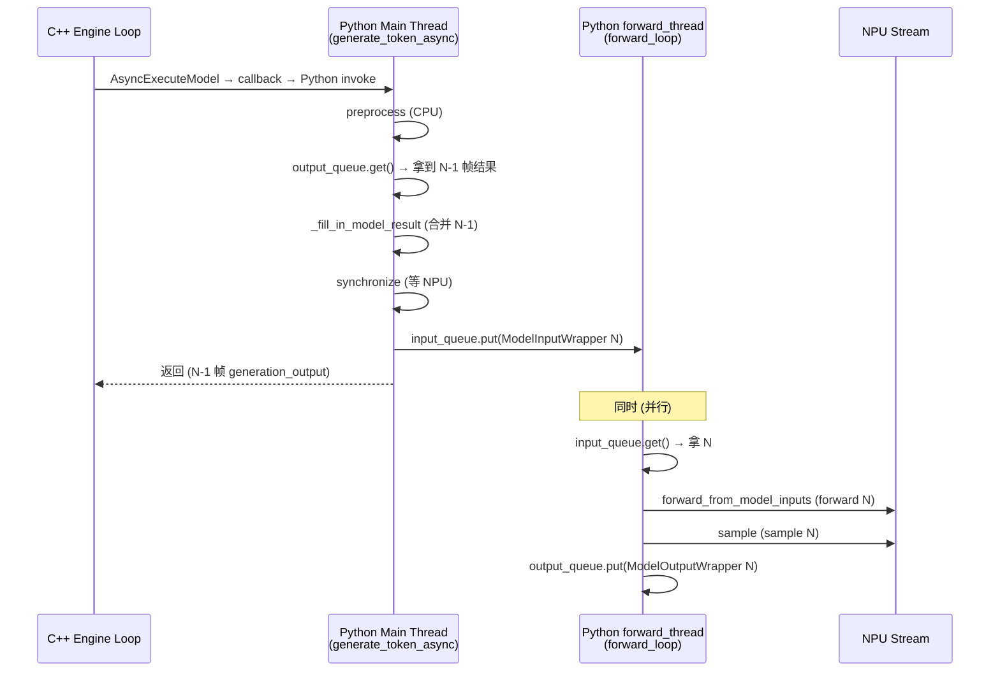
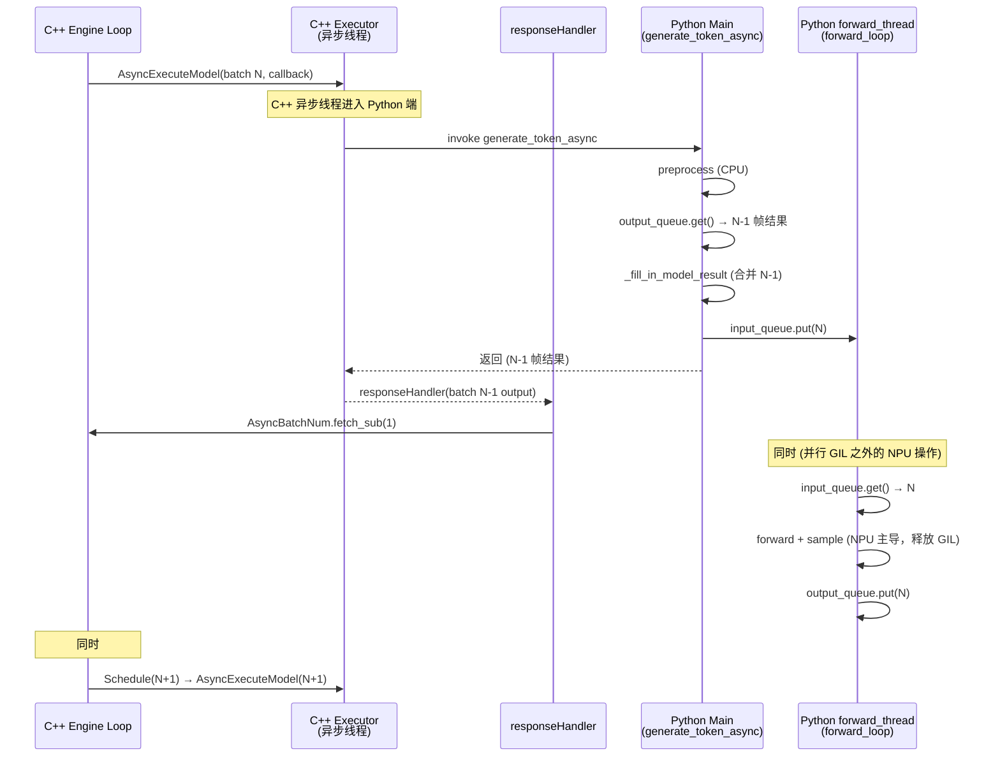
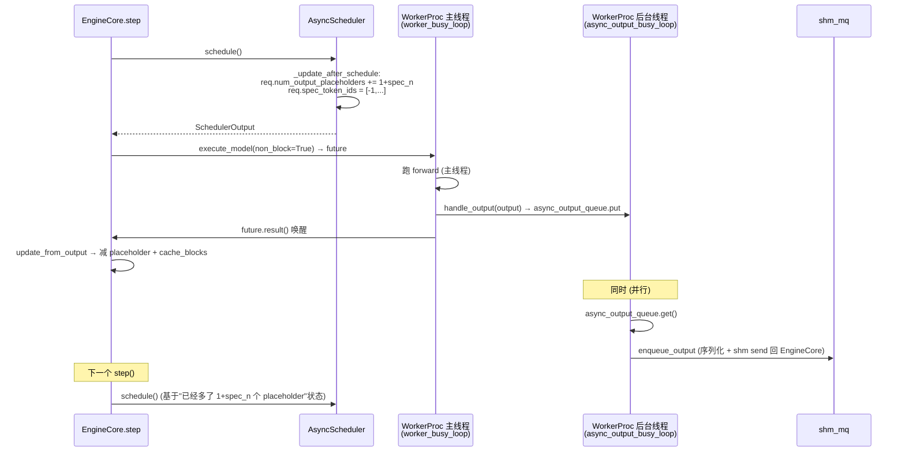
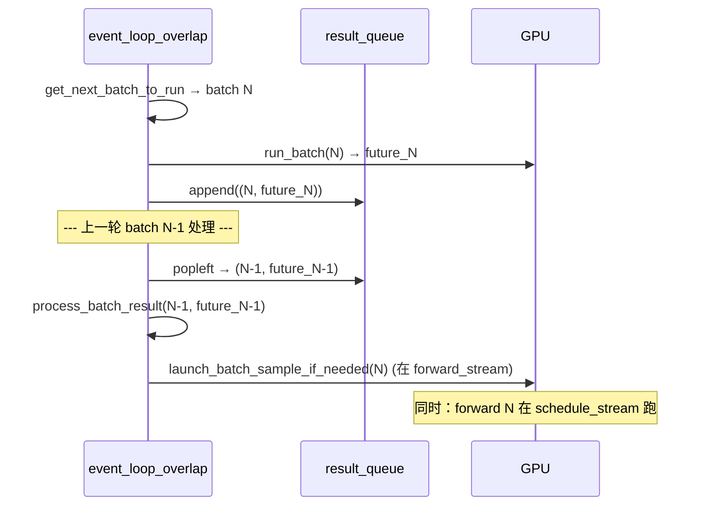

# Cross-project Comparison: Async-Schedule（CPU/GPU overlap 调度路径）

> 三项目 "**异步调度**（async schedule）路径"对比，是 [comparison/topics/sync-schedule.md](sync-schedule.md) 的对偶视角，深度展开 [comparison/topics/scheduler.md §5 CPU/GPU Overlap](scheduler.md) 子节。覆盖 [§dim-async-schedule](../dimensions.md)。
>
> **核心问题**：当 GPU 还在跑 batch N 的 forward 时，scheduler 能不能立刻**开始算 batch N+1**（让下一步的 CPU 调度决策与本步的 GPU 计算 overlap）？
>
> 三家答案都是 **能**，但实现机制截然不同：MindIE 用 **C++ AsyncExecute callback + in-flight 计数门控**；vLLM 用 **Python placeholder token + 子类**；SGLang 用 **`result_queue` deque + CUDA stream + 延迟 sample**。

---

## TL;DR

| 维度 | MindIE | vLLM | SGLang |
|---|---|---|---|
| **是否默认** | ❌ 默认 sync（`activateAsyncInference=false`） | ✅ 默认 async（auto-enable，[config/vllm.py:798-832](d:\design\vllm\vllm\config\vllm.py)） | ✅ 默认 overlap（`disable_overlap_schedule=False`） |
| **配置开关** | `activateAsyncInference=true` → `maxScheduledBatch_ = asyncScheduleRound + 1` | `scheduler_config.async_scheduling=True` → 用 `AsyncScheduler` 子类 | 不传 `--disable-overlap-schedule` → `dispatch_event_loop` 路由到 `event_loop_overlap` |
| **核心机制** | **3 层叠加**：(1) C++ `AsyncExecuteModel` callback + `GetAsyncBatchNum()` 计数（[llm_engine.cpp:613-624](d:\design\MindIE-LLM\src\engine\llm_engine.cpp)）；(2) **Python `PluginManager.forward_thread` + 双队列**（[plugin_manager.py:107-115](d:\design\MindIE-LLM\mindie_llm\text_generator\plugins\plugin_manager.py)）；(3) NPU stream | **3 层叠加**：(1) `AsyncScheduler` placeholder（[async_scheduler.py:32-35](d:\design\vllm\vllm\v1\core\sched\async_scheduler.py)）；(2) **`WorkerProc.async_output_copy_thread`**（[multiproc_executor.py:632-639](d:\design\vllm\vllm\v1\executor\multiproc_executor.py)）；(3) worker CUDA stream | **2 层**：(1) `result_queue: deque` + CUDA `forward_stream`；(2) 延迟 `launch_batch_sample_if_needed`（[scheduler.py:1414, 2888-2911](d:\design\sglang\python\sglang\srt\managers\scheduler.py)） |
| **In-flight batch 上限** | C++ 层 `maxScheduledBatch_=2`（layerwise PD 用 `maxDispatchBatchNum`）+ Python 层 1（`output_queue` 持有上一帧） | 1 batch + N 个 placeholder（无显式计数；spec_token 用 `[-1] * num_spec_tokens` 占位） | 1（result_queue 通常长 1，下一 iter 处理） |
| **类/函数切换** | **同一个 `Scheduler` 类**（C++ 层差异在 `maxScheduledBatch_` 数值）+ `PluginManager.__init__` 按 `async_inference` 分支起 forward thread | **`AsyncScheduler` 子类**（仅 61 行覆盖 2 个方法）+ `WorkerProc.__init__` 按 `async_scheduling` 起 output 线程 | **`event_loop_overlap` 函数**（独立 53 行实现） |
| **后台 Python 线程** | ✅ `forward_thread`（**跑 forward + sample**，[plugin_manager.py:809-976](d:\design\MindIE-LLM\mindie_llm\text_generator\plugins\plugin_manager.py)）+ C++ executor 异步线程 | ✅ `async_output_copy_thread`（**只跑 output 序列化与 shm send，不跑 forward**，[multiproc_executor.py:935-951](d:\design\vllm\vllm\v1\executor\multiproc_executor.py)） | ❌ 无（单 scheduler 线程，靠 CUDA stream 隐式并行） |
| **真异步 vs 逻辑异步** | **真异步**（C++ async callback + Python forward thread 都是真线程并行） | **混合**：scheduler 状态层"提前推进"（逻辑异步）+ WorkerProc 端 output 真背景线程；**forward 本身仍在 main worker thread** | **真异步**（用 CUDA stream + deque 实现 GPU forward 与 CPU 后处理 overlap） |
| **spec decode 集成** | 通过 `maxScheduledBatch_*tokenNumPerIter` 预留 placeholder（[scheduler.cpp:769](d:\design\MindIE-LLM\src\scheduler\scheduler.cpp)） | `_spec_token_placeholders = [-1] * num_spec_tokens`，worker 端 in-place 更新（[gpu_model_runner.py:591-593, 3329](d:\design\vllm\vllm\v1\worker\gpu_model_runner.py) `use_async_spec_decode`） | `is_disable_overlap_for_batch` **强制禁用**：spec v2 + grammar + decode + 队列非空（[scheduler.py:1486-1497](d:\design\sglang\python\sglang\srt\managers\scheduler.py)） |
| **per-batch 动态决策** | ❌ 无（全局开关） | ❌ 无（全局开关） | ✅ `is_disable_overlap_for_batch` 每 batch 决定是否 overlap（[scheduler.py:1466-1497](d:\design\sglang\python\sglang\srt\managers\scheduler.py)） |
| **失败处理** | C++ callback 失败抛 `runtime_error("The async execution failed.")`（[llm_engine.cpp:615-619](d:\design\MindIE-LLM\src\engine\llm_engine.cpp)） | preempt 时丢弃 `discard_latest_async_tokens`（[async_scheduler.py:40-44](d:\design\vllm\vllm\v1\core\sched\async_scheduler.py)） | result_queue 出错由 `process_batch_result` 内部处理 |

---

## 1. 配置开关与默认值（与 sync-schedule.md §1 镜像对照）

### MindIE async path
- 字段：`activateAsyncInference`（[config_info.h:171, 388, 429](d:\design\MindIE-LLM\src\include\config\config_info.h)）
- 默认值：`false`（**默认 sync**）。Python 端镜像 `ENV.async_inference` 写入 `model_config["async_inference"]`，init 时打 "Async inference is activated" 日志（[generator.py:319-323](d:\design\MindIE-LLM\mindie_llm\text_generator\generator.py)）。
- 启用效果（[scheduler.cpp:122-128](d:\design\MindIE-LLM\src\scheduler\scheduler.cpp)）：
  ```cpp
  uint32_t asyncScheduleRound = schedulerConfig_->layerwiseDisaggregated ?
                              schedulerConfig_->maxDispatchBatchNum : MAX_ASYNC_SCHEDULE_TIMES;
  if (schedulerConfig_->activateAsyncInference) {
      maxScheduledBatch_ = asyncScheduleRound + 1;  // 通常 = 2
  }
  ```
  - **常规模式**：`MAX_ASYNC_SCHEDULE_TIMES = 1` → `maxScheduledBatch_ = 2`（"异步单发"）
  - **layerwise PD 模式**：`maxDispatchBatchNum` 可配，可能 > 1（即"多发"）
- > [!todo] VERIFY: `MAX_ASYNC_SCHEDULE_TIMES` 常量值——本轮未直接 grep 到定义，从注释推断为 1。

### vLLM async path
- 字段：`SchedulerConfig.async_scheduling: bool | None = None`（[config/scheduler.py:146-149](d:\design\vllm\vllm\config\scheduler.py)）
- 默认值：**`None` → 走 auto 决策**：满足条件即 `True`（[config/vllm.py:831-832](d:\design\vllm\vllm\config\vllm.py)）。
- 类工厂：[config/scheduler.py:168-174](d:\design\vllm\vllm\config\scheduler.py) 根据 `async_scheduling` 选择 `AsyncScheduler` 或 `Scheduler`。
- Worker 端镜像：[gpu_model_runner.py:480](d:\design\vllm\vllm\v1\worker\gpu_model_runner.py) `self.use_async_scheduling = self.scheduler_config.async_scheduling`，影响以下 5 个子模块：
  | 子模块 | 行号 | 作用 |
  |---|---|---|
  | `use_async_spec_decode` | [gpu_model_runner.py:591-593](d:\design\vllm\vllm\v1\worker\gpu_model_runner.py) | spec decode 使用 placeholder draft token，worker in-place 写回 |
  | `prepare_inputs_event` + `async_output_copy_stream` | [gpu_model_runner.py:653-656](d:\design\vllm\vllm\v1\worker\gpu_model_runner.py) | 独立 CUDA stream 拷贝输出 |
  | `valid_sampled_token_count_event` | [gpu_model_runner.py:838-840](d:\design\vllm\vllm\v1\worker\gpu_model_runner.py) | 异步采样计数事件 |
  | `prev_num_draft_len` 处理 | [gpu_model_runner.py:1223](d:\design\vllm\vllm\v1\worker\gpu_model_runner.py) | 跨 step draft token 状态恢复 |
  | PP 接收上一步 sampled token | [gpu_model_runner.py:4122-4123](d:\design\vllm\vllm\v1\worker\gpu_model_runner.py) | `_pp_receive_prev_sampled_token_ids_to_input_batch` |

### SGLang async path
- 字段：`ServerArgs.disable_overlap_schedule: bool = False`（[server_args.py:639](d:\design\sglang\python\sglang\srt\server_args.py)）。**默认 overlap 开**。
- Scheduler 内镜像：`self.enable_overlap = not server_args.disable_overlap_schedule`（[scheduler.py:376](d:\design\sglang\python\sglang\srt\managers\scheduler.py)）。
- TpModelWorker 内镜像：[tp_worker.py:318](d:\design\sglang\python\sglang\srt\managers\tp_worker.py)。
- dispatch 入口：[scheduler.py:3637-3640](d:\design\sglang\python\sglang\srt\managers\scheduler.py)
  ```python
  if disaggregation_mode == DisaggregationMode.NULL:
      if scheduler.enable_pdmux:        scheduler.event_loop_pdmux()
      elif server_args.pp_size > 1:     scheduler.event_loop_pp()
      elif scheduler.enable_overlap:    scheduler.event_loop_overlap()    # ← async
      else:                             scheduler.event_loop_normal()
  ```

> synthesis: **三家"async 默认性"梯度**——MindIE 默认 sync（async 是 opt-in），vLLM/SGLang 默认 async（sync 是 fallback）。这反映了三家对"何时 overlap 是安全的"的判断不同：MindIE 保守（要用户显式启用），vLLM 激进 + 用 4 条 if/elif 自动 disable（[config/vllm.py:798-832](d:\design\vllm\vllm\config\vllm.py)），SGLang 最激进 + 10+ 条件自动 fallback。

---

## 2. In-flight batch 上限与 placeholder 机制

| 项目 | 显式计数 | 上限 | placeholder 机制 |
|---|---|---|---|
| MindIE | ✅ `enginePerDP->modelExecOutputHandler->GetAsyncBatchNum()` 原子计数（[llm_engine.cpp:497, 624, 635](d:\design\MindIE-LLM\src\engine\llm_engine.cpp)） | `asyncScheduleRound`（默认 1，layerwise PD 可配）→ `maxScheduledBatch_=2` | placeholder token 数量预留：`maxPlaceHolderNum = maxScheduledBatch_ * tokenNumPerIter + tokenNumPerIter`（[scheduler.cpp:769](d:\design\MindIE-LLM\src\scheduler\scheduler.cpp)）；`PrepareNextSchedule` 累加 computed token + 加占位（[scheduler.h:96](d:\design\MindIE-LLM\src\scheduler\scheduler.h)） |
| vLLM | ❌ 无显式 in-flight batch 计数 | scheduler 层 1 batch；worker 层多 stream | `request.num_output_placeholders` 字段（每 req 一个计数）；`AsyncScheduler._update_after_schedule` 调用 `request.num_output_placeholders += 1 + cur_num_spec_tokens`（[async_scheduler.py:32](d:\design\vllm\vllm\v1\core\sched\async_scheduler.py)）；`spec_token_ids = self._spec_token_placeholders`（共享读 list `[-1] * num_spec_tokens`，[async_scheduler.py:35](d:\design\vllm\vllm\v1\core\sched\async_scheduler.py)） |
| SGLang | ✅ `result_queue: deque` 长度 = in-flight batch 数 | 1（`result_queue` 通常长 1；下一 iter 立即 `popleft`） | 不用 placeholder token；用 CUDA Future + `delay_sample_func`（[scheduler.py:2898-2911](d:\design\sglang\python\sglang\srt\managers\scheduler.py)） |

> synthesis: **三家上限实现的本质差异**：
> - **MindIE**：上限是 *batch 数*（"本时刻 GPU 上 + 队列里 + executor 队里 共多少个 batch"）。门控简单，但 batch 粒度。
> - **vLLM**：上限是 *placeholder token 数*（"未结束的 token 占位多少个"）。可以同时容纳多个 req 的 placeholder，更细粒度。
> - **SGLang**：上限是 *result_queue 深度*（"上一 batch 的 forward 结果还没 process_batch_result 处理完"）。

---

## 3. 主循环代码（三家）

### MindIE — `LlmEngine` C++ 主循环 async 路径（[llm_engine.cpp:485-645](d:\design\MindIE-LLM\src\engine\llm_engine.cpp)）

```cpp
while (...) {
    ScheduleExecTransfer(enginePerDP);                       // PD KV 调度
    ...
    uint32_t asyncScheduleRound = schedulerConfig_->layerwiseDisaggregated ?
                             schedulerConfig_->maxDispatchBatchNum : MAX_ASYNC_SCHEDULE_TIMES;

    // 关键：in-flight batch 计数门控
    if (enginePerDP->modelExecOutputHandler->GetAsyncBatchNum() >= asyncScheduleRound ||
        enginePerDP->lastScheduleEmpty) {                    // L497
        std::this_thread::sleep_for(milliseconds(DEFAULT_SLEEP_TIME_BETWEEN_TWO_ITER));
        continue;
    }
    // 否则：可以继续调度下一 batch
    ...
    auto [seqGroupMetadata, scheduleOut] = enginePerDP->scheduler->Schedule(needSync);
    ...
    auto responseHandler = [this, enginePerDP](ModelBatchResultSPtr output) {     // L575
        if (output->has_err_msg() && output->err_msg() != "") {
            PauseScheduling();
            return;
        }
        enginePerDP->modelExecOutputHandler->Entry4Executor(output);
    };
    ...
    bool succ = enginePerDP->modelExecutor->AsyncExecuteModel(                    // L613
        request, std::function<void(ModelBatchResultSPtr)>(responseHandler));
    if (!succ) throw runtime_error("The async execution failed.Check logs.");

    enginePerDP->scheduler->PrepareNextSchedule(scheduleOut.scheduledSeqGroups_); // L623
    enginePerDP->modelExecOutputHandler->GetAsyncBatchNum().fetch_add(1);         // L624
}
```

要点：
- **真异步**：`AsyncExecuteModel` 立刻返回，executor 在另一线程跑 forward，结果通过 callback `responseHandler` 推回
- **门控**：调度器自己在循环开头检查 `GetAsyncBatchNum() >= asyncScheduleRound`，超了 sleep + continue
- **PrepareNextSchedule** 在 `AsyncExecuteModel` 返回 *之后立刻* 调用——给本批已 schedule 的 req 加 placeholder + 累加 computed token，**让下一轮 `Schedule(needSync)` 决策基于"假设这批已经完成"的状态**

#### MindIE Python 层补充：`PluginManager.forward_thread` + 双队列（[plugin_manager.py:107-115, 354-548, 809-976](d:\design\MindIE-LLM\mindie_llm\text_generator\plugins\plugin_manager.py)）

> ⚠️ 重要补充：MindIE 的 async 不只在 C++ 层，**Python 层 `PluginManager` 自己也起了一个独立的 forward 线程**。这是被 C++ `AsyncExecuteModel` 反向回调进 Python 之后、真正跑 forward 的地方。

`PluginManager.__init__` ([plugin_manager.py:107-115](d:\design\MindIE-LLM\mindie_llm\text_generator\plugins\plugin_manager.py))：

```python
if self.async_inference:
    self.input_queue = queue.Queue()
    self.output_queue = queue.Queue()
    self.output_queue.put(ModelOutputWrapper.make_empty())   # 预填空 wrapper, 第一帧不阻塞
    self.forward_thread = CoreThread(
        target=self.forward_loop, daemon=True, name="async_forward"
    )
    self.forward_thread.start()
    self.execution_stream = torch.npu.current_stream()
```

**两条线程的分工**：

| 角色 | 主线程（`generate_token_async`） | 后台线程（`forward_loop`） |
|---|---|---|
| **代码位置** | [plugin_manager.py:354-548](d:\design\MindIE-LLM\mindie_llm\text_generator\plugins\plugin_manager.py) | [plugin_manager.py:809-976](d:\design\MindIE-LLM\mindie_llm\text_generator\plugins\plugin_manager.py) |
| **职责** | preprocess / pop output_queue（拿**上一帧**结果）/ fill_in / NPU sync / put input_queue（推**本帧**输入） | get input_queue（拿**本帧**输入）/ structured output bitmask / forward / sample / verify / put output_queue（推**本帧**结果） |

**关键时序**（与 C++ 异步交叠）：



要点：
- **第 N 帧 forward 在后台线程跑的同时，主线程已经在做第 N-1 帧的后处理 + 第 N+1 帧的 preprocess**
- `output_queue.get(timeout=900)` ([plugin_manager.py:456](d:\design\MindIE-LLM\mindie_llm\text_generator\plugins\plugin_manager.py)) 是主线程的等待点——拿上一帧结果
- `input_queue.put(...)` ([plugin_manager.py:505](d:\design\MindIE-LLM\mindie_llm\text_generator\plugins\plugin_manager.py)) 是把本帧推给 forward thread
- 第一帧的"上一帧结果"是 init 时预填的 `ModelOutputWrapper.make_empty()`，避免 deadlock
- `model_input_wrapper.postprocess_done = threading.Event()` ([plugin_manager.py:441-450](d:\design\MindIE-LLM\mindie_llm\text_generator\plugins\plugin_manager.py)) 用于跨帧同步：forward thread 在 sample 完后等 main thread postprocess 完再继续（[plugin_manager.py:877-878](d:\design\MindIE-LLM\mindie_llm\text_generator\plugins\plugin_manager.py)）
- structured output bitmask 在 **forward thread 内** build（[plugin_manager.py:818-832](d:\design\MindIE-LLM\mindie_llm\text_generator\plugins\plugin_manager.py)），与 forward 在同一时序，避免 main thread 阻塞

> synthesis: **MindIE 的 async 其实是"两层背景执行"叠加**：(a) C++ executor 异步线程，(b) Python plugin_manager 内部 forward 线程。两层各自有自己的"流水深度"——C++ 层 1-step ahead（`maxScheduledBatch_=2`），Python 层 1-step ahead（output_queue 持有上一帧）。两者**叠加后**，从用户请求视角看，平均有 ~2-3 帧并发执行。

> 详细 entity 页：[mindie/entities/PluginManager.md](../../mindie/entities/PluginManager.md)（Python 层 forward thread + 双队列）+ [mindie/entities/LlmEngine.md](../../mindie/entities/LlmEngine.md)（C++ executor 异步线程 + AsyncExecuteModel callback）。

### vLLM — `EngineCore.step()` + `AsyncScheduler`

`EngineCore.step()` 在 sync/async 路径**完全相同**（[core.py:404-433](d:\design\vllm\vllm\v1\engine\core.py)）：

```python
def step(self) -> tuple[dict[int, EngineCoreOutputs], bool]:
    if not self.scheduler.has_requests(): return {}, False
    scheduler_output = self.scheduler.schedule()                              # → AsyncScheduler.schedule()
    future = self.model_executor.execute_model(scheduler_output, non_block=True)
    grammar_output = self.scheduler.get_grammar_bitmask(scheduler_output)
    with (self.log_error_detail(scheduler_output), self.log_iteration_details(scheduler_output)):
        model_output = future.result()                                        # 仍然 await！
        if model_output is None:
            model_output = self.model_executor.sample_tokens(grammar_output)
    self._process_aborts_queue()
    engine_core_outputs = self.scheduler.update_from_output(scheduler_output, model_output)
    return engine_core_outputs, scheduler_output.total_num_scheduled_tokens > 0
```

**那么 async 是怎么做到 overlap 的？关键在 `AsyncScheduler.schedule()` 内部**：

[async_scheduler.py:18-35](d:\design\vllm\vllm\v1\core\sched\async_scheduler.py) `_update_after_schedule` 在 schedule 完成后**立刻**调用：

```python
def _update_after_schedule(self, scheduler_output: SchedulerOutput) -> None:
    super()._update_after_schedule(scheduler_output)
    spec_decode_tokens = scheduler_output.scheduled_spec_decode_tokens
    for req_id in scheduler_output.num_scheduled_tokens:
        request = self.requests[req_id]
        if request.is_prefill_chunk:
            continue
        scheduler_output.pending_structured_output_tokens |= (
            request.use_structured_output and request.num_output_placeholders > 0
        )
        cur_num_spec_tokens = len(spec_decode_tokens.get(req_id, ()))
        request.num_output_placeholders += 1 + cur_num_spec_tokens   # 占位计数 +N
        request.spec_token_ids = self._spec_token_placeholders        # 共享 [-1, ...] list
```

**关键洞察**（synthesis）：vLLM 的 async **不是 EngineCore 多线程**，而是 **scheduler 状态层的"提前推进"** + **worker 端的输出异步线程**：
- 同一个 `step()` 内 `future.result()` 仍然 await
- 但 `AsyncScheduler.schedule()` 在返回 `scheduler_output` 之前就给每个被调度的 req 加了 placeholder
- 这让**下一个 `step()` 调用 `schedule()` 时**，看到的 req 状态是"已经多生成了 N 个 token"，从而可以立刻为下一步算 token_budget——即使本步的 token 还没真正生成
- 真正的 overlap 来自**两层**：(a) **worker CUDA stream**（`async_output_copy_stream` + `prepare_inputs_event`，[gpu_model_runner.py:650-656](d:\design\vllm\vllm\v1\worker\gpu_model_runner.py)），(b) **WorkerProc 后台输出线程**（见下方补充）

`_update_request_with_output`（[async_scheduler.py:37-60](d:\design\vllm\vllm\v1\core\sched\async_scheduler.py)）配套处理实际 token 到达时的状态调整：
- 减 `num_output_placeholders -= len(new_token_ids)`
- 处理 `discard_latest_async_tokens=True` 的 preempt 场景（重置 force preempt）
- 真正的 `kv_cache_manager.cache_blocks` 在这里调用（不是 schedule 时）

#### vLLM Worker 层补充：`WorkerProc.async_output_copy_thread` + `async_output_queue`（[multiproc_executor.py:629-639, 925-951](d:\design\vllm\vllm\v1\executor\multiproc_executor.py)）

> ⚠️ 重要补充：vLLM 的 async 不只在 scheduler 状态层，**MultiprocExecutor 的每个 WorkerProc 也起一个独立的"输出处理"后台线程**。这是 forward 完成后做 output 序列化与跨进程传输的地方。

`WorkerProc.__init__` ([multiproc_executor.py:629-639](d:\design\vllm\vllm\v1\executor\multiproc_executor.py))：

```python
scheduler_config = vllm_config.scheduler_config
self.use_async_scheduling = scheduler_config.async_scheduling
if self.use_async_scheduling:
    self.async_output_queue: queue.Queue = queue.Queue()
    self.async_output_copy_thread = Thread(
        target=self.async_output_busy_loop,
        daemon=True,
        name="WorkerAsyncOutputCopy",
    )
    self.async_output_copy_thread.start()
```

**两条线程的分工**（与 MindIE 对照）：

| 角色 | 主 worker 线程（`worker_busy_loop`） | 后台线程（`async_output_busy_loop`） |
|---|---|---|
| **代码位置** | [multiproc_executor.py:953-979](d:\design\vllm\vllm\v1\executor\multiproc_executor.py) | [multiproc_executor.py:935-951](d:\design\vllm\vllm\v1\executor\multiproc_executor.py) |
| **职责** | rpc dequeue / **跑 forward**（同步） / 调 `handle_output(output)` | dequeue `async_output_queue` / `enqueue_output`（**输出序列化 + shm send 回 scheduler**） |

`handle_output` 的分流（[multiproc_executor.py:925-933](d:\design\vllm\vllm\v1\executor\multiproc_executor.py)）：

```python
def handle_output(self, output: Any):
    if self.use_async_scheduling:
        self.async_output_queue.put(output)        # async: 推到后台线程
    else:
        self.enqueue_output(output)                 # sync: 主线程直接发回
```

要点：
- **vLLM 后台线程只做 output 处理，forward 仍在主 worker 线程**——与 MindIE "forward thread" 完全相反
- 这反映两家不同的优化目标：
  - **MindIE**：用后台线程跑 forward，把 forward 与 preprocess overlap（瓶颈在 preprocess）
  - **vLLM**：用后台线程跑 output 序列化 / shm send，把"output 跨进程传输"与"下一次 forward"overlap（瓶颈在跨进程通信）
- vLLM `worker_busy_loop` 即使 sync 模式也存在，async 只是多挂了一个 output 线程；MindIE Python 层的 forward thread 是 async 模式专属

> [!todo] VERIFY: Ray executor 端是否有等价的 `async_output_copy_thread`（grep 显示 ray_utils.py 仅注释提到 background thread，但实际是 Ray actor 模型，不是 Python Thread）。

### SGLang — `event_loop_overlap`（[scheduler.py:1411-1464](d:\design\sglang\python\sglang\srt\managers\scheduler.py)）

```python
@DynamicGradMode()
def event_loop_overlap(self):
    """A scheduler loop that overlaps the CPU processing and GPU computation."""
    self.result_queue: Deque[Tuple[ScheduleBatch, Union[GenerationBatchResult, EmbeddingBatchResult]]] = deque()

    def pop_and_process():
        tmp_batch, tmp_result = self.result_queue.popleft()
        self.process_batch_result(tmp_batch, tmp_result)

    while True:
        recv_reqs = self.recv_requests()
        self.process_input_requests(recv_reqs)
        if self._engine_paused: continue

        batch = self.get_next_batch_to_run()
        self.cur_batch = batch
        disable_overlap_for_batch = self.is_disable_overlap_for_batch(batch)

        # 如果本 batch 不能 overlap，立即处理上一 batch
        if disable_overlap_for_batch:
            pop_and_process()

        # Launch the current batch
        if batch:
            batch_result = self.run_batch(batch)             # 异步 launch（返 GenerationBatchResult, 含 future）
            self.result_queue.append((batch.copy(), batch_result))
        else:
            batch_result = None
            self.cancel_bubble_timer()

        # Process the last batch (在本 batch run 之后)
        if self.last_batch:
            if not disable_overlap_for_batch:
                pop_and_process()
        elif batch is None:
            self.on_idle()

        # Run sample of the current batch (依赖上一 batch 处理结果，如 grammar)
        if self.is_generation:
            self.launch_batch_sample_if_needed(batch_result)

        self.last_batch = batch
        ...
```

要点：
- **三段流水**：`run_batch(本)` → `process_batch_result(上)` → `launch_batch_sample_if_needed(本)`
- `run_batch` 是 **异步 launch**（用 CUDA stream 把 forward kernel 提交后立刻返回 future），不阻塞 CPU
- `process_batch_result` 用上一 batch 已完成的 result 做 CPU 后处理（detokenize / metrics / 发给 detokenizer）
- `launch_batch_sample_if_needed` 把 sample 推迟到上一 batch 的 grammar 信息 ready 后再做（[scheduler.py:2888-2911](d:\design\sglang\python\sglang\srt\managers\scheduler.py)）

`launch_batch_sample_if_needed`（[scheduler.py:2888-2911](d:\design\sglang\python\sglang\srt\managers\scheduler.py)）核心：

```python
def launch_batch_sample_if_needed(self, batch_result):
    if batch_result is None or batch_result.delay_sample_func is None:
        return

    with self.forward_stream_ctx:                    # 切到 forward CUDA stream
        self.forward_stream.wait_stream(self.schedule_stream)
        _batch_result = batch_result.delay_sample_func()
        self.future_map.store_to_map(batch_result.future_indices, batch_result)
        batch_result.copy_to_cpu(return_logprob=self.cur_batch.return_logprob)

    # 显式释放 closure 与大 GPU 张量，防 VRAM 泄漏（注释明示 structured output 场景）
    batch_result.delay_sample_func = None
    if batch_result.logits_output is not None:
        batch_result.logits_output.next_token_logits = None
```

---

## 4. 关键 async 行为对比表

| 行为 | MindIE async | vLLM async | SGLang async |
|---|---|---|---|
| **真异步执行** | ✅ C++ `AsyncExecuteModel` + callback（[llm_engine.cpp:613-624](d:\design\MindIE-LLM\src\engine\llm_engine.cpp)） | ❌ Python `step()` 仍 await `future.result()`；async 在 scheduler 状态层（[async_scheduler.py:32-35](d:\design\vllm\vllm\v1\core\sched\async_scheduler.py)） | ✅ CUDA stream + `result_queue`（[scheduler.py:1414-1464](d:\design\sglang\python\sglang\srt\managers\scheduler.py)） |
| **scheduler 是否需要等 forward 完成** | ❌ 不等（callback 推回） | ❌ 不等（用 placeholder 提前推进状态） | ❌ 不等（result_queue 异步） |
| **placeholder 数据形态** | C++ 端逻辑 placeholder（`PrepareNextSchedule` 内部） | Python `request.num_output_placeholders: int` + 共享 read-only list `[-1] * num_spec_tokens`（[async_scheduler.py:16](d:\design\vllm\vllm\v1\core\sched\async_scheduler.py)） | 不需要 placeholder（result_queue 持有真实 future） |
| **spec decode 处理** | placeholder 预留长度为 `tokenNumPerIter` 倍数（[scheduler.cpp:769, 881-883](d:\design\MindIE-LLM\src\scheduler\scheduler.cpp)） | `_spec_token_placeholders = [-1] * num_spec_tokens`，**worker 端 in-place 改写真实 draft token**（[gpu_model_runner.py:1223, 3329-3331](d:\design\vllm\vllm\v1\worker\gpu_model_runner.py) `update_async_spec_token_ids`） | **强制禁用 overlap**（spec v2 + grammar + decode + 队列非空，[scheduler.py:1489-1495](d:\design\sglang\python\sglang\srt\managers\scheduler.py)） |
| **structured output 处理** | TODO（未在本次 ingest 范围内） | `pending_structured_output_tokens` flag（[async_scheduler.py:26-28](d:\design\vllm\vllm\v1\core\sched\async_scheduler.py)） | `is_disable_overlap_for_batch` 在 spec v2 + grammar + decode 时禁用 |
| **抢占场景的 placeholder 清理** | abort 时由 `CollectAndClearAbortedParallelSeqGroups` 处理（[scheduler.h:61](d:\design\MindIE-LLM\src\scheduler\scheduler.h)） | `discard_latest_async_tokens=True` 时丢掉最新 async token（[async_scheduler.py:40-44](d:\design\vllm\vllm\v1\core\sched\async_scheduler.py)） | 由 `process_batch_result` 处理（队列里旧 batch 仍会被消费） |
| **per-batch 动态决策** | ❌ 无 | ❌ 无 | ✅ `is_disable_overlap_for_batch`（[scheduler.py:1466-1497](d:\design\sglang\python\sglang\srt\managers\scheduler.py)）：(a) 连续两 prefill + env `SGLANG_DISABLE_CONSECUTIVE_PREFILL_OVERLAP`；(b) spec v2 + grammar + decode + 队列非空 |
| **失败处理** | `AsyncExecuteModel` 返 false → `throw runtime_error`，注释："异步调用失败是代码bug或者系统故障"（[llm_engine.cpp:615-619](d:\design\MindIE-LLM\src\engine\llm_engine.cpp)） | preempt 时 `discard_latest_async_tokens` 清理 | result_queue 出错由 `process_batch_result` 内部抛 |
| **空批处理** | `lastScheduleEmpty=true` 时 sleep + continue（[llm_engine.cpp:497-501, 644](d:\design\MindIE-LLM\src\engine\llm_engine.cpp)） | scheduler 直接返 `({}, False)`（[core.py:413-414](d:\design\vllm\vllm\v1\engine\core.py)） | `on_idle()` 做自检 + 重置（[scheduler.py:1454](d:\design\sglang\python\sglang\srt\managers\scheduler.py)） |

---

## 5. 三种 overlap 范式（synthesis）

> 这是本页的核心 takeaway。三家 async 走的是**完全不同**的范式。**关键修正（2026-04-18 verify pass）**：MindIE 与 vLLM 都有真背景 Python 线程，区别在于线程跑的"东西"不同——MindIE 跑 forward，vLLM 跑 output 序列化。SGLang 是唯一不靠 Python 多线程、纯靠 CUDA stream + queue 的方案。

### 范式 A：MindIE = "C++ executor 异步 + Python forward 线程双层叠加"



- **优势**：3 层叠加（C++ executor 线程 + Python forward 线程 + NPU stream），forward 与 preprocess **完全 decouple**
- **代价**：双队列 + `postprocess_done` Event + `make_empty()` 占位等"流水管理"复杂；调试难度高；对 GIL 敏感（Python 后处理不能太重）
- **适用场景**：preprocess 较重（如 splitfuse / structured output bitmask 在 forward thread 内）+ NPU forward 与 NPU 设备无关的 CPU 操作能 overlap

### 范式 B：vLLM = "Scheduler placeholder + Worker output 线程"



- **优势**：scheduler 状态层"提前推进"让下一次 schedule 不用等真实 token；WorkerProc 后台线程让 output 序列化与下次 forward overlap；总代码量 < MindIE
- **代价**：forward 仍在 main worker thread 跑（不像 MindIE 真背景跑 forward）；scheduler 与 worker 之间状态同步复杂（placeholder 与 real token 对账）；preempt 场景需要 `discard_latest_async_tokens` 等特殊清理
- **适用场景**：跨进程 IPC 是瓶颈（大 DP / 多 worker shm 流量大）+ Python preprocess 不重

### 范式 C：SGLang = "Result Queue 三段流水"



- **优势**：每 batch 可独立决定是否 overlap（`is_disable_overlap_for_batch`）；`launch_batch_sample_if_needed` 提供 sample-level deferred；显式清理 closure 防 VRAM 泄漏
- **代价**：禁用 overlap 的条件清单需要持续维护（每加一个新 feature 都要检查兼容性）

---

## 6. 线程模型对照（关键修正）

> 这一节是对前作 [comparison/topics/scheduler.md §5](scheduler.md) 与本页早期版本的**修正**——之前误把 vLLM 描述为"无背景线程纯逻辑异步"，把 MindIE 描述为"仅 C++ 异步"，**两个都不准**。

| 项目 | Python 主线程 | Python 背景线程 | C++ 异步线程 | CUDA/NPU stream |
|---|---|---|---|---|
| **MindIE** | `Generator.generate_token` → `PluginManager.generate_token_async`：preprocess + queue 调度 | ✅ **`forward_thread`**（[plugin_manager.py:111](d:\design\MindIE-LLM\mindie_llm\text_generator\plugins\plugin_manager.py)）：跑 forward + sample + structured output bitmask + verify | ✅ executor 异步线程：`AsyncExecuteModel` callback；C++ engine loop 跑 `Schedule(needSync)` | ✅ `execution_stream = torch.npu.current_stream()`（[plugin_manager.py:115](d:\design\MindIE-LLM\mindie_llm\text_generator\plugins\plugin_manager.py)）共享给 forward thread |
| **vLLM** | EngineCore：`step()` → `schedule()` → `execute_model(non_block=True)` → `future.result()` | (在 EngineCore 端) ❌；(在 WorkerProc 端) ✅ **`async_output_copy_thread`**（[multiproc_executor.py:634-639](d:\design\vllm\vllm\v1\executor\multiproc_executor.py)）：跑 output 序列化 + shm send | ❌ 无 | ✅ `async_output_copy_stream` + `valid_sampled_token_count_copy_stream`（[gpu_model_runner.py:650-656, 838-840](d:\design\vllm\vllm\v1\worker\gpu_model_runner.py)） |
| **SGLang** | scheduler 子进程：`event_loop_overlap` 单线程跑全部 | ❌ 无 | ❌ 无 | ✅ `schedule_stream` + `forward_stream`（`launch_batch_sample_if_needed` 用 `forward_stream_ctx`，[scheduler.py:2896](d:\design\sglang\python\sglang\srt\managers\scheduler.py)） |

**关键观察**（synthesis）：

1. **MindIE Python 端 forward thread 与 C++ executor 异步线程是 *叠加* 的两层**——不是替代关系。一个 C++ executor 异步调用 invoke 进 Python 后，又走 Python 内部的 forward thread 异步处理。
2. **vLLM 的 Python 背景线程在 WorkerProc 端，不在 EngineCore 端**——这是常见误解。`EngineCore.step()` 永远是单线程同步执行，async 的"并行"在两个地方：(a) WorkerProc.async_output_copy_thread；(b) AsyncScheduler 的状态推进让下一次 `schedule()` 不必等 forward 完成。
3. **SGLang 唯一不靠 Python 多线程**——所有 overlap 都在 CUDA stream 层面隐式发生（`forward_stream` 与 `schedule_stream` 各自跑各自的 NPU/CUDA 操作）。这受益于 CUDA 异步执行模型，但要求 sample 必须能 schedule 到独立 stream。

**为什么三家选不同方案？**（synthesis）

| 选择 | 倾向 |
|---|---|
| MindIE：Python forward thread | NPU 推理本身释放 GIL；preprocess/postprocess 也较重；C++ 端已有完整 async executor |
| vLLM：仅 output 线程 | EngineCore 必须 single-threaded（因 GIL + scheduler 状态非线程安全）；shm IPC 序列化是真正瓶颈 |
| SGLang：仅 CUDA stream | scheduler 子进程模型已经够轻量；额外 Python 线程对单进程意义不大；CUDA stream 编程模型清晰 |

---

## 7. spec decode + structured output 三家协议对照

> 这是 async 场景下最容易出 bug 的组合（spec decode 需要先生成 draft token、structured output 需要在 sample 时应用 grammar bitmask）。

| 项目 | 处理策略 | 锚点 |
|---|---|---|
| MindIE | placeholder token 长度按 `tokenNumPerIter`（= `1 + speculationGamma`）预留；replace placeholder with real token（[scheduler.cpp:881-883](d:\design\MindIE-LLM\src\scheduler\scheduler.cpp), [scheduler.h:308-316](d:\design\MindIE-LLM\src\scheduler\scheduler.h) `TrailingPlaceholderTokenCount` / `ReplacePlaceHolderWithToken`） | C++ 侧统一 placeholder 长度 |
| vLLM | (a) `_spec_token_placeholders = [-1] * num_spec_tokens` 共享 read-only list 避免每次创建（[async_scheduler.py:16](d:\design\vllm\vllm\v1\core\sched\async_scheduler.py)）；(b) worker 端 `use_async_spec_decode` 路径，draft token 由 worker in-place 写回（[gpu_model_runner.py:591-593](d:\design\vllm\vllm\v1\worker\gpu_model_runner.py)）；(c) structured output 用 `pending_structured_output_tokens` flag 避免在 placeholder 上下文应用 grammar | 双层防护 |
| SGLang | **直接禁用** overlap：`need_grammar_sync = batch.is_spec_v2 and batch.has_grammar and batch.forward_mode.is_decode() and len(self.result_queue) > 0`（[scheduler.py:1489-1495](d:\design\sglang\python\sglang\srt\managers\scheduler.py)），代码注释 "we do not support overlap + spec + grammar yet" | 简单直接但牺牲性能 |

> synthesis: **MindIE 与 vLLM 都"硬扛" spec+grammar+overlap，SGLang 选择"不扛"直接禁用**。SGLang 的代码注释明示 "TODO(lsyin): support overlap + spec + grammar"——表明这是个已知限制，未来会改。短期对你的实际影响：如果 PD 部署使用 spec decode + structured output，SGLang 的 P50 latency 会因为强制 sync 而增加。

---

## 8. 与你 PD 优化的关联（synthesis）

> 注意：本节是综合性建议，不是任何一方源码原文。

### 选择 async 还是 sync？

如果你的 MindIE PD 部署当前在 sync 模式，**强烈考虑切到 async**：
1. **MindIE async 是真异步**（C++ 线程级），不像 vLLM 那种"状态级 placeholder 异步"。GPU 与 CPU 并行真正生效，预期吞吐提升 10-30%（depend on schedule 与 forward 时长比）。
2. 切换方式：`asyncBatchscheduler=true` 配置（[llm_manager_impl.cpp:1240](d:\design\MindIE-LLM\src\llm_manager_v2\impl\llm_manager_impl.cpp)）→ Python 端 `ENV.async_inference=true`。

### 如果 PD + async 出问题怎么诊断？

按"门控点"逐层排查：

| 症状 | 看哪 | 修法方向 |
|---|---|---|
| GPU 利用率仍低（async 没生效） | grep `MAX_ASYNC_SCHEDULE_TIMES` 与 `maxScheduledBatch_` 实际值 | 提高 layerwise PD 的 `maxDispatchBatchNum` |
| in-flight batch 频繁卡在 sleep | `GetAsyncBatchNum() >= asyncScheduleRound` 触发的 sleep（[llm_engine.cpp:497-501](d:\design\MindIE-LLM\src\engine\llm_engine.cpp)） | 表明 forward 比 schedule 慢，async 价值有限——优化 forward 优先 |
| spec decode 异常（accept rate 低） | placeholder 预留长度（[scheduler.cpp:769](d:\design\MindIE-LLM\src\scheduler\scheduler.cpp)） | 检查 `tokenNumPerIter` 与 `speculationGamma` 配置 |
| Layerwise PD 性能波动 | `LayerwiseDecidePDPriority` / `LayerwiseDecidePDelay`（[scheduler.h:301-303](d:\design\MindIE-LLM\src\scheduler\scheduler.h)） | layerwise PD 路径独立的优先级决策有自己的逻辑，与全局 priority 不一致 |

### 跨项目可借鉴

- **从 SGLang 借鉴 per-batch 动态决策**（[`is_disable_overlap_for_batch`](d:\design\sglang\python\sglang\srt\managers\scheduler.py)）：MindIE 当前是全局 sync/async 开关，没有 per-batch 决策。如果你的负载有"长 prompt 偶发"特征，借鉴 SGLang 的"连续两个 prefill 不 overlap 改 TTFT"思路可能有用。
- **从 vLLM 借鉴 worker 端 CUDA stream 优化**（[gpu_model_runner.py:653-656](d:\design\vllm\vllm\v1\worker\gpu_model_runner.py) `async_output_copy_stream` + `prepare_inputs_event`）：MindIE C++ 端的 forward 后处理（拷贝 logits 到 CPU、更新 KV cache）如果在主 stream 上做，会阻塞下一次 forward。独立 stream + event 是常见优化。
- **从 SGLang 借鉴 sample 延迟**（[`launch_batch_sample_if_needed`](d:\design\sglang\python\sglang\srt\managers\scheduler.py)）：把 sample 推迟到下一 step 开始前做，而不是在 forward 完立即做。这给 spec V2 + structured output 留出空间。

---

## 9. 三家 async 默认值汇总

| 项目 | async 是否默认 | 触发 async 的方式 | 锚点 |
|---|---|---|---|
| MindIE | ❌ **默认 sync** | 设 `asyncBatchscheduler=true`（→ `activateAsyncInference=true` → `maxScheduledBatch_=2`） | [config_info.h:171, 388](d:\design\MindIE-LLM\src\include\config\config_info.h), [scheduler.cpp:122-128](d:\design\MindIE-LLM\src\scheduler\scheduler.cpp) |
| vLLM | ✅ **默认 async**（auto） | 不设；auto 决策路径会启用，除非 (a) pooling model / (b) spec 不支持 / (c) executor 不支持 | [config/vllm.py:798-832](d:\design\vllm\vllm\config\vllm.py) |
| SGLang | ✅ **默认 overlap** | 不传 `--disable-overlap-schedule`；除非 10+ 自动 fallback 触发（mps / sparse head / PP / ...） | [server_args.py:639, 多处 _handle_*](d:\design\sglang\python\sglang\srt\server_args.py) |

---

## Notes / Caveats

> [!todo] VERIFY: MindIE `MAX_ASYNC_SCHEDULE_TIMES` 常量定义位置（本轮未直接 grep 到，从注释推断为 1）。
> [!todo] VERIFY: MindIE async 路径下 placeholder 预留与 spec decoding 的精确交互（仅看了 `scheduler.cpp:769, 881-883`，未读 `ReplacePlaceHolderWithToken` 的 .cpp 实现）。
> [!todo] VERIFY: vLLM `use_async_spec_decode` 在 worker 端的"in-place 改写"路径（[gpu_model_runner.py:1223, 3329-3331](d:\design\vllm\vllm\v1\worker\gpu_model_runner.py)）的精确同步语义——存在时序漏洞吗？
> [!todo] VERIFY: SGLang `is_disable_overlap_for_batch` 中 `is_spec_v2` 的判断（spec V1 与 V2 的差异需要确认）。
> [!warning] CONTRADICTION: vLLM "async scheduling" 与"真异步执行"是**两件事**——仅 scheduler 状态推进异步，`step()` 内 `future.result()` 仍 await（详 §3 中段、§5 范式 B）。这是常见误解，跨项目讨论务必澄清。
> [!warning] CONTRADICTION: 三家 "async" 实现机制完全不同（callback / placeholder / queue），跨家迁移性能优化思路时**不能按"async 都一样"判断**。

## See also
- [comparison/topics/sync-schedule.md](sync-schedule.md) — 对偶页（sync 路径）
- [comparison/topics/scheduler.md §5](scheduler.md) — CPU/GPU overlap 子节（本页深度展开）
- [comparison/dimensions.md §dim-async-schedule](../dimensions.md)
- [mindie/entities/BatchScheduler.md](../../mindie/entities/BatchScheduler.md)
- [vllm/entities/Scheduler.md](../../vllm/entities/Scheduler.md)（含 `AsyncScheduler` 子类详解）
- [vllm/entities/EngineCore.md](../../vllm/entities/EngineCore.md)（含 `step_fn` 切换）
- [sglang/entities/Scheduler.md](../../sglang/entities/Scheduler.md)（含 6 个 event_loop 函数）
