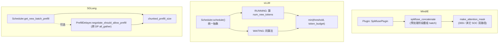

# Cross-project Comparison: Chunked Prefill (Splitfuse / Long Prefill Threshold / Prefill Delayer)

> 三项目"长 prompt 切片以避免阻塞 decode"特性对比。覆盖 [§dim-batching](../dimensions.md) 与 [§dim-pd](../dimensions.md) 的子维度。

## TL;DR (synthesis)

| 维度 | MindIE | vLLM | SGLang |
|---|---|---|---|
| **命名** | **Splitfuse**（"split + fuse"） | **Chunked prefill**（无别名） | （无独立命名）由 scheduler 内部 + `PrefillDelayer` 共同实现 |
| **触发方式** | 显式 plugin（`plugin_params` 配置 splitfuse） | 配置 `enable_chunked_prefill=True` + `long_prefill_token_threshold > 0` | 配置 `max_prefill_tokens` + 可选 `PrefillDelayer` |
| **切片粒度** | preprocess 阶段 token-level 重组（splitfuse_concatenate） | 在 schedule 主循环内 token-level（按 `long_prefill_token_threshold` 截 + token_budget） | 在 schedule 主循环内 token-level（继承 vLLM 的"统一 token budget"思路） |
| **混 prefill+decode** | ✅ splitfuse 的核心—— `splitfuse_concatenate` 把 prefill 与 decode 拼一个 batch | ✅ scheduler 的核心—— `num_tokens_with_spec - num_computed_tokens` 统一抽象 | ✅ + 还能用 `PrefillDelayer` **延迟** prefill 让 decode 优先 |
| **与 spec decode 兼容** | "splitfuse plugin manager" 与其它 plugin 组合（注释见 plugin_manager） | 统一抽象天然兼容（`num_tokens_with_spec` 已含 spec token） | 可与 spec decode 同时启 |
| **与 LoRA 互斥** | ✅ **强制互斥**（启 splitfuse 时不允许 LoRA） | 不互斥 | 不互斥 |
| **PD 分离时的延迟开关** | （隐含在 splitfuse 内部） | 通过 KV connector 钩子等远端 KV | **`PrefillDelayer`** 显式 token watermark + delay passes 协议 |

---

## 1. MindIE Splitfuse

### 触发与配置
通过 `plugin_params` 在 `Generator.__init__` 启用：
- 检测：[generator.py:294-301](d:\design\MindIE-LLM\mindie_llm\text_generator\generator.py)（`PluginParameterValidator.validate(plugin_params)` 返回 `is_mix_model`）
- 写回 `model_config["splitfuse_enabled"] = is_mix_model` ([generator.py:325](d:\design\MindIE-LLM\mindie_llm\text_generator\generator.py))
- **与 LoRA 强制互斥**：[generator.py:451-461](d:\design\MindIE-LLM\mindie_llm\text_generator\generator.py)（`SplitFuse is not supported when LoRA is enabled!`）
- **与 async mempool 互斥**：[generator.py:327-328](d:\design\MindIE-LLM\mindie_llm\text_generator\generator.py)（`Async mempool does not support plugin_type: splitfuse!`）

### 实现位置
| 组件 | 文件 |
|---|---|
| Plugin 入口 | [text_generator/plugins/splitfuse/splitfuse_plugin.py](d:\design\MindIE-LLM\mindie_llm\text_generator\plugins\splitfuse\splitfuse_plugin.py) |
| 预处理 | [splitfuse_preprocess.py](d:\design\MindIE-LLM\mindie_llm\text_generator\plugins\splitfuse\splitfuse_preprocess.py)（`SplitFusePreprocess`） |
| Concatenate（实际混 batch） | `infer_context.splitfuse_concatenate` (在 [tg_infer_context_store.py](d:\design\MindIE-LLM\mindie_llm\text_generator\utils\tg_infer_context_store.py))，[splitfuse_preprocess.py:75-79](d:\design\MindIE-LLM\mindie_llm\text_generator\plugins\splitfuse\splitfuse_preprocess.py) 调用 |
| Attention mask 构造 | [splitfuse_preprocess.py:25-67 make_attention_mask](d:\design\MindIE-LLM\mindie_llm\text_generator\plugins\splitfuse\splitfuse_preprocess.py)（**300i 与其它 SOC 走两条路径**） |

### 关键设计
- **300i (Atlas 300i 推理卡) 与其它 NPU 分两条 mask 构造路径**（[splitfuse_preprocess.py:34-66](d:\design\MindIE-LLM\mindie_llm\text_generator\plugins\splitfuse\splitfuse_preprocess.py)）
- async_inference 时需要外部传 `hit_mask`（[splitfuse_preprocess.py:47-58](d:\design\MindIE-LLM\mindie_llm\text_generator\plugins\splitfuse\splitfuse_preprocess.py)）
- 与 prefix_cache 协作：`hit_mask[i]` 命中时调整 mask 起止偏移

> [!todo] VERIFY: `splitfuse_concatenate` 的具体实现（在 `tg_infer_context_store.py`），含切片粒度与重组算法。

---

## 2. vLLM Chunked Prefill

### 触发与配置
- `scheduler_config.enable_chunked_prefill: bool`（开关）
- `scheduler_config.long_prefill_token_threshold: int`（**单个请求一次最多切多少 token**，0 = 不限）
- `scheduler_config.max_num_batched_tokens` / `max_num_scheduled_tokens`（全局 token budget）

### 实现位置
完全在 [v1/core/sched/scheduler.py](d:\design\vllm\vllm\v1\core\sched\scheduler.py) 内，**没有独立 plugin / 模块**。

#### 关键代码片段 1：RUNNING 阶段（[scheduler.py:404-411](d:\design\vllm\vllm\v1\core\sched\scheduler.py)）
```python
num_new_tokens = (
    request.num_tokens_with_spec
    + request.num_output_placeholders
    - request.num_computed_tokens
)
if 0 < self.scheduler_config.long_prefill_token_threshold < num_new_tokens:
    num_new_tokens = self.scheduler_config.long_prefill_token_threshold
num_new_tokens = min(num_new_tokens, token_budget)
```

#### 关键代码片段 2：WAITING 阶段（[scheduler.py:670-686](d:\design\vllm\vllm\v1\core\sched\scheduler.py)）
```python
num_new_tokens = request.num_tokens - num_computed_tokens
threshold = self.scheduler_config.long_prefill_token_threshold
if 0 < threshold < num_new_tokens:
    num_new_tokens = threshold

# chunked prefill has to be enabled explicitly to allow
# pooling requests to be chunked
if (
    not self.scheduler_config.enable_chunked_prefill
    and num_new_tokens > token_budget
):
    # If chunked_prefill is disabled, we can stop the scheduling here.
    break

num_new_tokens = min(num_new_tokens, token_budget)
```

### 关键设计
- **没有独立 prefill 阶段**——RUNNING 与 WAITING 走同一份 budget 算法（[scheduler.py:349-358 注释](d:\design\vllm\vllm\v1\core\sched\scheduler.py)）
- 关 chunked_prefill 时：长 prompt 装不下 token_budget 就 `break`（[scheduler.py:683-686](d:\design\vllm\vllm\v1\core\sched\scheduler.py)）
- 开 chunked_prefill 时：`num_new_tokens = min(num_new_tokens, token_budget)` 自动切片
- 与 spec decode / encoder inputs / Mamba block-aligned split 都在同一段代码处理（[scheduler.py:419-441](d:\design\vllm\vllm\v1\core\sched\scheduler.py)）

---

## 3. SGLang Chunked Prefill + PrefillDelayer

### 触发与配置
- `server_args.chunked_prefill_size`（每步最大 prefill token 数）
- `server_args.max_prefill_tokens`
- 可选：`PrefillDelayer`（[managers/prefill_delayer.py](d:\design\sglang\python\sglang\srt\managers\prefill_delayer.py)）

### 实现位置
- 主调度：[managers/scheduler.py](d:\design\sglang\python\sglang\srt\managers\scheduler.py) 的 `init_chunked_prefill` ([scheduler.py:934](d:\design\sglang\python\sglang\srt\managers\scheduler.py)) + `get_new_batch_prefill` ([scheduler.py:2393](d:\design\sglang\python\sglang\srt\managers\scheduler.py))
- chunked req 状态管理：`stash_chunked_request(req)` ([scheduler.py:2236](d:\design\sglang\python\sglang\srt\managers\scheduler.py))
- **PrefillDelayer**：[managers/prefill_delayer.py](d:\design\sglang\python\sglang\srt\managers\prefill_delayer.py)（约 308 行）

### `PrefillDelayer` 独有设计

- **构造约束**（[prefill_delayer.py:73-78](d:\design\sglang\python\sglang\srt\managers\prefill_delayer.py)）：
  - `disaggregation_mode == "null"`（**不能与 PD 分离同时启**）
  - `disable_overlap_schedule == False`（**必须启 overlap**）
- **3 状态决策**（[prefill_delayer.py:121-211](d:\design\sglang\python\sglang\srt\managers\prefill_delayer.py)）：
  - `prefillable_status == "all"`：所有 DP rank 都可以 prefill 时，再判断是否会让 decode 凑不齐 max batch（[prefill_delayer.py:148-155](d:\design\sglang\python\sglang\srt\managers\prefill_delayer.py)）→ 决定 delay
  - `prefillable_status == "none"`：所有 rank 都没 prefill 请求 → 允许（语义不重要）
  - `prefillable_status == "mixed"`：部分 rank 有，看 `token_usage_low_watermark` 是否触发强制允许；否则 delay 直到 `max_delay_passes`
- **跨 DP 同步**：用 `torch.distributed.all_gather_into_tensor` 在 CPU group 上交换 `_global_info_buffer`（[prefill_delayer.py:215-234](d:\design\sglang\python\sglang\srt\managers\prefill_delayer.py)）

> synthesis: SGLang 的 `PrefillDelayer` 是三家里**唯一显式"为 P50 牺牲 P99"的开关**——主动延迟 prefill 让 running decode 凑大 batch，**用尾延迟换吞吐**。

### Scheduler 内的"连续两 prefill 不 overlap"
独立但相关的开关 `SGLANG_DISABLE_CONSECUTIVE_PREFILL_OVERLAP`（[scheduler.py:1480-1484](d:\design\sglang\python\sglang\srt\managers\scheduler.py)）—— 改善首 batch TTFT，可能略损吞吐。

---

## 4. 三方对比：核心算法



---

## 5. 与你 PD 优化的关联（synthesis）

> 注意：本节是综合性建议。

如果你正在 MindIE 上做 PD 优化，chunked prefill 这一层的关注点：

1. **Splitfuse + LoRA 互斥**（[generator.py:451-461](d:\design\MindIE-LLM\mindie_llm\text_generator\generator.py)）：如果你在 P 节点同时用 LoRA + 长 prompt，splitfuse 不能开，那条长 prompt 会阻塞 decode 节点的 KV pull——可能成为 TTFT 长尾的源头。可对照 vLLM/SGLang 都不互斥。
2. **300i 与其它 SOC 路径分叉**（[splitfuse_preprocess.py:34-66](d:\design\MindIE-LLM\mindie_llm\text_generator\plugins\splitfuse\splitfuse_preprocess.py)）：300i 走的是"按 batch 索引切 mask 拼接"路径，性能可能不如其它 SOC 的 `get_splitfuse_mask`。如果你的 P 节点是 300i，验证这条路径是否有针对性优化空间。
3. **借鉴 SGLang 的 `PrefillDelayer`**：MindIE 当前没有"延迟 prefill 让 decode 凑大 batch"的机制。如果你的 D 节点 decode batch 老凑不到 max（被频繁的小 prefill 打断），可考虑在 C++ scheduler 层加类似机制。
4. **借鉴 vLLM 的 `long_prefill_token_threshold`**：MindIE splitfuse 的切片粒度由 `splitfuse_concatenate` 内部决定（待 ingest）。vLLM 显式暴露 `long_prefill_token_threshold` 可以**在不改代码的前提下调切片大小**——TTFT/TPOT 调优时方便。
5. **PD 分离 + chunked prefill 的组合**：vLLM 的 chunked prefill 与 KV connector 是组合关系；SGLang 的 `PrefillDelayer` **明确禁止与 PD 分离同时启**（[prefill_delayer.py:73-75](d:\design\sglang\python\sglang\srt\managers\prefill_delayer.py)）。MindIE splitfuse 在 PD 模式下的行为待 ingest 时验证。

---

## 6. 跨项目可借鉴

| 借鉴对象 | 思路 |
|---|---|
| 从 vLLM | "no prefill phase" 的统一 token budget 抽象——简化算法表达，同时让 chunked prefill / spec decode / prefix cache 共享同一段代码 |
| 从 SGLang | `PrefillDelayer` 的"为 P50 牺牲 P99"显式开关；`SGLANG_DISABLE_CONSECUTIVE_PREFILL_OVERLAP` env 调优旋钮 |
| 从 MindIE | Splitfuse 与不兼容 plugin 的**显式 fail-fast**（vLLM/SGLang 在某些组合下会静默退化） |

---

## Notes / Caveats
> [!todo] VERIFY: `splitfuse_concatenate` 在 `tg_infer_context_store.py` 的实现细节。
> [!todo] VERIFY: SGLang `get_new_batch_prefill` ([scheduler.py:2393-2410](d:\design\sglang\python\sglang\srt\managers\scheduler.py)) 内部是否真的"切大 prompt"，还是仅"按 max_prefill_tokens 限制 batch"。
> [!todo] VERIFY: vLLM `enable_chunked_prefill=False` 时 `long_prefill_token_threshold` 是否仍生效（看代码 [scheduler.py:409-410](d:\design\vllm\vllm\v1\core\sched\scheduler.py) 似乎独立于 enable_chunked_prefill）。

## See also
- [comparison/dimensions.md §dim-batching](../dimensions.md)
- [comparison/topics/scheduler.md](scheduler.md)（与 chunked prefill 紧密相关）
- [comparison/topics/kv-cache.md](kv-cache.md)
- [vllm/entities/Scheduler.md](../../vllm/entities/Scheduler.md)
- [sglang/entities/Scheduler.md](../../sglang/entities/Scheduler.md)
