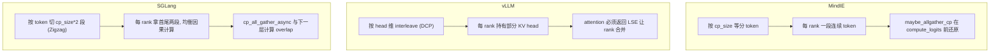

# Cross-project Comparison: Context Parallel / Sequence Parallel (CP / SP)

> 三项目"沿 sequence 维切分以处理超长 prompt"特性对比。覆盖 [§dim-cp-sp](../dimensions.md)。

## TL;DR (synthesis)

| 维度 | MindIE | vLLM | SGLang |
|---|---|---|---|
| **CP 命名** | `ATTN_CP`（attention context parallel） | **PCP**（Prefill CP）+ **DCP**（Decode CP）**双轴** | `attn_cp` group + `enable_prefill_context_parallel` |
| **SP 命名** | `ATTN_INNER_SP`（attention 内部 sequence parallel）+ FlashComm 也是 SP 思路 | 通过 `pcp_size > 1` 蕴含 SP；torch.compile sequence_parallelism pass | `dp_attention` + `_tp_reduce_scatter` 共同实现 SP |
| **CP 切分模式** | （未见显式 zigzag） | 通过 `cp_kv_cache_interleave_size` 配置 interleave | **Zigzag**（[ContextParallelMetadata.zigzag_index](d:\design\sglang\python\sglang\srt\layers\utils\cp_utils.py)）+ "in-seq-split" 模式 |
| **CP/SP 谁负责 KV** | KV 块分布按 `cp.group_size` 切（`maybe_allgather_cp` 把 hidden 还原） | DCP 时每 KV 头属于不同 rank（`cp_kv_cache_interleave_size`） | KV cache 也按 CP 切（`cp_all_gather_reorganized_into_tensor_kv_cache`） |
| **Attention impl 协议** | （隐式：每个 attention layer 自己感知 cp_size） | **强制接口**：`supports_pcp` / `need_to_return_lse_for_decode` / `supports_mtp_with_cp_non_trivial_interleave_size` | impl 通过 `forward_batch.attn_cp_metadata` 感知 |
| **Prefill 与 Decode 的 CP 对称性** | 同一 ATTN_CP 组覆盖两阶段 | **不对称**：PCP 与 DCP 是独立轴 | `prefill_cp_mode` 配置（`in-seq-split` 等） |
| **与 spec decode 兼容** | （未见显式约束） | DCP + interleave_size > 1 时要求 `supports_mtp_with_cp_non_trivial_interleave_size` | （未深入） |
| **配置位** | `cp` / `sp` 在模型 wrapper config | `prefill_context_parallel_size` / `decode_context_parallel_size` | server_args `enable_prefill_context_parallel` / `prefill_cp_mode` |

---

## 1. MindIE: ATTN_CP + ATTN_INNER_SP

### 并行轴枚举（[parallel_info_manager.py:34-47](d:\design\MindIE-LLM\mindie_llm\runtime\utils\distributed\parallel_info_manager.py)）

```python
class ParallelType(str, Enum):
    WORLD = "world"
    ATTN_TP = "attn_tp"
    ATTN_DP = "attn_dp"
    ATTN_CP = "attn_cp"          # Context parallel
    ATTN_INNER_SP = "attn_inner_sp"   # Sequence parallel within attention
    ATTN_O_PROJ_TP = "attn_o_proj_tp"
    MLP_TP = "mlp_tp"
    WORLD_EMBED_TP = "world_embed_tp"
    LM_HEAD_TP = "lm_head_tp"
    MOE_TP = "moe_tp"
    MOE_EP = "moe_ep"
    MOE_EP_MC2 = "moe_ep_mc2"
```

**12 个并行轴里 CP / SP 占两个**——这是三家里把并行轴枚举得最细的。

### 配置传递（[aclgraph_model_wrapper.py:62-65](d:\design\MindIE-LLM\mindie_llm\modeling\model_wrapper\aclgraph\aclgraph_model_wrapper.py)）

```python
self.dp_size = self.mapping.attn_dp.group_size
self.sp_size = self.mapping.attn_inner_sp.group_size
self.cp_size = self.mapping.attn_cp.group_size
```

### 运行时 gather（[base/model.py:51-61 maybe_all_gather_cp](d:\design\MindIE-LLM\mindie_llm\runtime\models\base\model.py)）

```python
@staticmethod
def maybe_all_gather_cp(hidden_states):
    cp = get_parallel_info_manager().get(ParallelType.ATTN_CP)
    if not cp.is_enabled():
        return hidden_states

    group_size = cp.group_size
    hidden_states_out = torch.zeros_like(hidden_states).repeat(
        group_size, *(1,) * (hidden_states.dim() - 1))
    torch.distributed.all_gather_into_tensor(
        hidden_states_out, hidden_states, group=cp.process_group)
    return hidden_states_out
```

### `model_runner.forward` 中的 CP 调用（[model_runner.py:314-318](d:\design\MindIE-LLM\mindie_llm\runtime\model_runner\model_runner.py)）

```python
if not self.is_draft_model and self.cp_size > 1:
    hidden_states_cp = maybe_allgather_cp(hidden_states)
    logits = self.model.compute_logits(hidden_states_cp)
else:
    logits = self.model.compute_logits(hidden_states)
```

> [!todo] VERIFY: `attn_inner_sp` 与 `attn_cp` 的具体差异——前者是 attention 内部按 head 切？后者是按 token 切？两者在哪里 reorganize KV？需要读 [layers/attention/](d:\design\MindIE-LLM\mindie_llm\runtime\layers\attention) 下实现。

### `scp_size = cp_size * sp_size`（[generator.py:375](d:\design\MindIE-LLM\mindie_llm\text_generator\generator.py)）

```python
self.dp_size = self.model_wrapper.dp_size
self.sp_size = self.model_wrapper.sp_size
self.cp_size = self.model_wrapper.cp_size
self.scp_size = self.cp_size * self.sp_size
```

`scp_size` 在 `generate_token` 内被用来对 prefix cache 命中后的有效 token 数做对齐（[generator.py:603-604](d:\design\MindIE-LLM\mindie_llm\text_generator\generator.py)）。

---

## 2. vLLM: PCP + DCP（独立两轴）

### 配置三件套（[multiproc_executor.py:115-121, 257-268](d:\design\vllm\vllm\v1\executor\multiproc_executor.py)）

```python
tp_size = self.parallel_config.tensor_parallel_size
pp_size = self.parallel_config.pipeline_parallel_size
pcp_size = self.parallel_config.prefill_context_parallel_size
# (DCP 同名)
assert self.world_size == tp_size * pp_size * pcp_size
```

→ world_size = **TP × PP × PCP**（DCP 不算入 world_size，是 layer 级配置？待 verify）。

### Attention impl 协议（[v1/worker/cp_utils.py:14-44](d:\design\vllm\vllm\v1\worker\cp_utils.py)）

```python
def check_attention_cp_compatibility(vllm_config: VllmConfig) -> None:
    pcp_size = vllm_config.parallel_config.prefill_context_parallel_size
    dcp_size = vllm_config.parallel_config.decode_context_parallel_size
    interleave_size = vllm_config.parallel_config.cp_kv_cache_interleave_size
    if pcp_size * dcp_size > 1:
        for layer in layers.values():
            if vllm_config.speculative_config is not None and interleave_size > 1:
                assert layer_impl.supports_mtp_with_cp_non_trivial_interleave_size, ...
            if dcp_size > 1:
                assert layer_impl.need_to_return_lse_for_decode, (
                    "Decode Context Parallelism (DCP) requires attention "
                    "implementations to return the softmax LSE during decode, ...")
            if pcp_size > 1:
                assert layer_impl.supports_pcp, (
                    "PCP requires attention impls' support, ...")
```

### vLLM 独有：DCP 的 LSE 协议
> synthesis: [v1/worker/cp_utils.py:30-37](d:\design\vllm\vllm\v1\worker\cp_utils.py) 明示 **DCP 在 decode 时需要 attention 实现返回 softmax LSE**——为了在 rank 间合并 attention 输出（log-sum-exp 是数值稳定的合并方式）。这个细节 MindIE 与 SGLang 都没显式要求。

### `get_total_cp_world_size`（[cp_utils.py:47-58](d:\design\vllm\vllm\v1\worker\cp_utils.py)）

```python
def get_total_cp_world_size():
    pcp_world_size = get_pcp_group().world_size
    dcp_world_size = get_dcp_group().world_size
    return dcp_world_size * pcp_world_size
```

### 配置：`cp_kv_cache_interleave_size`
当 `dcp_size > 1` 时，KV cache 按 head 维度 **interleave** 给不同 rank（与 SGLang 的 zigzag 切 token 相对）。

---

## 3. SGLang: zigzag CP + in-seq-split + dp_attention

### 配置（[layers/utils/cp_utils.py:34-42](d:\design\sglang\python\sglang\srt\layers\utils\cp_utils.py)）

```python
def is_prefill_context_parallel_enabled():
    return get_global_server_args().enable_prefill_context_parallel

def is_prefill_cp_in_seq_split():
    return (
        is_prefill_context_parallel_enabled()
        and get_global_server_args().prefill_cp_mode == "in-seq-split"
    )
```

### `ContextParallelMetadata`（[layers/utils/cp_utils.py:12-31](d:\design\sglang\python\sglang\srt\layers\utils\cp_utils.py)）

```python
@dataclass
class ContextParallelMetadata:
    split_list: List[int] = None
    max_rank_len: List[int] = None
    zigzag_index: List[int] = None         # ← 关键
    per_rank_actual_token: List[int] = None
    reverse_split_len: List[int] = None
    cp_reverse_index: List[int] = None

    # metadata for attention
    kv_len_prev: int = -1
    kv_len_next: int = -1
    actual_seq_q_prev: int = -1
    actual_seq_q_next: int = -1
    kv_len_prev_tensor: torch.Tensor = None
    kv_len_next_tensor: torch.Tensor = None
    actual_seq_q_prev_tensor: torch.Tensor = None
    actual_seq_q_next_tensor: torch.Tensor = None

    total_seq_lens: torch.Tensor = None
```

### Zigzag 切分（[layers/utils/cp_utils.py:62-69](d:\design\sglang\python\sglang\srt\layers\utils\cp_utils.py)）

```python
def cp_split_and_rebuild_data(forward_batch, input_: torch.Tensor):
    input_list = list(
        torch.split(input_, forward_batch.attn_cp_metadata.split_list, dim=0)
    )
    result = torch.cat(
        [input_list[i] for i in forward_batch.attn_cp_metadata.zigzag_index], dim=0
    ).view(-1, input_.shape[-1])
    return result
```

注释说明（[layers/utils/cp_utils.py:46-50](d:\design\sglang\python\sglang\srt\layers\utils\cp_utils.py)）：
> "(self.cp_size * 2) To achieve load balancing for seq computation, the seq data needs to be divided and recombined at twice the size of cp_size."

→ **每 rank 拿首尾两段**（zigzag 切法）来均衡 attention 因果掩码下的计算量。这是经典 long-context CP 优化。

### CP all_gather（[cp_utils.py:83-170](d:\design\sglang\python\sglang\srt\layers\utils\cp_utils.py)）

| 函数 | 行号 | 用途 |
|---|---|---|
| `cp_all_gather_reorganized_into_tensor` | [83-124](d:\design\sglang\python\sglang\srt\layers\utils\cp_utils.py) | hidden_states 的 CP allgather + zigzag 还原 |
| `cp_all_gather_reorganized_into_tensor_kv_cache` | [127-170](d:\design\sglang\python\sglang\srt\layers\utils\cp_utils.py) | KV cache 的 CP allgather（多维 tensor） |
| `cp_all_gather_rerange_output` | [173-...](d:\design\sglang\python\sglang\srt\layers\utils\cp_utils.py) | in-seq-split 模式下输出重排 |

异步通信：用 `cp_all_gather_into_tensor_async` + 显式 stream（[cp_utils.py:105-107](d:\design\sglang\python\sglang\srt\layers\utils\cp_utils.py)）—— **与计算 overlap**。

### dp_attention（[layers/dp_attention.py](d:\design\sglang\python\sglang\srt\layers\dp_attention.py)）

`DpPaddingMode` 枚举（[dp_attention.py:50-83](d:\design\sglang\python\sglang\srt\layers\dp_attention.py)）：

```python
class DpPaddingMode(IntEnum):
    MAX_LEN = auto()  # padding 到 max_len 后 all_gather_into_tensor
    SUM_LEN = auto()  # padding 到 sum_len 后 all_reduce
```

`get_dp_padding_mode(is_extend_in_batch, global_num_tokens)` 自动选 mode（[dp_attention.py:63-83](d:\design\sglang\python\sglang\srt\layers\dp_attention.py)）：
- `is_extend_in_batch=True` 且 `dp_size > 1` → `SUM_LEN`（避免 padding 浪费）
- 否则比较 `sum_len * 2 vs max_len * dp_size`，选通信成本小的

> synthesis: SGLang 是三家里 CP/SP/DP 协调最复杂的——`attn_cp` + `dp_attention` + `attn_tp` 三轴都可能同时启，需要 `LayerCommunicator` + `DpPaddingMode` 自动选最优通信。

---

## 4. 三方 CP 切分策略对比



> synthesis: **三家选择了不同 CP 切分维度**：
> - MindIE：连续切 token（最简单，但因果 mask 下计算不均衡）
> - vLLM DCP：切 KV head（无因果不均衡问题，但需要 LSE 合并）
> - SGLang：zigzag 切 token（解决因果不均衡，是 long-context 最常用的方案）

---

## 5. 与你 PD 优化的关联（synthesis）

> 注意：本节是综合性建议。

如果你正在 MindIE 上做 PD 优化，CP/SP 这一层的关注点：

1. **`scp_size = cp_size * sp_size` 对齐限制**（[generator.py:375, 603-604](d:\design\MindIE-LLM\mindie_llm\text_generator\generator.py)）：prefix cache 命中的 token 数必须按 `scp_size` 对齐，意味着如果你的 P 节点用了 CP=4 SP=2 (scp_size=8)，**prefix cache 命中粒度被强制对齐到 8 token**。短 prompt 命中率可能受影响。
2. **MindIE 缺 zigzag 切分**：长 prompt 在 CP 模式下 last rank 计算量最大（因果 mask 让它要算完整长度），建议参考 SGLang 的 zigzag 思路。如果你的 P 节点经常处理长 prompt，这是 prefill 时间长尾的源头。
3. **vLLM 的 PCP/DCP 不对称设计**：MindIE 的 `ATTN_CP` 同时覆盖 prefill 与 decode，而 vLLM 把它们拆成 PCP 与 DCP 两轴。这意味着 vLLM 可以**只在 prefill 启 CP**（D 节点不需要），但 MindIE 必须两边一起开。PD 分离场景下 P 节点用 CP 加速长 prompt 时，D 节点也被迫用 CP（即使 D 不需要），可能浪费 D 通信。
4. **借鉴 vLLM 的 attention impl 协议**：[cp_utils.py:14-44 check_attention_cp_compatibility](d:\design\vllm\vllm\v1\worker\cp_utils.py) 在 init 时强制检查 attention 实现是否支持 PCP/DCP/MTP。MindIE 当前是隐式的（每个 attention 自己处理），加 fail-fast 检查能避免运行时崩溃。
5. **借鉴 SGLang 的 `cp_all_gather_into_tensor_async`**（[cp_utils.py:105-107](d:\design\sglang\python\sglang\srt\layers\utils\cp_utils.py)）：MindIE `maybe_all_gather_cp` 是同步 `all_gather_into_tensor`（[base/model.py:59](d:\design\MindIE-LLM\mindie_llm\runtime\models\base\model.py)）。改成异步 + stream 让通信与下一层 compute overlap，长 prompt prefill 提速空间大。

---

## 6. 跨项目可借鉴

| 借鉴对象 | 思路 |
|---|---|
| 从 vLLM | PCP / DCP 分两轴：让 P 与 D 独立选择是否启 CP |
| 从 vLLM | attention impl 强制声明 `supports_pcp` / `need_to_return_lse_for_decode`：fail-fast |
| 从 SGLang | Zigzag 切分均衡因果计算量，长 prompt 必备 |
| 从 SGLang | `cp_all_gather_into_tensor_async` 与计算 overlap |
| 从 SGLang | `DpPaddingMode` 按 token 分布自动选 max_len/sum_len 通信策略 |
| 从 MindIE | `ParallelType` 12 轴枚举：把 CP / SP / TP / DP / EP 都统一管理（vLLM/SGLang 散落在各处） |

---

## Notes / Caveats
> [!todo] VERIFY: MindIE `ATTN_INNER_SP` 与 `ATTN_CP` 的语义边界——前者疑是 attention 内 head 切，后者是 token 切，待读 [layers/attention/](d:\design\MindIE-LLM\mindie_llm\runtime\layers\attention) 验证。
> [!todo] VERIFY: vLLM `cp_kv_cache_interleave_size` 的具体含义（KV head interleave 间隔？还是 token interleave？）。
> [!todo] VERIFY: SGLang `prefill_cp_mode` 除 "in-seq-split" 外还有什么模式（[cp_utils.py:41](d:\design\sglang\python\sglang\srt\layers\utils\cp_utils.py)）。
> [!warning] CONTRADICTION: vLLM PCP 与 SGLang prefill CP 都是"prefill 阶段的 CP"，但实现策略完全不同（vLLM head interleave vs SGLang zigzag token）。两者各自的优劣场景待 ingest 时跑实测。

## See also
- [comparison/dimensions.md §dim-cp-sp](../dimensions.md)
- [comparison/topics/flashcomm.md](flashcomm.md)（FlashComm 是 SP 的 sub-case）
- [comparison/topics/kv-cache.md](kv-cache.md)（CP 切分直接影响 KV pool）
- [vllm/entities/MultiprocExecutor.md](../../vllm/entities/MultiprocExecutor.md)
- [sglang/modules/managers.md](../../sglang/modules/managers.md)
