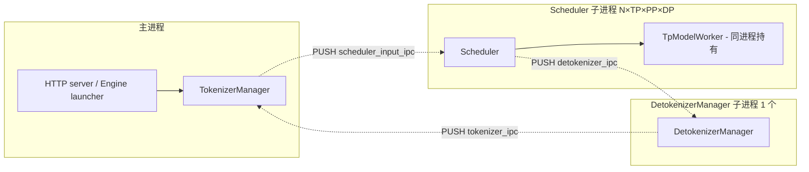

# Cross-project Comparison: Engine Architecture

## Summary

三家"engine"的边界完全不同：
- **MindIE** 是 **Python `Generator` + C++ `LlmEngine` 双层架构**：Python 顶层装配栈，C++ 跑主调度循环，反向调 Python `PluginManager.generate_token` 执行 forward；同进程，无 ZMQ。
- **vLLM** 是 **三层 Python 洋葱**（`LLMEngine`/`AsyncLLM` → `EngineCoreClient` → `EngineCore`/`EngineCoreProc`）+ **可插拔 4 实现的 `Executor` 抽象**；进程模型从同进程到 4 进程到 Ray actor 完全可配。
- **SGLang** 是 **严格 3 进程 ZMQ pipeline**：`TokenizerManager`（主进程）→ `Scheduler`（子进程，直接持 `TpModelWorker`）→ `DetokenizerManager`（子进程）→ 回 `TokenizerManager`，无可选 inproc 模式。

`synthesis:` "engine" 命名相同但所指对象完全不同——MindIE `LlmEngine` 是 C++ 调度循环；vLLM `LLMEngine` 是 sync 顶层入口；SGLang `Engine` 是 launcher（fork 三进程后立即返回）。读源码时**类名不可直接类比**。

## Sources

见 frontmatter `sources:`（涵盖 14 个核心源文件 + 18 个相关 wiki 页）。

## §1 顶层进程拓扑（process model）

### MindIE：单进程 Python + 嵌入式 C++ 引擎

```mermaid
flowchart TB
  subgraph Process[一个 Python 进程 / 一个 generator]
    Server[server/main.py - HTTP 入口]
    Generator[Generator (Python, ~1438 行)]
    PluginMgr[PluginManager (Python)]
    LlmEngine[LlmEngine (C++) - 后台调度线程]
    BatchSched[BatchScheduler (C++)]
    ModelRunner[ModelRunner (Python)]
    Server -->|REST| Generator
    Generator -->|装配| PluginMgr
    Generator -->|启动| LlmEngine
    LlmEngine -->|StartEngineThread| BatchSched
    LlmEngine -.->|callback responseHandler| PluginMgr
    PluginMgr -->|forward_thread| ModelRunner
  end
```

- **进程数**：1（主推路径）。`server/main.py` HTTP 服务、`Generator` 装配、C++ `LlmEngine` 调度循环、Python `PluginManager.forward_thread`、`ModelRunner` 全在同一进程。
- **PD 场景额外**：[`SeparateDeploymentWorker`](d:\design\MindIE-LLM\mindie_llm\text_generator\utils\separate_deployment_engine.py) 仍在同进程，但通过 `LLMDataDist` SDK 跨节点拉/推 KV；**connector 是独立子进程**（[connector/main.py](d:\design\MindIE-LLM\mindie_llm\connector\main.py)，由 `Executor::BuildConnectorCommand` C++ fork [executor.cpp:794-809](d:\design\MindIE-LLM\src\executor\executor.cpp)），与 generator 通过共享内存 + protobuf 通信。
- **跨语言边界**：C++ ↔ Python 通过 pybind 紧耦合（`LlmEngine` 的 `responseHandler` 是 Python callback，`PluginManager.generate_token` 由 C++ 反向调用）。
- **锚点**：[Generator.__init__](d:\design\MindIE-LLM\mindie_llm\text_generator\generator.py)（[212-540](d:\design\MindIE-LLM\mindie_llm\text_generator\generator.py)）；C++ 引擎 [LlmEngine::StartEngineThread](d:\design\MindIE-LLM\src\engine\llm_engine.cpp)（[251-273](d:\design\MindIE-LLM\src\engine\llm_engine.cpp)）+ [SchedulerThreadEntry](d:\design\MindIE-LLM\src\engine\llm_engine.cpp)（[457+](d:\design\MindIE-LLM\src\engine\llm_engine.cpp)）；详 `mindie/entities/Generator.md`（已删）、`LlmEngine.md`（已删）、`PluginManager.md`（已删）。

### vLLM：可插拔进程模型（inproc / multiproc / Ray）

```mermaid
flowchart TB
  subgraph FrontEnd[前端进程 / OpenAI server / LLM client]
    LLMEngine[LLMEngine sync\nor AsyncLLM async]
    Client[EngineCoreClient\nInprocClient | SyncMPClient | AsyncMPClient | DPAsyncMPClient | DPLBAsyncMPClient]
    LLMEngine --> Client
  end
  subgraph EngineProc[EngineCore 进程 - 多进程时独立]
    EngineCore[EngineCoreProc\nor DPEngineCoreProc\nor EngineCoreActor]
    Sched[Scheduler / AsyncScheduler]
    Exec[Executor 抽象\nUniProc | MultiProc | Ray | RayV2]
    EngineCore --> Sched
    EngineCore --> Exec
  end
  subgraph Workers[N 个 worker 进程 - MultiprocExecutor 时]
    Worker0[Worker rank=0\nGPUModelRunner]
    WorkerN[Worker rank=N-1\nGPUModelRunner]
  end
  Client -.ZMQ ROUTER+PULL.-> EngineCore
  Exec -.MessageQueue shm.-> Worker0
  Exec -.MessageQueue shm.-> WorkerN
```

- **进程数（4 种配置）**：
  - `InprocClient`：1 进程（前端 + EngineCore + Worker 全在一起）—— 调 `LLMEngine(..., multiprocess_mode=False)` 走此路径，[EngineCoreClient.make_client L103](d:\design\vllm\vllm\v1\engine\core_client.py)
  - `SyncMPClient` / `AsyncMPClient` + `UniProcExecutor`：2 进程（前端 + EngineCore + 单 Worker 在 EngineCore 进程内）
  - `SyncMPClient` / `AsyncMPClient` + `MultiprocExecutor`：**1 + 1 + N 进程**（前端 + EngineCore + N 个 worker，N = TP * PP）
  - `DPLBAsyncMPClient` / `DPAsyncMPClient`：**1 + DP × 1 + DP × N 进程**（每 DP rank 一个 EngineCore + 一组 worker）
- **跨进程 IPC**：客户端 → EngineCore 走 **ZMQ ROUTER/PULL**（前端 ROUTER, EngineCore DEALER；前端 PULL, EngineCore PUSH，[EngineCoreClient.md hidden state](../../vllm/entities/EngineCoreClient.md)）；Executor → Worker 走 **`MessageQueue` 共享内存**（详 [vllm/topics/multiproc-ipc.md](../../vllm/topics/multiproc-ipc.md)）。
- **跨语言边界**：vLLM 主体纯 Python；CUDA kernel 在 `csrc/`（不在 engine 路径上）。
- **锚点**：详 [vllm/entities/LLMEngine.md](../../vllm/entities/LLMEngine.md)、[AsyncLLM.md](../../vllm/entities/AsyncLLM.md)、[EngineCore.md](../../vllm/entities/EngineCore.md)、[EngineCoreClient.md](../../vllm/entities/EngineCoreClient.md)、[MultiprocExecutor.md](../../vllm/entities/MultiprocExecutor.md)。

### SGLang：严格 3 进程 ZMQ pipeline



- **进程数（最小配置）**：1 + 1 + 1 = 3 进程 + 主进程（共 3 + 1 = 4，`Engine` launcher 在主进程内 `__init__` 完成后即与 TokenizerManager 同生命周期）。
  - **Scheduler 进程数 = TP × PP × DP**（每 worker 一个 scheduler 进程，scheduler 与 worker 同进程，**没有独立 worker 进程概念**）
  - **DetokenizerManager 始终 1 个**（无并行需求）
- **进程角色**：
  - 主进程：[`Engine`](d:\design\sglang\python\sglang\srt\entrypoints\engine.py)（[143](d:\design\sglang\python\sglang\srt\entrypoints\engine.py)）类只是 launcher——`__init__` 调 [`_launch_subprocesses`](d:\design\sglang\python\sglang\srt\entrypoints\engine.py)（[627-678](d:\design\sglang\python\sglang\srt\entrypoints\engine.py)）fork 出 scheduler/detokenizer 子进程后立即返回，主进程剩 `TokenizerManager`（[engine.py:203](d:\design\sglang\python\sglang\srt\entrypoints\engine.py)）+ HTTP server
  - Scheduler 子进程：跑 [`run_scheduler_process`](d:\design\sglang\python\sglang\srt\managers\scheduler.py)，**`TpModelWorker` 直接被 Scheduler 持有，无独立 worker 进程**（与 vLLM 截然不同）
  - DetokenizerManager 子进程：跑 [`run_detokenizer_process`](d:\design\sglang\python\sglang\srt\managers\detokenizer_manager.py)，独立 ZMQ 闭环
- **跨进程 IPC**：全部 ZMQ（PUSH/PULL，pickle 序列化，详 [sglang/entities/TokenizerManager.md](../../sglang/entities/TokenizerManager.md)）。
- **跨语言边界**：SGLang 主体 Python；CUDA kernel 在 `sgl-kernel/`（不在 engine 路径上）。
- **锚点**：[Engine.__init__](d:\design\sglang\python\sglang\srt\entrypoints\engine.py)（[164-209](d:\design\sglang\python\sglang\srt\entrypoints\engine.py)）；docstring 明示三组件分工（[engine.py:147-155](d:\design\sglang\python\sglang\srt\entrypoints\engine.py)）；详 [sglang/entities/TokenizerManager.md](../../sglang/entities/TokenizerManager.md)、[sglang/entities/Scheduler.md](../../sglang/entities/Scheduler.md)、[sglang/topics/manager-pipeline.md](../../sglang/topics/manager-pipeline.md)。

### §1 三方对照表

| 维度 | MindIE | vLLM | SGLang |
|---|---|---|---|
| **进程数（最小）** | 1（generator）+ 1（connector，PD 时） | 1（inproc）/ 2（uniproc + EngineCore）/ 1+1+N（MultiprocExecutor） | **3**（Tokenizer + Scheduler + Detokenizer），不可降为 1 |
| **进程数（DP=4 + TP=8 典型）** | 1 generator × DP=4（每 DP rank 一进程）+ connector | 1 + 4 + 4×8 = **37 进程** | TM + DTM + 4×8 = **34 进程**（每 scheduler/worker 同进程） |
| **可选 inproc 单进程模式** | ✅ 默认 | ✅ `multiprocess_mode=False`（[LLMEngine.md](../../vllm/entities/LLMEngine.md)）| ❌ **不支持**（强制 3 进程，[engine.py:153-154](d:\design\sglang\python\sglang\srt\entrypoints\engine.py)） |
| **跨进程 IPC** | 共享内存 + protobuf（仅 generator↔connector） | **ZMQ**（前端↔EngineCore）+ **MessageQueue shm**（Executor↔Worker） | **ZMQ**（pickle，[detokenizer_manager.py:184-188](d:\design\sglang\python\sglang\srt\managers\detokenizer_manager.py)） |
| **跨语言边界** | **C++ ↔ Python pybind 紧耦合**（C++ LlmEngine 反向调 Python plugin） | 纯 Python（CUDA kernel 在 csrc 但不在 engine 路径） | 纯 Python（CUDA 在 sgl-kernel） |
| **Worker 是独立进程** | ❌ 否（`PluginManager.forward_thread` 是同进程后台线程） | ✅ MultiprocExecutor 时是 | ❌ 否（`TpModelWorker` 在 scheduler 进程内） |

---

## §2 顶层 Engine 入口对象

| 维度 | MindIE | vLLM | SGLang |
|---|---|---|---|
| **顶层入口类** | [`Generator`](d:\design\MindIE-LLM\mindie_llm\text_generator\generator.py)（Python，~1438 行） | [`LLMEngine`](d:\design\vllm\vllm\v1\engine\llm_engine.py)（sync）+ [`AsyncLLM`](d:\design\vllm\vllm\v1\engine\async_llm.py)（async）**双前端** | [`Engine`](d:\design\sglang\python\sglang\srt\entrypoints\engine.py)（[143](d:\design\sglang\python\sglang\srt\entrypoints\engine.py)）+ [`HttpServerEngineAdapter`](d:\design\sglang\python\sglang\srt\entrypoints\http_server_engine.py) |
| **角色定位** | 装配 + 调度 + PD 入口（继承 `PDInterface`） | sync/async 双视角 facade，内部聚合 `EngineCoreClient` + `OutputProcessor` + `Processor` | **Launcher**（fork 子进程后退出 `__init__`，主进程剩 TokenizerManager） |
| **是否同时是请求 API** | ✅ `Generator.generate / prefill / decode / generate_mix` 直接是请求入口（[generator.py:718-756](d:\design\MindIE-LLM\mindie_llm\text_generator\generator.py)） | ✅ `LLMEngine.add_request / step` + `AsyncLLM.generate / encode` | ⚠️ `Engine.generate / encode` 委托给 `TokenizerManager`，`Engine` 自己是 launcher |
| **是否独立 C++ 引擎** | ✅ [`LlmEngine`](d:\design\MindIE-LLM\src\engine\llm_engine.cpp)（C++ 后台调度线程，与 Python `Generator` 解耦） | ❌ 无 C++ engine 类（CUDA 仅在 kernel 层） | ❌ 无 C++ engine 类（CUDA 仅在 sgl-kernel） |
| **PD 是否在 Engine 内** | ✅ `Generator` 继承 `PDInterface`，PD 是 Engine **内置接口** | ❌ PD 在 `KVConnector` 子系统外挂（[vllm/topics/kv-connector.md](../../vllm/topics/kv-connector.md)） | ⚠️ PD 由 `disagg_service.py` 在 manager 层分流，不直接挂 Engine |

`synthesis:` "Engine" 字面三家都有但所指迥异：
- **MindIE `Generator`** ≈ vLLM `LLMEngine` + `EngineCore` 合体 + PD 入口。
- **MindIE `LlmEngine` (C++)** ≈ vLLM `Scheduler.schedule()` 主循环（C++ 实现）。
- **vLLM `LLMEngine`** = 顶层 sync facade，**不**是后端进程。
- **vLLM `EngineCore`** ≈ MindIE C++ `LlmEngine` 的"调度循环 + executor 调用"角色。
- **SGLang `Engine`** = 进程 launcher，**不**承担运行时角色；运行时职责分散到 `TokenizerManager` / `Scheduler` / `DetokenizerManager` 三独立进程。

---

## §3 Sync vs Async API 拆分

| 维度 | MindIE | vLLM | SGLang |
|---|---|---|---|
| **API 拆分方式** | **同一类** `Generator`，`async_inference` flag（[generator.py:319-323](d:\design\MindIE-LLM\mindie_llm\text_generator\generator.py)）+ `plugin_manager.generate_token_async` 路径 | **两个独立类**：[`LLMEngine`](d:\design\vllm\vllm\v1\engine\llm_engine.py)（sync）vs [`AsyncLLM`](d:\design\vllm\vllm\v1\engine\async_llm.py)（async）；底层共享 `EngineCore` 但客户端不同（`make_client(asyncio_mode=False)` vs `make_async_mp_client`） | **同一类** `Engine`，所有 `Engine.generate` 都是 `async def`；非 async 调用通过外部 `asyncio.run` 包装 |
| **真异步实现机制** | C++ `LlmEngine` 后台线程 + `responseHandler` callback 反向通知 Python；`PluginManager.forward_thread` Python 后台线程消费 input_queue（[plugin_manager.py:107-115](d:\design\MindIE-LLM\mindie_llm\text_generator\plugins\plugin_manager.py)） | `AsyncLLM.output_handler` 是真 `asyncio.create_task`（[async_llm.py:704](d:\design\vllm\vllm\v1\engine\async_llm.py)）；`AsyncMPClient.process_outputs_socket` 也是 `asyncio.create_task` 持续 await ZMQ（[core_client.py:942-988](d:\design\vllm\vllm\v1\engine\core_client.py)） | TokenizerManager 用 `asyncio.Event`-based `ReqState`（[tokenizer_manager.py:134-197](d:\design\sglang\python\sglang\srt\managers\tokenizer_manager.py)）；Scheduler 进程用 `event_loop_normal` / `event_loop_overlap` 同步主循环（[scheduler.py:1383+](d:\design\sglang\python\sglang\srt\managers\scheduler.py)） |
| **调度层 sync/async 默认** | 默认 sync（`activateAsyncInference=false`，`maxScheduledBatch_=1`，[sync-schedule.md](sync-schedule.md)） | 默认 **async**（`async_scheduling: True \| auto`，[scheduler.py config](d:\design\vllm\vllm\config\scheduler.py)；详 [async-schedule.md](async-schedule.md)） | 默认 **overlap**（`disable_overlap_schedule=False`，[server_args.py:639](d:\design\sglang\python\sglang\srt\server_args.py)） |
| **顶层 facade async/sync 关系** | `async_inference` 是引擎运行模式开关，**不影响外部 API 形态** | **外部 API 形态决定**：用 `LLMEngine` 必同步、用 `AsyncLLM` 必异步 | **外部 API 全 async**，sync 用户必须 `asyncio.run` |
| **背压模型** | C++ scheduler 的 `maxScheduledBatch_` 控制 in-flight batch | `RequestOutputCollector` 单槽 + asyncio.Event，DELTA 模式合并增量（[output_processor.py:45-86](d:\design\vllm\vllm\v1\engine\output_processor.py)） | `ReqState.event` + `out_list` 流式，无背压（rid 字典无界增长） |

`synthesis:` 三家"async"语义完全不同——**MindIE 的 async 主要是 C++ 调度循环与 Python forward 的并发**（`activateAsyncInference` 仅 in-engine 内部开关）；**vLLM async 是用户 API 层的 asyncio coroutine**（`AsyncLLM`）+ **EngineCore 内部的 batch_queue overlap**（`step_with_batch_queue`）；**SGLang 的 overlap 是 Scheduler 子进程内的 `result_queue: deque` 把上一 batch 的 result 处理与下一 batch 的 forward 并行**，与外部 async API 形态正交。

---

## §4 Engine ↔ Scheduler 边界

| 维度 | MindIE | vLLM | SGLang |
|---|---|---|---|
| **Scheduler 实现语言** | **C++**（`mindie_llm::Scheduler`，[src/scheduler/scheduler.h](d:\design\MindIE-LLM\src\scheduler\scheduler.h)） | Python（[v1/core/sched/scheduler.py](d:\design\vllm\vllm\v1\core\sched\scheduler.py) + [async_scheduler.py](d:\design\vllm\vllm\v1\core\sched\async_scheduler.py)） | Python（[managers/scheduler.py](d:\design\sglang\python\sglang\srt\managers\scheduler.py) + 11 mixin） |
| **Scheduler 进程位置** | **C++ `LlmEngine` 调度线程内**（[llm_engine.cpp:251-273, 457+](d:\design\MindIE-LLM\src\engine\llm_engine.cpp)） | **`EngineCore` 进程内**（前台）；DP 时每 DP rank 一份 | **独立 scheduler 进程**（每 TP × PP × DP rank 一进程） |
| **Engine 调用 Scheduler 方式** | C++ `LlmEngine::SchedulerThreadEntry` → `Scheduler::Schedule(needSync)` | Python `EngineCore.step()` → `scheduler.schedule()` → `executor.execute_model(scheduler_output)` | Scheduler 进程**自启 event loop**，Engine 不调用 Scheduler—— Engine fork 进程后只通过 ZMQ 投递请求 |
| **请求注入路径** | Connector → C++ scheduler queue → C++ `LlmEngine` 调度循环 → Python `Generator.generate_token` | `LLMEngine.add_request` → `EngineCoreClient.add_request` → ZMQ → `EngineCoreProc.input_queue` → `EngineCore.scheduler.add_request` | `TokenizerManager._send_one_request` → ZMQ → `Scheduler.recv_from_tokenizer` → `Scheduler.handle_generate_request` |
| **Scheduler 输出回流** | C++ scheduler 产 batch → `LlmEngine` callback `responseHandler`（Python 函数指针）直接调 PluginManager | `EngineCore.scheduler.update_from_output` → `EngineCoreOutputs` 入 `output_queue` → ZMQ → 前端 client | Scheduler 跑完 batch → ZMQ → DetokenizerManager → ZMQ → TokenizerManager.recv_from_detokenizer |
| **多 scheduler 协调** | `LlmEngine.SyncBatchInfoAcrossNodes` 跨 DP rank 同步元数据（[llm_engine.cpp:739+](d:\design\MindIE-LLM\src\engine\llm_engine.cpp)） | `Coordinator` ([coordinator.py](d:\design\vllm\vllm\v1\engine\coordinator.py)) + `DPLBAsyncMPClient` 内部 LB | `DataParallelController` ([data_parallel_controller.py](d:\design\sglang\python\sglang\srt\managers\data_parallel_controller.py)) 在主进程做 DP 路由 |

**深度对比**：调度策略 / 主循环 / 队列 / 抢占 / Pause 见 [scheduler.md](scheduler.md)；sync/async 路径细节见 [sync-schedule.md](sync-schedule.md) / [async-schedule.md](async-schedule.md)。

---

## §5 Engine ↔ Worker 边界

| 维度 | MindIE | vLLM | SGLang |
|---|---|---|---|
| **Executor 抽象层** | ❌ **无独立 Executor**（`Generator` 直接调 `PluginManager.generate_token` → `ModelRunner`） | ✅ [`Executor`](d:\design\vllm\vllm\v1\executor\abstract.py) 抽象 + 4 实现（[`UniProcExecutor`](d:\design\vllm\vllm\v1\executor\uniproc_executor.py) / [`MultiprocExecutor`](d:\design\vllm\vllm\v1\executor\multiproc_executor.py) / [`RayExecutor`](d:\design\vllm\vllm\v1\executor\ray_executor.py) / [`RayExecutorV2`](d:\design\vllm\vllm\v1\executor\ray_executor_v2.py)） | ❌ **无独立 Executor**（[`Scheduler`](d:\design\sglang\python\sglang\srt\managers\scheduler.py) 直接持 [`TpModelWorker`](d:\design\sglang\python\sglang\srt\managers\tp_worker.py)） |
| **Worker 是独立进程？** | ❌ 否（同进程后台线程 `forward_thread`） | ✅ `MultiprocExecutor` / `RayExecutor` 时是；`UniProcExecutor` 时不是 | ❌ 否（worker 是 scheduler 进程内的对象） |
| **Worker 职责** | [`ModelRunner`](d:\design\MindIE-LLM\mindie_llm\runtime\model_runner\model_runner.py)：load_model + forward + sample（无设备/进程级管理） | [`Worker`](d:\design\vllm\vllm\v1\worker\gpu_worker.py)：进程级 + 设备级 + 协议级（init_device / KV profile / RPC）；持有 [`GPUModelRunner`](d:\design\vllm\vllm\v1\worker\gpu_model_runner.py) 负责 forward | [`TpModelWorker`](d:\design\sglang\python\sglang\srt\managers\tp_worker.py)：load_model + forward + sample，与 scheduler 同进程 |
| **Worker 调用机制** | Python 函数调用（同进程） | RPC：[`MultiprocExecutor`](d:\design\vllm\vllm\v1\executor\multiproc_executor.py) 用 `MessageQueue.enqueue(("execute_model", args, kwargs, output_rank))` → worker `getattr(self.worker, method)`（[multiproc_executor.py:953-979](d:\design\vllm\vllm\v1\executor\multiproc_executor.py)） | Python 函数调用（同进程） |
| **多 worker 并行机制** | 多 NPU 在同进程多线程 + Ascend HCCL 集合通信 | 多进程 + `MessageQueue` shm 广播 + NCCL 集合通信 | 多 scheduler 进程（每进程一个 worker）+ NCCL 集合通信 |
| **PP 实现** | 草稿（`topics/aclgraph-pp.md`（已删）） | `Worker` 内 `_pp_send_work: list[Handle]` + `irecv_tensor_dict` / `isend_tensor_dict`（[gpu_worker.py:154-155, 754-758, 825-839](d:\design\vllm\vllm\v1\worker\gpu_worker.py)） | 完整支持，scheduler 显式 `pp_rank`（[scheduler.py:332+](d:\design\sglang\python\sglang\srt\managers\scheduler.py)） |

**深度对比**：见后续 `compare executor-worker across all`（[comparison/index.md:52](../index.md) 仍 TODO）。

---

## §6 Tokenize / Detokenize 进程位置

| 维度 | MindIE | vLLM | SGLang |
|---|---|---|---|
| **Tokenize 位置** | Generator 进程内（`Generator.tokenizer`，[generator.py:368](d:\design\MindIE-LLM\mindie_llm\text_generator\generator.py)） | 前端进程内（`LLMEngine.processor` / `AsyncLLM.input_processor`） | **TokenizerManager 主进程**（[tokenizer_manager.py:288-342](d:\design\sglang\python\sglang\srt\managers\tokenizer_manager.py)） |
| **Detokenize 位置** | Generator 进程内（`PluginManager` 内部 detokenize） | 前端进程内（`OutputProcessor.process_outputs` 调 `IncrementalDetokenizer`，[OutputProcessor.md](../../vllm/entities/OutputProcessor.md)） | **DetokenizerManager 独立子进程**（[detokenizer_manager.py:73-91](d:\design\sglang\python\sglang\srt\managers\detokenizer_manager.py)） |
| **是否独立子进程** | ❌ 否 | ❌ 否 | ✅ **是**（DetokenizerManager） |
| **增量 detokenize 状态** | （待 ingest） | `RequestState` 在 OutputProcessor 内 | `DecodeStatus` 在 DetokenizerManager 内（含 `surr_offset` / `read_offset` / `sent_offset`，[detokenizer_manager.py:62-71](d:\design\sglang\python\sglang\srt\managers\detokenizer_manager.py)） |
| **流式输出聚合** | （待 ingest） | `RequestOutputCollector`（单槽 + asyncio.Event，DELTA 模式合并） | `ReqState.out_list`（`asyncio.Event` 唤醒消费协程） |

`synthesis:` SGLang 是三家中**唯一把 detokenize 拆成独立进程**的——好处是 detokenize 慢时不阻塞 scheduler；代价是多一次 ZMQ 跳 + pickle 序列化（[detokenizer_manager.py:184-188](d:\design\sglang\python\sglang\srt\managers\detokenizer_manager.py)）。MindIE 与 vLLM 都把 detokenize 留在前端进程，对应"detokenize 与请求生命周期同生死"的简化。

---

## §7 跨语言（C++ / Python）边界

| 维度 | MindIE | vLLM | SGLang |
|---|---|---|---|
| **Engine 主循环语言** | **C++**（`LlmEngine::SchedulerThreadEntry`） | Python（`EngineCore.run_busy_loop`） | Python（`Scheduler.event_loop_*`） |
| **Scheduler 实现语言** | **C++** | Python | Python |
| **Worker / forward 语言** | Python（`ModelRunner.forward`） | Python（`GPUModelRunner.execute_model`） | Python（`TpModelWorker.forward_batch_generation`） |
| **C++ ↔ Python 调用方向** | **双向**：Python → C++（启动）+ **C++ → Python（callback `responseHandler` 反向调 `PluginManager.generate_token`）** | 单向：Python → CUDA kernel（csrc，仅 forward 路径） | 单向：Python → CUDA kernel（sgl-kernel，仅 forward 路径） |
| **绑定机制** | pybind11（`mindie_llm` 模块） | torch.compile + 自定义 op 注册 | torch.compile + 自定义 op 注册 + flashinfer/triton |
| **Engine 路径上的 kernel 名命中（C++/CUDA grep）** | C++ 主体在 [src/](d:\design\MindIE-LLM\src) 全树（scheduler/engine/block_manager 等）| `csrc/` 全树 grep `LLMEngine` / `EngineCore` / `EngineCoreClient` / `Scheduler` 等：**全部 0 命中** | `sgl-kernel/` 全树 grep `Scheduler` / `Engine` / `TokenizerManager`：**全部 0 命中** |

`synthesis:` MindIE 是**唯一在 engine 路径上有 C++/Python 紧耦合**的——这是 Ascend 生态历史选择。vLLM 与 SGLang 都把 C++/CUDA 严格限制在 forward kernel 层，engine/scheduler 全 Python，便于快速迭代但承担 GIL + Python overhead。

---

## §8 启动序列（launch）

### MindIE Generator.\_\_init\_\_ 11 步

详 `Generator.md`（已删） §`Generator.__init__` 装配序列；关键步骤：
1. 配置解析（[generator.py:212-274](d:\design\MindIE-LLM\mindie_llm\text_generator\generator.py)）
2. PD 子配置 + `super().__init__(pd_config)`（[275-281](d:\design\MindIE-LLM\mindie_llm\text_generator\generator.py)）
3. NPU 监控 + input_metadata_queue（[282-283](d:\design\MindIE-LLM\mindie_llm\text_generator\generator.py)）
4. Plugin 解析（[285-301](d:\design\MindIE-LLM\mindie_llm\text_generator\generator.py)）
5. 后端选择（atb / torch，[303-310](d:\design\MindIE-LLM\mindie_llm\text_generator\generator.py)）
6. 加载模型 + WeightMemoryProfiler（[351-360](d:\design\MindIE-LLM\mindie_llm\text_generator\generator.py)）
7. 从 backend 提取 `model_wrapper` / `sampler` / `model_info`（[361-376](d:\design\MindIE-LLM\mindie_llm\text_generator\generator.py)）
8. CacheConfig（[377-386](d:\design\MindIE-LLM\mindie_llm\text_generator\generator.py)）
9. PluginManager 初始化（[488-500](d:\design\MindIE-LLM\mindie_llm\text_generator\generator.py)）

C++ `LlmEngine` 由外部（server 层）单独构造与 `StartEngineThread`（[llm_engine.cpp:251-273](d:\design\MindIE-LLM\src\engine\llm_engine.cpp)），与 `Generator` 通过 callback 链接。

### vLLM LLMEngine.\_\_init\_\_ 主流程

[llm_engine.py:50-133](d:\design\vllm\vllm\v1\engine\llm_engine.py)：renderer → `InputProcessor` → `OutputProcessor` → [`EngineCoreClient.make_client(asyncio_mode=False)`](d:\design\vllm\vllm\v1\engine\llm_engine.py)（[105-111](d:\design\vllm\vllm\v1\engine\llm_engine.py)）→ 可选 `StatLoggerManager` → DP / `model_executor` 暴露。

`EngineCoreClient.make_client` 根据 `multiprocess_mode` 决定是 `InprocClient` 还是 `SyncMPClient`，后者会 fork [`EngineCoreProc`](d:\design\vllm\vllm\v1\engine\core.py) 子进程（详 [vllm/topics/multiproc-ipc.md](../../vllm/topics/multiproc-ipc.md)）。

### SGLang Engine.\_\_init\_\_ 启动 3 进程

[engine.py:164-209](d:\design\sglang\python\sglang\srt\entrypoints\engine.py) → [`_launch_subprocesses`](d:\design\sglang\python\sglang\srt\entrypoints\engine.py)（[627-678](d:\design\sglang\python\sglang\srt\entrypoints\engine.py)）：
1. `configure_logger` / `_set_envs_and_config` / `check_server_args` / `_set_gc`（[648-651](d:\design\sglang\python\sglang\srt\entrypoints\engine.py)）
2. `PortArgs.init_new(server_args)` 分配 ZMQ 端口（[654-655](d:\design\sglang\python\sglang\srt\entrypoints\engine.py)）
3. **Launch scheduler processes**（[`_launch_scheduler_processes`](d:\design\sglang\python\sglang\srt\entrypoints\engine.py) [521-625](d:\design\sglang\python\sglang\srt\entrypoints\engine.py)）：每 TP × PP rank 一个 `mp.Process(target=run_scheduler_process_func, ...)`（[566-580](d:\design\sglang\python\sglang\srt\entrypoints\engine.py)）；DP 时统一由 `DataParallelController` 进程派发（[592-602](d:\design\sglang\python\sglang\srt\entrypoints\engine.py)）
4. Launch detokenizer process（独立子进程）
5. `init_tokenizer_manager(server_args, port_args)` 在主进程构造 `TokenizerManager`（[engine.py:128-129](d:\design\sglang\python\sglang\srt\entrypoints\engine.py)）
6. `_wait_for_scheduler_ready`（通过 `mp.Pipe` 收 scheduler 子进程的 ready 信号）
7. `tokenizer_manager._subprocess_watchdog = subprocess_watchdog` 把守护句柄注入 TM（[engine.py:206-207](d:\design\sglang\python\sglang\srt\entrypoints\engine.py)）

### §8 启动复杂度对照表

| 维度 | MindIE | vLLM | SGLang |
|---|---|---|---|
| **fork 子进程** | 仅 connector（PD 时）| `EngineCoreProc`（multiproc）+ N×Worker（MultiprocExecutor）| Scheduler×(TP×PP×DP) + Detokenizer + 可选 DataParallelController |
| **就绪同步机制** | 无显式（同进程构造完即就绪） | ZMQ ready handshake + `BackgroundResources.weakref.finalize`（[core_client.py:367-447](d:\design\vllm\vllm\v1\engine\core_client.py)） | `mp.Pipe` `wait_for_ready`（[engine.py:606-609](d:\design\sglang\python\sglang\srt\entrypoints\engine.py)） |
| **启动配置层级** | `model_config` dict（顶层 plugin_config + cache_config + pd_config 等） | `EngineArgs` → `VllmConfig`（含 13 个 sub-config dataclass）| `ServerArgs` 单 dataclass + `PortArgs` 派生 |
| **死锁 / 错误传播** | C++ 异常通过 pybind 转 Python | `EngineDeadError` + `KVConnectorOutput.engine_dead` 字段 | `SubprocessWatchdog` + `gracefully_exit` 状态 |

---

## §9 关闭语义（shutdown）

| 维度 | MindIE | vLLM | SGLang |
|---|---|---|---|
| **顶层 API** | `Generator` 无显式 `shutdown`（依赖 GC 与 `__del__`） | `LLMEngine.__del__`（[llm_engine.py:421-425](d:\design\vllm\vllm\v1\engine\llm_engine.py)）+ `AsyncLLM.shutdown`（[async_llm.py:261-273](d:\design\vllm\vllm\v1\engine\async_llm.py)）显式 | `Engine.shutdown` 由 `atexit.register` 自动注册（[engine.py:188](d:\design\sglang\python\sglang\srt\entrypoints\engine.py)） |
| **C++ engine 关闭** | `LlmEngine::Stop()`（[llm_engine.cpp:205-216](d:\design\MindIE-LLM\src\engine\llm_engine.cpp)）—— 设标志位 + join 调度线程 | N/A | N/A |
| **Worker / 子进程关闭** | 同进程线程 `join`（PluginManager 内部） | `MultiprocExecutor.shutdown` join worker 进程；`BackgroundResources.__call__` 关 ZMQ socket | `subprocess_watchdog` 终止 scheduler/detokenizer 子进程 |
| **背景任务取消** | `forward_thread` 标志位停 | `cancel_task_threadsafe(output_handler)` + asyncio Task cancel | `gracefully_exit` flag + `recv_pyobj` 自然退出 |
| **资源 finalizer** | C++ RAII | `weakref.finalize` 包 `BackgroundResources` 防泄漏（[core_client.py:367-447](d:\design\vllm\vllm\v1\engine\core_client.py)） | `atexit.register(self.shutdown)` |

---

## §10 PD 分离与 Engine 关系

| 维度 | MindIE | vLLM | SGLang |
|---|---|---|---|
| **PD 在 Engine 内 vs 外挂** | **内置**：`Generator` 继承 `PDInterface`（`link` / `unlink` / `pull_kv` / `switch_role`，[generator.py:113-200](d:\design\MindIE-LLM\mindie_llm\text_generator\generator.py)） | **外挂**：`KVConnector` 子系统在 `distributed/kv_transfer/kv_connector/v1/`（14 backend），与 EngineCore 通过 `KVConnectorOutput` 字段交互（详 [vllm/topics/kv-connector.md](../../vllm/topics/kv-connector.md)） | **外挂**：`disagg_service.py` + `disaggregation/` 顶层模块 + 7 backend，不直接挂 Engine 类 |
| **角色切换粒度** | 运行时可切（`switch_role`，[generator.py:150-152](d:\design\MindIE-LLM\mindie_llm\text_generator\generator.py)） | **启动时定**（`kv_role` 在 `KVTransferConfig`） | **启动时定**（`disaggregation_mode` ServerArgs） |
| **PD 进程模型** | Generator 同进程 + connector 独立进程 | EngineCore 不区分 P/D，由前端 `entrypoints/serve/disagg/` HTTP router 分流 | `disagg_service.py` 在 manager 层分流，Scheduler 子进程内置 `event_loop_normal_disagg_prefill` / `_decode` 分支 |
| **KV 传输入口** | `Generator.pull_kv` → `SeparateDeploymentWorker.pull_blocks` → `LLMDataDist` SDK（[separate_deployment_engine.py](d:\design\MindIE-LLM\mindie_llm\text_generator\utils\separate_deployment_engine.py)） | `KVConnector` 实例的 `start_load_kv` / `wait_for_save` | `BaseKVManager.send` / `BaseKVReceiver.poll` |

**深度对比**：详 [pd-disaggregation.md](pd-disaggregation.md)（14 个子维度全方位对比）。

---

## §11 综合架构对比表（顶层 cheat sheet）

| 维度 | MindIE | vLLM | SGLang |
|---|---|---|---|
| **顶层入口** | `Generator`（Python） | `LLMEngine` + `AsyncLLM`（Python） | `Engine`（Python launcher） |
| **后端引擎** | `LlmEngine`（C++） | `EngineCore`（Python） | `Scheduler` 子进程（Python） |
| **进程数（最小）** | 1（generator） | 1（inproc） | 3（TM+SP+DTM） |
| **进程数（DP4 TP8）** | 4 + connector | 37 | 34 |
| **Scheduler 实现** | C++ | Python | Python |
| **Executor 抽象层** | ❌ 无 | ✅ 4 实现 | ❌ 无 |
| **Worker 独立进程** | ❌ | ✅（MP/Ray 时） | ❌ |
| **Tokenize 进程** | 同 generator | 同前端 | 主进程（TM） |
| **Detokenize 进程** | 同 generator | 同前端 | **独立子进程**（DTM） |
| **跨进程 IPC** | shm + protobuf | ZMQ + MessageQueue shm | ZMQ pickle |
| **C++ engine 主循环** | ✅ | ❌ | ❌ |
| **PD 在 Engine 内** | ✅ 内置 PDInterface | ❌ KVConnector 外挂 | ❌ disagg_service 外挂 |
| **Sync/Async 形态** | 同类 + flag | **双类** LLMEngine vs AsyncLLM | 同类全 async |
| **默认调度模式** | sync（`maxScheduledBatch=1`） | async（auto） | overlap |

---

## §12 Anchor-driven cross-check（按 [AGENTS.md §8 规则 6](../../AGENTS.md)）

任选 3 个本页已确认的具体实现锚点，在另两家全仓库扫等价 pattern。

### Anchor 1：vLLM `EngineCoreClient` 6 子类工厂

- **vLLM**：[`EngineCoreClient.make_client`](d:\design\vllm\vllm\v1\engine\core_client.py)（[L88-L103](d:\design\vllm\vllm\v1\engine\core_client.py)）+ [`make_async_mp_client`](d:\design\vllm\vllm\v1\engine\core_client.py)（[L113-L130](d:\design\vllm\vllm\v1\engine\core_client.py)）—— 2×3 工厂分支，6 子类
- **MindIE**：在 `d:\design\MindIE-LLM\` 全树 grep `make_client` / `EngineCoreClient` / `InprocClient`：**0 命中**。同语义等价物：`Generator` 没有 client 抽象，`LlmEngine` 直接持调度循环（C++ 单实现）。**N/A (verified 2026-04-18)**：MindIE 不区分 inproc/multiproc 客户端模式，因为根本没有跨进程边界（generator 进程内全部 in-proc）。
- **SGLang**：在 `d:\design\sglang\` 全树 grep `EngineCoreClient` / `make_client`：**0 命中**。同语义等价物：`Engine` 也没有"客户端抽象"——所有调用都通过 `TokenizerManager` 经 ZMQ 投递。**N/A (verified 2026-04-18)**：SGLang 严格 3 进程，无 inproc 模式，无客户端选型需要。

### Anchor 2：MindIE `Generator.async_inference` flag

- **MindIE**：[generator.py:319-323](d:\design\MindIE-LLM\mindie_llm\text_generator\generator.py)（`async_inference` 受 `ENV` 控制）+ `plugin_manager.generate_token_async` 路径
- **vLLM**：等价物是 `LLMEngine` vs `AsyncLLM` 两个独立类（**非 flag**）。grep `async_inference` 在 `d:\design\vllm\` 全 `*.py` 树：**0 命中**（vLLM 用类型分离而非运行时 flag）。**N/A (verified 2026-04-18)**。
- **SGLang**：等价物是 `disable_overlap_schedule` server arg（[server_args.py:639](d:\design\sglang\python\sglang\srt\server_args.py)）+ `dispatch_event_loop` 路由到 `event_loop_normal*` vs `event_loop_overlap`。grep `async_inference` 在 SGLang 全树：**0 命中**。**N/A (verified 2026-04-18)**。

### Anchor 3：SGLang `DetokenizerManager` 独立子进程

- **SGLang**：[`run_detokenizer_process`](d:\design\sglang\python\sglang\srt\managers\detokenizer_manager.py) 由 `Engine._launch_subprocesses` fork 为独立子进程
- **MindIE**：在 `d:\design\MindIE-LLM\` 全树 grep `DetokenizerManager` / `detokenizer_process`：**0 命中**。同语义：detokenize 在 `PluginManager` 内同进程做。**N/A (verified 2026-04-18)**：MindIE detokenize 不独立进程化。
- **vLLM**：在 `d:\design\vllm\` 全树 grep `DetokenizerManager`：**0 命中**。同语义：[`IncrementalDetokenizer`](d:\design\vllm\vllm\v1\engine\detokenizer.py) 在 OutputProcessor 内同进程做。**N/A (verified 2026-04-18)**：vLLM detokenize 不独立进程化。

`synthesis:` 三家都有"独立 detokenize 进程"的 N/A 对比，**只有 SGLang 选择了独立化**——这是 SGLang manager-pipeline 设计哲学的特征点。

---

## §13 与 PD 优化的关联（synthesis）

从本页对比可借鉴的优化思路：

1. **从 vLLM 借鉴 Executor 抽象**：MindIE 当前 `Generator` 直接调 `PluginManager` 直接调 `ModelRunner`，缺少 Executor 抽象层使得"切换 worker 进程模型"（如未来希望尝试多进程 worker）需要改 generator 内部代码；vLLM 的 `Executor` 4 实现是清晰范例。
2. **从 SGLang 借鉴 detokenize 独立进程**：detokenize 通常是 CPU-bound + 慢路径，独立进程化后不阻塞 scheduler；MindIE PD 场景下 detokenize 阻塞会延迟 P 端 first-token 时延。
3. **MindIE 双层（Python + C++）的隐藏成本**：C++ ↔ Python 反向 callback（`responseHandler`）是 GIL 与 pybind 切换密集点；vLLM/SGLang 全 Python 反而避免这种切换。但 MindIE 的 C++ scheduler 主循环在调度阶段有性能优势——**这是设计 trade-off，不是单边优劣**。
4. **vLLM 双前端（LLMEngine + AsyncLLM）的代价**：两类各自维护 `__init__` / `add_request` / `step` 等，代码量翻倍但 type safety 好；MindIE 单类 + flag 简洁但 mode 切换风险高。
5. **SGLang Engine 是 launcher 的隐含约束**：用户必须接受 3 进程开销（即使单卡场景）；但好处是"开发期与生产期进程模型一致"，不会有 inproc → MP 切换的 bug。

---

## Notes / Caveats

> [!todo] VERIFY: MindIE `Generator` 与 server/main.py 的边界——本页假设 `Generator` 是顶层，但实际上可能 server 层（[d:\design\MindIE-LLM\mindie_llm\server\main.py](d:\design\MindIE-LLM\mindie_llm\server\main.py)）才是真正 user-facing 入口；`Generator` 的 `BatchScheduler` 引用未直接出现在 generator.py 的 import 中（原 `mindie/entities/Generator.md` wiki 页已删除）。

> [!todo] VERIFY: SGLang `Engine` vs `HttpServerEngineAdapter` 的真实区别——本页只读了 `Engine`，[`http_server_engine.py`](d:\design\sglang\python\sglang\srt\entrypoints\http_server_engine.py) 是否独立 launcher 还是 wrapper 待 verify。

> [!todo] VERIFY: vLLM `DPLBAsyncMPClient` vs `DPAsyncMPClient` 的工厂分支判定——`data_parallel_external_lb` 字段语义是否与"用户自带 LB（如 K8s）"一致需要查 docs/design 与 examples。

> [!warning] CONTRADICTION: §1 SGLang"3 进程不可降为 1"—— [`engine.py:153-154`](d:\design\sglang\python\sglang\srt\entrypoints\engine.py) docstring 明示三组件分工，但 SGLang 是否有"调试模式 inproc"未做穷举 grep；建议下次 verify pass 跑 `grep -i "inproc" d:\design\sglang\` 确认无遗漏。

> [!warning] CONTRADICTION: §2 "MindIE Generator ≈ vLLM LLMEngine + EngineCore 合体"—— synthesis 类比，并非源码原话；`Generator` 同时承担装配 + PD 接口 + 直接生成入口三重角色，没有完美 1:1 类比。

---

## See also

### 同 comparison 范畴
- [comparison/index.md](../index.md)
- [comparison/dimensions.md §dim-overall §dim-engine §dim-executor](../dimensions.md)
- [comparison/topics/scheduler.md](scheduler.md)（调度器深度对比）
- [comparison/topics/sync-schedule.md](sync-schedule.md)（同步调度路径）
- [comparison/topics/async-schedule.md](async-schedule.md)（异步调度路径）
- [comparison/topics/pd-disaggregation.md](pd-disaggregation.md)（PD 分离 14 子维度）
- `comparison/topics/executor-worker.md`（TODO，[index.md:52](../index.md)；本页 §5 已铺好种子）
- `comparison/topics/multiproc-ipc.md`（TODO；本页 §1 已铺好种子）

### MindIE 端

### vLLM 端
- [vllm/entities/LLMEngine.md](../../vllm/entities/LLMEngine.md)
- [vllm/entities/AsyncLLM.md](../../vllm/entities/AsyncLLM.md)
- [vllm/entities/EngineCore.md](../../vllm/entities/EngineCore.md)
- [vllm/entities/EngineCoreClient.md](../../vllm/entities/EngineCoreClient.md)
- [vllm/entities/OutputProcessor.md](../../vllm/entities/OutputProcessor.md)
- [vllm/entities/MultiprocExecutor.md](../../vllm/entities/MultiprocExecutor.md)
- [vllm/entities/GPUWorker.md](../../vllm/entities/GPUWorker.md)
- [vllm/entities/GPUModelRunner.md](../../vllm/entities/GPUModelRunner.md)
- [vllm/topics/multiproc-ipc.md](../../vllm/topics/multiproc-ipc.md)
- [vllm/topics/request-lifecycle.md](../../vllm/topics/request-lifecycle.md)

### SGLang 端
- [sglang/entities/TokenizerManager.md](../../sglang/entities/TokenizerManager.md)
- [sglang/entities/Scheduler.md](../../sglang/entities/Scheduler.md)
- [sglang/topics/manager-pipeline.md](../../sglang/topics/manager-pipeline.md)
- [sglang/topics/request-lifecycle.md](../../sglang/topics/request-lifecycle.md)
- [sglang/modules/managers.md](../../sglang/modules/managers.md)
- [sglang/modules/entrypoints.md](../../sglang/modules/entrypoints.md)
