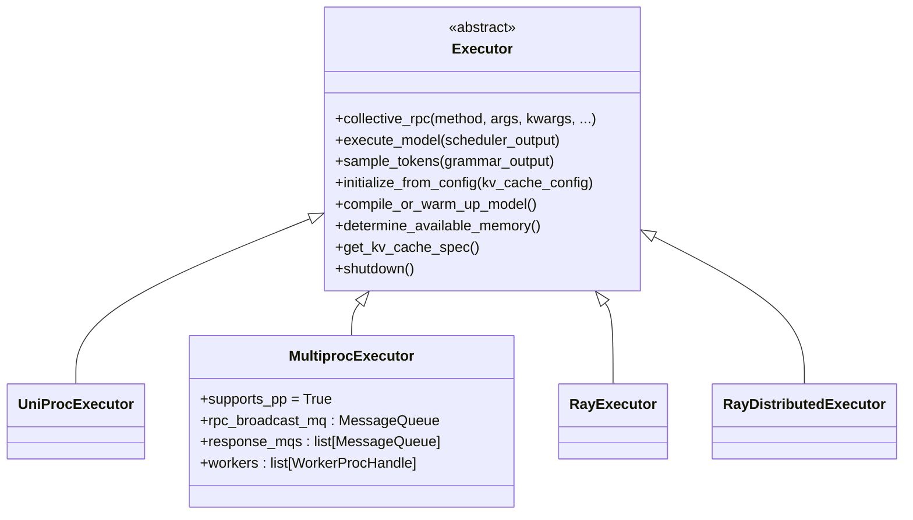
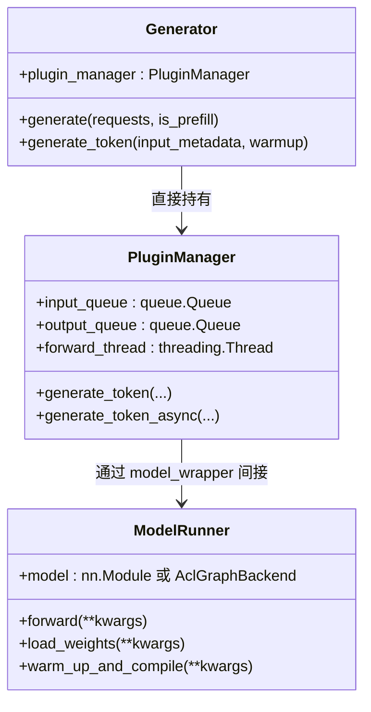
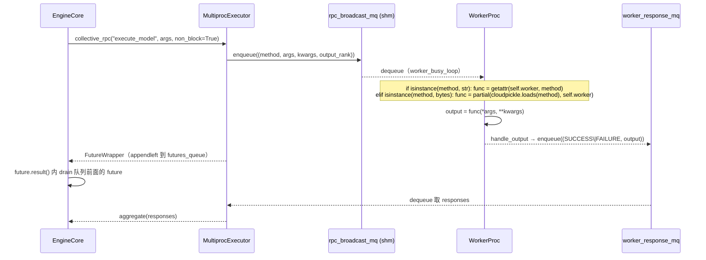
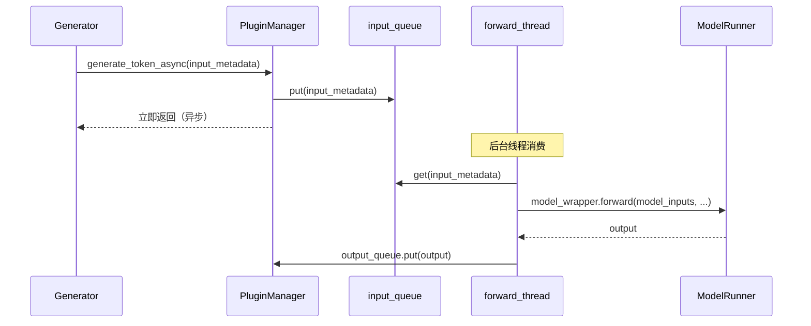
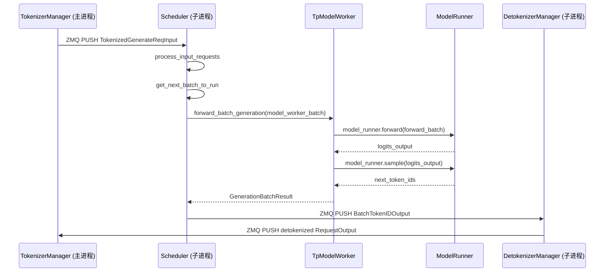

# Cross-project Comparison: Executor / Worker

## Summary

三家 "executor / worker" 边界差异比 [engine-architecture.md](engine-architecture.md) 还要鲜明：
- **vLLM 唯一拥有显式 `Executor` 抽象**（[abstract.py](d:\design\vllm\vllm\v1\executor\abstract.py)），4 实现（UniProc / MultiProc / Ray / RayV2）覆盖 inproc / 多进程 / Ray / RayV2 四种部署形态；worker = 独立进程，通过 `MessageQueue` 共享内存广播队列 + `getattr(self.worker, method)` 字符串 RPC 调用。
- **MindIE 无 Executor 抽象**：`Generator` 直接调 `PluginManager.generate_token`（[plugin_manager.py:107-115](d:\design\MindIE-LLM\mindie_llm\text_generator\plugins\plugin_manager.py)），后者持 `forward_thread` 后台线程消费 input_queue → `ModelRunner.forward`；worker = 同进程线程，同进程 Python 函数调用，多卡通过 Ascend HCCL 集合通信。
- **SGLang 无 Executor 抽象**：`Scheduler` 直接持 `TpModelWorker`（[scheduler.py:615 init_tp_model_worker](d:\design\sglang\python\sglang\srt\managers\scheduler.py)），后者持 `ModelRunner` 跑 forward；worker = scheduler 进程内对象，多 worker = 多 scheduler 进程 + NCCL。

`synthesis:` "Worker" 字面三家都有但所指迥异：vLLM `Worker` 是**进程级 + 设备级**包装，承担 `init_device` / KV profile / RPC 协议；MindIE 无独立 Worker 类（`PluginManager.forward_thread` 承担线程级 worker 角色）；SGLang `TpModelWorker` 是**对象级**包装，承担 model_runner 持有 + sampling 路由。**类名不可直接类比**。

## Sources

见 frontmatter `sources:`（13 个核心源文件 + 14 个相关 wiki 页）。

## §1 Executor 抽象层（决定整体架构形态）

### vLLM：唯一显式 `Executor` 抽象 + 4 实现



- **抽象基类**：[`Executor(ExecutorBase)`](d:\design\vllm\vllm\v1\executor\abstract.py)（[abstract.py:37+](d:\design\vllm\vllm\v1\executor\abstract.py)）声明 `collective_rpc` 等核心 RPC 接口；`Executor.get_class(vllm_config)` 工厂根据 `distributed_executor_backend` 字段选具体子类。
- **4 实现**（[v1/executor/](d:\design\vllm\vllm\v1\executor)）：
  - [`UniProcExecutor`](d:\design\vllm\vllm\v1\executor\uniproc_executor.py)：单进程；worker 在 executor 自身进程内构造
  - [`MultiprocExecutor`](d:\design\vllm\vllm\v1\executor\multiproc_executor.py)：multiprocessing spawn N 个 worker 子进程；用 `MessageQueue` 共享内存广播队列下发 `SchedulerOutput`，每 worker 一个 `MessageQueue` 回送 `ModelRunnerOutput`（详 [vllm/entities/MultiprocExecutor.md](../../vllm/entities/MultiprocExecutor.md)）
  - [`RayExecutor`](d:\design\vllm\vllm\v1\executor\ray_executor.py)：Ray actor 后端（V1）
  - [`RayExecutorV2`](d:\design\vllm\vllm\v1\executor\ray_executor_v2.py)：新版 Ray actor，含 elastic EP 支持

### MindIE：无 Executor，`Generator` 直挂



- **无独立 Executor 抽象**：`Generator.generate / prefill / decode / generate_mix`（[generator.py:718-756](d:\design\MindIE-LLM\mindie_llm\text_generator\generator.py)）直接调 `PluginManager.generate_token` / `generate_token_async`（[generator.py:636-650](d:\design\MindIE-LLM\mindie_llm\text_generator\generator.py)）。
- **PluginManager.forward_thread 等价于 worker 后台线程**：[plugin_manager.py:107-115](d:\design\MindIE-LLM\mindie_llm\text_generator\plugins\plugin_manager.py) 启动 `threading.Thread(target=forward_loop)` 消费 input_queue，调 `model_wrapper.forward` → `ModelRunner.forward`；这是 MindIE 端 "异步 worker" 的 hidden state（详 `PluginManager.md`（已删） hidden state 表）。
- **多 NPU 调度**：通过 Ascend HCCL 集合通信在同进程多线程内完成（无独立进程）。

### SGLang：无 Executor，`Scheduler` 直持 `TpModelWorker`

```mermaid
classDiagram
    class Scheduler {
        +tp_worker : TpModelWorker
        +draft_worker : Optional[TpModelWorker]
        +run_batch(batch)
        +process_batch_result(batch, result)
    }
    class BaseTpWorker {
        +forward_batch_generation(forward_batch)
        +get_memory_pool()
    }
    class TpModelWorker {
        +server_args
        +model_runner : ModelRunner
        +tp_size, pp_size, ep_size
        +tp_rank, pp_rank, dp_rank
        +pp_group, world_group
        +max_total_num_tokens
        +enable_overlap, enable_spec
        +_init_model_config()
        +_init_model_runner()
    }
    class ModelRunner
    BaseTpWorker <|-- TpModelWorker
    Scheduler --> TpModelWorker : init_tp_model_worker (scheduler.py:615)
    TpModelWorker --> ModelRunner : _init_model_runner (tp_worker.py:260)
```

- **无独立 Executor 抽象**：[`Scheduler.init_tp_model_worker`](d:\design\sglang\python\sglang\srt\managers\scheduler.py)（[scheduler.py:615](d:\design\sglang\python\sglang\srt\managers\scheduler.py)）直接 `self.tp_worker = TpModelWorker(...)`；scheduler 与 worker 同进程。
- **`TpModelWorker(BaseTpWorker)`**（[tp_worker.py:217](d:\design\sglang\python\sglang\srt\managers\tp_worker.py)）：持 `ModelRunner`（[tp_worker.py:259-260](d:\design\sglang\python\sglang\srt\managers\tp_worker.py)）；`forward_batch_generation`（[tp_worker.py:443-528](d:\design\sglang\python\sglang\srt\managers\tp_worker.py)）是主入口。
- **多 worker = 多 scheduler 进程**：每 TP × PP × DP rank 一个 `mp.Process(target=run_scheduler_process, ...)`（[engine.py:566-580](d:\design\sglang\python\sglang\srt\entrypoints\engine.py)），通过 NCCL 集合通信。

### §1 三方对照表

| 维度 | MindIE | vLLM | SGLang |
|---|---|---|---|
| **Executor 抽象层** | ❌ 无 | ✅ [`Executor`](d:\design\vllm\vllm\v1\executor\abstract.py) + 4 实现 | ❌ 无 |
| **Executor 等价物** | `Generator` 直接调 `PluginManager` | [`UniProcExecutor`](d:\design\vllm\vllm\v1\executor\uniproc_executor.py) / [`MultiprocExecutor`](d:\design\vllm\vllm\v1\executor\multiproc_executor.py) / [`RayExecutor`](d:\design\vllm\vllm\v1\executor\ray_executor.py) / [`RayDistributedExecutor`](d:\design\vllm\vllm\v1\executor\ray_executor_v2.py) | `Scheduler` 直接持 `TpModelWorker` |
| **可插拔分布式后端** | ❌ 仅 HCCL | ✅ multiprocessing / Ray 可选 | ❌ 仅 mp.Process + NCCL |
| **Executor 工厂位置** | N/A | [`Executor.get_class`](d:\design\vllm\vllm\v1\executor\abstract.py)（按 `distributed_executor_backend` 选） | N/A |
| **抽象层级数量** | Generator → PluginManager → ModelRunner（**3 层**）| LLMEngine/AsyncLLM → EngineCore → EngineCoreClient → Executor → Worker → ModelRunner（**6 层**）| Engine launcher → Scheduler → TpModelWorker → ModelRunner（**4 层**）|

`synthesis:` vLLM 的 `Executor` 抽象是**为了支撑可插拔分布式后端**（multiprocessing vs Ray vs Inproc）；MindIE/SGLang 选择不抽象，是因为各自固定走单一并行方案（HCCL 多线程 vs NCCL 多进程），没有"换 backend"的需要。

---

## §2 Worker 类层次与字段表

### vLLM：`Worker(WorkerBase)` + 持 `GPUModelRunner`

| 字段 | 说明 | 锚点 |
|---|---|---|
| `vllm_config` / `parallel_config` / `device_config` / `cache_config` | 配置快照（基类） | [worker_base.py:63-88](d:\design\vllm\vllm\v1\worker\worker_base.py) |
| `model_runner: GPUModelRunner` | V1 / V2 由 `VLLM_USE_V2_MODEL_RUNNER` 决定 | [gpu_worker.py:295-310](d:\design\vllm\vllm\v1\worker\gpu_worker.py) |
| `elastic_ep_executor` | `ElasticEPScalingExecutor` | [gpu_worker.py:126-128](d:\design\vllm\vllm\v1\worker\gpu_worker.py) |
| `weight_transfer_engine` | 在线权重更新 | [gpu_worker.py:133-141](d:\design\vllm\vllm\v1\worker\gpu_worker.py) |
| `profiler` | `TorchProfilerWrapper` / `CudaProfilerWrapper` | [gpu_worker.py:143-151](d:\design\vllm\vllm\v1\worker\gpu_worker.py) |
| `_pp_send_work: list[Handle]` | PP 异步 send handle | [gpu_worker.py:154-155](d:\design\vllm\vllm\v1\worker\gpu_worker.py) |
| `_sleep_saved_buffers` | sleep 模式缓冲 | [gpu_worker.py:130-131](d:\design\vllm\vllm\v1\worker\gpu_worker.py) |

### MindIE：`ModelRunner` + 上层 `AclGraphModelWrapper`（**无独立 Worker 类**）

| 字段 | 说明 | 锚点 |
|---|---|---|
| `model: nn.Module` 或 `AclGraphBackend(model)` | 模型对象 | [model_runner.py:240-247](d:\design\MindIE-LLM\mindie_llm\runtime\model_runner\model_runner.py) |
| `mindie_llm_config` | 配置 | [model_runner.py:49-198](d:\design\MindIE-LLM\mindie_llm\runtime\model_runner\model_runner.py) |
| `mapping` | 并行 mapping（attn_dp/inner_sp/cp） | [aclgraph_model_wrapper.py](d:\design\MindIE-LLM\mindie_llm\modeling\model_wrapper\aclgraph\aclgraph_model_wrapper.py) |
| `attn_layers` | layerwise attn 层 dict | [model_runner.py:227-228](d:\design\MindIE-LLM\mindie_llm\runtime\model_runner\model_runner.py) |
| `graph_batch_sizes` | aclgraph capture 用 | [model_runner.py:244-245](d:\design\MindIE-LLM\mindie_llm\runtime\model_runner\model_runner.py) |

`PluginManager.forward_thread` 承担 worker 进程角色（同进程线程），但 worker 状态散在 `Generator` / `PluginManager` / `ModelRunner` 三层。

### SGLang：`TpModelWorker(BaseTpWorker)` + 持 `ModelRunner`

| 字段 | 说明 | 锚点 |
|---|---|---|
| `server_args` | 服务参数 | [tp_worker.py:238](d:\design\sglang\python\sglang\srt\managers\tp_worker.py) |
| `tp_size` / `pp_size` / `ep_size` | 并行尺寸 | [tp_worker.py:239-241](d:\design\sglang\python\sglang\srt\managers\tp_worker.py) |
| `tp_rank` / `pp_rank` / `dp_rank` / `gpu_id` / `nccl_port` | rank/设备 | [tp_worker.py:242-247](d:\design\sglang\python\sglang\srt\managers\tp_worker.py) |
| `is_draft_worker` | 是否 spec draft 模式 | [tp_worker.py:248](d:\design\sglang\python\sglang\srt\managers\tp_worker.py) |
| `model_runner: ModelRunner` | 真正 forward | [tp_worker.py:260](d:\design\sglang\python\sglang\srt\managers\tp_worker.py) |
| `model_runner_list: List[ModelRunner]` | MTP 多个 | [tp_worker.py:257](d:\design\sglang\python\sglang\srt\managers\tp_worker.py) |
| `req_to_token_pool` / `token_to_kv_pool_allocator` | KV pool（与 target worker 共享） | [tp_worker.py:250-251](d:\design\sglang\python\sglang\srt\managers\tp_worker.py) |
| `pp_group` / `world_group` | NCCL 组 | [tp_worker.py:288-289](d:\design\sglang\python\sglang\srt\managers\tp_worker.py) |
| `max_total_num_tokens` / `max_prefill_tokens` / `max_running_requests` | 内存预算 | [tp_worker.py:292-296](d:\design\sglang\python\sglang\srt\managers\tp_worker.py) |
| `enable_overlap` / `enable_spec` | 模式 flag | [tp_worker.py:318-319](d:\design\sglang\python\sglang\srt\managers\tp_worker.py) |

### §2 三方对照表

| 维度 | MindIE | vLLM | SGLang |
|---|---|---|---|
| **Worker 主类** | **无**（`PluginManager.forward_thread` 充当）| `Worker(WorkerBase)` | `TpModelWorker(BaseTpWorker)` |
| **基类** | N/A | `WorkerBase`（[worker_base.py:63+](d:\design\vllm\vllm\v1\worker\worker_base.py)） | `BaseTpWorker` |
| **持 ModelRunner 字段** | `Generator.generator_backend.model_wrapper.model_runner` | `Worker.model_runner: GPUModelRunner` | `TpModelWorker.model_runner: ModelRunner` |
| **多 ModelRunner 列表** | `MtpWorker.draft_model_runner`（spec decode） | 无（spec 通过 `drafter` 字段） | `TpModelWorker.model_runner_list: List[ModelRunner]`（[tp_worker.py:257](d:\design\sglang\python\sglang\srt\managers\tp_worker.py)，**MTP 时多个**） |
| **是否含设备初始化逻辑** | `ModelRunner.__init__` 内（`set_device(rank, npu_id)`，[model_runner.py:76-77](d:\design\MindIE-LLM\mindie_llm\runtime\model_runner\model_runner.py)） | `Worker.init_device` 独立方法（[gpu_worker.py:220-314](d:\design\vllm\vllm\v1\worker\gpu_worker.py)） | `ModelRunner` 内（worker 不显式 `init_device`） |
| **是否含 KV profile 逻辑** | `Generator.warm_up`（[generator.py:757+](d:\design\MindIE-LLM\mindie_llm\text_generator\generator.py)） | `Worker.determine_available_memory`（[gpu_worker.py:331-482](d:\design\vllm\vllm\v1\worker\gpu_worker.py)） | `ModelRunner.profile_max_num_token` |
| **是否含 PP 处理** | ❌（`pipeline_parallel.py 草稿不可用`（已删）） | ✅ `_pp_send_work` + `irecv_tensor_dict` / `isend_tensor_dict`（[gpu_worker.py:154-155, 754-839](d:\design\vllm\vllm\v1\worker\gpu_worker.py)） | ✅ `pp_group.is_last_rank` 判定（[tp_worker.py:467](d:\design\sglang\python\sglang\srt\managers\tp_worker.py)） + Scheduler PP mixin |

---

## §3 Worker 进程模型

| 维度 | MindIE | vLLM | SGLang |
|---|---|---|---|
| **Worker 是否独立进程** | ❌ 否（同进程线程 `forward_thread`） | ✅ MultiprocExecutor / RayExecutor 时**是**；UniProcExecutor 时不是 | ❌ 否（在 scheduler 进程内） |
| **多 worker 实现** | 同进程多线程 + Ascend HCCL 集合通信 | `mp.Process` × N + `MessageQueue` shm 广播 + NCCL | `mp.Process` × (TP×PP×DP)（每进程一 scheduler+worker）+ NCCL |
| **进程命名** | 单 generator 进程 | `Worker_DP{r}_PP{r}_PCP{r}_TP{r}_DCP{r}_EP{r}`（[multiproc_executor.py:981-1015](d:\design\vllm\vllm\v1\executor\multiproc_executor.py)） | scheduler 进程内即 worker，无单独命名 |
| **进程启动方式** | N/A | `multiprocessing.Process(context=spawn)` + `numa_utils.configure_subprocess`（[multiproc_executor.py:685-696](d:\design\vllm\vllm\v1\executor\multiproc_executor.py)） | `mp.Process(target=run_scheduler_process, ...)`（[engine.py:566-580](d:\design\sglang\python\sglang\srt\entrypoints\engine.py)） |
| **进程死亡监控** | N/A | `MultiprocExecutor.monitor_workers` 后台线程 + `multiprocessing.connection.wait` 阻塞等任一 worker 进程结束（[multiproc_executor.py:276-307](d:\design\vllm\vllm\v1\executor\multiproc_executor.py)） | `SubprocessWatchdog`（[engine.py:206-207](d:\design\sglang\python\sglang\srt\entrypoints\engine.py)） |
| **死亡传播** | N/A | `failure_callback` 由 `EngineCoreProc` 注册成 "把 EXECUTOR_FAILED put 到 input_queue"（[engine/core.py:823-825](d:\design\vllm\vllm\v1\engine\core.py)） | watchdog 终止主进程 |
| **优雅关闭** | 同进程线程 join | 三段式：death_pipe EOF → SIGTERM → SIGKILL（[multiproc_executor.py:414-477](d:\design\vllm\vllm\v1\executor\multiproc_executor.py)） | `gracefully_exit` flag + scheduler 子进程自然退出 |

`synthesis:` vLLM 多进程 worker 模型是三家中**最复杂也最 robust** 的——独立的 ready handshake / death pipe / failure callback 形成完整的子进程生命周期管理；代价是 ~30 行配置 + ~700 行 worker 进程管理代码（[multiproc_executor.py](d:\design\vllm\vllm\v1\executor\multiproc_executor.py)）。MindIE 同进程线程模型最简单，但 worker 异常无法被进程级隔离。SGLang 把 worker 与 scheduler 绑同一进程，简化了管理但失去了"动态扩缩 worker"的能力。

---

## §4 RPC / 调用机制

### vLLM：`MessageQueue.enqueue` + `getattr(self.worker, method)` 字符串 RPC



要点：
- **方法名作字符串透传**，worker 端用 `getattr(self.worker, method)` 解析（[multiproc_executor.py:961-964](d:\design\vllm\vllm\v1\executor\multiproc_executor.py)）—— **`Worker` 类上任何 method 都自动暴露为 RPC 入口**
- **callable 也可序列化传**：用 `cloudpickle.dumps(method)` + 字节串方式（[multiproc_executor.py:378-381](d:\design\vllm\vllm\v1\executor\multiproc_executor.py)），worker 端 `cloudpickle.loads + partial(..., self.worker)`
- **Future 队列保证顺序**：`FutureWrapper.result()` 自动 drain 队列里排在它前面的所有 future，避免乱序拿响应（[multiproc_executor.py:68-99](d:\design\vllm\vllm\v1\executor\multiproc_executor.py)）
- **`output_rank` 控制返回粒度**：单 rank 返回（默认）vs 所有 rank 返回（KV connector 聚合场景，`output_rank=None`）

### MindIE：Python 同进程函数调用（无 RPC）



要点：
- 跨"角色"调用都是 **同进程 Python 函数 / 队列 put / get**，没有跨进程 IPC
- `PluginManager.forward_thread` 是 hidden state（Python `threading.Thread`）；同步路径直接调 `generate_token`（无队列、无线程）
- 错误处理：Python 异常直接 raise；C++ `LlmEngine` 端的异常通过 pybind 转 Python

### SGLang：Python 同进程函数调用（scheduler ↔ worker）+ ZMQ（跨进程）



要点：
- **scheduler ↔ worker 是同进程函数调用**（无跨进程 RPC），与 MindIE 同
- **跨进程 IPC 仅在 manager 之间**（TM/Scheduler/DTM 三独立进程）：ZMQ PUSH/PULL + `recv_pyobj` / `send_pyobj` pickle 序列化（[detokenizer_manager.py:184-188](d:\design\sglang\python\sglang\srt\managers\detokenizer_manager.py)）
- **Sampling 与 forward 在同一 method 内**：`forward_batch_generation` 同时跑 forward + sample（[tp_worker.py:443-528](d:\design\sglang\python\sglang\srt\managers\tp_worker.py)）；可选 `delay_sample_func` 延后采样（grammar + overlap 模式，[tp_worker.py:484-497](d:\design\sglang\python\sglang\srt\managers\tp_worker.py)）

### §4 三方对照表

| 维度 | MindIE | vLLM | SGLang |
|---|---|---|---|
| **Engine→Worker 调用方式** | Python 函数 / `queue.Queue` put-get | **跨进程 RPC**：`MessageQueue.enqueue` + `getattr(self.worker, method)` 字符串解析 | Python 函数（同进程） |
| **方法名解析** | 直接 attr 调用 | `getattr(self.worker, method)` + `cloudpickle.loads` 双路径 | 直接 attr 调用 |
| **顺序保证** | 队列 FIFO | `FutureWrapper.result()` drain 队列前面的 future | 同步函数调用天然顺序 |
| **跨进程 IPC** | 仅 generator↔connector（共享内存 + protobuf） | 前端↔EngineCore：ZMQ；Executor↔Worker：MessageQueue shm | 仅 manager 间：ZMQ + pickle |
| **错误回传** | Python 异常 raise（同进程） | FAILURE 帧 + traceback `add_note` + `add_note(traceback.format_exc())` | scheduler/worker 同进程异常直接传播；管理进程间通过 watchdog |
| **零拷贝优化** | N/A | `MessageQueue` 共享内存环形 buffer，零拷贝 | ZMQ pickle，**无零拷贝**（synthesis：吞吐 ceiling 受 pickle 性能影响）|

---

## §5 forward 路径与 sampler 拆分

| 维度 | MindIE | vLLM | SGLang |
|---|---|---|---|
| **forward 主入口** | `ModelRunner.forward` ([model_runner.py:284-321](d:\design\MindIE-LLM\mindie_llm\runtime\model_runner\model_runner.py)) | `GPUModelRunner.execute_model` ([gpu_model_runner.py:3762-4112](d:\design\vllm\vllm\v1\worker\gpu_model_runner.py)) | `TpModelWorker.forward_batch_generation` ([tp_worker.py:443-528](d:\design\sglang\python\sglang\srt\managers\tp_worker.py)) → `ModelRunner.forward` |
| **sampler 入口** | 在 `PluginManager.generate_token` 内串行调（同 method） | `GPUModelRunner.sample_tokens`（与 `execute_model` **拆为两 method**，[GPUModelRunner.md §8](../../vllm/entities/GPUModelRunner.md)） | 在 `forward_batch_generation` 内：`self.model_runner.sample(logits_output, forward_batch)`（同 method，[tp_worker.py:491-503](d:\design\sglang\python\sglang\srt\managers\tp_worker.py)） |
| **forward+sample 拆分原因** | 无拆分（单 method） | **拆**：因 async scheduler 需要"forward 完后下一 batch 的调度可与本 batch 的 sample 并行"，用 `ExecuteModelState` 在两 method 之间暂存（[GPUModelRunner.md §8](../../vllm/entities/GPUModelRunner.md)） | **可拆可不拆**：`delay_sample_func` 仅在 grammar + overlap + 非 spec 时启用（[tp_worker.py:484-497](d:\design\sglang\python\sglang\srt\managers\tp_worker.py)） |
| **forward 返回类型** | `(logits, hidden_states)`（spec decode 时含 hidden）/ `logits`（普通） | `ModelRunnerOutput` / `IntermediateTensors`（PP 非末段）/ `None`（拆分模式） | `GenerationBatchResult`（含 `next_token_ids` / `logits_output` / `expert_distribution_metrics`） |
| **PP 末段判断** | `pipeline_parallel.py:30-39 broadcast_pipeline_tokens`（**草稿，未接入主线**） | `Worker.execute_model` 内 `isend_tensor_dict` if 非末段（[gpu_worker.py:825-839](d:\design\vllm\vllm\v1\worker\gpu_worker.py)） | `if self.pp_group.is_last_rank: ... model_runner.forward + sample` else `forward only`（[tp_worker.py:467](d:\design\sglang\python\sglang\srt\managers\tp_worker.py)） |
| **prefill-only 处理** | 无显式分支 | 通过 `SchedulerOutput` 字段控制 | `if not model_worker_batch.is_prefill_only` 分支（[tp_worker.py:499-518](d:\design\sglang\python\sglang\srt\managers\tp_worker.py)），prefill-only 时返 dummy `next_token_ids = torch.zeros(...)` |
| **logprobs 单独路径** | 在 sampler 内 | 在 `OutputProcessor.process_outputs` 内调 `LogprobsProcessor.update_from_output` | `compute_logprobs_only` 当 `is_prefill_only + return_logprob` 时（[tp_worker.py:512-519](d:\design\sglang\python\sglang\srt\managers\tp_worker.py)） |

`synthesis:` "**forward 与 sample 是否拆为两 method**"是三家差异显著的设计选择——
- **vLLM 拆**（强需求：async scheduler 必须）→ 引入 `ExecuteModelState` 暂存 + `return None` 约定
- **MindIE 不拆** → 同 method 串行执行（async 路径靠 forward_thread 后台线程并发）
- **SGLang 可拆可不拆** → `delay_sample_func` 是按需 closure 延后采样（仅 grammar+overlap+非spec），不需要全局暂存对象

vLLM 的拆分是**最复杂的设计**（需要约定 `execute_model_state` 等暂存字段、保证两 method 顺序调用、None 返回值的语义），但也是**最灵活的**——它原生支持"step 1 forward 完即可调度 step 2 forward，step 1 sample 与 step 2 forward 并发"的 fine-grained pipeline。

---

## §6 多 Worker 并行机制

| 维度 | MindIE | vLLM | SGLang |
|---|---|---|---|
| **多 worker 进程模型** | 同进程多线程（HCCL）| 多进程（NCCL，或 Ray actor） | 多进程（每 scheduler 进程一 worker，NCCL）|
| **TP 实现** | HCCL `all_reduce` / `all_gather`（`ParallelInfoManager.md`（已删））| NCCL `all_reduce` / `all_gather` + 18 device_communicators 后端（详 [comparison/topics/distributed.md](distributed.md)） | NCCL + 12+ device_communicators |
| **PP 实现** | ❌ pipeline_parallel.py 草稿未接入（`topics/aclgraph-pp.md`（已删）） | ✅ `Worker._pp_send_work` + `isend_tensor_dict` / `irecv_tensor_dict`（[gpu_worker.py:154-155, 754-839](d:\design\vllm\vllm\v1\worker\gpu_worker.py)） | ✅ `SchedulerPPMixin` + `pp_group.is_last_rank` 分支（[scheduler.py:317-329](d:\design\sglang\python\sglang\srt\managers\scheduler.py)） |
| **DP 实现** | `is_dp_and_server_centralized` 模式（`ModelRunnerExp`（已删）） | `DPLBAsyncMPClient` 在 EngineCoreClient 层 LB（[EngineCoreClient.md](../../vllm/entities/EngineCoreClient.md)）；DP attention：v1/worker/dp_utils.py | `DataParallelController` 进程做 DP 路由（[entrypoints/engine.py:592-602](d:\design\sglang\python\sglang\srt\entrypoints\engine.py)）；DP attention：layers/dp_attention.py |
| **EP（Expert Parallel）** | `MOE_EP` / `MOE_EP_MC2` enum（`ParallelInfoManager.md`（已删）） | `model_executor/layers/fused_moe/prepare_finalize/`（含 deepep/naive_dp_ep/nixl_ep）+ `vllm/distributed/eplb/` | `srt/layers/moe/token_dispatcher/` 7 后端 + `srt/eplb/` |
| **rank 显式数量（scheduler 层）** | 6 维（`tp_rank` / `pp_rank` / `dp_rank` / `cp_rank` / `sp_rank` 等） | 3-5 维（[multiproc_executor.py:981-1015](d:\design\vllm\vllm\v1\executor\multiproc_executor.py) `setup_proc_title_and_log_prefix`） | 6 维（`gpu_id, tp_rank, moe_ep_rank, pp_rank, attn_cp_rank, moe_dp_rank, dp_rank`，[scheduler.py:332-343](d:\design\sglang\python\sglang\srt\managers\scheduler.py)） |
| **EPLB / Elastic-EP** | ❌ 无（`topics/moe.md`（已删）） | ✅ `vllm/distributed/eplb/` + `v1/worker/gpu/eplb_utils.py` + `vllm/distributed/elastic_ep/` | ✅ `srt/eplb/`（含 simulator）+ `srt/elastic_ep/` |

**深度对比**：详 [comparison/topics/distributed.md](distributed.md)（9 个子维度涵盖 TP/PP/DP/EP）。

---

## §7 启动序列对照

### vLLM Worker 启动（最复杂）

`MultiprocExecutor._init_executor` 启动序列（[multiproc_executor.py:108-256](d:\design\vllm\vllm\v1\executor\multiproc_executor.py)）：
1. 注册 finalizer
2. 算 parallel sizes：`tp_size * pp_size * pcp_size == world_size`
3. `set_multiprocessing_worker_envs()`（设 `OMP_NUM_THREADS=1`）
4. 算 distributed init method（`tcp://<loopback>:<port>`）
5. DP 主节点创建 `rpc_broadcast_mq` + `export_handle()`
6. 循环 spawn workers：每 local_rank 一个 `WorkerProc.make_worker_process(...)`
7. fork 模式特殊处理 inherited fds
8. `WorkerProc.wait_for_ready(unready_workers)` 阻塞等所有 worker `READY`
9. 启动 worker 健康监控线程
10. 装配 `response_mqs`
11. **MQ 双向 wait_until_ready**（**有顺序依赖，颠倒会死锁**）
12. `output_rank = _get_output_rank()`

Worker 子进程内（`WorkerProc.worker_main`，[multiproc_executor.py:800-904](d:\design\vllm\vllm\v1\executor\multiproc_executor.py)）：
1. 装 SIGTERM/SIGINT handler
2. 关 inherited fds
3. `WorkerProc(*args, **kwargs)` 内：load_model + 设进程名 + spec/async output thread + `_init_message_queues`
4. 启 `monitor_death_pipe` 线程
5. 送 `READY` 给父进程（含 `peer_response_handles`）
6. 双 MQ wait_until_ready
7. 进入 `worker.worker_busy_loop()`

### MindIE Worker 启动（最简）

无独立 Worker 启动；`Generator.__init__` 内：
1. 加载模型（`get_generator_backend(model_config)` → `ModelRunner.load_weights`）
2. PluginManager 初始化（`_init_plugin_manager`）—— async 时启动 `forward_thread`
3. C++ `LlmEngine.StartEngineThread` 由外部调（与 Generator 并行）

无 ready handshake、无健康监控线程、无 MQ 双向同步。

### SGLang Worker 启动

`TpModelWorker.__init__` 序列（[tp_worker.py:220-321](d:\design\sglang\python\sglang\srt\managers\tp_worker.py)）：
1. 解析参数（[238-254](d:\design\sglang\python\sglang\srt\managers\tp_worker.py)）
2. `model_runner_list: List[ModelRunner] = []`（MTP 用）
3. `_init_model_config()` + `_init_model_runner()`（[259-260](d:\design\sglang\python\sglang\srt\managers\tp_worker.py)）
4. 可选 `_init_multi_layer_eagle_model_runners()` / `_init_dllm_algorithm()`
5. tokenizer 装载（[267-284](d:\design\sglang\python\sglang\srt\managers\tp_worker.py)）
6. `pp_group / world_group` 取 NCCL 组（[287-289](d:\design\sglang\python\sglang\srt\managers\tp_worker.py)）
7. 内存预算计算（[291-307](d:\design\sglang\python\sglang\srt\managers\tp_worker.py)）
8. `broadcast_pyobj` 跨 TP rank 同步 random seed（[309-316](d:\design\sglang\python\sglang\srt\managers\tp_worker.py)）
9. flag 设置：`enable_overlap` / `enable_spec`（[318-319](d:\design\sglang\python\sglang\srt\managers\tp_worker.py)）

`Scheduler.init_tp_model_worker` 调（[scheduler.py:615](d:\design\sglang\python\sglang\srt\managers\scheduler.py)）。`mp.Pipe` `wait_for_ready` 由 Engine launcher 等（[engine.py:606-609](d:\design\sglang\python\sglang\srt\entrypoints\engine.py)）。

### §7 启动复杂度对照表

| 维度 | MindIE | vLLM | SGLang |
|---|---|---|---|
| **fork 子进程数** | 0（同进程线程） | N = TP×PP×PCP | TP×PP×DP（每进程一 scheduler+worker）+ DTM |
| **就绪同步机制** | 无显式 | ZMQ ready handshake + READY 字符串 + `BackgroundResources.weakref.finalize` | `mp.Pipe` 单向 + `wait_for_scheduler_ready` |
| **死锁风险点** | N/A | **MQ 双向 wait_until_ready 顺序敏感**（[multiproc_executor.py:234-238](d:\design\vllm\vllm\v1\executor\multiproc_executor.py)） | scheduler 子进程未 ready 阻塞主进程 |
| **健康监控线程** | N/A | `monitor_workers` 后台线程（`multiprocessing.connection.wait`） | `SubprocessWatchdog` |
| **NUMA / CPU 绑定** | `bind_cpus(ratio=1.0)` 受 ENV 控制 | `numa_utils.configure_subprocess` 上下文（[multiproc_executor.py:692-696](d:\design\vllm\vllm\v1\executor\multiproc_executor.py)） | `numa_utils.configure_subprocess`（[engine.py:581-584](d:\design\sglang\python\sglang\srt\entrypoints\engine.py)） |

---

## §8 错误处理与传播

| 维度 | MindIE | vLLM | SGLang |
|---|---|---|---|
| **同进程异常** | Python 直接 raise（C++ → pybind → Python 异常） | Python 直接 raise（在同进程组件间） | Python 直接 raise |
| **跨进程异常** | N/A | **FAILURE 帧 + traceback `add_note`**（[multiproc_executor.py:953-979](d:\design\vllm\vllm\v1\executor\multiproc_executor.py)）任意 worker FAIL → 立刻 raise `RuntimeError`（[multiproc_executor.py:398-402](d:\design\vllm\vllm\v1\executor\multiproc_executor.py)） | scheduler 子进程异常 → watchdog 检测 → 主进程 abort |
| **进程死亡检测** | N/A | `multiprocessing.connection.wait([h.proc.sentinel for h in workers])` 阻塞等任一 worker 进程结束（[multiproc_executor.py:284-285](d:\design\vllm\vllm\v1\executor\multiproc_executor.py)） | `SubprocessWatchdog` |
| **死亡传播** | N/A | `failure_callback` → EngineCoreProc 把 `EXECUTOR_FAILED` put 到 input_queue → EngineCore 异常退出 | watchdog 终止主进程 |
| **OOM 处理** | `torch.OutOfMemoryError` 转 `ErrorCodeException`（含 HCCL 提示，[generator.py:680-687](d:\design\MindIE-LLM\mindie_llm\text_generator\generator.py)） | （待 ingest） | `SchedulerRuntimeCheckerMixin` |
| **优雅关闭三段式** | N/A | death_pipe EOF（4s）→ SIGTERM（4s）→ SIGKILL（[multiproc_executor.py:414-477](d:\design\vllm\vllm\v1\executor\multiproc_executor.py)） | `gracefully_exit` flag |

---

## §9 综合对照（顶层 cheat sheet）

| 维度 | MindIE | vLLM | SGLang |
|---|---|---|---|
| **Executor 抽象** | ❌ 无 | ✅ 4 实现（UniProc/MultiProc/Ray/RayV2） | ❌ 无 |
| **Worker 主类** | 无（PluginManager.forward_thread）| `Worker(WorkerBase)` | `TpModelWorker(BaseTpWorker)` |
| **持 ModelRunner 字段** | 无显式 worker 字段 | `Worker.model_runner: GPUModelRunner` | `TpModelWorker.model_runner: ModelRunner` |
| **Worker 进程独立** | ❌ | ✅（MP/Ray） | ❌ |
| **多 worker 实现** | 同进程多线程 + HCCL | mp.Process + MessageQueue shm + NCCL | mp.Process（每 scheduler 一进程）+ NCCL |
| **跨进程 RPC 协议** | N/A | MessageQueue + `getattr(self.worker, method)` | N/A |
| **零拷贝 IPC** | N/A | ✅ MessageQueue 共享内存 | ❌（pickle） |
| **forward+sample 拆分** | ❌ 同 method | ✅ 拆为两 method（async scheduler 必须） | ⚠️ 同 method + 可选 `delay_sample_func` |
| **PP 实现完成度** | ❌ 草稿未接入 | ✅ Worker._pp_send_work | ✅ SchedulerPPMixin |
| **EPLB / Elastic-EP** | ❌ | ✅ | ✅ |
| **Worker 健康监控** | N/A | `monitor_workers` 线程 | `SubprocessWatchdog` |
| **优雅关闭三段式** | N/A | death_pipe→SIGTERM→SIGKILL | gracefully_exit flag |
| **抽象层级数量** | 3（Generator→PluginManager→ModelRunner） | **6**（LLMEngine→EngineCore→EngineCoreClient→Executor→Worker→GPUModelRunner） | 4（Engine→Scheduler→TpModelWorker→ModelRunner） |

---

## §10 Anchor-driven cross-check（按 [AGENTS.md §8 规则 6](../../AGENTS.md)）

### Anchor 1：vLLM `Executor` 4 实现工厂

- **vLLM**：[`Executor.get_class(vllm_config)`](d:\design\vllm\vllm\v1\executor\abstract.py)（按 `distributed_executor_backend` 字段选）+ 4 子类文件（[v1/executor/](d:\design\vllm\vllm\v1\executor)）
- **MindIE**：在 `d:\design\MindIE-LLM\` 全树 grep `Executor` / `MultiprocExecutor` / `UniProcExecutor`：仅 C++ `src/executor/executor.cpp` 有 `Executor` class（与 vLLM 含义不同——MindIE C++ `Executor` 是连接 connector 与 LlmEngine 的外壳，**不是分布式执行抽象**）。N/A (verified 2026-04-18)：MindIE 无 vLLM 风格"可插拔分布式后端" Executor。
- **SGLang**：在 `d:\design\sglang\` 全树 grep `class Executor`：**0 命中**。`scheduler.py` 直接 `self.tp_worker = TpModelWorker(...)`（[scheduler.py:615](d:\design\sglang\python\sglang\srt\managers\scheduler.py)）。N/A (verified 2026-04-18)：SGLang 不抽象 Executor，多 worker 通过多 scheduler 进程实现。

### Anchor 2：vLLM `getattr(self.worker, method)` 字符串 RPC

- **vLLM**：[multiproc_executor.py:953-979](d:\design\vllm\vllm\v1\executor\multiproc_executor.py)
- **MindIE**：在 `d:\design\MindIE-LLM\mindie_llm\` 全树 grep `getattr(self\.worker` / `MessageQueue.*enqueue`：**0 命中**。N/A (verified 2026-04-18)：MindIE 同进程线程模型不需要 RPC 字符串解析。
- **SGLang**：在 `d:\design\sglang\` 全树 grep `getattr(self\.worker` / `MessageQueue`：**0 命中**。SGLang ZMQ 跨进程通信用 `recv_pyobj` / `send_pyobj` pickle 直传对象，**不用方法名 RPC**。N/A (verified 2026-04-18)。

### Anchor 3：SGLang `TpModelWorker.model_runner_list: List[ModelRunner]` MTP 多 ModelRunner

- **SGLang**：[tp_worker.py:257](d:\design\sglang\python\sglang\srt\managers\tp_worker.py)
- **MindIE**：等价物 `MtpWorker` 持 `main_model_runner` + `draft_model_runner` 两个 ModelRunner（[spec_worker.py](d:\design\MindIE-LLM\mindie_llm\runtime\model_runner\spec_worker.py)，详 `topics/speculative.md`（已删））。**同语义**。
- **vLLM**：等价物 `EagleProposer` / `EagleSpeculator` 不在 Worker 字段，而在 `GPUModelRunner.drafter` 字段（[gpu_model_runner.py:517-579](d:\design\vllm\vllm\v1\worker\gpu_model_runner.py)）。**结构差异**：SGLang/MindIE 在 worker 层持多 model runner；vLLM 在 model runner 层持 drafter。

`synthesis:` 三家 spec decode 在 worker 抽象上的位置不同——**SGLang `TpModelWorker.model_runner_list`** vs **MindIE `MtpWorker.draft_model_runner`** vs **vLLM `GPUModelRunner.drafter`**。这反映"draft 与 target 是否共享 worker 抽象"的设计选择：SGLang/MindIE 选择**worker 层共享**（一个 worker 持多个 model runner），vLLM 选择 **model runner 层嵌套**（一个 model runner 持 drafter 子组件）。

---

## §11 与 PD 优化的关联（synthesis）

从本页对比可借鉴的优化思路：

1. **从 vLLM 借鉴 `Executor` 抽象**（重申 [engine-architecture.md §13.1](engine-architecture.md)）：MindIE 当前 `Generator` 直接调 `PluginManager` 直接调 `ModelRunner`，缺少 Executor 抽象层使得"切换 worker 进程模型"（如未来希望尝试多进程 worker）需要改 generator 内部代码。
2. **从 vLLM 借鉴 MessageQueue 共享内存零拷贝 IPC**：SGLang 用 ZMQ + pickle 跨 manager 通信，被 [TokenizerManager.md CONTRADICTION](../../sglang/entities/TokenizerManager.md) 标注为"吞吐 ceiling 受 pickle 性能影响"；vLLM `MessageQueue` 共享内存 + 直接 deserialize（详 [vllm/topics/multiproc-ipc.md](../../vllm/topics/multiproc-ipc.md)）是更优解。
3. **从 vLLM 借鉴 forward+sample 拆分**：MindIE 当前 `PluginManager.generate_token` 串行做 forward + sample，无法实现"step 1 sample 与 step 2 forward 并发"；vLLM `execute_model` + `sample_tokens` 拆分 + `ExecuteModelState` 暂存是 fine-grained pipeline 的基础。
4. **从 vLLM 借鉴 worker 健康监控**：MindIE 同进程线程模型下 worker 异常无法被进程级隔离（一个 worker OOM 整个 generator 挂）；vLLM `monitor_workers` + `failure_callback` 提供 graceful degradation。
5. **从 SGLang 借鉴 `model_runner_list` 多 ModelRunner 设计**：MindIE `MtpWorker.draft_model_runner` 是双字段（main + draft），扩展到"多 draft model"（如 layered EAGLE）需要改类结构；SGLang 用 `List[ModelRunner]` 更通用。
6. **从 vLLM 借鉴 cloudpickle callable RPC**：vLLM worker 端可接收 cloudpickle 序列化的 callable（[multiproc_executor.py:378-381](d:\design\vllm\vllm\v1\executor\multiproc_executor.py)），允许前端动态注入逻辑（如 hook、断言、profiler）；MindIE/SGLang 没有这种灵活性。

---

## Notes / Caveats

> [!todo] VERIFY: MindIE C++ `src/executor/executor.cpp` 中 `Executor` 类的角色——本页假设它"不是分布式执行抽象"，但需读 .cpp 确认（grep 显示有 `Executor::BuildConnectorCommand` 等方法，疑似仅做 connector 进程编排）。

> [!todo] VERIFY: SGLang `BaseTpWorker` 基类的接口契约——本页只读了 `TpModelWorker` 子类，基类 `BaseTpWorker` 的 abstract method 清单（`forward_batch_generation` / `get_memory_pool` 等）未做完整确认。

> [!todo] VERIFY: vLLM `RayDistributedExecutor`（[ray_executor_v2.py](d:\design\vllm\vllm\v1\executor\ray_executor_v2.py)）的 elastic EP 集成与 `RayExecutor` (V1) 的差异——本页只标 4 实现，未深入 V1/V2 差异。

> [!warning] CONTRADICTION: §1 抽象层级数量 vLLM 标"6 层"是按 LLMEngine→EngineCore→EngineCoreClient→Executor→Worker→GPUModelRunner 计；如果按"用户视角"只算前端（LLMEngine + AsyncLLM）→ 后端（EngineCore + Worker），则是 4 层。**层级数对比是 synthesis 而非源码原话**，未来 reader 可能误读。

> [!warning] CONTRADICTION: §5 "vLLM forward+sample 拆分原因 = async scheduler 必须" —— synthesis 推断；源码注释（[gpu_model_runner.py:3767-3771](d:\design\vllm\vllm\v1\worker\gpu_model_runner.py)）只提 `execute_model_state` 必须为空的断言，没明示"为 async scheduler 而拆"。需 verify 该 synthesis 与设计文档一致。

---

## See also

### 同 comparison 范畴
- [comparison/index.md](../index.md)
- [comparison/dimensions.md §dim-executor](../dimensions.md)（已升级深度链接到本页）
- [comparison/topics/engine-architecture.md](engine-architecture.md)（顶层引擎架构对比，本页是其 §5 的深化）
- [comparison/topics/scheduler.md](scheduler.md)（调度器对比，本页是 worker 视角的对偶）
- [comparison/topics/distributed.md](distributed.md)（TP/PP/DP/EP 9 子维度）
- `comparison/topics/multiproc-ipc.md`（TODO；本页 §3 / §4 已铺好种子）

### MindIE 端

### vLLM 端
- [vllm/entities/MultiprocExecutor.md](../../vllm/entities/MultiprocExecutor.md)（最详细）
- [vllm/entities/GPUWorker.md](../../vllm/entities/GPUWorker.md)（Worker 类）
- [vllm/entities/GPUModelRunner.md](../../vllm/entities/GPUModelRunner.md)（forward 主体 ~7k 行）
- [vllm/entities/EngineCoreClient.md](../../vllm/entities/EngineCoreClient.md)（前端到 EngineCore 的 IPC 桥）
- [vllm/topics/multiproc-ipc.md](../../vllm/topics/multiproc-ipc.md)（MQ + Pipe + Signal 三类 IPC 详解）

### SGLang 端
- [sglang/entities/Scheduler.md](../../sglang/entities/Scheduler.md)（持 TpModelWorker；含 11 mixin）
- [sglang/topics/manager-pipeline.md](../../sglang/topics/manager-pipeline.md)（manager 之间 ZMQ 协议）
