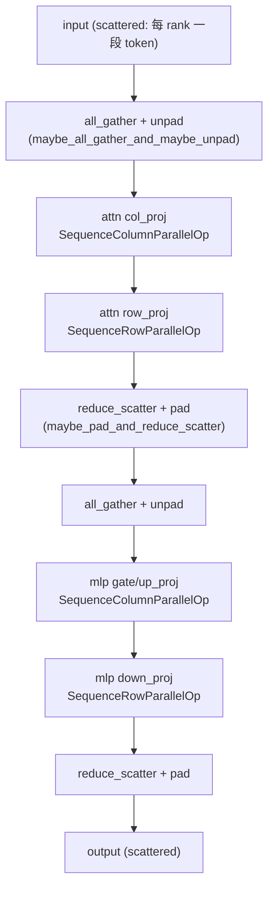
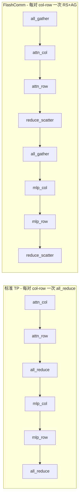
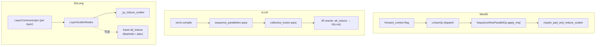

# Cross-project Comparison: FlashComm（TP 通信优化）

> 三项目"在 TP linear 层间用 sequence-parallel + reduce_scatter / all_gather 替代 all_reduce 来 overlap 通信"特性对比。覆盖 [§dim-flashcomm](../dimensions.md)。

## TL;DR (synthesis)

> **关键结论**：FlashComm 是 **MindIE 专有命名**——vLLM 与 SGLang 没有同名特性。但等价的"TP 通信替换"思路三家都有：vLLM 走 **torch.compile pass 自动融合**，SGLang 走 **`LayerCommunicator` 显式编排**，MindIE 走 **`LinearOp` 运行时分发 + `is_flashcomm_supported` 模型描述符**。

| 维度 | MindIE | vLLM | SGLang |
|---|---|---|---|
| **命名** | **FlashComm**（专有名词） | 无统一名（实现称 "sequence parallelism fusion" / "collective fusion"） | 无统一名（实现称 "scatter mode" / "reduce_scatter"） |
| **何时决定启用** | **隐式触发**（[`create_forward_context`](d:\design\MindIE-LLM\mindie_llm\runtime\model_runner\forward_context.py) 构造 `BatchDescriptor` 时按 `ATTN_DP.is_enabled()` (主路径) 或 `ATTN_TP.is_enabled()` (exp 路径) 自动设 `is_flash_comm_enabled`，详见 §1.b） | **编译时**：torch.compile pass 在编译期把 all_reduce 改写为 reduce_scatter + all_gather；**还有 token 数阈值** `get_sequence_parallelism_threshold` 决定本次 forward 是否启 | **运行时每层每 batch**：`should_use_reduce_scatter(forward_batch)` 按 3 条件决定（详见 §3） |
| **模型侧契约** | `is_flashcomm_supported: bool` 模型描述符（默认 False，需模型显式声明支持） | torch.compile 重写不感知模型；GPU capability 限制（H100 仅 hidden_size ≥ 8192） | `LayerCommunicator(allow_reduce_scatter=True)` 构造时声明 |
| **核心 API** | `BaseModelForCausalLM.maybe_gather_and_unpad_for_flashcomm` + `linear_op.maybe_all_gather_and_maybe_unpad` + `maybe_pad_and_reduce_scatter` | `_SequenceParallelPatternHelper` + 5 个 pattern 类（[sequence_parallelism.py:98, 133, 166, 221, 263, 325](d:\design\vllm\vllm\compilation\passes\fusion\sequence_parallelism.py)）+ `pm.register_replacement` | `LayerCommunicator` + `_tp_reduce_scatter` + `AttentionInputs.tp_all_gather_hidden_states` + `should_fuse_mlp_allreduce_with_next_layer` |
| **抽象粒度** | Linear 层级（`SequenceRowParallelOp` / `SequenceColumnParallelOp` 是 `LinearOp` 子类，**MLA 的 q_b_proj 例外**） | 整图级（torch._inductor.pattern_matcher，对 `all_reduce → rmsnorm → ...` 模式整体重写） | Layer 级（每个 attention layer 一个 `LayerCommunicator`） |
| **与 aclgraph/cuda graph 关系** | aclgraph 内 → `aclgraph_backend.maybe_gather_and_unpad_for_flashcomm` 包了一层（[aclgraph_backend.py:208-217](d:\design\MindIE-LLM\mindie_llm\runtime\compilation\aclgraph_backend.py)） | torch.compile 是 cuda graph 的上游，先重写后捕图 | 与 cuda_graph_runner 协作 |
| **回退路径** | `is_flashcomm_supported=False` 或 `is_flash_comm_enabled=False` → 走 `RowParallelOp` / `ColumnParallelOp` 标准 all_reduce | token 数 < `min_size // (hidden_size * element_size)` 或 hidden_size < 8192 (H100) 或非 H100 → pass 不替换 → 标准 all_reduce | `should_use_reduce_scatter` 返 False → 标准 all_reduce |

---

## 1. MindIE FlashComm 详解

### 命名与触发

> synthesis: 名称是 MindIE 自创的——把 attention TP 后的 all_reduce 拆成 reduce_scatter（在 MLP 前）+ all_gather（在 MLP 后），让通信与 MLP 计算 overlap。本质是经典的 **"sequence-parallel TP"** 优化。

### §1.b 触发条件（**verify 后修订**）

> [!warning] CONTRADICTION: MindIE 现在有两条 `create_forward_context` 实现，**对 `is_flash_comm_enabled` 的设值依据完全不同**：

| 路径 | 文件 | `is_flash_comm_enabled` 来源 |
|---|---|---|
| 主路径 | [forward_context.py:58-59](d:\design\MindIE-LLM\mindie_llm\runtime\model_runner\forward_context.py) | `ATTN_DP.is_enabled()` |
| exp 路径 | [forward_context_exp.py:234-237](d:\design\MindIE-LLM\mindie_llm\runtime\model_runner\forward_context_exp.py) | **`ATTN_TP.is_enabled()`** |
| `model_runner.py` 重新覆盖 | [model_runner.py:305-308](d:\design\MindIE-LLM\mindie_llm\runtime\model_runner\model_runner.py) | `ATTN_DP.is_enabled()` + 注释 `NOTE: this flag will be update to FlashCommMetaData()` |
| `set_mc2_token_capacity` 内的判定 | [forward_context_exp.py:42-49](d:\design\MindIE-LLM\mindie_llm\runtime\model_runner\forward_context_exp.py) | `ATTN_DP.is_enabled() AND ATTN_TP.is_enabled()`（注释 `# check if flash_comm enabled`） |

**结论**：FlashComm **不是**之前 wiki 写的"运行时每 step 可开关的显式 flag"。它是 **隐式触发**——**当 ATTN_DP（或 ATTN_TP，看路径）启用时自动开**。

**实践影响**：

- 主路径下：**只有同时启 attn_dp 才会触发 FlashComm**（与设 `is_flashcomm_supported=True` 的模型联动）
- exp 路径下：**只要启 attn_tp 就触发**——意味着 generator_aclgraph 路线下几乎所有多卡部署都会启 FlashComm
- model_runner.py:305 的 `NOTE` 暗示：**未来要重构为独立的 `FlashCommMetaData`**，让用户可显式开关；当前是临时复用 ATTN_DP/ATTN_TP flag

> [!todo] VERIFY: 主路径与 exp 路径的语义为何不同——是历史遗留还是有意为之？需要查 git blame / 内部设计文档。这个不一致是潜在 bug 源（同一模型用两条路径会得到不同 FlashComm 行为）。

### `BatchDescriptor` 数据结构（[forward_context_exp.py:61-70](d:\design\MindIE-LLM\mindie_llm\runtime\model_runner\forward_context_exp.py)）

```python
class BatchDescriptor(NamedTuple):
    """Descriptor for batch information."""
    num_tokens: int
    is_flash_comm_enabled: bool = False  # 默认 False
```

只有 2 个字段，`is_flash_comm_enabled` 默认 False。所有 FlashComm 触发都看这一个 bool。

### 模型侧契约（[model_descriptor.py:24-43](d:\design\MindIE-LLM\mindie_llm\runtime\models\base\model_descriptor.py)）

```python
@dataclass
class ModelDescriptor:
    """
    Attributes:
        is_flashcomm_supported (bool): Indicates whether FlashComm
            acceleration is supported for this model.
    """
    is_flashcomm_supported: bool = False
```

- 默认 False，每个模型类需要在 `_get_model_descriptor_cls` 里显式标 True
- `BooleanParameterValidator` 验证（[model_descriptor.py:43](d:\design\MindIE-LLM\mindie_llm\runtime\models\base\model_descriptor.py)）

### 运行时开关

`forward_context.batch_descriptor.is_flash_comm_enabled`（[base/model.py:38-49](d:\design\MindIE-LLM\mindie_llm\runtime\models\base\model.py)）：

```python
@staticmethod
def maybe_gather_and_unpad_for_flashcomm(hidden_states):
    forward_context = get_forward_context()
    if not forward_context.batch_descriptor.is_flash_comm_enabled:
        return hidden_states

    from mindie_llm.runtime.layers.linear.linear_op import maybe_all_gather_and_maybe_unpad
    hidden_states = maybe_all_gather_and_maybe_unpad(
        hidden_states,
        get_parallel_info_manager().get(ParallelType.ATTN_TP)
    )
    return hidden_states
```

### `is_flash_comm_enabled` 的全部使用点（**verify 后补充**）

通过 grep `is_flash_comm_enabled` 在 mindie_llm 包内找到 8 处使用：

| 文件 | 行号 | 用途 |
|---|---|---|
| [layers/linear/linear_op.py](d:\design\MindIE-LLM\mindie_llm\runtime\layers\linear\linear_op.py) | 115, 141 | `SequenceColumnParallelOp.enable` / `SequenceRowParallelOp.enable` 检查 |
| [models/base/model.py](d:\design\MindIE-LLM\mindie_llm\runtime\models\base\model.py) | 40 | `maybe_gather_and_unpad_for_flashcomm` 检查 |
| [model_runner/model_runner.py](d:\design\MindIE-LLM\mindie_llm\runtime\model_runner\model_runner.py) | 639 | runner 端 `maybe_gather_and_unpad_for_flashcomm` 复制实现 |
| [model_runner/model_runner_exp.py](d:\design\MindIE-LLM\mindie_llm\runtime\model_runner\model_runner_exp.py) | 346 | exp 路径同样检查 |
| [layers/embedding/embedding.py](d:\design\MindIE-LLM\mindie_llm\runtime\layers\embedding\embedding.py) | 300 | embedding 层 vocab gather 检查 |
| [layers/attention/backend/sparse_attention.py](d:\design\MindIE-LLM\mindie_llm\runtime\layers\attention\backend\sparse_attention.py) | 1091 | sparse attention 检查 |
| [layers/fused_moe/moe_comm_strategy.py](d:\design\MindIE-LLM\mindie_llm\runtime\layers\fused_moe\moe_comm_strategy.py) | 36 | MoE comm strategy 受其影响 |

→ **覆盖 linear / embedding / attention / MoE 4 个 runtime 子系统 + 主路径与 exp 路径都检查**。FlashComm 不是单点优化，而是**贯穿整个 forward 的 sequence-parallel 框架**。

### LinearOp 分发（[linear_op.py:25-31](d:\design\MindIE-LLM\mindie_llm\runtime\layers\linear\linear_op.py)）

```python
_LINEAR_TO_CUSTOM_OP_DISPATCH_TABLE = {
    'RowParallelLinear': lambda: (SequenceRowParallelOp,),
    'ColumnParallelLinear': lambda: (SequenceColumnParallelOp,),
}
```

`SequenceRowParallelOp.enable()`（[linear_op.py:138-143](d:\design\MindIE-LLM\mindie_llm\runtime\layers\linear\linear_op.py)）：

```python
@staticmethod
def enable(layer_cls) -> bool:
    forward_context = get_forward_context()
    if forward_context.batch_descriptor.is_flash_comm_enabled:
        return True
    return False
```

→ flashcomm 开时，每个 RowParallelLinear 调用走到 `SequenceRowParallelOp.apply_impl`：

```python
output = self.quant_method.apply(self.layer, input_)
if self.parallel_info.group_size > 1 and self.reduce_results:
    reduce_scatter_output = maybe_pad_and_reduce_scatter(output, self.parallel_info)
    output = reduce_scatter_output
```

锚点：[linear_op.py:145-160](d:\design\MindIE-LLM\mindie_llm\runtime\layers\linear\linear_op.py)。

### 关键算子（[linear_op.py:163-204](d:\design\MindIE-LLM\mindie_llm\runtime\layers\linear\linear_op.py)）

| 函数 | 行号 | 用途 |
|---|---|---|
| `maybe_pad_and_reduce_scatter(input, parallel_info)` | [163-183](d:\design\MindIE-LLM\mindie_llm\runtime\layers\linear\linear_op.py) | RowParallelLinear 输出后：pad 到 world_size 整除 → `reduce_scatter_tensor` |
| `maybe_all_gather_and_maybe_unpad(input, parallel_info)` | [186-204](d:\design\MindIE-LLM\mindie_llm\runtime\layers\linear\linear_op.py) | ColumnParallelLinear 输入前：`all_gather_into_tensor` → 可选 unpad |

### RS + AG 一一对应？（**verify 后确认**）

之前 wiki 标了 CONTRADICTION 怀疑"未在 forward_context 看到 reduce_scatter 与 all_gather 一一对应的 trace"——**verify 后确认是误判**：RS 与 AG 不在 forward_context 而在 **LinearOp dispatch 里成对**。

典型 transformer block（attn_col → attn_row → mlp_col → mlp_row）的 token 流：



**每个 col-row 对一次 RS+AG**——对应模式：
- ColumnParallelOp 入口 `all_gather` (输入是 scattered 状态进来) → linear → 输出 full
- RowParallelOp 出口 linear → `reduce_scatter` (输出 scattered 状态出去)

**与标准 TP 对比**：



> synthesis: 两者总通信量相同（RS+AG = 一次 all_reduce），但 FlashComm 让 **AG 与 col_proj 计算 overlap、RS 与下个 op 准备 overlap**，从而隐藏通信延迟。

### 例外：MLA 的 `q_b_proj`（[linear_op.py:117-119](d:\design\MindIE-LLM\mindie_llm\runtime\layers\linear\linear_op.py)）

```python
@staticmethod
def enable(layer_cls) -> bool:
    forward_context = get_forward_context()
    if not forward_context.batch_descriptor.is_flash_comm_enabled:
        return False
    # AllGather should be handled elsewhere in MLA.
    if "q_b_proj" in layer_cls.prefix:
        return False
    return True
```

→ **MLA 模型的 `q_b_proj` 不走 SequenceColumnParallelOp**——MLA 自己有特殊的 AllGather 处理。如果你用 DeepSeek-V3 / V2 / R1，要注意 q_b_proj 这一层不被 FlashComm 优化。

### 与 aclgraph 集成

[aclgraph_backend.py:208-217](d:\design\MindIE-LLM\mindie_llm\runtime\compilation\aclgraph_backend.py)：

```python
def maybe_gather_and_unpad_for_flashcomm(self, hidden_states: torch.Tensor) -> torch.Tensor:
    return self.model.maybe_gather_and_unpad_for_flashcomm(hidden_states)
```

aclgraph wrapper 透传给底层模型——意味着 **FlashComm 通信进图捕获**，不像 PP 通信那样需要图外编排。

---

## 2. vLLM 等价实现（torch.compile fusion pass）

### 实现位置
- [vllm/compilation/passes/fusion/sequence_parallelism.py](d:\design\vllm\vllm\compilation\passes\fusion\sequence_parallelism.py)
- [vllm/compilation/passes/fusion/collective_fusion.py](d:\design\vllm\vllm\compilation\passes\fusion\collective_fusion.py)
- pass manager：[vllm/compilation/passes/pass_manager.py](d:\design\vllm\vllm\compilation\passes\pass_manager.py)
- 底层通信原语：[vllm/distributed/communication_op.py](d:\design\vllm\vllm\distributed\communication_op.py), [vllm/distributed/parallel_state.py](d:\design\vllm\vllm\distributed\parallel_state.py)

### 设计哲学
- **编译时重写**：torch.compile 在 IR 上把 `all_reduce(...) + rmsnorm(...)` 模式识别出来，重写为 `reduce_scatter → rmsnorm → ... → all_gather`
- 模型代码**完全不感知**——写的还是 `all_reduce`，编译器自动转
- 与 cudagraph 集成：先 fusion pass，再 cudagraph 捕获

### IR pattern（**verify 后补充**）

来自 [sequence_parallelism.py:98-325](d:\design\vllm\vllm\compilation\passes\fusion\sequence_parallelism.py)：

| 类 | 行号 | 角色 |
|---|---|---|
| `_SequenceParallelPatternHelper` | [98](d:\design\vllm\vllm\compilation\passes\fusion\sequence_parallelism.py) | 基类，提供 `_all_reduce` / `_reduce_scatter` / `_all_gather` 三个 op 模板 |
| `FirstAllReduceRMSNormPattern` | [133](d:\design\vllm\vllm\compilation\passes\fusion\sequence_parallelism.py) | 第一个 `all_reduce → rms_norm` 模式（首层） |
| `MiddleAllReduceRMSNormPattern` | [166](d:\design\vllm\vllm\compilation\passes\fusion\sequence_parallelism.py) | 中间层模式 |
| `FirstAllReduceRMSNormStaticFP8Pattern` | [221](d:\design\vllm\vllm\compilation\passes\fusion\sequence_parallelism.py) | FP8 量化版首层 |
| `MiddleAllReduceRMSNormStaticFP8Pattern` | [263](d:\design\vllm\vllm\compilation\passes\fusion\sequence_parallelism.py) | FP8 量化版中间层 |
| `SequenceParallelismPass` | [325](d:\design\vllm\vllm\compilation\passes\fusion\sequence_parallelism.py) | 顶层 pass，注册所有 pattern 到 `PatternMatcherPass` |

**核心 pattern**（伪代码，[sequence_parallelism.py:142-149](d:\design\vllm\vllm\compilation\passes\fusion\sequence_parallelism.py)）：

```python
def pattern(input, weight):
    all_reduce = self._all_reduce(input)
    rmsnorm = vllm.ir.ops.rms_norm(all_reduce, weight, self.epsilon)
    return rmsnorm, all_reduce
```

被替换为：

```python
def replacement(input, weight):
    reduce_scatter = self._reduce_scatter(input)  # 通信 1/N
    rmsnorm = vllm.ir.ops.rms_norm(reduce_scatter, weight, self.epsilon)  # 计算 1/N
    all_gather = self._all_gather(rmsnorm)
    return all_gather, ...
```

### 启用阈值（**verify 后补充**）

[sequence_parallelism.py:32-85 get_sequence_parallelism_threshold](d:\design\vllm\vllm\compilation\passes\fusion\sequence_parallelism.py)：

```python
SP_MIN_HIDDEN_SIZE = {90: 8192}    # H100: 仅 hidden_size >= 8192
SP_MIN_PER_GPU_SIZE_MB = {90: 8}   # H100: 8MB per GPU

threshold = (min_per_gpu_size_mb * tp_size * MiB) // (hidden_size * element_size)
```

**3 重门槛**：
1. **GPU capability**：仅 H100 (capability 90) 配置了阈值；其它 GPU 返 None → **不启** SP（[sequence_parallelism.py:67-77](d:\design\vllm\vllm\compilation\passes\fusion\sequence_parallelism.py)）
2. **hidden_size**：必须 ≥ 8192（[sequence_parallelism.py:80-81](d:\design\vllm\vllm\compilation\passes\fusion\sequence_parallelism.py)），中等模型（如 Llama-7B/13B 的 4096）**不启**
3. **token 数阈值**：本次 forward 的 token 数 < threshold → **不启**

> synthesis: vLLM 的 SP 是**保守开**——只在大模型（hidden_size ≥ 8192，对应 70B+ 模型）+ 大 batch（足够多 token 让 SP 摊销开销）下才启用。MindIE / SGLang 是**默认开**（前者按 ATTN_DP/TP 自动开，后者按 layer-level 决策）。

### 与 MindIE 的对比

| 维度 | MindIE | vLLM |
|---|---|---|
| 触发 | 运行时 flag + 模型描述符 | 编译时 pass |
| 模型侵入 | 需声明 `is_flashcomm_supported` | 零侵入 |
| 灵活性 | 每 step 可开关 | 编译后固定 |
| 调试 | 容易（标准 Python 调用栈） | 困难（IR 层） |

---

## 3. SGLang 等价实现（LayerCommunicator）

### 实现位置
- [sglang/srt/layers/communicator.py](d:\design\sglang\python\sglang\srt\layers\communicator.py)（约 750 行）
- 协助：[layers/communicator_nsa_cp.py](d:\design\sglang\python\sglang\srt\layers\communicator_nsa_cp.py)

### 关键抽象

| 类 / 函数 | 行号 | 用途 |
|---|---|---|
| `ScatterMode(Enum)` | [communicator.py:184-205](d:\design\sglang\python\sglang\srt\layers\communicator.py) | scatter 模式枚举（含 `model_input_output` 等） |
| `LayerScatterModes` | [communicator.py:340-415](d:\design\sglang\python\sglang\srt\layers\communicator.py) | 决定每层 input / mlp / middle_residual / output 的 scatter mode |
| `LayerCommunicator` | [communicator.py:420-...](d:\design\sglang\python\sglang\srt\layers\communicator.py) | 每层一个实例，`prepare_attn` / `prepare_mlp` / `postprocess_layer` |
| `_tp_reduce_scatter(...)` | [communicator.py:641-659](d:\design\sglang\python\sglang\srt\layers\communicator.py) | 实际 reduce_scatter 调用：`get_tp_group().reduce_scatter_tensor(output, hidden_states)` |
| `should_use_reduce_scatter(forward_batch)` | [communicator.py:692-707](d:\design\sglang\python\sglang\srt\layers\communicator.py) | 运行时决策 |
| `should_fuse_mlp_allreduce_with_next_layer(...)` | [communicator.py:708-...](d:\design\sglang\python\sglang\srt\layers\communicator.py) | 跨层融合决策 |
| `apply_flashinfer_allreduce_fusion(batch_size)` | [communicator.py:152-168](d:\design\sglang\python\sglang\srt\layers\communicator.py) | flashinfer 融合 all_reduce |
| `apply_aiter_all_reduce_fusion(input)` | [communicator.py:169-183](d:\design\sglang\python\sglang\srt\layers\communicator.py) | AMD aiter 融合 |

### 设计哲学
- **每层一个 communicator**，决策细到层
- 不依赖编译，**纯 Python runtime 决策**
- 跨层融合：`should_fuse_mlp_allreduce_with_next_layer` 让连续两层共享一次 all_reduce
- 对接 flashinfer / aiter 的 fused all_reduce 算子

### `should_use_reduce_scatter` 决策（**verify 后补充**）

来自 [communicator.py:692-705](d:\design\sglang\python\sglang\srt\layers\communicator.py)：

```python
def should_use_reduce_scatter(self, forward_batch: ForwardBatch):
    if not self.allow_reduce_scatter:
        return False
    if (
        self._communicate_summable_tensor_pair_fn
        is CommunicateSummableTensorPairFn._scatter_hidden_states
        and forward_batch.dp_padding_mode.is_max_len()
    ):
        return True
    if nsa_use_prefill_cp(forward_batch):
        return True
    if get_attn_tp_context().input_scattered and not self.is_last_layer:
        return True
    return False
```

**3 条触发条件**（**OR 关系**，前置：`allow_reduce_scatter=True`）：

| # | 条件 | 触发场景 |
|---|---|---|
| 1 | `_communicate_summable_tensor_pair_fn is _scatter_hidden_states` AND `dp_padding_mode.is_max_len()` | DP attention + max_len padding 模式（[dp_attention.py:DpPaddingMode.MAX_LEN](d:\design\sglang\python\sglang\srt\layers\dp_attention.py)） |
| 2 | `nsa_use_prefill_cp(forward_batch)` | NSA（Native Sparse Attention） + prefill CP |
| 3 | `attn_tp_context().input_scattered` AND not `is_last_layer` | 输入已是 scattered 状态 + 非最后一层（最后一层不需要再 scatter） |

> synthesis: 之前 wiki 写"看起来与 batch size / sequence length 相关"是错的——**真正决策由 dp_padding_mode + NSA prefill CP + scattered context 三个上下文条件综合**，与 batch/seq 无直接关系。`is_last_layer` 是显式 layer 级状态。

`should_fuse_mlp_allreduce_with_next_layer`（[communicator.py:708-739](d:\design\sglang\python\sglang\srt\layers\communicator.py)）则按 batch_size 决策（`apply_flashinfer_allreduce_fusion(batch_size)`）—— 与 reduce_scatter 是两条独立路径。

### 与 MindIE 的对比

| 维度 | MindIE | SGLang |
|---|---|---|
| 抽象粒度 | LinearOp（针对每个 Linear） | LayerCommunicator（针对每个 transformer layer） |
| 模型侵入 | 模型只标 capability flag | 模型代码需要显式调 `LayerCommunicator.prepare_attn` 等 |
| 跨层融合 | （未见） | `should_fuse_mlp_allreduce_with_next_layer` |
| 后端协同 | Ascend HCCL | NCCL + flashinfer + aiter |

---

## 4. 三方通信优化整体对比



---

## 5. 与你 PD 优化的关联（**verify 后修订**）

> 注意：本节是综合性建议。

如果你正在 MindIE 上做 PD 优化，FlashComm 这一层的关注点（**经 verify 校正**）：

1. **确认你的模型 `is_flashcomm_supported=True`**：查 [runtime/models/<model>/](d:\design\MindIE-LLM\mindie_llm\runtime\models)，每个模型类的 `_get_model_descriptor_cls` 是否覆盖了默认 False。如果你用的是默认值，FlashComm 永远不开，错失 TP 通信优化。
2. **🔥 关键：FlashComm 的真实触发路径与你想的可能不同**（**本轮 verify 关键发现**）：
   - 主路径：当且仅当 **ATTN_DP 启用** 时 FlashComm 才开（[forward_context.py:58-59](d:\design\MindIE-LLM\mindie_llm\runtime\model_runner\forward_context.py)）
   - exp 路径（generator_aclgraph）：当 **ATTN_TP 启用** 就开（[forward_context_exp.py:234-237](d:\design\MindIE-LLM\mindie_llm\runtime\model_runner\forward_context_exp.py)）
   - 这意味着 **PD 分离场景下，如果你的 P 节点没启 ATTN_DP（只用 TP）但走的是主路径，FlashComm 不会自动开**。需要：(a) 切到 exp 路径；或 (b) 改 forward_context.py 让条件更精细
3. **MLA 模型的 q_b_proj 例外**（[linear_op.py:117-119](d:\design\MindIE-LLM\mindie_llm\runtime\layers\linear\linear_op.py)）：DeepSeek-V3/V2/R1 用 MLA，**q_b_proj 不被 FlashComm 优化**——这一层仍走标准 all_reduce。如果你用 DeepSeek，验证它的 attention 总通信量是否还有优化空间
4. **FlashComm vs PD 分离的 KV 传输 overlap**：FlashComm 把 TP 通信与 MLP 计算 overlap，但 PD 分离的 KV 拉取是另一个维度。如果你 P 节点 prefill 时 FlashComm 已开，再叠加 PD 异步拉 KV，要确保两者通信 channel 不抢同一物理链路
5. **借鉴 SGLang 的 `should_fuse_mlp_allreduce_with_next_layer`**（[communicator.py:708](d:\design\sglang\python\sglang\srt\layers\communicator.py)）：MindIE 当前每个 RowParallelLinear 独立 reduce_scatter，跨层无融合。如果你的模型层数很深，跨层融合能少几次小通信
6. **借鉴 vLLM 的 GPU capability + token 阈值检查**：[sequence_parallelism.py:44-85](d:\design\vllm\vllm\compilation\passes\fusion\sequence_parallelism.py) 在小模型 / 小 batch 下不启 SP（避免 RS+AG 的 fixed overhead 反而拖慢）。MindIE 当前是"DP 开就开 FlashComm"——**短 prompt + 小 batch 场景下 FlashComm 可能负优化**，建议加 token 数下限

---

## 6. 跨项目可借鉴

| 借鉴对象 | 思路 |
|---|---|
| 从 vLLM | torch.compile pass 重写 → **零模型侵入**；适合大批量模型快速接入 |
| 从 SGLang | LayerCommunicator 跨层融合；多后端 fused all_reduce（flashinfer / aiter）|
| 从 MindIE | `is_flashcomm_supported` 模型描述符的 fail-safe 设计；运行时动态开关比编译期更灵活 |

---

## Notes / Caveats（**verify 后**——4 处 todo 全部 RESOLVED，新出 2 处）
> [x] ~~VERIFY: vLLM `sequence_parallelism.py` pass 的具体 IR pattern 与启用条件~~ → **RESOLVED**（详见 §2 IR pattern + 启用阈值）
> [x] ~~VERIFY: SGLang `LayerCommunicator.should_use_reduce_scatter` 的运行时决策依据~~ → **RESOLVED**（详见 §3 should_use_reduce_scatter 决策）；之前"看起来与 batch size / sequence length 相关"是错的，实际是 dp_padding_mode + NSA prefill CP + scattered context 三条件 OR
> [x] ~~VERIFY: MindIE `is_flash_comm_enabled` 是固定 True/False 还是已经按 batch 动态~~ → **RESOLVED**（详见 §1.b）；不是固定 False，但**触发条件主路径与 exp 路径不一致**——这是新发现的 contradiction
> [x] ~~CONTRADICTION: 未在 forward_context 看到 reduce_scatter 与 all_gather 一一对应的 trace~~ → **RESOLVED**（详见 §RS + AG 一一对应）；RS 与 AG 不在 forward_context 而在 LinearOp dispatch 里成对，typical transformer block 每对 col-row 一次 RS+AG

**新发现的 verify / contradiction**：

> [!warning] CONTRADICTION（**verify 新发现**）: MindIE 主路径与 exp 路径对 `is_flash_comm_enabled` 的触发条件不同——主路径用 `ATTN_DP.is_enabled()`、exp 路径用 `ATTN_TP.is_enabled()`、`set_mc2_token_capacity` 又用 `ATTN_DP AND ATTN_TP`。同一模型用不同路径会得到不同 FlashComm 行为，**潜在 bug 源**。
> [!todo] VERIFY: 主路径与 exp 路径条件不同的设计意图（历史遗留还是有意为之？）查 git blame 或内部文档。
> [!todo] VERIFY: vLLM `SP_MIN_HIDDEN_SIZE` 仅对 H100 (capability 90) 配置——A100 / H800 / B200 实际是否真的不启 SP？还是其它 capability 在别处单独配置？

## See also
- [comparison/dimensions.md §dim-flashcomm](../dimensions.md)
- [comparison/topics/cp-sp.md](cp-sp.md)（与 FlashComm 共享 sequence-parallel 思路）
- [vllm/entities/MultiprocExecutor.md](../../vllm/entities/MultiprocExecutor.md)
- [sglang/modules/managers.md](../../sglang/modules/managers.md)
