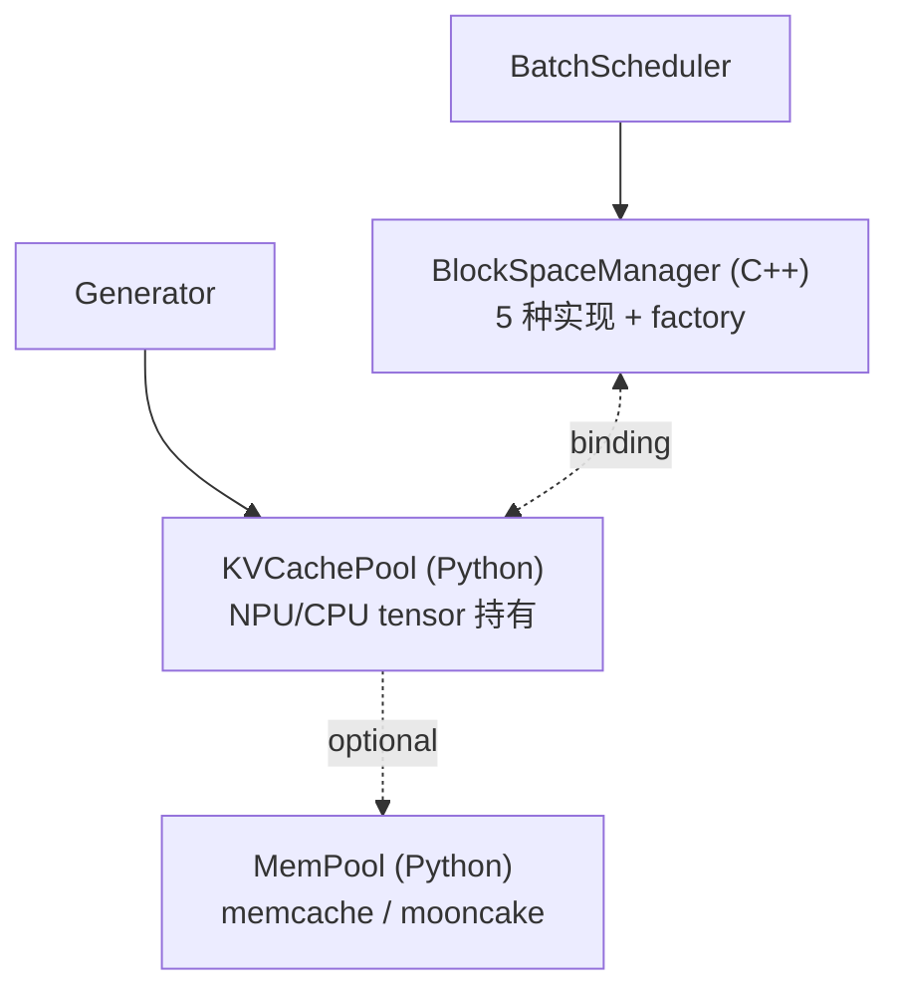
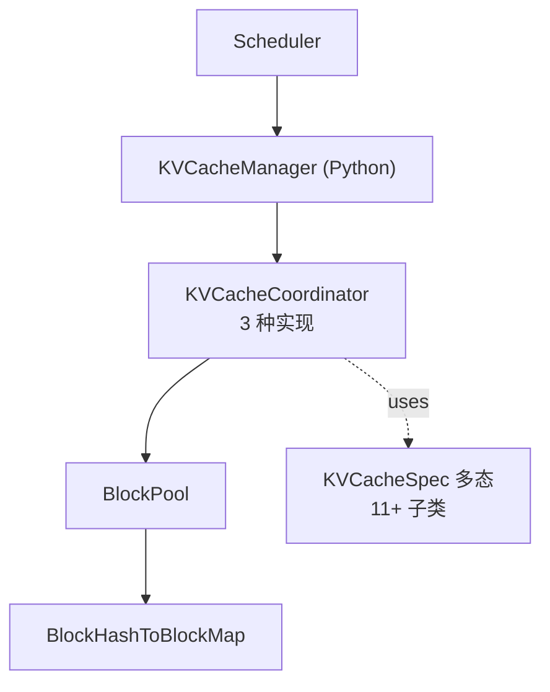
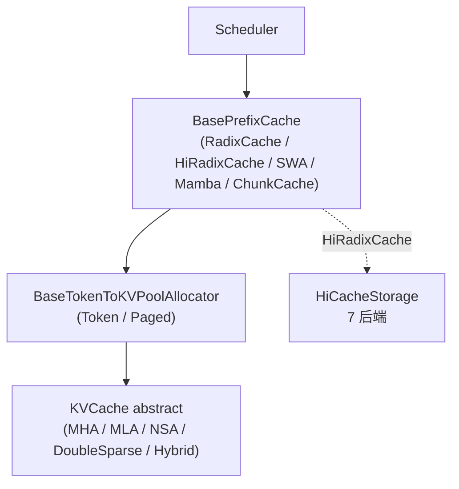

# Cross-project Comparison: KV Cache

> 三项目 KV cache 体系对比。覆盖 [§dim-kv](../dimensions.md) 维度。
> 每 cell 都有具体文件锚点，遵循 [AGENTS.md §8](../../AGENTS.md) 对比规则。

## TL;DR (synthesis)

| 维度 | MindIE | vLLM | SGLang |
|---|---|---|---|
| **实现语言** | C++ 块管理 + Python tensor pool | 全 Python | 全 Python（含 C++ radix tree 加速版） |
| **抽象层数** | 3（C++ BlockSpaceManager + Python KVCachePool + MemPool） | 3（KVCacheManager / Coordinator / BlockPool） | 4（PrefixCache / Allocator / KVCache / HiCache Storage） |
| **Prefix cache 数据结构** | C++ 块 hash（见 `GetRankedHashValues`） | Python `BlockHashToBlockMap` | radix tree（[radix_cache.py](d:\design\sglang\python\sglang\srt\mem_cache\radix_cache.py)）+ HiRadixCache 二层 |
| **多 attention 类型抽象** | `BlockManagerType` **5 枚举槽位**（`SELFATTN`/`LWDSELFATTN`/`COMPOSITE`/`REQUESTSINGLE`/`REQUESTSLIDINGWINDOW`），但 **工厂仅产 2 种**（`SELFATTN`/`LWDSELFATTN`）+ 1 独立类（`RequestSingleBlockManager`，未接工厂）；详 [entities/BlockSpaceManager.md](../../mindie/entities/BlockSpaceManager.md) | `KVCacheSpec` 多态 + 多种 spec 子类 | 独立 `*KVPool` class（MHA / MLA / NSA / DoubleSparse / Hybrid） |
| **Hybrid（混合 cache 类型）** | `COMPOSITEBLOCKMANAGER` 枚举存在但 **类未实现**（`subManagers` 字段保留为 future use） | `HybridKVCacheCoordinator` + `verify_and_split_kv_cache_groups` | `hybrid_cache/hybrid_pool_assembler.py` |
| **Eviction 策略** | LRU（C++ `AccessAllblocksInSeq`） | LRU（`FreeKVCacheBlockQueue` 双向链表） | **7 种**（LRU / LFU / FIFO / MRU / FILO / Priority / SLRU） |
| **多层存储 (HiCache / KV store)** | `MemPool` 2 后端（memcache / mooncake） | `KVConnector` 钩子（PD 分离用） | **HiCache 一等公民，7 后端**（mooncake / nixl / hf3fs / lmcache / aibrix / eic / simm） |
| **量化** | 通过 dtype（`STR_DTYPE_TO_DTYPE`） | `KVQuantMode` enum | **FP4 独立子类**（MHA/MLA 都有 FP4 版） |
| **PD 分离原生支持** | ✅ 一等公民（`GetRemoteComputedBlockIds`, `SMALL_RANK_FIRST`, `LwdInitCloudBlockManager`） | 通过 `KVConnector` 钩子 | 通过 mixin + storage 后端 |
| **稀疏 attention** | （`KvCacheType::SLIDING_WINDOW` 一种） | `SlidingWindowSpec` + `ChunkedLocalAttentionSpec` + `MLAAttentionSpec` | **专门 sparsity 子系统**（Quest / DeepSeek NSA） |
| **代码量** | C++ ~190 行接口 + 4 个 .cpp 实现 + ~330 行 KVCachePool + ~250 行 mempool | ~555 行 manager + ~510 行 pool + ~560 行 coordinator + ~590 行 spec | ~62 个 .py，主 `memory_pool.py` 就 2070 行 |

---

## 1. 整体架构

### MindIE

### vLLM

### SGLang

---

## 2. Prefix cache 数据结构对比

| 项目 | 数据结构 | 命中查询 API | 锚点 |
|---|---|---|---|
| MindIE | C++ 块 hash（块级） | `GetRankedHashValues(seqId)` + `GetSeqHashValues(seqId)` + `GetCommonComputedBlockIds(seqs)` | [block_manager_interface.h:131-153](d:\design\MindIE-LLM\src\include\block_manager\block_manager_interface.h) |
| vLLM | hash map `{BlockHashWithGroupId: KVCacheBlock | dict[block_id, KVCacheBlock]}` | `BlockPool.get_cached_block(hash)` → `KVCacheManager.get_computed_blocks(request)` | [block_pool.py:34-128, 184-210](d:\design\vllm\vllm\v1\core\block_pool.py), [kv_cache_manager.py:176-217](d:\design\vllm\vllm\v1\core\kv_cache_manager.py) |
| SGLang | radix tree（前缀共享） + HiCache 时双层（device + host + storage） | `RadixCache.match_prefix(MatchPrefixParams) → MatchResult` | [radix_cache.py:374-445](d:\design\sglang\python\sglang\srt\mem_cache\radix_cache.py), [hiradix_cache.py:1207-1244](d:\design\sglang\python\sglang\srt\mem_cache\hiradix_cache.py) |

> synthesis: **数据结构选择反映了 cache 粒度**：
> - vLLM 用 hash map → 块级精确匹配，跨请求只要哈希一样就能复用
> - SGLang 用 radix tree → 沿前缀共享，对"同一对话多轮"场景特别友好（每轮在 tree 上加一段）
> - MindIE 用块 hash → 与 vLLM 同思路，但 API 显式分了 `GetCommon` (本地) 与 `GetRemote` (跨节点)

---

## 3. Eviction 策略

| 项目 | 策略 | 实现位置 |
|---|---|---|
| MindIE | LRU（隐式，靠 `AccessAllblocksInSeq` 标 access time） | [block_manager_interface.h:149](d:\design\MindIE-LLM\src\include\block_manager\block_manager_interface.h) |
| vLLM | LRU（`FreeKVCacheBlockQueue` 双向链表 + `touch` 移到队尾） | [block_pool.py:391-407](d:\design\vllm\vllm\v1\core\block_pool.py), [kv_cache_utils.py](d:\design\vllm\vllm\v1\core\kv_cache_utils.py) |
| SGLang | **注册 7 类**：`LRU` / `LFU` / `FIFO` / `MRU` / `FILO` / `Priority` / `SLRU`；**CLI 默认仅 3 种** `--radix-eviction-policy ∈ {lru, lfu, slru}`（[server_args.py:206](d:\design\sglang\python\sglang\srt\server_args.py)），其余 4 类需 `add_radix_eviction_policy_choices` 扩展暴露 | [radix_cache.py:313-326](d:\design\sglang\python\sglang\srt\mem_cache\radix_cache.py), [evict_policy.py](d:\design\sglang\python\sglang\srt\mem_cache\evict_policy.py), [server_args.py:206, 278-279](d:\design\sglang\python\sglang\srt\server_args.py) |

> synthesis: SGLang 是唯一可配置 eviction 策略的。其它两家都假设 LRU 就够用。

> [!warning] CONTRADICTION（命名 / 数字精度）：本表与 §TL;DR 此前写"SGLang **7 种**"是按"`evict_policy.py` 注册类数"统计，但 CLI 默认暴露仅 3 种（`lru / lfu / slru`，[server_args.py:206](d:\design\sglang\python\sglang\srt\server_args.py)）。**精确说**：注册 7 类、CLI 默认 3 种、可通过 `add_radix_eviction_policy_choices` 扩展。本对比已在 [comparison/topics/prefix-cache.md §4 Eviction 策略](prefix-cache.md#4-eviction-策略) 显式 sync。

---

## 4. 多 attention 类型 / 多 cache 组

### MindIE: `BlockManagerType` 5 种 + `KvCacheType` 3 种
- `SELFATTNBLOCKMANAGER` / `LWDSELFATTNBLOCKMANAGER` / `COMPOSITEBLOCKMANAGER` / `REQUESTSINGLEBLOCKMANAGER` / `REQUESTSLIDINGWINDOWBLOCKMANAGER`
- `KvCacheType`: `TOKEN` / `SEQUENCE` / `SLIDING_WINDOW`
- 锚点：[block_manager_interface.h:26-32, 49-53](d:\design\MindIE-LLM\src\include\block_manager\block_manager_interface.h)

### vLLM: `KVCacheSpec` 11+ 子类
- `FullAttentionSpec` / `TQFullAttentionSpec` / `MLAAttentionSpec` / `ChunkedLocalAttentionSpec` / `SlidingWindowSpec` / `SinkFullAttentionSpec` / `EncoderOnlyAttentionSpec` / `CrossAttentionSpec` / `MambaSpec` / `UniformTypeKVCacheSpecs`
- 锚点：[kv_cache_interface.py:69-590](d:\design\vllm\vllm\v1\kv_cache_interface.py)

### SGLang: 独立 KVPool class
- `MHATokenToKVPool` / `MHATokenToKVPoolFP4` / `MLATokenToKVPool` / `MLATokenToKVPoolFP4` / `NSATokenToKVPool` / `HybridLinearKVPool` / `DoubleSparseTokenToKVPool` / `MambaPool`
- 锚点：[memory_pool.py:741-2073](d:\design\sglang\python\sglang\srt\mem_cache\memory_pool.py)

> synthesis: **设计哲学差异**：
> - vLLM：spec 多态（数据 + 行为分离，多种 spec 共享统一 manager）
> - SGLang：独立 class（每种 attention 自带 set/get/buffer 实现）
> - MindIE：enum + factory（C++ 风格，5 种 manager 选一个）

---

## 5. 多层存储 / KV store

| 项目 | 抽象 | 后端数 | 锚点 |
|---|---|---|---|
| MindIE | `MemPool` (Python) — 主要用于 PD 分离场景 | 2（memcache / mooncake） | [mempool/](d:\design\MindIE-LLM\mindie_llm\text_generator\mempool) |
| vLLM | `KVConnector` 钩子（在 KVCacheManager / Scheduler 上） | 实现各异（NIXL / Mooncake / 自研，未本轮深入） | [scheduler.py:120, 2070-2102](d:\design\vllm\vllm\v1\core\sched\scheduler.py), [v1/kv_offload/](d:\design\vllm\vllm\v1\kv_offload) |
| SGLang | **HiCache 一等公民**：`HiCacheStorage(ABC)` + `HiRadixCache` 集成 | **7 个**：mooncake_store / nixl / hf3fs / lmcache / aibrix_kvcache / eic / simm | [storage/](d:\design\sglang\python\sglang\srt\mem_cache\storage), [hicache_storage.py:95](d:\design\sglang\python\sglang\srt\mem_cache\hicache_storage.py), [hiradix_cache.py:65](d:\design\sglang\python\sglang\srt\mem_cache\hiradix_cache.py) |

> synthesis: **SGLang 在 HiCache 上明显领先**——专门为多层存储设计的 `HiRadixCache`，prefetch / write_back / load_back / evict_host 都有原生 API。MindIE 的 MemPool 更接近"远程 KV 存储"语义，没有 device → host → remote 的分级。vLLM 的 `KVConnector` 处于中间。

---

## 6. 量化支持

| 项目 | 实现 | 锚点 |
|---|---|---|
| MindIE | 通过 dtype 枚举（`STR_DTYPE_TO_DTYPE`） | [separate_deployment_engine.py 引用](d:\design\MindIE-LLM\mindie_llm\text_generator\utils\separate_deployment_engine.py) |
| vLLM | `KVQuantMode` enum（含 per-token-head） + `is_quantized_kv_cache` 判定 | [kv_cache_interface.py:30-66](d:\design\vllm\vllm\v1\kv_cache_interface.py) |
| SGLang | **FP4 独立子类**：`MHATokenToKVPoolFP4` / `MLATokenToKVPoolFP4` | [memory_pool.py:1084, 1671](d:\design\sglang\python\sglang\srt\mem_cache\memory_pool.py) |

---

## 7. PD 分离原生支持

| 项目 | KV cache 层面的支持 | 锚点 |
|---|---|---|
| MindIE | ✅ **一等公民**：`GetRemoteComputedBlockIds(seqs, computedLens, tpSize, modelName)` + `GetAllRankRemoteComputedBlockIds` + `SMALL_RANK_FIRST` 分配模式 + `LwdInitCloudBlockManager`（layerwise PD） | [block_manager_interface.h:43-47, 155-159, 176-185](d:\design\MindIE-LLM\src\include\block_manager\block_manager_interface.h) |
| vLLM | 通过 `KVConnector` 钩子：`Scheduler.connector` + `_try_promote_blocked_waiting_request` + `_update_waiting_for_remote_kv` | [scheduler.py:120, 2036-2102](d:\design\vllm\vllm\v1\core\sched\scheduler.py) |
| SGLang | 通过 storage 后端 + `SchedulerDisaggregationDecode/PrefillMixin` + HiCache 后端（mooncake_store 等可作 P-D 之间共享） | [scheduler.py:322-323](d:\design\sglang\python\sglang\srt\managers\scheduler.py), [storage/mooncake_store/](d:\design\sglang\python\sglang\srt\mem_cache\storage\mooncake_store) |

> synthesis: **MindIE 是唯一把"远端已算块查询"做到 KV cache 接口里的**。vLLM 把它放在 Scheduler 层做（waiting status），SGLang 把它放在 storage 后端做。MindIE 这种设计在跨节点 prefix cache 命中场景延迟更小（一次接口调用），但耦合更紧。

---

## 8. 稀疏 attention KV

| 项目 | 实现 | 锚点 |
|---|---|---|
| MindIE | `KvCacheType::SLIDING_WINDOW` + `REQUESTSLIDINGWINDOWBLOCKMANAGER` | [block_manager_interface.h:31, 53](d:\design\MindIE-LLM\src\include\block_manager\block_manager_interface.h) |
| vLLM | `SlidingWindowSpec` + `ChunkedLocalAttentionSpec` + `MLAAttentionSpec`（MLA 也是稀疏方向） | [kv_cache_interface.py:275-359](d:\design\vllm\vllm\v1\kv_cache_interface.py) |
| SGLang | **专门 sparsity 子系统**：`sparsity/algorithms/{quest_algorithm, deepseek_nsa, base_algorithm}.py` + `SparseCoordinator` + `BackendAdaptor` | [mem_cache/sparsity/](d:\design\sglang\python\sglang\srt\mem_cache\sparsity) |

> synthesis: SGLang 是唯一把稀疏注意力拆成独立子系统的，与主 cache 体系正交。

---

## 9. Cache events / 可观测性

| 项目 | 事件机制 | 锚点 |
|---|---|---|
| MindIE | `GetPrefixCacheHitRate()` 简单计数 | [block_manager_interface.h:163](d:\design\MindIE-LLM\src\include\block_manager\block_manager_interface.h) |
| vLLM | `KVCacheEvent` + `KVCacheMetricsCollector` + `take_events()` | [block_pool.py:499-509](d:\design\vllm\vllm\v1\core\block_pool.py), [kv_cache_metrics.py](d:\design\vllm\vllm\v1\core\kv_cache_metrics.py), [vllm/distributed/kv_events.py](d:\design\vllm\vllm\distributed\kv_events.py) |
| SGLang | `enable_kv_cache_events` flag + `take_events` + HiCache 还有 `check_hicache_events` | [base_prefix_cache.py:250-256](d:\design\sglang\python\sglang\srt\mem_cache\base_prefix_cache.py), [radix_cache.py:832-895](d:\design\sglang\python\sglang\srt\mem_cache\radix_cache.py) |

---

## 10. 与你 PD 优化的关联（synthesis）

> 注意：本节是综合性建议。

如果你正在做 MindIE PD 优化，KV cache 层面可关注的点：

1. **Prefix cache 跨节点命中**：MindIE 的 `GetRemoteComputedBlockIds` 是同步调用，如果 D 节点查 P 节点 prefix cache 时走网络 RPC，会显著拖 TTFT。可对照 vLLM 的"在 Scheduler.waiting 阶段异步等"方案，看是否能改成异步。
2. **SGLang 的 HiCache prefetch 思路可借鉴**：[hiradix_cache.py:1245 prefetch_from_storage](d:\design\sglang\python\sglang\srt\mem_cache\hiradix_cache.py)。当 D 节点收到请求但 P 端 KV 还没传完时，提前 prefetch 可能减少等待。MindIE 的 `MemPool` 目前没有显式 prefetch API。
3. **Eviction 策略**：MindIE 默认 LRU。如果你的负载是"热请求长期跑 + 偶发冷请求"，SGLang 的 LFU / Priority 可能更友好。但本身 MindIE 没暴露这个开关，需要在 C++ 改。
4. **`BlockManagerType` 选择**：如果你用 layerwise PD，确认走的是 `LWDSELFATTNBLOCKMANAGER` 而非 `SELFATTNBLOCKMANAGER`，否则 `LwdGetCloud*` API 没法用。
5. **`SMALL_RANK_FIRST` 的影响**：P 节点默认这个模式，意味着 KV 集中在小 rank。如果你 PD 之间用 RDMA 传 KV，这种聚集模式有利于减小通信扇出。

跨项目可借鉴：

- **从 vLLM 借鉴**：`BlockHashToBlockMap` 不去重的 trade-off（[block_pool.py:48-52](d:\design\vllm\vllm\v1\core\block_pool.py)）—— "块 ID 不变，block table append-only"是 NPU graph capture 的隐性前提
- **从 SGLang 借鉴**：HiCache 的 device → host → storage 三层 + 可配置 eviction strategy

---

## Notes / Caveats
> [!todo] VERIFY: vLLM 的 `KVConnector` 内部各 backend 实现（[v1/kv_offload/](d:\design\vllm\vllm\v1\kv_offload), [vllm/distributed/kv_transfer/kv_connector/v1/](d:\design\vllm\vllm\distributed\kv_transfer\kv_connector\v1)），下一轮 ingest pd-disaggregation 时再展开。
> [!todo] VERIFY: MindIE C++ 各 BlockManager 的 .cpp 实现细节（本轮主要看的接口）。
> [!todo] VERIFY: SGLang `unified_cache_components/` 与 `unified_radix_cache.py` 是否在替换 `radix_cache.py`。

## See also
- [comparison/dimensions.md](../dimensions.md) §dim-kv / §dim-prefix-cache
- [comparison/topics/prefix-cache.md](prefix-cache.md) — 子页：三家 prefix cache 深度对比（11 子维度），本页 §2 Prefix cache 数据结构对比的深化
- [mindie/topics/kv-cache.md](../../mindie/topics/kv-cache.md)
- [mindie/topics/prefix-cache.md](../../mindie/topics/prefix-cache.md)
- [vllm/entities/KVCacheManager.md](../../vllm/entities/KVCacheManager.md)
- [vllm/topics/prefix-cache.md](../../vllm/topics/prefix-cache.md)
- [sglang/modules/mem_cache.md](../../sglang/modules/mem_cache.md)
- [comparison/topics/scheduler.md](scheduler.md)（scheduler 里 allocate_slots 的描述与本页 §Prefix cache 互补）
- [comparison/index.md](../index.md)
