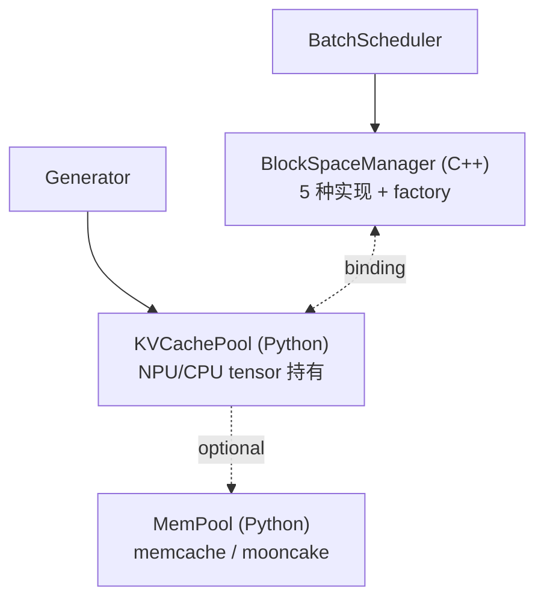
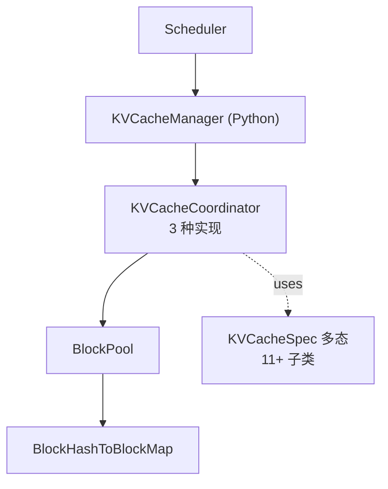
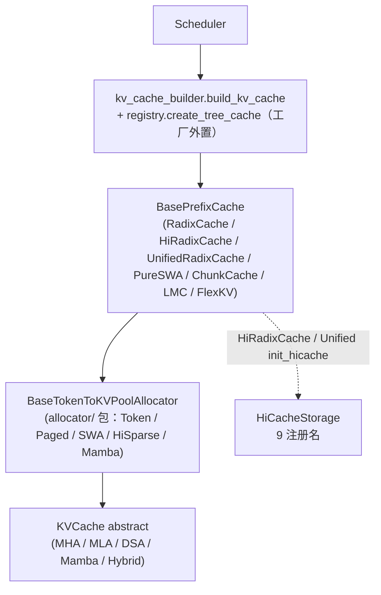

# Cross-project Comparison: KV Cache

> 三项目 KV cache 体系对比。覆盖 [§dim-kv](../dimensions.md) 维度。
> 每 cell 都有具体文件锚点，遵循 [AGENTS.md §8](../../AGENTS.md) 对比规则。

## TL;DR (synthesis)

| 维度 | MindIE | vLLM | SGLang |
|---|---|---|---|
| **实现语言** | C++ 块管理 + Python tensor pool | 全 Python | 全 Python（含 C++ radix tree 加速版） |
| **抽象层数** | 3（C++ BlockSpaceManager + Python KVCachePool + MemPool） | 3（KVCacheManager / Coordinator / BlockPool） | 4（PrefixCache / Allocator / KVCache / HiCache Storage） |
| **Prefix cache 数据结构** | C++ 块 hash（见 `GetRankedHashValues`） | Python `BlockHashToBlockMap` | radix tree（[radix_cache.py](d:\design\sglang\python\sglang\srt\mem_cache\radix_cache.py)）+ HiRadixCache 二层 |
| **多 attention 类型抽象** | `BlockManagerType` **5 枚举槽位**（`SELFATTN`/`LWDSELFATTN`/`COMPOSITE`/`REQUESTSINGLE`/`REQUESTSLIDINGWINDOW`），但 **工厂仅产 2 种**（`SELFATTN`/`LWDSELFATTN`）+ 1 独立类（`RequestSingleBlockManager`，未接工厂）；详 `entities/BlockSpaceManager.md`（已删） | `KVCacheSpec` 多态 + 多种 spec 子类 | 独立 `*KVPool` class（MHA / MLA / DSA（~~NSA~~ 已更名）/ Mamba / Hybrid；~~DoubleSparse~~ 池已删除，`DoubleSparseTokenToKVPool` 在 `srt/mem_cache/` grep 0 命中 @2026-08-18） |
| **Hybrid（混合 cache 类型）** | `COMPOSITEBLOCKMANAGER` 枚举存在但 **类未实现**（`subManagers` 字段保留为 future use） | `HybridKVCacheCoordinator` + `verify_and_split_kv_cache_groups` | `hybrid_cache/hybrid_pool_assembler.py` |
| **Eviction 策略** | LRU（C++ `AccessAllblocksInSeq`） | LRU（`FreeKVCacheBlockQueue` 双向链表） | **7 种**（LRU / LFU / FIFO / MRU / FILO / Priority / SLRU） |
| **多层存储 (HiCache / KV store)** | `MemPool` 2 后端（memcache / mooncake） | `KVConnector` 钩子（PD 分离用） | **HiCache 一等公民，~~7~~ 9 注册名**（file / nixl / mooncake / hf3fs / aibrix / eic / simm / mori(umbp) / shm，[backend_factory.py:197-247](d:\design\sglang\python\sglang\srt\mem_cache\storage\backend_factory.py)；lmcache / flexkv 改为 prefix-cache 工厂后端，不走 `HiCacheStorage`） |
| **量化** | 通过 dtype（`STR_DTYPE_TO_DTYPE`） | `KVQuantMode` enum | **FP4 独立子类**（MHA/MLA 都有 FP4 版） |
| **PD 分离原生支持** | ✅ 一等公民（`GetRemoteComputedBlockIds`, `SMALL_RANK_FIRST`, `LwdInitCloudBlockManager`） | 通过 `KVConnector` 钩子 | 通过 mixin + storage 后端 + **decode retraction 保 KV**（host_pool 备份分支，#34801，[registry.py:85-89](d:\design\sglang\python\sglang\srt\mem_cache\registry.py)）+ **unified memory 兼容 PD**（#33362） |
| **稀疏 attention** | （`KvCacheType::SLIDING_WINDOW` 一种） | `SlidingWindowSpec` + `ChunkedLocalAttentionSpec` + `MLAAttentionSpec` | **专门 sparsity 子系统**（Quest / DeepSeek DSA，~~deepseek_nsa.py~~ 已更名 [sparsity/algorithms/deepseek_dsa.py](d:\design\sglang\python\sglang\srt\mem_cache\sparsity\algorithms\deepseek_dsa.py)） |
| **构造工厂入口** | C++ enum + factory（工厂仅产 2 种，[block_manager_interface.h:26-32](d:\design\MindIE-LLM\src\include\block_manager\block_manager_interface.h)） | `get_kv_cache_configs`（[kv_cache_utils.py:1508](d:\design\vllm\vllm\v1\core\kv_cache_utils.py)）+ coordinator 装配 | **工厂已外置**（08-10 轮迁移）：[`kv_cache_builder.build_kv_cache`](d:\design\sglang\python\sglang\srt\mem_cache\kv_cache_builder.py) + [`registry.create_tree_cache`](d:\design\sglang\python\sglang\srt\mem_cache\registry.py)，支持 `--radix-cache-backend` 插件注册；详 [实现](../../sglang/topics/kv-cache.md) |
| **代码量** | C++ ~190 行接口 + 4 个 .cpp 实现 + ~330 行 KVCachePool + ~250 行 mempool | ~555 行 manager + ~510 行 pool + ~560 行 coordinator + ~590 行 spec | ~~62~~ **119** 个 .py / **9 子目录**（f7101b0a 实测），主 `memory_pool.py` ~~2070~~ **5043** 行 |

---

## 1. 整体架构

### MindIE

### vLLM

### SGLang

> 2026-08-18 更新：SGLang 侧工厂已从 `Scheduler.init_cache_with_memory_pool` 迁至 [kv_cache_builder.py:142-356](d:\design\sglang\python\sglang\srt\mem_cache\kv_cache_builder.py) + [registry.py:80-271](d:\design\sglang\python\sglang\srt\mem_cache\registry.py)（Scheduler 只持 `tree_cache` 句柄，[scheduler.py:524-563](d:\design\sglang\python\sglang\srt\managers\scheduler.py)）；hybrid SWA/SSM + hierarchical/DSA 默认汇入 `UnifiedRadixCache`。完整工厂矩阵见 [sglang/topics/kv-cache.md](../../sglang/topics/kv-cache.md)。

---

## 2. Prefix cache 数据结构对比

| 项目 | 数据结构 | 命中查询 API | 锚点 |
|---|---|---|---|
| MindIE | C++ 块 hash（块级） | `GetRankedHashValues(seqId)` + `GetSeqHashValues(seqId)` + `GetCommonComputedBlockIds(seqs)` | [block_manager_interface.h:131-153](d:\design\MindIE-LLM\src\include\block_manager\block_manager_interface.h) |
| vLLM | hash map `{BlockHashWithGroupId: KVCacheBlock | dict[block_id, KVCacheBlock]}` | `BlockPool.get_cached_block(hash)` → `KVCacheManager.get_computed_blocks(request)` | [block_pool.py:34-128, 184-210](d:\design\vllm\vllm\v1\core\block_pool.py), [kv_cache_manager.py:176-217](d:\design\vllm\vllm\v1\core\kv_cache_manager.py) |
| SGLang | radix tree（前缀共享） + HiCache 时双层（device + host + storage） | `RadixCache.match_prefix(MatchPrefixParams) → MatchResult` | [radix_cache.py:376](d:\design\sglang\python\sglang\srt\mem_cache\radix_cache.py)（类 @ [L303](d:\design\sglang\python\sglang\srt\mem_cache\radix_cache.py)）, [hiradix_cache.py:1738](d:\design\sglang\python\sglang\srt\mem_cache\hiradix_cache.py)（类 @ [L77](d:\design\sglang\python\sglang\srt\mem_cache\hiradix_cache.py)）（行号 @f7101b0a 2026-08-18 校正） |

> synthesis: **数据结构选择反映了 cache 粒度**：
> - vLLM 用 hash map → 块级精确匹配，跨请求只要哈希一样就能复用
> - SGLang 用 radix tree → 沿前缀共享，对"同一对话多轮"场景特别友好（每轮在 tree 上加一段）
> - MindIE 用块 hash → 与 vLLM 同思路，但 API 显式分了 `GetCommon` (本地) 与 `GetRemote` (跨节点)

---

## 3. Eviction 策略

| 项目 | 策略 | 实现位置 |
|---|---|---|
| MindIE | LRU（隐式，靠 `AccessAllblocksInSeq` 标 access time） | [block_manager_interface.h:149](d:\design\MindIE-LLM\src\include\block_manager\block_manager_interface.h) |
| vLLM | LRU（`FreeKVCacheBlockQueue` 双向链表 + `touch` 移到队尾） | [block_pool.py:391-407](d:\design\vllm\vllm\v1\core\block_pool.py), [kv_cache_utils.py](d:\design\vllm\vllm\v1\core\kv_cache_utils.py) |
| SGLang | **注册 7 类**：`LRU` / `LFU` / `FIFO` / `MRU` / `FILO` / `Priority` / `SLRU`（[evict_policy.py:10-49](d:\design\sglang\python\sglang\srt\mem_cache\evict_policy.py) 计数 @f7101b0a 仍成立）；**CLI 默认 ~~3~~ 4 种** `RADIX_EVICTION_POLICY_CHOICES = ["lru","lfu","slru","priority"]`（[server_args.py:317](d:\design\sglang\python\sglang\srt\server_args.py)，`priority` 为 pin 移动期间加入），其余 3 类需 `add_radix_eviction_policy_choices`（[server_args.py:435](d:\design\sglang\python\sglang\srt\server_args.py)）扩展暴露 | [radix_cache.py:328](d:\design\sglang\python\sglang\srt\mem_cache\radix_cache.py)（`get_eviction_strategy`）, [evict_policy.py](d:\design\sglang\python\sglang\srt\mem_cache\evict_policy.py), [server_args.py:317, 435, 919-931](d:\design\sglang\python\sglang\srt\server_args.py) |

> synthesis: SGLang 是唯一可配置 eviction 策略的。其它两家都假设 LRU 就够用。

> [!warning] CONTRADICTION（命名 / 数字精度）：本表与 §TL;DR 此前写"SGLang **7 种**"是按"`evict_policy.py` 注册类数"统计，但 CLI 默认暴露有限。**精确说（2026-08-18 更新）**：注册 7 类、CLI 默认 ~~3~~ **4** 种（`lru / lfu / slru / priority`，[server_args.py:317](d:\design\sglang\python\sglang\srt\server_args.py)）、可通过 `add_radix_eviction_policy_choices` 扩展。本对比已在 [comparison/topics/prefix-cache.md §4 Eviction 策略](prefix-cache.md#4-eviction-策略) 显式 sync（该页 CLI 计数如仍写 3 种需同步，见 §Increment 遗留项）。

---

## 4. 多 attention 类型 / 多 cache 组

### MindIE: `BlockManagerType` 5 种 + `KvCacheType` 3 种
- `SELFATTNBLOCKMANAGER` / `LWDSELFATTNBLOCKMANAGER` / `COMPOSITEBLOCKMANAGER` / `REQUESTSINGLEBLOCKMANAGER` / `REQUESTSLIDINGWINDOWBLOCKMANAGER`
- `KvCacheType`: `TOKEN` / `SEQUENCE` / `SLIDING_WINDOW`
- 锚点：[block_manager_interface.h:26-32, 49-53](d:\design\MindIE-LLM\src\include\block_manager\block_manager_interface.h)

### vLLM: `KVCacheSpec` 11+ 子类
- `FullAttentionSpec` / `TQFullAttentionSpec` / `MLAAttentionSpec` / `ChunkedLocalAttentionSpec` / `SlidingWindowSpec` / `SinkFullAttentionSpec` / `EncoderOnlyAttentionSpec` / `CrossAttentionSpec` / `MambaSpec` / `UniformTypeKVCacheSpecs`
- 锚点：[kv_cache_interface.py:69-590](d:\design\vllm\vllm\v1\kv_cache_interface.py)

### SGLang: 独立 KVPool class
- ~~`NSATokenToKVPool` / `DoubleSparseTokenToKVPool`~~（2026-08-18 校正：NSA 池更名 DSA，DoubleSparse 池已删除——`srt/mem_cache/` 全树 grep 0 命中）
- 现行清单：`MambaPool` @ [L335](d:\design\sglang\python\sglang\srt\mem_cache\memory_pool.py) / `ReqToTokenPool` @ [L256](d:\design\sglang\python\sglang\srt\mem_cache\memory_pool.py) / `MHATokenToKVPool` @ [L1755](d:\design\sglang\python\sglang\srt\mem_cache\memory_pool.py) / `MHATokenToKVPoolFP4` @ [L2981](d:\design\sglang\python\sglang\srt\mem_cache\memory_pool.py) / `HybridLinearKVPool` @ [L3577](d:\design\sglang\python\sglang\srt\mem_cache\memory_pool.py) / `MLATokenToKVPool` @ [L3932](d:\design\sglang\python\sglang\srt\mem_cache\memory_pool.py) / `MLATokenToKVPoolFP4` @ [L4208](d:\design\sglang\python\sglang\srt\mem_cache\memory_pool.py) / `DSATokenToKVPool` @ [L4348](d:\design\sglang\python\sglang\srt\mem_cache\memory_pool.py)
- Host 侧池家族已文件级拆分：`MambaPoolHost` 迁出 `memory_pool_host.py` 至 [pool_host/mamba.py:42](d:\design\sglang\python\sglang\srt\mem_cache\pool_host\mamba.py)（#31180），`pool_host/` 含 base/common/hisparse/mamba/mha/mla 六实现
- 锚点：~~memory_pool.py:741-2073~~ → [memory_pool.py](d:\design\sglang\python\sglang\srt\mem_cache\memory_pool.py)（全文件 5043 行 @f7101b0a）

> synthesis: **设计哲学差异**：
> - vLLM：spec 多态（数据 + 行为分离，多种 spec 共享统一 manager）
> - SGLang：独立 class（每种 attention 自带 set/get/buffer 实现）
> - MindIE：enum + factory（C++ 风格，5 种 manager 选一个）

---

## 5. 多层存储 / KV store

| 项目 | 抽象 | 后端数 | 锚点 |
|---|---|---|---|
| MindIE | `MemPool` (Python) — 主要用于 PD 分离场景 | 2（memcache / mooncake） | [mempool/](d:\design\MindIE-LLM\mindie_llm\text_generator\mempool) |
| vLLM | `KVConnector` 钩子（在 KVCacheManager / Scheduler 上） | 实现各异（NIXL / Mooncake / 自研，未本轮深入） | [scheduler.py:120, 2070-2102](d:\design\vllm\vllm\v1\core\sched\scheduler.py), [v1/kv_offload/](d:\design\vllm\vllm\v1\kv_offload) |
| SGLang | **HiCache 一等公民**：`HiCacheStorage(ABC)` + `HiRadixCache` / `UnifiedRadixCache.init_hicache` 集成；host→storage L2 传输已抽出独立 [`L2TransferEngine`](d:\design\sglang\python\sglang\srt\mem_cache\l2_transfer.py)（[l2_transfer.py:49](d:\design\sglang\python\sglang\srt\mem_cache\l2_transfer.py)，#34793 新增） | ~~7 个~~ **9 注册名**：file / nixl / mooncake / hf3fs / aibrix / eic / simm / mori(umbp) / shm（lmcache / flexkv 改走 prefix-cache 工厂，不是 `HiCacheStorage` 插件） | [storage/backend_factory.py:197-247](d:\design\sglang\python\sglang\srt\mem_cache\storage\backend_factory.py), [hicache_storage.py:150](d:\design\sglang\python\sglang\srt\mem_cache\hicache_storage.py), [hiradix_cache.py:77](d:\design\sglang\python\sglang\srt\mem_cache\hiradix_cache.py) |

> synthesis: **SGLang 在 HiCache 上明显领先**——专门为多层存储设计的 `HiRadixCache`，prefetch / write_back / load_back / evict_host 都有原生 API。MindIE 的 MemPool 更接近"远程 KV 存储"语义，没有 device → host → remote 的分级。vLLM 的 `KVConnector` 处于中间。

---

## 6. 量化支持

| 项目 | 实现 | 锚点 |
|---|---|---|
| MindIE | 通过 dtype 枚举（`STR_DTYPE_TO_DTYPE`） | [separate_deployment_engine.py 引用](d:\design\MindIE-LLM\mindie_llm\text_generator\utils\separate_deployment_engine.py) |
| vLLM | `KVQuantMode` enum（含 per-token-head） + `is_quantized_kv_cache` 判定 | [kv_cache_interface.py:30-66](d:\design\vllm\vllm\v1\kv_cache_interface.py) |
| SGLang | **FP4 独立子类**：`MHATokenToKVPoolFP4` / `MLATokenToKVPoolFP4` | [memory_pool.py:2981, 4208](d:\design\sglang\python\sglang\srt\mem_cache\memory_pool.py)（~~1084, 1671~~ 行号 @f7101b0a 校正） |

---

## 7. PD 分离原生支持

| 项目 | KV cache 层面的支持 | 锚点 |
|---|---|---|
| MindIE | ✅ **一等公民**：`GetRemoteComputedBlockIds(seqs, computedLens, tpSize, modelName)` + `GetAllRankRemoteComputedBlockIds` + `SMALL_RANK_FIRST` 分配模式 + `LwdInitCloudBlockManager`（layerwise PD） | [block_manager_interface.h:43-47, 155-159, 176-185](d:\design\MindIE-LLM\src\include\block_manager\block_manager_interface.h) |
| vLLM | 通过 `KVConnector` 钩子：`Scheduler.connector` + `_try_promote_blocked_waiting_request` + `_update_waiting_for_remote_kv` | [scheduler.py:120, 2036-2102](d:\design\vllm\vllm\v1\core\sched\scheduler.py) |
| SGLang | 通过 storage 后端 + `SchedulerDisaggregationDecode/PrefillMixin`（mixin MRO [scheduler.py:383-390](d:\design\sglang\python\sglang\srt\managers\scheduler.py)）+ HiCache 后端（mooncake_store 等可作 P-D 之间共享）；**新增（#34801）**：PD-decode retraction 时 KV 备份到 host_pool——工厂链顶端分支 `disable_radix_cache ∧ host_pool` → `UnifiedRadixCache + init_hicache`（[registry.py:85-89](d:\design\sglang\python\sglang\srt\mem_cache\registry.py)，`resolve_decode_retraction_backup` @ [kv_cache_builder.py:142-190](d:\design\sglang\python\sglang\srt\mem_cache\kv_cache_builder.py)）；**#33362**：`--enable-unified-memory` 兼容 PD | [registry.py:85-89](d:\design\sglang\python\sglang\srt\mem_cache\registry.py), [storage/mooncake_store/](d:\design\sglang\python\sglang\srt\mem_cache\storage\mooncake_store), 详 [实现](../../sglang/topics/kv-cache.md) |

> synthesis: **MindIE 是唯一把"远端已算块查询"做到 KV cache 接口里的**。vLLM 把它放在 Scheduler 层做（waiting status），SGLang 把它放在 storage 后端做。MindIE 这种设计在跨节点 prefix cache 命中场景延迟更小（一次接口调用），但耦合更紧。

---

## 8. 稀疏 attention KV

| 项目 | 实现 | 锚点 |
|---|---|---|
| MindIE | `KvCacheType::SLIDING_WINDOW` + `REQUESTSLIDINGWINDOWBLOCKMANAGER` | [block_manager_interface.h:31, 53](d:\design\MindIE-LLM\src\include\block_manager\block_manager_interface.h) |
| vLLM | `SlidingWindowSpec` + `ChunkedLocalAttentionSpec` + `MLAAttentionSpec`（MLA 也是稀疏方向） | [kv_cache_interface.py:275-359](d:\design\vllm\vllm\v1\kv_cache_interface.py) |
| SGLang | **专门 sparsity 子系统**：`sparsity/algorithms/{quest_algorithm, deepseek_dsa, base_algorithm}.py`（~~deepseek_nsa~~ 已更名 @2026-08-18 实测）+ `SparseCoordinator` + `BackendAdaptor` | [mem_cache/sparsity/](d:\design\sglang\python\sglang\srt\mem_cache\sparsity) |

> synthesis: SGLang 是唯一把稀疏注意力拆成独立子系统的，与主 cache 体系正交。

---

## 9. Cache events / 可观测性

| 项目 | 事件机制 | 锚点 |
|---|---|---|
| MindIE | `GetPrefixCacheHitRate()` 简单计数 | [block_manager_interface.h:163](d:\design\MindIE-LLM\src\include\block_manager\block_manager_interface.h) |
| vLLM | `KVCacheEvent` + `KVCacheMetricsCollector` + `take_events()` | [block_pool.py:499-509](d:\design\vllm\vllm\v1\core\block_pool.py), [kv_cache_metrics.py](d:\design\vllm\vllm\v1\core\kv_cache_metrics.py), [vllm/distributed/kv_events.py](d:\design\vllm\vllm\distributed\kv_events.py) |
| SGLang | `enable_kv_cache_events` flag + `take_events` + HiCache 还有 `check_hicache_events`；**新增（#30827）**：KV events 携带 **cache salt**——`RadixKey.cache_salt` slot（[radix_cache.py:62-80](d:\design\sglang\python\sglang\srt\mem_cache\radix_cache.py)）+ `BlockStored` 事件带 `BlockStoredMetadata(cache_salt=...)`（[events.py:128-133](d:\design\sglang\python\sglang\srt\mem_cache\events.py)，`KVCacheEventMixin` @ [events.py:37](d:\design\sglang\python\sglang\srt\mem_cache\events.py)） | [base_prefix_cache.py:373-379](d:\design\sglang\python\sglang\srt\mem_cache\base_prefix_cache.py), [events.py](d:\design\sglang\python\sglang\srt\mem_cache\events.py) |

**Cache salt 三方 cross-check（anchor-driven，2026-08-18）**：

| 项目 | cache salt 进 KV 事件 / block hash | 锚点 |
|---|---|---|
| MindIE | MindIE 未在本环境检出，cross-check 跳过（2026-08-18） | — |
| vLLM | ✅ **真等价物**：`request.cache_salt` 作为 block hash extra key（首块注入），KV events 的 `extra_keys` 字段按块携带 cache_salt 供外部消费者重建 block hash | [kv_cache_utils.py:385, 518-526](d:\design\vllm\vllm\v1\core\kv_cache_utils.py), [kv_events.py:63-68](d:\design\vllm\vllm\distributed\kv_events.py) |
| SGLang | ✅ `RadixKey.cache_salt` + `BlockStoredMetadata(cache_salt=...)`（#30827 本期新增） | [radix_cache.py:62-80](d:\design\sglang\python\sglang\srt\mem_cache\radix_cache.py), [events.py:128-133](d:\design\sglang\python\sglang\srt\mem_cache\events.py) |

> synthesis: cache salt（同 prompt 显式隔离 cache 命名空间）两家均已支持；vLLM 是把 salt 揉进 block hash 的 extra_keys（事件只透传 hash 材料），SGLang 是在 radix key 与事件 metadata 各带一份显式字段——消费端语义等价，实现位置不同。

---

## 10. 与你 PD 优化的关联（synthesis）

> 注意：本节是综合性建议。

如果你正在做 MindIE PD 优化，KV cache 层面可关注的点：

1. **Prefix cache 跨节点命中**：MindIE 的 `GetRemoteComputedBlockIds` 是同步调用，如果 D 节点查 P 节点 prefix cache 时走网络 RPC，会显著拖 TTFT。可对照 vLLM 的"在 Scheduler.waiting 阶段异步等"方案，看是否能改成异步。
2. **SGLang 的 HiCache prefetch 思路可借鉴**：[hiradix_cache.py:1771 prefetch_from_storage](d:\design\sglang\python\sglang\srt\mem_cache\hiradix_cache.py)（行号 @f7101b0a）。当 D 节点收到请求但 P 端 KV 还没传完时，提前 prefetch 可能减少等待。MindIE 的 `MemPool` 目前没有显式 prefetch API。
3. **Eviction 策略**：MindIE 默认 LRU。如果你的负载是"热请求长期跑 + 偶发冷请求"，SGLang 的 LFU / Priority 可能更友好。但本身 MindIE 没暴露这个开关，需要在 C++ 改。
4. **`BlockManagerType` 选择**：如果你用 layerwise PD，确认走的是 `LWDSELFATTNBLOCKMANAGER` 而非 `SELFATTNBLOCKMANAGER`，否则 `LwdGetCloud*` API 没法用。
5. **`SMALL_RANK_FIRST` 的影响**：P 节点默认这个模式，意味着 KV 集中在小 rank。如果你 PD 之间用 RDMA 传 KV，这种聚集模式有利于减小通信扇出。

跨项目可借鉴：

- **从 vLLM 借鉴**：`BlockHashToBlockMap` 不去重的 trade-off（[block_pool.py:48-52](d:\design\vllm\vllm\v1\core\block_pool.py)）—— "块 ID 不变，block table append-only"是 NPU graph capture 的隐性前提
- **从 SGLang 借鉴**：HiCache 的 device → host → storage 三层 + 可配置 eviction strategy

---

## Increment 2026-08-18 (SGLang 06f32bab → f7101b0a)

本次仅刷新 **SGLang 列**（vLLM pin 5f7fab88 / MindIE pin f032cd3f 未动；MindIE 源码未在本环境检出）。事实源：[sglang/topics/kv-cache.md](../../sglang/topics/kv-cache.md) 与 [sglang/modules/mem_cache.md §Increment](../../sglang/modules/mem_cache.md)（均 verified_against 2026-08-18），关键锚点已在 /tmp 检出的 f7101b0a 树上复核。本页改动要点：

- **工厂叙事更新**（08-10 轮已变、本页此前仍是旧叙事）：§1 SGLang 图与新增 TL;DR「构造工厂入口」行改为 `kv_cache_builder.build_kv_cache` + `registry.create_tree_cache`；hybrid/hierarchical/DSA 默认汇入 `UnifiedRadixCache`。
- **多层存储**：HiCache storage 注册名 7 → **9**（+file/shm/mori(umbp)；lmcache/flexkv 改为 prefix-cache 工厂后端）；host→storage L2 传输抽出 [`L2TransferEngine`](d:\design\sglang\python\sglang\srt\mem_cache\l2_transfer.py)（#34793）。
- **KV pool 清单校正**：`NSATokenToKVPool` → `DSATokenToKVPool`（[memory_pool.py:4348](d:\design\sglang\python\sglang\srt\mem_cache\memory_pool.py)）；`DoubleSparseTokenToKVPool` 删除；`MambaPoolHost` 迁至 [pool_host/mamba.py](d:\design\sglang\python\sglang\srt\mem_cache\pool_host\mamba.py)（#31180）；`memory_pool.py` 现 5043 行；mem_cache 119 `.py` / 9 子目录。
- **PD 交叉**：§7 SGLang cell 增补 HiCache retraction 保 decode KV（#34801，host_pool 工厂分支）与 unified-memory 兼容 PD（#33362）。
- **事件**：§9 增补 cache salt 进 KV events（#30827）+ 三方 cross-check 表。
- **多模态嵌入缓存**（未单列维度，此处记录）：`EmbeddingCacheController` 已脱钩 Mooncake（#30392），上移至 [mem_cache/embedding_cache_controller.py](d:\design\sglang\python\sglang\srt\mem_cache\embedding_cache_controller.py)，后端抽象为 [`EmbeddingStore`](d:\design\sglang\python\sglang\srt\mem_cache\embedding_store.py)——vLLM 对位物是 `EncoderCacheManager`（无独立 store 抽象），MindIE 未检出。
- **Eviction CLI 口径**：CLI 默认 choices 3 → **4**（+`priority`，[server_args.py:317](d:\design\sglang\python\sglang\srt\server_args.py)）。

**Anchor-driven cross-check 结果（vLLM @ /tmp/vllm-pin 5f7fab88）**：

- `cache_salt`：✅ 命中（[kv_cache_utils.py:385, 518-526](d:\design\vllm\vllm\v1\core\kv_cache_utils.py) + [kv_events.py:63-68](d:\design\vllm\vllm\distributed\kv_events.py)）——已补入 §9 三方表。
- HiCache retraction 保 decode KV 等价物：`retract`（不区分大小写）在 /tmp/vllm-pin `vllm/` 全树 grep **0 命中**（vLLM 语义为 preemption + 重算，无「retraction 时 KV 备份到 host pool」路径）——N/A (verified 2026-08-18)。
- `L2TransferEngine` 等价物：vLLM host↔storage 分层由 [v1/kv_offload/](d:\design\vllm\vllm\v1\kv_offload) `OffloadingManager` + worker handler 承担（本页 §5 vLLM cell 原叙事仍成立），无独立 L2 传输引擎文件级抽象。
- MindIE 未在本环境检出，cross-check 跳过（2026-08-18）。

## Notes / Caveats
> [!todo] VERIFY: vLLM 的 `KVConnector` 内部各 backend 实现（[v1/kv_offload/](d:\design\vllm\vllm\v1\kv_offload), [vllm/distributed/kv_transfer/kv_connector/v1/](d:\design\vllm\vllm\distributed\kv_transfer\kv_connector\v1)），下一轮 ingest pd-disaggregation 时再展开。
> [!todo] VERIFY: MindIE C++ 各 BlockManager 的 .cpp 实现细节（本轮主要看的接口）。
> ~~[!todo] VERIFY: SGLang `unified_cache_components/` 与 `unified_radix_cache.py` 是否在替换 `radix_cache.py`。~~ **RESOLVED 2026-08-18**：包已更名 `unified_cache/`；`UnifiedRadixCache` 成为 hybrid SWA/SSM + hierarchical/DSA 的**默认汇合实现**（[registry.py:119-128](d:\design\sglang\python\sglang\srt\mem_cache\registry.py)），但 plain 默认路径仍是 `RadixCache`——不是全面替换。详 [sglang/topics/kv-cache.md](../../sglang/topics/kv-cache.md)。
> [!todo] VERIFY: [comparison/topics/prefix-cache.md](prefix-cache.md) 的 SGLang 列（10 分支工厂 / CLI eviction 3 种等叙事）尚未按 f7101b0a 增量刷新，与本页 §3 更新后的口径存在滞后（遗留项，非本轮范围）。

## See also
- [comparison/dimensions.md](../dimensions.md) §dim-kv / §dim-prefix-cache
- [comparison/topics/prefix-cache.md](prefix-cache.md) — 子页：三家 prefix cache 深度对比（11 子维度），本页 §2 Prefix cache 数据结构对比的深化
- [vllm/entities/KVCacheManager.md](../../vllm/entities/KVCacheManager.md)
- [vllm/topics/prefix-cache.md](../../vllm/topics/prefix-cache.md)
- [sglang/topics/kv-cache.md](../../sglang/topics/kv-cache.md)（**SGLang 列事实源**：`kv_cache_builder` + `registry` 工厂矩阵，verified 2026-08-18 @f7101b0a）
- [sglang/modules/mem_cache.md](../../sglang/modules/mem_cache.md)（模块页，status: stale，增量注记 @2026-08-18）
- [comparison/topics/scheduler.md](scheduler.md)（scheduler 里 allocate_slots 的描述与本页 §Prefix cache 互补）
- [comparison/index.md](../index.md)
