# Cross-project Comparison: Multi-process IPC

## Summary

三家进程间通信（IPC）的协议栈与零拷贝策略差异显著，是 [engine-architecture.md §1](engine-architecture.md) 与 [executor-worker.md §3-§4](executor-worker.md) 已铺好种子的深化：

- **vLLM** 是 IPC 形态最丰富的：5 类机制并存（ZMQ socket + `MessageQueue` 共享内存 + `multiprocessing.Pipe` + `queue.Queue` + POSIX 信号）+ tensor IPC 第 6 类（多模态专用）。前端 ↔ EngineCore 用 ZMQ，Executor ↔ Worker 走 `MessageQueue` 零拷贝共享内存（**热路径**）。序列化用 msgspec + cloudpickle。
- **SGLang** 只用 ZMQ + pickle（`recv_pyobj` / `send_pyobj`），**全 IPC 路径无零拷贝**——manager 之间（TokenizerManager ↔ Scheduler ↔ DetokenizerManager）+ DataParallelController 都是 ZMQ PUSH/PULL。被 [TokenizerManager.md CONTRADICTION](../../sglang/entities/TokenizerManager.md) 标"吞吐 ceiling 受 pickle 性能影响"。
- **MindIE** 只在 generator ↔ connector 之间有 IPC（其它都是同进程线程 + Python 函数调用），用**共享内存 + protobuf**：4 channel 名（execute / shared_sync_link / transfer / recover_command）+ 严格大小常量（32MB / 0.5MB / 0.5MB），C++ 与 Python 双向数值对齐。

`synthesis:` 三家"哪些边界跨进程"决定了 IPC 复杂度——**vLLM 进程边界最多（前端/EngineCore/N×Worker）→ IPC 机制最丰富**；**SGLang 严格 3 进程 → 单一协议（ZMQ pickle）**；**MindIE 几乎只 1 进程 → IPC 仅为 PD connector 子进程留**。

## Sources

见 frontmatter `sources:`（11 个核心源文件 + 20+ 相关 wiki 页）。

## §1 进程边界数与 IPC 拓扑

```mermaid
flowchart TB
  subgraph Mindie [MindIE - 单进程为主]
    G[Generator + LlmEngine C++ + PluginManager + ModelRunner]
    C[connector backend 子进程<br/>仅 PD 时]
    G -.SHM + protobuf.-> C
  end
  subgraph VLLM [vLLM - 可插拔 1 / 2 / 1+1+N 进程]
    FE[LLMEngine / AsyncLLM]
    EC[EngineCoreProc]
    W1[WorkerProc 0]
    Wn[WorkerProc N-1]
    FE -.ZMQ ROUTER+PULL.-> EC
    EC -.MessageQueue shm broadcast.-> W1
    EC -.MessageQueue shm broadcast.-> Wn
    W1 -.MessageQueue shm response.-> EC
    Wn -.MessageQueue shm response.-> EC
  end
  subgraph SGLang [SGLang - 严格 3+ 进程]
    TM[TokenizerManager 主进程]
    Sched[Scheduler 子进程 x TP x PP x DP]
    DTM[DetokenizerManager 子进程]
    DPC[DataParallelController 子进程<br/>仅 dp_size>1]
    TM -.ZMQ PUSH scheduler_input_ipc.-> DPC
    DPC -.ZMQ PUSH per-rank.-> Sched
    Sched -.ZMQ PUSH detokenizer_ipc.-> DTM
    DTM -.ZMQ PUSH tokenizer_ipc.-> TM
  end
```

| 维度 | MindIE | vLLM | SGLang |
|---|---|---|---|
| **典型进程数** | 1 generator（PD 时 + 1 connector） | 1（inproc）/ 2（uniproc）/ **1+1+N**（MultiprocExecutor）/ DP × N（DPLB） | **3**（TM + Sched + DTM）（DP 时 + DPC） |
| **跨进程边界数** | 0-1 | 0-2 | 3-4 |
| **IPC 协议种类** | 共享内存 + protobuf（仅 1 套）| **5 类**：ZMQ / `MessageQueue` shm / Pipe / `queue.Queue` / POSIX signal（+ TensorIPC 第 6 类） | **1 类**：ZMQ pickle |
| **是否有"前端-后端"边界** | ❌ 同进程 | ✅ 前端 ↔ EngineCore（ZMQ） | ✅ TM ↔ Scheduler（ZMQ） |
| **是否有"executor-worker"边界** | ❌ 同进程线程 | ✅ EngineCore ↔ Worker（MessageQueue shm） | ❌ Scheduler 与 worker 同进程 |
| **是否有"detokenize"独立进程** | ❌ | ❌ | ✅ DetokenizerManager（[DetokenizerManager 节](../../sglang/entities/TokenizerManager.md)） |
| **DP 是否独立路由进程** | ❌ generator 内 flag | ❌ `DPLBAsyncMPClient` 在前端进程内（[EngineCoreClient.md](../../vllm/entities/EngineCoreClient.md)） | ✅ **`DataParallelController` 独立子进程**（[DataParallelController.md](../../sglang/entities/DataParallelController.md)） |

详 [engine-architecture.md §1](engine-architecture.md)。

---

## §2 IPC 协议栈对照

### vLLM 5 类（详 [vllm/topics/multiproc-ipc.md](../../vllm/topics/multiproc-ipc.md)）

| 类别 | 用途 | 关键锚点 |
|---|---|---|
| **ZMQ socket** | 前端 ↔ EngineCoreProc（请求/输出/DP coordinator） | [`engine/core.py:1383-1527`](d:\design\vllm\vllm\v1\engine\core.py)；详 [EngineCoreClient.md hidden state 表](../../vllm/entities/EngineCoreClient.md) |
| **`MessageQueue` 共享内存环形 buffer** | EngineCoreProc ↔ Workers（**热路径**广播 + 单 reader 响应） | [`shm_broadcast.py`](d:\design\vllm\vllm\distributed\device_communicators\shm_broadcast.py) + [`multiproc_executor.py:129-238, 555-585`](d:\design\vllm\vllm\v1\executor\multiproc_executor.py) |
| **`multiprocessing.Pipe`** | ready 信号 + death 信号双通道 | [`multiproc_executor.py:665-703, 775-798`](d:\design\vllm\vllm\v1\executor\multiproc_executor.py) |
| **Python `queue.Queue` + threading** | EngineCoreProc 内部 IO 线程 ↔ busy loop | [`engine/core.py:821-907`](d:\design\vllm\vllm\v1\engine\core.py) |
| **POSIX 信号** | SIGTERM/SIGINT/SIGKILL 进程终止三段式 | [`multiproc_executor.py:810-821, 414-477`](d:\design\vllm\vllm\v1\executor\multiproc_executor.py) |
| **TensorIPC**（第 6 类，可选） | 多模态 tensor 共享内存（避免大 tensor ZMQ 拷贝） | [`engine/tensor_ipc.py`](d:\design\vllm\vllm\v1\engine\tensor_ipc.py) |

### SGLang 1 类（详 [sglang/topics/manager-pipeline.md](../../sglang/topics/manager-pipeline.md)）

| 类别 | 用途 | 关键锚点 |
|---|---|---|
| **ZMQ PUSH/PULL** | TokenizerManager ↔ Scheduler ↔ DetokenizerManager 三向流转 | [`tokenizer_manager.py:344-352`](d:\design\sglang\python\sglang\srt\managers\tokenizer_manager.py)、[`detokenizer_manager.py:93-100`](d:\design\sglang\python\sglang\srt\managers\detokenizer_manager.py)、[`scheduler.py:498-543`](d:\design\sglang\python\sglang\srt\managers\scheduler.py) |
| **ZMQ PUSH/PULL（DP 时额外一段）** | TokenizerManager → DataParallelController → 各 DP scheduler | [`data_parallel_controller.py:138-141, 161-163, 257-263`](d:\design\sglang\python\sglang\srt\managers\data_parallel_controller.py) |
| `mp.Pipe` | scheduler 子进程 ready 同步（仅启动期） | [`engine.py:555-556, 1201-1230`](d:\design\sglang\python\sglang\srt\entrypoints\engine.py) |

> **无 MessageQueue / 共享内存 / TensorIPC** —— SGLang 全 IPC 路径走 ZMQ + pickle。

### MindIE 1 类（详 [mindie/modules/connector.md](../../mindie/modules/connector.md) / [mindie/topics/connector.md](../../mindie/topics/connector.md)）

| 类别 | 用途 | 关键锚点 |
|---|---|---|
| **共享内存 + protobuf**（4 + 1 channel） | generator ↔ connector backend 子进程之间 | `connector/shared_mem_communication.py:50` 等；C++ 端 [`src/include/utils/shared_memory.h`](d:\design\MindIE-LLM\src\include\utils\shared_memory.h) |
| Channel 名 + 大小（**严格双向对齐**） | `execute` (32 MB) / `shared_sync_link` (0.5 MB) / `transfer` (0.5 MB) / `recover_command` (0.5 MB) + 1 reserved | [`mindie/modules/connector.md` §3 hidden cross-reference grep 表](../../mindie/modules/connector.md) |
| **进程 fork 协议** | C++ `Executor::BuildConnectorCommand` 拼进程启动参数 → fork connector backend | [`src/executor/executor.cpp:794-809`](d:\design\MindIE-LLM\src\executor\executor.cpp) |

> **无独立 ZMQ / MessageQueue 共享内存框架** —— 自研协议，与 Mooncake / LLMDataDist 的传输栈正交（后者用于 KV 跨节点，不属"engine 内 IPC"）。

### §2 三方对照表

| 协议 | MindIE | vLLM | SGLang |
|---|---|---|---|
| ZMQ socket | ❌ | ✅ 前端 ↔ EngineCore（DEALER/PUSH/XSUB/PAIR） | ✅ 全 IPC（PUSH/PULL） |
| 共享内存环形 buffer（`MessageQueue` 等） | ❌（自研 SHM 用作 protobuf 传输，非环形 buffer） | ✅ Executor ↔ Worker **热路径** | ❌ |
| `multiprocessing.Pipe` | ❌ | ✅ ready / death 双信号 | ✅ scheduler ready 同步 |
| Python `queue.Queue` | ❌（同进程线程用 `queue.Queue`，但属进程内并发非 IPC） | ✅ EngineCoreProc 内部 IO ↔ busy loop | ❌（事件循环单线程）|
| POSIX 信号三段式 SIGTERM→SIGKILL | ❌（无 worker 子进程）| ✅ [`multiproc_executor.py:414-477`](d:\design\vllm\vllm\v1\executor\multiproc_executor.py) | ⚠️ `SIGQUIT` 用作子进程异常上报（[`data_parallel_controller.py:632-635`](d:\design\sglang\python\sglang\srt\managers\data_parallel_controller.py)） |
| TensorIPC（多模态专用） | ❌ | ✅ [`tensor_ipc.py`](d:\design\vllm\vllm\v1\engine\tensor_ipc.py) | ❌ |
| 自研共享内存协议（与 C++ 对齐） | ✅ 4+1 channel，严格大小 + 双向数值对齐 | ❌ | ❌ |

---

## §3 序列化机制

| 维度 | MindIE | vLLM | SGLang |
|---|---|---|---|
| **核心序列化器** | **protobuf**（`model_execute_data_pb2.py` 是构建产物） | **msgspec**（zero-copy struct）+ **cloudpickle**（callable RPC） | **pickle**（`recv_pyobj` / `send_pyobj`） |
| **零拷贝路径** | ❌ protobuf 含拷贝 | ✅ msgspec `recv_multipart(copy=False)` + `MessageQueue` 共享内存 | ❌ pickle 必拷 |
| **callable 序列化** | ❌ 无（同进程函数调用） | ✅ cloudpickle 支持 callable RPC（[`multiproc_executor.py:378-381`](d:\design\vllm\vllm\v1\executor\multiproc_executor.py)） | ❌ pickle 受限 |
| **跨语言（C++ ↔ Python）** | ✅ protobuf 是核心 | ❌（Python-only） | ❌（Python-only） |
| **吞吐 ceiling 来源** | protobuf 序列化开销 | msgspec 零拷贝 + shm 几乎无 ceiling | **pickle 性能成 ceiling**（已在 [TokenizerManager.md CONTRADICTION](../../sglang/entities/TokenizerManager.md) 标注） |

`synthesis:` **vLLM 是三家中唯一同时拥有"零拷贝（MessageQueue + msgspec）+ 灵活（cloudpickle callable）"双优势的**——MindIE 受限于 protobuf schema 与 C++ 跨语言需求；SGLang 选择最简单的 pickle 但承担吞吐代价。

---

## §4 零拷贝路径

### vLLM 完整零拷贝链（详 [vllm/topics/multiproc-ipc.md §1-§2](../../vllm/topics/multiproc-ipc.md)）

| 段 | 机制 | 锚点 |
|---|---|---|
| 前端 → EngineCore（请求） | ZMQ multipart `recv_multipart(copy=False)` + msgspec | [`engine/core.py:1432`](d:\design\vllm\vllm\v1\engine\core.py) |
| EngineCore → Workers（broadcast） | `MessageQueue` 共享内存环形 buffer，`enqueue` 不拷贝 | [`shm_broadcast.py`](d:\design\vllm\vllm\distributed\device_communicators\shm_broadcast.py) |
| Workers → EngineCore（response） | `worker_response_mq` 单 reader + 共享内存 | [`multiproc_executor.py:565`](d:\design\vllm\vllm\v1\executor\multiproc_executor.py) |
| EngineCore → 前端（输出） | ZMQ + `encode_into(outputs, buffer)` + buffer reuse 池 | [`engine/core.py:1494, 1517-1527`](d:\design\vllm\vllm\v1\engine\core.py) |
| 多模态 tensor | TensorIPC 共享内存（避免大 tensor ZMQ 拷贝） | [`engine/tensor_ipc.py`](d:\design\vllm\vllm\v1\engine\tensor_ipc.py) |

### MindIE 共享内存 + protobuf（半零拷贝）

| 段 | 机制 |
|---|---|
| generator → connector（execute channel 32 MB） | 共享内存 + protobuf 编码（**编码本身有拷贝**，但通道传输零拷贝）|
| connector → generator（transfer / recover channel 各 0.5 MB） | 同上 |

### SGLang 全 pickle（无零拷贝）

| 段 | 机制 |
|---|---|
| TM → Scheduler / DPC | ZMQ PUSH + `send_pyobj`（pickle）|
| Scheduler → DTM | ZMQ PUSH + `send_pyobj` |
| DTM → TM | ZMQ PUSH + `send_pyobj` |

> **零拷贝差异**：vLLM 全链零拷贝 / MindIE 通道零拷贝但 protobuf 编码有拷贝 / SGLang 全链都拷贝（pickle 必拷）。

---

## §5 ready 同步与 death 检测机制

| 机制 | MindIE | vLLM | SGLang |
|---|---|---|---|
| **ready 同步** | 同进程构造完即就绪（无显式机制） | ZMQ `EngineCoreReadyResponse` 主动 send（[`engine/core.py:1409-1419`](d:\design\vllm\vllm\v1\engine\core.py)） + `multiprocessing.Pipe` 子→父 send `READY`（[`multiproc_executor.py:854-860`](d:\design\vllm\vllm\v1\executor\multiproc_executor.py)） + MQ 双向 `wait_until_ready`（[`multiproc_executor.py:234-238, 862-866`](d:\design\vllm\vllm\v1\executor\multiproc_executor.py)）—— **MQ 双向 wait 顺序敏感，颠倒会死锁** | `mp.Pipe` reader 收 ready（[`engine.py:555-556, 1201-1230`](d:\design\sglang\python\sglang\srt\entrypoints\engine.py)） |
| **death 检测** | C++ RAII / 同进程线程 join | `multiprocessing.Pipe` death pipe：父持有 writer，子端 `recv()` 阻塞 → 父挂 → child EOFError → 自杀（[`multiproc_executor.py:775-798`](d:\design\vllm\vllm\v1\executor\multiproc_executor.py)） + `connection.wait([h.proc.sentinel])` 阻塞等任一 worker 死（[`multiproc_executor.py:284-285`](d:\design\vllm\vllm\v1\executor\multiproc_executor.py)） | `SubprocessWatchdog`（注入 TM，[`engine.py:206-207`](d:\design\sglang\python\sglang\srt\entrypoints\engine.py)） |
| **fork fd 处理** | N/A | `inherited_fds` 收集 + 子端 `os.close(fd)`（[`multiproc_executor.py:165-203, 831-835`](d:\design\vllm\vllm\v1\executor\multiproc_executor.py)） | N/A（spawn mode）|
| **优雅关闭** | 同进程线程 join | 三段式：death_pipe EOF（4s）→ SIGTERM（4s）→ SIGKILL（[`multiproc_executor.py:414-477`](d:\design\vllm\vllm\v1\executor\multiproc_executor.py)） | `gracefully_exit` flag + atexit `kill_process_tree` |
| **失败回传** | C++ 异常 → pybind → Python | FAILURE 帧 + traceback `add_note`（[`multiproc_executor.py:953-979`](d:\design\vllm\vllm\v1\executor\multiproc_executor.py)）+ `failure_callback` → `EXECUTOR_FAILED` put 到 input_queue（[`engine/core.py:117-118, 823-825`](d:\design\vllm\vllm\v1\engine\core.py)） | scheduler 子进程 `SIGQUIT` 上报（[`data_parallel_controller.py:632-635`](d:\design\sglang\python\sglang\srt\managers\data_parallel_controller.py)） |
| **ENGINE_CORE_DEAD 哨兵** | N/A | ✅ ZMQ `linger=4000` + 哨兵广播（[`engine/core.py:1481, 1488, 1498-1501`](d:\design\vllm\vllm\v1\engine\core.py)） | ❌ |

`synthesis:` **vLLM 的 death/failure 机制是三家中最 robust** —— 独立 ready handshake / death pipe / failure callback / engine_core_dead 哨兵 / SIGTERM 三段式形成完整子进程生命周期管理；代价是 ~700 行管理代码。SGLang 用单一 `SubprocessWatchdog` 简化但牺牲粒度。MindIE 同进程线程模型最简单，但 worker 异常无法被进程级隔离。

---

## §6 ZMQ socket 类型对照（仅 vLLM + SGLang）

| 端 | vLLM | SGLang |
|---|---|---|
| 前端 → engine（请求） | `DEALER`（[`engine/core.py:1383-1391`](d:\design\vllm\vllm\v1\engine\core.py)） | `PUSH`（TM → Scheduler / DPC，[`tokenizer_manager.py:349-352`](d:\design\sglang\python\sglang\srt\managers\tokenizer_manager.py)） |
| engine → 前端（输出） | `PUSH`（[`engine/core.py:1479-1484`](d:\design\vllm\vllm\v1\engine\core.py)） | `PUSH`（DTM → TM）|
| DP coordinator | `XSUB` 订阅（[`engine/core.py:1395-1405`](d:\design\vllm\vllm\v1\engine\core.py)）+ `PAIR` first_req（[EngineCoreClient.md `DPAsyncMPClient` 节](../../vllm/entities/EngineCoreClient.md)）| **PULL** 在 DPC 端 + **PUSH** 到 per-rank（[`data_parallel_controller.py:138-141, 161-163`](d:\design\sglang\python\sglang\srt\managers\data_parallel_controller.py)） |
| ROUTER（多客户端 fan-in） | ✅ `EngineCoreClient.input_socket: ROUTER bind`（[EngineCoreClient.md hidden state 表](../../vllm/entities/EngineCoreClient.md)） | ❌ |
| 序列化 | msgspec multipart + cloudpickle | pickle（`send_pyobj` / `recv_pyobj`） |

---

## §7 综合 cheat sheet

| 维度 | MindIE | vLLM | SGLang |
|---|---|---|---|
| 跨进程边界数 | 0-1 | 0-2 | 3-4 |
| IPC 协议种类 | 1（SHM+protobuf） | **5+1**（ZMQ / MQ shm / Pipe / queue / signal / TensorIPC） | 1（ZMQ pickle） |
| 序列化器 | protobuf | **msgspec + cloudpickle** | pickle |
| 零拷贝热路径 | ❌（半） | ✅ MessageQueue + msgspec | ❌ |
| ready handshake | 无 | ZMQ + Pipe + MQ 双向 | mp.Pipe |
| death 检测 | RAII | death pipe + sentinel + 哨兵 | SubprocessWatchdog |
| 优雅关闭三段式 | N/A | ✅ EOF→SIGTERM→SIGKILL | gracefully_exit flag |
| failure 帧机制 | 异常透传 | ✅ FAILURE multipart + add_note | SIGQUIT |
| TensorIPC（多模态）| ❌ | ✅ | ❌ |
| 跨语言（C++↔Python） | ✅ protobuf | ❌ Python-only | ❌ Python-only |
| 吞吐 ceiling 来源 | protobuf 编码 | 几乎无 | **pickle 性能** |

---

## §8 Anchor-driven cross-check（按 [AGENTS.md §8 规则 6](../../AGENTS.md)）

### Anchor 1：vLLM `MessageQueue` 共享内存环形 buffer

- **vLLM**：[`shm_broadcast.py`](d:\design\vllm\vllm\distributed\device_communicators\shm_broadcast.py) 中 `MessageQueue(num_writers, num_readers, max_chunk_bytes, connect_ip)`
- **MindIE**：在 `d:\design\MindIE-LLM\` 全树 grep `MessageQueue` 类似的"共享内存环形 buffer"实现：**0 命中**。MindIE `SharedMemoryChannel`（[connector/shared_mem_communication.py:50](d:\design\MindIE-LLM\mindie_llm\connector\shared_mem_communication.py)）是单段 channel，**非环形 buffer + 多 reader 广播**。**N/A (verified 2026-04-18)**：MindIE 无 vLLM 风格的 broadcast MQ。
- **SGLang**：在 `d:\design\sglang\` 全树 grep `MessageQueue` / `shm_broadcast`：**0 命中**。SGLang 跨进程全用 ZMQ pickle，无共享内存通道。**N/A (verified 2026-04-18)**。

### Anchor 2：SGLang `recv_pyobj` / `send_pyobj` pickle IPC

- **SGLang**：所有 manager 间 ZMQ 调用都用 `recv_pyobj` / `send_pyobj`（[`detokenizer_manager.py:184-188`](d:\design\sglang\python\sglang\srt\managers\detokenizer_manager.py)）
- **vLLM**：在 `d:\design\vllm\` 全树 grep `send_pyobj` / `recv_pyobj`：**0 命中**。vLLM 用 msgspec multipart + cloudpickle bytes。**N/A (verified 2026-04-18)**：vLLM 有意避免 pickle。
- **MindIE**：在 `d:\design\MindIE-LLM\` 全树 grep `send_pyobj` / `recv_pyobj`：**0 命中**。**N/A (verified 2026-04-18)**：MindIE 跨进程用 protobuf + SHM，不走 ZMQ pickle。

### Anchor 3：MindIE 4 channel 名（execute / shared_sync_link / transfer / recover_command）

- **MindIE**：4 个 channel 在 [connector/main.py](d:\design\MindIE-LLM\mindie_llm\connector\main.py) + C++ [`src/include/utils/shared_memory.h`](d:\design\MindIE-LLM\src\include\utils\shared_memory.h) 双向数值对齐
- **vLLM**：在 `d:\design\vllm\` 全树 grep `shared_sync_link` / `recover_command`：**0 命中**。**N/A (verified 2026-04-18)**：vLLM 无固定 channel 命名（通道由 ZMQ socket 数与 MQ handle 数派生）。
- **SGLang**：在 `d:\design\sglang\` 全树 grep `shared_sync_link` / `recover_command`：**0 命中**。SGLang 用 `scheduler_input_ipc_name` / `tokenizer_ipc_name` / `detokenizer_ipc_name`（命名 + 概念都不同）。**N/A (verified 2026-04-18)**。

`synthesis:` 3 anchor × 三方反向扫 = **6 处 N/A 强论断**——三家 IPC 在协议、序列化、命名、数据流模型层面都正交，**没有可直接套用的等价物**。这是跨家 wiki 价值的高密度产出之一。

---

## §9 与 PD 优化的关联（synthesis）

从本页对比可借鉴的优化思路：

1. **从 vLLM 借鉴 `MessageQueue` 共享内存环形 buffer**：SGLang 用 ZMQ pickle 跨 manager 通信，吞吐 ceiling 受 pickle 性能限制；引入 vLLM 风格的 shm broadcast 可显著提升 TM ↔ Scheduler ↔ DTM 路径吞吐。MindIE PD connector ↔ generator 的 protobuf 通道也可考虑替换为 shm（但需保留 protobuf 跨语言兼容性）。
2. **从 vLLM 借鉴 cloudpickle callable RPC**：MindIE/SGLang 都不支持"前端动态注入 callable 到 worker"的 RPC 模式；vLLM `cloudpickle.dumps(method, ...)` + worker 端 `cloudpickle.loads + partial(..., self.worker)`（[`multiproc_executor.py:378-381`](d:\design\vllm\vllm\v1\executor\multiproc_executor.py)）允许灵活 hook / debug，减少修改 worker 代码的需要。
3. **从 vLLM 借鉴 ENGINE_CORE_DEAD 哨兵 + linger**：SGLang/MindIE 的死亡传播都依赖外部 watchdog；vLLM `linger=4000` 确保 ZMQ 关闭前哨兵能发出，可立即广播给所有客户端。这是优雅降级而非"超时检测"的差异。
4. **从 vLLM 借鉴 TensorIPC（多模态专用）**：MindIE/SGLang 多模态都走常规 IPC + 大 tensor 拷贝；vLLM 用专门的 tensor 共享内存通道（[`tensor_ipc.py`](d:\design\vllm\vllm\v1\engine\tensor_ipc.py)），避免反序列化时的大 tensor 拷贝。MindIE PD layerwise 场景的 KV slice 传输可参考。
5. **从 SGLang 借鉴严格 3 进程模型的简化收益**：vLLM 5 类 IPC 机制虽 robust 但学习曲线陡；SGLang 单一 ZMQ pickle 协议实现简单、debug 友好。生产中如果可接受性能 ceiling，单协议方案值得考虑。
6. **从 MindIE 借鉴 channel 名 + 大小常量双向对齐**：MindIE 把 4 个 channel 名 / 大小（32MB / 0.5MB / 0.5MB）严格写成 C++/Python 同名常量，任一改动需双向同步——这是 IPC schema 演进时的 best practice，vLLM/SGLang 端的 IPC 协议字段缺乏同等强约束。

---

## Notes / Caveats

> [!todo] VERIFY: vLLM `MessageQueue` 的具体共享内存协议（环形 buffer 大小、wraparound、多 reader 时的 fan-out）— 在 [`shm_broadcast.py`](d:\design\vllm\vllm\distributed\device_communicators\shm_broadcast.py)，待 ingest（与 [vllm/topics/multiproc-ipc.md `[!todo] VERIFY` 1](../../vllm/topics/multiproc-ipc.md) 同条）。

> [!todo] VERIFY: SGLang DP 路径下 TM ↔ DPC 的 ZMQ 端口是否与非 DP 路径的 TM ↔ Scheduler 共用？需对照 [`server_args.py PortArgs`](d:\design\sglang\python\sglang\srt\server_args.py) 完整字段表澄清"`scheduler_input_ipc_name` 在 dp_size==1 vs dp_size>1 的双重身份"。

> [!todo] VERIFY: MindIE 4 channel 之外是否还有"reserved"通道（grep 显示 4+1 但没读到第 5 个的具体用途）—— [mindie/modules/connector.md `[!todo] VERIFY` 1](../../mindie/modules/connector.md) 同条。

> [!warning] CONTRADICTION: §5 "vLLM death 检测最 robust"是 synthesis 评价。从 lines of code 看 vLLM 多得多（~700 行 vs SGLang ~200 行），但 SGLang 是否更可靠是另一维度（如 watchdog 漏检率）；本页未做实测对比。

> [!warning] CONTRADICTION: §3 "SGLang 吞吐 ceiling 受 pickle 性能影响"出自 [TokenizerManager.md CONTRADICTION](../../sglang/entities/TokenizerManager.md)，是 synthesis 推断；未做 benchmark 实测。

---

## See also

### 同 comparison 范畴
- [comparison/index.md](../index.md)
- [comparison/dimensions.md](../dimensions.md)
- [comparison/topics/engine-architecture.md](engine-architecture.md)（§1 / §6 已铺种子）
- [comparison/topics/executor-worker.md](executor-worker.md)（§3 / §4 已铺种子）
- [comparison/topics/pd-disaggregation.md](pd-disaggregation.md)（PD 跨节点 KV 传输属另一层 IPC）

### MindIE 端
- [mindie/modules/connector.md](../../mindie/modules/connector.md)
- [mindie/topics/connector.md](../../mindie/topics/connector.md)
- [mindie/entities/SeparateDeploymentEngine.md](../../mindie/entities/SeparateDeploymentEngine.md)
- [mindie/entities/Generator.md](../../mindie/entities/Generator.md)
- [mindie/entities/PluginManager.md](../../mindie/entities/PluginManager.md)
- [mindie/entities/LlmEngine.md](../../mindie/entities/LlmEngine.md)

### vLLM 端
- [vllm/topics/multiproc-ipc.md](../../vllm/topics/multiproc-ipc.md)（最详细的 vLLM IPC 全景图）
- [vllm/entities/EngineCoreClient.md](../../vllm/entities/EngineCoreClient.md)（前端 ZMQ 端）
- [vllm/entities/MultiprocExecutor.md](../../vllm/entities/MultiprocExecutor.md)（MessageQueue 端）
- [vllm/entities/EngineCore.md](../../vllm/entities/EngineCore.md)（EngineCoreProc 端）

### SGLang 端
- [sglang/topics/manager-pipeline.md](../../sglang/topics/manager-pipeline.md)
- [sglang/entities/TokenizerManager.md](../../sglang/entities/TokenizerManager.md)
- [sglang/entities/Scheduler.md](../../sglang/entities/Scheduler.md)
- [sglang/entities/Engine.md](../../sglang/entities/Engine.md)
- [sglang/entities/DataParallelController.md](../../sglang/entities/DataParallelController.md)
