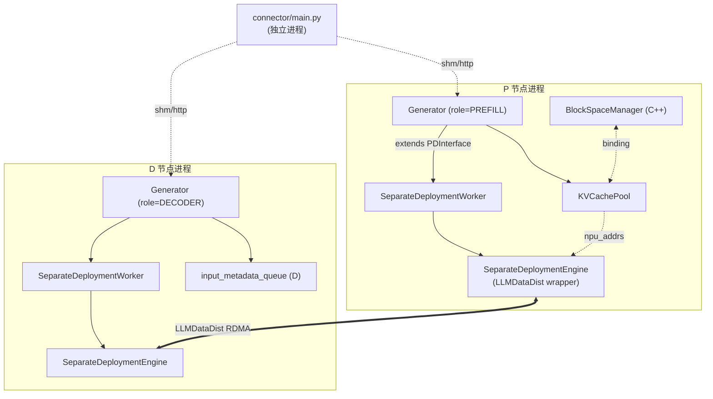
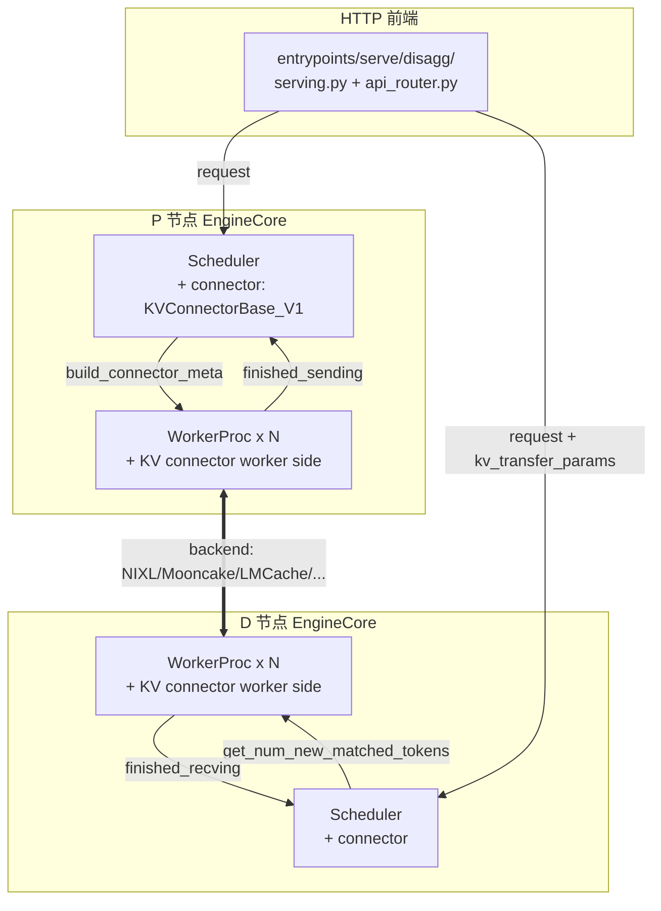
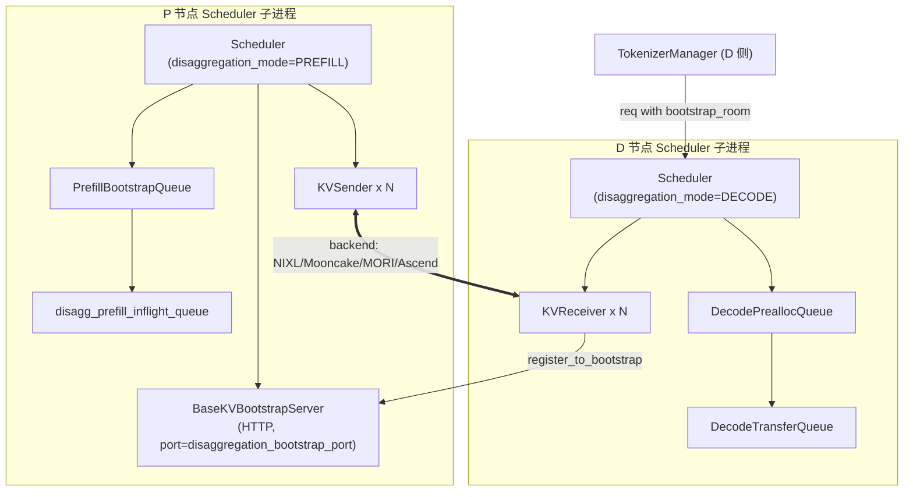

> [!todo] VERIFY: **vLLM pin 滞后提示（2026-08-18）**——本页 vLLM 列锚点最后核对于旧 pin `5f7fab88`；同日晚些时候 vLLM pin 已推进至 `d29dc3ab`（4273 commits，含 P2P connector 删除、`serve/disagg`→`scale_out` 迁移、fused_moe runner 重构、spec_decode 目录重组、`v1/kv_offload/` 内部重组（abstract/spec/mediums/worker → base/config/cpu/factory，另新增 `v1/simple_kv_offload/`）——本页相应文件级锚点已暂时收敛为目录级）。vLLM 列需按 [source-versions.md](../../source-versions.md) 新 pin 做一轮 verify pass；SGLang 列（f7101b0a）与 MindIE 列（f032cd3f）不受影响。

# Cross-project Comparison: PD-Disaggregation (Prefill/Decode 分离)

> 三项目 Prefill/Decode 分离实现对比。覆盖 [§dim-pd](../dimensions.md) 与 [§dim-kv-transfer](../dimensions.md) 维度。
> 每 cell 都给具体源码 / wiki anchor，遵循 [AGENTS.md §8](../../AGENTS.md) 对比规则。

## TL;DR (synthesis)

| 维度 | MindIE | vLLM | SGLang |
|---|---|---|---|
| **设计哲学** | "**LLMDataDist 一等公民**"，PD 分离是 `Generator` 基类（`PDInterface`）就提供的能力 | "**KVConnector 钩子**"，PD 是 `KVConnectorBase_V1` 抽象 + scheduler 上的 hook，可插拔 | "**Disaggregation 子系统**"，独立 `disaggregation/` 模块 + scheduler 两个 mixin |
| **角色枚举** | `DmiModeNodeRole.{PREFILL, DECODER, FLEX}`（Flex = MIX，可同节点 P+D） | `KVConnectorRole.{SCHEDULER, WORKER}`（角色概念在 connector 内部，进程粒度由 `kv_transfer_config` 决定） | `DisaggregationMode.{NULL, PREFILL, DECODE}`（按 Scheduler 启动参数决定整个进程的角色） |
| **运行时切换 P↔D** | ✅ `PDInterface.switch_role(role)`（[generator.py:150-151](d:\design\MindIE-LLM\mindie_llm\text_generator\generator.py)） | ❌ 进程启动后固定 | ❌ 进程启动后固定（`server_args.disaggregation_mode` 一次性） |
| **底层传输栈** | **LLMDataDist**（Ascend 自研，含 RDMA + cache_manager） | 由 connector 决定：NIXL / Mooncake / LMCache / mori / hf3fs / p2p / OffloadingConnector / 多 connector | 5 backend：MOONCAKE / MORI / NIXL / ASCEND / FAKE（枚举已迁至 [utils.py:592-605](d:\design\sglang\python\sglang\srt\disaggregation\utils.py)），每个独立 `conn.py`；3 层继承树 `Base*` → `Common*` → backend 仍成立（2026-08-18 复核），详 [实现](../../sglang/topics/pd-disaggregation.md) |
| **抽象层数** | 2（`SeparateDeploymentEngine` 包 LLMDataDist + `SeparateDeploymentWorker` 包并发管理） | 3（`KVConnectorBase_V1` + worker 端 `OffloadingManager` + worker 内 `OffloadingHandler`） | 3（`BaseKVManager` + `BaseKVSender` / `BaseKVReceiver` + `BaseKVBootstrapServer`） |
| **请求队列** | P 侧无显式 queue（与普通请求共用 `Generator`）+ D 侧 `input_metadata_queue: queue.Queue`（[generator.py:123](d:\design\MindIE-LLM\mindie_llm\text_generator\generator.py)） | scheduler 内多了 `WAITING_FOR_REMOTE_KVS` 状态 + `finished_recving_kv_req_ids` set | **4 个 queue**：`PrefillBootstrapQueue` / `disagg_prefill_inflight_queue` / `DecodePreallocQueue` / `DecodeTransferQueue`；**增量（#34801）**：D 侧 prealloc 内再加 `retracted_queue: List[Req]`（[decode.py:346](d:\design\sglang\python\sglang\srt\disaggregation\decode.py)，retraction 后重排队） |
| **Bootstrap / 握手** | RankTable JSON + `link()` API（[separate_deployment_engine.py:310-361](d:\design\MindIE-LLM\mindie_llm\text_generator\utils\separate_deployment_engine.py)） | connector 自管（`get_handshake_metadata` / `set_xfer_handshake_metadata`） | **专门 `BaseKVBootstrapServer`** + `bootstrap_room: int` / `bootstrap_addr: str` 路由（[base/conn.py:120-121, 189-190, 243](d:\design\sglang\python\sglang\srt\disaggregation\base\conn.py)，~~L172-174~~ @f7101b0a 校正） |
| **传输方向 + 同步性** | **D pull from P，同步**（`pull_blocks` 阻塞调用） | NIXL/Mooncake = D pull **异步**（`WAITING_FOR_REMOTE_KVS` + `nixl_xfer` non-blocking）；Offloading/LMCache = store-fetch **异步** | **P push to D，异步**（`KVSender.send` + `KVReceiver.send_metadata` 反向通知 indices；底层仍可能是 RDMA write） |
| **轮询模型** | 异步线程（`fill_window_thread` + `process_window_thread`）+ deque + 三把锁（[separate_deployment_engine.py:424-453](d:\design\MindIE-LLM\mindie_llm\text_generator\utils\separate_deployment_engine.py)） | scheduler 主循环每步检查 `KVConnectorOutput.finished_recving / finished_sending` | `KVPoll: {Failed, Bootstrapping, WaitingForInput, Transferring, Success}` 五状态机 + `poll_and_all_reduce` 跨 TP rank 同步 |
| **HMA / 多 KV 组** | layerwise PD 通过 `LwdSelfAttnBlockManager` + `LwdInitCloudBlockManager` | `SupportsHMA` 接口 + `request_finished_all_groups` | ~~`state_type: "none"/"mamba"/"swa"`~~ 已升级为 **`StateType` 枚举 6 成员**（`MAMBA`/`SWA`/`DSA`/`MINIMAX_INDEX_K`/`SWA_RING`/`C128_STATE`，[base/conn.py:17-26](d:\design\sglang\python\sglang\srt\disaggregation\base\conn.py)），`KVArgs.state_types: List[StateType]` + `state_data_ptrs` / `state_dim_per_tensor`（[base/conn.py:48-56](d:\design\sglang\python\sglang\srt\disaggregation\base\conn.py)） |
| **失败处理** | `LinkResult` 四态（waiting/running/success/failed）+ `LLMException` 错误码 | `get_block_ids_with_load_errors` + `failed_recving_kv_req_ids` set | `KVPoll.Failed` + `failure_exception()` + `prepare_abort` + `DISAGGREGATION_TEST_FAILURE_PROB` env 故意注错 |
| **服务化入口** | `connector/main.py` + `request_listener` + `request_router`（独立进程，shm/http 与 server 通信） | `entrypoints/serve/disagg/serving.py` + `api_router.py` 提供 `/inference/v1/generate`（流式 token-only） | scheduler 独立 disagg 主循环（`event_loop_normal_disagg_prefill` / `..._decode`） |
| **典型代码量** | `separate_deployment_engine.py` ~ 850 行 + `connector/` 数千行 + C++ block_manager | `kv_connector/v1/base.py` ~ 660 行 + 各 backend ~ 数千行 + `kv_offload/` ~ 数千行 | `disaggregation/` **29 个 .py**（7 子目录 + 顶层编排 + EPD 三件套）+ `decode.py` ~~1370~~ 2300+ 行 + `prefill.py` ~~830~~ 1360+ 行（mixin 定义分别 @ [decode.py:2137](d:\design\sglang\python\sglang\srt\disaggregation\decode.py) / [prefill.py:485](d:\design\sglang\python\sglang\srt\disaggregation\prefill.py)） |

---

## 1. 整体架构对比

### MindIE
PD 分离能力**内置在 `Generator` 基类**，所有 Generator 实例都会跑 `_init_sepd_engine`，唯一区别是 `model_role` 字符串。



锚点：
- `PDInterface` 基类：[generator.py:113-198](d:\design\MindIE-LLM\mindie_llm\text_generator\generator.py)
- `Generator(PDInterface)` 多继承：[generator.py:201](d:\design\MindIE-LLM\mindie_llm\text_generator\generator.py)
- `SeparateDeploymentWorker`：[separate_deployment_engine.py:396-852](d:\design\MindIE-LLM\mindie_llm\text_generator\utils\separate_deployment_engine.py)
- `SeparateDeploymentEngine`：[separate_deployment_engine.py:268-393](d:\design\MindIE-LLM\mindie_llm\text_generator\utils\separate_deployment_engine.py)
- 上层 connector 进程：[connector/main.py](d:\design\MindIE-LLM\mindie_llm\connector\main.py)
- C++ 侧远端块查询：[block_manager_interface.h:155-159](d:\design\MindIE-LLM\src\include\block_manager\block_manager_interface.h)（`GetRemoteComputedBlockIds`）

### vLLM
PD 通过 **KVConnector 钩子**注入 scheduler 与 worker。Scheduler 进程内多了 `connector` 字段（[scheduler.py:120, 127](d:\design\vllm\vllm\v1\core\sched\scheduler.py)），worker 进程通过 `kv_connector_model_runner_mixin.py` 注入。



锚点：
- `KVConnectorBase_V1`：[kv_connector/v1/base.py:170-660](d:\design\vllm\vllm\distributed\kv_transfer\kv_connector\v1\base.py)
- `KVConnectorRole {SCHEDULER, WORKER}`：[base.py:123-128](d:\design\vllm\vllm\distributed\kv_transfer\kv_connector\v1\base.py)
- Scheduler 集成：`self.connector` 字段 + `_try_promote_blocked_waiting_request` + `_update_waiting_for_remote_kv` + `_update_from_kv_xfer_finished`：[scheduler.py:120, 2036-2150](d:\design\vllm\vllm\v1\core\sched\scheduler.py)
- 13 个 connector 实现（v1）：[kv_connector/v1/](d:\design\vllm\vllm\distributed\kv_transfer\kv_connector\v1) — `nixl/`, `mooncake/`, `moriio/`, `lmcache_integration/`, `hf3fs/`, `p2p/`, `offloading/`, `flexkv_connector.py`, `lmcache_connector.py`, `lmcache_mp_connector.py`, `multi_connector.py`, `simple_cpu_offload_connector.py`, `decode_bench_connector.py`, `example_*.py`
- 服务前端：[entrypoints/serve/disagg/serving.py:46-393](d:\design\vllm\vllm\entrypoints\scale_out)（`ServingTokens` 类，专门为"tokens-in tokens-out + `kv_transfer_params` 透传"设计）+ [api_router.py:46-105](d:\design\vllm\vllm\entrypoints\scale_out)（`/inference/v1/generate`）

### SGLang
PD 是独立的 `disaggregation/` 子系统，scheduler 通过 `event_loop_normal_disagg_prefill` / `event_loop_normal_disagg_decode` 两条独立主循环跑（不与普通 `event_loop_normal` 共用）。



锚点（行号 @f7101b0a 2026-08-18 校正）：
- `BaseKV*` 接口：[base/conn.py:38-243](d:\design\sglang\python\sglang\srt\disaggregation\base\conn.py)（`KVArgs` L38 / `KVPoll` L89 / `BaseKVManager` L97 / `BaseKVSender` L115 / `BaseKVReceiver` L184 / `BaseKVBootstrapServer` L243）
- 5 个 backend：`mooncake/conn.py`（最大，本期 +148 行，#33807 staging+PP）/ `nixl/conn.py` / `mori/conn.py` / `ascend/conn.py` + `transfer_engine.py` / `fake/`
- `disagg_service.py` 启动 bootstrap server：[disagg_service.py:14-35](d:\design\sglang\python\sglang\srt\managers\disagg_service.py)（+`maybe_create_ascend_config_store` @ [L37](d:\design\sglang\python\sglang\srt\managers\disagg_service.py)）
- Scheduler init 路径：[scheduler.py:1286-1440](d:\design\sglang\python\sglang\srt\managers\scheduler.py)（按 `DisaggregationMode` 分流：DECODE L1337-1385 / PREFILL L1386-1431 / EPD L1432-1440）
- Prefill mixin 主循环：[prefill.py:569-657](d:\design\sglang\python\sglang\srt\disaggregation\prefill.py)（normal @569 / overlap @607）
- Decode mixin 主循环：[decode.py:2139-2228](d:\design\sglang\python\sglang\srt\disaggregation\decode.py)（normal @2139 / overlap @2173）

---

## 2. 角色模型 / 进程拓扑

| 维度 | MindIE | vLLM | SGLang |
|---|---|---|---|
| **角色枚举值** | `prefill` / `decoder` / `flex`（MIX） | 进程级无；connector 内部 `KVConnectorRole.SCHEDULER / WORKER` | `null` / `prefill` / `decode` |
| **决定时机** | 启动时 `model_config.model_role`，**运行时可改** | 启动时 `kv_transfer_config.kv_role` | 启动时 `--disaggregation-mode` |
| **同节点 P+D 是否支持** | ✅ Flex 角色（LLMRole.MIX） | 通过 `kv_role=both` + `MultiConnector`，间接支持 | ❌ 一个 scheduler 进程只能 P 或 D |
| **跨进程协调** | 由上层 server / connector 进程协调 | 由前端 `entrypoints/serve/disagg/api_router.py` 路由 | TokenizerManager (D 侧) 把请求带 `bootstrap_room` 发给 D 侧 scheduler，D 侧再去找 P |

> synthesis: **角色灵活性**：
> - MindIE 把"P+D 同节点"做成一等公民（Flex），便于做"小流量收缩到一个节点"或"故障时降级到 PnD"
> - vLLM 不强制进程角色，由 `MultiConnector` + 前端路由决定，最灵活但配置最复杂
> - SGLang 角色在进程启动时固定，最简单但也最缺弹性

锚点：
- MindIE Flex 角色：[separate_deployment_engine.py:94-107, 276-277](d:\design\MindIE-LLM\mindie_llm\text_generator\utils\separate_deployment_engine.py)
- MindIE switch_role：[generator.py:150-151](d:\design\MindIE-LLM\mindie_llm\text_generator\generator.py)
- vLLM `KVConnectorRole`：[base.py:123-128](d:\design\vllm\vllm\distributed\kv_transfer\kv_connector\v1\base.py)
- vLLM `MultiConnector`：[kv_connector/v1/multi_connector.py](d:\design\vllm\vllm\distributed\kv_transfer\kv_connector\v1\multi_connector.py)
- SGLang `DisaggregationMode`：[utils.py:100](d:\design\sglang\python\sglang\srt\disaggregation\utils.py)（~~L33-36~~ @f7101b0a 校正）

---

## 3. KV 传输栈

### MindIE: LLMDataDist（Ascend 专用）

| 组件 | 角色 | 锚点 |
|---|---|---|
| `LLMDataDist` | Ascend 自研 KV 直传引擎，**封装了 RDMA + cache_manager** | [separate_deployment_engine.py:18-21, 281-306](d:\design\MindIE-LLM\mindie_llm\text_generator\utils\separate_deployment_engine.py) |
| `LLMRole.{PROMPT, DECODER, MIX}` | 引擎角色 | [separate_deployment_engine.py:271-277](d:\design\MindIE-LLM\mindie_llm\text_generator\utils\separate_deployment_engine.py) |
| `BlocksCacheKey(cluster_id, model_id)` | 远端 KV 寻址 | [separate_deployment_engine.py:18, 375](d:\design\MindIE-LLM\mindie_llm\text_generator\utils\separate_deployment_engine.py) |
| `cache_manager.pull_blocks(remote_key, npu_cache, src_blocks, dst_blocks)` | **D 端主动 pull** | [separate_deployment_engine.py:374-383](d:\design\MindIE-LLM\mindie_llm\text_generator\utils\separate_deployment_engine.py) |
| `register_blocks_cache(cache_desc, npu_addrs, cache_key)` | **P 端注册 KV 给远端可见** | [separate_deployment_engine.py:385-387](d:\design\MindIE-LLM\mindie_llm\text_generator\utils\separate_deployment_engine.py) |
| RDMA 调优 | `kv_rdma_sl` (0-7) / `kv_rdma_tc` (0-255) / `kv_trans_timeout` / `kv_link_timeout` | [separate_deployment_engine.py:269-305](d:\design\MindIE-LLM\mindie_llm\text_generator\utils\separate_deployment_engine.py) |
| Mooncake (持久化层) | `mempool/mooncake_mempool.py` —— **独立的 mooncake transfer engine**（`get_global_te` 单例 + `transfer_engine.initialize(hostname, "P2PHANDSHAKE", "ascend", device_name)`），与 LLMDataDist 是**两套独立传输栈** | [mempool/mooncake_mempool.py:32-51, 252-271, 292-313](d:\design\MindIE-LLM\mindie_llm\text_generator\mempool\mooncake_mempool.py) |

> [x] RESOLVED (2026-04-18): `_ascend_transport_put` / `_ascend_transport_get` **不走 LLMDataDist**——它们直接调 `mooncake.store.batch_put_from_ascend` / `batch_get_into_ascend`（[mooncake_mempool.py:264, 307](d:\design\MindIE-LLM\mindie_llm\text_generator\mempool\mooncake_mempool.py)）。两条路径完全分开：`SeparateDeploymentEngine` → LLMDataDist；`MooncakeMempool` → 自己的 mooncake transfer engine（虽然底层都是 RDMA + Ascend NPU，但 init / 单例 / API 完全独立）。所以 SDE 与 Mooncake mempool 可以**同时启用**做不同事：SDE 走直传，Mempool 做持久化（详见 `mindie/topics/kv-cache.md`（已删））。

### vLLM: KVConnector V1（**14 个 v1 backend，已 verified**）

> 详见 [vllm/topics/kv-connector.md §3](../../vllm/topics/kv-connector.md) — 14 个完整注册表 + 5 类 hidden cross-reference grep。


| 实现 | 路径 | 备注 |
|---|---|---|
| NIXL | [kv_connector/v1/nixl/](d:\design\vllm\vllm\distributed\kv_transfer\kv_connector\v1\nixl) | NVIDIA Internode Lib（与 SGLang 同名 backend） |
| Mooncake | [kv_connector/v1/mooncake/](d:\design\vllm\vllm\distributed\kv_transfer\kv_connector\v1\mooncake) | Moonshot AI 的 KV store |
| MoriIO | [kv_connector/v1/moriio/](d:\design\vllm\vllm\distributed\kv_transfer\kv_connector\v1\moriio) | AMD 的 IO 库 |
| LMCache | `lmcache_integration/` + `lmcache_connector.py` + `lmcache_mp_connector.py` | LMCache 的多种集成方式 |
| HF3FS | [kv_connector/v1/hf3fs/](d:\design\vllm\vllm\distributed\kv_transfer\kv_connector\v1\hf3fs) | HuggingFace 3FS 文件存储 |
| P2P | ~~kv_connector/v1/p2p/~~（P2P connector 已在 vLLM d29dc3ab 前删除，详见 [vllm/topics/kv-connector.md](../../vllm/topics/kv-connector.md)） | 点对点直传 |
| Offloading | [kv_connector/v1/offloading_connector.py](d:\design\vllm\vllm\distributed\kv_transfer\kv_connector\v1\offloading_connector.py) | 把 KV offload 到 CPU/远端 |
| **MultiConnector** | [multi_connector.py](d:\design\vllm\vllm\distributed\kv_transfer\kv_connector\v1\multi_connector.py) | **同一进程同时跑多个 connector** |
| FlexKV | [flexkv_connector.py](d:\design\vllm\vllm\distributed\kv_transfer\kv_connector\v1\flexkv_connector.py) | 灵活 KV |
| SimpleCPUOffload | [simple_cpu_offload_connector.py](d:\design\vllm\vllm\distributed\kv_transfer\kv_connector\v1\simple_cpu_offload_connector.py) | 最小可用样例 |
| DecodeBench | [decode_bench_connector.py](d:\design\vllm\vllm\distributed\kv_transfer\kv_connector\v1\decode_bench_connector.py) | benchmark 用 |
| Example / ExampleHidden | [example_connector.py](d:\design\vllm\vllm\distributed\kv_transfer\kv_connector\v1\example_connector.py), [example_hidden_states_connector.py](d:\design\vllm\vllm\distributed\kv_transfer\kv_connector\v1\example_hidden_states_connector.py) | 教学样例 |

**worker 侧的 KV offload 子系统**（独立于 connector，可被 connector 复用）：
- `OffloadingManager`（scheduler 端，跟踪哪些块 offloaded）：[v1/kv_offload/abstract.py:87-184](d:\design\vllm\vllm\v1\kv_offload)
- `OffloadingSpec`（factory 注册）：[v1/kv_offload/spec.py:71-143](d:\design\vllm\vllm\v1\kv_offload)
- `LoadStoreSpec` 抽象 + `GPULoadStoreSpec` / `CPULoadStoreSpec`：[v1/kv_offload/mediums.py:23-71](d:\design\vllm\vllm\v1\kv_offload)
- worker 端 handler：[v1/kv_offload/worker/](d:\design\vllm\vllm\v1\kv_offload)

**NIXL 与 SGLang 的关系**（verify pass 确认）：vLLM 与 SGLang 都依赖**同一个底层 NVIDIA NIXL library**，import 路径都是 `nixl._api.nixl_agent`：
- vLLM：`from nixl._api import nixl_agent as NixlWrapper`（[utils.py:38](d:\design\vllm\vllm\distributed\kv_transfer\kv_connector\v1\nixl\utils.py)）；ROCm 平台 fallback 到 `rixl._api.nixl_agent`（[utils.py:41](d:\design\vllm\vllm\distributed\kv_transfer\kv_connector\v1\nixl\utils.py)）
- SGLang：`from nixl._api import nixl_agent, nixl_agent_config`（[nixl/conn.py:180](d:\design\sglang\python\sglang\srt\disaggregation\nixl\conn.py)）+ `agent = nixl_agent(str(uuid.uuid4()), agent_config)`

所以两边的封装独立，但底层 binding 相同——**NIXL 升级两边都要适配**。

**`MultiConnector` 的实际语义**（verify pass 确认）：是 "**多 storage layer 同时存 KV**" 的 wrapper，不是 P+D 角色合并：
- 文档明示规则：**Load 从第一个 advertise 有 token 的 connector；Save 写到所有 connector**（[multi_connector.py:130-133](d:\design\vllm\vllm\distributed\kv_transfer\kv_connector\v1\multi_connector.py)）
- `_requests_to_connector: dict[str, int]` 记录每 req 由哪个 connector load
- `_extra_async_saves: dict[str, int]` 跟踪每 req 还有几个 connector 没完成 async save —— 防止多 connector 同时 async save 同一 req 时的 race（[multi_connector.py:171-177, 290-300](d:\design\vllm\vllm\distributed\kv_transfer\kv_connector\v1\multi_connector.py)）
- 典型用法：一个 P 端同时 save 到 mooncake_store + LMCache（持久化 + 二级 cache）；D 端 load 时优先 mooncake_store，未命中再问 LMCache

### SGLang: 5 个 backend，统一 `BaseKVManager / Sender / Receiver / BootstrapServer`

（表格 @f7101b0a 2026-08-18 刷新；3 层继承树 `Base*` → `Common*`（[common/conn.py:142, 1535](d:\design\sglang\python\sglang\srt\disaggregation\common\conn.py)）→ backend 仍成立；枚举 [utils.py:592-597](d:\design\sglang\python\sglang\srt\disaggregation\utils.py) + 工厂 `get_kv_class` [utils.py:609-721](d:\design\sglang\python\sglang\srt\disaggregation\utils.py)；CLI choices 另含别名 `mooncake_tcp` → 规范化为 mooncake + `MC_FORCE_TCP`，[pd_disaggregation_hook.py:18-26](d:\design\sglang\python\sglang\srt\arg_groups\pd_disaggregation_hook.py)）

| Backend | 文件 | 关键类锚点 | 备注 |
|---|---|---|---|
| Mooncake | [mooncake/conn.py](d:\design\sglang\python\sglang\srt\disaggregation\mooncake\conn.py) | `MooncakeKVManager` L195 / Sender L2240 / Receiver L2357 / Bootstrap L2544 | **默认 backend**；最大文件（本期 +148 行：#33807 PP prefill + staging buffer）；含 staging buffer 路径 |
| NIXL | [nixl/conn.py](d:\design\sglang\python\sglang\srt\disaggregation\nixl\conn.py) | `NixlKVManager` L393 / Sender L2730 / Receiver L2847 / Bootstrap L3066 | NVIDIA RDMA；本期 #34692 补 prefill bootstrap timeout |
| MORI | [mori/conn.py](d:\design\sglang\python\sglang\srt\disaggregation\mori\conn.py) | `MoriKVManager` L302 / Sender L1389 / Receiver L1642 / Bootstrap L1810 | AMD `mori-io` binding（~~TODO~~ 已补锚点） |
| Ascend | [ascend/conn.py](d:\design\sglang\python\sglang\srt\disaggregation\ascend\conn.py) + [transfer_engine.py](d:\design\sglang\python\sglang\srt\disaggregation\ascend\transfer_engine.py) | `AscendKVManager(MooncakeKVManager)` L32 / L250 / L254 / L258，**全子类化 Mooncake**；本期新增 `AscendStateType` @ [L23](d:\design\sglang\python\sglang\srt\disaggregation\ascend\conn.py)（#33676 NPU DSpark） | Ascend NPU（基于 LLMDataDist 思路） |
| Fake | [fake/conn.py](d:\design\sglang\python\sglang\srt\disaggregation\fake\conn.py) | `FakeKVManager(BaseKVManager)` L22 / Sender L38 / Receiver L95；无 BootstrapServer | 测试 / 单机模拟；prefill+fake 启动期断言禁止（[pd_disaggregation_hook.py:101-103](d:\design\sglang\python\sglang\srt\arg_groups\pd_disaggregation_hook.py)） |

**统一抽象**（[base/conn.py](d:\design\sglang\python\sglang\srt\disaggregation\base\conn.py)，行号 @f7101b0a）：
- `KVArgs`：扁平 class，定义传输需要的所有指针元数据（[base/conn.py:38-86](d:\design\sglang\python\sglang\srt\disaggregation\base\conn.py)；本期含 `state_types: List[StateType]` / `state_conv_shard_groups` / PP 用 `prefill_start_layer`/`prefill_end_layer` / DSv4 `mla_compression_ratios` 等扩展字段）
- `StateType` 枚举 6 成员 + `KVTransferMetric` 传输度量 dataclass（[base/conn.py:17-35](d:\design\sglang\python\sglang\srt\disaggregation\base\conn.py)，pin 前新增）
- `KVPoll`：`Failed=0, Bootstrapping=1, WaitingForInput=2, Transferring=3, Success=4`（[base/conn.py:89-94](d:\design\sglang\python\sglang\srt\disaggregation\base\conn.py)，5 状态计数仍成立）
- `BaseKVManager.register_to_bootstrap()`：P 端把自己注册到 bootstrap server（[L97](d:\design\sglang\python\sglang\srt\disaggregation\base\conn.py)）
- `BaseKVSender.send(...)`：P 端推（[L115](d:\design\sglang\python\sglang\srt\disaggregation\base\conn.py)；本期新增 `should_send_kv_chunk(num_pages, last_chunk)` 发送闸门 @ [L149](d:\design\sglang\python\sglang\srt\disaggregation\base\conn.py)）
- `BaseKVReceiver.send_metadata(...)`：D 端把目标 indices 反向发给 P，让 P 知道要推到哪里（[L184](d:\design\sglang\python\sglang\srt\disaggregation\base\conn.py)）

> synthesis: **抽象边界差异**：
> - MindIE 把"链路管理（link/unlink/异步建链 deque）"和"数据传输（pull_blocks）"耦合在 `SeparateDeploymentWorker`
> - vLLM 把"块级 offload 管理"（`OffloadingManager`）与"connector 协议"（`KVConnectorBase_V1`）拆成两层，前者在 v1/kv_offload，后者在 distributed/kv_transfer
> - SGLang 用 4 个 ABC（Manager / Sender / Receiver / BootstrapServer）把"控制面 + 数据面 + 路由"完全分开，**最规整**

---

## 4. Bootstrap / 路由方式

| 项目 | 路由依据 | bootstrap 协议 | 锚点 |
|---|---|---|---|
| MindIE | RankTable JSON（含 device_ip / cluster_id / super_pod_id）+ `link()` 的 `comm_id` | 由上层 connector 进程在 `link()` 时直接传 RankTable，无独立 bootstrap server | [separate_deployment_engine.py:193-265, 310-361](d:\design\MindIE-LLM\mindie_llm\text_generator\utils\separate_deployment_engine.py) |
| vLLM | `kv_transfer_params` 透传到 D 端（在 RequestOutput 内）+ connector 内部握手 | 由 connector 自管，base 提供 `get_handshake_metadata` / `set_xfer_handshake_metadata` 钩子 | [kv_connector/v1/base.py:131-137, 423-433, 624-633](d:\design\vllm\vllm\distributed\kv_transfer\kv_connector\v1\base.py) |
| SGLang | **`bootstrap_room: int`** + `bootstrap_addr: str` 二元组路由 | `BaseKVBootstrapServer(host, port)` 独立 HTTP 服务 + `disagg_service.start_disagg_service` 启动（**仅 PREFILL 拉起**） | [base/conn.py:120-121, 189-190, 243](d:\design\sglang\python\sglang\srt\disaggregation\base\conn.py), [disagg_service.py:14-35](d:\design\sglang\python\sglang\srt\managers\disagg_service.py)（行号 @f7101b0a 校正） |

SGLang 的 bootstrap 还会做（行号 @f7101b0a 校正）：
- TP 跨 rank 的 `poll_and_all_reduce`（[utils.py:205-226](d:\design\sglang\python\sglang\srt\disaggregation\utils.py)）—— 用 `dist.ReduceOp.MIN` 让所有 TP rank 同步 transfer 状态；变体族扩为 4 个：`poll_and_all_reduce_pp` @ [L51](d:\design\sglang\python\sglang\srt\disaggregation\utils.py) / `..._attn_cp_tp_group` @ [L227](d:\design\sglang\python\sglang\srt\disaggregation\utils.py)（CP 与 PD 共存）/ `..._with_staging` @ [L247](d:\design\sglang\python\sglang\srt\disaggregation\utils.py)
- 当后端是 ASCEND 时还要额外 `create_config_store` 走 `memfabric_hybrid`（已抽为独立函数 `maybe_create_ascend_config_store`，[disagg_service.py:37](d:\design\sglang\python\sglang\srt\managers\disagg_service.py)）

> synthesis: **bootstrap 抽象层次**：
> - MindIE 偏"显式静态"——用 RankTable 把所有节点 IP/device 提前列好
> - vLLM 偏"动态隐式"——把握手元数据塞进请求的 `kv_transfer_params`，前端路由器决定去哪
> - SGLang 居中——专门的 bootstrap server 进程，请求带 `bootstrap_room`（uint64 房间号）

---

## 5. Scheduler 集成方式

| 项目 | 集成方式 | 关键代码 | 锚点 |
|---|---|---|---|
| MindIE | **C++ scheduler 一等公民**：`ScheduleTransfer()` 独立调度路径 + `KVPulledReqEnterRunningQueue` + `transferringMap_` + `kvCachePulledSeqIds_` + `transferPolicy_` + `pdds_policy` | C++ 调度器在 `BatchScheduler` 内 + binding 回 Python `Generator.generate_token` | [scheduler.h:72, 81, 84, 232-235, 259, 112](d:\design\MindIE-LLM\src\scheduler\scheduler.h)（详见 [comparison/topics/scheduler.md §6](scheduler.md)） |
| vLLM | **钩子注入**：`Scheduler.connector` 字段 + `_try_promote_blocked_waiting_request` + `_update_waiting_for_remote_kv` + `_update_from_kv_xfer_finished` + 新 `RequestStatus.WAITING_FOR_REMOTE_KVS` 状态 | scheduler 主循环里在 WAITING 阶段对每个候选 req 调 `connector.get_num_new_matched_tokens` 决定是否需要等远端 KV | [scheduler.py:120, 580, 617-619, 778-779, 941-942, 2036-2150](d:\design\vllm\vllm\v1\core\sched\scheduler.py) |
| SGLang | **Mixin + 独立主循环**：`SchedulerDisaggregationPrefillMixin`（**18 方法**，pin 期从 9 扩容——bootstrap 失败恢复 / cached-prefix chunk / 乐观释放重排等）+ `SchedulerDisaggregationDecodeMixin`（6 方法不变）分别注入 `event_loop_normal_disagg_prefill` / `..._decode` | 整个 Scheduler 不复用 `event_loop_normal`，PD 模式下由模块级 `dispatch_event_loop`（[scheduler.py:4902-4931](d:\design\sglang\python\sglang\srt\managers\scheduler.py)，11 路）分发单独 loop（与 chunked prefill 共存通过 `process_prefill_chunk` + `send_kv_chunk`） | [scheduler.py:80, 88, 383-390, 1286-1440](d:\design\sglang\python\sglang\srt\managers\scheduler.py), [prefill.py:485, 569-657](d:\design\sglang\python\sglang\srt\disaggregation\prefill.py), [decode.py:2137-2228](d:\design\sglang\python\sglang\srt\disaggregation\decode.py)（行号 @f7101b0a；方法计数详 [实现](../../sglang/topics/pd-disaggregation.md)） |

vLLM scheduler 的请求状态机扩展（PD 专用）：

```
NORMAL                            PD 增加
─────────                         ──────────
WAITING                          + WAITING_FOR_REMOTE_KVS  ← 新状态
RUNNING                          + WAITING_FOR_STRUCTURED_OUTPUT_GRAMMAR
PREEMPTED                        + WAITING_FOR_STREAMING_REQ
FINISHED_*
```

`_try_promote_blocked_waiting_request`（[scheduler.py:2070-2101](d:\design\vllm\vllm\v1\core\sched\scheduler.py)）每步 schedule 之前对每个 blocked req 检查能否回到 WAITING。

SGLang scheduler 的 PD 队列拓扑：

```
P 侧: TokenizerManager → recv_requests → process_input_requests
       → disagg_prefill_bootstrap_queue.add(req)
       → pop_bootstrapped() → waiting_queue
       → get_new_batch_prefill → run_batch (forward)
       → process_batch_result_disagg_prefill (send_kv_chunk + 入 inflight_queue)
       → process_disagg_prefill_inflight_queue (轮询 KVPoll，完成则 release)

D 侧: TokenizerManager → recv_requests → process_input_requests
       → disagg_decode_prealloc_queue.add(req)
       → pop_preallocated → disagg_decode_transfer_queue
       → pop_transferred → running_batch
       → get_next_disagg_decode_batch_to_run → run_batch (decode forward)
```

> synthesis: **集成强度**：
> - MindIE 把 PD 视作 scheduler 内部第一公民，能享受 `latency_stage_policy` / `tpt_stage_policy` 等高级策略
> - vLLM 把 PD 解耦为可选 hook，**正常 scheduler 不需要知道 PD 存在**（兼容性最好）
> - SGLang 完全独立的两条 event loop，**PD 与非 PD 互不干扰但不能共存于一个 scheduler 实例**

---

## 6. 队列 / 数据结构对比

| 项目 | P 侧关键数据结构 | D 侧关键数据结构 |
|---|---|---|
| MindIE | C++ `transferringMap_: ConcurrentMap<SeqId, SeqGroupSPtr>`（[scheduler.h:232-235](d:\design\MindIE-LLM\src\scheduler\scheduler.h)） | Python `input_metadata_queue: queue.Queue`（[generator.py:123](d:\design\MindIE-LLM\mindie_llm\text_generator\generator.py)）+ C++ `kvCachePulledSeqIds_`（[scheduler.h:259](d:\design\MindIE-LLM\src\scheduler\scheduler.h)） |
| vLLM | `Scheduler.requests` dict + connector 内部状态 | 状态扩展：`finished_recving_kv_req_ids: set`、`failed_recving_kv_req_ids: set`、`WAITING_FOR_REMOTE_KVS` 状态 |
| SGLang | `PrefillBootstrapQueue`（[prefill.py:119](d:\design\sglang\python\sglang\srt\disaggregation\prefill.py)）+ `disagg_prefill_inflight_queue: List[Req]`（[scheduler.py:1417](d:\design\sglang\python\sglang\srt\managers\scheduler.py)） | `DecodePreallocQueue.queue: List[DecodeRequest]`（类 @ [decode.py:295](d:\design\sglang\python\sglang\srt\disaggregation\decode.py)，现继承 `DecodeHiCachePreallocMixin`）+ **`retracted_queue: List[Req]`**（[decode.py:346](d:\design\sglang\python\sglang\srt\disaggregation\decode.py)，#34801）+ `DecodeTransferQueue`（[decode.py:1799](d:\design\sglang\python\sglang\srt\disaggregation\decode.py) 附近，继承 `DecodeHiCacheTransferMixin`） |

`DecodeRequest` (SGLang) 装载（[decode.py:271-281](d:\design\sglang\python\sglang\srt\disaggregation\decode.py)，@f7101b0a 已扩容）：

```python
@dataclass
class DecodeRequest:
    req: Req
    kv_receiver: CommonKVReceiver
    waiting_for_input: bool = False
    metadata_buffer_index: int = -1
    is_rebootstrap: bool = False          # PD true-retraction 标记（#34801）
    # HiCache Status
    prefix_match: Optional[DecodePrefixMatch] = None
    hicache_restored_kv_indices: Optional[torch.Tensor] = None
```

`MetadataBuffers` (SGLang) 共享内存预分配（[utils.py:313+](d:\design\sglang\python\sglang\srt\disaggregation\utils.py)，~~L135-296~~ 行号 @f7101b0a 校正）：
- `output_ids` / `cached_tokens` / `output_token_logprobs_*` / `output_top_logprobs_*` / `output_topk_p` / `output_topk_index` / `output_hidden_states` / `bootstrap_room`
- `ReqToMetadataIdxAllocator` 维护 free slot pool（[utils.py:290](d:\design\sglang\python\sglang\srt\disaggregation\utils.py)）

`cached_tokens` buffer 现为 **(size, 16)** 宽（~~4 元组~~ 已扩展）：slot 0-3 仍是 **HiCache 三层 + 总数**，slot 4-6 新增多模态 image/audio/video token 计数：

```python
# utils.py:469-486 (@f7101b0a)
# The cached_tokens buffer is (size, 16); slots 0-3 hold cached token
self.cached_tokens[req.metadata_buffer_index][0] = req.cached_tokens          # 总命中
self.cached_tokens[req.metadata_buffer_index][1] = req.cached_tokens_device   # GPU device cache
self.cached_tokens[req.metadata_buffer_index][2] = req.cached_tokens_host     # CPU host memory
self.cached_tokens[req.metadata_buffer_index][3] = req.cached_tokens_storage  # L3 storage backend
self.cached_tokens[req.metadata_buffer_index][4] = image_t                    # MM: image tokens
self.cached_tokens[req.metadata_buffer_index][5] = audio_t                    # MM: audio tokens
self.cached_tokens[req.metadata_buffer_index][6] = video_t                    # MM: video tokens
```

来源是 `Req` 对象的字段（[schedule_batch.py:1110-1113](d:\design\sglang\python\sglang\srt\managers\schedule_batch.py)），由 prepare 路径在 **第一个 chunk** 时计算（[schedule_batch.py:2482-2494](d:\design\sglang\python\sglang\srt\managers\schedule_batch.py)，靠 `_cache_breakdown_computed` 单次保护）。`req.host_hit_length` / `req.storage_hit_length` 由 HiCache 的 prefetch 路径填——**所以 PD 的 metadata 直接继承 HiCache 三层统计**，D 端可以知道 P 端这次 prefix 是来自 device / host / storage 哪一层。

> synthesis: SGLang 的 `MetadataBuffers` 是"**P 端把首 token + HiCache 三层统计 + logprobs + hidden_states 一次写到预分配 buffer，D 端通过 RDMA 一次拉走**"——这是 vLLM / MindIE 都没有的优化。RDMA 最小 64Bytes 对齐已显式 padding。**`cached_tokens` 分层计数传到 D 是为了让 D 端可以做"P 端命中率监控"** —— 比如 prefill 跨节点 prefix 命中率低时切换到 P 节点本地做；EPD 场景下 slot 4-6 再带多模态 token 计数。

---

## 7. 状态机 / 轮询模型

### MindIE: `LinkResult` 四态（链路级）+ `LLMException` 错误码（操作级）

```
new link → waiting → running → success
                        ↓
                     failed
```

锚点：[separate_deployment_engine.py:36-92](d:\design\MindIE-LLM\mindie_llm\text_generator\utils\separate_deployment_engine.py)

`SeparateDeploymentWorker._fill_window_worker`（[separate_deployment_engine.py:743-786](d:\design\MindIE-LLM\mindie_llm\text_generator\utils\separate_deployment_engine.py)）从 `link_queue` 取出 → `_try_create_link` → 入 `window`（默认 16）。
`_process_window_worker`（[separate_deployment_engine.py:787-819](d:\design\MindIE-LLM\mindie_llm\text_generator\utils\separate_deployment_engine.py)）轮询 `window` 中每个 link 的 `query_register_mem_status`，完成则弹出。

### vLLM: scheduler 主循环每步同步收 `KVConnectorOutput`

每个 worker step 返回 `KVConnectorOutput`（含 `finished_recving: set[str]` 与 `finished_sending: set[str]`），scheduler 在 `_update_from_kv_xfer_finished`（[scheduler.py:2103-2150](d:\design\vllm\vllm\v1\core\sched\scheduler.py)）处理：
- `finished_recving` 的 req → 加入 `finished_recving_kv_req_ids` set，等下一个 step 提升状态
- `finished_sending` 的 req → 立即 `_free_blocks`（除非已 finished）

### SGLang: `KVPoll` 五态机 + 全局 `poll_and_all_reduce`

```
Bootstrapping → WaitingForInput → Transferring → Success
                                        ↓
                                     Failed
```

每步 scheduler 主循环对每个 inflight req 调 `kv_sender.poll()` / `kv_receiver.poll()`，所有 TP rank 用 `dist.ReduceOp.MIN` 同步状态（[utils.py:205-247](d:\design\sglang\python\sglang\srt\disaggregation\utils.py)，~~L47-104~~ @f7101b0a 校正；变体含 pp / attn_cp_tp / staging 三种）。`MIN` 保证"**只要有一个 rank 失败，所有 rank 都视为失败**"（防止 partial transfer）。

> synthesis: **轮询模型对比**：
> - MindIE 用独立线程异步轮询 + deque，与 forward 解耦
> - vLLM 把轮询塞进 scheduler 主循环（每步同步，靠 `KVConnectorOutput` 回传）
> - SGLang 也在主循环轮询，但**显式做了跨 TP rank 的状态同步**（vLLM/MindIE 都假设 worker 内部协调好）

---

## 8. KV 传输方向（pull vs push） + 同步/异步

> 经 verify pass：**真正的差异不在 pull/push 方向，而在同步/异步**——三家方向都倾向 D pull（vLLM/MindIE 主流 backend）或 P push（SGLang），但**只有 MindIE 是同步的**。

| 项目 | 主流方向 | 同步还是异步 | 关键证据 |
|---|---|---|---|
| MindIE | **D pull from P** | **同步** —— `PDInterface.pull_kv` 顺序循环每个 `(remote_id, src_blocks, dst_blocks)` 调 `separate_deployment_worker.pull_blocks`，逐个等返回；失败立即 return | [generator.py:153-175](d:\design\MindIE-LLM\mindie_llm\text_generator\generator.py)（`for x in p_d_infos: rt = ...pull_blocks(...); if rt != SUCCESS: return rt`），[separate_deployment_engine.py:374-383](d:\design\MindIE-LLM\mindie_llm\text_generator\utils\separate_deployment_engine.py)（LLMDataDist `cache_manager.pull_blocks` 同步调用） |
| vLLM (NIXL/Mooncake) | **D pull from P** | **异步** —— scheduler 在 `get_num_new_matched_tokens` 返 `(count, async=True)` → req 进入 `WAITING_FOR_REMOTE_KVS` 状态 → worker 端 `_read_blocks_for_req` 触发 non-blocking `nixl_xfer` → 完成后 `send_notif` 通知 P 释放，scheduler 下一步 `_try_promote_blocked_waiting_request` 提升 | NIXL: [scheduler.py:264-302](d:\design\vllm\vllm\distributed\kv_transfer\kv_connector\v1\nixl\scheduler.py), [worker.py:1849, 1904, 1988-2049](d:\design\vllm\vllm\distributed\kv_transfer\kv_connector\v1\nixl\worker.py)（注释明示 "Start loading by triggering non-blocking nixl_xfer" 与 "D pulls the whole kv cache from corresponding [P]"）；Mooncake 同模式：[mooncake_connector.py:280-330](d:\design\vllm\vllm\distributed\kv_transfer\kv_connector\v1\mooncake\mooncake_connector.py)（`PullReqMeta` / `reqs_to_recv` 命名） |
| vLLM (Offloading/LMCache) | **store-fetch (push 到 store, 然后 fetch)** | **异步** —— 由 `OffloadingManager.prepare_load/store` + worker 异步 handler | [v1/kv_offload/abstract.py:87-184](d:\design\vllm\vllm\v1\kv_offload) |
| SGLang | **P push to D** | **异步** —— P 端 `disagg_kv_sender.send(page_indices, state_indices, num_kv_tokens=...)`；D 端预先 `kv_receiver.send_metadata(...)` 反向通知 indices；scheduler 主循环用 `KVPoll` 5 态机轮询；本期新增 `should_send_kv_chunk` 发送闸门（空 page / staging 分段跳过） | [base/conn.py:115, 149, 184](d:\design\sglang\python\sglang\srt\disaggregation\base\conn.py), [prefill.py:1311-1319](d:\design\sglang\python\sglang\srt\disaggregation\prefill.py)（`send_kv_chunk` 内按 staging grid 分段逐段 fire，@f7101b0a 校正；~~prefill.py:828 一次性 fire~~） |

vLLM `kv_transfer_params` 的语义（[scheduler.py:282-302](d:\design\vllm\vllm\distributed\kv_transfer\kv_connector\v1\nixl\scheduler.py)）：

| 字段 | 出现位置 | 含义 |
|---|---|---|
| `do_remote_prefill` | 在 D 端的 req | "我的 prefill 在远端 P 做，本地需要 pull 全部 prompt blocks" |
| `do_remote_decode` | 在 P 端的 req | "我的 decode 在远端 D 做，需要把 KV 准备好让 D 来 pull" |
| `remote_engine_id` / `remote_request_id` / `remote_host` / `remote_port` / `remote_block_ids` | 在 D 端的 req（搭配 `do_remote_prefill`） | 路由信息：去哪个 P 拉 |

> synthesis (verify pass 修订): **同步 vs 异步是 TTFT 真正的瓶颈轴**：
> - **MindIE D-pull 同步**：D 端 connector 进程在 `do_transfer` 阶段阻塞调 `pull_kv`（[generator.py:160-175](d:\design\MindIE-LLM\mindie_llm\text_generator\generator.py) 是个 sync for 循环）。如果一次 request 涉及多个 src cluster（多 P 副本），逐个串行等。**这是 MindIE PD 优化的最大潜在空间**。
> - **vLLM D-pull 异步**：`WAITING_FOR_REMOTE_KVS` 状态让 scheduler 可以**继续调度其它 req**——相当于把 PD 等待并行化到 batch 级别。
> - **SGLang P-push 异步**：`disagg_kv_sender.send` 一次 fire 后立即返回，P 端 forward 完不阻塞下一 step；D 端用 `KVPoll` 5 态机+`poll_and_all_reduce` 跨 TP rank 聚合状态。
> - **三家都倾向 pull-based 协议层**（NIXL/Mooncake/LLMDataDist）—— 因为 RDMA read 比 RDMA write 在小消息上时延更可控；SGLang 的 P push 实际是"D 端 receiver 提前注册好 buffer，P 端做 RDMA write notify"，**底层仍可能是 RDMA write**，不是同步 RPC push。

---

## 9. Hybrid / 多 KV 组（多 attention 类型 / spec decoding / draft model）

| 项目 | 多组 KV 处理 | 锚点 |
|---|---|---|
| MindIE | C++ `COMPOSITEBLOCKMANAGER` + `subManagers`（[block_manager_interface.h:108](d:\design\MindIE-LLM\src\include\block_manager\block_manager_interface.h)）+ Layerwise PD 用 `LWDSELFATTNBLOCKMANAGER` | [block_manager_interface.h:26-32, 176-185](d:\design\MindIE-LLM\src\include\block_manager\block_manager_interface.h) |
| vLLM | **`SupportsHMA` 接口** + `request_finished_all_groups(request, block_ids: tuple[list[int], ...])`：每组 KV 一个 block_ids list | [base.py:84-120, 2026-2034](d:\design\vllm\vllm\distributed\kv_transfer\kv_connector\v1\base.py), [scheduler.py:2026-2034](d:\design\vllm\vllm\v1\core\sched\scheduler.py) |
| SGLang | ~~`KVArgs.state_type: "none"/"mamba"/"swa"`~~ 已升级为 **`StateType` 枚举 6 成员**（`MAMBA`/`SWA`/`DSA`/`MINIMAX_INDEX_K`/`SWA_RING`/`C128_STATE`）+ `KVArgs.state_types: List[StateType]` / `state_dim_per_tensor` / `state_conv_shard_groups`（跨 TP slice 传输）；P 端 `send_kv_chunk` 按 state type 分派 6 种 payload 构造器 | [base/conn.py:17-26, 48-61](d:\design\sglang\python\sglang\srt\disaggregation\base\conn.py), [prefill.py:1250-1282](d:\design\sglang\python\sglang\srt\disaggregation\prefill.py)（行号 @f7101b0a） |
| SGLang | Spec decoding：**额外传 draft model KV** + `output_topk_p` / `output_topk_index` / `output_hidden_states` 在 metadata buffer；**本期新增** [`speculative/dflash_disaggregation.py`](d:\design\sglang\python\sglang\srt\speculative\dflash_disaggregation.py)（DFlash 家族在 PD-decode prebuilt batch 上构造 draft input——HEAD 内 **0 树内调用方**，已在 [sglang/topics/pd-disaggregation.md](../../sglang/topics/pd-disaggregation.md) 标 VERIFY） | [utils.py:313+](d:\design\sglang\python\sglang\srt\disaggregation\utils.py), [decode_schedule_batch_mixin.py:145](d:\design\sglang\python\sglang\srt\disaggregation\decode_schedule_batch_mixin.py) |
| SGLang | Hybrid SWA / unified memory：`max_total_num_tokens` 取 min；**#33362** `--enable-unified-memory` 兼容 PD——`unified_memory_disagg_move_gate`（[utils.py:114](d:\design\sglang\python\sglang\srt\disaggregation\utils.py)）+ 传输前 `translate_kv_indices_for_transfer` 虚→实页翻译（[prefill.py:1304-1308](d:\design\sglang\python\sglang\srt\disaggregation\prefill.py)） | |

**MindIE Layerwise PD 实现细节**（verify pass 详读 [lwd_self_attn_block_manager.h](d:\design\MindIE-LLM\src\block_manager\lwd_self_attn_block_manager.h) + [.cpp](d:\design\MindIE-LLM\src\block_manager\lwd_self_attn_block_manager.cpp)）：

| 维度 | 行为 | 锚点 |
|---|---|---|
| 派生关系 | `LwdSelfAttnBlockManager : public SelfAttnBlockManager` —— 边端复用 SelfAttn 全部逻辑 | [lwd.h:35](d:\design\MindIE-LLM\src\block_manager\lwd_self_attn_block_manager.h) |
| 云端镜像 | 私有字段 `lwdCloudBlockManager_: BlockSpaceManagerSPtr`，由 `LwdInitCloudBlockManager` 构造为**第二个独立的 `SelfAttnBlockManager`** 实例（不同 config，可对应云端 NPU/CPU 资源） | [lwd.cpp:29-33](d:\design\MindIE-LLM\src\block_manager\lwd_self_attn_block_manager.cpp) |
| 双 manager 同步策略 | 所有 `Allocate / Free / CanAllocate / CanAppendSlot / CanAppendSlotNew / AppendSlotNew / AccessAllblocksInSeq` **双 manager 严格同步**：边端调 `this->SelfAttnBlockManager::*`，云端调 `lwdCloudBlockManager_->*` | [lwd.cpp:41-90](d:\design\MindIE-LLM\src\block_manager\lwd_self_attn_block_manager.cpp) |
| `CanAllocate` 取并集 | 两边都 OK 才 OK；任一 NEVER 就 NEVER；任一 LATER 就 LATER（**短板效应**） | [lwd.cpp:53-63](d:\design\MindIE-LLM\src\block_manager\lwd_self_attn_block_manager.cpp) |
| `Allocate` 必须双成功 | `return lwdEdgeAllocateSucc && lwdCloudAllocateSucc` —— 任一失败整个 req 失败 | [lwd.cpp:65-69](d:\design\MindIE-LLM\src\block_manager\lwd_self_attn_block_manager.cpp) |
| **关键限制** | 注释明示 "**暂不支持 prefix caching, copy on write 等功能的 kvCache 的分配**" | [lwd.h:27](d:\design\MindIE-LLM\src\block_manager\lwd_self_attn_block_manager.h) |
| Python 配套 router | 3 个 router 文件：`request_router_cloud.py` (33K) / `request_router_edge.py` (26K) / `request_router_lwd.py` (20K) | [connector/request_router/layerwise/](d:\design\MindIE-LLM\mindie_llm\connector\request_router\layerwise) |
| ModelRunner 端 | `build_layerwise_attn_metadata` 在 forward 路径里区分 layer-wise 元数据 | [model_runner.py:302, 537, 598](d:\design\MindIE-LLM\mindie_llm\runtime\model_runner\model_runner.py) |

> synthesis: **多 KV 组支持**：
> - vLLM 用 `SupportsHMA` 接口让"同一 connector 显式声明能处理多组"，没声明则 fallback 到单组路径
> - SGLang 用 dataclass 字段 `state_type` 区分 mamba/swa，把状态切片信息编码到 `KVArgs`
> - MindIE 在 C++ 用 manager 类型枚举区分；**Layerwise PD 是双 manager 严格同步模式**，逻辑简洁但有两个隐性 cost：(1) `Allocate` 短板效应 —— 边端有空但云端满就 fail；(2) **不支持 prefix caching**，是源码层面的硬限制（[lwd.h:27](d:\design\MindIE-LLM\src\block_manager\lwd_self_attn_block_manager.h) 注释）。如果你的 layerwise PD 流量 prefix 重复率高，这个限制要早评估。

---

## 10. PrefixCache + PD

| 项目 | PD 场景下 prefix cache 怎么用 | 锚点 |
|---|---|---|
| MindIE | **C++ 接口里专门设计**：`GetRemoteComputedBlockIds(seqs, computedLens, tpSize, modelName)` + `GetAllRankRemoteComputedBlockIds` —— D 端可以先查 P 端有哪些已算块 | [block_manager_interface.h:155-159](d:\design\MindIE-LLM\src\include\block_manager\block_manager_interface.h) |
| vLLM | `KVConnectorBase_V1.get_num_new_matched_tokens(request, num_computed_tokens)` —— 返回 connector 那边能多匹配多少 token | [base.py:449-482](d:\design\vllm\vllm\distributed\kv_transfer\kv_connector\v1\base.py) |
| SGLang | ~~D 侧 `tree_cache` 始终是 `ChunkCache`（decode.py:276 注释）~~ **已失效（2026-08-18 校正）**：D 侧现接收通用 `BasePrefixCache`（[decode.py:309, 330](d:\design\sglang\python\sglang\srt\disaggregation\decode.py)），且有三条 D 端 prefix 复用路径——(a) `--disaggregation-decode-enable-radix-cache`（[server_args.py:3124](d:\design\sglang\python\sglang\srt\server_args.py)，pin 前新增）；(b) #34801 host_pool retraction 备份 → `UnifiedRadixCache + init_hicache`（[registry.py:85-89](d:\design\sglang\python\sglang\srt\mem_cache\registry.py)）；(c) prealloc 队列做 `match` + `inc_lock_ref`（[decode.py:569-576](d:\design\sglang\python\sglang\srt\disaggregation\decode.py)，`DecodeRequest.prefix_match` / `hicache_restored_kv_indices` @ [decode.py:280-281](d:\design\sglang\python\sglang\srt\disaggregation\decode.py)）。P 侧仍用正常 RadixCache，传完后 `cache_unfinished_req` 锁住 | [decode.py:309, 569-576](d:\design\sglang\python\sglang\srt\disaggregation\decode.py), 详 [实现](../../sglang/topics/kv-cache.md) |

> synthesis: **PD + Prefix Cache 是性能关键**：
> - MindIE 把"远端块查询"做到 C++ block manager 接口，**最直接**但耦合最深
> - vLLM 用统一抽象 `get_num_new_matched_tokens`，scheduler 不感知是远端还是本地
> - SGLang ~~D 侧不用 RadixCache~~（2026-08-18 修订）：D 端 prefix cache 已从「强制 ChunkCache」演进为**可选 radix / HiCache 复用**（decode radix cache 开关 + retraction host_pool 备份），P/D 两端 cache 策略正在趋同

---

## 11. 失败处理 / Abort

| 项目 | 失败检测 | Abort 机制 | 锚点 |
|---|---|---|---|
| MindIE | `LLMException.status_code` + `MindieLlmStatusCode` / `ErrorCode` 双错误码体系 | `unlink` / `unlink_batch` / `unlink_all`；`SeparateDeploymentWorker._unlink_after_queue_cleanup` | [separate_deployment_engine.py:537-615, 820-852](d:\design\MindIE-LLM\mindie_llm\text_generator\utils\separate_deployment_engine.py) |
| vLLM | `KVConnectorBase_V1.get_block_ids_with_load_errors() -> set[int]` + scheduler 内 `failed_recving_kv_req_ids` set | `connector.shutdown()` + `_handle_invalid_blocks` + `_update_requests_with_invalid_blocks` | [base.py:381-399](d:\design\vllm\vllm\distributed\kv_transfer\kv_connector\v1\base.py), [scheduler.py:2046-2057](d:\design\vllm\vllm\v1\core\sched\scheduler.py) |
| SGLang | `KVPoll.Failed` + 各 backend `failure_exception()` + `prepare_abort(req, error_message, status_code)`；prefill mixin 扩容后有专门失败处理族：`handle_inflight_transfer_failure` @ [prefill.py:937](d:\design\sglang\python\sglang\srt\disaggregation\prefill.py) / `handle_bootstrap_failure` @ [prefill.py:993](d:\design\sglang\python\sglang\srt\disaggregation\prefill.py) | `KVReceiver.abort()` + `prepare_abort` 设 `FINISH_ABORT` | [utils.py:1288](d:\design\sglang\python\sglang\srt\disaggregation\utils.py)（`prepare_abort`，~~L546-558~~ @f7101b0a 校正）, [base/conn.py:115-243](d:\design\sglang\python\sglang\srt\disaggregation\base\conn.py) |

SGLang 还有 `DISAGGREGATION_TEST_FAILURE_PROB` env（[utils.py:168](d:\design\sglang\python\sglang\srt\disaggregation\utils.py)，~~L44~~ @f7101b0a 校正）—— 可以设概率随机注入失败做 chaos testing。

> synthesis: **失败可观测性**：vLLM 的 `get_block_ids_with_load_errors` 提供块级精度，便于"部分块失败时只重算失败的几块"；MindIE 与 SGLang 是 req 级，失败就整 req abort。

---

## 12. 服务化前端入口

| 项目 | 入口 | 协议 | 锚点 |
|---|---|---|---|
| MindIE | 独立 `connector` 进程（用 `argparse` 起 `RequestListener`，shm 或 http 与上层通信） | shared_meme / http；`RequestRouter` 内部分发到 inference / pdlink / transfer / command / query 5 类 op | [connector/main.py](d:\design\MindIE-LLM\mindie_llm\connector\main.py), [connector/request_router/request_router.py](d:\design\MindIE-LLM\mindie_llm\connector\request_router\request_router.py)（`do_inference` / `do_pdlink` / `do_transfer` / `do_command` / `do_query`） |
| vLLM | `entrypoints/serve/disagg/`：`ServingTokens` + `/inference/v1/generate` 端点 | OpenAI-like 但 **token-only**（不 detokenize）；含 `kv_transfer_params` 透传字段 | [serving.py:46-393](d:\design\vllm\vllm\entrypoints\scale_out), [api_router.py:46-105](d:\design\vllm\vllm\entrypoints\scale_out)（含 `/abort_requests` 端点） |
| SGLang | 普通 `Engine` / OpenAI server，**`disaggregation_mode` 在 server_args 上**（启动时一次性决定整个进程角色；字段现为注解式定义 [server_args.py:3101-3105](d:\design\sglang\python\sglang\srt\server_args.py)） | OpenAI 等标准协议，PD 路由由请求中的 `bootstrap_room` 字段隐式决定 | [server_args.py:3101-3196](d:\design\sglang\python\sglang\srt\server_args.py), [scheduler.py:2420](d:\design\sglang\python\sglang\srt\managers\scheduler.py)（`disagg_prefill_dp_rank` 进入请求，~~L1849-1864~~ @f7101b0a 校正） |

> synthesis: **前端边界**：
> - vLLM 的 `/inference/v1/generate` 是为"**Disaggregated Everything**"场景设计的（含 `tokens_only` flag 与 `/abort_requests`）—— 注释里明示"to be used in a Disaggregated Everything setup"（[api_router.py:84-87](d:\design\vllm\vllm\entrypoints\scale_out)）
> - MindIE 把 connector 做成独立进程，与 server 通过 shm/http 解耦，更适合"**多 server 共享一个 connector**"或"**connector 跑在专门 NIC 节点**"
> - SGLang 不专门做 PD 前端，复用 OpenAI server，靠请求字段路由

---

## 13. 与 chunked prefill / spec decoding 的协同

| 项目 | chunked prefill | spec decoding |
|---|---|---|
| MindIE | splitfuse plugin 与 PD 兼容（plugin 体系正交，但具体细节 TODO） | mtp / la / memory_decoding plugin 与 PD 兼容（详见 `mindie/topics/aclgraph-pp.md`（已删）） |
| vLLM | scheduler 内 `num_computed_tokens` / `num_tokens_with_spec` 抽象统一处理 | spec decoding 的 hidden states 由 connector 自管 |
| SGLang | **`send_kv_chunk(req, last_chunk, end_idx)`** + `process_prefill_chunk` 显式分块（[prefill.py:1057, 1139-1332](d:\design\sglang\python\sglang\srt\disaggregation\prefill.py)，行号 @f7101b0a） | **专门的 metadata buffer 字段**：`output_topk_p` / `output_topk_index` / `output_hidden_states` 提前拷贝 + 透传（[utils.py:313+](d:\design\sglang\python\sglang\srt\disaggregation\utils.py)）；DFlash×PD helper 见 §9 |

`send_kv_chunk` 关键行为（2026-08-18 @f7101b0a 重读 [prefill.py:1139-1332](d:\design\sglang\python\sglang\srt\disaggregation\prefill.py)；~~旧 7 步表 @L750-828~~ 已按 HEAD 重写）：

| 步骤 | 行号 | 行为 |
|---|---|---|
| 1. 计算窗口 | [1148-1177](d:\design\sglang\python\sglang\srt\disaggregation\prefill.py) | `[req.start_send_idx, end_idx)`；非 last_chunk 时 `end_idx -= end_idx % page_size`（保留尾部不完整页给下一次）；**staging 启用时再按 grid 对齐**（`staging_grid_tokens`，L1160-1168）；窗口为空直接 skip |
| 2. last_chunk 时写元数据 | [1181](d:\design\sglang\python\sglang\srt\disaggregation\prefill.py) | `disagg_metadata_buffers.set_buf(req)` 把首 token + cached_tokens 分层计数 + topk_p/index + hidden_states + bootstrap_room 一次写入 buffer |
| 3. last_chunk 时 state payload 构造 | [1190-1282](d:\design\sglang\python\sglang\srt\disaggregation\prefill.py) | ~~按 pool 类型 3 分支~~ 现按 `StateType` **6 构造器分派**：`MAMBA` / `SWA`（last window）/ `DSA`（full seq）/ `MINIMAX_INDEX_K`（复用 DSA）/ `SWA_RING`（DSv4 ring 行）/ `C128_STATE`（DSv4 request-scoped）；NPU DSv4 可再 hook `dsv4_state_payloads` |
| 4. staging 分段 | [1284-1295](d:\design\sglang\python\sglang\srt\disaggregation\prefill.py) | staging 启用时 `compute_grid_segments` 把窗口切成 grid 段，每段一次 `send`；否则单段 |
| 5. 每段取 KV indices + 虚实翻译 | [1297-1309](d:\design\sglang\python\sglang\srt\disaggregation\prefill.py) | `req_to_token[req.req_pool_idx, seg]` → **unified memory 时 `translate_kv_indices_for_transfer` 虚页→物理页**（#33362）→ `kv_to_page_indices` |
| 6. 发送闸门 | [1311-1314](d:\design\sglang\python\sglang\srt\disaggregation\prefill.py) | `disagg_kv_sender.should_send_kv_chunk(len(page_indices), segment_is_last)` 不通过则 continue（替代旧"空 page warn 跳过"） |
| 7. fire send + 推进游标 | [1315-1320](d:\design\sglang\python\sglang\srt\disaggregation\prefill.py) | `send(page_indices, state_indices if segment_is_last else None, num_kv_tokens=...)`；最后 `req.start_send_idx = end_idx` |

被调用处 ~~3~~ **5 处**（@f7101b0a）：
- [prefill.py:758](d:\design\sglang\python\sglang\srt\disaggregation\prefill.py)：`process_batch_result_disagg_prefill` —— prefill 完成时 `last_chunk=True`
- [prefill.py:819](d:\design\sglang\python\sglang\srt\disaggregation\prefill.py)：中间 chunk `last_chunk=False, end_idx=req.tmp_end_idx`
- [prefill.py:874](d:\design\sglang\python\sglang\srt\disaggregation\prefill.py)：`process_disagg_prefill_inflight_queue` 路径的 `last_chunk=True` 补发
- [prefill.py:1084](d:\design\sglang\python\sglang\srt\disaggregation\prefill.py)：`process_prefill_chunk` —— 每个 prefill chunk 完成时按页对齐送
- [prefill.py:1137](d:\design\sglang\python\sglang\srt\disaggregation\prefill.py)：`maybe_send_cached_prefix_chunk`（pin 期新增）—— cached prefix 段提前送 `end_idx=cached_end`

> synthesis: SGLang 在 PD + chunked prefill 上做了最深的工程：每个 prefill chunk 完成就送一段 KV，不必等整个 prefill 完；pin 期又加了 **cached-prefix 提前送** 与 **staging grid 分段**。**只有 last_chunk（的最后一段）才写 metadata + state_indices** —— 中间 chunk 只送 KV，元数据延迟到最后写。spec decoding 也专门预留了 metadata buffer 字段。

---

## 14. 与你 PD 优化的关联（synthesis）

> 注意：本节是综合性建议，不是任何一方的源码原文。

如果你正在 MindIE 上做 PD 分离性能优化，跨项目可借鉴的点：

1. **从 vLLM 借鉴 connector 抽象层**：MindIE 当前 PD 紧耦合到 LLMDataDist，如果未来要支持其它 KV store（mooncake 已有 `mempool/` 但语义偏 store，不是直传），可参考 vLLM 的 `KVConnectorBase_V1` 把"链路 + 传输 + bootstrap"三件事拆开。
2. **从 SGLang 借鉴 metadata buffer**：[utils.py:313+](d:\design\sglang\python\sglang\srt\disaggregation\utils.py)（@f7101b0a）把"P 端首 token / logprobs / hidden_states"打包到一块预分配 buffer，**D 端一次 RDMA 拉走**——MindIE 当前是把首 token 跟 KV 分开走（首 token 在 RPC 返回，KV 走 LLMDataDist），有两次延迟。
3. **从 SGLang 借鉴跨 TP rank 状态同步**：`poll_and_all_reduce` 用 `dist.ReduceOp.MIN`（[utils.py:205-226](d:\design\sglang\python\sglang\srt\disaggregation\utils.py)，@f7101b0a）—— MindIE 当前每个 rank 独立判断 link 状态，可能存在 partial transfer 导致的故障难定位。
4. **从 vLLM 借鉴块级失败粒度**：`get_block_ids_with_load_errors`（[base.py:381-399](d:\design\vllm\vllm\distributed\kv_transfer\kv_connector\v1\base.py)）—— MindIE 目前 `pull_kv` 失败就整 req abort，浪费已成功 pull 的块。
5. **关注 chunked prefill + PD**：SGLang 的 `send_kv_chunk(last_chunk=...)`（[prefill.py:758, 1139-1332](d:\design\sglang\python\sglang\srt\disaggregation\prefill.py)，@f7101b0a）支持 P 端边算边送，能压低 D 端等待时间。MindIE 的 splitfuse plugin 与 PD 是否做到 layerwise / chunkwise 流水，需要确认（参考 `mindie/topics/aclgraph-pp.md`（已删） 设计文档）。
6. **角色弹性**：MindIE 的 `switch_role` 已有，**比 vLLM/SGLang 都领先**——但要确认 `BlockSpaceManager` 能否运行时在 P/D mode 间切换（目前 C++ 的 `BlockManagerType` 是 init 时定的）。
7. **`LinkResult` 状态可视化**：MindIE 已经有 4 态机（[separate_deployment_engine.py:36-92](d:\design\MindIE-LLM\mindie_llm\text_generator\utils\separate_deployment_engine.py)），可考虑暴露到 metrics / 日志，便于压测时定位"链路阻塞 vs KV 传输慢"。

跨项目可借鉴回 vLLM 的：

- vLLM 的 connector 抽象很灵活但很深，**没有 SGLang 那种"K-V 都已落到预分配 buffer，P push, D 直接读"的最优路径**——相对 SGLang 的 staging buffer 优化在落后

跨项目可借鉴回 SGLang 的：

- ~~SGLang 的 D 侧 `tree_cache` 强制为 `ChunkCache`（decode.py:276），意味着 D 端无法做跨请求的 prefix cache 复用~~ **RESOLVED 2026-08-18**：SGLang 已自行补齐该短板——decode 侧 radix cache 开关（[server_args.py:3124](d:\design\sglang\python\sglang\srt\server_args.py)）+ HiCache retraction host_pool 备份（#34801）+ prealloc 队列 prefix match（[decode.py:569-576](d:\design\sglang\python\sglang\srt\disaggregation\decode.py)），详 §10 修订

---

## Increment 2026-08-18 (SGLang 06f32bab → f7101b0a)

本次仅刷新 **SGLang 列**（vLLM pin 5f7fab88 / MindIE pin f032cd3f 未动，其列仅修死锚；MindIE 源码未在本环境检出）。事实源：[sglang/topics/pd-disaggregation.md](../../sglang/topics/pd-disaggregation.md) 与 [sglang/modules/disaggregation.md](../../sglang/modules/disaggregation.md)（verified_against 2026-08-18），关键锚点在 f7101b0a 检出树上复核。本页 SGLang 侧改动要点：

- **骨架计数复核**：5 backend（MOONCAKE/MORI/NIXL/ASCEND/FAKE）3 层继承树 ✅ 仍成立，枚举已迁至 [utils.py:592-605](d:\design\sglang\python\sglang\srt\disaggregation\utils.py)；prefill mixin ~~9~~ → **18 方法**（§5 已修）；decode mixin 6 方法不变；`KVPoll` 5 状态不变。
- **HiCache retraction 保 decode KV（#34801）**：§TL;DR 请求队列 / §6 / §10 增补 `retracted_queue`、`DecodeRequest.is_rebootstrap` / `prefix_match` / `hicache_restored_kv_indices`、host_pool 备份工厂分支；**§10「D 侧始终 ChunkCache」旧论断划线作废**（本页 2026-08-18 最重要的叙事修正）。
- **unified memory 兼容 PD（#33362）**：§9 增补 `unified_memory_disagg_move_gate` + `send_kv_chunk` 传输前虚→实页翻译。
- **`send_kv_chunk` 7 步表按 HEAD 重写**（§13）：新增 staging grid 分段、`should_send_kv_chunk` 闸门、`StateType` 6 构造器分派；调用点 3 → 5 处（+`maybe_send_cached_prefix_chunk` 等）。
- **HMA/state 传输**（§9）：`state_type` 3 值字符串 → `StateType` 枚举 6 成员（+DSA/MINIMAX_INDEX_K/SWA_RING/C128_STATE）。
- **投机×PD**：新文件 [`speculative/dflash_disaggregation.py`](d:\design\sglang\python\sglang\srt\speculative\dflash_disaggregation.py)（DFlash 家族 PD-decode draft input helper，HEAD 内 0 树内调用方，已在 SGLang topic 页标 VERIFY）已补入 §9。
- **mooncake/conn.py +148 行**（#33807 PP prefill + staging buffer）、EPD `encode_server.py` +243 行（#34206 owner-only 预处理 / #30392 multimodal cache 脱钩 Mooncake）——§3 表已刷新类锚点；EPD 仍是 SGLang 独有维度（本页 14 子维度尚未单列 EPD，遗留项见 sglang module 页 synthesis）。
- **锚点批量校正**：`DisaggregationMode` L33→100、`poll_and_all_reduce` L47→205（变体族 4 个）、`prepare_abort` L546→1288、`DISAGGREGATION_TEST_FAILURE_PROB` L44→168、base/conn.py 全部类行号、5 backend conn.py 类行号、scheduler init/dispatch 行号等。

**Anchor-driven cross-check 结果（vLLM @ /tmp/vllm-pin 5f7fab88）**：

- **HiCache retraction 保 KV**：`retract`（含大小写变体）在 /tmp/vllm-pin `vllm/` 全树 grep **0 命中**——vLLM 对应语义是 preemption（`PREEMPTED` 状态 + 重算），无「retraction 时把 decode KV 备份到 host pool 再恢复」的等价路径。N/A (verified 2026-08-18)。
- **unified memory + PD**：`unified memory` 在 /tmp/vllm-pin `vllm/` 全树仅命中 [mem_utils.py:110](d:\design\vllm\vllm\utils\mem_utils.py)（UMA 集成 GPU 平台的空闲内存统计），**不是** KV pool 级虚拟页/统一寻址与 PD 传输的结合。N/A as KV-pool-level feature (verified 2026-08-18)。
- **DFlash×PD**：vLLM **有** DFlash 投机解码（[v1/spec_decode/dflash.py](d:\design\vllm\vllm\v1\spec_decode\dflash.py)，pin 内已存在），但该文件对 `connector|kv_transfer|disagg` grep **0 命中**——投机×PD 结合两家都未打通（SGLang 侧 helper 也是 0 调用方），属对称的「both experimental」。
- MindIE 未在本环境检出，cross-check 跳过（2026-08-18）。

---

## Notes / Caveats

### 已 RESOLVED（2026-04-18 verify pass）

> [x] RESOLVED V1: MindIE `_ascend_transport_*` 与 `SeparateDeploymentEngine` 是**两套独立栈**：前者直调 `mooncake.store.batch_put_from_ascend / batch_get_into_ascend`（[mooncake_mempool.py:264, 307](d:\design\MindIE-LLM\mindie_llm\text_generator\mempool\mooncake_mempool.py)）；后者走 LLMDataDist（[separate_deployment_engine.py:281-306](d:\design\MindIE-LLM\mindie_llm\text_generator\utils\separate_deployment_engine.py)）。详见 §3 mindie 行修订。
>
> [x] RESOLVED V2: vLLM NIXL/Mooncake 都是 **D pull, 异步**（与 MindIE 的 D pull 同步对照）：scheduler 进 `WAITING_FOR_REMOTE_KVS` → worker `_read_blocks_for_req` 触发 non-blocking `nixl_xfer` → `send_notif` 通知 P 释放（[NIXL worker.py:1849, 1988-2049](d:\design\vllm\vllm\distributed\kv_transfer\kv_connector\v1\nixl\worker.py)；[mooncake_connector.py:280-330](d:\design\vllm\vllm\distributed\kv_transfer\kv_connector\v1\mooncake\mooncake_connector.py)）。Offloading/LMCache 是 store-fetch 异步。详见 §8 修订。
>
> [x] RESOLVED V3: SGLang `cached_tokens` 4 元组是 **HiCache 三层 (device/host/storage) + 总数**，由 `prepare_for_extend` 在 first chunk 时从 HiCache 的 `host_hit_length` / `storage_hit_length` 计算（[schedule_batch.py:1699-1727](d:\design\sglang\python\sglang\srt\managers\schedule_batch.py)）。详见 §6 修订。（**2026-08-18 增量注**：buffer 已扩为 (size, 16) 宽，slot 0-3 语义不变，slot 4-6 新增 MM image/audio/video token 计数；HEAD 锚点 [utils.py:469-486](d:\design\sglang\python\sglang\srt\disaggregation\utils.py) / [schedule_batch.py:2482-2494](d:\design\sglang\python\sglang\srt\managers\schedule_batch.py)，见 §6。）
>
> [x] RESOLVED V4: MindIE `LwdSelfAttnBlockManager` 是 `SelfAttnBlockManager` 子类，用私有字段 `lwdCloudBlockManager_` 持有第二个 `SelfAttnBlockManager`（云端镜像）。所有写操作**双 manager 严格同步**，`CanAllocate` 取并集（短板效应）。**关键限制：注释明示不支持 prefix caching / copy on write**（[lwd.h:27](d:\design\MindIE-LLM\src\block_manager\lwd_self_attn_block_manager.h)）。详见 §9 修订。
>
> [x] RESOLVED V5: SGLang `send_kv_chunk(req, last_chunk, end_idx)` 7 步流程已逐行解释（[prefill.py:750-828](d:\design\sglang\python\sglang\srt\disaggregation\prefill.py)）。被调用 3 处：last_chunk=True (prefill 完成) / last_chunk=False (中间 chunk) / process_prefill_chunk (页对齐分块)。**只有 last_chunk 才 set_buf 元数据 + state_indices**。详见 §13 修订。
>
> [x] RESOLVED V6: vLLM `MultiConnector` 是 "**多 storage layer 同时存 KV**" 的 wrapper —— **不是 P+D 角色合并**。规则：load 取第一个 hit；save 到所有；用 `_extra_async_saves` 追踪每 req 多 connector 异步 save 完成数（[multi_connector.py:130-133, 171-177, 290-300](d:\design\vllm\vllm\distributed\kv_transfer\kv_connector\v1\multi_connector.py)）。详见 §3 vLLM 行后补充段。
>
> [x] RESOLVED C1: D-pull vs P-push 的 TTFT 路径，**真正的差异轴是 sync vs async，不是 pull/push 方向**：MindIE = D pull **同步**（最阻塞，for 循环逐个等）；vLLM/Mooncake = D pull **异步**（`WAITING_FOR_REMOTE_KVS` 让其它 req 继续 schedule）；SGLang = P push **异步**（一次 send fire 不阻塞）。三家底层都倾向 RDMA pull-based 协议（NIXL/Mooncake/LLMDataDist）。详见 §8 修订表格 + synthesis 段。
>
> [x] RESOLVED C2: vLLM 与 SGLang 的 NIXL backend **底层同源** —— 都 import `nixl._api.nixl_agent`（vLLM [utils.py:38](d:\design\vllm\vllm\distributed\kv_transfer\kv_connector\v1\nixl\utils.py); SGLang [nixl/conn.py:180](d:\design\sglang\python\sglang\srt\disaggregation\nixl\conn.py)）。封装独立但底层 binding 相同。**NIXL 升级两边都要适配** 已确认。vLLM 还多了 ROCm 的 `rixl` fallback。

### 新增 follow-up（verify pass 中发现）

> [!todo] VERIFY: MindIE `_fill_window_worker` / `_process_window_worker` 双线程在高并发链路抖动场景的行为，特别是 `window_size=16` 是否够（[separate_deployment_engine.py:424, 743-819](d:\design\MindIE-LLM\mindie_llm\text_generator\utils\separate_deployment_engine.py)）。
> [!todo] VERIFY: vLLM `kv_transfer_params.do_remote_decode` 在 P 端何时被 set —— 需追上层 entrypoints/serve/disagg 路由器代码（[serving.py:229](d:\design\vllm\vllm\entrypoints\scale_out) 把 `kv_transfer_params` 透传，但 set 点未确认）。
> [!todo] VERIFY: SGLang `process_disagg_prefill_inflight_queue`（[prefill.py:830](d:\design\sglang\python\sglang\srt\disaggregation\prefill.py)，~~L589-700~~ @f7101b0a 校正）如何在 KV transfer 失败时清理 inflight req——pin 期已新增 `handle_inflight_transfer_failure`（[prefill.py:937](d:\design\sglang\python\sglang\srt\disaggregation\prefill.py)），具体清理语义未逐行展开。
> [!warning] CONTRADICTION (NEW): vLLM `kv_transfer_params["do_remote_prefill"]` 在 D 端的 req 上意为"让本地 D 去远端 P 拉 prefill"——这与字段名直觉相反（"do remote prefill" 听起来像 "本地做 remote prefill"）。这是 vLLM 命名混淆点，文档并未解释（[scheduler.py:282-302](d:\design\vllm\vllm\distributed\kv_transfer\kv_connector\v1\nixl\scheduler.py) 的注释只说语义，不解释命名）。

## See also
- [comparison/dimensions.md](../dimensions.md) §dim-pd 与 §dim-kv-transfer
- [comparison/topics/scheduler.md §6 PD 分离支持](scheduler.md)
- [comparison/topics/kv-cache.md §7 PD 分离原生支持](kv-cache.md)
- [vllm/topics/kv-connector.md](../../vllm/topics/kv-connector.md)（**vLLM 14 backend + v1/kv_offload/ + entrypoints/serve/disagg/ 单家深度**，与本页 §3 vLLM 行互链）
- [sglang/topics/pd-disaggregation.md](../../sglang/topics/pd-disaggregation.md)（**SGLang 行单家深度**，verified 2026-08-18 @f7101b0a，本页 SGLang 列的事实源）
- [sglang/modules/disaggregation.md](../../sglang/modules/disaggregation.md)（SGLang `disaggregation/` 29 文件模块页，verified 2026-08-18）
- [sglang/modules/mem_cache.md](../../sglang/modules/mem_cache.md)（HiCache ~~7~~ 9 storage 注册名与 vLLM 14 connector backend 跨家对照，@2026-08-18）
- [comparison/index.md](../index.md)
