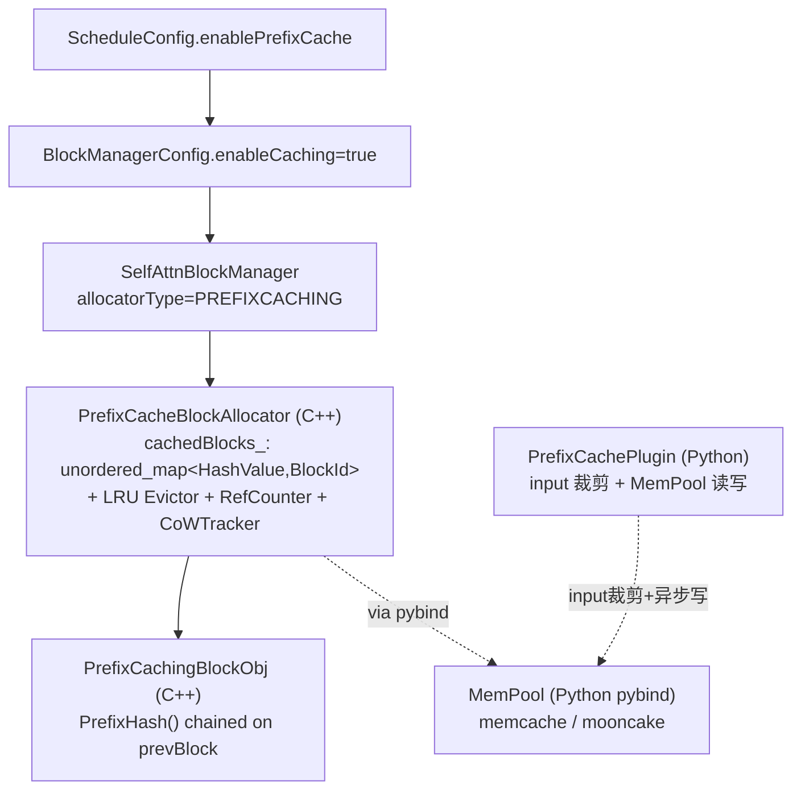
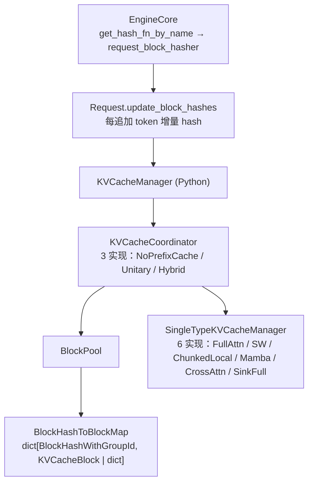
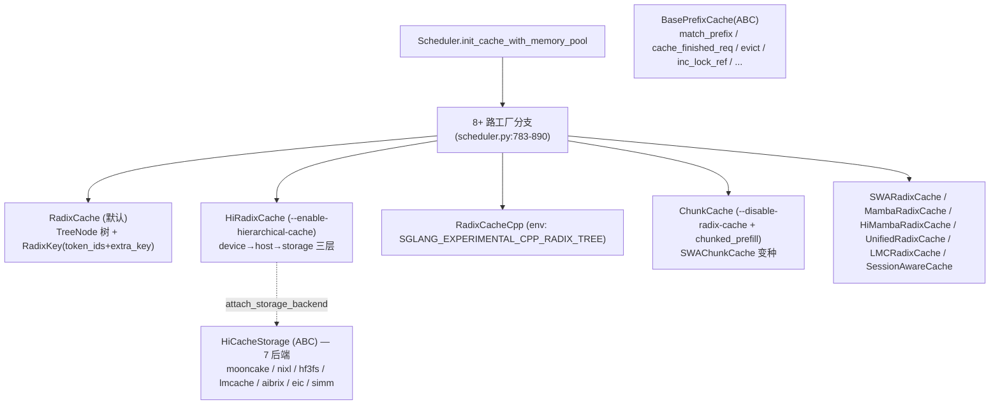

# Cross-project Comparison: Prefix Cache

> 三家 prefix cache 横向对比。覆盖 [§dim-prefix-cache](../dimensions.md) 维度。
> 每 cell 都有具体文件锚点；synthesis 段加 `synthesis:` 前缀，遵循 [AGENTS.md §8](../../AGENTS.md) 对比规则。

## TL;DR （synthesis）

> **三家两派**：
>
> - **hash table 派**：MindIE（C++ `unordered_map<HashValue, BlockId>` + LRU evictor）、vLLM（Python `BlockHashToBlockMap = dict[BlockHashWithGroupId, KVCacheBlock | dict[block_id, KVCacheBlock]]`）。
> - **trie 派**：**SGLang 唯一**——`RadixCache(BasePrefixCache)` 用真正的 radix tree 共享前缀（[radix_cache.py:285](d:\design\sglang\python\sglang\srt\mem_cache\radix_cache.py)）。
>
> **抽象层数**：MindIE 2 段（C++ `PrefixCacheBlockAllocator` + Python `PrefixCachePlugin`）/ vLLM 1 段（全 Python `KVCacheManager`）/ SGLang 1 段（全 Python `BasePrefixCache`，但下挂 4-layer 体系：PrefixCache / Allocator / KVCache pool / HiCacheStorage）。
>
> **默认开**：vLLM `enable_prefix_caching=True`（[config/cache.py:78-79](d:\design\vllm\vllm\config\cache.py)）；SGLang `disable_radix_cache=False`（[server_args.py:618](d:\design\sglang\python\sglang\srt\server_args.py)）；MindIE `enablePrefixCache=false`（[config_info.h:219](d:\design\MindIE-LLM\src\include\config\config_info.h)，需 `plugin_params={plugin_type:prefix_cache}` 显式 opt-in）。
>
> **跨节点 KV 复用**：MindIE 通过 C++→Python pybind 反向调 `MemPool.LookUp`（远端 hash 命中）；vLLM 通过 `KVConnectorBase_V1.get_num_new_matched_tokens`（远端命中协议）；SGLang 通过 `HiRadixCache` + `HiCacheStorage` 7 后端（device → host → 远端三层）。
>
> **跨语言 hash 等价性约束**：**仅 MindIE 有**——C++ `HashCombine` 与 Python `hash_combine` 必须逐位等价（KV pool key 跨进程匹配前提）。vLLM/SGLang 全 Python 单语言无此约束。

## 综合对照 cheat sheet

| 维度 | MindIE | vLLM | SGLang |
|---|---|---|---|
| **数据结构** | `unordered_map<HashValue, BlockId>` (hash table) + LRU `Evictor` ([prefix_cache_block_allocator.h:107-116](d:\design\MindIE-LLM\src\block_manager\prefix_cache_block_allocator.h)) | `BlockHashToBlockMap = dict[BlockHashWithGroupId, KVCacheBlock \| dict[bid, block]]` (hash table) ([block_pool.py:34-128](d:\design\vllm\vllm\v1\core\block_pool.py)) | **`RadixCache` trie**（C++ 加速版 `RadixCacheCpp`）([radix_cache.py:285](d:\design\sglang\python\sglang\srt\mem_cache\radix_cache.py)) |
| **核心实现语言** | C++ + Python（**双段**） | Python（**全 Python**） | Python（默认）/ C++ 可选（`SGLANG_EXPERIMENTAL_CPP_RADIX_TREE` env） |
| **实例化层数** | 2 段：C++ Allocator + Python Plugin | 1 段：`KVCacheManager` → `Coordinator` → `BlockPool` 同进程层叠 | 1 段：`Scheduler.tree_cache: BasePrefixCache` 多态 |
| **抽象基类 / 工厂** | `BlockSpaceManager` 接口（5 枚举、工厂仅产 `SelfAttn` / `LwdSelfAttn`） | `KVCacheCoordinator` **3 实现** + `SingleTypeKVCacheManager` **6 实现** | `BasePrefixCache(ABC)` **8+ 实现**：`RadixCache` / `HiRadixCache` / `RadixCacheCpp` / `SWARadixCache` / `MambaRadixCache` / `HiMambaRadixCache` / `ChunkCache` / `SWAChunkCache` / `LMCRadixCache` / `UnifiedRadixCache` |
| **Hash 算法** | boost-style `HashCombine` 64-bit + Python 端**显式镜像** | `hash_block_tokens(hash_function, parent, tokens, extra_keys)`，**4 种** `sha256` / `sha256_cbor` / `xxhash` / `xxhash_cbor` ([hashing.py:82-100](d:\design\vllm\vllm\utils\hashing.py)) | **无单点 hash**——trie 节点路径分裂 |
| **复用粒度** | 块级（block）；前缀靠 prevBlock 链 | 块级；前缀靠 `parent_block_hash` 链 | **token 级**（trie 节点逐 token 分叉，paged 时按 page 对齐） |
| **Eviction 策略** | LRU `Evictor`（C++ 唯一实现） | LRU 双向链表 `FreeKVCacheBlockQueue` ([kv_cache_utils.py:158-366](d:\design\vllm\vllm\v1\core\kv_cache_utils.py)) | **可配置 3+ 种**（CLI `--radix-eviction-policy ∈ {lru, lfu, slru}`，[server_args.py:206](d:\design\sglang\python\sglang\srt\server_args.py)）；`evict_policy.py` 注册了 7 类 `EvictionStrategy`（LRU / LFU / FIFO / MRU / FILO / Priority / SLRU），可通过 `add_radix_eviction_policy_choices` 扩展 CLI 暴露 |
| **触发开关** | `plugin_params={plugin_type:prefix_cache}` + 强一致映射 `enableCaching` ([scheduler.cpp:52](d:\design\MindIE-LLM\src\scheduler\scheduler.cpp)) | `--enable-prefix-caching` (**默认 True**) + `--prefix-caching-hash-algo` ([config/cache.py:78-95](d:\design\vllm\vllm\config\cache.py)) | `--disable-radix-cache` (反向开关，**默认启用**)；`disable=True` → fallback 到 `ChunkCache`（chunked prefill 时）或纯 allocator 路径 ([scheduler.py:783-823](d:\design\sglang\python\sglang\srt\managers\scheduler.py)) |
| **Hybrid（多 KV 组）** | 单一 `BlockSpaceManager`，hybrid `COMPOSITE` 枚举存在但**未实现** | `HybridKVCacheCoordinator` 显式 fixed-point + LCM 块对齐 ([kv_cache_coordinator.py:368-545](d:\design\vllm\vllm\v1\core\kv_cache_coordinator.py)) | `SWARadixCache` / `MambaRadixCache` / `HiMambaRadixCache` 各自独立 + `hybrid_cache/hybrid_pool_assembler.py` |
| **Spec decode (Eagle/MTP)** | MTP 不与 prefix_cache 互斥（[plugin_utils.py:11](d:\design\MindIE-LLM\mindie_llm\text_generator\plugins\plugin_utils.py)） | `use_eagle=True` 流到 `find_longest_cache_hit`，**主动多丢 1 块** ([single_type_kv_cache_manager.py:458-461](d:\design\vllm\vllm\v1\core\single_type_kv_cache_manager.py)) | `is_eagle` 在 `CacheInitParams` 内传入 ([scheduler.py:801](d:\design\sglang\python\sglang\srt\managers\scheduler.py))；spec_algorithm.is_eagle() |
| **多模态隔离** | `extraHash_` 字段挂在块对象 ([prefix_cache_block.cpp:90-121](d:\design\MindIE-LLM\src\block_manager\prefix_cache_block.cpp)) | `extra_keys` 拼 `(mm_identifier, offset)` ([kv_cache_utils.py:389-453](d:\design\vllm\vllm\v1\core\kv_cache_utils.py)) | `RadixKey.extra_key: Optional[str]` ([radix_cache.py:71-98](d:\design\sglang\python\sglang\srt\mem_cache\radix_cache.py)) |
| **多租户隔离** | 暂无 `cache_salt` 等价物 | `cache_salt` 仅首块进入 `extra_keys` ([kv_cache_utils.py:518-520](d:\design\vllm\vllm\v1\core\kv_cache_utils.py)) | `RadixKey.extra_key`（注释明示用于 LoRA / cache version 隔离） |
| **多层存储** | `MemPool` 2 后端（memcache / mooncake），叠加 prefix cache 强制 | `BlockHashToBlockMap` mirror 到 CPU ([simple_kv_offload/manager.py:222-641](d:\design\vllm\vllm\v1\simple_kv_offload\manager.py))；`SimpleCpuOffloadConnector.__init__` 强制 `enable_prefix_caching=True` ([simple_cpu_offload_connector.py:56, 82-86](d:\design\vllm\vllm\distributed\kv_transfer\kv_connector\v1\simple_cpu_offload_connector.py)) | **HiCache 一等公民**：`HiRadixCache` + `HiCacheStorage` **7 后端** + `--hicache-write-policy ∈ {write_back, write_through, write_through_selective}` ([server_args.py:570, 5510-5514](d:\design\sglang\python\sglang\srt\server_args.py))；`--enable-hierarchical-cache` 与 `--disable-radix-cache` 互斥 ([server_args.py:3714-3716](d:\design\sglang\python\sglang\srt\server_args.py)) |
| **PD 远端命中协议** | C++→Python pybind `MemPool.LookUp` ([self_attn_block_manager.cpp:55-61, 373-405](d:\design\MindIE-LLM\src\block_manager\self_attn_block_manager.cpp))；调度器 `GetRemoteComputedBlockIds` | `KVConnectorBase_V1.get_num_new_matched_tokens(req, num_local)` ([base.py:449-482](d:\design\vllm\vllm\distributed\kv_transfer\kv_connector\v1\base.py))；返回 `None` 表示挂回 skipped 队列 | `HiRadixCache.prefetch_from_storage(...)` ([hiradix_cache.py:1245](d:\design\sglang\python\sglang\srt\mem_cache\hiradix_cache.py)) + storage 后端（mooncake_store / nixl 等） |
| **跨语言 hash 等价约束** | ✅ **必须** C++↔Python 逐位等价 | ❌ 全 Python 无约束 | ❌ 全 Python 无约束（C++ radix_tree 经 capsule binding，无独立 hash 算法） |
| **Async 写回** | `mempool_type ∈ {DISABLED, SYNC_WRITE, ASYNC_WRITE}` + 后台 daemon `_put_prefix_kvcache_thread` ([prefix_cache_plugin.py:391-409](d:\design\MindIE-LLM\mindie_llm\text_generator\plugins\prefix_cache\prefix_cache_plugin.py)) | `delay_cache_blocks` 标志推迟 cache_blocks（P/D 异步拉 KV 时跳过）([kv_cache_manager.py:413-414](d:\design\vllm\vllm\v1\core\kv_cache_manager.py)) | `HiRadixCache.write_backup` / `write_backup_storage` + write-through ack queue ([hiradix_cache.py:652-685](d:\design\sglang\python\sglang\srt\mem_cache\hiradix_cache.py)) |
| **KV cache events** | `GetPrefixCacheHitRate()` 标量 + `BlockSpaceManager` 内部统计 | `BlockStored` / `BlockRemoved` / `AllBlocksCleared` 三事件 + `take_events()` ([block_pool.py:499-509](d:\design\vllm\vllm\v1\core\block_pool.py)) + `VLLM_KV_EVENTS_USE_INT_BLOCK_HASHES` env | `enable_kv_cache_events` flag + `take_events()` + `check_hicache_events()` ([base_prefix_cache.py:242-256](d:\design\sglang\python\sglang\srt\mem_cache\base_prefix_cache.py)) |
| **Reset API** | `BlockSpaceManager::ResetPrefixCache`（**仅在所有块空闲时**重建 ([prefix_cache_block_allocator.cpp:447-466](d:\design\MindIE-LLM\src\block_manager\prefix_cache_block_allocator.cpp))） | `KVCacheManager.reset_prefix_cache()` + `Scheduler.reset_prefix_cache(reset_running_requests=True)` 强抢占 ([sched/scheduler.py:1867-1925](d:\design\vllm\vllm\v1\core\sched\scheduler.py)) | `BasePrefixCache.evict(...)` + RLHF 用 `flush_cache.py` 工具 ([mem_cache/flush_cache.py](d:\design\sglang\python\sglang\srt\mem_cache\flush_cache.py)) |

---

## 1. 数据结构与抽象

### MindIE — C++ hash table + Python 插件双段

| 字段 | 锚点 |
|---|---|
| `cachedBlocks_` | [prefix_cache_block_allocator.h:116](d:\design\MindIE-LLM\src\block_manager\prefix_cache_block_allocator.h) |
| `evictor_`（LRU） | [prefix_cache_block_allocator.cpp:38-41](d:\design\MindIE-LLM\src\block_manager\prefix_cache_block_allocator.cpp) |
| 工厂 PREFIXCACHING / HASHLESS 二选 | [self_attn_block_manager.cpp:43-63](d:\design\MindIE-LLM\src\block_manager\self_attn_block_manager.cpp) |
| Python 插件入口 | [prefix_cache_plugin.py:51-409](d:\design\MindIE-LLM\mindie_llm\text_generator\plugins\prefix_cache\prefix_cache_plugin.py) |

详见 `mindie/topics/prefix-cache.md#c-块层hash-table--lru不是-trie`（已删）。

### vLLM — 全 Python hash table 一段

| 字段 | 锚点 |
|---|---|
| `BlockHashToBlockMap` | [block_pool.py:34-128](d:\design\vllm\vllm\v1\core\block_pool.py) |
| `KVCacheCoordinator` 3 实现 | [kv_cache_coordinator.py:256-545](d:\design\vllm\vllm\v1\core\kv_cache_coordinator.py) |
| `SingleTypeKVCacheManager` 6 实现 | [single_type_kv_cache_manager.py:420-1124](d:\design\vllm\vllm\v1\core\single_type_kv_cache_manager.py) |
| `hash_block_tokens` | [kv_cache_utils.py:535-562](d:\design\vllm\vllm\v1\core\kv_cache_utils.py) |
| `EngineCore` 启动构造 hasher | [engine/core.py:201-210](d:\design\vllm\vllm\v1\engine\core.py) |

详见 [vllm/topics/prefix-cache.md §数据结构](../../vllm/topics/prefix-cache.md#数据结构)。

### SGLang — 全 Python radix tree（trie）

工厂分支按以下优先级路由（[scheduler.py:783-890](d:\design\sglang\python\sglang\srt\managers\scheduler.py)）：

1. `disable_radix_cache + chunked_prefill_size 非空` → `ChunkCache` / `SWAChunkCache`
2. `SGLANG_EXPERIMENTAL_CPP_RADIX_TREE` env → `RadixCacheCpp`
3. `enable_hierarchical_cache` → `HiMambaRadixCache`（hybrid SSM）/ `HiRadixCache`
4. `SGLANG_ENABLE_UNIFIED_RADIX_TREE` env → `UnifiedRadixCache`
5. `is_hybrid_swa` → `SWARadixCache`
6. `is_hybrid_ssm` → `MambaRadixCache`
7. `enable_lmcache` → `LMCRadixCache`
8. **default** → `RadixCache`
9. `enable_streaming_session` → 把上面的 `tree_cache` **再包一层** `SessionAwareCache`

详见 [sglang/modules/mem_cache.md §RadixCache](../../sglang/modules/mem_cache.md#radixcache-radix_cachepy285-896)。

> synthesis: **SGLang 是三家中实现选择最丰富的**——单 `init_cache_with_memory_pool` 函数中**8+ 路工厂分支**对应 8+ 种 `BasePrefixCache` 实现，全在同一接口下多态切换。MindIE 工厂仅 `PREFIXCACHING` / `HASHLESS` 两选；vLLM 则是单一 `KVCacheManager` + 内部 `Coordinator` 3 选。**这种"接口分支爆炸"是 SGLang 把 prefix cache 当成"前端核心抽象"而非"后端实现细节"的设计结果**。

---

## 2. Hash 算法对比

| 维度 | MindIE | vLLM | SGLang |
|---|---|---|---|
| 算法 | boost-style `HashCombine`（XOR + 黄金比例 magic + 移位） | 4 种可插拔：`sha256`/`sha256_cbor`/`xxhash`/`xxhash_cbor` ([hashing.py:82-100](d:\design\vllm\vllm\utils\hashing.py)) | **无单点 hash**——trie 比较直接走 token id 序列 |
| Hash 形态 | 64-bit `HashValue`（uint64） | `BlockHash = NewType("BlockHash", bytes)` 直接 `bytes` ([kv_cache_utils.py:36](d:\design\vllm\vllm\v1\core\kv_cache_utils.py)) | N/A（树节点 key 是 `RadixKey(token_ids, extra_key)`） |
| 链式组合 | `seed = HashCombine(prev->PrefixHash())` + 逐 token + `extraHash_` ([prefix_cache_block.cpp:101-118](d:\design\MindIE-LLM\src\block_manager\prefix_cache_block.cpp)) | `hash_function((parent_block_hash, tokens_tuple, extra_keys))` ([kv_cache_utils.py:535-562](d:\design\vllm\vllm\v1\core\kv_cache_utils.py)) | 无（trie 沿路径分裂） |
| 触发时机 | 块**写满**且最后 token 不是 placeholder（spec decode 中间状态不进 cache）([prefix_cache_block.cpp:75-88](d:\design\MindIE-LLM\src\block_manager\prefix_cache_block.cpp)) | `Request.update_block_hashes` 每追加 token 增量算 ([request.py:162-216](d:\design\vllm\vllm\v1\request.py)) | `cache_finished_req` / `cache_unfinished_req` 时插入 ([radix_cache.py:463-574](d:\design\sglang\python\sglang\srt\mem_cache\radix_cache.py)) |
| 跨语言对齐成本 | ✅ **必须**——Python `hash_combine` 显式注释 `Simulate the default hash algorithm in C++`（[prefix_cache_plugin.py:30-48](d:\design\MindIE-LLM\mindie_llm\text_generator\plugins\prefix_cache\prefix_cache_plugin.py)） | ❌ 单 Python 进程内一致 | ❌ 单 Python 进程内一致；C++ radix_tree 用 capsule binding 共享内存数据，不重算 hash |
| 跨进程 hash 一致性 | C++↔Python pybind 跨语言保 KV pool key 跨节点匹配 | sha256/xxhash 自带稳定性；CBOR 系列在未设 `PYTHONHASHSEED` 时 warn ([kv_cache_utils.py:91-106](d:\design\vllm\vllm\v1\core\kv_cache_utils.py)) | 无跨进程 hash 概念（trie 节点不在跨进程协议里） |

> synthesis: **Hash 算法的多样性反映了"跨语言 / 跨进程是否是设计约束"**：
>
> - vLLM 4 种 hash function 是为了让 KV events 消费者（独立进程）能选**与自己框架一致**的算法（如 ML 服务用 sha256，trading 系统用 xxhash 求性能）。
> - MindIE 锁死 boost-style hash 是因为 C++ 块管理与 Python 插件**必须**用同一个 hash，任何切换都要双侧同改。
> - SGLang 无单点 hash 是 trie 选择的天然结果——比较 token id 序列足够；唯一成本是 `RadixKey.__getitem__` 时要拷贝 token 列表。
>
> **跨进程 KV 复用的 hash 一致性问题，仅在 hash table 派 + 多进程 / 多语言时存在**——SGLang `HiRadixCache` 的 device → host → storage 复用走的是 trie 节点直接 mirror（不算 hash），所以也免于这个问题。

---

## 3. 命中查询 API 对照（核心方法）

| 操作 | MindIE | vLLM | SGLang |
|---|---|---|---|
| **本地最长公共前缀** | `BlockSpaceManager::GetCommonComputedBlockIds(seqs)` ([prefix_cache_block_allocator.cpp:332-361](d:\design\MindIE-LLM\src\block_manager\prefix_cache_block_allocator.cpp)) | `KVCacheManager.get_computed_blocks(request)` → `Coordinator.find_longest_cache_hit(block_hashes, max_length)` ([kv_cache_manager.py:176-216](d:\design\vllm\vllm\v1\core\kv_cache_manager.py)) | `RadixCache.match_prefix(MatchPrefixParams)` → `MatchResult` ([radix_cache.py:374-445](d:\design\sglang\python\sglang\srt\mem_cache\radix_cache.py)) |
| **远端命中（PD 跨节点）** | `GetRemoteComputedBlockIds(seqs, computedLens, tpSize, modelName)` → `MemPool.LookUp` 反向 pybind ([self_attn_block_manager.cpp:373-405](d:\design\MindIE-LLM\src\block_manager\self_attn_block_manager.cpp)) | `KVConnectorBase_V1.get_num_new_matched_tokens(req, num_local)` → `(ext_tokens, load_kv_async)` ([base.py:449-482](d:\design\vllm\vllm\distributed\kv_transfer\kv_connector\v1\base.py)) | `HiRadixCache.prefetch_from_storage(...)` + `check_prefetch_progress(req_id)` ([hiradix_cache.py:1127, 1245](d:\design\sglang\python\sglang\srt\mem_cache\hiradix_cache.py)) |
| **写回 / promote** | `PromoteToImmutableBlock` ([prefix_cache_block_allocator.cpp:263-287](d:\design\MindIE-LLM\src\block_manager\prefix_cache_block_allocator.cpp)) + `MarkBlocksAsComputed`（每轮调度末尾，[scheduler.cpp:341-342](d:\design\MindIE-LLM\src\scheduler\scheduler.cpp)） | `BlockPool.cache_full_blocks(request, blocks, num_cached, num_full, block_size, group_id)` ([block_pool.py:211-320](d:\design\vllm\vllm\v1\core\block_pool.py)) | `RadixCache.cache_finished_req(req, is_insert=True)` / `cache_unfinished_req(req, chunked)` ([radix_cache.py:463-574](d:\design\sglang\python\sglang\srt\mem_cache\radix_cache.py)) |
| **引用计数** | `RefCounter.Increase` / `Decrease`（[prefix_cache_block_allocator.cpp:32-35, 234-261](d:\design\MindIE-LLM\src\block_manager\prefix_cache_block_allocator.cpp)） | `BlockPool.touch(blocks)` ref+1 / `free_blocks(ordered)` ref-1 ([block_pool.py:391-422](d:\design\vllm\vllm\v1\core\block_pool.py)) | `inc_lock_ref(node)` / `dec_lock_ref(...)` ([radix_cache.py:611-646](d:\design\sglang\python\sglang\srt\mem_cache\radix_cache.py)) |
| **Eviction** | `MayBeAllocateEvictedBlockId` 调 `Evictor.Evict()`（[prefix_cache_block_allocator.cpp:122-146](d:\design\MindIE-LLM\src\block_manager\prefix_cache_block_allocator.cpp)） | `BlockPool.get_new_blocks(N)` 内自动 `_maybe_evict_cached_block` ([block_pool.py:354-389](d:\design\vllm\vllm\v1\core\block_pool.py)) | `evict(EvictParams)` 按策略 ([radix_cache.py:582-610](d:\design\sglang\python\sglang\srt\mem_cache\radix_cache.py)) |
| **Reset** | `ResetPrefixCache`（**仅所有块空闲时**重建，[prefix_cache_block_allocator.cpp:447-466](d:\design\MindIE-LLM\src\block_manager\prefix_cache_block_allocator.cpp)） | `KVCacheManager.reset_prefix_cache()` + `Scheduler.reset_prefix_cache(reset_running_requests=True)` 强抢占 ([sched/scheduler.py:1867-1925](d:\design\vllm\vllm\v1\core\sched\scheduler.py)) | `flush_cache.py` 工具 + `BasePrefixCache.evict(EvictParams(force=True))` |
| **能力查询** | `BlockSpaceManager::GetPrefixCacheHitRate()` 标量 | `KVCacheManager.prefix_cache_stats` (本地) + `connector_prefix_cache_stats` (远端) ([sched/scheduler.py:121-133](d:\design\vllm\vllm\v1\core\sched\scheduler.py)) | `supports_swa() / supports_mamba() / is_chunk_cache() / is_tree_cache()` ([base_prefix_cache.py:259-268](d:\design\sglang\python\sglang\srt\mem_cache\base_prefix_cache.py)) |

> synthesis: **API 命名虽不同，三家的"5 元操作"语义一致**——查命中 / 写回 / 引计数 / 驱逐 / 重置。**命名陷阱**：
>
> - MindIE `MarkBlocksAsComputed` 与 vLLM `cache_full_blocks` 是**不同时机**：MindIE 在每轮 schedule 末尾**全局**调一次，本轮新块下一轮才算命中（避免本轮内重复命中自己）；vLLM 在 `allocate_slots` 内**逐请求**调，块写满当时即可命中。
> - SGLang `cache_finished_req` 仅在请求结束才插入；`cache_unfinished_req` 才是 chunked prefill / 流式场景的对应——**SGLang 是三家中唯一显式区分"完成 / 未完成"插入语义**的。

---

## 4. Eviction 策略

| 项目 | 默认 | 可配置 | 实现位置 |
|---|---|---|---|
| MindIE | LRU | ❌（C++ `MakeEvictor(EvictionPolicy::LRU)` 写死） | [prefix_cache_block_allocator.cpp:38-41](d:\design\MindIE-LLM\src\block_manager\prefix_cache_block_allocator.cpp) |
| vLLM | LRU | ❌（双向链表 `FreeKVCacheBlockQueue` 单实现） | [kv_cache_utils.py:158-366](d:\design\vllm\vllm\v1\core\kv_cache_utils.py) |
| SGLang | LRU | ✅ **CLI 默认 3 选**：`{lru, lfu, slru}`（[server_args.py:206](d:\design\sglang\python\sglang\srt\server_args.py)）；`evict_policy.py` 注册 7 类 `EvictionStrategy`（LRU / LFU / FIFO / MRU / FILO / Priority / SLRU），可通过 `add_radix_eviction_policy_choices` 扩展 CLI 暴露 | [evict_policy.py](d:\design\sglang\python\sglang\srt\mem_cache\evict_policy.py)，[radix_cache.py:313-326](d:\design\sglang\python\sglang\srt\mem_cache\radix_cache.py) |

> synthesis: **SGLang 是唯一真正 pluggable eviction policy 的家**——配合 trie 数据结构（节点存 `priority` / `lock_ref` / `last_access_time`），策略层换插件不影响 cache 主体。MindIE / vLLM 的 LRU 是**结构性绑定**：MindIE 的 `Evictor` 接口存在，但工厂仅产 LRU；vLLM 的 LRU 直接是 `FreeKVCacheBlockQueue` 双向链表本身，"换策略 = 换数据结构"。**生产负载 = 长时驻留热请求 + 偶发冷请求**时 SGLang 的 LFU / Priority 比 LRU 更友好。

---

## 5. 多 Attention 类型 / Hybrid 模型支持

| 维度 | MindIE | vLLM | SGLang |
|---|---|---|---|
| 多 attention 类型 | `BlockManagerType` 5 枚举槽位（工厂仅产 2 种）+ `KvCacheType` 3 种 | `KVCacheSpec` 11+ 子类 + `SingleTypeKVCacheManager` 6 实现 | `MHATokenToKVPool` / `MLATokenToKVPool` / `NSATokenToKVPool` / `HybridLinearKVPool` / `DoubleSparseTokenToKVPool` / `MambaPool` 独立 class |
| Hybrid（多 KV 组）prefix cache | `COMPOSITEBLOCKMANAGER` 枚举存在但**类未实现**（`subManagers` 字段保留 future use） | **`HybridKVCacheCoordinator`** 显式 fixed-point 算法 + LCM 块对齐 + FullAttn 优先扫 ([kv_cache_coordinator.py:368-545](d:\design\vllm\vllm\v1\core\kv_cache_coordinator.py)) | `HiMambaRadixCache` / `MambaRadixCache` / `SWARadixCache` / `UnifiedRadixCache` 各自独立 + `hybrid_cache/hybrid_pool_assembler.py` |
| Sliding window prefix cache | `KvCacheType::SLIDING_WINDOW` + `REQUESTSLIDINGWINDOWBLOCKMANAGER` | `SlidingWindowManager.find_longest_cache_hit`：**从右到左扫**，找连续命中，左侧填 `null_block` ([single_type_kv_cache_manager.py:481-617](d:\design\vllm\vllm\v1\core\single_type_kv_cache_manager.py)) | `SWARadixCache` + `swa_memory_pool.py` |
| Mamba prefix cache | N/A（无独立实现） | `MambaManager`：从右到左找最后一个 hit，前面填 null ([single_type_kv_cache_manager.py:770-1041](d:\design\vllm\vllm\v1\core\single_type_kv_cache_manager.py)) | `MambaRadixCache` / `HiMambaRadixCache` / `MambaPool.State` 嵌套（含 `SpeculativeState`） |
| Cross attention prefix cache | N/A | ❌ `CrossAttentionManager.find_longest_cache_hit` `raise NotImplementedError` ([single_type_kv_cache_manager.py:1067-1089](d:\design\vllm\vllm\v1\core\single_type_kv_cache_manager.py)) | N/A（独立 KV pool 不在 prefix cache 路径上） |

> synthesis: **Hybrid 模型的 prefix cache 实现哲学**：
>
> - **vLLM 单一抽象 + 多态扫**：`HybridKVCacheCoordinator` 把多种 attention 视为"多个 KV 组"，统一用 fixed-point 收敛算法找公共最长命中；FullAttn 排第一以提供更紧上界。**适合"少数标准模型"场景**（Gemma3 5:1 sw:full、LLaMA4 3:1 local:full）。
> - **SGLang 多实现并存**：`SWARadixCache` / `MambaRadixCache` / `HiMambaRadixCache` 各自独立实现 prefix 语义，互不干扰。**适合"多种新型模型并行支持"场景**（Mamba2 / linear attention / NSA 等）。
> - **MindIE 占位但未实现**：`COMPOSITEBLOCKMANAGER` 枚举存在，但 `subManagers` 字段保留为 future use（详 `BlockSpaceManager.md`（已删））；当前实战靠**单一 BlockManager 类型 + 配置层选择**。
>
> 当上游模型加新 attention 类型（如 RWKV / Linear Attention 变体）：vLLM 加新 `KVCacheSpec` 子类（轻量），SGLang 加新 `BasePrefixCache` 子类（中量但隔离），MindIE 改 C++ enum + 写新 `BlockSpaceManager` 实现（重量）。

---

## 6. 多层存储 / KV connector / HiCache

| 维度 | MindIE | vLLM | SGLang |
|---|---|---|---|
| 抽象 | `MemPool`（Python pybind 反向调用） | `KVConnectorBase_V1`（[base.py](d:\design\vllm\vllm\distributed\kv_transfer\kv_connector\v1\base.py)）+ `BlockHashToBlockMap` mirror | `HiCacheStorage(ABC)` + `HiRadixCache` 集成 |
| 后端数 | **2**：memcache / mooncake | **14 个 v1 backend**（NIXL / Mooncake / MoRIIO / LMCache×3 / HF3FS / P2pNccl / Offloading / SimpleCPUOffload / MultiConnector / FlexKV / DecodeBench / Example×2，详 [vllm/topics/kv-connector.md](../../vllm/topics/kv-connector.md)） | **7 个**：mooncake_store / nixl / hf3fs / lmcache / aibrix_kvcache / eic / simm |
| 写策略 | `mempool_type ∈ {DISABLED, SYNC_WRITE, ASYNC_WRITE}` + 后台 daemon 线程 | `delay_cache_blocks` 标志（P/D 异步拉 KV 时跳过 cache_blocks） | `--hicache-write-policy ∈ {write_back, write_through, write_through_selective}` ([server_args.py:570](d:\design\sglang\python\sglang\srt\server_args.py)) |
| 与 prefix cache 关系 | ✅ **强制叠加**：[`docs/zh/user_guide/feature/kv_cache_pool.md`](d:\design\MindIE-LLM\docs\zh\user_guide\feature\kv_cache_pool.md) 明示 KV pool 必须叠加 prefix cache | ✅ **`SimpleCpuOffloadConnector` 强制 `enable_prefix_caching=True`** ([simple_cpu_offload_connector.py:56](d:\design\vllm\vllm\distributed\kv_transfer\kv_connector\v1\simple_cpu_offload_connector.py))；其余 connector 在 `enable_prefix_caching=False` 时也强制启用 hash 计算（[engine/core.py:201-210](d:\design\vllm\vllm\v1\engine\core.py)） | ✅ `--enable-hierarchical-cache` 与 `--disable-radix-cache` **互斥** ([server_args.py:3714-3716](d:\design\sglang\python\sglang\srt\server_args.py)) |
| 三层（device → host → storage） | ❌（仅 device + remote pool） | ❌（device + 单层 CPU offload） | ✅ **唯一三层**：`HiRadixCache.evict_host` / `load_back` / `prefetch_from_storage` ([hiradix_cache.py:905, 940, 1245](d:\design\sglang\python\sglang\srt\mem_cache\hiradix_cache.py)) |
| Hash 共享 | C++ 块 hash → Python `MemPool.LookUp` 跨语言 key 拼接 `<hash>_<tp>_<size>_<model>` | `BlockHashToBlockMap` 直接 mirror 到 CPU pool（[simple_kv_offload/manager.py:222-641](d:\design\vllm\vllm\v1\simple_kv_offload\manager.py)） | trie 节点 hash_value 字段 + storage backend 各自定义 key 格式 |

> synthesis: **多层存储的设计差异 = 复杂度 vs 实操**：
>
> - **vLLM connector 抽象 14 backend** 是开放生态——任何上游 vendor 可贡献新 connector（NIXL / Mooncake / LMCache 等都是社区贡献）；prefix cache hash 表直接被 connector mirror 复用，**0 跨语言成本**。
> - **SGLang HiCache 7 后端 + 3 写策略 + write-back ack 机制**是**最贴近"多层 KV 存储"传统数据库语义**的设计——device 即"buffer pool"、host 即"L2"、远端 storage 即"持久化"。`HiRadixCache.prefetch_from_storage` + `check_prefetch_progress` 提供异步预取语义，是 vLLM / MindIE 都缺的。
> - **MindIE MemPool 2 后端（memcache + mooncake）**是**最简的实现**——只解决"PD 两节点之间共享 KV"问题，没有"多级 cache 层级"概念。优势是 C++ Allocator 与 Python MemPool 紧耦合带来的性能可预测；劣势是"CPU offload 一阶+持久化二阶"等场景需要在 plugin 层手动拼。

---

## 7. 配置开关与默认值

| 项目 | 主开关 | 默认 | 反向 / 互斥 |
|---|---|---|---|
| MindIE | `EngineConfig.enablePrefixCache` ([config_info.h:219](d:\design\MindIE-LLM\src\include\config\config_info.h)) + `plugin_params={plugin_type:prefix_cache}` | **`false`**（需 opt-in） | 与 Multi-LoRA 互斥；不支持 `prefix cache + CP + SP + function call(multiturn)` 叠加（仅文档级，[plugin_utils.py:81-84](d:\design\MindIE-LLM\mindie_llm\text_generator\plugins\plugin_utils.py) `validation_func: lambda data: True`，无运行时阻断） |
| vLLM | `CacheConfig.enable_prefix_caching: bool` ([config/cache.py:78-79](d:\design\vllm\vllm\config\cache.py)) | **`True`**（默认开） | 不与 cross attention 兼容；与 hash algo `prefix_caching_hash_algo` 配合（4 种）；启 KV connector 时**强制**算 hash（即便 `enable_prefix_caching=False`） |
| SGLang | `--disable-radix-cache` (反向) ([server_args.py:618](d:\design\sglang\python\sglang\srt\server_args.py)) | **`False`**（即 radix cache 默认开） | 与 `--enable-hierarchical-cache` 互斥；多模态 + Transformers backend 时**强制 disable** ([scheduler.py:783-790](d:\design\sglang\python\sglang\srt\managers\scheduler.py))；mamba `enable_mamba_extra_buffer` + overlap 调度组合时多处 auto-disable |

| 维度 | MindIE | vLLM | SGLang |
|---|---|---|---|
| `compute_hash` 影响编译图 | 影响 C++ scheduler 路径 | ❌ `enable_prefix_caching` / `prefix_caching_hash_algo` 列入 `ignored_factors` ([config/cache.py:179-196](d:\design\vllm\vllm\config\cache.py))，**热切换不重编译** | radix cache 切换不影响 cudagraph capture（`tree_cache` 在 `init_cache_with_memory_pool` 内的工厂分支） |
| Auto-disable 条件 | 无（强 opt-in） | 1 处显式（pooling models 走 `request.skip_reading_prefix_cache`，[kv_cache_manager.py:188-193](d:\design\vllm\vllm\v1\core\kv_cache_manager.py)） | **多处自动**（[scheduler.py:786-790](d:\design\sglang\python\sglang\srt\managers\scheduler.py)、[server_args.py:2256, 2308, 2427, 2571, 3538, 3809](d:\design\sglang\python\sglang\srt\server_args.py)）：multimodal+Transformers / mamba+overlap+特定组合 / `--enable-streaming-session` 部分场景 |

> synthesis: **默认值反映了"开发者心智模型"**：
>
> - vLLM **默认开** + 文档建议保持开 + 自夸"APC 不会降低性能"（[docs/features/automatic_prefix_caching.md:25](d:\design\vllm\docs\features\automatic_prefix_caching.md)）—— **认为 prefix cache 是 LLM serving 的必备特性**。
> - SGLang **默认开（反向 `--disable`）** + 多处 auto-disable —— **认为 prefix cache 是默认行为，但承认有真实不兼容场景**。
> - MindIE **默认关** + 用户须显式 opt-in `plugin_params` —— **保守**，与"plugin 体系"哲学一致（其它 la / mtp / memory_decoding plugin 也都是 opt-in）。

---

## 8. 兼容性矩阵

| 特性 | MindIE | vLLM | SGLang |
|---|---|---|---|
| **Spec decode (Eagle)** | ✅ 不互斥（[plugin_utils.py:11](d:\design\MindIE-LLM\mindie_llm\text_generator\plugins\plugin_utils.py)；MTP 不在 ASYNC_INFERENCE_UNSUPPORTED_OPTIONS） | ✅ `use_eagle=True` 多丢 1 块（[single_type_kv_cache_manager.py:458-461](d:\design\vllm\vllm\v1\core\single_type_kv_cache_manager.py)） | ✅ `is_eagle` 通过 `CacheInitParams` 传入 ([scheduler.py:801](d:\design\sglang\python\sglang\srt\managers\scheduler.py)) |
| **Chunked prefill** | ✅ 与 splitfuse 共存（被切的第 2、3、… 块**不再生效 computed_blocks**，[prefix_cache_preprocess.py:88-90](d:\design\MindIE-LLM\mindie_llm\text_generator\plugins\prefix_cache\prefix_cache_preprocess.py)） | ✅ 透明：每个 chunk 内 `cache_blocks` 都做一次 | ✅ disable_radix_cache + chunked_prefill → fallback 到 `ChunkCache` ([scheduler.py:819-827](d:\design\sglang\python\sglang\srt\managers\scheduler.py)) |
| **Hybrid 模型** | ❌ `COMPOSITE` 枚举存在但未实现 | ✅ `HybridKVCacheCoordinator` ([kv_cache_coordinator.py:368-545](d:\design\vllm\vllm\v1\core\kv_cache_coordinator.py)) | ✅ `SWARadixCache` / `MambaRadixCache` / `HiMambaRadixCache` |
| **MLA** | ✅ MLA 走 `BlockSpaceManager` 通用路径 | ✅ `MLAAttentionSpec → FullAttentionManager` ([single_type_kv_cache_manager.py:1119](d:\design\vllm\vllm\v1\core\single_type_kv_cache_manager.py)) | ✅ `MLATokenToKVPool` |
| **Sliding window** | ✅ `KvCacheType::SLIDING_WINDOW` | ✅ `SlidingWindowManager`（独立算法） | ✅ `SWARadixCache` + `swa_memory_pool.py` |
| **Mamba** | N/A | ✅ `MambaManager` 仅末尾状态 | ✅ `MambaRadixCache` / `HiMambaRadixCache` |
| **Cross attention** | N/A | ❌ `CrossAttentionManager.find_longest_cache_hit` raise NotImplementedError | N/A |
| **LoRA** | ❌ 文档明示与 Multi-LoRA 互斥（[docs:21](d:\design\MindIE-LLM\docs\zh\user_guide\feature\prefix_cache.md)） | ✅ extra_keys 加入 `lora_name` 隔离（[kv_cache_utils.py:456-468](d:\design\vllm\vllm\v1\core\kv_cache_utils.py)） | ✅ `RadixKey.extra_key` 隔离 |
| **多模态隔离** | `extraHash_` 字段 | ✅ extra_keys 加入 `(mm_identifier, offset)` ([kv_cache_utils.py:389-453](d:\design\vllm\vllm\v1\core\kv_cache_utils.py)) | ✅ `RadixKey.extra_key` + `multimodal_cache.py`；多模态 + Transformers backend **强制 disable** |
| **Cache salt 多租户** | ❌（无对应字段） | ✅ `cache_salt` 仅首块加入 extra_keys ([kv_cache_utils.py:518-520](d:\design\vllm\vllm\v1\core\kv_cache_utils.py)) | ✅ `RadixKey.extra_key`（注释明示用于 cache version 隔离） |
| **Prompt embeds** | N/A | ✅ extra_keys 加入 sha256(embeds) ([kv_cache_utils.py:471-494](d:\design\vllm\vllm\v1\core\kv_cache_utils.py)) | N/A |
| **CP / SP** | ❌ 文档明示 `prefix cache + CP + SP + function call(multiturn)` 不可叠加 | ✅ DCP / PCP 时 `block_size *= dcp_world_size * pcp_world_size`，但仅 `UnitaryKVCacheCoordinator`；hybrid 显式 `assert dcp==1, pcp==1` | ✅ `attn_cp_rank` / `attn_cp_size` 通过 `CacheInitParams` 传入 ([scheduler.py:813-814](d:\design\sglang\python\sglang\srt\managers\scheduler.py)) |
| **Async / overlap 调度** | ✅ 不互斥（[plugin_utils.py:11](d:\design\MindIE-LLM\mindie_llm\text_generator\plugins\plugin_utils.py) prefix_cache **不在** `ASYNC_INFERENCE_UNSUPPORTED_OPTIONS`） | ✅ `AsyncScheduler` 路径无关；`delay_cache_blocks` 标志处理 P/D 异步 | ✅ event_loop_overlap 路径默认；`disable_radix_cache=True` 时 overlap 仍可用 |
| **PD 分离** | ✅ 一等公民：`GetRemoteComputedBlockIds` + `MemPool` 跨节点（仅 P 端开 prefix cache 主索引，KV pool 两端都开） | ✅ KV connector 体系 + scheduler 内 `_update_waiting_for_remote_kv` | ✅ `HiRadixCache.prefetch_from_storage` + `disaggregation` 模块 |

---

## 9. 跨语言绑定 / KV pool 跨进程语义

| 维度 | MindIE | vLLM | SGLang |
|---|---|---|---|
| 是否有 C++↔Python pybind | ✅ **有**：`SelfAttnBlockManager` 内 `py::module_::import("mindie_llm.text_generator.mempool").attr("MemPool")` ([self_attn_block_manager.cpp:55-61](d:\design\MindIE-LLM\src\block_manager\self_attn_block_manager.cpp)) | ❌ vLLM csrc/ 树 grep `prefix_cache\|PrefixCache\|cached_block_hash\|BlockHash\|hash_block_tokens` **0 命中** | ❌ Python 默认；C++ radix tree 通过 capsule binding（`radix_cache_cpp.py`），不涉及 hash 跨语言 |
| 跨语言 hash 一致性约束 | ✅ **必须**：Python `hash_combine` 必须与 C++ `HashCombine` 逐位等价 | N/A（单语言） | N/A（trie 结构不依赖 hash 算法） |
| KV pool 远端 key 拼接 | `<hash>_<tpRank>_<tpSize>_<modelName>`（C++ + Python 同格式，[prefix_cache_plugin.py:237-244](d:\design\MindIE-LLM\mindie_llm\text_generator\plugins\prefix_cache\prefix_cache_plugin.py) + [self_attn_block_manager.cpp:373-405](d:\design\MindIE-LLM\src\block_manager\self_attn_block_manager.cpp)） | KV connector 各 backend 自定义 key 格式（NIXL / Mooncake / LMCache 等） | HiCacheStorage 各后端自定义 |
| C++ 实体被 Python 直接 import | `PrefixCacheBlockAllocator` / `PrefixCachingBlockObj` 在 `mindie_llm/` Python 全树 grep **0 命中** | N/A | `RadixCacheCpp` import C++ 库经 capsule（[radix_cache_cpp.py](d:\design\sglang\python\sglang\srt\mem_cache\radix_cache_cpp.py)） |
| Python 实体被 C++ 直接调用 | `PrefixCachePlugin` 在 `MindIE-LLM/src/` C++ 全树 grep **0 命中** | N/A | C++ radix tree 不直接调 Python 类 |

> synthesis: **跨语言绑定的成本是 MindIE 独家的设计税**——为了在 C++ 调度循环内做"远端 KV 命中查询"，必须维持 C++↔Python 双语言的 hash 算法等价性（任何 boost-style XOR + 移位 magic 调整都要双侧同改）。vLLM 的 connector 抽象与 SGLang 的 HiCacheStorage 抽象都通过"Python 单语言 + 可插拔 backend"避开了这个税；代价是各 backend 自定义 key 格式时**没有"统一 hash 表示"的强保证**——但这通常 OK，因为同一 deployment 全用同一 backend。

---

## 10. Anchor-driven cross-check（按 [AGENTS.md §8 规则 6](../../AGENTS.md#8-跨项目对比规则)）

按"取本页确认锚点 → 在另两家全仓库扫等价 pattern"模式。

| Anchor | 命中情况 | 结论 |
|---|---|---|
| **vLLM `BlockHashToBlockMap` / `hash_block_tokens` hash table 主索引** | MindIE：在 `d:\design\MindIE-LLM\` 全树 grep **0 命中**；SGLang：在 `d:\design\sglang\python\` 全树 grep **0 命中** | **N/A 强论断**：vLLM 的 hash table 命名 + API 形态在另两家完全不存在。MindIE 同派但用 C++ `unordered_map<HashValue, BlockId>`；SGLang 异派用 trie。 |
| **vLLM `find_longest_cache_hit` 多态** | MindIE：在 `d:\design\MindIE-LLM\` 全树 grep **0 命中**（MindIE 等价语义在 `GetCommonComputedBlockIds`）；SGLang：在 `d:\design\sglang\python\` 全树 grep **0 命中**（SGLang 等价语义在 `RadixCache.match_prefix`） | **N/A 强论断 + 三家命名映射**：相同语义在三家用了 3 种命名（`GetCommonComputedBlockIds` / `find_longest_cache_hit` / `match_prefix`），证明三家 prefix cache 抽象相互独立设计。 |
| **MindIE `PrefixCacheBlockAllocator` C++ 块管理器** | vLLM：在 `d:\design\vllm\` 全树 grep **0 命中**；SGLang：在 `d:\design\sglang\` 全树 grep **0 命中** | **N/A 强论断**：MindIE 唯一在 C++ 层做块级 prefix cache 主结构；vLLM/SGLang 都在 Python 层。 |
| **SGLang `RadixCache` / `class TreeNode` trie 结构** | vLLM：在 `d:\design\vllm\` 全树 grep `RadixCache\|match_prefix` **0 命中**；MindIE：grep `RadixCache` 命中 **1 处**（[`tokens_knowledge_base_cache.py`](d:\design\MindIE-LLM\mindie_llm\text_generator\plugins\memory_decoding\tokens_knowledge_base_cache.py)）—— **同名 unrelated 类**（memory_decoding plugin 内部 trie，非 prefix cache 主体） | **N/A 强论断 + 命名陷阱标记**：MindIE 有同名 `RadixCache` 但仅服务 memory_decoding plugin 的 token knowledge base，与 prefix cache 主路径**无关**；不可类比。 |
| **MindIE `MemPool.LookUp` C++→Python pybind 反向调用 hot-path** | vLLM：在 `d:\design\vllm\` 全树 grep `MemPool\.LookUp\|PrefixCacheBlockAllocator` **0 命中**；SGLang：grep **0 命中** | **N/A 强论断**：C++ 调度循环反调 Python 进行远端命中查询是 MindIE 独家设计；vLLM 走 `KVConnectorBase_V1.get_num_new_matched_tokens` Python→Python；SGLang 走 `HiRadixCache.prefetch_from_storage` Python→Python。 |
| **vLLM `hash_block_tokens` 4 种 hash function 可选** | MindIE：在 `d:\design\MindIE-LLM\` 全树 grep `xxhash\|sha256_cbor\|prefix_caching_hash_algo` **0 命中**；SGLang：grep **0 命中** | **N/A 强论断**：可插拔 hash function 是 vLLM 独家——既不需要也无对应 ABI（MindIE 锁死 boost-style；SGLang trie 不用单点 hash）。 |

> synthesis: **6 anchor × 三方反向扫 = 6 处全 N/A 强论断**——这反映了三家 prefix cache 在**数据结构、抽象层数、跨语言边界、hash 函数选型**上**全维度正交**：没有任何"等价物"可直接套用。**这种正交性恰是"hash table vs trie 三家两派"作为顶层 synthesis 的最强证据**。

---

## 11. 与 PD 优化的关联（synthesis）

> 综合性建议，给 PD 分离优化方向参考。

1. **跨节点 prefix cache 命中是 MindIE 唯一的"单接口入口"**：`GetRemoteComputedBlockIds` 一次调用即返回远端可复用块数；vLLM 走 `KVConnectorBase_V1.get_num_new_matched_tokens` 也是单接口但需要 connector 实现协调；SGLang 走 `HiRadixCache.prefetch_from_storage` + `check_prefetch_progress` 双接口（更精细的异步控制）。
   - **可借鉴方向**：MindIE 的 `MemPool.LookUp` 当前是**同步阻塞**调用（C++ 调度循环挂起等 Python 返回）。可参考 SGLang 的"提交 prefetch + 后续轮询"模式改成异步，避免 D 节点 schedule 期间堵在远端查询。

2. **vLLM `BlockHashToBlockMap` 不去重** trade-off（[block_pool.py:48-52](d:\design\vllm\vllm\v1\core\block_pool.py)）：保 block table append-only 是 NPU graph capture 的隐性前提；MindIE 当前做法相同（块 ID 不可变）；SGLang trie 节点分裂会导致块 ID 变化——**SGLang 与 graph capture 的兼容性需要 case-by-case 验证**。

3. **`SimpleCpuOffloadConnector` 强制 `enable_prefix_caching=True`** ([simple_cpu_offload_connector.py:56-86](d:\design\vllm\vllm\distributed\kv_transfer\kv_connector\v1\simple_cpu_offload_connector.py)) 体现 vLLM 把"CPU offload 是 prefix cache 二级存储"做成显式约束——MindIE 的"KV pool 必须叠加 prefix cache"是**同样的约束**只是表达方式不同（前者代码 enforce，后者文档 enforce）。建议 MindIE 加运行时校验避免误配。

4. **可借鉴 SGLang 的可配置 eviction 策略**（`--radix-eviction-policy`）：长上下文 RAG 场景 LFU > LRU；交互式对话场景 SLRU 兼顾"热轮 + 冷启动"两类；MindIE 当前 LRU 写死在 C++ 内，**改造代价中等**（`Evictor` 接口已存在，加新策略子类即可）。

5. **vLLM `delay_cache_blocks`** ([kv_cache_manager.py:413-414](d:\design\vllm\vllm\v1\core\kv_cache_manager.py)) 是 PD 异步拉 KV 的关键技巧：未传输完成的块**不进 hash table**，避免后续请求误命中"半完成块"。MindIE 当前**没有**显式 `delay_cache_blocks` 等价机制——`MarkBlocksAsComputed` 在每轮 schedule 末尾全局调一次，依赖块"已写满"判定。建议 PD 场景下加"远端拉取中"标志位以避免类似数据竞争。

6. **SGLang `HiRadixCache.write_backup_storage` 的 write-back ack queue**（[hiradix_cache.py:685](d:\design\sglang\python\sglang\srt\mem_cache\hiradix_cache.py)）+ `flush_write_through_acks`（[base_prefix_cache.py:242](d:\design\sglang\python\sglang\srt\mem_cache\base_prefix_cache.py)）提供"写回完成"事件流——MindIE 的 `ASYNC_WRITE` 后台线程 `_put_prefix_kvcache_thread` 仅 set/wait `save_event`，**没有 per-block ack**；如要支持 PD 跨节点 KV 完整性校验（"P 端写回是否真到了 storage"）需要补 ack 机制。

---

## Notes / Caveats

> [!todo] VERIFY: SGLang 7 个 `HiCacheStorage` 后端中**哪几个真在生产部署使用**？文档级（README.md 部署样例）覆盖的有 mooncake / nixl / hf3fs / aibrix / eic 5 个，但 simm / lmcache 是否也实战可用未在本轮验证。

> [!todo] VERIFY: vLLM `HybridKVCacheCoordinator.find_longest_cache_hit` 在**复杂多 attn 类型**（>2 group）+ `use_eagle` 下的 EAGLE spiral block dropping 问题（[kv_cache_coordinator.py:487-496](d:\design\vllm\vllm\v1\core\kv_cache_coordinator.py) 注释引 issue [#32802](https://github.com/vllm-project/vllm/issues/32802)）—— 如果未来三家都要支持 spec decode + 3+ attention type 模型，这个 corner case 是 vLLM 当前的已知 gap。

> [!warning] CONTRADICTION（综合层）：MindIE 用户文档"PD 分离场景下，**仅 P 节点需要开启**该特性"（[docs:24](d:\design\MindIE-LLM\docs\zh\user_guide\feature\prefix_cache.md)）—— 与 D 节点要走 `GetRemoteComputedBlockIds` + `MemPool.LookUp` 才能享受 KV pool 命中**矛盾**；精确含义："P 端开启本地 hash table 主索引，KV pool 二级存储两端都要 enable"（原 `mindie/topics/prefix-cache.md` wiki 页已删除）。**本对比页 sync 此结论**。

> [!warning] CONTRADICTION（命名陷阱）：[comparison/topics/kv-cache.md §3 Eviction 策略表](kv-cache.md#3-eviction-策略) 写"SGLang 7 种"，本页澄清 SGLang **CLI 默认仅暴露 3 种** `{lru, lfu, slru}`（[server_args.py:206](d:\design\sglang\python\sglang\srt\server_args.py)），其余 4 种（FIFO/MRU/FILO/Priority）是 `evict_policy.py` 注册类但未默认走 CLI（需调 `add_radix_eviction_policy_choices` 扩展）。**两页表述不一致由本页消化**——**精确说**："SGLang 注册 7 类策略但 CLI 默认 3 种，可扩展"。

> [!todo] VERIFY: SGLang `UnifiedRadixCache` 与传统 `RadixCache` 的差异——是新一代统一接口还是 in-progress migration？工厂中 `SGLANG_ENABLE_UNIFIED_RADIX_TREE` env 启用，与现有 `RadixCache` / `SWARadixCache` / `MambaRadixCache` 形成"独立实现 vs 统一接口"两套并存。

> [!todo] VERIFY: vLLM `KVCacheBlocks.__add__` 不验证两侧 group 数一致（[kv_cache_manager.py:44-51](d:\design\vllm\vllm\v1\core\kv_cache_manager.py) 用 `zip` 截短）—— hybrid 多 group 下若 group 数不一致会**静默丢块**。当前调用方保证一致，但跨家对比层面缺乏类似断言（MindIE / SGLang 是否有同类隐性约束待查）。

---

## See also

- [comparison/dimensions.md §dim-prefix-cache](../dimensions.md) — 跨项目维度
- [comparison/topics/kv-cache.md](kv-cache.md) — 父级 KV cache 对比页（本页是 §dim-kv 中 prefix cache cell 的深化）
- [comparison/topics/pd-disaggregation.md](pd-disaggregation.md) — PD 跨节点 KV 复用（与本页 §6 / §11 互补）
- [vllm/topics/prefix-cache.md](../../vllm/topics/prefix-cache.md) — vLLM prefix cache 详细页
- [vllm/topics/kv-connector.md](../../vllm/topics/kv-connector.md) — vLLM 14 backend KV connector（与本页 §6 互补）
- [sglang/modules/mem_cache.md](../../sglang/modules/mem_cache.md) — SGLang mem_cache 模块全景（含 HiCache 7 后端）
- [vllm/entities/KVCacheManager.md](../../vllm/entities/KVCacheManager.md) — vLLM Manager / Coordinator / BlockPool 实体
