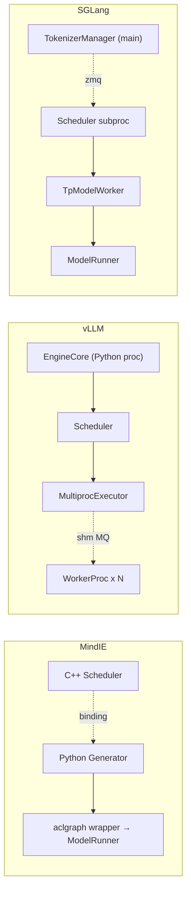
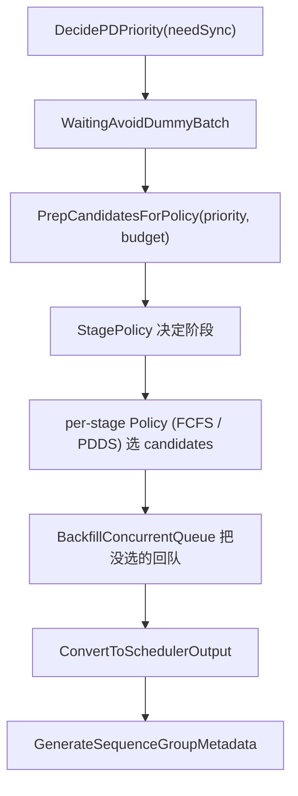
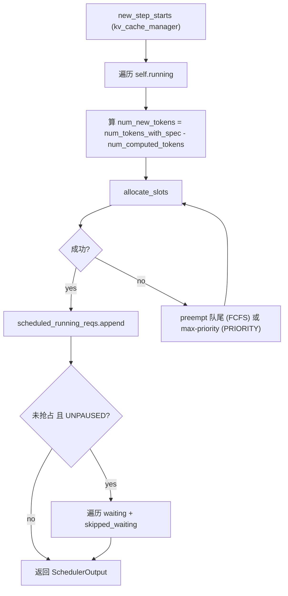
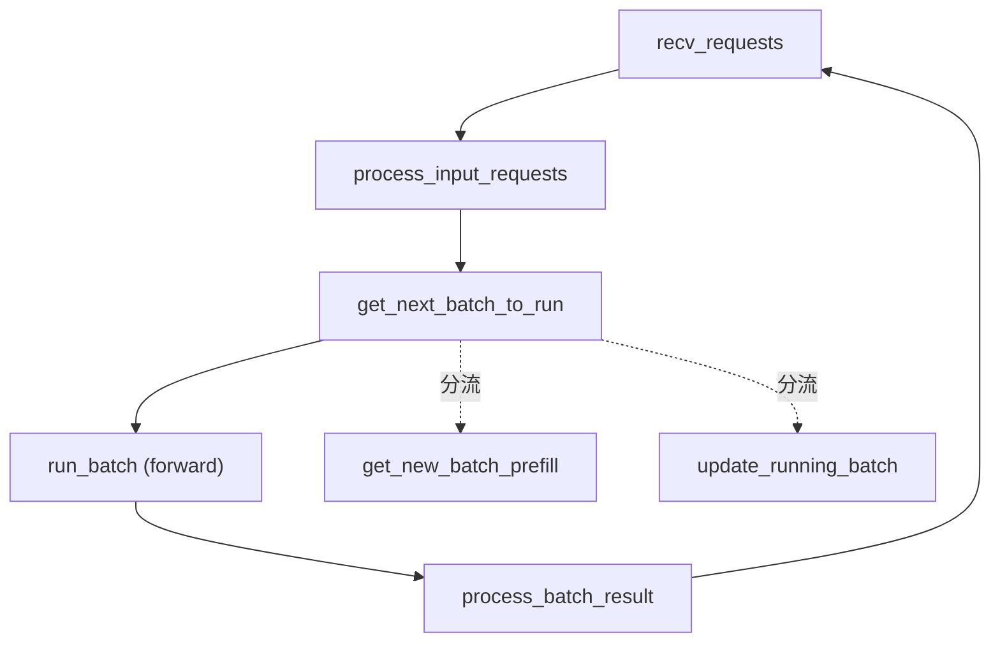

# Cross-project Comparison: Scheduler

> 三项目调度器对比。覆盖 [§dim-scheduler](../dimensions.md) 维度。
> 每个 cell 都有具体源码 / wiki 页 anchor，遵循 [AGENTS.md §8](../../AGENTS.md) 对比规则。

## TL;DR (synthesis)

| 维度 | MindIE | vLLM | SGLang |
|---|---|---|---|
| **实现语言** | C++ | Python | Python |
| **进程位置** | 独立 C++ scheduler，binding 回调 Python `Generator` | EngineCore 进程**主线程内**（同一 Python 进程） | 独立子进程（每 PP×TP 一个），ZMQ 与 manager 通信 |
| **Prefill/Decode 模型** | **显式区分**：prefill / decode 各一个 policy + stage policy 决定哪阶段先跑 | **不区分**："`num_computed_tokens` 追 `num_tokens_with_spec`"统一抽象 | 显式区分：`get_new_batch_prefill` / `update_running_batch` 两条路径 |
| **抢占** | SWAP / RECOMPUTE / NONE 三种模式（并行 seq 强制 abort） | PRIORITY 抢 max(priority, arrival_time)；FCFS 抢队尾 | （同 vLLM 的 PRIORITY 思路，详见各自 source） |
| **CPU/GPU overlap** | 同步=1，异步单发=2 (`maxScheduledBatch_`) | `AsyncScheduler` 子类用 placeholder token 实现 overlap | `event_loop_overlap` 用 `result_queue` deque 实现 overlap |
| **PD 分离支持** | 一等公民：`KVPulledReqEnterRunningQueue`、`ScheduleTransfer`、`SwitchRole`、`pdds_policy` | 通过 `KVConnector` + `_try_promote_blocked_waiting_request` 钩子 | 通过 `SchedulerDisaggregationDecode/PrefillMixin` 两个 mixin |
| **Policy 模块化** | **2D 正交**：StagePolicy × Per-stage Policy | 单个 `schedule()` 里硬编码 RUNNING + WAITING 两阶段 | 11 mixin（含 `SchedulerPPMixin` / `SchedulerDPAttnMixin`） |
| **延迟预测** | `LatencyPredictor` 一等公民 | 无 | 无 |
| **可暂停状态机** | 没有显式状态机（靠 `serving_` flag） | `PauseState` 三状态：UNPAUSED / PAUSED_NEW / PAUSED_ALL | `_engine_paused` 单 flag |
| **典型代码量** | ~ 320 行 .h + 多个 policy .h | ~ 2270 行 scheduler.py | ~ 3700 行 scheduler.py + 11 mixin（class 定义见 [scheduler.py:317-329](d:\design\sglang\python\sglang\srt\managers\scheduler.py)） |

---

## 1. 进程拓扑与位置

| 项目 | scheduler 跑在哪 | 与 worker / model 的距离 | 锚点 |
|---|---|---|---|
| MindIE | C++ 独立调度器 | 通过 binding 把"一次 generate_token"反向回调 Python | [src/scheduler/scheduler.h:61](d:\design\MindIE-LLM\src\scheduler\scheduler.h), [generator.py:583-585](d:\design\MindIE-LLM\mindie_llm\text_generator\generator.py) |
| vLLM | Python，与 EngineCore 同进程同线程 | scheduler.schedule() 直接调 executor.execute_model | [v1/engine/core.py:130-152](d:\design\vllm\vllm\v1\engine\core.py), [scheduler.py:67](d:\design\vllm\vllm\v1\core\sched\scheduler.py) |
| SGLang | Python，**独立子进程**（每 PP×TP 一个） | scheduler 直接持有 `TpModelWorker`，无 Executor 抽象层 | [scheduler.py:317](d:\design\sglang\python\sglang\srt\managers\scheduler.py), [tp_worker.py:217](d:\design\sglang\python\sglang\srt\managers\tp_worker.py) |

> synthesis: **vLLM 与 SGLang 的核心差异**：vLLM 的 scheduler 与 worker 之间用"Executor 抽象 + 共享内存 MQ"分离，scheduler 与 EngineCore 同线程；SGLang 的 scheduler 是独立子进程，与 worker 在同一进程内（python `import` 关系），但与 tokenizer/detokenizer 跨进程。**MindIE 是唯一把 scheduler 写在 C++ 里的**，可能是为了避免 GIL 在大 batch 调度决策时的瓶颈。

---

## 2. Schedule 主循环结构

### MindIE
- `Schedule(needSync)` ([scheduler.h:70](d:\design\MindIE-LLM\src\scheduler\scheduler.h)) → `(SequenceGroupMetaDatas, SchedulerOutputs)`
- `ScheduleTransfer()` ([scheduler.h:72](d:\design\MindIE-LLM\src\scheduler\scheduler.h)) — **PD 分离专用调度路径**

### vLLM
- `Scheduler.schedule()` ([scheduler.py:348-955](d:\design\vllm\vllm\v1\core\sched\scheduler.py)) → `SchedulerOutput`
- 单一函数处理 RUNNING + WAITING 两阶段

核心抽象（[scheduler.py:349-358 注释](d:\design\vllm\vllm\v1\core\sched\scheduler.py)）：
> There's no "decoding phase" nor "prefill phase" in the scheduler. ... general enough to cover chunked prefills, prefix caching, speculative decoding, and the "jump decoding" optimization.

### SGLang
- `event_loop_normal()` ([scheduler.py:1384-1410](d:\design\sglang\python\sglang\srt\managers\scheduler.py)) — 同步循环
- `event_loop_overlap()` ([scheduler.py:1412-1465](d:\design\sglang\python\sglang\srt\managers\scheduler.py)) — overlap 循环

`get_next_batch_to_run` ([scheduler.py:2278-2386](d:\design\sglang\python\sglang\srt\managers\scheduler.py)) 内部决定本步走 prefill 还是 decode。

---

## 3. 队列与数据结构

| 项目 | 队列实现 | 复杂度 | 锚点 |
|---|---|---|---|
| MindIE | 3 个 `ConcurrentDeque<SequenceGroupSPtr>` (waiting / running / swapped) + `ConcurrentMap<SequenceId, SequenceGroupSPtr>` (transferringMap) | 抢占用 deque 操作；C++ 的并发原语保证多线程安全 | [scheduler.h:222-235](d:\design\MindIE-LLM\src\scheduler\scheduler.h) |
| vLLM | `RequestQueue` 抽象 + 2 实现：`FCFSRequestQueue`(deque) / `PriorityRequestQueue`(heapq)；`running` 是普通 list | FCFS pop O(1)，PRIORITY pop O(log N)；running 抢占 O(N) | [request_queue.py](d:\design\vllm\vllm\v1\core\sched\request_queue.py), [scheduler.py:564-955](d:\design\vllm\vllm\v1\core\sched\scheduler.py) |
| SGLang | `ScheduleBatch` + 各种内部 list/dict | 详见 [schedule_batch.py](d:\design\sglang\python\sglang\srt\managers\schedule_batch.py) | [schedule_policy.py](d:\design\sglang\python\sglang\srt\managers\schedule_policy.py) |

> [!warning] CONTRADICTION: vLLM 的 `Scheduler.running` 是 `list`，抢占时 `pop()` / `remove()` 都是 O(N)。在 max_num_seqs 上千的场景下可能有性能影响（synthesis）。

---

## 4. 调度策略（Policy）

| 项目 | 策略数量 | 模块化方式 | 锚点 |
|---|---|---|---|
| MindIE | **2D 正交**：6 个 StagePolicy × 4 个 Per-stage Policy | StagePolicy 决定 prefill/decode 谁先跑；Per-stage policy 决定阶段内排队 | [src/scheduler/policy/](d:\design\MindIE-LLM\src\scheduler\policy)（15 .h） |
| vLLM | 2 种：FCFS / PRIORITY | enum + 2 个 RequestQueue 子类，调度逻辑硬编码在 `schedule()` 里 | [request_queue.py:13-208](d:\design\vllm\vllm\v1\core\sched\request_queue.py) |
| SGLang | 11 个 mixin 拼装 | 每个 mixin 一组 method，靠多继承组合 | [scheduler.py:317-329](d:\design\sglang\python\sglang\srt\managers\scheduler.py) |

MindIE 的 stage policies：

| 策略 | 文件 | 用途 |
|---|---|---|
| `prefill_first_policy` | [prefill_first_policy.h](d:\design\MindIE-LLM\src\scheduler\policy\stage_policy\prefill_first_policy.h) | prefill 优先 |
| `time_division_policy` | [time_division_policy.h](d:\design\MindIE-LLM\src\scheduler\policy\stage_policy\time_division_policy.h) | 时分复用（按 `prefillPercentage`） |
| `tpt_stage_policy` | [tpt_stage_policy.h](d:\design\MindIE-LLM\src\scheduler\policy\stage_policy\tpt_stage_policy.h) | 吞吐优先 |
| `latency_stage_policy` | [latency_stage_policy.h](d:\design\MindIE-LLM\src\scheduler\policy\stage_policy\latency_stage_policy.h) | 延迟优先 |
| `edge_cloud_policy` | [edge_cloud_policy.h](d:\design\MindIE-LLM\src\scheduler\policy\stage_policy\edge_cloud_policy.h) | 边云协同 |

> synthesis: MindIE 的 `LatencyPredictor`（[scheduler.h:239](d:\design\MindIE-LLM\src\scheduler\scheduler.h)）支持 `latency_stage_policy` 与 `tpt_stage_policy` 的决策——这是 vLLM 与 SGLang 都没有的能力。**对你当前 PD 优化场景**，如果你想从"FCFS 改成动态 prefill/decode 配比"，MindIE 已经原生支持。

---

## 5. CPU/GPU Overlap

| 项目 | 实现 | 锚点 |
|---|---|---|
| MindIE | `maxScheduledBatch_`：同步=1，异步单发=2 | [scheduler.h:292-293](d:\design\MindIE-LLM\src\scheduler\scheduler.h) |
| vLLM | `AsyncScheduler` 子类：`_update_after_schedule` 提前给每个调度过的 req 加 `num_output_placeholders`，让下一步 schedule 可以立刻继续 | [async_scheduler.py:18-35](d:\design\vllm\vllm\v1\core\sched\async_scheduler.py) |
| SGLang | `event_loop_overlap`：用 `result_queue: deque` 把上一 batch 的 `process_batch_result` 与本 batch 的 `run_batch` overlap | [scheduler.py:1412-1465](d:\design\sglang\python\sglang\srt\managers\scheduler.py) |

vLLM 与 SGLang 的 overlap 都需要小心 **spec decoding + structured output** 的组合：

- vLLM：`AsyncScheduler._update_after_schedule` 设 `pending_structured_output_tokens` 标志 ([async_scheduler.py:26-28](d:\design\vllm\vllm\v1\core\sched\async_scheduler.py))
- SGLang：[scheduler.py:1486-1496 is_disable_overlap_for_batch](d:\design\sglang\python\sglang\srt\managers\scheduler.py) 显式 TODO："we do not support overlap + spec + grammar yet"

---

## 6. PD 分离支持

| 项目 | 一等公民支持 | 关键 API | 锚点 |
|---|---|---|---|
| MindIE | ✅ 是 | `ScheduleTransfer()`, `KVPulledReqEnterRunningQueue`, `NotifyMeKvPulledSeqIds`, `transferringMap_`, `kvCachePulledSeqIds_`, `transferPolicy_`, `pdds_policy`, **`SwitchRole()` 可弹性切换 P/D 角色** | [scheduler.h:72, 81, 84, 232-235, 259, 112](d:\design\MindIE-LLM\src\scheduler\scheduler.h) |
| vLLM | 通过钩子 | `connector: KVConnectorBase_V1`, `_try_promote_blocked_waiting_request`, `_update_waiting_for_remote_kv` | [scheduler.py:120, 2070-2102, 2036-2069](d:\design\vllm\vllm\v1\core\sched\scheduler.py) |
| SGLang | 通过 mixin | `SchedulerDisaggregationDecodeMixin`, `SchedulerDisaggregationPrefillMixin` | [scheduler.py:322-323](d:\design\sglang\python\sglang\srt\managers\scheduler.py), [srt/disaggregation/](d:\design\sglang\python\sglang\srt\disaggregation)（7 backend） |

> synthesis: 三家都支持 PD 分离调度，但**抽象层次不同**：
> - MindIE 把 PD 视为"一等公民"——专门的 transferringMap、专门的 transferPolicy、独立的 ScheduleTransfer 调度路径
> - vLLM 用统一的 `KVConnector` 接口抽象，scheduler 在 waiting 阶段处理"等远端 KV"状态
> - SGLang 用 mixin 把 prefill 端 / decode 端的逻辑分别注入

---

## 7. 抢占（Preemption）

| 项目 | 模式 | 选择策略 | 限制 |
|---|---|---|---|
| MindIE | `PreemptionMode { NONE, SWAP, RECOMPUTE }` | 由 policy 决定 | **并行 seq group (n>1) 不支持 RECOMPUTE，直接 abort** |
| vLLM | RECOMPUTE only（preempted_req 重新走 waiting 流程） | PRIORITY: `max(running, key=(priority, arrival_time))`；FCFS: `running.pop()` 队尾 | 抢占发生时本步**不再尝试 waiting** |
| SGLang | （详见 [scheduler.py update_running_batch](d:\design\sglang\python\sglang\srt\managers\scheduler.py)，本轮未深入） | TODO | TODO |

锚点：

- MindIE: [scheduler.h:33 PreemptionMode](d:\design\MindIE-LLM\src\scheduler\scheduler.h), [scheduler.h:296-297 注释](d:\design\MindIE-LLM\src\scheduler\scheduler.h)
- vLLM: [scheduler.py:475-510](d:\design\vllm\vllm\v1\core\sched\scheduler.py), [scheduler.py:564 抢占后跳过 waiting](d:\design\vllm\vllm\v1\core\sched\scheduler.py)

> [!todo] VERIFY: SGLang 的抢占模式与策略，需要 ingest scheduler.py update_running_batch 详细逻辑。

---

## 8. Pause / 状态机

| 项目 | 状态机 | 锚点 |
|---|---|---|
| MindIE | 无显式 state enum，靠 `serving_` 单 flag | [scheduler.h:280](d:\design\MindIE-LLM\src\scheduler\scheduler.h)（注释明示"未来会支持服务中切换 role"） |
| vLLM | `PauseState`: UNPAUSED / PAUSED_NEW / PAUSED_ALL | [interface.py:22-33](d:\design\vllm\vllm\v1\core\sched\interface.py) |
| SGLang | `_engine_paused` 单 flag | [scheduler.py:1390, 1427](d:\design\sglang\python\sglang\srt\managers\scheduler.py) |

> synthesis: vLLM 的 `PAUSED_NEW`（不接新请求但已 RUNNING 的继续跑）在 RLHF / 权重热更新场景下很有用，MindIE 与 SGLang 暂未提供同等粒度。

---

## 9. 与你 PD 优化的关联（synthesis）

> 注意：本节是综合性建议，不是任何一方的源码原文。

如果你正在 MindIE 上做 PD 优化，下面三条值得考虑：

1. **stage policy 选择**：当前 MindIE 默认大概率是 `prefill_first_policy` 或 `time_division_policy`。如果你的瓶颈在 TTFT 长尾，可能 `latency_stage_policy` 更合适（[latency_stage_policy.h](d:\design\MindIE-LLM\src\scheduler\policy\stage_policy\latency_stage_policy.h)）；如果瓶颈在吞吐，`tpt_stage_policy` 更合适（[tpt_stage_policy.h](d:\design\MindIE-LLM\src\scheduler\policy\stage_policy\tpt_stage_policy.h)）。
2. **SetPrefillPercentage 动态调**：[scheduler.h:110](d:\design\MindIE-LLM\src\scheduler\scheduler.h) 提供运行时 API 调 prefill 比例，可在压测时动态调整找最佳点。
3. **`maxScheduledBatch_=2` 异步模式**：[scheduler.h:292-293](d:\design\MindIE-LLM\src\scheduler\scheduler.h)。如果同步模式下 prefill 优化后吞吐没上去，可能是 GPU 与调度 CPU 串行——异步模式让 schedule(N+1) 与 forward(N) overlap，类似 vLLM 的 `AsyncScheduler` / SGLang 的 `event_loop_overlap`。

跨项目可借鉴的点：

- **从 vLLM 借鉴**：`max_num_scheduled_tokens` 这种 token-level budget 比 seq-level batch_size 更精准，对 chunked prefill / spec decoding 友好（[scheduler.py:106-110, 367](d:\design\vllm\vllm\v1\core\sched\scheduler.py)）。
- **从 SGLang 借鉴**：`is_disable_overlap_for_batch`（[scheduler.py:1466-1497](d:\design\sglang\python\sglang\srt\managers\scheduler.py)）用 env `SGLANG_DISABLE_CONSECUTIVE_PREFILL_OVERLAP` 显式控制"连续两个 prefill 不 overlap 来改 TTFT"——这种"为 P50 牺牲 P99 的开关"很实用。

---

## Notes / Caveats
> [!todo] VERIFY: SGLang 的 prefill / decode 决策代码（`get_next_batch_to_run`、`get_new_batch_prefill`、`update_running_batch`），本轮未读全。
> [!todo] VERIFY: MindIE C++ ↔ Python binding 的具体调用栈与吞吐影响。
> [!todo] VERIFY: vLLM 的 `_handle_invalid_blocks` 与 PD 分离失败场景的关系（[scheduler.py:2235-...](d:\design\vllm\vllm\v1\core\sched\scheduler.py)）。

## See also
- [comparison/dimensions.md](../dimensions.md) §dim-scheduler
- [vllm/entities/Scheduler.md](../../vllm/entities/Scheduler.md)
- [sglang/entities/Scheduler.md](../../sglang/entities/Scheduler.md)
- [comparison/index.md](../index.md)
