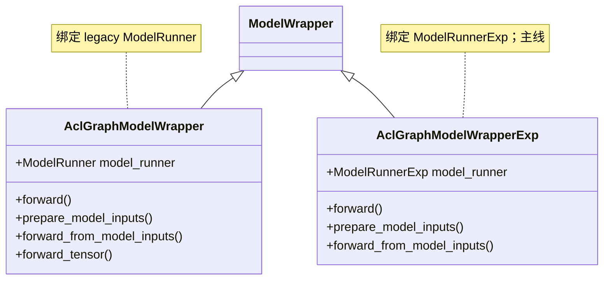

# `AclGraphModelWrapper` / `AclGraphModelWrapperExp`（aclgraph 模式包装）

## Summary

本页合并记述 MindIE-LLM **TORCH / aclgraph** 路径上的两个模型包装类：**`AclGraphModelWrapper`**（基础版）与 **`AclGraphModelWrapperExp`**（Exp 版）。二者均继承 [`ModelWrapper`](d:\design\MindIE-LLM\mindie_llm\modeling\model_wrapper\wrapper.py)（见 [aclgraph_model_wrapper.py:22](d:\design\MindIE-LLM\mindie_llm\modeling\model_wrapper\aclgraph\aclgraph_model_wrapper.py)、[aclgraph_model_wrapper_exp.py:25](d:\design\MindIE-LLM\mindie_llm\modeling\model_wrapper\aclgraph\aclgraph_model_wrapper_exp.py)），**互不继承**，由 `ENV.model_runner_exp` 在 [`get_model_wrapper`](d:\design\MindIE-LLM\mindie_llm\modeling\model_wrapper\__init__.py) 中择一（[__init__.py:17-24](d:\design\MindIE-LLM\mindie_llm\modeling\model_wrapper\__init__.py)）。

> synthesis: **当前 Generator 在 `backend_type == "torch"` 时会强制 `ENV.model_runner_exp = True`**（[generator.py:303-305](d:\design\MindIE-LLM\mindie_llm\text_generator\generator.py)），与 wiki [aclgraph-pp.md](../topics/aclgraph-pp.md) 所述"Exp + `GeneratorAclGraph` 为主线"一致；基础版更多作为 **非 Exp 分支 / 旧 `ModelRunner` 路径**的保留实现。

## Sources

- 基础版：[aclgraph_model_wrapper.py](d:\design\MindIE-LLM\mindie_llm\modeling\model_wrapper\aclgraph\aclgraph_model_wrapper.py)
- Exp 版：[aclgraph_model_wrapper_exp.py](d:\design\MindIE-LLM\mindie_llm\modeling\model_wrapper\aclgraph\aclgraph_model_wrapper_exp.py)
- 选型：[modeling/model_wrapper/__init__.py](d:\design\MindIE-LLM\mindie_llm\modeling\model_wrapper\__init__.py)
- ACL Graph 后端：[aclgraph_backend.py](d:\design\MindIE-LLM\mindie_llm\runtime\compilation\aclgraph_backend.py)
- Runner：[model_runner.py](d:\design\MindIE-LLM\mindie_llm\runtime\model_runner\model_runner.py), [model_runner_exp.py](d:\design\MindIE-LLM\mindie_llm\runtime\model_runner\model_runner_exp.py)
- ForwardContext（两套）：[forward_context.py](d:\design\MindIE-LLM\mindie_llm\runtime\model_runner\forward_context.py), [forward_context_exp.py](d:\design\MindIE-LLM\mindie_llm\runtime\model_runner\forward_context_exp.py)
- 调用方：[generator_aclgraph.py](d:\design\MindIE-LLM\mindie_llm\text_generator\adapter\generator_aclgraph.py), [plugin_manager.py](d:\design\MindIE-LLM\mindie_llm\text_generator\plugins\plugin_manager.py), [generator.py](d:\design\MindIE-LLM\mindie_llm\text_generator\generator.py)

## 类层次

## `AclGraphModelWrapper`（基础版）

**定义与继承**：`class AclGraphModelWrapper(ModelWrapper)` [aclgraph_model_wrapper.py:22](d:\design\MindIE-LLM\mindie_llm\modeling\model_wrapper\aclgraph\aclgraph_model_wrapper.py)。

**`__init__` 签名** [aclgraph_model_wrapper.py:23-27](d:\design\MindIE-LLM\mindie_llm\modeling\model_wrapper\aclgraph\aclgraph_model_wrapper.py)：
`(self, rank, local_rank, world_size, npu_device_id, model_id: str, **kwargs)`。

**核心行为**：

- 构造 **[`ModelRunner`](d:\design\MindIE-LLM\mindie_llm\runtime\model_runner\model_runner.py)**（[aclgraph_model_wrapper.py:31-56](d:\design\MindIE-LLM\mindie_llm\modeling\model_wrapper\aclgraph\aclgraph_model_wrapper.py)），从中取 `config`、`tokenizer`、`mapping`、`process_group` 等；并设置 **`dp_size` / `sp_size` / `cp_size`**（[aclgraph_model_wrapper.py:63-65](d:\design\MindIE-LLM\mindie_llm\modeling\model_wrapper\aclgraph\aclgraph_model_wrapper.py)）。
- **`forward`**：`prepare_model_inputs` → `forward_from_model_inputs` → 内部 **`forward_tensor`** 调 `model_runner.forward(...)`（[aclgraph_model_wrapper.py:99-121, 211-225, 251-263](d:\design\MindIE-LLM\mindie_llm\modeling\model_wrapper\aclgraph\aclgraph_model_wrapper.py)）。
- **`prepare_model_inputs`**：大范围 H2D（`torch.tensor(...).to(self.device)`）及 DP/SP/MTP 等 kwargs 张量化（[aclgraph_model_wrapper.py:123-209](d:\design\MindIE-LLM\mindie_llm\modeling\model_wrapper\aclgraph\aclgraph_model_wrapper.py)）；**不**调用 `build_forward_context`（与 Exp 对比见下节）。
- **`forward_tensor`**：封装 profiling（`span_start` 等）后调用 `ModelRunner.forward`（[aclgraph_model_wrapper.py:227-269](d:\design\MindIE-LLM\mindie_llm\modeling\model_wrapper\aclgraph\aclgraph_model_wrapper.py)）。
- **`resume_hccl_comm`**：委托 `model_runner.resume_hccl_comm()`（[aclgraph_model_wrapper.py:287-288](d:\design\MindIE-LLM\mindie_llm\modeling\model_wrapper\aclgraph\aclgraph_model_wrapper.py)）。

**方法清单**（`^    def `）：`__init__`, `forward`, `prepare_model_inputs`, `forward_from_model_inputs`, `forward_tensor`, `generate_position_ids`, `make_context`, `resume_hccl_comm` —— 8 个。其中 **`forward_tensor` 为基础版独有**（Exp 无对应方法）。

## `AclGraphModelWrapperExp`（Exp 版）

**定义与继承**：`class AclGraphModelWrapperExp(ModelWrapper)` [aclgraph_model_wrapper_exp.py:25](d:\design\MindIE-LLM\mindie_llm\modeling\model_wrapper\aclgraph\aclgraph_model_wrapper_exp.py)；**不是** `AclGraphModelWrapper` 的子类。

**`__init__` 签名** [aclgraph_model_wrapper_exp.py:32-40](d:\design\MindIE-LLM\mindie_llm\modeling\model_wrapper\aclgraph\aclgraph_model_wrapper_exp.py)：
`(self, rank, local_rank, world_size, npu_device_id, model_id, **kwargs)`.

**核心行为**：

- 构造 **[`ModelRunnerExp`](d:\design\MindIE-LLM\mindie_llm\runtime\model_runner\model_runner_exp.py)**（[aclgraph_model_wrapper_exp.py:67-90](d:\design\MindIE-LLM\mindie_llm\modeling\model_wrapper\aclgraph\aclgraph_model_wrapper_exp.py)）；并行规模来自 **`get_parallel_info_manager()`**（[aclgraph_model_wrapper_exp.py:97-100](d:\design\MindIE-LLM\mindie_llm\modeling\model_wrapper\aclgraph\aclgraph_model_wrapper_exp.py)）。
- **`prepare_model_inputs`**：H2D 后调用 **`model_runner.build_forward_context`**，并把 **`forward_context.attn_metadata.seq_lens`** 赋给 **`model_inputs.input_lengths`**，同时设置 **`model_inputs.forward_context`**（[aclgraph_model_wrapper_exp.py:204-209](d:\design\MindIE-LLM\mindie_llm\modeling\model_wrapper\aclgraph\aclgraph_model_wrapper_exp.py)）；注释说明与 **`PluginManager` 对 `input_lengths` 的原地修改**共享地址（[aclgraph_model_wrapper_exp.py:152-155](d:\design\MindIE-LLM\mindie_llm\modeling\model_wrapper\aclgraph\aclgraph_model_wrapper_exp.py)）。
- **`forward_from_model_inputs`**：签名 `(npu_cache, input_ids, position_ids, forward_context, **kwargs)`，直接 **`model_runner.forward(npu_cache, input_ids, position_ids, forward_context, **kwargs)`**（[aclgraph_model_wrapper_exp.py:211-245](d:\design\MindIE-LLM\mindie_llm\modeling\model_wrapper\aclgraph\aclgraph_model_wrapper_exp.py)）。
- **`resume_hccl_comm`**：**显式 `raise NotImplementedError`**，注释称 aclgraph 当前不支持（[aclgraph_model_wrapper_exp.py:290-299](d:\design\MindIE-LLM\mindie_llm\modeling\model_wrapper\aclgraph\aclgraph_model_wrapper_exp.py)）。

**方法清单**：`__init__`, `forward`, `prepare_model_inputs`, `forward_from_model_inputs`, `generate_position_ids`, `make_context`, `resume_hccl_comm` —— 7 个。无 `forward_tensor`。

## 两版关键差异对照表

| 维度 | 基础版 `AclGraphModelWrapper` | Exp 版 `AclGraphModelWrapperExp` |
|------|------------------------------|----------------------------------|
| 父类 / 二者关系 | `ModelWrapper` [aclgraph_model_wrapper.py:22](d:\design\MindIE-LLM\mindie_llm\modeling\model_wrapper\aclgraph\aclgraph_model_wrapper.py) | `ModelWrapper` [aclgraph_model_wrapper_exp.py:25](d:\design\MindIE-LLM\mindie_llm\modeling\model_wrapper\aclgraph\aclgraph_model_wrapper_exp.py)；**非子类关系** |
| 选型开关 | `ENV.model_runner_exp` 为假时选用 [__init__.py:19-24](d:\design\MindIE-LLM\mindie_llm\modeling\model_wrapper\__init__.py) | 为真时选用 [__init__.py:19-21](d:\design\MindIE-LLM\mindie_llm\modeling\model_wrapper\__init__.py)；**Generator torch 路径强制为真** [generator.py:303-305](d:\design\MindIE-LLM\mindie_llm\text_generator\generator.py) |
| 底层 Runner | `ModelRunner` [aclgraph_model_wrapper.py:31-56](d:\design\MindIE-LLM\mindie_llm\modeling\model_wrapper\aclgraph\aclgraph_model_wrapper.py) | `ModelRunnerExp` [aclgraph_model_wrapper_exp.py:67-90](d:\design\MindIE-LLM\mindie_llm\modeling\model_wrapper\aclgraph\aclgraph_model_wrapper_exp.py) |
| `dp/sp/cp` 来源 | `self.mapping.attn_*` [aclgraph_model_wrapper.py:63-65](d:\design\MindIE-LLM\mindie_llm\modeling\model_wrapper\aclgraph\aclgraph_model_wrapper.py) | `get_parallel_info_manager().get(ParallelType.*)` [aclgraph_model_wrapper_exp.py:97-100](d:\design\MindIE-LLM\mindie_llm\modeling\model_wrapper\aclgraph\aclgraph_model_wrapper_exp.py) |
| H2D / 输入 | 显式 `torch.tensor` + `.to(device)`，字段覆盖广（含 DP/SP/MTP 等） [aclgraph_model_wrapper.py:123-209](d:\design\MindIE-LLM\mindie_llm\modeling\model_wrapper\aclgraph\aclgraph_model_wrapper.py) | `tensor(..., device=)` + 子集 kwargs；**并 `build_forward_context`** [aclgraph_model_wrapper_exp.py:162-209](d:\design\MindIE-LLM\mindie_llm\modeling\model_wrapper\aclgraph\aclgraph_model_wrapper_exp.py) |
| ForwardContext | **不在 wrapper 内构造**；由 `ModelRunner.forward` 内 `create_forward_context(input_metadata)` 等完成（见 [model_runner.py:302-308](d:\design\MindIE-LLM\mindie_llm\runtime\model_runner\model_runner.py)） | **`prepare_model_inputs` 内** `build_forward_context`，写入 `model_inputs.forward_context` [aclgraph_model_wrapper_exp.py:204-209](d:\design\MindIE-LLM\mindie_llm\modeling\model_wrapper\aclgraph\aclgraph_model_wrapper_exp.py) |
| `forward_from_model_inputs` 签名 | `(model_inputs, npu_cache=None, **kwargs)` → `forward_tensor` [aclgraph_model_wrapper.py:211-225](d:\design\MindIE-LLM\mindie_llm\modeling\model_wrapper\aclgraph\aclgraph_model_wrapper.py) | `(npu_cache, input_ids, position_ids, forward_context, **kwargs)` [aclgraph_model_wrapper_exp.py:211-245](d:\design\MindIE-LLM\mindie_llm\modeling\model_wrapper\aclgraph\aclgraph_model_wrapper_exp.py) |
| 独有方法 | **`forward_tensor`**（profiling 包装） [aclgraph_model_wrapper.py:227-269](d:\design\MindIE-LLM\mindie_llm\modeling\model_wrapper\aclgraph\aclgraph_model_wrapper.py) | 无 |
| `resume_hccl_comm` | 委托 runner [aclgraph_model_wrapper.py:287-288](d:\design\MindIE-LLM\mindie_llm\modeling\model_wrapper\aclgraph\aclgraph_model_wrapper.py) | **`NotImplementedError`** [aclgraph_model_wrapper_exp.py:298-299](d:\design\MindIE-LLM\mindie_llm\modeling\model_wrapper\aclgraph\aclgraph_model_wrapper_exp.py) |

## aclgraph capture & replay 机制

**实现位置**：[`AclGraphBackend.__call__`](d:\design\MindIE-LLM\mindie_llm\runtime\compilation\aclgraph_backend.py) [aclgraph_backend.py:87-147](d:\design\MindIE-LLM\mindie_llm\runtime\compilation\aclgraph_backend.py)。Wrapper 本身不实现 capture/replay，仅通过 **已包装 `AclGraphBackend` 的 `ModelRunner` / `ModelRunnerExp`** 间接触发。

**Eager（不走图）条件**（与注释一致）：

- `self._run_eager_mode_with_padding` 为真；或
- **`forward_context.is_prefill`**；或
- **`num_actual_tokens > self.capture_sizes[-1]`**（超过最大 capture 档位）

见 [aclgraph_backend.py:105-110](d:\design\MindIE-LLM\mindie_llm\runtime\compilation\aclgraph_backend.py)。

**Capture 触发**：

- 非上述 eager 分支且 **`batch_descriptor` 对应 graph 仍为 `None`** 时进入 capture；先 **`validate_aclgraph_capturing_enabled()`**（仅当全局 `set_aclgraph_capturing_enabled(True)` 时合法） [aclgraph_backend.py:116-118](d:\design\MindIE-LLM\mindie_llm\runtime\compilation\aclgraph_backend.py)；
- `torch.npu.graph(...)` 内执行 `self.model(*args, **kwargs)` [aclgraph_backend.py:124-131](d:\design\MindIE-LLM\mindie_llm\runtime\compilation\aclgraph_backend.py)；
- 设置 **`forward_context.capturing = True`** [aclgraph_backend.py:124](d:\design\MindIE-LLM\mindie_llm\runtime\compilation\aclgraph_backend.py)。

**Replay**：`graph.replay()` [aclgraph_backend.py:137](d:\design\MindIE-LLM\mindie_llm\runtime\compilation\aclgraph_backend.py)；随后尝试 `graph.update` 更新 KV 序列长度等 [aclgraph_backend.py:138-144](d:\design\MindIE-LLM\mindie_llm\runtime\compilation\aclgraph_backend.py)；返回 **`hidden_state[:num_actual_tokens]`** 做 unpad [aclgraph_backend.py:146-147](d:\design\MindIE-LLM\mindie_llm\runtime\compilation\aclgraph_backend.py)。

**Eager with padding 开关**：[`set_eager_mode_with_padding`](d:\design\MindIE-LLM\mindie_llm\runtime\compilation\aclgraph_backend.py) [aclgraph_backend.py:230-236](d:\design\MindIE-LLM\mindie_llm\runtime\compilation\aclgraph_backend.py)；`ModelRunnerExp` 对外转发 [model_runner_exp.py:363-371](d:\design\MindIE-LLM\mindie_llm\runtime\model_runner\model_runner_exp.py)。

**Warmup / 预捕获**：

- **Legacy `ModelRunner.warm_up_and_compile`**：`set_aclgraph_capturing_enabled(True)`，按 **`reversed(self.graph_batch_sizes)`** 调用 `_dummy_run` [model_runner.py:249-266](d:\design\MindIE-LLM\mindie_llm\runtime\model_runner\model_runner.py)。
- **`ModelRunnerExp._warm_up_and_compile`**：按 **`reversed(self.model.capture_sizes)`** 调用 `_dummy_run` [model_runner_exp.py:429-441](d:\design\MindIE-LLM\mindie_llm\runtime\model_runner\model_runner_exp.py)。
- Exp 侧在 **`compile(kv_caches)`** 中在 aclgraph 开启时调用 `_warm_up_and_compile` [model_runner_exp.py:255-263](d:\design\MindIE-LLM\mindie_llm\runtime\model_runner\model_runner_exp.py)；**`GeneratorAclGraph.compile`** 调 `model_runner.compile` [generator_aclgraph.py:191-192](d:\design\MindIE-LLM\mindie_llm\text_generator\adapter\generator_aclgraph.py)。

**与 backend 协作要点**：`AclGraphBackend.__call__` 通过 **`get_forward_context()`** 读取 `batch_descriptor`、`num_actual_tokens` 等 [aclgraph_backend.py:100-103](d:\design\MindIE-LLM\mindie_llm\runtime\compilation\aclgraph_backend.py)，故 **Runner 必须在调用 `self.model(...)` 前 `set_forward_context`** —— `ModelRunner.forward` [model_runner.py:308-309](d:\design\MindIE-LLM\mindie_llm\runtime\model_runner\model_runner.py)、`ModelRunnerExp.forward` [model_runner_exp.py:307-308](d:\design\MindIE-LLM\mindie_llm\runtime\model_runner\model_runner_exp.py)。

## ForwardContext 协作

| 组件 | 角色 |
|------|------|
| **`forward_context_exp.ForwardContext`** | Exp 主数据结构；含 `attn_metadata`、`dp_metadata`、`batch_descriptor`、`num_actual_tokens` 等 [forward_context_exp.py:73-103](d:\design\MindIE-LLM\mindie_llm\runtime\model_runner\forward_context_exp.py) |
| **`create_forward_context(model_inputs, mask, ...)`** | 从 `ModelInput` 构建上述上下文 [forward_context_exp.py:209-254](d:\design\MindIE-LLM\mindie_llm\runtime\model_runner\forward_context_exp.py)；`BatchDescriptor` 初值含 **TP 是否启用**（`ATTN_TP`）[forward_context_exp.py:234-237](d:\design\MindIE-LLM\mindie_llm\runtime\model_runner\forward_context_exp.py) |
| **`ModelRunnerExp.build_forward_context`** | 在 aclgraph 下用 **`get_padded_graph_size`** 调整 token 数并写回 `attn_metadata.num_tokens` 与 `batch_descriptor` [model_runner_exp.py:324-348](d:\design\MindIE-LLM\mindie_llm\runtime\model_runner\model_runner_exp.py) |
| **Legacy `forward_context.ForwardContext`** | 另一套 dataclass，注释含 "aclgraph" 字段 [forward_context.py:27-41](d:\design\MindIE-LLM\mindie_llm\runtime\model_runner\forward_context.py)；由 **`create_forward_context(input_metadata: dict)`** 构建 [forward_context.py:47-74](d:\design\MindIE-LLM\mindie_llm\runtime\model_runner\forward_context.py) |
| **Wrapper 侧** | Exp：`prepare_model_inputs` 内 **`build_forward_context`** [aclgraph_model_wrapper_exp.py:204-209](d:\design\MindIE-LLM\mindie_llm\modeling\model_wrapper\aclgraph\aclgraph_model_wrapper_exp.py)；基础版：不在此构造，由 **`ModelRunner.forward`** 使用 legacy `create_forward_context` [model_runner.py:302-308](d:\design\MindIE-LLM\mindie_llm\runtime\model_runner\model_runner.py) |

**全局 TLS**：`get_forward_context` / `set_forward_context` 定义于 [forward_context_exp.py:181-205](d:\design\MindIE-LLM\mindie_llm\runtime\model_runner\forward_context_exp.py)；`forward_context.py` 自 exp **再导出** [forward_context.py:13-14](d:\design\MindIE-LLM\mindie_llm\runtime\model_runner\forward_context.py)。

## CP/SP/DP/FlashComm 集成

**Wrapper 文件内**：

- **DP/CP 规模**：两版均在 `__init__` 设 `dp_size`、`cp_size`（及 `sp_size`）—— [aclgraph_model_wrapper.py:63-65](d:\design\MindIE-LLM\mindie_llm\modeling\model_wrapper\aclgraph\aclgraph_model_wrapper.py)、[aclgraph_model_wrapper_exp.py:98-100](d:\design\MindIE-LLM\mindie_llm\modeling\model_wrapper\aclgraph\aclgraph_model_wrapper_exp.py)。**无** `flashcomm` 字符串（wrapper 内未直接集成）。
- **FlashComm / DP 后处理**：在 **`AclGraphBackend`** 上委托给底层 model（[`maybe_gather_and_unpad_for_flashcomm`](d:\design\MindIE-LLM\mindie_llm\runtime\compilation\aclgraph_backend.py) [aclgraph_backend.py:208-217](d:\design\MindIE-LLM\mindie_llm\runtime\compilation\aclgraph_backend.py)、[`maybe_pad_and_gather_cross_dp_and_unpad`](d:\design\MindIE-LLM\mindie_llm\runtime\compilation\aclgraph_backend.py) [aclgraph_backend.py:219-228](d:\design\MindIE-LLM\mindie_llm\runtime\compilation\aclgraph_backend.py)）。
- **Runner 内实际调用**：
  - Legacy：`maybe_gather_and_unpad_for_flashcomm`；若 **`not self.distributed_enable`** 再 `maybe_pad_and_gather_cross_dp_and_unpad`；**`cp_size > 1`** 时 `maybe_allgather_cp` 再 `compute_logits` [model_runner.py:310-318](d:\design\MindIE-LLM\mindie_llm\runtime\model_runner\model_runner.py)。
  - Exp：`maybe_gather_and_unpad_for_flashcomm` → `maybe_pad_and_gather_cross_dp_and_unpad`（**无条件**，未再包 `distributed_enable`） [model_runner_exp.py:313-314](d:\design\MindIE-LLM\mindie_llm\runtime\model_runner\model_runner_exp.py)；**`ATTN_CP` 启用**时 `maybe_all_gather_cp` [model_runner_exp.py:315-318](d:\design\MindIE-LLM\mindie_llm\runtime\model_runner\model_runner_exp.py)。

## PP 缺失（synthesis）

- **Wiki / 设计文档**：PP 在 aclgraph 主线未接入，详 [aclgraph-pp.md](../topics/aclgraph-pp.md) 及 [mindie_generator_aclgraph_pp_design.md](d:\design\MindIE-LLM\docs\mindie_generator_aclgraph_pp_design.md)。
- **本仓库两个 wrapper 文件**：`grep` **`pipeline` / `pp_`** —— **无匹配**（仅读检索，2026-04-18）。即 **wrapper 层无 PP placeholder 代码**。

## 跨项目对照（synthesis）

| 系统 | 对应概念 | 说明（锚点） |
|------|-----------|--------------|
| **MindIE-LLM** | `AclGraphBackend` + `torch.npu.NPUGraph` | capture/replay、按 `batch_descriptor` 分桶 [aclgraph_backend.py:65-147](d:\design\MindIE-LLM\mindie_llm\runtime\compilation\aclgraph_backend.py) |
| **vLLM v1** | CUDA graph / dispatcher | `gpu_model_runner.py` 大量 `cudagraph_*`（如 `cudagraph_dispatcher`、`profile_cudagraph_memory`、`set_cudagraph_capturing_enabled` 等） [gpu_model_runner.py:26](d:\design\vllm\vllm\v1\worker\gpu_model_runner.py) |
| **vLLM** | `cudagraph_utils.py` | `CudagraphUtils` 等与 graph pool、capture size 相关 [cudagraph_utils.py:85-118, 248-254](d:\design\vllm\vllm\v1\worker\gpu\cudagraph_utils.py) |
| **SGLang** | `python/sglang/srt/compilation/` | 多后端 piecewise 编译（如 `cuda_piecewise_backend.py`、`npu_piecewise_backend.py`、`compile.py` 等）—— **架构类比**：图/分段编译与运行时后端分离；非逐行等价 MindIE |

## `forward` / `forward_async` 主路径

**无 `forward_async` in wrappers**：两文件均无 `forward_async`（只读检索）。

**Sync / 异步调度**：

- **同步**：`GeneratorAclGraph.forward` 直接 `model_wrapper.forward(model_inputs, npu_cache, **kwargs)` [generator_aclgraph.py:185-189](d:\design\MindIE-LLM\mindie_llm\text_generator\adapter\generator_aclgraph.py)。
- **异步线程**：`PluginManager.forward_loop` 中 **`generator_backend.forward_from_model_inputs`** [plugin_manager.py:847-850](d:\design\MindIE-LLM\mindie_llm\text_generator\plugins\plugin_manager.py)；`GeneratorAclGraph.forward_from_model_inputs` 再调 **wrapper**（Exp 签名） [generator_aclgraph.py:147-149](d:\design\MindIE-LLM\mindie_llm\text_generator\adapter\generator_aclgraph.py)。

**Exp 主链路（与 wiki 一致）**：`GeneratorAclGraph` → `AclGraphModelWrapperExp.prepare_model_inputs` → `ModelRunnerExp.forward` → `AclGraphBackend` → 模型 forward；Runner 侧 flashcomm/DP/CP 与 logits —— 见 [aclgraph-pp.md 流程图](../topics/aclgraph-pp.md) 与 [model_runner_exp.py:265-322](d:\design\MindIE-LLM\mindie_llm\runtime\model_runner\model_runner_exp.py)。

## Notes / Caveats

> [!warning] CONTRADICTION: `GeneratorAclGraph.forward_from_model_inputs` 与基础版 wrapper 的 `forward_from_model_inputs(model_inputs, npu_cache)` 签名不兼容；当前 **`backend_type == "torch"` 时 `ENV.model_runner_exp = True`** [generator.py:303-305](d:\design\MindIE-LLM\mindie_llm\text_generator\generator.py)，故 **主线始终配对 Exp**。
> [!todo] VERIFY: `AclGraphBackend` 依赖线程局部 `forward_context`；Exp 路径下由 `ModelRunnerExp.forward` 在调用模型前 `set_forward_context` [model_runner_exp.py:307-308](d:\design\MindIE-LLM\mindie_llm\runtime\model_runner\model_runner_exp.py)。多线程并发时 TLS 是否需要额外保护？
> [!todo] VERIFY: Legacy 与 Exp 的 DP gather 条件不同（`distributed_enable` 仅 legacy 侧 gate，见 [model_runner.py:312-313](d:\design\MindIE-LLM\mindie_llm\runtime\model_runner\model_runner.py) vs [model_runner_exp.py:314](d:\design\MindIE-LLM\mindie_llm\runtime\model_runner\model_runner_exp.py)）—— 可能是 Exp 简化掉了某个边界场景。

## See also

- [mindie/topics/aclgraph-pp.md](../topics/aclgraph-pp.md)（aclgraph 主线 + PP 改造方案）
- [mindie/entities/Generator.md](Generator.md)
- [mindie/entities/PluginManager.md](PluginManager.md)（异步路径下 wrapper 由 `forward_loop` 调用）
- [mindie/entities/ParallelInfoManager.md](ParallelInfoManager.md)（Exp 版的 `dp/sp/cp` 来源）
- [comparison/topics/flashcomm.md](../../comparison/topics/flashcomm.md)（与 `maybe_gather_and_unpad_for_flashcomm` 对照）
- [comparison/topics/cp-sp.md](../../comparison/topics/cp-sp.md)（与 CP/SP 语义对照）
