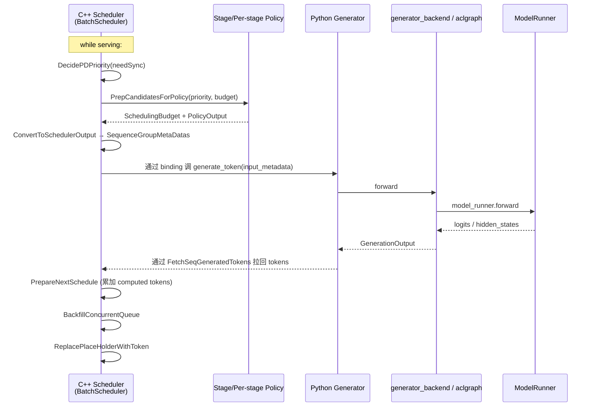

# `BatchScheduler` (MindIE C++ Scheduler)

## Summary
> [!warning] CONTRADICTION: 之前 wiki 多个 `[!todo] VERIFY: BatchScheduler 实际位置` 标记，本页解决：**MindIE 的 BatchScheduler 不在 Python 包 `mindie_llm/` 内**，而是在 C++ src 树 [d:\design\MindIE-LLM\src\scheduler\](d:\design\MindIE-LLM\src\scheduler)，通过 `IScheduler` 接口暴露给 Python 层（推测通过 pybind / cffi）。Python 层的 `Generator.generate_token` 是被这个 C++ scheduler 一次次回调的。

## Sources
- 接口：[d:\design\MindIE-LLM\src\include\scheduler\ischeduler.h](d:\design\MindIE-LLM\src\include\scheduler\ischeduler.h)
- 主实现：[d:\design\MindIE-LLM\src\scheduler\scheduler.h](d:\design\MindIE-LLM\src\scheduler\scheduler.h)
- pre/post scheduler：[d:\design\MindIE-LLM\src\scheduler\pre_scheduler.h](d:\design\MindIE-LLM\src\scheduler\pre_scheduler.h), [post_scheduler.h](d:\design\MindIE-LLM\src\scheduler\post_scheduler.h)
- 调度策略：[d:\design\MindIE-LLM\src\scheduler\policy\](d:\design\MindIE-LLM\src\scheduler\policy)（15 .h 文件）
- Python 端示例：[d:\design\MindIE-LLM\mindie_llm\examples\scheduler.py](d:\design\MindIE-LLM\mindie_llm\examples\scheduler.py)
- Python 端测试参考：[d:\design\MindIE-LLM\tests\dlt\ut\scheduler\test_scheduler.cpp](d:\design\MindIE-LLM\tests\dlt\ut\scheduler\test_scheduler.cpp)

## 关键发现

1. MindIE 的"BatchScheduler"实际类名是 **`Scheduler`**，namespace `mindie_llm`，**C++ 实现**（[scheduler.h:61](d:\design\MindIE-LLM\src\scheduler\scheduler.h)）
2. 通过 `IScheduler` 抽象接口暴露（[ischeduler.h:36](d:\design\MindIE-LLM\src\include\scheduler\ischeduler.h)）+ 工厂 `MakeScheduler(...)` ([ischeduler.h:70](d:\design\MindIE-LLM\src\include\scheduler\ischeduler.h))
3. Python 端 `Generator.generate_token` 注释说"The key method called by the `BatchScheduler`"（[generator.py:583-585](d:\design\MindIE-LLM\mindie_llm\text_generator\generator.py)）— 这里"BatchScheduler"指的就是 C++ 这个对象通过绑定回调 Python 层

## `IScheduler` 接口（[ischeduler.h](d:\design\MindIE-LLM\src\include\scheduler\ischeduler.h)）

15 个纯虚方法（[ischeduler.h:40-66](d:\design\MindIE-LLM\src\include\scheduler\ischeduler.h)）：

| 方法 | 行号 | 角色 |
|---|---|---|
| `AddSeqGroup(seqGroup)` | [40](d:\design\MindIE-LLM\src\include\scheduler\ischeduler.h) | 入队（一个 seq group 可能含多个并行 seqs） |
| `GetUnFinishedSeqGroups()` | [46](d:\design\MindIE-LLM\src\include\scheduler\ischeduler.h) | 未完成请求计数 |
| `KVPulledReqEnterRunningQueue(pulledReqIds)` | [51](d:\design\MindIE-LLM\src\include\scheduler\ischeduler.h) | **PD 分离**：D 节点 KV 拉完后 req 进 running 队列 |
| `NotifyMeKvPulledSeqIds(seqId)` | [52](d:\design\MindIE-LLM\src\include\scheduler\ischeduler.h) | KV 拉完通知（异步） |
| `FetchSeqGeneratedTokens(seqIdToOutputTokenQueue)` | [54](d:\design\MindIE-LLM\src\include\scheduler\ischeduler.h) | 从 worker 拉新 token |
| `MarkLastScheduleEmpty / ClearLastScheduleEmpty` | [55-56](d:\design\MindIE-LLM\src\include\scheduler\ischeduler.h) | 标记上一轮 schedule 是否空批 |
| `PrepareNextSchedule(scheduledSeqGroups)` | [57](d:\design\MindIE-LLM\src\include\scheduler\ischeduler.h) | 增计算 token 数 + 加占位 token |
| `CollectSchedulerMetric()` | [58](d:\design\MindIE-LLM\src\include\scheduler\ischeduler.h) | 收集 metric |
| `ClearSeqGrp(seqGroup, finalStatus)` | [59](d:\design\MindIE-LLM\src\include\scheduler\ischeduler.h) | 清 seq group |
| `CollectAndClearAbortedParallelSeqGroups()` | [61](d:\design\MindIE-LLM\src\include\scheduler\ischeduler.h) | 抢占的并行 seq group |
| `SetPrefillPercentage(prefillPercentage)` | [62](d:\design\MindIE-LLM\src\include\scheduler\ischeduler.h) | 动态 prefill/decode 配比 |
| `SwitchRole()` | [63](d:\design\MindIE-LLM\src\include\scheduler\ischeduler.h) | **切换 P/D 角色（弹性）** |
| `StopRunningRequest()` | [66](d:\design\MindIE-LLM\src\include\scheduler\ischeduler.h) | 停所有 running |

工厂函数 ([ischeduler.h:70](d:\design\MindIE-LLM\src\include\scheduler\ischeduler.h))：`SchedulerPtr MakeScheduler(SchedulerConfigSPtr, std::shared_ptr<LatencyPredictor>, ...)`。

## `Scheduler` 实现（[scheduler.h:61-306](d:\design\MindIE-LLM\src\scheduler\scheduler.h)）

### 三个并发队列（[scheduler.h:222-229](d:\design\MindIE-LLM\src\scheduler\scheduler.h)）

```cpp
ConcurrentDeque<SequenceGroupSPtr> waiting_;     // 无 KV 块：prefill 请求 / PD 中 D 端首次 decode
ConcurrentDeque<SequenceGroupSPtr> running_;     // 已分配 KV：decode 请求 / PD 中 P 端 prefill
ConcurrentDeque<SequenceGroupSPtr> swapped_;     // KV 已 swap 到 host
```

注释里直接区分了 PnD（合部署）与 PD 分离两种语义：
- "Seq Groups in `waiting_` queue have no kv blocks allocated, like prefill requests, **and first decode requests after prefill in separated P-D scenario**"
- "Seq groups in `running_` queue have kv blocks allocated, like decode requests in PnD scenario, **prefilling requests in separated P-D scenario**"

### PD 分离专用结构（[scheduler.h:232-235](d:\design\MindIE-LLM\src\scheduler\scheduler.h)）

```cpp
ConcurrentMap<SequenceId, SequenceGroupSPtr> transferringMap_;  // 正在传 KV 的 seq groups
ConcurrentDeque<SequenceId> kvCachePulledSeqIds_;               // P 节点 release KV 用
```

### 三套 policy（[scheduler.h:249-259](d:\design\MindIE-LLM\src\scheduler\scheduler.h)）

```cpp
std::shared_ptr<Policy> prefillPolicy_;      // prefill 阶段 policy（注释：当前支持 fcfs）
std::shared_ptr<Policy> decodePolicy_;       // decode 阶段 policy（当前支持 fcfs）
std::shared_ptr<StagePolicy> stagePolicy_;   // stage policy（详见 §策略层）
std::shared_ptr<DynamicBatchSize> dynamicBatchSize_;
std::shared_ptr<KVTransferPolicy> transferPolicy_;
```

> synthesis: 与 vLLM 不同，MindIE **明确区分 prefill / decode policy**，并有专门的 `KVTransferPolicy` 处理 PD 场景下"哪些 seq 可以发起 KV 传输"的决策。

### 抢占模式（[scheduler.h:33](d:\design\MindIE-LLM\src\scheduler\scheduler.h)）

```cpp
enum class PreemptionMode : int { NONE = 0, SWAP, RECOMPUTE };
```

- SWAP：把 KV swap 到 host（`swapped_` 队列）
- RECOMPUTE：丢弃 KV，重新 prefill
- > [!warning] CONTRADICTION: 注释 [scheduler.h:296-297](d:\design\MindIE-LLM\src\scheduler\scheduler.h)："Since RECOMPUTE is not currently supported for ParallelSeqGroups, the preempted request will be aborted." — **并行 seq group（n>1 / beam）的抢占目前是直接 abort**

### 主入口

| 方法 | 行号 | 角色 |
|---|---|---|
| `Schedule(needSync)` | [70](d:\design\MindIE-LLM\src\scheduler\scheduler.h) | **核心调度**，返 `(SequenceGroupMetaDatas, SchedulerOutputs)` |
| `ScheduleTransfer()` | [72](d:\design\MindIE-LLM\src\scheduler\scheduler.h) | **PD 分离专用**：返 `SchedulerKVTransferOutput`，决定本步发起哪些 KV 传输 |
| `AddSeqGroup(seqGroup)` | [66](d:\design\MindIE-LLM\src\scheduler\scheduler.h) | 入队 |
| `StopRunningRequest()` | [68](d:\design\MindIE-LLM\src\scheduler\scheduler.h) | 全停 |
| `KVPulledReqEnterRunningQueue(pulledReqIds)` | [81](d:\design\MindIE-LLM\src\scheduler\scheduler.h) | D 节点：KV 拉完后从 waiting → running |
| `PrepareNextSchedule(scheduledSeqGroups)` | [96](d:\design\MindIE-LLM\src\scheduler\scheduler.h) | 增 computed token 数 + 加占位 token |
| `SetPrefillPercentage(prefillPercentage)` | [110](d:\design\MindIE-LLM\src\scheduler\scheduler.h) | 动态调 prefill/decode 配比 |
| `SwitchRole()` | [112](d:\design\MindIE-LLM\src\scheduler\scheduler.h) | 弹性切换 P/D 角色 |

### 内部辅助

| 方法 | 行号 | 角色 |
|---|---|---|
| `PrepCandidatesForPolicy(pdPriorityType, budget)` | [119-120](d:\design\MindIE-LLM\src\scheduler\scheduler.h) | 把并发队列出队到非并发结构供 policy 独占访问 |
| `PrepCandidatesForKvTransferPolicy()` | [124](d:\design\MindIE-LLM\src\scheduler\scheduler.h) | KV transfer 专用的 candidate 准备 |
| `BackfillConcurrentQueue(policyOut)` | [126-128](d:\design\MindIE-LLM\src\scheduler\scheduler.h) | 调度后把没选中的 backfill 回并发队列 |
| `DecidePDPriority(needSync)` | [171](d:\design\MindIE-LLM\src\scheduler\scheduler.h) | 决定本轮 prefill 优先 / decode 优先 |
| `WaitingAvoidDummyBatch(priority, needSync)` | [173](d:\design\MindIE-LLM\src\scheduler\scheduler.h) | 避免空批 |
| `LayerwiseDecidePDPriority(...)` | [301](d:\design\MindIE-LLM\src\scheduler\scheduler.h) | layerwise disaggregated 专用决策 |
| `LayerwiseDecidePDelay()` | [303](d:\design\MindIE-LLM\src\scheduler\scheduler.h) | layerwise 决定是否延迟 prefill |

### 核心组件依赖

| 字段 | 类型 | 角色 |
|---|---|---|
| `blockManager_` | `BlockSpaceManagerSPtr` | KV cache 管理（[scheduler.h:247](d:\design\MindIE-LLM\src\scheduler\scheduler.h)） |
| `qpsTracker` | `QPSTracker` | QPS 跟踪（[scheduler.h:245](d:\design\MindIE-LLM\src\scheduler\scheduler.h)） |
| `predictor_` | `std::shared_ptr<LatencyPredictor>` | **延迟预测器**（[scheduler.h:239](d:\design\MindIE-LLM\src\scheduler\scheduler.h)），用于 stage policy 决策 |
| `layerwiseMixin_` | `LayerwiseMixin` | layerwise PD 分离的 mixin（[scheduler.h:305](d:\design\MindIE-LLM\src\scheduler\scheduler.h)） |
| `role_` | `Role` | 当前 P/D/Flex 角色 |

## 调度策略层 （[src/scheduler/policy/](d:\design\MindIE-LLM\src\scheduler\policy)）

15 个 .h 文件：

### Stage policies（[policy/stage_policy/](d:\design\MindIE-LLM\src\scheduler\policy\stage_policy)）

| 文件 | 策略 |
|---|---|
| [stage_policy.h](d:\design\MindIE-LLM\src\scheduler\policy\stage_policy\stage_policy.h) | 基类 |
| [prefill_first_policy.h](d:\design\MindIE-LLM\src\scheduler\policy\stage_policy\prefill_first_policy.h) | prefill 优先 |
| [time_division_policy.h](d:\design\MindIE-LLM\src\scheduler\policy\stage_policy\time_division_policy.h) | 时分复用（按 prefillPercentage） |
| [tpt_stage_policy.h](d:\design\MindIE-LLM\src\scheduler\policy\stage_policy\tpt_stage_policy.h) | 吞吐优先 |
| [latency_stage_policy.h](d:\design\MindIE-LLM\src\scheduler\policy\stage_policy\latency_stage_policy.h) | 延迟优先 |
| [edge_cloud_policy.h](d:\design\MindIE-LLM\src\scheduler\policy\stage_policy\edge_cloud_policy.h) | 边云协同（layerwise PD 用） |

### Per-stage policies（[policy/](d:\design\MindIE-LLM\src\scheduler\policy)）

| 文件 | 策略 |
|---|---|
| [policy.h](d:\design\MindIE-LLM\src\scheduler\policy\policy.h) | 基类 |
| [fcfs_policy.h](d:\design\MindIE-LLM\src\scheduler\policy\fcfs_policy.h) | FCFS（当前主力） |
| [layerwise_fcfs_policy.h](d:\design\MindIE-LLM\src\scheduler\policy\layerwise_fcfs_policy.h) | layerwise FCFS |
| [pdds_policy.h](d:\design\MindIE-LLM\src\scheduler\policy\pdds_policy.h) | PD 调度 policy |
| [policy_factory.h](d:\design\MindIE-LLM\src\scheduler\policy\policy_factory.h) | 工厂 |
| [seq_group_collection.h](d:\design\MindIE-LLM\src\scheduler\policy\seq_group_collection.h) | candidate 集合 |
| [policy_helper.h](d:\design\MindIE-LLM\src\scheduler\policy\policy_helper.h) | helper |
| [dynamic_batch_size.h](d:\design\MindIE-LLM\src\scheduler\policy\dynamic_batch_size.h) | 动态 batch size |
| [dynamic_batch_recorder.h](d:\design\MindIE-LLM\src\scheduler\policy\dynamic_batch_recorder.h) | 动态 batch 记录 |

> synthesis: MindIE 的 policy 体系是**正交两层**：(1) per-stage policy 决定每阶段内部怎么选 req（FCFS / Layerwise FCFS / PDDS）；(2) stage policy 决定 prefill / decode 哪个阶段先跑（time-division / prefill-first / tpt / latency / edge-cloud）。这种 2D 设计比 vLLM 的"一个 schedule() 函数把 RUNNING 与 WAITING 都做完"更模块化。

## 与 Python 层的协作链（synthesis）



锚点：

- Python 侧入口：[mindie_llm/text_generator/generator.py:580-716](d:\design\MindIE-LLM\mindie_llm\text_generator\generator.py)
- C++ 侧 schedule：[scheduler.h:70-72](d:\design\MindIE-LLM\src\scheduler\scheduler.h)（`Schedule` / `ScheduleTransfer`）
- C++ 侧 token 拉取：[scheduler.h:88](d:\design\MindIE-LLM\src\scheduler\scheduler.h)（`FetchSeqGeneratedTokens`）
- C++ 侧 step 收尾：[scheduler.h:96](d:\design\MindIE-LLM\src\scheduler\scheduler.h)（`PrepareNextSchedule`）
- placeholder token 处理：[scheduler.h:308-316](d:\design\MindIE-LLM\src\scheduler\scheduler.h)（`TrailingPlaceholderTokenCount`）

## Notes / Caveats
> [!todo] VERIFY: C++↔Python 绑定方式（pybind11 / cffi / 自研 RPC？） — 入口可能在 [d:\design\MindIE-LLM\src\python_binding/](d:\design\MindIE-LLM\src) 之类目录或 setup.py。
> ~~[!todo] VERIFY: `Schedule(needSync)` 的 `needSync` 参数语义~~ **RESOLVED 2026-04-18**：是**跨 DP rank 同步**标志（不是 sync schedule，也不直接与 PD 相关）。当 `isDistributedPNodeProcessCCReady_ || isCentralizedThreadCCReady_` 时为 true，触发跨 DP rank 的 metric 广播以一致选择优先级。详见 [llm_engine.cpp:462](d:\design\MindIE-LLM\src\engine\llm_engine.cpp), [scheduler.cpp:283-289, 550-575](d:\design\MindIE-LLM\src\scheduler\scheduler.cpp), [comparison/topics/sync-schedule.md §6](../../comparison/topics/sync-schedule.md)。
> [!todo] VERIFY: `LatencyPredictor` 的预测模型与训练数据来源（[scheduler.h:239](d:\design\MindIE-LLM\src\scheduler\scheduler.h)）。
> [!todo] VERIFY: `maxScheduledBatch_` 注释 [scheduler.h:292-293](d:\design\MindIE-LLM\src\scheduler\scheduler.h)：当前同步调度=1，异步=2，与 vLLM 的 `BatchQueue` PP 流水有何关系。

## See also
- [entities/Generator.md](Generator.md)
- [topics/request-lifecycle.md](../topics/request-lifecycle.md)
- [comparison/topics/scheduler.md](../../comparison/topics/scheduler.md)
- 设计文档参考：[d:\design\MindIE-LLM\docs\mindie_generator_aclgraph_pp_design.md](d:\design\MindIE-LLM\docs\mindie_generator_aclgraph_pp_design.md)（虽然主题不同，但提到 ParallelInfoManager / runtime 与 scheduler 的关系）
