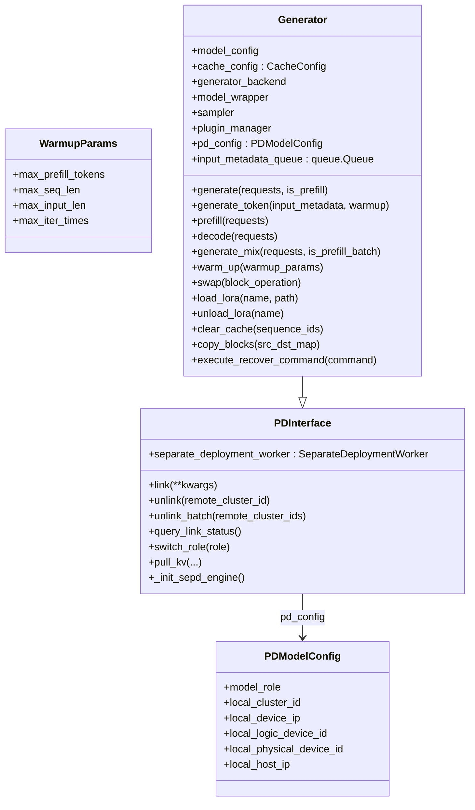

# `Generator` (and `PDInterface`, `PDModelConfig`, `WarmupParams`)

## Summary
`Generator` 是 MindIE-LLM 的"**生成层主对象**"——一个进程一个实例，对应 vLLM 的 `EngineCore` 角色。它在 `__init__` 期间装配整套生成栈（backend / sampler / plugin_manager / cache_config / KV pool / sepd worker），运行时通过 `generate_token` 完成"preprocess → forward → sample → stop check"一个迭代。继承自 `PDInterface`，所以同时是 PD 分离的 link/unlink/pull_kv 入口。

## Sources
- 全文：[d:\design\MindIE-LLM\mindie_llm\text_generator\generator.py](d:\design\MindIE-LLM\mindie_llm\text_generator\generator.py)（约 1438 行）

## 类层次

## `WarmupParams` （[generator.py:79-91](d:\design\MindIE-LLM\mindie_llm\text_generator\generator.py)）

dataclass：`max_prefill_tokens=4096`, `max_seq_len=2560`, `max_input_len=1`, `max_iter_times=2560`，`__post_init__` 强制为正整数。

## `PDModelConfig` （[generator.py:93-112](d:\design\MindIE-LLM\mindie_llm\text_generator\generator.py)）

从 `model_config` 字典抽出 PD 相关字段：

| 字段 | 来源键 | 默认 |
|---|---|---|
| `model_role` | `role` | `"standard"` |
| `local_cluster_id` | `local_instance_id` | 0 |
| `local_device_ip` | `local_device_ip` | None |
| `local_logic_device_id` | `npu_device_id` | 0 |
| `local_physical_device_id` | `local_physical_device_id` | 0 |
| `local_host_ip` | `local_host_ip` | None |

`role` 取值见 `DmiModeNodeRole` 枚举（[separate_deployment_engine.py:94-110](d:\design\MindIE-LLM\mindie_llm\text_generator\utils\separate_deployment_engine.py)）：`PREFILL` / `DECODER` / `FLEX` / `STANDARD`。

## `PDInterface` （[generator.py:113-200](d:\design\MindIE-LLM\mindie_llm\text_generator\generator.py)）

是 PD 分离的接口契约。`Generator` 继承它后获得 link / unlink / pull_kv 一组方法。下层通过 `self.separate_deployment_worker`（`SeparateDeploymentWorker` 实例）转发到 Ascend `LLMDataDist` SDK。

| API | 行号 | 实现要点 |
|---|---|---|
| `__init__(pd_config)` | [119-125](d:\design\MindIE-LLM\mindie_llm\text_generator\generator.py) | 存 pd_config、初始化 `self.separate_deployment_worker = None` |
| `link(**kwargs)` | [126-137](d:\design\MindIE-LLM\mindie_llm\text_generator\generator.py) | 转发到 worker.link |
| `unlink(remote_cluster_id)` | [138-141](d:\design\MindIE-LLM\mindie_llm\text_generator\generator.py) | 单链断开 |
| `unlink_batch(remote_cluster_ids)` | [142-145](d:\design\MindIE-LLM\mindie_llm\text_generator\generator.py) | 批量断开 |
| `query_link_status()` | [146-149](d:\design\MindIE-LLM\mindie_llm\text_generator\generator.py) | 返回各 ip 的 waiting/running/success/failed |
| `switch_role(role)` | [150-152](d:\design\MindIE-LLM\mindie_llm\text_generator\generator.py) | 在 prefill / decoder / flex 间切换 |
| `pull_kv(...)` | [153-176](d:\design\MindIE-LLM\mindie_llm\text_generator\generator.py) | 从远端 cluster pull blocks（**KV 传输的实际入口**） |
| `_init_sepd_engine()` | [177-200](d:\design\MindIE-LLM\mindie_llm\text_generator\generator.py) | 实例化 `SeparateDeploymentWorker(...)` |

## `Generator.__init__` 装配序列 （[generator.py:212-540](d:\design\MindIE-LLM\mindie_llm\text_generator\generator.py)）

按代码顺序：

1. **配置解析**（[212-274](d:\design\MindIE-LLM\mindie_llm\text_generator\generator.py)）— `cpu_mem`, `npu_mem`, `block_size`, `max_seq_len`, `max_iter_times`, `max_input_len`, `max_batch_size`, `max_prefill_batch_size`, `max_n=128`, `max_prefill_tokens`, `soc_version`, `ignore_eos`, `tokenizer_sliding_window_size=3`, `trust_remote_code`, `distributed_enable`, `enable_warmup_with_sampling=True`
2. **PD 子配置**（[275-281](d:\design\MindIE-LLM\mindie_llm\text_generator\generator.py)）— 创建 `PDModelConfig` + `super().__init__(self.pd_config)`
3. **混合 batch 标志**（[278](d:\design\MindIE-LLM\mindie_llm\text_generator\generator.py)）— `is_mix_model = enable_split`
4. **NPU 监控**（[282-283](d:\design\MindIE-LLM\mindie_llm\text_generator\generator.py)）— `NpuMemoryWatcher` + `input_metadata_queue: queue.Queue`
5. **Plugin 解析**（[285-301](d:\design\MindIE-LLM\mindie_llm\text_generator\generator.py)）— `speculation_gamma → max_generated_tokens`、`PluginParameterValidator.validate(plugin_params)` → `(plugin_config, is_mix_model, plugin_list)`、设置 `enable_mtp` / `enable_prefix_cache`、把 `inference_mode = InferenceMode(...)` 写回 model_config
6. **后端选择**（[303-310](d:\design\MindIE-LLM\mindie_llm\text_generator\generator.py)）— `backend_type` (默认 atb)；若 `torch` → `ENV.model_runner_exp = True`；解析 `rank` / `world_size` / `local_rank` / `npu_device_id`
7. **async / kv_pool 选项**（[311-329](d:\design\MindIE-LLM\mindie_llm\text_generator\generator.py)）— `kv_pool_async_write`、`async_inference`（受 ENV 控制）、splitfuse + async mempool 的不兼容检查
8. **Layerwise disaggregated**（[330-349](d:\design\MindIE-LLM\mindie_llm\text_generator\generator.py)）— `layerwiseDisaggregated` / `layerwiseDisaggregatedRoleType` / `lwd_multi_nodes_enable`，写回 model_config
9. **加载模型 + 估算权重内存**（[351-360](d:\design\MindIE-LLM\mindie_llm\text_generator\generator.py)）— `with WeightMemoryProfiler() as prof: self.generator_backend = get_generator_backend(model_config)` ；记录 `model_memory_usage = prof.model_weight`
10. **从 backend 提取关键对象**（[361-376](d:\design\MindIE-LLM\mindie_llm\text_generator\generator.py)）— `model_wrapper`, `sampler`, `model_info`, `tokenizer`, `max_position_embeddings`, `to_tensor`, `vocab_size`, `warmup_topk_size`, `enable_dap`, `obfuscation_func`；并行尺寸 `dp_size`/`sp_size`/`cp_size`/`scp_size`
11. **CacheConfig 构造**（[377-386](d:\design\MindIE-LLM\mindie_llm\text_generator\generator.py)）
12. **特殊 token 处理**（[388-447](d:\design\MindIE-LLM\mindie_llm\text_generator\generator.py)）— `eos_token_id`、`pad_token_id`、`bos_token_id`，含混淆函数处理（`obfuscation_func.token_obf`），并按 `max_n + num_eos + 1` 调整 warmup_topk_size
13. **Sampler 初始化**（[449](d:\design\MindIE-LLM\mindie_llm\text_generator\generator.py)）— `self.generator_backend.init_sampler(self.cache_config.eos_token_id)`
14. **LoRA 与 splitfuse 的兼容性检查**（[451-462](d:\design\MindIE-LLM\mindie_llm\text_generator\generator.py)）
15. **多模态相关**（[463-473](d:\design\MindIE-LLM\mindie_llm\text_generator\generator.py)）— `is_multimodal`，与 memory_decoding 冲突；`is_separated_pd` 由 role 计算
16. **Plugin manager 初始化**（[488-500](d:\design\MindIE-LLM\mindie_llm\text_generator\generator.py)）— 在 `_temporarily_disable(async_inference=..., mem_pool=...)` 上下文里算 block_mem、`_update_kvcache_settings` 后调 `_init_plugin_manager(kvcache_settings, plugin_list, plugin_config)`

剩余初始化（500-540）：剩余 plugin 元数据、warmup 触发条件等（待 ingest 时细化）。

## `generate_token` 核心方法 （[generator.py:580-716](d:\design\MindIE-LLM\mindie_llm\text_generator\generator.py)）

文档字符串明确："**The key method called by the `BatchScheduler`**"——一个 batch 一次 iteration 的入口（[generator.py:583-585](d:\design\MindIE-LLM\mindie_llm\text_generator\generator.py)）。流程：

1. **batch 限制校验**（[591-612](d:\design\MindIE-LLM\mindie_llm\text_generator\generator.py)）— 计算 `input_ids_length` 与 `batch_size`，对比 `max_prefill_tokens`、调 `check_batch_size_limit`
2. **profiling 起点**（[614-617](d:\design\MindIE-LLM\mindie_llm\text_generator\generator.py)）— `span_start("generate_token", level=DETAILED)`
3. **PD-Decoder 侧的 input_metadata 排空**（[619-635](d:\design\MindIE-LLM\mindie_llm\text_generator\generator.py)）— 当 `model_role in [DECODER, FLEX]` 且非 prefill 且 `input_metadata_queue` 非空时，把队列里所有的 `input_metadata` 一次性 compose（`is_pd_separate=True`），并按需调 `configure_sampler`。**这是 PD 分离的 decoder 端"接收 prefill 端推过来的 metadata"的关键**
4. **plugin_manager 路由**（[636-650](d:\design\MindIE-LLM\mindie_llm\text_generator\generator.py)）：
   - `async_inference` 路径：拒绝 layerwise+disaggregated 组合 → `plugin_manager.generate_token_async(...)`
   - 同步路径：`plugin_manager.generate_token(...)`
   - `plugin_manager is None` → `NotImplementedError`
5. **空 output 早返**（[651-652](d:\design\MindIE-LLM\mindie_llm\text_generator\generator.py)）
6. **benchmark hook**（[654-666](d:\design\MindIE-LLM\mindie_llm\text_generator\generator.py)）— `timer.log_time` / `log_time_async`
7. **collate 输出**（[668](d:\design\MindIE-LLM\mindie_llm\text_generator\generator.py)）
8. **异常分类处理**（[669-712](d:\design\MindIE-LLM\mindie_llm\text_generator\generator.py)）：
   - `NotImplementedError`：清 KV 后 raise
   - `ErrorCodeException` (warmup 期 OOM)：转 RuntimeError
   - `torch.OutOfMemoryError`：日志提示可能是 HCCL 触发，给出排查 ENV
   - 通用异常：转 ErrorCode 后包装为 ErrorCodeException；inference_pause 模式下识别 `is_force_stop_exception` 后返 empty
9. **profiling 结束**（[714-715](d:\design\MindIE-LLM\mindie_llm\text_generator\generator.py)）

## `generate` / `prefill` / `decode` / `generate_mix`

| 方法 | 行号 | 说明 |
|---|---|---|
| `generate(requests, is_prefill)` | [718-740](d:\design\MindIE-LLM\mindie_llm\text_generator\generator.py) | 把 `List[Request]` 拼成 padded `block_tables` → `InputMetadata.from_requests` → `generate_token` |
| `prefill(requests)` | [742-744](d:\design\MindIE-LLM\mindie_llm\text_generator\generator.py) | `generate(requests, is_prefill=True)` |
| `decode(requests)` | [746-748](d:\design\MindIE-LLM\mindie_llm\text_generator\generator.py) | `generate(requests, is_prefill=False)` |
| `generate_mix(requests, is_prefill_batch)` | [750-756](d:\design\MindIE-LLM\mindie_llm\text_generator\generator.py) | 混合 batch（splitfuse） |

> synthesis: 这是 MindIE 与 vLLM 一个明显差异——vLLM 的 step 是 scheduler 驱动的，prefill / decode 一个统一抽象；MindIE 把 prefill / decode / mix 暴露为三个并列入口，scheduler 在更上层（connector 层）。

## warmup（[generator.py:757-818](d:\design\MindIE-LLM\mindie_llm\text_generator\generator.py)）

入口签名 `warm_up(warmup_params: WarmupParams) -> float | int`。内部使用 `_warmup_prefill` / `_warmup_decode` / `_warmup_standard` / `_warmup_specified` / `_auto_warmup_*` 等多种策略（[generator.py:1107-1306](d:\design\MindIE-LLM\mindie_llm\text_generator\generator.py)）。返回值是已分配的 NPU 内存（GiB）。

## 其它运维 API

| 方法 | 行号 | 说明 |
|---|---|---|
| `swap(block_operation)` | [819-829](d:\design\MindIE-LLM\mindie_llm\text_generator\generator.py) | KV block 在 device/host 间换出换入 |
| `load_lora(name, path)` | [830-852](d:\design\MindIE-LLM\mindie_llm\text_generator\generator.py) | 在线加载 LoRA |
| `unload_lora(name)` | [853-867](d:\design\MindIE-LLM\mindie_llm\text_generator\generator.py) | 卸载 |
| `execute_recover_command(command)` | [868-956](d:\design\MindIE-LLM\mindie_llm\text_generator\generator.py) | 故障恢复指令派发 |
| `_temporarily_disable(...)` | [957-976](d:\design\MindIE-LLM\mindie_llm\text_generator\generator.py) | 上下文管理器，临时禁掉某些特性 |
| `_init_plugin_manager(...)` | [977-1025](d:\design\MindIE-LLM\mindie_llm\text_generator\generator.py) | plugin_manager 装配 |
| `clear_cache(sequence_ids)` | [550-555](d:\design\MindIE-LLM\mindie_llm\text_generator\generator.py) | 释放 KV blocks |
| `copy_blocks(src_dst_map)` | [556-564](d:\design\MindIE-LLM\mindie_llm\text_generator\generator.py) | block 拷贝 |

## Notes / Caveats
> [!todo] VERIFY: `BatchScheduler` 在调用栈中的实际位置（注释提到，但代码中未见 import；可能在 connector 或 server 层）。
> [!todo] VERIFY: `obfuscation_func.token_obf` 的语义（出现在多处 token_id 处理时，安全敏感）。
> [!todo] VERIFY: `is_force_stop_exception` 与 `inference_pause` 状态机（[generator.py:707-712](d:\design\MindIE-LLM\mindie_llm\text_generator\generator.py)）。
> [!warning] CONTRADICTION: 注释 [generator.py:487-488](d:\design\MindIE-LLM\mindie_llm\text_generator\generator.py) 说"Warmup async inference will lead to lower mtp acceptance rate with unknown reason"——这是已知未解的 bug。

## See also
- [modules/text_generator.md](../modules/text_generator.md)
- [entities/ModelRunner.md](ModelRunner.md)
- [topics/request-lifecycle.md](../topics/request-lifecycle.md)
- [topics/aclgraph-pp.md](../topics/aclgraph-pp.md)
