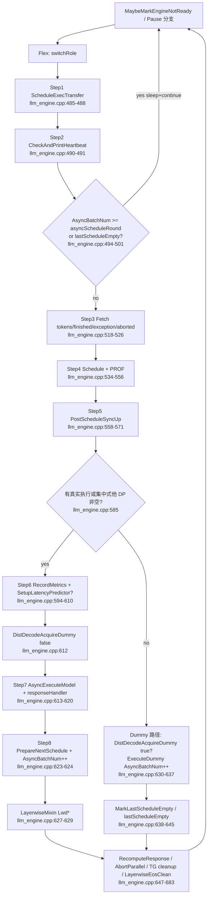

# `LlmEngine` (MindIE C++)

## Summary

`LlmEngine`（`mindie_llm::LlmEngine`，`final` 继承 `ILlmEngine`）是 **LlmManagerV2 持有的调度引擎**：为每个 DP rank 建 `EnginePerDP`（调度线程 + `Scheduler` + `IModelExecutor` + `ModelExecOutputHandler` 等），在 `SchedulerThreadEntry` 中跑 **主循环**——先做 PD 分离下的 `ScheduleExecTransfer`，再 **Fetch 上一轮执行结果 → `Schedule(needSync)` → `PostScheduleSyncUp` → `AsyncExecuteModel` + callback**，并用 `GetAsyncBatchNum` 与 `asyncScheduleRound` 控制异步在途 batch 数。

> synthesis：wiki 里 "sync/async 调度"在 C++ 侧是 **两层**：(1) `needSync` 只表示 **跨 DP 是否需要集合通信同步 batch 元信息**（见 [llm_engine.cpp:462](d:\design\MindIE-LLM\src\engine\llm_engine.cpp)）；(2) `activateAsyncInference` 在 `Scheduler` 里抬高 `maxScheduledBatch_`（见 [scheduler.cpp:126-128](d:\design\MindIE-LLM\src\scheduler\scheduler.cpp)），与引擎循环里的 `AsyncExecuteModel` / `asyncBatchNum_` **配合**但不等同。

## Sources

| 用途 | 路径 |
|------|------|
| 类与主循环 | [d:\design\MindIE-LLM\src\engine\llm_engine.h](d:\design\MindIE-LLM\src\engine\llm_engine.h), [d:\design\MindIE-LLM\src\engine\llm_engine.cpp](d:\design\MindIE-LLM\src\engine\llm_engine.cpp) |
| 抽象接口 | [d:\design\MindIE-LLM\src\include\engine\illm_engine.h](d:\design\MindIE-LLM\src\include\engine\illm_engine.h) |
| `SchedulerConfig` | [d:\design\MindIE-LLM\src\include\config\config_info.h](d:\design\MindIE-LLM\src\include\config\config_info.h) |
| `MAX_ASYNC_SCHEDULE_TIMES` | [ischeduler.h:34](d:\design\MindIE-LLM\src\include\scheduler\ischeduler.h) |
| 执行回调 | [d:\design\MindIE-LLM\src\engine\model_exec_output_handler.cpp](d:\design\MindIE-LLM\src\engine\model_exec_output_handler.cpp) |
| 工厂与 Manager | [llm_engine.cpp:839-842](d:\design\MindIE-LLM\src\engine\llm_engine.cpp), [llm_manager_impl.cpp:1219-1250](d:\design\MindIE-LLM\src\llm_manager_v2\impl\llm_manager_impl.cpp) |
| Layerwise 辅助 | [d:\design\MindIE-LLM\src\include\layerwise_mixin\layerwise_mixin.h](d:\design\MindIE-LLM\src\include\layerwise_mixin\layerwise_mixin.h) |

## 类层次

- **定义**：[llm_engine.h:78-207](d:\design\MindIE-LLM\src\engine\llm_engine.h)：`class LlmEngine final : public ILlmEngine`。
- **接口基类** `ILlmEngine`：[illm_engine.h:30-60](d:\design\MindIE-LLM\src\include\engine\illm_engine.h)（纯虚：进程组、线程、请求、中止、KV 释放、Stop、Pause/Resume、恢复命令、指标、prefill 比例等）。
- **工厂**：`MakeLlmEngine` → `std::make_unique<LlmEngine>(...)`（[llm_engine.cpp:839-842](d:\design\MindIE-LLM\src\engine\llm_engine.cpp)）。

### 主要 public 方法（`LlmEngine` 相对 `ILlmEngine` 的增量）

头文件在 `ILlmEngine` 之外还声明了例如 `SendAbortResponse`、`DistDecodeAcquireDummyQuota`（[llm_engine.h:91-111](d:\design\MindIE-LLM\src\engine\llm_engine.h)）。与生命周期强相关：

| 方法 | 锚点 | 作用 |
|------|------|------|
| 构造 | [llm_engine.cpp:36-101](d:\design\MindIE-LLM\src\engine\llm_engine.cpp) | 建 `schedulerConfig_`、每 DP 的 `EnginePerDP`、`MakeScheduler`、`ModelExecOutputHandler`、`TransferOutputHandler`、可选 `LoadBalancer`、`LoraManager::Initialize` |
| `InitProcessGroup` | [llm_engine.cpp:274-300](d:\design\MindIE-LLM\src\engine\llm_engine.cpp) | `ProcessGroup::GetInstance(...)`，`isProcessGroupInit = true` |
| `StartEngineThread` | [llm_engine.cpp:251-272](d:\design\MindIE-LLM\src\engine\llm_engine.cpp) | 每 DP `std::thread(SchedulerThreadEntry)`；D+`distributedEnable` 时建 `DummyQuotaManager` |
| `Stop` | [llm_engine.cpp:205-209](d:\design\MindIE-LLM\src\engine\llm_engine.cpp) | `stop_ = true` |
| 析构 | [llm_engine.cpp:103-111](d:\design\MindIE-LLM\src\engine\llm_engine.cpp) | `Stop()` + `join` 各 `schedulerThread` |

### 析构与资源释放

- [llm_engine.cpp:103-111](d:\design\MindIE-LLM\src\engine\llm_engine.cpp)：`~LlmEngine()` 调用 `Stop()`，再对每个 `enginePerDP->schedulerThread` `join()`。

> synthesis：线程外资源（executor、scheduler 等）由 `shared_ptr`/`unique_ptr` 成员析构；无额外显式 teardown API。

## 关键数据结构

### `EnginePerDP` / `enginePerDPs_`

定义 [llm_engine.h:47-73](d:\design\MindIE-LLM\src\engine\llm_engine.h)：

| 字段 | 类型（摘要） | 角色 |
|------|----------------|------|
| `schedulerThread` | `std::thread` | 每 DP 一条调度线程 |
| `latencypredictor` | `std::shared_ptr<LatencyPredictor>` | 延迟预测（stage policy / dynamic batch） |
| `scheduler` | `SchedulerPtr` | `IScheduler` 实现 |
| `modelExecutor` | `IExecutorSPtr` | 异步执行模型 |
| `modelExecOutputHandler` | `std::unique_ptr<ModelExecOutputHandler>` | executor 回调入口、`asyncBatchNum_` |
| `transferOutputHandler` | `std::unique_ptr<TransferOutputHandler>` | PD KV transfer 回调侧 |
| `abortedRequestIds` | `ConcurrentDeque<RequestId>` | abort 待调度侧消费 |
| `abortRespToManagerCall` | `ForwardRespToManagerCall` | 回 LlmManager 的 response 回调 |
| `dummyQuotaManagerSPtr_` | `DummyQuotaManagerSPtr` | 分布式 D 上 dummy 配额（[llm_engine.cpp:262-264](d:\design\MindIE-LLM\src\engine\llm_engine.cpp) 创建） |
| `TGCleanupSeqIds_` | `std::unordered_set<SequenceId>` | TextGenerator 清理 |
| `lastNonEmptyScheduleSteadyMs_` | `std::atomic<uint64_t>` | 仅 P：`llmEngineReady_` 心跳（[llm_engine.h:71-72](d:\design\MindIE-LLM\src\engine\llm_engine.h), [llm_engine.cpp:217-248](d:\design\MindIE-LLM\src\engine\llm_engine.cpp)） |

`enginePerDPs_`：[llm_engine.h:155](d:\design\MindIE-LLM\src\engine\llm_engine.h) `std::vector<EnginePerDPSPtr>`。

### `schedulerConfig_`（`SchedulerConfigSPtr`）

见下文"配置依赖"；引擎内典型读取：`distributedEnable`、`dpSize`、`layerwiseDisaggregated`、`maxDispatchBatchNum`、`activateAsyncInference`、`stageSelectPolicy`、`dynamicBatchSizeEnable` 等（分散于 [llm_engine.cpp](d:\design\MindIE-LLM\src\engine\llm_engine.cpp)）。

### `LayerwiseMixin`（`LlmEngine` 侧）

- 成员 [llm_engine.h:207](d:\design\MindIE-LLM\src\engine\llm_engine.h)：`LayerwiseMixin layerwiseMixin_`。
- 引擎内调用：[llm_engine.cpp:627-629](d:\design\MindIE-LLM\src\engine\llm_engine.cpp) `LwdPrepareBatch` / `LwdEngineAddBatchCnt`；`LayerwiseEosClean` [llm_engine.cpp:435-455](d:\design\MindIE-LLM\src\engine\llm_engine.cpp)。
- 方法列表（另一处 `LayerwiseMixin` 也在 `Scheduler` 中使用）：[layerwise_mixin.h:24-44](d:\design\MindIE-LLM\src\include\layerwise_mixin\layerwise_mixin.h)。

### DP 相关标志（引擎线程入口）

[llm_engine.cpp:460-462](d:\design\MindIE-LLM\src\engine\llm_engine.cpp)：

- `isCentralizedThreadCCReady_ = enginePerDPs_.size() > 1` —— **集中式多 DP**（同进程多线程）。
- `isDistributedPNodeProcessCCReady_ = schedulerConfig_->distributedEnable && isProcessGroupInit && role_ == Role::P` —— **分布式多节点 P** 且进程组已初始化。
- `needSync = isDistributedPNodeProcessCCReady_ || isCentralizedThreadCCReady_`。

`dpRankId_`：构造里在 `distributedEnable` 时由 `globalRankIds`/`globalWorldSize` 计算（[llm_engine.cpp:44-51](d:\design\MindIE-LLM\src\engine\llm_engine.cpp)）；非分布式时子引擎循环用本地 index（[llm_engine.cpp:69](d:\design\MindIE-LLM\src\engine\llm_engine.cpp)）。

## 主循环全貌（`SchedulerThreadEntry`）

**函数**：[llm_engine.cpp:457-696](d:\design\MindIE-LLM\src\engine\llm_engine.cpp)（`while (!stop_)`）。

### Mermaid（8 步 + 分支）

### 与任务清单逐步锚点对应

| Step | 内容 | 锚点 |
|------|------|------|
| 1 | PD：`ScheduleExecTransfer`（循环内调用） | [llm_engine.cpp:485-488](d:\design\MindIE-LLM\src\engine\llm_engine.cpp)；完整实现 [698-737](d:\design\MindIE-LLM\src\engine\llm_engine.cpp) |
| 2 | 心跳日志 | `CheckAndPrintHeartbeat` 内 [llm_engine.h:191-202](d:\design\MindIE-LLM\src\engine\llm_engine.h)，调用 [llm_engine.cpp:490-491](d:\design\MindIE-LLM\src\engine\llm_engine.cpp) |
| 3 | 异步轮次 + `needSync` 定义 | `asyncScheduleRound` [llm_engine.cpp:494-495](d:\design\MindIE-LLM\src\engine\llm_engine.cpp)；门控 [497-501](d:\design\MindIE-LLM\src\engine\llm_engine.cpp)；`needSync` **在循环前** [462](d:\design\MindIE-LLM\src\engine\llm_engine.cpp) |
| 4 | Fetch 系列 | [llm_engine.cpp:520-526](d:\design\MindIE-LLM\src\engine\llm_engine.cpp) |
| 5 | `Schedule(needSync)` | [llm_engine.cpp:534-536](d:\design\MindIE-LLM\src\engine\llm_engine.cpp) |
| 6 | `PostScheduleSyncUp` | [llm_engine.cpp:558-560](d:\design\MindIE-LLM\src\engine\llm_engine.cpp) |
| 7 | `BuildExecuteModelRequest` + `AsyncExecuteModel` | `BuildExecuteModelRequest` 调用 [595](d:\design\MindIE-LLM\src\engine\llm_engine.cpp)；`AsyncExecuteModel` [613-614](d:\design\MindIE-LLM\src\engine\llm_engine.cpp) |
| 8 | `PrepareNextSchedule` + `fetch_add(1)` | [llm_engine.cpp:623-624](d:\design\MindIE-LLM\src\engine\llm_engine.cpp) |
| — | 错误 / dummy / chase | `responseHandler` 错误 → `PauseScheduling` [llm_engine.cpp:575-580](d:\design\MindIE-LLM\src\engine\llm_engine.cpp)；dummy 分支 [630-637](d:\design\MindIE-LLM\src\engine\llm_engine.cpp)；`lastScheduleEmpty` [644-645](d:\design\MindIE-LLM\src\engine\llm_engine.cpp) |

循环前置：`MaybeMarkEngineNotReadyIfAllSchedulersEmptyTooLong` [llm_engine.cpp:471](d:\design\MindIE-LLM\src\engine\llm_engine.cpp)；`isPauseScheduling_` 分支 [473-478](d:\design\MindIE-LLM\src\engine\llm_engine.cpp)。

## sync vs async 分支

### A. `needSync`（跨 DP 同步 scheduling **元数据**）

- 定义 [llm_engine.cpp:460-462](d:\design\MindIE-LLM\src\engine\llm_engine.cpp)。
- 传入 `scheduler->Schedule(needSync)` [llm_engine.cpp:536](d:\design\MindIE-LLM\src\engine\llm_engine.cpp)。

> synthesis：与 [comparison/topics/sync-schedule.md](../../comparison/topics/sync-schedule.md) 一致：**不是** "禁用 AsyncExecuteModel"，而是 **Scheduler 内**是否做跨 rank 同步以统一 batch 信息/优先级。

### B. `activateAsyncInference`（Scheduler 内 `maxScheduledBatch_`）

- [scheduler.cpp:123-128](d:\design\MindIE-LLM\src\scheduler\scheduler.cpp)：`asyncScheduleRound = layerwiseDisaggregated ? maxDispatchBatchNum : MAX_ASYNC_SCHEDULE_TIMES`（`MAX_ASYNC_SCHEDULE_TIMES=1`：[ischeduler.h:34](d:\design\MindIE-LLM\src\include\scheduler\ischeduler.h)）；若 `activateAsyncInference` 则 `maxScheduledBatch_ = asyncScheduleRound + 1`。
- 默认值注入：[llm_manager_impl.cpp:1240](d:\design\MindIE-LLM\src\llm_manager_v2\impl\llm_manager_impl.cpp)：`schedulerConfig.activateAsyncInference = (modelConfigs_[0]["asyncBatchscheduler"] == "true")`。

### C. 引擎循环内"在途 batch"门控

- [llm_engine.cpp:494-501](d:\design\MindIE-LLM\src\engine\llm_engine.cpp)：`GetAsyncBatchNum() >= asyncScheduleRound` 则 sleep 并 `continue`。其中 `asyncScheduleRound` 与 `Scheduler` 构造函数使用同一公式（`layerwiseDisaggregated` → `maxDispatchBatchNum`，否则 `MAX_ASYNC_SCHEDULE_TIMES`）。

> synthesis：**sync 路径**下 `MAX_ASYNC_SCHEDULE_TIMES=1` → 门控阈值为 1，配合 `asyncBatchNum_` 增减，等效"每帧最多 1 个在途"（与 wiki "maxScheduledBatch_=1" 叙述一致）；**async inference 打开**时 Scheduler 侧 `maxScheduledBatch_` 变为 `asyncScheduleRound+1`（通常 2），引擎门控阈仍为 `asyncScheduleRound`，与"最多 `asyncScheduleRound+1` 个 in-flight"叙述需对照 **`asyncBatchNum_` 在 callback 递减** 一起理解（见下节）。

## callback 机制

### `responseHandler` lambda

[llm_engine.cpp:575-583](d:\design\MindIE-LLM\src\engine\llm_engine.cpp)：

- 若 `output->has_err_msg()`：打日志、`ErrorQueue::EnqueueErrorMessage`、`PauseScheduling()`、`return`。
- 否则：`enginePerDP->modelExecOutputHandler->Entry4Executor(output)`。

### `Entry4Executor`

[model_exec_output_handler.cpp:80+](d:\design\MindIE-LLM\src\engine\model_exec_output_handler.cpp)：解析 protobuf 输出、构造/缓冲 `Response`、`layerwiseMixin_.LwdProcessResponse` 等；**`outputs_size()==0` 时视为 dummy**，`asyncBatchNum_.fetch_sub(1)`（[model_exec_output_handler.cpp:86-88](d:\design\MindIE-LLM\src\engine\model_exec_output_handler.cpp)）；正常路径末尾 `asyncBatchNum_.fetch_sub(1)`（[model_exec_output_handler.cpp:160](d:\design\MindIE-LLM\src\engine\model_exec_output_handler.cpp)）。

### `PauseScheduling` 触发条件

- [llm_engine.cpp:423-426](d:\design\MindIE-LLM\src\engine\llm_engine.cpp)：`isPauseScheduling_.store(true)`。
- 主循环中若 pause：[llm_engine.cpp:473-478](d:\design\MindIE-LLM\src\engine\llm_engine.cpp) `StopRunningRequest`、abort 并行 seq 等。
- **executor 错误回调**路径：[llm_engine.cpp:575-580](d:\design\MindIE-LLM\src\engine\llm_engine.cpp)。

## DP 协同

### `PostScheduleSyncUp`

- **声明**：[llm_engine.h:144-145](d:\design\MindIE-LLM\src\engine\llm_engine.h)。
- **实现**：[llm_engine.cpp:334-377](d:\design\MindIE-LLM\src\engine\llm_engine.cpp)：
  - `needSync`：`PostScheduler::SyncBatchInfo` 更新 `metas.maxBatchSize/maxSeqLen`。
  - `isDistributedPNodeProcessCCReady_`：`PostScheduler::SyncSeqLenList`（进程级 DP padding）。
  - `isCentralizedThreadCCReady_`：`PostScheduler::AllGatherBatchesAcrossDPs`。
- 返回 `SchOutDataPair`：`allDpMetas` / `allDpOuts` 供 `BuildExecuteModelRequest` 遍历（[llm_engine.cpp:765-777](d:\design\MindIE-LLM\src\engine\llm_engine.cpp)）。

### 集中式多 DP vs 分布式 P 节点

- **线程级 CC**：`isCentralizedThreadCCReady_` —— [llm_engine.cpp:460](d:\design\MindIE-LLM\src\engine\llm_engine.cpp)。
- **进程级 CC**：`isDistributedPNodeProcessCCReady_` —— [llm_engine.cpp:461](d:\design\MindIE-LLM\src\engine\llm_engine.cpp)；依赖 `InitProcessGroup` 设置 `isProcessGroupInit`（[llm_engine.cpp:274-291](d:\design\MindIE-LLM\src\engine\llm_engine.cpp)）。

### `DistDecodeAcquireDummyQuota` / `ExecuteDummy`

- `DistDecodeAcquireDummyQuota`：[llm_engine.cpp:408-421](d:\design\MindIE-LLM\src\engine\llm_engine.cpp)；真实 batch 前 `false`（[612](d:\design\MindIE-LLM\src\engine\llm_engine.cpp)），dummy 分支 `true`（[632](d:\design\MindIE-LLM\src\engine\llm_engine.cpp)）。
- `ExecuteDummy`：[llm_engine.cpp:388-400](d:\design\MindIE-LLM\src\engine\llm_engine.cpp)，构造 `ForwardMode::DUMMY` 的 request 并 `AsyncExecuteModel`（[394-395](d:\design\MindIE-LLM\src\engine\llm_engine.cpp)）。
- dummy 分支与 `seqGroupMetadata.maxBatchSize`、`DistDecodeAcquireDummyQuota`：[llm_engine.cpp:630-637](d:\design\MindIE-LLM\src\engine\llm_engine.cpp)。

## PD 分离专用

### `ScheduleExecTransfer`（循环内 + 完整实现）

- **调用点**（主循环）：[llm_engine.cpp:485-488](d:\design\MindIE-LLM\src\engine\llm_engine.cpp)。
- **实现**：[llm_engine.cpp:698-737](d:\design\MindIE-LLM\src\engine\llm_engine.cpp)：`role_ == PnD || FlexPnD` 则直接 return（[701-703](d:\design\MindIE-LLM\src\engine\llm_engine.cpp)）；否则 `KVPulledReqEnterRunningQueue`、`ScheduleTransfer()`、可能 `ExecuteKVTransfer` + `transferOutputHandler->Entry4Executor`。

### `layerwiseDisaggregated` 路径（引擎内）

- Fetch 后累积 EOS cleanup：[llm_engine.cpp:530-532](d:\design\MindIE-LLM\src\engine\llm_engine.cpp)。
- Schedule 后日志与 PROF：[550-554](d:\design\MindIE-LLM\src\engine\llm_engine.cpp)。
- `PostScheduleSyncUp` 后统一 forwardMode：[562-571](d:\design\MindIE-LLM\src\engine\llm_engine.cpp)。
- `LayerwiseMixin`：[627-629](d:\design\MindIE-LLM\src\engine\llm_engine.cpp)。
- `LayerwiseEosClean`：[682-683 / 函数体 435-455](d:\design\MindIE-LLM\src\engine\llm_engine.cpp)。

## 引擎度量与监控

| 项 | 锚点 |
|----|------|
| `RecordEngineMetrics` | [llm_engine.cpp:596](d:\design\MindIE-LLM\src\engine\llm_engine.cpp), 空批分支 [639](d:\design\MindIE-LLM\src\engine\llm_engine.cpp) |
| `SetupLatencyPredictor` | [llm_engine.cpp:606-609](d:\design\MindIE-LLM\src\engine\llm_engine.cpp), 实现 [970-978](d:\design\MindIE-LLM\src\engine\llm_engine.cpp) |
| `PROF` spans | Schedule / PostSchedule / Execute / ExecuteDummy 等 [535-560, 598-620, 633-636](d:\design\MindIE-LLM\src\engine\llm_engine.cpp) |
| 心跳 | `CheckAndPrintHeartbeat` [llm_engine.h:191-202](d:\design\MindIE-LLM\src\engine\llm_engine.h)（`HEARTBEAT_INTERVAL_SECONDS` [36](d:\design\MindIE-LLM\src\engine\llm_engine.h)） |
| 常量 `METRICS_UPDATE_INTERVAL` | [llm_engine.h:37](d:\design\MindIE-LLM\src\engine\llm_engine.h) |

> synthesis：全仓库仅见 `METRICS_UPDATE_INTERVAL` 定义，**未见**于 `llm_engine.cpp` 引用；若写 wiki 需标为"未使用/待查"。

## 配置依赖

### `SchedulerConfig` 全字段

结构体 [config_info.h:399-517](d:\design\MindIE-LLM\src\include\config\config_info.h)（至 `ChooseV2BlockManager()` 前）。**列全**：`instanceId`, `mlfqQueueNum`, `mlfqMinQuantumMs`, `mlfqStarveLimitMs`, `prefillPolicyType`, `decodePolicyType`, `policyType`, `batchPnum`, `dpScheduling`, `worldSize`, `maxPreemptCount`, `supportSelectBatch`, `stageSelectPolicy`, `dynamicBatchSizeEnable`, `prefillTimeMsPerReq`, `decodeTimeMsPerReq`, `maxPrefillBatchSize`, `maxPrefillTokens`, `minPrefillBatchSize`, `maxFirstTokenWaitTime`, `prefillWaitingTimeout`, `lowQPSForWaitBatch`, `waitingCompromiseRatio`, `maxBatchSize`, `maxQueueDelayMicroseconds`, **`activateAsyncInference`**, **`distributedEnable`**, `earlyStoppingIds`, `startThinkingId`, `stopThinkingId`, `npuDeviceIds`, `maxSeqLen`, `maxInputTokenLen`, `eosTokenId`, `maxIterTimes`, `cpuBlockNum`, `npuBlockNum`, `lwdCloudNpuBlockNum`, `speculationGamma`, `globalRankIds`, `globalWorldSize`, `maxLoras`, `maxLoraRank`, `dpSize`, `spSize`, `tpSize`, `cpSize`, `dpRankId_`, `cacheBlockSize`, `kvCacheDescs`, `modelName`, `templateType`, `templateName`, `pipelineNumber`, `logHomePath`, `logLevel`, `logFileSize`, `logFileNum`, `enableSplit`, `splitType`, `splitStartType`, `splitChunkTokens`, `splitStartBatchSize`, chunked prefill 四字段, `enablePrefixCache`, `enableKvPool`, `kvPoolConfig`, buffer response 三字段, **`maxDispatchBatchNum`**, **`layerwiseDisaggregated`**, **`isMultiNodeInfer`**。

### 其它配置结构里的 `activateAsyncInference`（同文件）

- [config_info.h:171, 388, 429](d:\design\MindIE-LLM\src\include\config\config_info.h) —— 便于 grep/对照，**引擎主路径读的是 `SchedulerConfig`**。

## C++↔Python binding

- 工作区 **未发现** `src/python_binding` 下对 `LlmEngine` 的直接 pybind 暴露（检索 `LlmEngine` 于 `*.cpp`/`*.h` 主要为引擎、测试、Manager）。
- **实际装配链**：`LlmManagerImpl::LaunchLlmEngine` 调用 `MakeLlmEngine`（[llm_manager_impl.cpp:1246-1250](d:\design\MindIE-LLM\src\llm_manager_v2\impl\llm_manager_impl.cpp)），再 `InitStaticLoras`、`InitEngineDPProcessGroup`、`StartEngineThread`。
- `ILlmEngine` 接口 [illm_engine.h:30-60](d:\design\MindIE-LLM\src\include\engine\illm_engine.h) 面向 C++ Manager；Python 若存在绑定，更可能在 **Manager 或 server 层**，而非直接 `LlmEngine`。

## 与其它 C++ 实体的关系

| 实体 | 关系 |
|------|------|
| `Scheduler` (`IScheduler`) | 每 DP 一个；`Schedule`/`ScheduleTransfer`/Fetch 系列（主循环 [520-536, 709](d:\design\MindIE-LLM\src\engine\llm_engine.cpp)） |
| `IModelExecutor` | `modelExecutor->AsyncExecuteModel` / `ExecuteKVTransfer` / `AsyncTGCleanup` / `AsyncEOSCleanup`（[llm_engine.cpp](d:\design\MindIE-LLM\src\engine\llm_engine.cpp) 多处） |
| `ModelExecOutputHandler` | 执行回调、队列、`asyncBatchNum_`（[model_exec_output_handler.h](d:\design\MindIE-LLM\src\engine\model_exec_output_handler.h)） |
| `TransferOutputHandler` | PD KV pull 回调（[724-726](d:\design\MindIE-LLM\src\engine\llm_engine.cpp)） |
| `PostScheduler` | DP 同步辅助（`PostScheduleSyncUp` 内） |
| `ProcessGroup` | 分布式集合通信（`InitProcessGroup`、`BuildExecuteModelRequest` 注释 [769-772](d:\design\MindIE-LLM\src\engine\llm_engine.cpp)） |

## Notes / Caveats

> [!todo] VERIFY: `SyncBatchInfoAcrossNodes` 在 [llm_engine.cpp:739-758](d:\design\MindIE-LLM\src\engine\llm_engine.cpp) 定义，**未**在已读 `SchedulerThreadEntry` 片段中调用；与 `PostScheduleSyncUp` 路径并列存在，用途需单独追踪调用方（若有）。
> [!todo] VERIFY: `llmEngineReady_`：仅 `Role::P` 时空调度超时置 false（[llm_engine.cpp:217-248](d:\design\MindIE-LLM\src\engine\llm_engine.cpp)，常量 [llm_engine.h:38-39](d:\design\MindIE-LLM\src\engine\llm_engine.h)）；`LaunchLlmEngine` 末尾也会 `llmEngineReady_.store(true)`（[llm_manager_impl.cpp:1252-1254](d:\design\MindIE-LLM\src\llm_manager_v2\impl\llm_manager_impl.cpp)）。
> [!todo] VERIFY: 测试参考：[d:\design\MindIE-LLM\tests\dlt\it\test_llm_engine.cpp](d:\design\MindIE-LLM\tests\dlt\it\test_llm_engine.cpp)（含 `AsyncBatchNumTest` 等）需对照确认 `asyncBatchNum_` 计数语义。

## See also

- [BatchScheduler.md](BatchScheduler.md)（`Schedule(needSync)` 语义交叉引用）
- [SeparateDeploymentEngine.md](SeparateDeploymentEngine.md)（PD 分离 Python 入口；与本类的 `ScheduleExecTransfer` 协作）
- [comparison/topics/sync-schedule.md](../../comparison/topics/sync-schedule.md)
- [comparison/topics/async-schedule.md](../../comparison/topics/async-schedule.md)
- [comparison/topics/pd-disaggregation.md](../../comparison/topics/pd-disaggregation.md)
- [d:\design\MindIE-LLM\src\llm_manager_v2\impl\llm_manager_impl.cpp](d:\design\MindIE-LLM\src\llm_manager_v2\impl\llm_manager_impl.cpp)（引擎生命周期）
