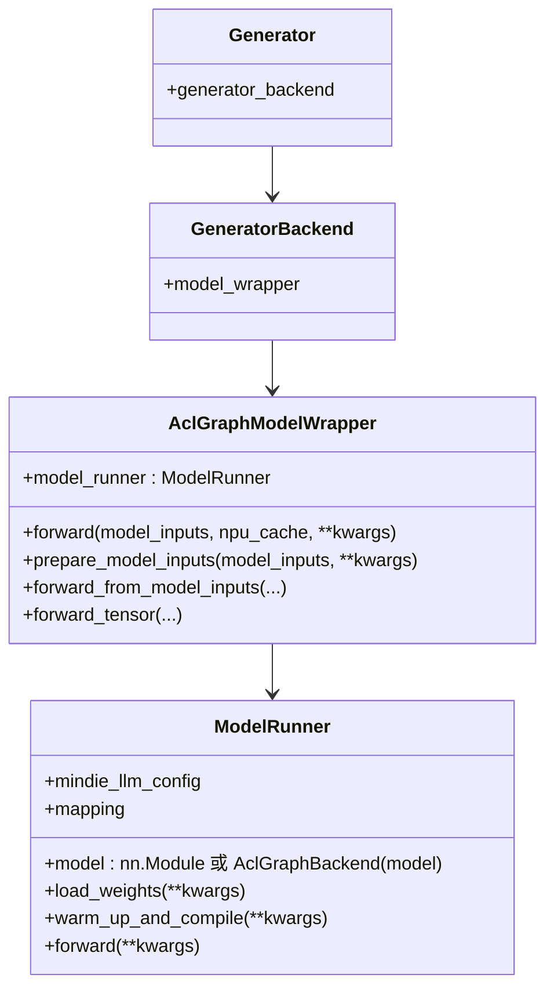
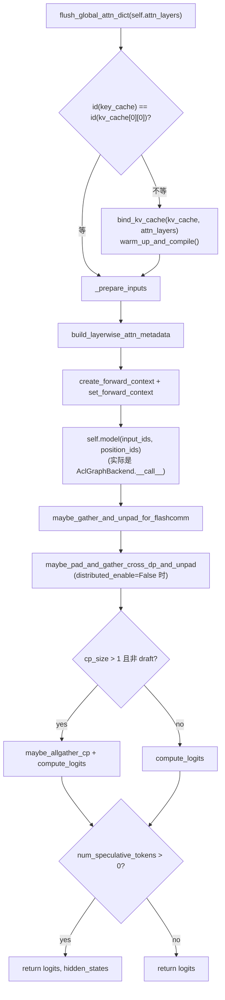

# `ModelRunner` (and `AclGraphModelWrapper`, `pipeline_parallel`)

## Summary
`ModelRunner` 是 "**模型一次 forward + KV cache 绑定 + aclgraph capture/replay**" 的最小执行单元，被 `AclGraphModelWrapper` 持有（[aclgraph_model_wrapper.py:31-56](d:\design\MindIE-LLM\mindie_llm\modeling\model_wrapper\aclgraph\aclgraph_model_wrapper.py)），间接在 `Generator.generator_backend` 下被使用。本页同时覆盖：上层 wrapper 的 `forward` 链路、`pipeline_parallel.py` 的 PP 通信原语（**当前未接入主线**，状态见 [topics/aclgraph-pp.md](../topics/aclgraph-pp.md)）。

## Sources
- 主类：[model_runner.py](d:\design\MindIE-LLM\mindie_llm\runtime\model_runner\model_runner.py)（719 行）
- 上层 wrapper：[aclgraph_model_wrapper.py](d:\design\MindIE-LLM\mindie_llm\modeling\model_wrapper\aclgraph\aclgraph_model_wrapper.py)（289 行）
- PP 草稿：[pipeline_parallel.py](d:\design\MindIE-LLM\mindie_llm\runtime\utils\distributed\pipeline_parallel.py)（39 行）

## 关系链



## `ModelRunner.__init__` （[model_runner.py:49-198](d:\design\MindIE-LLM\mindie_llm\runtime\model_runner\model_runner.py)）

被 `@auto_speculative_method_router(selector_fn=speculative_worker_selector)` 装饰（[model_runner.py:44-45](d:\design\MindIE-LLM\mindie_llm\runtime\model_runner\model_runner.py)），spec decode 时方法会被路由。

构造序列：

1. 解析参数：`model_name_or_path`, `rank`, `world_size`, `npu_id`, `local_rank`, `inference_mode`, `plugin_params`, `num_speculative_tokens`, `distributed_enable`, `max_batch_size`, `model_role`, `max_seq_len`, `block_size` 等（[49-75](d:\design\MindIE-LLM\mindie_llm\runtime\model_runner\model_runner.py)）
2. 设备绑定：`set_device(rank, npu_id)` + `get_npu_node_info()`（[76-77](d:\design\MindIE-LLM\mindie_llm\runtime\model_runner\model_runner.py)）
3. NUMA cpu binding：`bind_cpus(ratio=1.0)`（受 `ENV.bind_cpu` 控制，[80-88](d:\design\MindIE-LLM\mindie_llm\runtime\model_runner\model_runner.py)）
4. 装 `LoadConfig` 字典（90-198）

## `load_weights` （[model_runner.py:200-247](d:\design\MindIE-LLM\mindie_llm\runtime\model_runner\model_runner.py)）

1. 多卡时设 `OMP_NUM_THREADS=1`（[201-202](d:\design\MindIE-LLM\mindie_llm\runtime\model_runner\model_runner.py)）
2. 校验 `max_seq_len <= max_position_embeddings`（[205-209](d:\design\MindIE-LLM\mindie_llm\runtime\model_runner\model_runner.py)）
3. 在 `set_default_torch_dtype + self.device` 上下文里实例化 `self.model = self.model_cls(self.mindie_llm_config)`（[210-213](d:\design\MindIE-LLM\mindie_llm\runtime\model_runner\model_runner.py)）
4. `DefaultModelLoader().load_weights(self.model, model_name_or_path)`（[214](d:\design\MindIE-LLM\mindie_llm\runtime\model_runner\model_runner.py)）
5. 多卡 `torch_dist.barrier()` 同步（[218-219](d:\design\MindIE-LLM\mindie_llm\runtime\model_runner\model_runner.py)）
6. 拷贝模型 metadata：`head_size`, `num_heads`, `num_kv_heads`, `num_layers`, `index_head_dim`, `num_index_heads`（[220-225](d:\design\MindIE-LLM\mindie_llm\runtime\model_runner\model_runner.py)）
7. 收 `attn_layers = get_global_attn_dict().copy()` + `clear_global_attn_dict()`（[227-228](d:\design\MindIE-LLM\mindie_llm\runtime\model_runner\model_runner.py)）
8. **MLA 特判**（DeepSeek v2/v3/r1）：`num_kv_heads=1`，区分 `k_head_size` 与 `v_head_size`（[231-239](d:\design\MindIE-LLM\mindie_llm\runtime\model_runner\model_runner.py)）
9. **enable_acl_graph 路径**：把 `self.model = AclGraphBackend(self.model, self.graph_batch_sizes[-1])`，注释明确 [model_runner.py:244-245](d:\design\MindIE-LLM\mindie_llm\runtime\model_runner\model_runner.py) "**`model_runner.py` and `model_runner_exp.py` share the same `AclGraphBackend` class**"

## `warm_up_and_compile` （[model_runner.py:249-277](d:\design\MindIE-LLM\mindie_llm\runtime\model_runner\model_runner.py)）

aclgraph capture 主循环：

```python
set_aclgraph_capturing_enabled(True)
set_global_graph_memory_pool(None)
self.model.graphs.clear()
for num_tokens in tqdm(reversed(self.graph_batch_sizes), ...):
    self._dummy_run(num_tokens)
set_aclgraph_capturing_enabled(False)
```

要点：

- 倒序 capture（大 batch 先），共享 NPU graph memory pool
- 期间记录 HBM 用量：`get_npu_hbm_info().get_hbm_capacity() / get_hbm_usage()`
- capture 完后统计 `model.output_buffer` 的 MB

## `forward` （[model_runner.py:284-321](d:\design\MindIE-LLM\mindie_llm\runtime\model_runner\model_runner.py)）



锚点 [model_runner.py:284-321](d:\design\MindIE-LLM\mindie_llm\runtime\model_runner\model_runner.py)。

**KV cache 重新绑定与重新捕获的触发**：[model_runner.py:290-293](d:\design\MindIE-LLM\mindie_llm\runtime\model_runner\model_runner.py) — `id(next(iter(self.attn_layers.values())).key_cache) != id(kv_cache[0][0])` 时，`bind_kv_cache + warm_up_and_compile`。这是 **KV pool 切换或 PD 分离 link 后重新捕图的主要触发点**。

## `_prepare_inputs` 与 `_prepare_graph_inputs`

- `_prepare_inputs` ([model_runner.py:327-401](d:\design\MindIE-LLM\mindie_llm\runtime\model_runner\model_runner.py))：构造 `input_metadata` dict，含 `input_ids`, `position_ids`, `is_prefill`, `block_tables`, `attn_mask`, `slot_mapping`, `seq_lens`, `seq_lens_list`, `q_lens`, `lm_head_indices`, `actual_seq_lengths_kv`, `actual_seq_lengths_query`, `num_tokens_across_dp_cpu`, `last_hidden_states`(MTP)
  - **MTP 优化**：非 prefill / 非 mtp_0 时复用 `ModelRunner.input_metadata`（class 级缓存）避免重复 H2D（[model_runner.py:352-357, 374-378](d:\design\MindIE-LLM\mindie_llm\runtime\model_runner\model_runner.py)）
  - **DeepSeekV3 / V3MTP 特判**：用 `actual_seq_lengths_kv/query` 配合 `cumsum`（[model_runner.py:362-371](d:\design\MindIE-LLM\mindie_llm\runtime\model_runner\model_runner.py)）
- `_prepare_graph_inputs` ([model_runner.py:403-531](d:\design\MindIE-LLM\mindie_llm\runtime\model_runner\model_runner.py))：aclgraph replay 专用，把输入复制到固定 buffer

## 上层 `AclGraphModelWrapper`（[aclgraph_model_wrapper.py](d:\design\MindIE-LLM\mindie_llm\modeling\model_wrapper\aclgraph\aclgraph_model_wrapper.py)）

| 方法 | 行号 | 角色 |
|---|---|---|
| `__init__(rank, ..., **kwargs)` | [22-97](d:\design\MindIE-LLM\mindie_llm\modeling\model_wrapper\aclgraph\aclgraph_model_wrapper.py) | 实例化 `ModelRunner`、`load_weights`、装配 `model_info` (含 mla 路径下的 `k_head_size`/`v_head_size`)、提取 `mapping` (`attn_dp` / `attn_inner_sp` / `attn_cp`) |
| `forward(model_inputs, npu_cache, **kwargs)` | [99-121](d:\design\MindIE-LLM\mindie_llm\modeling\model_wrapper\aclgraph\aclgraph_model_wrapper.py) | `prepare_model_inputs` (H2D) → `forward_from_model_inputs` |
| `prepare_model_inputs(model_inputs, **kwargs)` | [123-209](d:\design\MindIE-LLM\mindie_llm\modeling\model_wrapper\aclgraph\aclgraph_model_wrapper.py) | **集中 H2D**：把 `input_ids`/`position_ids`/`block_tables`/`slots`/`context_length`/`prefill_head_indices` 等以及 DP/SP/CP 相关辅助张量 (`token_size_per_dp_group`, `shard_effective_token_indices`, `token_index_with_padding`, `skip_padding_token_indices`, `k_sp_gather_indices`, `input_lengths_sp`, `sub_input_lengths_sp`, `dep_inputs`, `max_dp_batch_size`, `mtp_logits_gather_indices`, `sp_computed_slots_padding_idx`, `sp_computed_slots_order`, `all_rank_prefix_lens`, `per_rank_prefix_lens`) 都搬到 device |
| `forward_from_model_inputs(model_inputs, npu_cache, **kwargs)` | [211-225](d:\design\MindIE-LLM\mindie_llm\modeling\model_wrapper\aclgraph\aclgraph_model_wrapper.py) | 调 `forward_tensor` |
| `forward_tensor(...)` | [227-269](d:\design\MindIE-LLM\mindie_llm\modeling\model_wrapper\aclgraph\aclgraph_model_wrapper.py) | profiling-instrumented，最终调 `self.model_runner.forward(...)` |
| `generate_position_ids(input_ids)` | [271-277](d:\design\MindIE-LLM\mindie_llm\modeling\model_wrapper\aclgraph\aclgraph_model_wrapper.py) | 委托 `model_runner.input_builder.generate_position_ids` |
| `make_context(conversation, **kwargs)` | [279-285](d:\design\MindIE-LLM\mindie_llm\modeling\model_wrapper\aclgraph\aclgraph_model_wrapper.py) | 委托 `model_runner.input_builder.make_context` |
| `resume_hccl_comm()` | [287-288](d:\design\MindIE-LLM\mindie_llm\modeling\model_wrapper\aclgraph\aclgraph_model_wrapper.py) | 故障恢复后重启 HCCL |

> [!warning] CONTRADICTION: [aclgraph_model_wrapper.py:67-68](d:\design\MindIE-LLM\mindie_llm\modeling\model_wrapper\aclgraph\aclgraph_model_wrapper.py) 的日志写的是 `"Enter ATBModelWrapper initialization"`，但类名是 `AclGraphModelWrapper`——可能是从 ATB wrapper 复制过来未改的痕迹。

## `pipeline_parallel.py` 草稿（[pipeline_parallel.py](d:\design\MindIE-LLM\mindie_llm\runtime\utils\distributed\pipeline_parallel.py)）

只有 3 个函数，**当前不可用**（依赖未实现的 `ParallelType.PP` / `prev_pp_rank` / `next_pp_rank`）：

| 函数 | 行号 | 用途 |
|---|---|---|
| `recv_pipeline_tensors(parallel_info_manager, hidden_states, residual)` | [7-16](d:\design\MindIE-LLM\mindie_llm\runtime\utils\distributed\pipeline_parallel.py) | 从 `prev_pp_rank` 接收 `hidden_states` + `residual` |
| `send_pipeline_tensors(parallel_info_manager, hidden_states, residual)` | [19-27](d:\design\MindIE-LLM\mindie_llm\runtime\utils\distributed\pipeline_parallel.py) | 向 `next_pp_rank` 发送（`.contiguous()`） |
| `broadcast_pipeline_tokens(parallel_info_manager, token_ids, num_new_tokens)` | [30-39](d:\design\MindIE-LLM\mindie_llm\runtime\utils\distributed\pipeline_parallel.py) | 末 stage 广播 token id 给所有 PP rank |

> [!warning] CONTRADICTION: 设计文档 [§6.3.2](d:\design\MindIE-LLM\docs\mindie_generator_aclgraph_pp_design.md) 明确说"它依赖的 `ParallelType.PP`、`prev_pp_rank()`、`next_pp_rank()` 在主线 `ParallelInfoManager` 中**并不存在**"，而且"在 `mindie_llm` 包内**没有任何其它文件 import `pipeline_parallel`**"。

## Notes / Caveats
> [!todo] VERIFY: `_dummy_run` 内部 batch size / seq_len padding 策略（[model_runner.py:532-545](d:\design\MindIE-LLM\mindie_llm\runtime\model_runner\model_runner.py)）。
> [!todo] VERIFY: `AclGraphBackend` 与 `model.graphs` / `model.capture_sizes` / `model.output_buffer` 字段（在 [d:\design\MindIE-LLM\mindie_llm\runtime\compilation\aclgraph_backend.py](d:\design\MindIE-LLM\mindie_llm\runtime\compilation\aclgraph_backend.py)，待 ingest）。
> [!todo] VERIFY: spec decode 的 `auto_speculative_method_router` 装饰器实际行为（在 [spec_worker.py](d:\design\MindIE-LLM\mindie_llm\runtime\model_runner\spec_worker.py)）。

## See also
- [modules/runtime_model_runner.md](../modules/runtime_model_runner.md)
- [entities/Generator.md](Generator.md)
- [topics/aclgraph-pp.md](../topics/aclgraph-pp.md)
- [topics/request-lifecycle.md](../topics/request-lifecycle.md)
