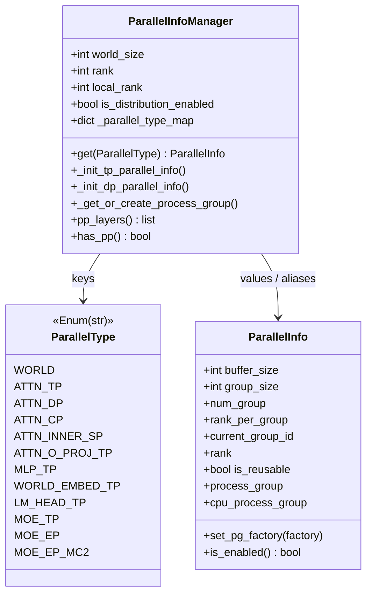

# `ParallelInfoManager` / `ParallelType` / `ParallelInfo`（MindIE-LLM 分布式并行元数据）

## Summary

`ParallelInfoManager`（[parallel_info_manager.py](d:\design\MindIE-LLM\mindie_llm\runtime\utils\distributed\parallel_info_manager.py)）在 **HCCL 已初始化的 world** 上，为推理场景维护多组 **逻辑并行维度**（`ParallelType` → `ParallelInfo`），并通过 **惰性工厂** 为每组创建/缓存 `torch.distributed.ProcessGroup`（NPU 侧默认 HCCL，CPU 侧通过同一工厂走 Gloo）。
全局入口由 [__init__.py](d:\design\MindIE-LLM\mindie_llm\runtime\utils\distributed\__init__.py) 的 `init_distributed` 在 `dist.init_process_group(backend='hccl', ...)` 之后构造单例 [__init__.py:65-69](d:\design\MindIE-LLM\mindie_llm\runtime\utils\distributed\__init__.py)。

**关键事实（与 wiki 已知 anchor 对齐）：**

- `ParallelType` 为 **12 成员** 字符串枚举（无 `PP`）[parallel_info_manager.py:33-47](d:\design\MindIE-LLM\mindie_llm\runtime\utils\distributed\parallel_info_manager.py)。
- **Pipeline 并行**：`pp_layers` 文档写明未实现；`has_pp` 恒 `False` [parallel_info_manager.py:243-257](d:\design\MindIE-LLM\mindie_llm\runtime\utils\distributed\parallel_info_manager.py)。
- **TP 连续 rank 分组**、**local rank** 由 `rank_per_group[current_group_id].index(self.rank)` 得到 [parallel_info_manager.py:383-388](d:\design\MindIE-LLM\mindie_llm\runtime\utils\distributed\parallel_info_manager.py)。
- **DP 风格分组**为跨组 **stride** 排名 [parallel_info_manager.py:414-417](d:\design\MindIE-LLM\mindie_llm\runtime\utils\distributed\parallel_info_manager.py)。
- `ProcessGroupHCCL.Options` + `hccl_config["hccl_buffer_size"]` 在 `_get_or_create_process_group` [parallel_info_manager.py:278-304](d:\design\MindIE-LLM\mindie_llm\runtime\utils\distributed\parallel_info_manager.py)。
- **草稿级** `pipeline_parallel.py` 引用 `ParallelType.PP` 及 `prev_pp_rank`/`next_pp_rank`，与当前 `ParallelType`/类定义 **不一致**（见 §PP 状态）[pipeline_parallel.py:7-38](d:\design\MindIE-LLM\mindie_llm\runtime\utils\distributed\pipeline_parallel.py)。

## Sources（主链）

| 工件 | 路径 |
|------|------|
| 核心类与枚举 | [parallel_info_manager.py](d:\design\MindIE-LLM\mindie_llm\runtime\utils\distributed\parallel_info_manager.py) |
| `init_distributed` / 全局 getter | [__init__.py](d:\design\MindIE-LLM\mindie_llm\runtime\utils\distributed\__init__.py) |
| 通信小工具 | [communication_op.py](d:\design\MindIE-LLM\mindie_llm\runtime\utils\distributed\communication_op.py) |
| `even_divide`（world_size 必须整除 group_size） | [utils.py:61-78](d:\design\MindIE-LLM\mindie_llm\runtime\utils\distributed\utils.py) |
| PP 草稿 | [pipeline_parallel.py](d:\design\MindIE-LLM\mindie_llm\runtime\utils\distributed\pipeline_parallel.py) |

## 类层次（mermaid）

（类图对应实现：`ParallelInfo` 为 `@dataclass`，`ParallelInfoManager` 持有 `_parallel_type_map` [parallel_info_manager.py:227-241](d:\design\MindIE-LLM\mindie_llm\runtime\utils\distributed\parallel_info_manager.py)。）

## ParallelType：12 个 enum 成员（语义与映射）

定义处 [parallel_info_manager.py:33-47](d:\design\MindIE-LLM\mindie_llm\runtime\utils\distributed\parallel_info_manager.py)。

| 成员 | 值 | 初始化来源（`ParallelInfoManager.__init__`） | 备注 |
|------|-----|-----------------------------------------------|------|
| `WORLD` | `world` | `self.world = self._init_tp_parallel_info(self.world_size)` [197-199](d:\design\MindIE-LLM\mindie_llm\runtime\utils\distributed\parallel_info_manager.py) | 全 world 一组，等价 TP 式连续分组且 `group_size == world_size` |
| `ATTN_TP` | `attn_tp` | `_init_tp_parallel_info(server_config.get("tp", self.world_size))` [199-200](d:\design\MindIE-LLM\mindie_llm\runtime\utils\distributed\parallel_info_manager.py) | 注意力张量并行 |
| `ATTN_DP` | `attn_dp` | `_init_dp_parallel_info(server_config.get("dp", -1))` [200-201](d:\design\MindIE-LLM\mindie_llm\runtime\utils\distributed\parallel_info_manager.py) | DP 组为 stride 划分（见 §初始化） |
| `ATTN_CP` | `attn_cp` | `_init_dp_parallel_info(server_config.get("cp", -1))` [201-202](d:\design\MindIE-LLM\mindie_llm\runtime\utils\distributed\parallel_info_manager.py) | 与 `ATTN_DP` 相同 DP 式构造函数；语义由调用方（如 sparse attention）承担 |
| `ATTN_INNER_SP` | `attn_inner_sp` | `server_config.get("sp",-1)` 若为 `-1` 则 `group_size=1`，否则 `_init_tp_parallel_info(group_size)` [220-222](d:\design\MindIE-LLM\mindie_llm\runtime\utils\distributed\parallel_info_manager.py) | 序列并行（inner） |
| `ATTN_O_PROJ_TP` | → **`attn_tp` 别名** | `_parallel_type_map` [229-231](d:\design\MindIE-LLM\mindie_llm\runtime\utils\distributed\parallel_info_manager.py) | 与 `ATTN_TP` 共享同一 `ParallelInfo` 对象 |
| `MLP_TP` | `mlp_tp` | `_init_tp_parallel_info(server_config.get("tp", self.world_size))` [222-223](d:\design\MindIE-LLM\mindie_llm\runtime\utils\distributed\parallel_info_manager.py) | 与 `attn_tp` 默认相同 `tp` |
| `WORLD_EMBED_TP` | → **`attn_tp`** | [229-230](d:\design\MindIE-LLM\mindie_llm\runtime\utils\distributed\parallel_info_manager.py) | `self.word_embed_tp = self.attn_tp` [223-224](d:\design\MindIE-LLM\mindie_llm\runtime\utils\distributed\parallel_info_manager.py) |
| `LM_HEAD_TP` | → **`mlp_tp`** | [233-234](d:\design\MindIE-LLM\mindie_llm\runtime\utils\distributed\parallel_info_manager.py) | `self.lm_head_tp = self.mlp_tp` [224-225](d:\design\MindIE-LLM\mindie_llm\runtime\utils\distributed\parallel_info_manager.py) |
| `MOE_TP` | `moe_tp` | `_init_tp_parallel_info(..., moe_tp_buffer_size=64)` [203-205](d:\design\MindIE-LLM\mindie_llm\runtime\utils\distributed\parallel_info_manager.py) | 约束 `moe_tp.group_size * moe_ep.group_size == world_size` [207-214](d:\design\MindIE-LLM\mindie_llm\runtime\utils\distributed\parallel_info_manager.py) |
| `MOE_EP` | `moe_ep` | `_init_dp_parallel_info(..., 256)` [205-207](d:\design\MindIE-LLM\mindie_llm\runtime\utils\distributed\parallel_info_manager.py) | |
| `MOE_EP_MC2` | `moe_ep_mc2` | 同 `moe_ep` 的 `group_size`，`hccl_buffersize=int(os.getenv("HCCL_BUFFSIZE"))`，`is_reusable=False` [215-217](d:\design\MindIE-LLM\mindie_llm\runtime\utils\distributed\parallel_info_manager.py) | MoE EP 的另一套 PG（非缓存），供 fused MoE / token dispatcher 使用（见 §使用方） |

**PP enum**：当前 **不存在** `ParallelType.PP`；注释仅出现在 `has_pp` 的未来设想 [parallel_info_manager.py:256-257](d:\design\MindIE-LLM\mindie_llm\runtime\utils\distributed\parallel_info_manager.py)。

## `ParallelInfo` 字段与方法

定义 [parallel_info_manager.py:50-152](d:\design\MindIE-LLM\mindie_llm\runtime\utils\distributed\parallel_info_manager.py)。

| 类别 | 名称 | 说明 |
|------|------|------|
| 配置 | `buffer_size` | 默认 `DEFAULT_BUFFER_SIZE=128` [parallel_info_manager.py:28](d:\design\MindIE-LLM\mindie_llm\runtime\utils\distributed\parallel_info_manager.py) |
| 组规模 | `group_size` | `is_enabled()` 判定为 `group_size > 1` [parallel_info_manager.py:145-152](d:\design\MindIE-LLM\mindie_llm\runtime\utils\distributed\parallel_info_manager.py) |
| 拓扑 | `num_group`, `rank_per_group`, `current_group_id`, `rank` | `rank` 为 **组内 local rank**（非 global） |
| 复用 | `is_reusable` | 为 `False` 时 `_get_or_create_process_group` **不走缓存** [parallel_info_manager.py:278-285](d:\design\MindIE-LLM\mindie_llm\runtime\utils\distributed\parallel_info_manager.py) |
| 惰性 PG | `_pg_factory` / `set_pg_factory` | `process_group` 首次访问时用 `HCCL_BACKEND` 调工厂 [parallel_info_manager.py:114-126](d:\design\MindIE-LLM\mindie_llm\runtime\utils\distributed\parallel_info_manager.py) |
| CPU PG | `cpu_process_group` | 同工厂传 `GLOO_BACKEND` [parallel_info_manager.py:128-140](d:\design\MindIE-LLM\mindie_llm\runtime\utils\distributed\parallel_info_manager.py)（docstring 写 `_cpu_pg_factory` 与实现不一致，实为同一 `_pg_factory`） |

**`is_enabled()`**：`return self.group_size > 1` [parallel_info_manager.py:145-152](d:\design\MindIE-LLM\mindie_llm\runtime\utils\distributed\parallel_info_manager.py)。

## 初始化流程（含 `init_distributed`）

1. **`init_distributed`** [__init__.py:40-69](d:\design\MindIE-LLM\mindie_llm\runtime\utils\distributed\__init__.py)：若 `dist.is_initialized()` 则直接返回 [__init__.py:54-55](d:\design\MindIE-LLM\mindie_llm\runtime\utils\distributed\__init__.py)；否则从 `ENV` 取 `MASTER_IP`/`MASTER_PORT` [__init__.py:57-62](d:\design\MindIE-LLM\mindie_llm\runtime\utils\distributed\__init__.py)，`dist.init_process_group(backend='hccl', init_method=tcp://..., world_size=..., rank=...)` [__init__.py:65](d:\design\MindIE-LLM\mindie_llm\runtime\utils\distributed\__init__.py)；随后 **`_PARALLEL_INFO_MANAGER = ParallelInfoManager(local_rank, llm_config, server_config)`** [__init__.py:67-69](d:\design\MindIE-LLM\mindie_llm\runtime\utils\distributed\__init__.py)。

2. **`ParallelInfoManager.__init__(self, local_rank, llm_config=None, server_config=None)`** [parallel_info_manager.py:188-241](d:\design\MindIE-LLM\mindie_llm\runtime\utils\distributed\parallel_info_manager.py)：
   - `self.world_size = torch.distributed.get_world_size()`，`self.rank = torch.distributed.get_rank()` [parallel_info_manager.py:192-193](d:\design\MindIE-LLM\mindie_llm\runtime\utils\distributed\parallel_info_manager.py)。
   - `is_distribution_enabled = server_config.get("distributed_enable", False)` [parallel_info_manager.py:195](d:\design\MindIE-LLM\mindie_llm\runtime\utils\distributed\parallel_info_manager.py)。
   - **注意**：形参 `llm_config` 在构造函数体内 **未被读取**（与 docstring 中"parallel_config"叙述不完全一致）[parallel_info_manager.py:188](d:\design\MindIE-LLM\mindie_llm\runtime\utils\distributed\parallel_info_manager.py)。

3. **子初始化方法（命名对照）**：源码中 **无** `_init_world_parallel_info` 之名；`world` 使用 **`_init_tp_parallel_info(self.world_size)`** [parallel_info_manager.py:197-199](d:\design\MindIE-LLM\mindie_llm\runtime\utils\distributed\parallel_info_manager.py)。TP 式：`_init_tp_parallel_info` [parallel_info_manager.py:371-401](d:\design\MindIE-LLM\mindie_llm\runtime\utils\distributed\parallel_info_manager.py)；DP 式：`_init_dp_parallel_info` [parallel_info_manager.py:404-433](d:\design\MindIE-LLM\mindie_llm\runtime\utils\distributed\parallel_info_manager.py)。

4. **Rank 划分公式**
   - TP：`num_group = even_divide(world_size, group_size)`，`rank_per_group = [ [g*group_size, …), … ]` [parallel_info_manager.py:381-385](d:\design\MindIE-LLM\mindie_llm\runtime\utils\distributed\parallel_info_manager.py)；`even_divide` 不整除则抛错 [utils.py:61-78](d:\design\MindIE-LLM\mindie_llm\runtime\utils\distributed\utils.py)。
   - `local_rank = rank_per_group[current_group_id].index(self.rank)` [parallel_info_manager.py:387-388](d:\design\MindIE-LLM\mindie_llm\runtime\utils\distributed\parallel_info_manager.py)。
   - DP：`rank_per_group = [ list(range(group_idx, world_size, num_group)) for group_idx in range(num_group) ]` [parallel_info_manager.py:414-417](d:\design\MindIE-LLM\mindie_llm\runtime\utils\distributed\parallel_info_manager.py)。

5. **`ModelRunner` 调用链**：`init_distributed(..., server_config=kwargs)`，`kwargs` 含 `distributed_enable`、`tp`/`dp` 等由上层注入 [model_runner.py:131-133](d:\design\MindIE-LLM\mindie_llm\runtime\model_runner\model_runner.py)。

## Process group 创建顺序与"逻辑 vs 物理"

- **所有**带 `rank_per_group` 的 `ParallelInfo` 都通过 `_make_process_group_factory` 在工厂内 **对每个子组** 调用 `_get_or_create_process_group`；当前 rank 所在组赋给 `process_group` [parallel_info_manager.py:344-367](d:\design\MindIE-LLM\mindie_llm\runtime\utils\distributed\parallel_info_manager.py)。
- **实际 `dist.new_group`**：发生在 `_get_or_create_process_group` [parallel_info_manager.py:278-304](d:\design\MindIE-LLM\mindie_llm\runtime\utils\distributed\parallel_info_manager.py)。可复用组用静态缓存 `_process_group_cache`，键含 `(sorted_ranks, backend, hccl_buffer_size, stream_id)` [parallel_info_manager.py:291-306](d:\design\MindIE-LLM\mindie_llm\runtime\utils\distributed\parallel_info_manager.py)。
- **`ParallelType` 无独立 PG 的项**：多个 enum 映射到 **同一** `ParallelInfo` 对象（别名），见 §ParallelType 表 [parallel_info_manager.py:227-240](d:\design\MindIE-LLM\mindie_llm\runtime\utils\distributed\parallel_info_manager.py)。

**`cpu_process_group` vs `process_group`**：同一 rank 集合、同一工厂，后端分别为 Gloo 与 HCCL [parallel_info_manager.py:128-140](d:\design\MindIE-LLM\mindie_llm\runtime\utils\distributed\parallel_info_manager.py)。**使用锚点**：DP token 计数 `all_reduce` 在 CPU 张量上用 `cpu_process_group` [model_runner.py:609-616](d:\design\MindIE-LLM\mindie_llm\runtime\model_runner\model_runner.py)；NPU 张量上用 `process_group` [model_runner.py:619-626](d:\design\MindIE-LLM\mindie_llm\runtime\model_runner\model_runner.py)。

## PP 状态（关键 caveat）

| 项 | 锚点 |
|----|------|
| `pp_layers` 返回 `list(range(num_layers))`，文档：**Pipeline parallelism is not currently implemented** | [parallel_info_manager.py:243-251](d:\design\MindIE-LLM\mindie_llm\runtime\utils\distributed\parallel_info_manager.py) |
| `has_pp` **恒 `False`** | [parallel_info_manager.py:253-257](d:\design\MindIE-LLM\mindie_llm\runtime\utils\distributed\parallel_info_manager.py) |
| 草稿 `pipeline_parallel.py` 使用 `ParallelType.PP`、`parallel_info_manager.prev_pp_rank()` / `next_pp_rank()` | [pipeline_parallel.py:7-38](d:\design\MindIE-LLM\mindie_llm\runtime\utils\distributed\pipeline_parallel.py) |

> [!warning] CONTRADICTION: `ParallelType` 无 `PP` [parallel_info_manager.py:33-47](d:\design\MindIE-LLM\mindie_llm\runtime\utils\distributed\parallel_info_manager.py)；`ParallelInfoManager` 源码中 **无** `prev_pp_rank`/`next_pp_rank` 方法（仅见于 [pipeline_parallel.py](d:\design\MindIE-LLM\mindie_llm\runtime\utils\distributed\pipeline_parallel.py)）。故该文件为 **未完成草稿**，与当前 manager **不兼容**。详见 [mindie/topics/aclgraph-pp.md](../topics/aclgraph-pp.md) §6.3。

## 通信原语接入位置

**`communication_op.py`** [communication_op.py:16-36](d:\design\MindIE-LLM\mindie_llm\runtime\utils\distributed\communication_op.py)：

- `all_gather`：`all_gather_into_tensor` [communication_op.py:16-20](d:\design\MindIE-LLM\mindie_llm\runtime\utils\distributed\communication_op.py)。
- `allgather_and_reorder`：先 `all_gather`，再 `gather_tensor` [communication_op.py:31-36](d:\design\MindIE-LLM\mindie_llm\runtime\utils\distributed\communication_op.py)。

**稀疏注意力中的 CP**：`sparse_attention.py` 导入并对 `attn_cp.process_group` 调用 `allgather_and_reorder` [sparse_attention.py:40](d:\design\MindIE-LLM\mindie_llm\runtime\layers\attention\backend\sparse_attention.py)。

**`linear.py` 内 `all_reduce`**：`dist.all_reduce(output_parallel, group=self.parallel_info.process_group)` [linear.py:299-300](d:\design\MindIE-LLM\mindie_llm\runtime\layers\linear\linear.py)。

**`linear_op.py`**：`maybe_all_gather_and_maybe_unpad` 使用 `parallel_info.process_group` [linear_op.py:186-203](d:\design\MindIE-LLM\mindie_llm\runtime\layers\linear\linear_op.py)；`reduce_scatter_tensor` 亦绑定 `parallel_info.process_group` [linear_op.py:180-182](d:\design\MindIE-LLM\mindie_llm\runtime\layers\linear\linear_op.py)。

**`model_runner.py`**：`maybe_allgather_cp` 使用 `cp.process_group` [model_runner.py:650-658](d:\design\MindIE-LLM\mindie_llm\runtime\model_runner\model_runner.py)；跨 DP `all_gather` [model_runner.py:703-716](d:\design\MindIE-LLM\mindie_llm\runtime\model_runner\model_runner.py)。

## 使用方调用清单（`get_parallel_info_manager` / `ParallelType`）

以下均为 `mindie_llm/` 下 grep 命中（**生产代码**；测试与 `set_parallel_info_manager` 见下文）。

| 区域 | 文件（绝对路径） |
|------|------------------|
| Runner | [model_runner.py](d:\design\MindIE-LLM\mindie_llm\runtime\model_runner\model_runner.py), [model_runner_exp.py](d:\design\MindIE-LLM\mindie_llm\runtime\model_runner\model_runner_exp.py), [spec_worker.py](d:\design\MindIE-LLM\mindie_llm\runtime\model_runner\spec_worker.py) |
| Forward 元数据 | [forward_metadata/dp_metadata.py](d:\design\MindIE-LLM\mindie_llm\runtime\model_runner\forward_metadata\dp_metadata.py), [forward_context.py](d:\design\MindIE-LLM\mindie_llm\runtime\model_runner\forward_context.py), [forward_context_exp.py](d:\design\MindIE-LLM\mindie_llm\runtime\model_runner\forward_context_exp.py) |
| 模型 | [models/base/model.py](d:\design\MindIE-LLM\mindie_llm\runtime\models\base\model.py), [models/qwen2/qwen2.py](d:\design\MindIE-LLM\mindie_llm\runtime\models\qwen2\qwen2.py), [models/qwen3_moe/qwen3_moe.py](d:\design\MindIE-LLM\mindie_llm\runtime\models\qwen3_moe\qwen3_moe.py), [models/deepseek_v3/deepseek_v3.py](d:\design\MindIE-LLM\mindie_llm\runtime\models\deepseek_v3\deepseek_v3.py) |
| Layers | [linear/linear.py](d:\design\MindIE-LLM\mindie_llm\runtime\layers\linear\linear.py), [linear/linear_op.py](d:\design\MindIE-LLM\mindie_llm\runtime\layers\linear\linear_op.py), [fused_moe/fused_moe.py](d:\design\MindIE-LLM\mindie_llm\runtime\layers\fused_moe\fused_moe.py), [fused_moe/token_dispatcher.py](d:\design\MindIE-LLM\mindie_llm\runtime\layers\fused_moe\token_dispatcher.py), [embedding/embedding.py](d:\design\MindIE-LLM\mindie_llm\runtime\layers\embedding\embedding.py), [attention/backend/sparse_attention.py](d:\design\MindIE-LLM\mindie_llm\runtime\layers\attention\backend\sparse_attention.py) |
| ACLGraph | [aclgraph_model_wrapper_exp.py](d:\design\MindIE-LLM\mindie_llm\modeling\model_wrapper\aclgraph\aclgraph_model_wrapper_exp.py) |
| 其它 | [loader/default_model_loader.py](d:\design\MindIE-LLM\mindie_llm\runtime\utils\loader\default_model_loader.py), [cpu/affinity.py](d:\design\MindIE-LLM\mindie_llm\runtime\utils\cpu\affinity.py) |

**`set_parallel_info_manager`**：定义 [__init__.py:20-27](d:\design\MindIE-LLM\mindie_llm\runtime\utils\distributed\__init__.py)；其余主要为 **测试** 注入 mock。

## 配置依赖（`server_config` / kwargs）

由 `ParallelInfoManager.__init__` 直接读取的 `server_config` 键 [parallel_info_manager.py:188-225](d:\design\MindIE-LLM\mindie_llm\runtime\utils\distributed\parallel_info_manager.py)：

- `distributed_enable` → `is_distribution_enabled` [parallel_info_manager.py:195](d:\design\MindIE-LLM\mindie_llm\runtime\utils\distributed\parallel_info_manager.py)
- `tp`：默认 `world_size` [parallel_info_manager.py:199-200, 222-223](d:\design\MindIE-LLM\mindie_llm\runtime\utils\distributed\parallel_info_manager.py)
- `dp`：默认 `-1` → `_init_dp_parallel_info` 内变为 `group_size=1` [parallel_info_manager.py:411-412](d:\design\MindIE-LLM\mindie_llm\runtime\utils\distributed\parallel_info_manager.py)
- `cp`：默认 `-1` [parallel_info_manager.py:201-202](d:\design\MindIE-LLM\mindie_llm\runtime\utils\distributed\parallel_info_manager.py)
- `sp`：`-1` 则 inner SP `group_size=1` [parallel_info_manager.py:220-222](d:\design\MindIE-LLM\mindie_llm\runtime\utils\distributed\parallel_info_manager.py)
- `moe_tp` / `moe_ep`：含乘积校验 [parallel_info_manager.py:207-214](d:\design\MindIE-LLM\mindie_llm\runtime\utils\distributed\parallel_info_manager.py)
- `MOE_EP_MC2` 缓冲：`HCCL_BUFFSIZE` 环境变量 [parallel_info_manager.py:215-216](d:\design\MindIE-LLM\mindie_llm\runtime\utils\distributed\parallel_info_manager.py)（未设置时 `int(None)` 会失败——属运行期风险）。

## 跨项目对照（synthesis）

> 以下对比基于已读文件片段，用于抽象层次与命名习惯，**非行为等价证明**。

| 维度 | MindIE-LLM | vLLM（`parallel_state.py`） | SGLang（`parallel_state.py`） |
|------|------------|---------------------------|------------------------------|
| 注册方式 | 单例 `ParallelInfoManager` + `ParallelType` 枚举键 [parallel_info_manager.py:227-342](d:\design\MindIE-LLM\mindie_llm\runtime\utils\distributed\parallel_info_manager.py) | 多全局 `GroupCoordinator` + `get_tp_group()`/`get_dp_group()` 等 [parallel_state.py:1216-1248](d:\design\vllm\vllm\distributed\parallel_state.py) | `initialize_model_parallel(...)` 一次性构建多组 `_TP`/`_ATTN_CP`/… [parallel_state.py:1710-1981](d:\design\sglang\python\sglang\srt\distributed\parallel_state.py) |
| 进程组抽象 | `ParallelInfo` 惰性 PG + 类级缓存 [parallel_info_manager.py:267-306](d:\design\MindIE-LLM\mindie_llm\runtime\utils\distributed\parallel_info_manager.py) | `GroupCoordinator` 封装设备通信器 [parallel_state.py:1149-1164](d:\design\vllm\vllm\distributed\parallel_state.py) | 同类 `init_model_parallel_group` [parallel_state.py:1791-1798](d:\design\sglang\python\sglang\srt\distributed\parallel_state.py) |
| PP | 明确未实现 [parallel_info_manager.py:243-257](d:\design\MindIE-LLM\mindie_llm\runtime\utils\distributed\parallel_info_manager.py) | 提供 `get_pp_group()` [parallel_state.py:1235-1240](d:\design\vllm\vllm\distributed\parallel_state.py) | `initialize_model_parallel` 内构建 PP 组 [parallel_state.py:1964-1981](d:\design\sglang\python\sglang\srt\distributed\parallel_state.py) |

## Notes / Caveats

> [!todo] VERIFY: `get_parallel_info_manager()` 文档与实现：声明返回 `ParallelInfoManager`，但初始化前 `_PARALLEL_INFO_MANAGER` 可能为 `None` [__init__.py:30-37](d:\design\MindIE-LLM\mindie_llm\runtime\utils\distributed\__init__.py)。
> [!warning] CONTRADICTION: `pipeline_parallel.py` 与主类脱节，详 §PP 状态。
> [!todo] VERIFY: 别名 enum（`ATTN_O_PROJ_TP`/`WORLD_EMBED_TP`/`LM_HEAD_TP` 与 `ATTN_TP`/`mlp_tp` 共享实例 [parallel_info_manager.py:227-235](d:\design\MindIE-LLM\mindie_llm\runtime\utils\distributed\parallel_info_manager.py)）的语义意图——是预留差异化点还是仅历史命名。
> [!todo] VERIFY: `ModelRunner.process_group` 标 **depreciated** 指向 `mapping.world.process_group` [model_runner.py:133-135](d:\design\MindIE-LLM\mindie_llm\runtime\model_runner\model_runner.py)，迁移路径未明。

## See also

- [comparison/topics/distributed.md](../../comparison/topics/distributed.md)（跨项目并行体系对照）
- [comparison/topics/cp-sp.md](../../comparison/topics/cp-sp.md)
- [comparison/topics/flashcomm.md](../../comparison/topics/flashcomm.md)
- [mindie/topics/aclgraph-pp.md](../topics/aclgraph-pp.md)（PP 现状专题）
- [mindie/entities/AclGraphModelWrapper.md](AclGraphModelWrapper.md)（aclgraph 路径使用 `ParallelType.ATTN_TP/DP/CP/SP`）
