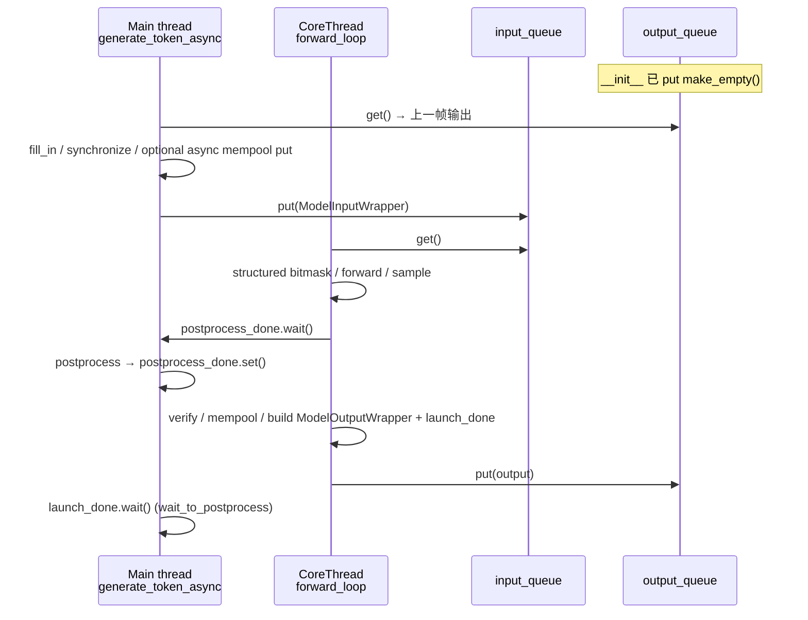

# `PluginManager`

## Summary

`PluginManager` 在单次 token 迭代中编排 **preprocess →（异步时双队列与 `forward_loop`）→ forward → sample → verify/postprocess**，并把各特性插件挂到统一的 `plugin_list` 遍历入口（`model_inputs_update` / `sample_preprocess` / `plugin_verify` / cache 更新清理等）。异步模式下主线程与 `CoreThread(name="async_forward")` 通过 `input_queue` / `output_queue` 与 `postprocess_done` / `launch_done` 协调，实现与调度器文档中 "async schedule" 范式的对接（范式分类见 [comparison/topics/async-schedule.md](../../comparison/topics/async-schedule.md)）。

> synthesis: 本类是 "生成栈里的插件编排器 + 异步时的 forward 流水线线程"；`async_infer` 的实际取值由 `Generator` 构造的 `ContextParams` 注入 `infer_context`，与 `ENV.async_inference`（环境变量）对齐。

## Sources

| 资源 | 锚点 |
|------|------|
| 实现主体 | [d:\design\MindIE-LLM\mindie_llm\text_generator\plugins\plugin_manager.py](d:\design\MindIE-LLM\mindie_llm\text_generator\plugins\plugin_manager.py)（L1–1242） |
| 工厂 `get_plugin` | [d:\design\MindIE-LLM\mindie_llm\text_generator\plugins\__init__.py:15-47](d:\design\MindIE-LLM\mindie_llm\text_generator\plugins\__init__.py) |
| `PluginDataParam` / 校验器 | [d:\design\MindIE-LLM\mindie_llm\text_generator\plugins\plugin_utils.py:15-24, 63-159](d:\design\MindIE-LLM\mindie_llm\text_generator\plugins\plugin_utils.py) |
| `ModelInputWrapper` / `ModelInput` | [d:\design\MindIE-LLM\mindie_llm\text_generator\utils\model_input.py:23-80](d:\design\MindIE-LLM\mindie_llm\text_generator\utils\model_input.py) |
| `ModelOutputWrapper` / `ModelOutput` | [d:\design\MindIE-LLM\mindie_llm\text_generator\utils\model_output.py:22-54](d:\design\MindIE-LLM\mindie_llm\text_generator\utils\model_output.py) |
| `ContextParams`（含 `async_infer`） | [d:\design\MindIE-LLM\mindie_llm\text_generator\utils\config.py:225-239](d:\design\MindIE-LLM\mindie_llm\text_generator\utils\config.py) |
| `Generator` 中创建与分流 | [d:\design\MindIE-LLM\mindie_llm\text_generator\generator.py:977-1024, 636-648](d:\design\MindIE-LLM\mindie_llm\text_generator\generator.py) |
| `ENV.async_inference` | [d:\design\MindIE-LLM\mindie_llm\utils\env.py:155-157](d:\design\MindIE-LLM\mindie_llm\utils\env.py) |

## 类签名与 `__init__`

### 签名与主要参数

```python
def __init__(
    self,
    generator_backend: GeneratorBackend,
    kvcache_settings: KVCacheSettings,
    infer_context: TGInferContextStore,
    output_filter: OutputFilter,
    is_mix_model: bool,
    plugin_list: list[str],
    model_role: DmiModeNodeRole | str,
    watcher: NpuMemoryWatcher,
    **kwargs,
):
```

锚点：[plugin_manager.py:74-85](d:\design\MindIE-LLM\mindie_llm\text_generator\plugins\plugin_manager.py)。

- 从 `kwargs` 显式写入：`kwargs.update({"model_role": model_role})`，再 `self.kwargs = kwargs`（[plugin_manager.py:104-105](d:\design\MindIE-LLM\mindie_llm\text_generator\plugins\plugin_manager.py)）。
- `enable_structured_output` 默认 `True`：`self._structured_output_enabled = kwargs.get("enable_structured_output", True)`（[plugin_manager.py:125](d:\design\MindIE-LLM\mindie_llm\text_generator\plugins\plugin_manager.py)）。

### `async_inference` / `infer_context.context_params.async_infer` 来源

- `PluginManager` 内：`self.async_inference = self.infer_context.context_params.async_infer`（[plugin_manager.py:100](d:\design\MindIE-LLM\mindie_llm\text_generator\plugins\plugin_manager.py)）。
- `infer_context` 由 `Generator._init_plugin_manager` 构造 `ContextParams(...)` 并传入 `TGInferContextStore`；**第 6 个位置参数**对应 `ContextParams.async_infer`，实参为 `self.async_inference`（Generator 侧来自 `ENV.async_inference` 写入的 `model_config`）（[generator.py:991-1009](d:\design\MindIE-LLM\mindie_llm\text_generator\generator.py)，[config.py:225-235](d:\design\MindIE-LLM\mindie_llm\text_generator\utils\config.py)）。
- 环境默认值：`ENV.async_inference` 由 `MINDIE_ASYNC_SCHEDULING_ENABLE == "1"` 决定（[env.py:155-157](d:\design\MindIE-LLM\mindie_llm\utils\env.py)）；`Generator` 同步到 `self.async_inference`（[generator.py:319-321](d:\design\MindIE-LLM\mindie_llm\text_generator\generator.py)）。

### `__init__` 内分支（sync / async）

- 公共：`plugin_data_param = PluginDataParam()`（[plugin_manager.py:97](d:\design\MindIE-LLM\mindie_llm\text_generator\plugins\plugin_manager.py)）；状态字段 `last_sequence_ids`、`is_inference_pause`、`error_code_collected_in_async`、`mempool_type` 等（[plugin_manager.py:116-124](d:\design\MindIE-LLM\mindie_llm\text_generator\plugins\plugin_manager.py)）。
- **仅当** `self.async_inference`：`input_queue`/`output_queue`、`output_queue.put(ModelOutputWrapper.make_empty())`、`forward_thread = CoreThread(target=self.forward_loop, ...)`、`start()`、`execution_stream = torch.npu.current_stream()`（[plugin_manager.py:107-115](d:\design\MindIE-LLM\mindie_llm\text_generator\plugins\plugin_manager.py)）。

### `initialize()`（L179-205）

1. **mix 模型**：若 `is_mix_model`，本地 import `SplitfusePlugin` 并赋给 `self.mix_preprocess`（[plugin_manager.py:180-185](d:\design\MindIE-LLM\mindie_llm\text_generator\plugins\plugin_manager.py)）。
2. **按 `plugin_list` 顺序**动态加载：对每个 `plugin` 名构造 `ClsName = WordWord...Plugin`，模块路径 `mindie_llm.text_generator.plugins.{plugin}.{plugin}_plugin`，`importlib.import_module`，`getattr(plugin_module, cls_name)`，实例化并 `setattr(self, plugin, plugin_tmp)`（[plugin_manager.py:186-200](d:\design\MindIE-LLM\mindie_llm\text_generator\plugins\plugin_manager.py)）。
3. 若含 `prefix_cache`：`self.mempool_type = self.prefix_cache.mempool_type`（[plugin_manager.py:201-202](d:\design\MindIE-LLM\mindie_llm\text_generator\plugins\plugin_manager.py)）。
4. `self._init_structured_output_manager()`（[plugin_manager.py:205](d:\design\MindIE-LLM\mindie_llm\text_generator\plugins\plugin_manager.py)）。

## 同步路径：`generate_token`

入口：`generate_token(self, input_metadata, warmup=False)`（[plugin_manager.py:224-227](d:\design\MindIE-LLM\mindie_llm\text_generator\plugins\plugin_manager.py)）。

| 阶段 | 行为 | 锚点 |
|------|------|------|
| preprocess | `cache_ids, model_inputs, sampling_metadata, trace_ids = self.preprocess(...)`；非 mix 时清空 `plugin_data_param.q_len/mask` | [plugin_manager.py:229-236](d:\design\MindIE-LLM\mindie_llm\text_generator\plugins\plugin_manager.py) |
| model_inputs_update | `model_inputs, qlen, mask = self.model_inputs_update_manager(...)`，写回 `plugin_data_param` | [plugin_manager.py:236-244](d:\design\MindIE-LLM\mindie_llm\text_generator\plugins\plugin_manager.py) |
| prefix_cache 异步写（非 warmup） | `prefix_cache.async_put_prefix_kvcache_to_mempool` 若 `ASYNC_WRITE` | [plugin_manager.py:245-252](d:\design\MindIE-LLM\mindie_llm\text_generator\plugins\plugin_manager.py) |
| forward | `generator_backend.forward`；mtp 在 `plugin_list` 时用 `spec_mask`/`mtp_model_inputs`/`hidden_states` 分支 | [plugin_manager.py:266-289](d:\design\MindIE-LLM\mindie_llm\text_generator\plugins\plugin_manager.py) |
| sample | `sample_preprocess_manager` → `generator_backend.sample` | [plugin_manager.py:303-308](d:\design\MindIE-LLM\mindie_llm\text_generator\plugins\plugin_manager.py) |
| postprocess 前 mempool | `SYNC_WRITE`：`put_prefix_kvcache_to_mempool`；`ASYNC_WRITE`：`wait_put_finish` | [plugin_manager.py:317-321](d:\design\MindIE-LLM\mindie_llm\text_generator\plugins\plugin_manager.py) |
| postprocess | `generation_output = self.postprocess(...)` | [plugin_manager.py:322-324](d:\design\MindIE-LLM\mindie_llm\text_generator\plugins\plugin_manager.py) |
| 异常 / pause | `is_inference_pause` 时 `make_empty`，`is_force_stop_exception` 则 `notify_force_stop_exception` | [plugin_manager.py:336-352](d:\design\MindIE-LLM\mindie_llm\text_generator\plugins\plugin_manager.py) |

> synthesis: 同步路径 **verify** 发生在 `postprocess` 内（见下节 "Sample / structured output"），与异步路径不同。

## 异步路径：`generate_token_async` + `forward_loop`

### `generate_token_async`（L354-580）

- 外层 `with self.generator_backend.get_new_stream():`（[plugin_manager.py:357](d:\design\MindIE-LLM\mindie_llm\text_generator\plugins\plugin_manager.py)）。
- preprocess + `model_inputs_update_manager`（带 `hit_mask`）；`infer_context.last_sampling_metadata.clear()`（[plugin_manager.py:359-369](d:\design\MindIE-LLM\mindie_llm\text_generator\plugins\plugin_manager.py)）。
- `prepare_model_inputs`（mtp 分支同上）（[plugin_manager.py:378-395](d:\design\MindIE-LLM\mindie_llm\text_generator\plugins\plugin_manager.py)）；warmup 设置 `model_kwargs["warmup_is_end"]` / `self.warmup_is_end`（[plugin_manager.py:397-402](d:\design\MindIE-LLM\mindie_llm\text_generator\plugins\plugin_manager.py)）。
- `_prepare_masks_for_filling` → `postprocess_done = threading.Event()` → `ModelInputWrapper(...)`（[plugin_manager.py:433-452](d:\design\MindIE-LLM\mindie_llm\text_generator\plugins\plugin_manager.py)）。
- **`model_output_wrapper = self.output_queue.get(timeout=900)`** — 取 **N−1** 帧（相对本次将推入的输入）（[plugin_manager.py:455-457](d:\design\MindIE-LLM\mindie_llm\text_generator\plugins\plugin_manager.py)）。
- 非 `ENV.model_runner_exp`：`_fill_in_model_result(...)`；否则 `record_stream(self.execution_stream)`（[plugin_manager.py:462-489](d:\design\MindIE-LLM\mindie_llm\text_generator\plugins\plugin_manager.py)）。
- `self.generator_backend.synchronize()`（[plugin_manager.py:491-493](d:\design\MindIE-LLM\mindie_llm\text_generator\plugins\plugin_manager.py)）。
- 条件 `prefix_cache` + `ASYNC_WRITE`：`async_put_prefix_kvcache_to_mempool`（[plugin_manager.py:495-502](d:\design\MindIE-LLM\mindie_llm\text_generator\plugins\plugin_manager.py)）。
- **`self.input_queue.put(model_input_wrapper)`** — 推 **N** 帧（[plugin_manager.py:504-506](d:\design\MindIE-LLM\mindie_llm\text_generator\plugins\plugin_manager.py)）。
- `wait_to_postprocess`：`launch_done.wait`（`LAUNCH_DONE_TIMEOUT` / pause 时 1s）（[plugin_manager.py:508-521](d:\design\MindIE-LLM\mindie_llm\text_generator\plugins\plugin_manager.py)）。
- `ENV.model_runner_exp`：`execution_done.synchronize()`，`_to_host(sampling_output)`（[plugin_manager.py:526-529](d:\design\MindIE-LLM\mindie_llm\text_generator\plugins\plugin_manager.py)）。
- `postprocess` 或 `make_empty`；**`postprocess_done.set()`**（[plugin_manager.py:535-558](d:\design\MindIE-LLM\mindie_llm\text_generator\plugins\plugin_manager.py)）。
- 末尾若 `error_code_collected_in_async`：`raise ErrorCodeException`（[plugin_manager.py:569-578](d:\design\MindIE-LLM\mindie_llm\text_generator\plugins\plugin_manager.py)）。

### `forward_loop()`（L809-976）

- `self.generator_backend.set_device()`（[plugin_manager.py:810](d:\design\MindIE-LLM\mindie_llm\text_generator\plugins\plugin_manager.py)）。
- `model_input_wrapper = self.input_queue.get()`（[plugin_manager.py:814-816](d:\design\MindIE-LLM\mindie_llm\text_generator\plugins\plugin_manager.py)）。
- 结构化：`build_and_assign_structured_guided_bitmask`（[plugin_manager.py:818-832](d:\design\MindIE-LLM\mindie_llm\text_generator\plugins\plugin_manager.py)）。
- `ENV.model_runner_exp`：`_fill_in_model_result_exp`（用上一次的 `model_output_wrapper`）（[plugin_manager.py:835-841](d:\design\MindIE-LLM\mindie_llm\text_generator\plugins\plugin_manager.py)）。
- `forward_from_model_inputs`；若已有 `launch_done` 则 `set()`（**先于**新一次 forward 完成时通知上一帧）（[plugin_manager.py:847-853](d:\design\MindIE-LLM\mindie_llm\text_generator\plugins\plugin_manager.py)）。
- `sample_preprocess_manager` → `generator_backend.sample`；`compute_structured_output_accepted`（[plugin_manager.py:855-871](d:\design\MindIE-LLM\mindie_llm\text_generator\plugins\plugin_manager.py)）。
- `clear_internal_tensors`（[plugin_manager.py:873](d:\design\MindIE-LLM\mindie_llm\text_generator\plugins\plugin_manager.py)）。
- 非 pause：`model_input_wrapper.postprocess_done.wait()`（[plugin_manager.py:877-878](d:\design\MindIE-LLM\mindie_llm\text_generator\plugins\plugin_manager.py)）。
- `plugin_verify_manager`（[plugin_manager.py:880-886](d:\design\MindIE-LLM\mindie_llm\text_generator\plugins\plugin_manager.py)）。
- mempool：`SYNC_WRITE` → `put_prefix_kvcache_to_mempool`；`ASYNC_WRITE` 且 `warmup_is_end` → `wait_put_finish`（[plugin_manager.py:888-902](d:\design\MindIE-LLM\mindie_llm\text_generator\plugins\plugin_manager.py)）。
- 新建 `launch_done = threading.Event()`，`ModelOutputWrapper(..., launch_done=launch_done)`，`sampling_output.is_structured_accepted = async_is_structured_accepted`（[plugin_manager.py:904-915](d:\design\MindIE-LLM\mindie_llm\text_generator\plugins\plugin_manager.py)）。
- `ENV.model_runner_exp`：`execution_done = torch.npu.Event()`，`record`，赋给 `model_output_wrapper.execution_done`（[plugin_manager.py:972-975](d:\design\MindIE-LLM\mindie_llm\text_generator\plugins\plugin_manager.py)）。
- `self.output_queue.put(model_output_wrapper)`（[plugin_manager.py:976](d:\design\MindIE-LLM\mindie_llm\text_generator\plugins\plugin_manager.py)）。

### 同步原语与首帧占位

| 原语 | 作用 |
|------|------|
| `postprocess_done: threading.Event` | 包在 `ModelInputWrapper` 中；forward 线程在 verify 前 `wait()`，主线程 postprocess 后 `set()`（[plugin_manager.py:441-451, 877-878, 558](d:\design\MindIE-LLM\mindie_llm\text_generator\plugins\plugin_manager.py)） |
| `launch_done: threading.Event` | 每帧输出包装内；主线程 `wait_to_postprocess`（[plugin_manager.py:512-520](d:\design\MindIE-LLM\mindie_llm\text_generator\plugins\plugin_manager.py)）；forward 内在下一次 forward 前对**旧** `launch_done.set()`（[plugin_manager.py:851-852](d:\design\MindIE-LLM\mindie_llm\text_generator\plugins\plugin_manager.py)） |
| `execution_stream` / `execution_done` | `torch.npu` 流与事件；exp 路径主线程 `record_stream` / `synchronize`（[plugin_manager.py:115, 474-489, 972-975, 526-529](d:\design\MindIE-LLM\mindie_llm\text_generator\plugins\plugin_manager.py)） |
| `output_queue.put(ModelOutputWrapper.make_empty())` | `__init__` 种子，使首次 `output_queue.get()` 不阻塞（[plugin_manager.py:110](d:\design\MindIE-LLM\mindie_llm\text_generator\plugins\plugin_manager.py)） |

### 时序图（类内职责）



## Plugin 系统

### `plugin_list` 与仓库内插件包

`PluginParameterValidator` 报错文案写明 **`plugin_type` 仅支持**：`'la', 'memory_decoding', 'prefix_cache', 'mtp' and 'splitfuse'`（[plugin_utils.py:128-131](d:\design\MindIE-LLM\mindie_llm\text_generator\plugins\plugin_utils.py)）。`PLUGIN_WHITE_LIST` 为 `la`, `memory_decoding`, `mtp`, `prefix_cache`（[plugin_utils.py:9](d:\design\MindIE-LLM\mindie_llm\text_generator\plugins\plugin_utils.py)）。

源码树中独立包目录（`mindie_llm/text_generator/plugins/`）：`splitfuse/`, `prefix_cache/`, `mtp/`, `la/`, `memory_decoding/`，以及 **`structured_output/`**（由 `_init_structured_output_manager` 引用，**不**经 `plugin_list` 的 `importlib` 循环）（见 [plugin_manager.py:1046-1088](d:\design\MindIE-LLM\mindie_llm\text_generator\plugins\plugin_manager.py)）。

> [!todo] VERIFY: 若文档中"11 个 plugin 类型"指其它枚举（例如产品手册），需与上述 validator + 目录 **逐项对照**；本页仅锚到当前 Python 校验与目录。

### `PluginDataParam`（L97）

定义见 [plugin_utils.py:15-24](d:\design\MindIE-LLM\mindie_llm\text_generator\plugins\plugin_utils.py)：`q_len`, `mask`, `num_speculative_tokens`, `mtp_model_inputs`, `hidden_states`。在 `PluginManager` 中由 `model_inputs_update_manager` 与各插件写回，并传给 `generator_backend.forward` / `prepare_model_inputs`（例如 [plugin_manager.py:239-244, 761-766](d:\design\MindIE-LLM\mindie_llm\text_generator\plugins\plugin_manager.py)）。

### 插件方法约定（非 `plugin_<阶段>_manager` 字面模式）

管理器按 **方法名** 调度（节选）：

| 方法名 | 调用处 |
|--------|--------|
| `model_inputs_update` | `model_inputs_update_manager`（[plugin_manager.py:738-748](d:\design\MindIE-LLM\mindie_llm\text_generator\plugins\plugin_manager.py)） |
| `sample_preprocess` | `sample_preprocess_manager`（[plugin_manager.py:772-775](d:\design\MindIE-LLM\mindie_llm\text_generator\plugins\plugin_manager.py)） |
| `plugin_verify` / `plugin_verify_exp` | `plugin_verify_manager`（[plugin_manager.py:778-786](d:\design\MindIE-LLM\mindie_llm\text_generator\plugins\plugin_manager.py)） |
| `plugin_cache_update` | `plugin_cache_update_manager`（[plugin_manager.py:792-795](d:\design\MindIE-LLM\mindie_llm\text_generator\plugins\plugin_manager.py)） |
| `plugin_cache_clear` | `plugin_cache_clear_manager`（[plugin_manager.py:797-801](d:\design\MindIE-LLM\mindie_llm\text_generator\plugins\plugin_manager.py)） |
| `fill_in_model_result` / `fill_in_model_result_exp` | `_fill_in_model_result` / `_fill_in_model_result_exp`（[plugin_manager.py:1171-1194, 978-995](d:\design\MindIE-LLM\mindie_llm\text_generator\plugins\plugin_manager.py)） |
| `prepare_masks_for_filling` | `_prepare_masks_for_filling`（[plugin_manager.py:1109-1114](d:\design\MindIE-LLM\mindie_llm\text_generator\plugins\plugin_manager.py)） |
| `compose_model_inputs_exp` | `preprocess` 内对 decode 的插件扩展（[plugin_manager.py:622-626](d:\design\MindIE-LLM\mindie_llm\text_generator\plugins\plugin_manager.py)） |

高层对外名仍为 `plugin_*_manager` 包装函数（`plugin_verify_manager` 等），与插件类内方法名不同。

## 数据 wrapper

### `ModelInputWrapper`（[model_input.py:69-79](d:\design\MindIE-LLM\mindie_llm\text_generator\utils\model_input.py)）

字段：`cache_ids`, `input_metadata`, `model_inputs`, `model_kwargs`, `sampling_metadata`, `trace_ids`, `current_dp_sequence_ids`, `postprocess_done`, `filling_masks`（默认 `None`）。构造见 [plugin_manager.py:441-452](d:\design\MindIE-LLM\mindie_llm\text_generator\plugins\plugin_manager.py)。

### `ModelOutputWrapper`（[model_output.py:30-54](d:\design\MindIE-LLM\mindie_llm\text_generator\utils\model_output.py)）

字段：`cache_ids`, `input_metadata`, `model_output`, `sampling_metadata`, `sampling_output`, `trace_ids`, `current_dp_sequence_ids`, `launch_done`, `is_mock`, `execution_done`。`make_empty()`（[model_output.py:43-54](d:\design\MindIE-LLM\mindie_llm\text_generator\utils\model_output.py)）用于队列种子。

## Sample 与 structured output 集成

### `sample_preprocess_manager`（L769-776）

对 `plugin_list` 顺序调用各插件的 `sample_preprocess(logits, result, sampling_metadata, input_metadata)`，返回修改后的 `logits`（[plugin_manager.py:769-776](d:\design\MindIE-LLM\mindie_llm\text_generator\plugins\plugin_manager.py)）。

### `generator_backend.sample`（L862）

异步路径在 `forward_loop` 中：`self.generator_backend.sample(draft_filtered_logits, model_input_wrapper.sampling_metadata)`（[plugin_manager.py:862-863](d:\design\MindIE-LLM\mindie_llm\text_generator\plugins\plugin_manager.py)）。同步路径等价调用（[plugin_manager.py:307-308](d:\design\MindIE-LLM\mindie_llm\text_generator\plugins\plugin_manager.py)）。

### `_fill_in_model_result` vs `_fill_in_model_result_exp`

| | `_fill_in_model_result`（L1171-1220） | `_fill_in_model_result_exp`（L978-1044） |
|---|----------------------------------------|------------------------------------------|
| 调用位置 | 主线程，`not ENV.model_runner_exp`（[plugin_manager.py:462-471](d:\design\MindIE-LLM\mindie_llm\text_generator\plugins\plugin_manager.py)） | `forward_loop` 内，`ENV.model_runner_exp`（[plugin_manager.py:835-841](d:\design\MindIE-LLM\mindie_llm\text_generator\plugins\plugin_manager.py)） |
| 插件钩子 | 首个有 `fill_in_model_result` 的插件（[plugin_manager.py:1179-1194](d:\design\MindIE-LLM\mindie_llm\text_generator\plugins\plugin_manager.py)） | 首个有 `fill_in_model_result_exp` 的插件（[plugin_manager.py:982-995](d:\design\MindIE-LLM\mindie_llm\text_generator\plugins\plugin_manager.py)） |
| 默认逻辑 | numpy / `to_tensor` 更新 `input_ids` 等（[plugin_manager.py:1195-1220](d:\design\MindIE-LLM\mindie_llm\text_generator\plugins\plugin_manager.py)） | torch `scatter_` / `index_select` 等（[plugin_manager.py:996-1044](d:\design\MindIE-LLM\mindie_llm\text_generator\plugins\plugin_manager.py)） |

### Structured output

- **同步 preprocess**：仅当 `not self.async_inference` 且 manager 非空时 `build_and_assign_structured_guided_bitmask`（[plugin_manager.py:607-615](d:\design\MindIE-LLM\mindie_llm\text_generator\plugins\plugin_manager.py)）。
- **异步 forward 线程**：每次 `input_queue.get` 之后构建 bitmask（[plugin_manager.py:818-832](d:\design\MindIE-LLM\mindie_llm\text_generator\plugins\plugin_manager.py)）。
- **`compute_structured_output_accepted`**：异步在 `forward_loop` sample 后（[plugin_manager.py:865-871](d:\design\MindIE-LLM\mindie_llm\text_generator\plugins\plugin_manager.py)）；同步在 `postprocess` 内且 `not async_inference`（[plugin_manager.py:648-656](d:\design\MindIE-LLM\mindie_llm\text_generator\plugins\plugin_manager.py)）。异步路径将结果写入 `sampling_output.is_structured_accepted`（[plugin_manager.py:915](d:\design\MindIE-LLM\mindie_llm\text_generator\plugins\plugin_manager.py)）。

## 错误处理与 pause

| 项 | 锚点 |
|----|------|
| `is_inference_pause` | 成员 [plugin_manager.py:118](d:\design\MindIE-LLM\mindie_llm\text_generator\plugins\plugin_manager.py)；`generate_token` 异常分支 mock（[plugin_manager.py:336-347](d:\design\MindIE-LLM\mindie_llm\text_generator\plugins\plugin_manager.py)）；`forward_loop` 跳过 `postprocess_done.wait` 当 pause（[plugin_manager.py:877-878](d:\design\MindIE-LLM\mindie_llm\text_generator\plugins\plugin_manager.py)）；`wait_to_postprocess` 1s 超时变 mock（[plugin_manager.py:518-520](d:\design\MindIE-LLM\mindie_llm\text_generator\plugins\plugin_manager.py)） |
| `error_code_collected_in_async` | 成员 [plugin_manager.py:120](d:\design\MindIE-LLM\mindie_llm\text_generator\plugins\plugin_manager.py)；`forward_loop` except 中 `convert_exception_to_error_code`，非 None 则赋值（[plugin_manager.py:916-942](d:\design\MindIE-LLM\mindie_llm\text_generator\plugins\plugin_manager.py)）；`generate_token_async` 末尾抛出 `ErrorCodeException`（[plugin_manager.py:569-578](d:\design\MindIE-LLM\mindie_llm\text_generator\plugins\plugin_manager.py)） |
| FORCE STOP | `forward_loop` [plugin_manager.py:920-924](d:\design\MindIE-LLM\mindie_llm\text_generator\plugins\plugin_manager.py)；`generate_token` [plugin_manager.py:341-346](d:\design\MindIE-LLM\mindie_llm\text_generator\plugins\plugin_manager.py) |
| `forward_loop` try/except | [plugin_manager.py:842-970](d:\design\MindIE-LLM\mindie_llm\text_generator\plugins\plugin_manager.py)（含 mock 输出、`output_queue.put`、`continue` 或 `raise`） |

`Generator` 在恢复路径上也会重置 `plugin_manager` 的 pause / `error_code_collected_in_async` / `output_queue` 等（例如 [generator.py:899-935](d:\design\MindIE-LLM\mindie_llm\text_generator\generator.py)）。

## MemPool 与 prefix cache

- `MemPoolType`：`DISABLED`, `SYNC_WRITE`, `ASYNC_WRITE`（[plugin_manager.py:67-70](d:\design\MindIE-LLM\mindie_llm\text_generator\plugins\plugin_manager.py)）。
- `initialize`：若 `prefix_cache` in list，则 `self.mempool_type = self.prefix_cache.mempool_type`（[plugin_manager.py:201-202](d:\design\MindIE-LLM\mindie_llm\text_generator\plugins\plugin_manager.py)）。
- `put_prefix_kvcache_to_mempool`：委托 `prefix_cache` 插件同名方法（[plugin_manager.py:803-807](d:\design\MindIE-LLM\mindie_llm\text_generator\plugins\plugin_manager.py)）。
- 同步 `generate_token`：`SYNC_WRITE` 在 postprocess 前 put；`ASYNC_WRITE` 在 postprocess 前 `wait_put_finish`（[plugin_manager.py:317-321](d:\design\MindIE-LLM\mindie_llm\text_generator\plugins\plugin_manager.py)）。
- 异步：`generate_token_async` 主线程在 prefill 条件下 `async_put_prefix_kvcache_to_mempool`（[plugin_manager.py:495-502](d:\design\MindIE-LLM\mindie_llm\text_generator\plugins\plugin_manager.py)）；`forward_loop` 内 `SYNC_WRITE` / `ASYNC_WRITE` 分支（[plugin_manager.py:888-902](d:\design\MindIE-LLM\mindie_llm\text_generator\plugins\plugin_manager.py)）。

## 与其它实体的关系

- **构造**：`Generator._init_plugin_manager` → `get_plugin(...)` → `PluginManager(...)` → `initialize()`（[generator.py:977-1024](d:\design\MindIE-LLM\mindie_llm\text_generator\generator.py)，[plugins/__init__.py:36-46](d:\design\MindIE-LLM\mindie_llm\text_generator\plugins\__init__.py)）。
- **分流**：`Generator.generate_token` 在 `self.async_inference` 为真时调用 `generate_token_async`，否则 `generate_token`（[generator.py:636-648](d:\design\MindIE-LLM\mindie_llm\text_generator\generator.py)）。
- **Layerwise**：若 `plugin_config['layerwise_disaggregated']` 为真，工厂返回 `PluginManagerLwd`（[plugins/__init__.py:23-34](d:\design\MindIE-LLM\mindie_llm\text_generator\plugins\__init__.py)）—— 本页未展开 `plugin_manager_lwd.py`。

## Notes / Caveats

> [!todo] VERIFY: `plugin_manager.py` 行数在工具计数为 **1242**；若你方 CI 统计为 1243，以换行/检出差异为准。
> [!todo] VERIFY: "11 个 plugin 类型"与 `PluginParameterValidator` 仅列出的 5 类 `plugin_type` + `structured_output` 包是否同一套分类体系。
> [!todo] VERIFY: `ModelInputWrapper.filling_masks` 标注为 `np.ndarray` 但 `_prepare_masks_for_filling` 可返回 `{}` 或 dict（[model_input.py:79](d:\design\MindIE-LLM\mindie_llm\text_generator\utils\model_input.py)，[plugin_manager.py:1097-1169](d:\design\MindIE-LLM\mindie_llm\text_generator\plugins\plugin_manager.py)）。

## See also

- 异步调度范式（双队列、与调度器关系）：[comparison/topics/async-schedule.md](../../comparison/topics/async-schedule.md)
- 同步路径对照：[comparison/topics/sync-schedule.md](../../comparison/topics/sync-schedule.md)
- 调度器回调 `Generator.generate_token`：[comparison/topics/scheduler.md](../../comparison/topics/scheduler.md)
- 上层实体：[mindie/entities/Generator.md](Generator.md)

## 文件级统计（plugin_manager.py）

- **行数**：1242（工具 `grep` 计数）。
- **类 `PluginManager` 内主要方法**（`def`）：约 23 个（含 `staticmethod`）：`__init__`, `unsqueeze_sampling_output`, `filter_splitfuse_token_ids`, `_to_host`, `initialize`, `wait_put_finish`, `mem_det_trigger_counter_acc`, `generate_token`, `generate_token_async`, `preprocess`, `postprocess`, `model_inputs_update_manager`, `sample_preprocess_manager`, `plugin_verify_manager`, `plugin_cache_update_manager`, `plugin_cache_clear_manager`, `put_prefix_kvcache_to_mempool`, `forward_loop`, `_fill_in_model_result_exp`, `_init_structured_output_manager`, `_prepare_masks_for_filling`, `_fill_in_model_result`, `_get_token_num_per_seq`（[plugin_manager.py:74-1222](d:\design\MindIE-LLM\mindie_llm\text_generator\plugins\plugin_manager.py)）。
- **外部依赖（imports）**：`importlib`, `queue`, `threading`, `time`, `copy`, `dataclasses.fields`, `enum.IntEnum`, `typing`, `numpy`, `torch`；项目内 `mindie_llm.text_generator.utils`（`GenerationOutput`, `InputMetadata`, `ModelInputWrapper`, `ModelOutputWrapper`, `SamplingOutput`, `NpuMemoryWatcher`）、`plugin_utils.PluginDataParam`、`input_metadata.SIMULATE_SEQUENCE_ID`、`CoreThread`、`timer`、`ENV`、`logger`/`HandlerType`/`ErrorCode`、`profiler` 系列、`error_code` 异常工具；`TYPE_CHECKING` 下 `KVCacheSettings`, `TGInferContextStore`, `OutputFilter`, `DmiModeNodeRole`, `GeneratorBackend`（[plugin_manager.py:11-60](d:\design\MindIE-LLM\mindie_llm\text_generator\plugins\plugin_manager.py)）。
