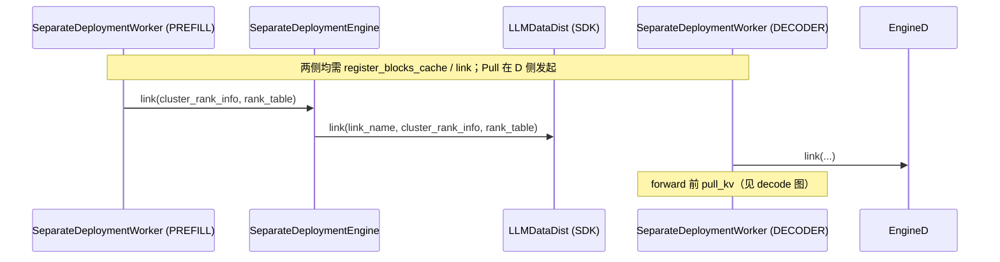
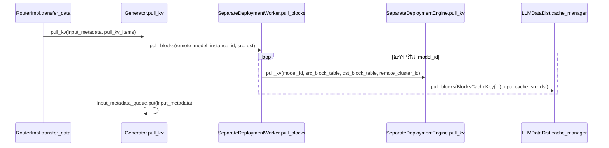

# `SeparateDeploymentEngine`（及同文件 `SeparateDeploymentWorker`、`DmiModeNodeRole`）

## Summary

`SeparateDeploymentEngine` 是 MindIE-LLM **PD 分离在 Python 侧对接 Ascend `llm_datadist.LLMDataDist` 的薄封装**：构造时按节点角色映射为 `LLMRole`（PROMPT / DECODER / MIX），`init` 打开 `cache_manager` 与远端可访问缓存，对外提供 **建链 `link` / 断链 `unlink` / 注册块缓存 `register_blocks_cache` / 拉取 KV `pull_kv`**。它不挂在 `Generator` 上直接作为成员；`Generator`（经 `PDInterface`）持有的是 **`SeparateDeploymentWorker`**，Worker 内部再构造本类实例（[separate_deployment_engine.py:436-443](d:\design\MindIE-LLM\mindie_llm\text_generator\utils\separate_deployment_engine.py)）。**Prefill 写本地 KV、Decode 侧通过 `pull_kv` 拉块** 的主路径在本文件只体现为 **decode 侧 `cache_manager.pull_blocks`**，未见 `push` 类 API（[separate_deployment_engine.py:374-383](d:\design\MindIE-LLM\mindie_llm\text_generator\utils\separate_deployment_engine.py)）。

> synthesis: 这是 MindIE PD 链路 Python 端的薄封装，真正的状态机在 C++ `LlmEngine::ScheduleExecTransfer` 与 `Scheduler` 的 `KVPulledReqEnterRunningQueue` / `ScheduleTransfer` 中。

## Sources

| 路径 | 作用 |
|------|------|
| [d:\design\MindIE-LLM\mindie_llm\text_generator\utils\separate_deployment_engine.py](d:\design\MindIE-LLM\mindie_llm\text_generator\utils\separate_deployment_engine.py) | `SeparateDeploymentEngine` / `SeparateDeploymentWorker` / `DmiModeNodeRole` / `RankInfo` / `LinkResult` |
| [d:\design\MindIE-LLM\mindie_llm\text_generator\generator.py](d:\design\MindIE-LLM\mindie_llm\text_generator\generator.py) | `PDModelConfig`、`PDInterface._init_sepd_engine`、`pull_kv`、`KVCacheSettings` 与 `build` 注册 PD 块描述 |
| [d:\design\MindIE-LLM\mindie_llm\connector\request_router\router_impl.py](d:\design\MindIE-LLM\mindie_llm\connector\request_router\router_impl.py) | `transfer_data` → `Generator.pull_kv`（connector 侧 PD 拉 KV 入口） |
| [d:\design\MindIE-LLM\mindie_llm\text_generator\mempool\mooncake_mempool.py](d:\design\MindIE-LLM\mindie_llm\text_generator\mempool\mooncake_mempool.py) | Mooncake `MemPool`（与 `LLMDataDist` 并行的一类 KV 池后端，本实体无直接引用） |
| [d:\design\MindIE-LLM\src\engine\llm_engine.cpp](d:\design\MindIE-LLM\src\engine\llm_engine.cpp) | `ScheduleExecTransfer` / `NotifyMeKvPulledSeqIds` 与 Executor 拉 KV 编排 |
| [d:\design\MindIE-LLM\src\scheduler\scheduler.cpp](d:\design\MindIE-LLM\src\scheduler\scheduler.cpp) | `KVPulledReqEnterRunningQueue`、`ScheduleTransfer` 实现 |
| [d:\design\MindIE-LLM\src\block_manager\lwd_self_attn_block_manager.h](d:\design\MindIE-LLM\src\block_manager\lwd_self_attn_block_manager.h) | 边云 layerwise 专用 block 管理（与 Python 引擎无直接符号依赖） |

## 类签名与角色枚举

### `SeparateDeploymentEngine` 定义与 `__init__`

- **类定义**：[separate_deployment_engine.py:268](d:\design\MindIE-LLM\mindie_llm\text_generator\utils\separate_deployment_engine.py)
- **`__init__(self, role=DmiModeNodeRole.DECODER, local_cluster_id=0, local_logic_device_id=0, kv_trans_timeout=1, kv_rdma_sl=-1, kv_rdma_tc=-1, kv_link_timeout=1080)`**：[separate_deployment_engine.py:269-308](d:\design\MindIE-LLM\mindie_llm\text_generator\utils\separate_deployment_engine.py)
  - `role` → `LLMRole`：`PREFILL`→`LLMRole.PROMPT`，`DECODER`→`LLMRole.DECODER`，`FLEX`→`LLMRole.MIX`（注释说明上层名 flex 对应底层 MIX）[separate_deployment_engine.py:271-277](d:\design\MindIE-LLM\mindie_llm\text_generator\utils\separate_deployment_engine.py)
  - `self.separate_deployment_engine = LLMDataDist(engine_role, local_cluster_id)` [separate_deployment_engine.py:281](d:\design\MindIE-LLM\mindie_llm\text_generator\utils\separate_deployment_engine.py)
  - `LLMDataDistConfig`：`device_id`、`enable_cache_manager=True`、`enable_remote_cache_accessible=True`、`link_total_time`、`link_retry_count=80`、`sync_kv_timeout`（毫秒，`kv_trans_timeout`≤0 时强制为 1 秒再乘 1000）[separate_deployment_engine.py:283-296](d:\design\MindIE-LLM\mindie_llm\text_generator\utils\separate_deployment_engine.py)
  - 可选 RDMA：`kv_rdma_sl`/`kv_rdma_tc` 写入 `llm_options["llm.RdmaServiceLevel"]` 等，非法范围抛异常 [separate_deployment_engine.py:297-305](d:\design\MindIE-LLM\mindie_llm\text_generator\utils\separate_deployment_engine.py)
  - `init(llm_options)`，并维护 `npu_tensors`、`npu_cache_map` [separate_deployment_engine.py:306-308](d:\design\MindIE-LLM\mindie_llm\text_generator\utils\separate_deployment_engine.py)

### 与 `Generator` 的依赖关系

- `Generator` **导入的是 `SeparateDeploymentWorker`，不是 `SeparateDeploymentEngine`** [generator.py:64-67](d:\design\MindIE-LLM\mindie_llm\text_generator\generator.py)。
- `PDInterface` 成员为 `self.separate_deployment_worker: Optional[SeparateDeploymentWorker]`，初始 `None` [generator.py:119-124](d:\design\MindIE-LLM\mindie_llm\text_generator\generator.py)。
- `_init_sepd_engine` 在 `model_role` 为 `DmiModeNodeRole` 的 **decoder / prefill / flex** 时 `SeparateDeploymentWorker(...)` [generator.py:177-198](d:\design\MindIE-LLM\mindie_llm\text_generator\generator.py)；`warm_up` 结束后调用 [generator.py:513](d:\design\MindIE-LLM\mindie_llm\text_generator\generator.py)。

> [!warning] CONTRADICTION: `PDModelConfig.model_role` 默认字符串为 `"standard"`（`STANDARD_TAG`，[generator.py:93-96](d:\design\MindIE-LLM\mindie_llm\text_generator\generator.py)），而 `_init_sepd_engine` 用 **枚举成员** 做 `in` 判断（[generator.py:179-184](d:\design\MindIE-LLM\mindie_llm\text_generator\generator.py)）—— `"standard"` **不会**进入该分支，故 **`SeparateDeploymentEngine` 不会被构造**（与显式配置 `prefill`/`decoder`/`flex` 对比）。

### `DmiModeNodeRole`（PD 节点角色）

- 枚举 **`PREFILL` / `DECODER` / `FLEX`**，字符串值分别为 `'prefill'`、`'decoder'`、`'flex'` [separate_deployment_engine.py:94-107](d:\design\MindIE-LLM\mindie_llm\text_generator\utils\separate_deployment_engine.py)。
- **无** `STANDARD` 枚举项；标准单机角色由 `PDModelConfig` 的 `"standard"` 字符串表示，且不触发 PD Worker 初始化（见上）。

### `SeparateDeploymentWorker`（对外编排）

- 构造：仅当 `role in [DmiModeNodeRole.DECODER, PREFILL, FLEX]` 时创建内部 `SeparateDeploymentEngine` [separate_deployment_engine.py:435-445](d:\design\MindIE-LLM\mindie_llm\text_generator\utils\separate_deployment_engine.py)；否则抛 **not support role** [separate_deployment_engine.py:445](d:\design\MindIE-LLM\mindie_llm\text_generator\utils\separate_deployment_engine.py)。
- 两后台线程：`fill_window_thread`（`_fill_window_worker`）、`process_window_thread`（`_process_window_worker`）[separate_deployment_engine.py:447-453](d:\design\MindIE-LLM\mindie_llm\text_generator\utils\separate_deployment_engine.py)。

## 主流程（prefill 端 / decode 端）

### Prefill 端（概念 + 源码可见部分）

本文件 **没有** 单独的 "prefill 推送" Python 方法；Prefill 侧通过 **`LLMRole.PROMPT`** 初始化 `LLMDataDist`，与 Decode 侧 **建链、块注册** 后，KV 由 **Decode 侧 `pull_kv` → `cache_manager.pull_blocks`** 拉取（[separate_deployment_engine.py:374-378](d:\design\MindIE-LLM\mindie_llm\text_generator\utils\separate_deployment_engine.py)）。建链使用 `RankInfo.get_rank_table()` 生成的 JSON rank table（[separate_deployment_engine.py:193-259](d:\design\MindIE-LLM\mindie_llm\text_generator\utils\separate_deployment_engine.py)）与 `link`（[separate_deployment_engine.py:310-361](d:\design\MindIE-LLM\mindie_llm\text_generator\utils\separate_deployment_engine.py)）。

### Decode 端（pull 路径）

- `Generator.pull_kv`：设 NPU device、`pull_blocks` 循环，失败返回错误与失败 cluster id；成功则 `input_metadata_queue.put` [generator.py:153-175](d:\design\MindIE-LLM\mindie_llm\text_generator\generator.py)。
- `RouterImpl.transfer_data`：构造 composite、`pull_kv`、按 request 填响应 [router_impl.py:316-354](d:\design\MindIE-LLM\mindie_llm\connector\request_router\router_impl.py)。

### `SeparateDeploymentEngine` 方法一览（一句话）

| 方法 | 行号 | 作用 |
|------|------|------|
| `__init__` | [269-308](d:\design\MindIE-LLM\mindie_llm\text_generator\utils\separate_deployment_engine.py) | 映射角色、构造并 `init` `LLMDataDist` |
| `link` | [310-361](d:\design\MindIE-LLM\mindie_llm\text_generator\utils\separate_deployment_engine.py) | 由 rank_table 生成 `link_name`，调 SDK `link`；处理 `LLM_ALREADY_LINK` 与异常 |
| `unlink` | [363-369](d:\design\MindIE-LLM\mindie_llm\text_generator\utils\separate_deployment_engine.py) | SDK 断链 |
| `set_npu_cache` | [371-372](d:\design\MindIE-LLM\mindie_llm\text_generator\utils\separate_deployment_engine.py) | 记录 `model_id` → 注册得到的 npu cache 句柄 |
| `pull_kv` | [374-383](d:\design\MindIE-LLM\mindie_llm\text_generator\utils\separate_deployment_engine.py) | `cache_manager.pull_blocks` 从远端 cluster 拉块到本地 |
| `register_blocks_cache` | [385-387](d:\design\MindIE-LLM\mindie_llm\text_generator\utils\separate_deployment_engine.py) | 委托 `cache_manager.register_blocks_cache` |
| `query_register_mem_status` | [389-390](d:\design\MindIE-LLM\mindie_llm\text_generator\utils\separate_deployment_engine.py) | 查询链路内存注册状态 |
| `finalize` | [392-393](d:\design\MindIE-LLM\mindie_llm\text_generator\utils\separate_deployment_engine.py) | `LLMDataDist.finalize` |

### `SeparateDeploymentWorker` 主要方法（补充）

| 方法 | 行号 | 作用 |
|------|------|------|
| `build` | [471-475](d:\design\MindIE-LLM\mindie_llm\text_generator\utils\separate_deployment_engine.py) | 记录每 `model_id` 的 `CacheDesc` 与最大 block 数 |
| `set_npu_cache` | [478-488](d:\design\MindIE-LLM\mindie_llm\text_generator\utils\separate_deployment_engine.py) | `register_blocks_cache` + `set_npu_cache` |
| `pull_blocks` | [490-510](d:\design\MindIE-LLM\mindie_llm\text_generator\utils\separate_deployment_engine.py) | 校验已 link、块范围，多 `model_id` 循环 `pull_kv` |
| `link` / `unlink` / `unlink_batch` / `unlink_all` | [515-615](d:\design\MindIE-LLM\mindie_llm\text_generator\utils\separate_deployment_engine.py) | 异步队列 + 窗口建链与清理 |
| `_try_create_link` / `_query_mem_status` | [617-741](d:\design\MindIE-LLM\mindie_llm\text_generator\utils\separate_deployment_engine.py) | 建链与内存注册轮询（最多 3 次） |
| `_fill_window_worker` / `_process_window_worker` | [743-818](d:\design\MindIE-LLM\mindie_llm\text_generator\utils\separate_deployment_engine.py) | 并发建链与状态推进 |

## KV 传输栈集成（LLMDataDist + Mooncake）

### LLMDataDist

- 全部 KV 传输与块注册均经 **`from llm_datadist import LLMDataDist, ...`**（[separate_deployment_engine.py:18-21](d:\design\MindIE-LLM\mindie_llm\text_generator\utils\separate_deployment_engine.py)）。
- **`cache_manager`**：配置 `enable_cache_manager` / `enable_remote_cache_accessible`（[separate_deployment_engine.py:285-286](d:\design\MindIE-LLM\mindie_llm\text_generator\utils\separate_deployment_engine.py)）；`pull_kv` 与 `register_blocks_cache` 均经 `self.separate_deployment_engine.cache_manager`（[separate_deployment_engine.py:377-387](d:\design\MindIE-LLM\mindie_llm\text_generator\utils\separate_deployment_engine.py)）。

### Mooncake

- **`separate_deployment_engine.py` 内无 `Mooncake` / `mooncake_mempool` 引用**（grep 为空，N/A）。
- `Generator` 在 **`pd_config.model_role == DECODER` 且配置了 `kv_pool_backend` / `kv_pool_config_path`** 时 **`MemPool.create_pool`**（可含 mooncake 后端）[generator.py:525-538](d:\design\MindIE-LLM\mindie_llm\text_generator\generator.py)；与 **`SeparateDeploymentEngine` 无直接 import/调用关系**，属于 **并行 KV 池/辅助路径**，需与 `LLMDataDist` 区分理解。

## 与 BatchScheduler（C++）的协作

- **Python 的 `SeparateDeploymentEngine` 不调用** `KVPulledReqEnterRunningQueue` / `ScheduleTransfer` / `NotifyMeKvPulledSeqIds`（在 `*.py` 中无匹配；**协作发生在 C++ `LlmEngine` + `Scheduler` + Executor**）。
- **编排链**（源码锚点）：
  - `LlmEngine::ScheduleExecTransfer`：`KVPulledReqEnterRunningQueue` → `ScheduleTransfer` → 若存在待传 batch 则 `ConstructPullKVRequest` → `ExecuteKVTransfer` [llm_engine.cpp:698-728](d:\design\MindIE-LLM\src\engine\llm_engine.cpp)。
  - `ReleaseKvCache` 路径：`NotifyMeKvPulledSeqIds` [llm_engine.cpp:187-198](d:\design\MindIE-LLM\src\engine\llm_engine.cpp)。
- **Python 侧**：Executor 通过 connector 调到 `RouterImpl.transfer_data` → `Generator.pull_kv`（见上），完成 **实际 `pull_blocks`**。
- `Generator.generate_token` 文档说明由 **`BatchScheduler` 构造 `input_metadata`** [generator.py:580-589](d:\design\MindIE-LLM\mindie_llm\text_generator\generator.py)，但 **PD 拉 KV** 与 **`generate_token` 不同路径**（transfer / pull_kv）。

## 与 connector / request_router 的协作

- `RouterImpl.initialize`：`dp_rank_id = (rank // (cp_size * tp_size)) % dp_size`，并构造 **`Generator(model_config=...)`** [router_impl.py:215-217](d:\design\MindIE-LLM\mindie_llm\connector\request_router\router_impl.py)。
- **PD 拉 KV 入口**：`transfer_data` → `convert_pull_kv_request_to_input_metadata_composite`、`_get_pull_kv_items` → **`self.generator.pull_kv`** [router_impl.py:316-328](d:\design\MindIE-LLM\mindie_llm\connector\request_router\router_impl.py)。
- `_get_pull_kv_items` 内注释说明 **`cluster_id` 与 dp instance 的对应关系**（单机 PD 等）[router_impl.py:684](d:\design\MindIE-LLM\mindie_llm\connector\request_router\router_impl.py)（细节见同函数 [637-726](d:\design\MindIE-LLM\mindie_llm\connector\request_router\router_impl.py)）。

## layerwise PD 路径

- **`SeparateDeploymentEngine` / `SeparateDeploymentWorker` 内无 `layerwise` / `lwd` 分支**（N/A）。
- **边云 layerwise**：`RouterImpl` 使用 `layerwise_disaggregated` 标志位 [router_impl.py:223-225](d:\design\MindIE-LLM\mindie_llm\connector\request_router\router_impl.py)；`seq_ctrl` 在 layerwise 时额外清理 plugin 序列 [router_impl.py:313-314](d:\design\MindIE-LLM\mindie_llm\connector\request_router\router_impl.py)。
- **`lwd_self_attn_block_manager.h`**：C++ **边云专用** `LwdSelfAttnBlockManager`，注释写明与 **边云** block 管理相关 [lwd_self_attn_block_manager.h:26-35](d:\design\MindIE-LLM\src\block_manager\lwd_self_attn_block_manager.h)，**无**对 Python `SeparateDeploymentEngine` 的包含或符号引用。
- `LlmEngine::ScheduleExecTransfer` 对 **`Role::PnD` / `Role::FlexPnD` 直接 return**（不与下文 PD transfer 混用）[llm_engine.cpp:701-703](d:\design\MindIE-LLM\src\engine\llm_engine.cpp)。

## 配置字段

| 字段 | 来源 | 说明 |
|------|------|------|
| `role`（→ `PDModelConfig.model_role`） | [generator.py:93-96](d:\design\MindIE-LLM\mindie_llm\text_generator\generator.py) | 默认 `"standard"`；需 `prefill`/`decoder`/`flex` 才初始化 Worker |
| `local_instance_id` | [generator.py:96](d:\design\MindIE-LLM\mindie_llm\text_generator\generator.py) | `local_cluster_id` |
| `npu_device_id` | [generator.py:98](d:\design\MindIE-LLM\mindie_llm\text_generator\generator.py) | `local_logic_device_id` → `LLMDataDistConfig.device_id` |
| `local_physical_device_id` / `local_device_ip` / `local_host_ip` | [generator.py:97-100](d:\design\MindIE-LLM\mindie_llm\text_generator\generator.py) | 建链 rank 表与 `RankInfo` |
| `kv_trans_timeout` | [generator.py:104](d:\design\MindIE-LLM\mindie_llm\text_generator\generator.py) | → `sync_kv_timeout`（ms）[separate_deployment_engine.py:289-292](d:\design\MindIE-LLM\mindie_llm\text_generator\utils\separate_deployment_engine.py) |
| `kv_link_timeout` | [generator.py:107](d:\design\MindIE-LLM\mindie_llm\text_generator\generator.py) | → `link_total_time` [separate_deployment_engine.py:287](d:\design\MindIE-LLM\mindie_llm\text_generator\utils\separate_deployment_engine.py) |
| `kv_rdma_sl` / `kv_rdma_tc` | [generator.py:105-106](d:\design\MindIE-LLM\mindie_llm\text_generator\generator.py) | 可选 RDMA 选项 [separate_deployment_engine.py:297-305](d:\design\MindIE-LLM\mindie_llm\text_generator\utils\separate_deployment_engine.py) |
| `link_retry_count` / `enable_cache_manager` 等 | — | 在引擎内写死或固定为 True [separate_deployment_engine.py:285-288](d:\design\MindIE-LLM\mindie_llm\text_generator\utils\separate_deployment_engine.py)（非 `PDModelConfig` 暴露字段） |

## 错误 / 失败处理

- **link**：`LLMException` → `TEXT_GENERATOR_PD_LINK_ERROR`；`LLM_ALREADY_LINK` → `TEXT_GENERATOR_PD_ALREADY_LINK` [separate_deployment_engine.py:342-361](d:\design\MindIE-LLM\mindie_llm\text_generator\utils\separate_deployment_engine.py)。
- **pull_kv**：`LLMException` → `TEXT_GENERATOR_PD_PULL_KV_ERROR` [separate_deployment_engine.py:380-383](d:\design\MindIE-LLM\mindie_llm\text_generator\utils\separate_deployment_engine.py)。
- **Worker `_query_mem_status`**：`RegisterMemStatus.FAILED` 则 `unlink` 并返回错误；**最多 3 次**查询，否则返回 **`TEXT_GENERATOR_PD_RETRY_QUERY`** 并将项 **重新入窗** [separate_deployment_engine.py:694-741](d:\design\MindIE-LLM\mindie_llm\text_generator\utils\separate_deployment_engine.py)、[806-811](d:\design\MindIE-LLM\mindie_llm\text_generator\utils\separate_deployment_engine.py)。
- **建链失败**：`_try_create_link` 失败 → `LinkResult.add_to_failed` [separate_deployment_engine.py:780-785](d:\design\MindIE-LLM\mindie_llm\text_generator\utils\separate_deployment_engine.py)。

## 跨项目对照（synthesis）

| 层次 | vLLM | SGLang | MindIE `SeparateDeploymentEngine` |
|------|------|--------|-----------------------------------|
| 服务入口 / 会话 | `entrypoints/serve/disagg/...`（典型 disagg serving） | `managers/disagg_service.py` + 各 `disaggregation/*/conn.py` | **无**独立 HTTP 入口；**connector** `RouterImpl.transfer_data` + **`Generator.pull_kv`** |
| 传输抽象 | `KVConnectorBase_V1` 等插件式 connector | NIXL/Mooncake/Mori 等 `*Conn` | Ascend **`LLMDataDist`** + **`cache_manager.pull_blocks`** |
| 块/元数据 | block table 由引擎与 connector 约定 | 类似 | **`BlocksCacheKey` + `src_block_table` / `dst_block_table`**，与 C++ `ConstructPullKVRequest` 对齐 |

> 说明：vLLM/SGLang 路径名为 **概念对照**，非本仓库文件锚点。详见 [comparison/topics/pd-disaggregation.md](../../comparison/topics/pd-disaggregation.md)。

## Notes / Caveats

> [!todo] VERIFY: `LinkResult` 状态键名为 **`"waitting"`**（拼写如此）[separate_deployment_engine.py:64-71](d:\design\MindIE-LLM\mindie_llm\text_generator\utils\separate_deployment_engine.py) —— 是否为故意保留以兼容 SDK，需确认。
> [!todo] VERIFY: `Generator.__del__` 会 `separate_deployment_worker.finalize()` [generator.py:542-544](d:\design\MindIE-LLM\mindie_llm\text_generator\generator.py)；多线程退出语义需确认。
> [!warning] CONTRADICTION: `PDModelConfig.model_role` 默认 `"standard"`（字符串）vs `_init_sepd_engine` 的枚举 `in` 判断 —— 默认配置下 PD Worker 不创建（详 §"与 Generator 的依赖关系"）。
> [!warning] CONTRADICTION: **`Mooncake`** 与 **`LLMDataDist`** 在 `Generator` 层可并存为不同 concern，不要混为同一调用栈（见 KV 一节）。

## See also

- [mindie/entities/Generator.md](Generator.md) — `PDInterface` 与 warmup 后 `_init_sepd_engine`
- [mindie/entities/BatchScheduler.md](BatchScheduler.md) — C++ `ScheduleTransfer` / KV pulled 队列（与 Python 引擎间接配合）
- [mindie/entities/LlmEngine.md](LlmEngine.md) — `ScheduleExecTransfer` 主循环步骤
- [comparison/topics/pd-disaggregation.md](../../comparison/topics/pd-disaggregation.md)
- [comparison/topics/kv-cache.md](../../comparison/topics/kv-cache.md)
