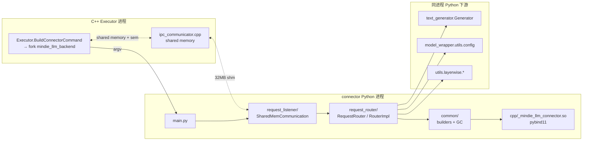

# `mindie_llm.connector` 模块

## Summary

`mindie_llm/connector/` 是 MindIE-LLM Python 侧的**独立后台进程**实现（CLI 入口由 `setup.py` 注册为 `mindie_llm_backend`，[setup.py:132](d:\design\MindIE-LLM\setup.py)）。它由 4 个子目录、22 个文件组成（含 1 个 C++ pybind 扩展），承担三件事：(1) 经 **POSIX 共享内存 + 信号量** 与 C++ Executor 收发 protobuf；(2) 把 `ExecuteRequest` 按类型分流到 5 个工作线程；(3) 把请求转译为 `InputMetadata` 并调用同进程内的 `Generator`。

> 本页是**模块结构清单**——目录、文件、类/函数索引、模块边界。请求流程、PD KV 拉取链路、Layerwise 调度状态机详见姊妹页 [topics/connector.md](../topics/connector.md)。

## Sources

| 入口 | 路径 |
|------|------|
| Python 包根 | [d:\design\MindIE-LLM\mindie_llm\connector\\](d:\design\MindIE-LLM\mindie_llm\connector) |
| 进程 main | [main.py](d:\design\MindIE-LLM\mindie_llm\connector\main.py) (143 行) |
| C++ 扩展构建挂入 | [CMakeLists.txt:61,122](d:\design\MindIE-LLM\CMakeLists.txt) |
| Proto 生成入 connector | [proto/CMakeLists.txt:73](d:\design\MindIE-LLM\proto\CMakeLists.txt) |
| 控制台 entry point | [setup.py:132](d:\design\MindIE-LLM\setup.py) |

## 目录结构

```
mindie_llm/connector/
├── __init__.py                                  # 仅版权头 [__init__.py:1-10]
├── main.py                                      # CLI + 信号注册 + RequestListener.start
├── common/        (8 files)                     # 协议、helper、对象池、GC
│   ├── __init__.py                              # 5 个 send_*_response 包装
│   ├── global_variables.py                      # ProcessStartArgName 常量
│   ├── input_metadata_composite.py              # InputMetadataComposite 数据类
│   ├── input_metadata_builder.py                # protobuf → InputMetadata 转换 (1051 行)
│   ├── response_builder.py                      # ExecuteResponseBuilder
│   ├── object_pool.py                           # ObjectPool 抽象基类
│   ├── adaptive_garbage_collector.py            # 自适应 GC 阈值
│   └── gc_monitor.py                            # gc.callbacks 计时器
├── request_listener/        (3 files)
│   ├── __init__.py
│   ├── request_listener.py                      # RequestListener 单例壳 (38 行)
│   └── shared_mem_communication.py              # SharedMemoryChannel + SharedMemCommunication (398 行)
├── request_router/        (3 + layerwise/4 = 7 files)
│   ├── __init__.py
│   ├── request_router.py                        # RequestRouter (5 队列 + 5 线程, 229 行)
│   ├── router_impl.py                           # RouterImpl 与 Generator 对接 (747 行)
│   └── layerwise/                               # 边云分离 PD 子目录
│       ├── __init__.py
│       ├── request_router_lwd.py                # RequestRouterLwd 公共基类 (465 行)
│       ├── request_router_edge.py               # RequestRouterEdge ("master"/边侧, 486 行)
│       └── request_router_cloud.py              # RequestRouterCloud ("slave"/云侧, 618 行)
└── cpp/        (2 files)
    ├── parallel_convert.cpp                     # pybind11 加速：GenerationOutput → protobuf
    └── CMakeLists.txt                           # 构建 _mindie_llm_connector.so
```

文件数（含 `__init__.py` 与非 .py）= 22，由 [Glob `**/*` on connector](d:\design\MindIE-LLM\mindie_llm\connector) 确认。

## 类 / 函数索引（按文件）

### `main.py`

| 符号 | 位置 | 作用 |
|------|------|------|
| `parse_from_cmd()` | [main.py:21-50](d:\design\MindIE-LLM\mindie_llm\connector\main.py) | argparse：`local_rank` / `local_world_size` / `global_rank` / `global_world_size` / `npu_num_per_dp` / `npu_device_id` / `parent_pid` / `shm_name_prefix` / `communication_type` / `use_mock_model` / `layerwise_disaggregated` / `layerwise_disaggregated_role_type` |
| `check_config(args)` | [main.py:53-94](d:\design\MindIE-LLM\mindie_llm\connector\main.py) | 校验，含 `communication_type ∈ {shared_meme, http}` ([main.py:78-80](d:\design\MindIE-LLM\mindie_llm\connector\main.py))、`layerwise_disaggregated ∈ {false,true}` ([main.py:82-87](d:\design\MindIE-LLM\mindie_llm\connector\main.py))、`role_type ∈ {"", master, slave}` ([main.py:88-93](d:\design\MindIE-LLM\mindie_llm\connector\main.py)) |
| `main()` | [main.py:97-129](d:\design\MindIE-LLM\mindie_llm\connector\main.py) | 启 GC → `RequestListener.get_instance(config)` → 注册 SIGTERM/SIGINT → `start()` 阻塞 |
| `register_signal(request_listener)` | [main.py:132-140](d:\design\MindIE-LLM\mindie_llm\connector\main.py) | SIGTERM → `request_listener.stop()` |

### `common/__init__.py`

5 个 thin wrapper：[`send_model_execute_response`](d:\design\MindIE-LLM\mindie_llm\connector\common\__init__.py)、`send_transfer_response`、`send_command_response`、`send_link_response`、`send_recover_command_response`，统一懒加载 `SharedMemCommunication` 类方法（[__init__.py:10-35](d:\design\MindIE-LLM\mindie_llm\connector\common\__init__.py)）。

### `common/global_variables.py`

| 符号 | 位置 | 作用 |
|------|------|------|
| `ProcessStartArgName` | [global_variables.py:13-26](d:\design\MindIE-LLM\mindie_llm\connector\common\global_variables.py) | CLI 参数名常量（13 个） |

### `common/input_metadata_composite.py`

| 符号 | 位置 | 作用 |
|------|------|------|
| `InputMetadataComposite` (dataclass) | [input_metadata_composite.py:19-35](d:\design\MindIE-LLM\mindie_llm\connector\common\input_metadata_composite.py) | 包装 `InputMetadata` + `block_copy` + `block_op` + `pull_kv_items` + (mix) `prefill_batch_size`/`decode_batch_size` |

### `common/input_metadata_builder.py`（最大文件，1051 行）

| 符号 | 位置 | 作用 |
|------|------|------|
| `ConvertPara` (dataclass) | [input_metadata_builder.py:58-61](d:\design\MindIE-LLM\mindie_llm\connector\common\input_metadata_builder.py) | `is_prefill` / `is_mix` 二元 flag |
| `convert_bytes_to_list(byte_data)` | [input_metadata_builder.py:64-67](d:\design\MindIE-LLM\mindie_llm\connector\common\input_metadata_builder.py) | proto bytes → int64 list（按 8 字节 unpack） |
| `parse_all_dp_batches_seq_lens(...)` | [input_metadata_builder.py:70-74](d:\design\MindIE-LLM\mindie_llm\connector\common\input_metadata_builder.py) | DP 批次 seq_lens 抽取 |
| `parse_sampling_parameters(seq_group_metadata)` | [input_metadata_builder.py:77-111](d:\design\MindIE-LLM\mindie_llm\connector\common\input_metadata_builder.py) | 8 字段 sampling_params → numpy structured array |
| `parse_swap_blocks(...)` | [input_metadata_builder.py:114-126](d:\design\MindIE-LLM\mindie_llm\connector\common\input_metadata_builder.py) | swap_in/out → `[decision_type, num1, num2]` 三元组 |
| `generate_lora_strings(seq_group_metadata)` | [input_metadata_builder.py:129-131](d:\design\MindIE-LLM\mindie_llm\connector\common\input_metadata_builder.py) | LoRA id 提取 |
| `get_batch_size(request, is_prefill, is_mix)` | [input_metadata_builder.py:134-150](d:\design\MindIE-LLM\mindie_llm\connector\common\input_metadata_builder.py) | (total_bs, prefill_bs, decode_bs) |
| `make_dummy_input_metadata(...)` | [input_metadata_builder.py:153-213](d:\design\MindIE-LLM\mindie_llm\connector\common\input_metadata_builder.py) | 占位 InputMetadata（陪跑请求） |
| `make_dummy_input_metadata_dmi_decoder(...)` | [input_metadata_builder.py:216-252](d:\design\MindIE-LLM\mindie_llm\connector\common\input_metadata_builder.py) | DMI 模式 decoder 侧专用 dummy |
| `build_simulate_block_table(...)` | [input_metadata_builder.py:255-291](d:\design\MindIE-LLM\mindie_llm\connector\common\input_metadata_builder.py) | 虚推 block_table 构造（含 SP/CP 维度对齐） |
| `convert_execute_model_request_to_input_metadata_composite(...)` | [input_metadata_builder.py:294-569](d:\design\MindIE-LLM\mindie_llm\connector\common\input_metadata_builder.py) | **核心**：`ExecuteModelRequest` → `InputMetadataComposite` |
| `convert_pull_kv_request_to_input_metadata_composite(...)` | [input_metadata_builder.py:572-711](d:\design\MindIE-LLM\mindie_llm\connector\common\input_metadata_builder.py) | **PD KV 拉取专用**：`PullKVRequest` → composite |
| `pad_input_ids(input_ids, cp_size)` | [input_metadata_builder.py:714-717](d:\design\MindIE-LLM\mindie_llm\connector\common\input_metadata_builder.py) | CP 场景 input_ids padding |
| `parse_para_is_prefill(...)` | [input_metadata_builder.py:720-885](d:\design\MindIE-LLM\mindie_llm\connector\common\input_metadata_builder.py) | prefill 阶段批量参数收集（含 prefix cache `computed_blocks`） |
| `update_mix_metadata(...)` | [input_metadata_builder.py:888-925](d:\design\MindIE-LLM\mindie_llm\connector\common\input_metadata_builder.py) | mix（chunked-prefill）字段补齐 |
| `get_attribute_info(link_request)` | [input_metadata_builder.py:928-1051](d:\design\MindIE-LLM\mindie_llm\connector\common\input_metadata_builder.py) | `PDLinkRequest` → (attribute_info, device_data, policy)；含 A2/A3 场景 device_info_num=9/10 切换（[928-999](d:\design\MindIE-LLM\mindie_llm\connector\common\input_metadata_builder.py)） |

### `common/response_builder.py`

| 符号 | 位置 | 作用 |
|------|------|------|
| `ExecuteResponseBuilder` | [response_builder.py:25-157](d:\design\MindIE-LLM\mindie_llm\connector\common\response_builder.py) | 工厂：`build_from_init_result`、`build_from_generate_output`、`build_from_generate_output_use_cpp`（导入 `_mindie_llm_connector.convert_generate_output`，[response_builder.py:52-57](d:\design\MindIE-LLM\mindie_llm\connector\common\response_builder.py)）、`lwd_build_from_generate_output_use_cpp`（[59-65](d:\design\MindIE-LLM\mindie_llm\connector\common\response_builder.py)）、`build_from_err_msg`、`build_from_transfer_result`、`build_from_recover_command_result` |

### `common/object_pool.py`

| 符号 | 位置 | 作用 |
|------|------|------|
| `ObjectPool` (ABC) | [object_pool.py:16-58](d:\design\MindIE-LLM\mindie_llm\connector\common\object_pool.py) | 通用对象池，子类需实现 `_create_object` / `_reset_object` |

> [!todo] VERIFY: 当前仓内未见 `ObjectPool` 的具体子类（grep 0 命中）；可能保留作为未来对象池接入的扩展点。

### `common/adaptive_garbage_collector.py`

| 符号 | 位置 | 作用 |
|------|------|------|
| `AdaptiveGarbageCollector` (单例) | [adaptive_garbage_collector.py:18-93](d:\design\MindIE-LLM\mindie_llm\connector\common\adaptive_garbage_collector.py) | 后台线程 `_monitor_loop`（[83-93](d:\design\MindIE-LLM\mindie_llm\connector\common\adaptive_garbage_collector.py)）按 `monitor_interval=1s` 滚动窗口（默认 8 个 tick）调整 `gc.set_threshold`；忙=`[50000,50,50]`、闲=`[20000,20,20]`（[adaptive_garbage_collector.py:33-34](d:\design\MindIE-LLM\mindie_llm\connector\common\adaptive_garbage_collector.py)） |

### `common/gc_monitor.py`

| 符号 | 位置 | 作用 |
|------|------|------|
| `GCMonitor` (单例) | [gc_monitor.py:19-52](d:\design\MindIE-LLM\mindie_llm\connector\common\gc_monitor.py) | 注册 `gc.callbacks` 统计累计 / 单次最大 GC 时间 |

### `request_listener/request_listener.py`

| 符号 | 位置 | 作用 |
|------|------|------|
| `RequestListener` (单例) | [request_listener.py:13-37](d:\design\MindIE-LLM\mindie_llm\connector\request_listener\request_listener.py) | 仅 4 个方法：`__init__` / `get_instance` / `start`（懒构造 `SharedMemCommunication`，[27-32](d:\design\MindIE-LLM\mindie_llm\connector\request_listener\request_listener.py)） / `stop` |

### `request_listener/shared_mem_communication.py`

| 符号 | 位置 | 作用 |
|------|------|------|
| `check_owner_and_permission(path, current_uid)` | [shared_mem_communication.py:32-45](d:\design\MindIE-LLM\mindie_llm\connector\request_listener\shared_mem_communication.py) | 校验 `/dev/shm/...` UID 与 0o600 权限 |
| `SharedMemoryChannel` | [shared_mem_communication.py:48-177](d:\design\MindIE-LLM\mindie_llm\connector\request_listener\shared_mem_communication.py) | 单条共享内存通道：`open_channel(role)` / `close_channel` / `open_error_response_channel` / `receive_message(message_class)`（[124-142](d:\design\MindIE-LLM\mindie_llm\connector\request_listener\shared_mem_communication.py)，4-byte length-prefix + protobuf）/ `send_message(buffer_offset)` / `send_binary_data` |
| `SharedMemCommunication` (单例) | [shared_mem_communication.py:180-397](d:\design\MindIE-LLM\mindie_llm\connector\request_listener\shared_mem_communication.py) | 4 个 channel：`execute` / `shared_sync_link` / `transfer` / `recover_command`（[shared_mem_communication.py:183](d:\design\MindIE-LLM\mindie_llm\connector\request_listener\shared_mem_communication.py)）+ 1 个 `execute_error_response`；按 `layerwise_disaggregated` + `role_type` 选择 `RequestRouter` / `RequestRouterEdge` / `RequestRouterCloud`（[204-213](d:\design\MindIE-LLM\mindie_llm\connector\request_listener\shared_mem_communication.py)）；`start()` 给每个 channel 起一个 `CoreThread` 跑 `_process_incoming_requests` |
| `SharedMemoryChannel.DEFAULT_SHARED_MEMORY_SIZE = 32 MB` | [shared_mem_communication.py:50](d:\design\MindIE-LLM\mindie_llm\connector\request_listener\shared_mem_communication.py) | 与 C++ `DEFAULT_SHARED_MEMORY_SIZE` 对齐（[src/include/utils/shared_memory.h:22](d:\design\MindIE-LLM\src\include\utils\shared_memory.h)） |
| `MODEL_INIT_RESP_SIZE = 0.5 MB` / `EXECUTE_RESP_SLOT_SIZE = 0.5 MB` | [shared_mem_communication.py:52-53](d:\design\MindIE-LLM\mindie_llm\connector\request_listener\shared_mem_communication.py) | 与 C++ 同名常量对齐（[src/include/utils/shared_memory.h:33,35](d:\design\MindIE-LLM\src\include\utils\shared_memory.h)） |

### `request_router/request_router.py`

| 符号 | 位置 | 作用 |
|------|------|------|
| `RequestRouter` | [request_router.py:34-228](d:\design\MindIE-LLM\mindie_llm\connector\request_router\request_router.py) | 5 队列 + 5 `CoreThread`：`inference_queue`/`do_inference`、`transfer_queue`/`do_transfer`、`pdlink_queue`/`do_pdlink`、`command_queue`/`do_command`、`query_queue`/`do_query`（[50-69](d:\design\MindIE-LLM\mindie_llm\connector\request_router\request_router.py)） |
| `RequestRouter.get_model_impl_config(model_config)` | [request_router.py:78-96](d:\design\MindIE-LLM\mindie_llm\connector\request_router\request_router.py) | `infer_mode` `standard` → `BaseConfig`，`dmi` → `DmiConfig` |
| `RequestRouter.initialize(request_config)` | [request_router.py:103-109](d:\design\MindIE-LLM\mindie_llm\connector\request_router\request_router.py) | 解析配置 + `RouterImpl().initialize` + 回写 `init_results` |
| `RequestRouter.do_inference()` | [request_router.py:111-141](d:\design\MindIE-LLM\mindie_llm\connector\request_router\request_router.py) | 处理 `MODEL_INFER` / `MODEL_INFER_SECOND` / `MODEL_INIT` / `MODEL_FINALIZE` / `TEXT_GENERATOR_CLEANUP` / `RECOVER_COMMAND_EXEC` / `START_COMMAND_EXEC` |
| `RequestRouter.do_transfer()` | [request_router.py:156-168](d:\design\MindIE-LLM\mindie_llm\connector\request_router\request_router.py) | `KV_TRANSFER` → `RouterImpl.transfer_data`，`CLEAR_COMMAND_EXEC` → `recover_command_exec` |
| `RequestRouter.do_pdlink()` | [request_router.py:143-154](d:\design\MindIE-LLM\mindie_llm\connector\request_router\request_router.py) | `PD_LINK` → `pd_role` |
| `RequestRouter.do_command()` | [request_router.py:170-187](d:\design\MindIE-LLM\mindie_llm\connector\request_router\request_router.py) | `LORA_OPERATION` / `PAUSE_COMMAND_EXEC[_ROCE]` |
| `RequestRouter.do_query()` | [request_router.py:190-202](d:\design\MindIE-LLM\mindie_llm\connector\request_router\request_router.py) | `PD_LINK_STATUS_QUERY` → `query_link_status` |
| `RequestRouter.accept(execute_request)` | [request_router.py:204-228](d:\design\MindIE-LLM\mindie_llm\connector\request_router\request_router.py) | 按 `execute_type` 入对应队列；`MODEL_FINALIZE` 广播到全部 5 队列以触发线程退出 |

### `request_router/router_impl.py`

| 符号 | 位置 | 作用 |
|------|------|------|
| `_print_component_error_log(e)` | [router_impl.py:78-98](d:\design\MindIE-LLM\mindie_llm\connector\request_router\router_impl.py) | HCCL/CANN 异常日志聚类 |
| `RouterImpl` (`__slots__`) | [router_impl.py:101-143](d:\design\MindIE-LLM\mindie_llm\connector\request_router\router_impl.py) | 17 字段（`config`/`tp_size`/`cp_size`/`dp_size`/`dp_rank_id`/`generator`/`block_size`/`is_mix_model`/`metrics`/`is_inference_pause`/`layerwise_disaggregated` 等） |
| `RouterImpl.parse_early_stopping_text(model_config)` | [router_impl.py:145-160](d:\design\MindIE-LLM\mindie_llm\connector\request_router\router_impl.py) | 从 `models` JSON 字段解析 early stopping 字符串 |
| `RouterImpl.check_output(generate_output)` | [router_impl.py:162-177](d:\design\MindIE-LLM\mindie_llm\connector\request_router\router_impl.py) | token_ids/eos_info shape & dtype 校验 |
| `RouterImpl._get_id_to_block_table_map(**kwargs)` | [router_impl.py:179-206](d:\design\MindIE-LLM\mindie_llm\connector\request_router\router_impl.py) | SP/CP 时按 inst_id 切 src/dst block table |
| `RouterImpl.initialize(model_config)` | [router_impl.py:208-278](d:\design\MindIE-LLM\mindie_llm\connector\request_router\router_impl.py) | 构造 `Generator(model_config)`、计算 `dp_rank_id` 公式（[215](d:\design\MindIE-LLM\mindie_llm\connector\request_router\router_impl.py)）、构造 `kvCacheDescs` 返回 |
| `RouterImpl.execute(execute_request)` | [router_impl.py:280-295](d:\design\MindIE-LLM\mindie_llm\connector\request_router\router_impl.py) | `forward_type` 派发：DECODE/PREFILL → `_generate`，MIXED → `_mix`，DUMMY → `_execute_empty_batch` |
| `RouterImpl.seq_ctrl(execute_request)` | [router_impl.py:297-314](d:\design\MindIE-LLM\mindie_llm\connector\request_router\router_impl.py) | `Generator.clear_cache(seq_ids)`；layerwise 时额外 `plugin_manager.set_clean_sequence_ids` |
| `RouterImpl.transfer_data(execute_request)` | [router_impl.py:316-354](d:\design\MindIE-LLM\mindie_llm\connector\request_router\router_impl.py) | **PD KV 拉取主路径**：`convert_pull_kv_request_to_input_metadata_composite` → `_get_pull_kv_items` → `Generator.pull_kv` |
| `RouterImpl.query_link_status(execute_request)` | [router_impl.py:356-392](d:\design\MindIE-LLM\mindie_llm\connector\request_router\router_impl.py) | `Generator.query_link_status` 结果 → `PDLinkStatusResponse` |
| `RouterImpl.pd_role(execute_request)` | [router_impl.py:394-447](d:\design\MindIE-LLM\mindie_llm\connector\request_router\router_impl.py) | PD 建链：`unlink_batch` → `switch_role` → `link` |
| `RouterImpl.process_lora_operation(execute_request)` | [router_impl.py:449-470](d:\design\MindIE-LLM\mindie_llm\connector\request_router\router_impl.py) | LoRA `LOAD` / `UNLOAD` |
| `RouterImpl.recover_command_exec(execute_request)` | [router_impl.py:472-477](d:\design\MindIE-LLM\mindie_llm\connector\request_router\router_impl.py) | 与 `Generator.execute_recover_command` 对接 |
| `RouterImpl.finalize()` | [router_impl.py:479-480](d:\design\MindIE-LLM\mindie_llm\connector\request_router\router_impl.py) | `metrics.output()` |
| `RouterImpl._execute_empty_batch(execute_request)` | [router_impl.py:482-512](d:\design\MindIE-LLM\mindie_llm\connector\request_router\router_impl.py) | 跑陪跑 batch（DMI decoder 侧需先 enqueue 一次） |
| `RouterImpl._mix(execute_request)` | [router_impl.py:514-520](d:\design\MindIE-LLM\mindie_llm\connector\request_router\router_impl.py) | mix=`is_req_prefill` 含 True 与 False 同时存在 |
| `RouterImpl._generate(execute_request, is_prefill, is_mix)` | [router_impl.py:522-635](d:\design\MindIE-LLM\mindie_llm\connector\request_router\router_impl.py) | 普通 / layerwise 两路（[541-574](d:\design\MindIE-LLM\mindie_llm\connector\request_router\router_impl.py)），>120 序列走 cpp 二进制响应 |
| `RouterImpl._get_pull_kv_items(...)` | [router_impl.py:637-726](d:\design\MindIE-LLM\mindie_llm\connector\request_router\router_impl.py) | `cluster_id` ↔ DP 实例映射核心，详见 [topics/connector.md §cluster_id ↔ DP 实例](../topics/connector.md) |
| `RouterImpl._prepare_kv_block(...)` | [router_impl.py:728-730](d:\design\MindIE-LLM\mindie_llm\connector\request_router\router_impl.py) | `Generator.swap` 包装 |
| `RouterImpl._handle_requests(...)` | [router_impl.py:732-746](d:\design\MindIE-LLM\mindie_llm\connector\request_router\router_impl.py) | swap → `Generator.generate_token` |
| 模块常量 | [router_impl.py:66-71](d:\design\MindIE-LLM\mindie_llm\connector\request_router\router_impl.py) | `NON_KVCACHE_TOKEN_NUM=1`、`MAX_SEQUENCE_IDS_FOR_CPP=120`、`MAX_EARLY_STOP_TEXT_LEN=1024` |

### `request_router/layerwise/request_router_lwd.py`

| 符号 | 位置 | 作用 |
|------|------|------|
| 模块常量 | [request_router_lwd.py:39-45](d:\design\MindIE-LLM\mindie_llm\connector\request_router\layerwise\request_router_lwd.py) | `MASTER_ID=0`、`REQUEST_KEY_MAX=(1<<31)-2`、长序列阈值 `LONG_SEQ_LEN_MIN=7500`、DS-int8 = `31000`、多机 int4 = `15000` |
| `LastExecType` (IntEnum) | [request_router_lwd.py:48-50](d:\design\MindIE-LLM\mindie_llm\connector\request_router\layerwise\request_router_lwd.py) | PREFILL=0, DECODE=1 |
| `DecisionType` (IntEnum) | [request_router_lwd.py:53-64](d:\design\MindIE-LLM\mindie_llm\connector\request_router\layerwise\request_router_lwd.py) | 11 种：DO_NOTHING / DO_PREFILL[_FIRST/_LAST] / DO_DECODE[_FIRST/_LAST] / DO_CLEAN_UP / DO_CLEAN_EOS / WAIT_COMM / WAIT_DECODE |
| `ModelType` (IntEnum) | [request_router_lwd.py:67-69](d:\design\MindIE-LLM\mindie_llm\connector\request_router\layerwise\request_router_lwd.py) | QWEN=0, DEEP_SEEK=1 |
| `DecisionMetadata` (dataclass) | [request_router_lwd.py:72-77](d:\design\MindIE-LLM\mindie_llm\connector\request_router\layerwise\request_router_lwd.py) | `chunk_group_size` / `chunk_group_index` / `chunk_index_size` / `chunk_index_in_group` |
| `RequestInfo` (dataclass) | [request_router_lwd.py:80-87](d:\design\MindIE-LLM\mindie_llm\connector\request_router\layerwise\request_router_lwd.py) | 一次请求的层切信息 |
| `RequestRouterLwd(RequestRouter)` | [request_router_lwd.py:90-465](d:\design\MindIE-LLM\mindie_llm\connector\request_router\layerwise\request_router_lwd.py) | 边云公共基类：4 队列（prefill/decode/clean_up/clean_eos）+ `request_map[REQUEST_KEY_PREFILL/DECODE]`；`initialize` 接 `LwdCommunicationManager` / `SharedMemoryManager`（[170-222](d:\design\MindIE-LLM\mindie_llm\connector\request_router\layerwise\request_router_lwd.py)）；`do_inference` 实现 master/slave 决策广播（[368-389](d:\design\MindIE-LLM\mindie_llm\connector\request_router\layerwise\request_router_lwd.py)） |

### `request_router/layerwise/request_router_edge.py`

| 符号 | 位置 | 作用 |
|------|------|------|
| `CtrlTypePos` (IntEnum) | [request_router_edge.py:29-34](d:\design\MindIE-LLM\mindie_llm\connector\request_router\layerwise\request_router_edge.py) | 边侧广播 tensor 4 字段 |
| `RequestRouterEdge(RequestRouterLwd)` | [request_router_edge.py:37-486](d:\design\MindIE-LLM\mindie_llm\connector\request_router\layerwise\request_router_edge.py) | 边侧（"master"）：`process_func` 注册 `DO_PREFILL_FIRST/LAST` `DO_DECODE_FIRST/LAST` `DO_CLEAN_UP/EOS`（[45-52](d:\design\MindIE-LLM\mindie_llm\connector\request_router\layerwise\request_router_edge.py)）；`calc_decision_type`（[216-238](d:\design\MindIE-LLM\mindie_llm\connector\request_router\layerwise\request_router_edge.py)）按长短序列优先级切换；含 chunked-prefill 元数据生成 `prepare_chunk_prefill_metadata_queue`（[356-383](d:\design\MindIE-LLM\mindie_llm\connector\request_router\layerwise\request_router_edge.py)） |

### `request_router/layerwise/request_router_cloud.py`

| 符号 | 位置 | 作用 |
|------|------|------|
| 模块常量 `LAYERS_DIVI_MIN_NUM = 2` | [request_router_cloud.py:32](d:\design\MindIE-LLM\mindie_llm\connector\request_router\layerwise\request_router_cloud.py) | |
| `CtrlTypePos` (IntEnum) | [request_router_cloud.py:35-43](d:\design\MindIE-LLM\mindie_llm\connector\request_router\layerwise\request_router_cloud.py) | 云侧广播 tensor 7 字段（含 `DIVI_NUM` / `CHUNK_NUM` / `PREFILL_DP_SEQ_LEN`） |
| `RequestRouterCloud(RequestRouterLwd)` | [request_router_cloud.py:46-618](d:\design\MindIE-LLM\mindie_llm\connector\request_router\layerwise\request_router_cloud.py) | 云侧（"slave"）：动态层切（`PREFILL_LAYERS_DIVI_SWITCH` env，[52](d:\design\MindIE-LLM\mindie_llm\connector\request_router\layerwise\request_router_cloud.py)）；`accept`（[599-617](d:\design\MindIE-LLM\mindie_llm\connector\request_router\layerwise\request_router_cloud.py)）覆盖父类，DECODE 时同步 `decode_batch_size_queue` |

### `cpp/parallel_convert.cpp`（pybind11 扩展）

| 符号 | 位置 | 作用 |
|------|------|------|
| `process_chunk(index, params, group_output)` | [parallel_convert.cpp:58-?](d:\design\MindIE-LLM\mindie_llm\connector\cpp\parallel_convert.cpp) | 单个 group 的 protobuf `SequenceOutput` 填充 |
| `lwd_build_cpp_response(...)` | [parallel_convert.cpp:205-239](d:\design\MindIE-LLM\mindie_llm\connector\cpp\parallel_convert.cpp) | layerwise 路径下 boost::asio 线程池并行填充 |
| `convert_generate_output(generate_output)` | (上半段) | 普通 `GenerationOutput` → `ExecuteResponse` bytes |
| `lwd_convert_generate_output(generate_output, is_prefill)` | [parallel_convert.cpp:240-302](d:\design\MindIE-LLM\mindie_llm\connector\cpp\parallel_convert.cpp) | layerwise 版（带 `layerwise_is_prefill`） |
| `PYBIND11_MODULE(_mindie_llm_connector, m)` | [parallel_convert.cpp:304-317](d:\design\MindIE-LLM\mindie_llm\connector\cpp\parallel_convert.cpp) | 暴露上述 2 函数；模块名 `_mindie_llm_connector` |
| 共享线程池 | [parallel_convert.cpp:55-56](d:\design\MindIE-LLM\mindie_llm\connector\cpp\parallel_convert.cpp) | `boost::asio::thread_pool thread_pool(boost::thread::hardware_concurrency())` |

### 自动生成的 protobuf 模块

`mindie_llm/connector/common/model_execute_data_pb2.py` **不在源码树**，由 [`proto/CMakeLists.txt:73`](d:\design\MindIE-LLM\proto\CMakeLists.txt) 在 build 阶段从 [`proto/model_execute_data.proto`](d:\design\MindIE-LLM\proto\model_execute_data.proto) 生成到 `mindie_llm/connector/common/`。所有 `from mindie_llm.connector.common.model_execute_data_pb2 import ...` 的模块（共 8 处，见下表）依赖该构建产物。

## 模块边界（Imports / Exports）

### 本模块向其它子系统的依赖（出向 import）

| 出向依赖 | 来源符号 | 在 connector 哪里被用 |
|----------|----------|---------------------|
| `mindie_llm.text_generator.generator.Generator` | text_generator | [router_impl.py:53](d:\design\MindIE-LLM\mindie_llm\connector\request_router\router_impl.py)（`RouterImpl.generator = Generator(model_config=...)`） |
| `mindie_llm.text_generator.utils.generation_output.GenerationOutput` | text_generator | [router_impl.py:62](d:\design\MindIE-LLM\mindie_llm\connector\request_router\router_impl.py)（异常路径构造空响应） |
| `mindie_llm.text_generator.utils.config.ResponseConfig` | text_generator | [router_impl.py:63](d:\design\MindIE-LLM\mindie_llm\connector\request_router\router_impl.py) |
| `mindie_llm.text_generator.utils.input_metadata.InputMetadata` / `SIMULATE_SEQUENCE_ID` | text_generator | [input_metadata_composite.py:16](d:\design\MindIE-LLM\mindie_llm\connector\common\input_metadata_composite.py)、[input_metadata_builder.py:30](d:\design\MindIE-LLM\mindie_llm\connector\common\input_metadata_builder.py) |
| `mindie_llm.model_wrapper.utils.config.{BaseConfig,DmiConfig}` | model_wrapper | [request_router.py:23](d:\design\MindIE-LLM\mindie_llm\connector\request_router\request_router.py)、[router_impl.py:48](d:\design\MindIE-LLM\mindie_llm\connector\request_router\router_impl.py) |
| `mindie_llm.model_wrapper.utils.error.ModelWrapperErrorCode` | model_wrapper | [router_impl.py:49](d:\design\MindIE-LLM\mindie_llm\connector\request_router\router_impl.py) |
| `mindie_llm.model_wrapper.utils.metrics.FileMetrics` | model_wrapper | [router_impl.py:50](d:\design\MindIE-LLM\mindie_llm\connector\request_router\router_impl.py) |
| `mindie_llm.model_wrapper.utils.npu_compile.set_npu_compile_mode` | model_wrapper | [router_impl.py:51](d:\design\MindIE-LLM\mindie_llm\connector\request_router\router_impl.py) |
| `mindie_llm.model_wrapper.utils.common_util.{split_list_equally,ip_string_to_list}` | model_wrapper | [input_metadata_builder.py:28](d:\design\MindIE-LLM\mindie_llm\connector\common\input_metadata_builder.py) |
| `mindie_llm.runtime.utils.helpers.safety.hf.safe_get_config_dict` | runtime | [router_impl.py:52](d:\design\MindIE-LLM\mindie_llm\connector\request_router\router_impl.py) |
| `mindie_llm.utils.layerwise.communication.LwdCommunicationManager` | utils.layerwise | [request_router_lwd.py:30](d:\design\MindIE-LLM\mindie_llm\connector\request_router\layerwise\request_router_lwd.py) |
| `mindie_llm.utils.layerwise.share_memory.SharedMemoryManager` | utils.layerwise | [request_router_lwd.py:31](d:\design\MindIE-LLM\mindie_llm\connector\request_router\layerwise\request_router_lwd.py) |
| `mindie_llm.utils.layerwise.request_metadata.{LwdMetadata,lwd_metadata_manager}` | utils.layerwise | 5 处（[request_router_lwd.py:32](d:\design\MindIE-LLM\mindie_llm\connector\request_router\layerwise\request_router_lwd.py)、[request_router_edge.py:22](d:\design\MindIE-LLM\mindie_llm\connector\request_router\layerwise\request_router_edge.py)、[request_router_cloud.py:25](d:\design\MindIE-LLM\mindie_llm\connector\request_router\layerwise\request_router_cloud.py)、[router_impl.py:60](d:\design\MindIE-LLM\mindie_llm\connector\request_router\router_impl.py)） |
| `mindie_llm.utils.layerwise.input_metadata.{EdgeCloudInputMetadata,pd_exec_matadata_instance}` | utils.layerwise | [router_impl.py:61](d:\design\MindIE-LLM\mindie_llm\connector\request_router\router_impl.py) |
| `mindie_llm.utils.layerwise.cloud_cut_inputdata.CloudCutInputData` | utils.layerwise | [request_router_cloud.py:26](d:\design\MindIE-LLM\mindie_llm\connector\request_router\layerwise\request_router_cloud.py) |
| `mindie_llm.utils.status.{CoreThread,MindieLlmStatusCode}` | utils | [request_router.py:25](d:\design\MindIE-LLM\mindie_llm\connector\request_router\request_router.py)、[router_impl.py:54](d:\design\MindIE-LLM\mindie_llm\connector\request_router\router_impl.py) |
| `mindie_llm.utils.log.logging.logger` / `logging_base.HandlerType` | utils.log | 全模块 |
| `mindie_llm.utils.log.error_code.{ErrorCode,ErrorCodeException}` | utils | [router_impl.py:64](d:\design\MindIE-LLM\mindie_llm\connector\request_router\router_impl.py) |
| `mindie_llm.utils.prof.profiler.{span_*,prof_step}` | utils.prof | 全模块 |
| `transformers.AutoTokenizer` | 第三方 | [router_impl.py:18](d:\design\MindIE-LLM\mindie_llm\connector\request_router\router_impl.py)（仅 `parse_early_stopping_text` 路径） |
| `posix_ipc.Semaphore` | 第三方（POSIX IPC） | [shared_mem_communication.py:15](d:\design\MindIE-LLM\mindie_llm\connector\request_listener\shared_mem_communication.py) |
| `multiprocessing.shared_memory.SharedMemory` | 标准库 | [shared_mem_communication.py:13](d:\design\MindIE-LLM\mindie_llm\connector\request_listener\shared_mem_communication.py) |
| `_mindie_llm_connector.{convert_generate_output,lwd_convert_generate_output}` | 自身 cpp pybind | 仅 [response_builder.py:54,62](d:\design\MindIE-LLM\mindie_llm\connector\common\response_builder.py) 内懒加载 |

### 本模块对外暴露（入向 import — grep 全 `mindie_llm/` Python 树）

只有 **3 处**外部模块 import 了 `mindie_llm.connector.*`，组成清晰的模块边界：

| 入向 import 处 | 引用符号 | 说明 |
|----------------|----------|------|
| [`mindie_llm/utils/layerwise/input_metadata.py:14`](d:\design\MindIE-LLM\mindie_llm\utils\layerwise\input_metadata.py) | `InputMetadataComposite` | 边云元数据缓存复用 connector 数据类 |
| [`mindie_llm/text_generator/generator.py:24`](d:\design\MindIE-LLM\mindie_llm\text_generator\generator.py) | `LoraOperationStatus` | LoRA 状态枚举（来自 protobuf） |
| [`setup.py:132`](d:\design\MindIE-LLM\setup.py) | entry point `mindie_llm_backend = mindie_llm.connector.main:main` | **唯一的进程级出口** — connector 作为独立 backend 进程被 C++ Executor `BuildConnectorCommand` ([executor.cpp:794-809](d:\design\MindIE-LLM\src\executor\executor.cpp)) 拉起 |

> synthesis: connector 模块**不被任何 server/text_generator 主流程同进程调用**——它**自身就是被 executor fork 出来的 backend 进程**，仅通过 (a) 进程参数 + (b) 共享内存协议与外界通信。`utils/layerwise` 与 `text_generator` 的两次反向 import 仅共享 dataclass / enum，不构成调用依赖。

## 模块边界图（synthesis）



## 跨子系统引用（[AGENTS.md §5 step 3](../../AGENTS.md) — 5 类 grep 结果）

### 1. 跨语言绑定（C++ `src/` ↔ Python connector）

| 关键字 | 范围 | 命中 | 说明 |
|--------|------|-----:|------|
| `_mindie_llm_connector` / `mindie_llm_connector` | `d:\design\MindIE-LLM\src\` 全 C++ 树 | 在 `d:\design\MindIE-LLM\src\` 全 C++ 树 grep 0 命中 | C++ Executor **不直接 import** connector 的 pybind 模块；该 .so 仅由 connector 自身在 [response_builder.py:54,62](d:\design\MindIE-LLM\mindie_llm\connector\common\response_builder.py) 加载 |
| `RouterImpl` / `RequestRouter` | `d:\design\MindIE-LLM\src\` 全 C++ 树 | 在 `d:\design\MindIE-LLM\src\` 全 C++ 树 grep 0 命中 | C++ 与 Python connector 之间**只通过共享内存 + protobuf**通信，无符号级耦合 |
| `connector` (大小写不敏感) | `d:\design\MindIE-LLM\src\` 全 C++ 树 | 6 命中（[executor.h:117](d:\design\MindIE-LLM\src\executor\executor.h)、[executor.cpp:794,804,808,953](d:\design\MindIE-LLM\src\executor\executor.cpp)、[llm_engine.cpp:651](d:\design\MindIE-LLM\src\engine\llm_engine.cpp)） | C++ 仅以"启动 connector 进程的命令行"形式引用：`Executor::BuildConnectorCommand` 拼出 `mindie_llm_backend` 启动参数 |
| `parallel_convert` / `convert_generate_output` / `lwd_convert_generate_output` | `d:\design\MindIE-LLM\src\` 全 C++ 树 | 在 `d:\design\MindIE-LLM\src\` 全 C++ 树 grep 0 命中 | pybind 入口不被 C++ executor 调用 |

> **结论（synthesis）**：connector 与 C++ 跨语言耦合**仅有两种形态**：(1) C++ 通过 `posix_ipc` 共享内存 + protobuf 消息传递；(2) C++ `BuildConnectorCommand` 拉起 connector 进程时把 `--shm_name_prefix` 等 CLI 参数传过去（与 [main.py:21-50](d:\design\MindIE-LLM\mindie_llm\connector\main.py) 字段对齐）。**无符号级 pybind/ctypes 绑定**。

### 2. 协作伙伴跨子系统引用

| 协作类 | 范围 | 命中 | 说明 |
|--------|------|-----:|------|
| `Generator` | `d:\design\MindIE-LLM\` 全仓库 | 在 [`router_impl.py:53`](d:\design\MindIE-LLM\mindie_llm\connector\request_router\router_impl.py) 单点构造 + 全仓库其它处大量出现作为类自身 | connector 内**只此一处**实例化 `Generator`，详见 [entities/Generator.md](../entities/Generator.md) |
| `SeparateDeploymentEngine` | `d:\design\MindIE-LLM\` 全仓库 | 在 connector 内 0 命中 | connector **不直接调用** `SeparateDeploymentEngine`，而是经 `Generator.pull_kv` → `SeparateDeploymentWorker.pull_blocks` → `SeparateDeploymentEngine.pull_kv` 间接接入（详见 [entities/SeparateDeploymentEngine.md](../entities/SeparateDeploymentEngine.md)） |
| `BatchScheduler` | `d:\design\MindIE-LLM\` 全仓库 | 在 connector 内 0 命中 | C++ 侧概念，与 connector 不同进程；KV 拉取完成后由 [`Scheduler::KVPulledReqEnterRunningQueue`](d:\design\MindIE-LLM\src\scheduler\scheduler.cpp) 接续（详见 [entities/BatchScheduler.md](../entities/BatchScheduler.md)） |
| `RouterImpl` | `d:\design\MindIE-LLM\` 全仓库 | connector 内自定义 + tests 中 33 命中 | 仅由 [`request_router.py:22,69,99-100`](d:\design\MindIE-LLM\mindie_llm\connector\request_router\request_router.py) 引用，未被外部模块 import |
| `LwdCommunicationManager` | `d:\design\MindIE-LLM\` 全仓库 | 在 [`request_router_lwd.py:30,175-180`](d:\design\MindIE-LLM\mindie_llm\connector\request_router\layerwise\request_router_lwd.py) 1 处 import | 边云通信入口；属 `utils.layerwise` 子系统 |
| `PluginManager` | `d:\design\MindIE-LLM\` 全仓库 | 在 connector 内 0 直接 import；间接通过 [`router_impl.py:314`](d:\design\MindIE-LLM\mindie_llm\connector\request_router\router_impl.py) `generator.plugin_manager` 与 [`request_router_lwd.py:420,435`](d:\design\MindIE-LLM\mindie_llm\connector\request_router\layerwise\request_router_lwd.py) `router_impl.generator.plugin_manager.model_wrapper.mapping.attn_dp.rank` 访问 | 仅以 `Generator.plugin_manager` 属性形式访问，详见 [entities/PluginManager.md](../entities/PluginManager.md) |

### 3. 配置 / IPC 共享数据结构

| 关键字 / 字段 | 范围 | 命中 | 说明 |
|---------------|------|-----:|------|
| `DEFAULT_SHARED_MEMORY_SIZE` (32 MB) | `d:\design\MindIE-LLM\src\` 全 C++ 树 | 5 命中（[shared_memory.h:22,29](d:\design\MindIE-LLM\src\include\utils\shared_memory.h)、[ipc_communicator.h:85,86](d:\design\MindIE-LLM\src\executor\ipc_communicator.h)、[communicator.cpp:73,81,96](d:\design\MindIE-LLM\src\executor\communicator.cpp)） | 与 Python `SharedMemoryChannel.DEFAULT_SHARED_MEMORY_SIZE` ([shared_mem_communication.py:50](d:\design\MindIE-LLM\mindie_llm\connector\request_listener\shared_mem_communication.py)) 数值对齐 |
| `MODEL_INIT_RESP_SIZE` (0.5 MB) | `d:\design\MindIE-LLM\src\` 全 C++ 树 | 2 命中（[shared_memory.h:33](d:\design\MindIE-LLM\src\include\utils\shared_memory.h)、[ipc_communicator.cpp:275](d:\design\MindIE-LLM\src\executor\ipc_communicator.cpp)） | 双向写入偏移共享 |
| `EXECUTE_RESP_SLOT_SIZE` (0.5 MB) | `d:\design\MindIE-LLM\src\` 全 C++ 树 | 2 命中（[shared_memory.h:35](d:\design\MindIE-LLM\src\include\utils\shared_memory.h)、[ipc_communicator.cpp:296](d:\design\MindIE-LLM\src\executor\ipc_communicator.cpp)） | 同上 |
| 4 个 channel 名 (`execute` / `shared_sync_link` / `transfer` / `recover_command`) | `d:\design\MindIE-LLM\src\` 全 C++ 树 | C++ executor 在 [communicator.cpp:73-97](d:\design\MindIE-LLM\src\executor\communicator.cpp) 构造对应 ipc communicator | Python `CHANNEL_NAMES` ([shared_mem_communication.py:183](d:\design\MindIE-LLM\mindie_llm\connector\request_listener\shared_mem_communication.py)) 与之对齐 |
| `pull_kv_items` | `d:\design\MindIE-LLM\` 全仓库 | 多处（详 [topics/connector.md §跨子系统引用](../topics/connector.md)） | connector 内由 `_get_pull_kv_items` 生成、`Generator.pull_kv` 消费 |
| 入向 `from mindie_llm.connector` import | `d:\design\MindIE-LLM\` 全仓库 | 仅 [`utils/layerwise/input_metadata.py:14`](d:\design\MindIE-LLM\mindie_llm\utils\layerwise\input_metadata.py) + [`text_generator/generator.py:24`](d:\design\MindIE-LLM\mindie_llm\text_generator\generator.py) 两个文件 | 模块边界小且明确 |

### 4. 测试覆盖

| 范围 | 命中文件 | 备注 |
|------|----------|------|
| `d:\design\MindIE-LLM\tests\pythontest\cpu\connector\` | 16 个测试文件（[`test_main_itself.py`](d:\design\MindIE-LLM\tests\pythontest\cpu\connector\test_main_itself.py)、[`request_router/test_router_impl.py`](d:\design\MindIE-LLM\tests\pythontest\cpu\connector\request_router\test_router_impl.py)、[`request_router/test_request_router.py`](d:\design\MindIE-LLM\tests\pythontest\cpu\connector\request_router\test_request_router.py)、[`request_router/layerwise/test_request_router_edge.py`](d:\design\MindIE-LLM\tests\pythontest\cpu\connector\request_router\layerwise\test_request_router_edge.py)、[`request_router/layerwise/test_request_router_cloud.py`](d:\design\MindIE-LLM\tests\pythontest\cpu\connector\request_router\layerwise\test_request_router_cloud.py)、[`request_listener/test_request_listener.py`](d:\design\MindIE-LLM\tests\pythontest\cpu\connector\request_listener\test_request_listener.py)、[`request_listener/test_shared_mem_communication.py`](d:\design\MindIE-LLM\tests\pythontest\cpu\connector\request_listener\test_shared_mem_communication.py)、[`common/test_response_builder.py`](d:\design\MindIE-LLM\tests\pythontest\cpu\connector\common\test_response_builder.py)、[`common/test_input_metadata_builder.py`](d:\design\MindIE-LLM\tests\pythontest\cpu\connector\common\test_input_metadata_builder.py)、[`common/gc_monitor_test.py`](d:\design\MindIE-LLM\tests\pythontest\cpu\connector\common\gc_monitor_test.py)、[`common/adaptive_garbage_collector_test.py`](d:\design\MindIE-LLM\tests\pythontest\cpu\connector\common\adaptive_garbage_collector_test.py)、[`common/model_execute_data_test.py`](d:\design\MindIE-LLM\tests\pythontest\cpu\connector\common\model_execute_data_test.py)） | **测试覆盖率高**：每个公共类基本都有对应 UT |
| `d:\design\MindIE-LLM\tests\pythontest\npu\text_generator\test_generator.py` | 1 处 import `mindie_llm.connector.*` | NPU 端到端测试中作为下游 |
| `d:\design\MindIE-LLM\tests\dlt\st\utils\connector_mock.py` | 含 `from mindie_llm.connector...` | DLT/ST 集成测试用的 mock 替身 |

### 5. doc / config 反查

| 范围 | 命中 | 内容 |
|------|-----:|------|
| `d:\design\MindIE-LLM\docs\` | 3 命中 | [`docs/zh/developer_guide/architecture_design/architecture_overview.md:20`](d:\design\MindIE-LLM\docs\zh\developer_guide\architecture_design\architecture_overview.md)（"kv connector"概念）、[`docs/zh/user_guide/user_manual/prefill_decode_mixed_deployment.md:33,412`](d:\design\MindIE-LLM\docs\zh\user_guide\user_manual\prefill_decode_mixed_deployment.md)（部署 `mindie_llm_backend_connector` 二进制权限）、[`docs/mindie_generator_aclgraph_pp_design.md:204`](d:\design\MindIE-LLM\docs\mindie_generator_aclgraph_pp_design.md)（`KVConnectorOutput` 结构注释） |
| `d:\design\MindIE-LLM\` 全树 `*.yaml` / `*.yml` / `*.json` | 0 命中 | 在 `d:\design\MindIE-LLM\` 全树 `*.yaml`/`*.yml`/`*.json` grep 0 命中 — 模块不通过 YAML/JSON 配置直接驱动，所有运行参数走 CLI argparse + protobuf |
| `proto/CMakeLists.txt` | 1 命中（[proto/CMakeLists.txt:73](d:\design\MindIE-LLM\proto\CMakeLists.txt)） | 把 protobuf 生成产物输出到 `mindie_llm/connector/common/` |
| `setup.py` | 1 命中（[setup.py:132](d:\design\MindIE-LLM\setup.py)） | `mindie_llm_backend` console script 入口 |
| `CMakeLists.txt` (root) | 2 命中（[CMakeLists.txt:61,122](d:\design\MindIE-LLM\CMakeLists.txt)） | include `mindie_llm/connector/cpp/` + `add_subdirectory` |

## Notes / Caveats

> [!todo] VERIFY: `ObjectPool` ([common/object_pool.py:16-58](d:\design\MindIE-LLM\mindie_llm\connector\common\object_pool.py)) 当前仓内无具体子类（grep 0 命中），可能为预留扩展点；如未来引入需补本页。

> [!todo] VERIFY: protobuf 生成产物 `common/model_execute_data_pb2.py` 不在 git tracked 源码里（依赖 `proto/CMakeLists.txt:73` 构建），所有 `from mindie_llm.connector.common.model_execute_data_pb2 import ...` 在源代码静态扫描中显示为"找不到模块"，需通过构建产物验证类型对齐。

> [!warning] CONTRADICTION: `main.py:78-80` 校验 `communication_type ∈ {"shared_meme", "http"}` 但 `RequestListener.start` ([request_listener.py:27-32](d:\design\MindIE-LLM\mindie_llm\connector\request_listener\request_listener.py)) 与 `SharedMemCommunication` 均**未实现 HTTP 分支**——若运行期传 `--communication_type http`，将由 `SharedMemCommunication` 直接以共享内存模式启动（`shared_meme` 与 `http` 输入路径无差异）。详见 [topics/connector.md §请求监听层](../topics/connector.md)。

## See also

- [mindie/topics/connector.md](../topics/connector.md) — 请求生命周期、PD KV 拉取详细链、Layerwise 状态机（**主要补充材料**）
- [mindie/entities/Generator.md](../entities/Generator.md) — `RouterImpl` 单点构造的 Python 主对象
- [mindie/entities/SeparateDeploymentEngine.md](../entities/SeparateDeploymentEngine.md) — `Generator.pull_kv` 下游 PD 引擎
- [mindie/entities/PluginManager.md](../entities/PluginManager.md) — Layerwise 路径下 `generator.plugin_manager.set_clean_sequence_ids` 入口
- [mindie/entities/LlmEngine.md](../entities/LlmEngine.md) — 拉起 connector 进程的 C++ 侧（含 `BuildConnectorCommand`）
- [mindie/entities/BatchScheduler.md](../entities/BatchScheduler.md) — KV 拉取完成后续接的 C++ 调度器
- [mindie/topics/request-lifecycle.md](../topics/request-lifecycle.md)
- [comparison/topics/pd-disaggregation.md](../../comparison/topics/pd-disaggregation.md)
