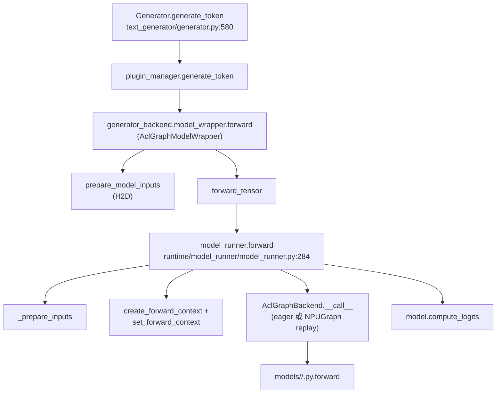

# `runtime/model_runner` — Model runner module

## Summary
synthesis: `runtime/model_runner` 把"模型一次 forward + KV cache 绑定 + aclgraph capture/replay"封装成一个对象。两份并存的实现：`ModelRunner`（atb 路线，[model_runner.py](d:\design\MindIE-LLM\mindie_llm\runtime\model_runner\model_runner.py)）和 `ModelRunnerExp`（torch / generator_aclgraph 路线，[model_runner_exp.py](d:\design\MindIE-LLM\mindie_llm\runtime\model_runner\model_runner_exp.py)）。两者都在 `Generator` 之下、`AclGraphModelWrapper`/`AclGraphModelWrapperExp` 之内被实例化。设计文档将这条链路命名为 `generator_aclgraph` 路线，是当前 PP 改造的主目标（详见 [topics/aclgraph-pp.md](../topics/aclgraph-pp.md)）。

## Sources
- 模块目录：[d:\design\MindIE-LLM\mindie_llm\runtime\model_runner\](d:\design\MindIE-LLM\mindie_llm\runtime\model_runner)
- 主实现：[model_runner.py](d:\design\MindIE-LLM\mindie_llm\runtime\model_runner\model_runner.py)（719 行）
- "exp" 实现：[model_runner_exp.py](d:\design\MindIE-LLM\mindie_llm\runtime\model_runner\model_runner_exp.py)
- 投机 worker：[spec_worker.py](d:\design\MindIE-LLM\mindie_llm\runtime\model_runner\spec_worker.py)
- 输入 buffer：[input_buffer.py](d:\design\MindIE-LLM\mindie_llm\runtime\model_runner\input_buffer.py)
- forward metadata：[forward_metadata/](d:\design\MindIE-LLM\mindie_llm\runtime\model_runner\forward_metadata)（`attn_metadata.py`, `dp_metadata.py`, `mtp_metadata.py`）
- 上层包装：[modeling/model_wrapper/aclgraph/aclgraph_model_wrapper.py](d:\design\MindIE-LLM\mindie_llm\modeling\model_wrapper\aclgraph\aclgraph_model_wrapper.py), [aclgraph_model_wrapper_exp.py](d:\design\MindIE-LLM\mindie_llm\modeling\model_wrapper\aclgraph\aclgraph_model_wrapper_exp.py)
- 设计文档（最权威）：[d:\design\MindIE-LLM\docs\mindie_generator_aclgraph_pp_design.md:666-702](d:\design\MindIE-LLM\docs\mindie_generator_aclgraph_pp_design.md)（"§6.1 主执行链路"）

## 文件清单

| 文件 | 角色 |
|---|---|
| `model_runner.py` | `ModelRunner`（含 `@auto_speculative_method_router` 装饰，[model_runner.py:44-45](d:\design\MindIE-LLM\mindie_llm\runtime\model_runner\model_runner.py)）+ `bind_kv_cache` + `build_layerwise_attn_metadata` + 多个 dp/cp/sp 辅助函数 |
| `model_runner_exp.py` | `ModelRunnerExp` — 与 `ModelRunner` 共享 `AclGraphBackend`，但使用 `forward_context_exp` 与 generator_aclgraph 链路对齐 |
| `spec_worker.py` | 投机解码 worker（被 `ModelRunner` 用 `@auto_speculative_method_router(selector_fn=speculative_worker_selector)` 装饰） |
| `input_buffer.py` | aclgraph 模式下的固定地址输入 buffer |
| `forward_context.py` / `forward_context_exp.py` | `ForwardContext`：runtime 期间的全局上下文（attn meta、dp meta、batch descriptor 等） |
| `forward_metadata/` | attention/dp/mtp 三类 metadata 的 dataclass |

## `ModelRunner` 关键 API

| 方法 | 行号 | 说明 |
|---|---|---|
| `__init__` | [49-198](d:\design\MindIE-LLM\mindie_llm\runtime\model_runner\model_runner.py) | 解析 config、绑定 NUMA cpu、创建 `mindie_llm_config`、设备初始化 |
| `load_weights(**kwargs)` | [200-247](d:\design\MindIE-LLM\mindie_llm\runtime\model_runner\model_runner.py) | 实例化 `model_cls`、调 `DefaultModelLoader().load_weights(...)`、收集 attn 层、**`enable_acl_graph` 时把 `self.model` 包成 `AclGraphBackend`**（[model_runner.py:243-247](d:\design\MindIE-LLM\mindie_llm\runtime\model_runner\model_runner.py)） |
| `warm_up_and_compile(**kwargs)` | [249-277](d:\design\MindIE-LLM\mindie_llm\runtime\model_runner\model_runner.py) | aclgraph capture：循环 `_dummy_run(num_tokens)` 把每个 batch size 的图捕到 `model.graphs`，期间用 `set_aclgraph_capturing_enabled(True)` 打开 capture flag |
| `forward(**kwargs)` | [284-321](d:\design\MindIE-LLM\mindie_llm\runtime\model_runner\model_runner.py) | 一次完整 forward：`_prepare_inputs` → 构 attn metadata → `set_forward_context` → `self.model(input_ids, position_ids)` → flashcomm/dp/cp 的 hidden_states gather/pad/unpad → `compute_logits` |
| `_prepare_inputs(**kwargs)` | [327-401](d:\design\MindIE-LLM\mindie_llm\runtime\model_runner\model_runner.py) | 拼 input_metadata dict（input_ids, position_ids, slot_mapping, seq_lens, q_lens, lm_head_indices, actual_seq_lengths_kv/query, num_tokens_across_dp_cpu）；非 prefill + aclgraph 时走 `_prepare_graph_inputs` |
| `_prepare_graph_inputs(input_metadata)` | [403-531](d:\design\MindIE-LLM\mindie_llm\runtime\model_runner\model_runner.py) | aclgraph replay 专用：把输入复制进固定地址 buffer，控制 padding 到 capture batch size |
| `_dummy_run(num_tokens)` | [532-545](d:\design\MindIE-LLM\mindie_llm\runtime\model_runner\model_runner.py) | warmup 单步 |
| `_generate_dummy_inputs(num_tokens)` | [546-587](d:\design\MindIE-LLM\mindie_llm\runtime\model_runner\model_runner.py) | warmup dummy 输入 |
| `clear_internal_tensors()` | [323-325](d:\design\MindIE-LLM\mindie_llm\runtime\model_runner\model_runner.py) | TG 重构后将删除（注释明示） |

## 模块级辅助函数（`ModelRunner` 之外）

| 函数 | 行号 | 用途 |
|---|---|---|
| `bind_kv_cache(kv_caches, attns)` | [588-597](d:\design\MindIE-LLM\mindie_llm\runtime\model_runner\model_runner.py) | 把 KV cache 张量绑定到每层 attention 的 `key_cache` / `value_cache` |
| `build_layerwise_attn_metadata(input_metadata, attns)` | [598-608](d:\design\MindIE-LLM\mindie_llm\runtime\model_runner\model_runner.py) | 按层构造 attn metadata（layerwise 模式） |
| `get_num_tokens_across_dp_cpu(num_token_cur_dp)` | [609-618](d:\design\MindIE-LLM\mindie_llm\runtime\model_runner\model_runner.py) | DP all_reduce token 数（CPU 路径） |
| `get_num_tokens_across_dp_npu(num_token_cur_dp)` | [619-628](d:\design\MindIE-LLM\mindie_llm\runtime\model_runner\model_runner.py) | DP all_reduce token 数（NPU 路径） |
| `get_speculative_reqs_padding_length(...)` | [629-636](d:\design\MindIE-LLM\mindie_llm\runtime\model_runner\model_runner.py) | spec 解码 padding |
| `maybe_gather_and_unpad_for_flashcomm(hidden_states)` | [637-649](d:\design\MindIE-LLM\mindie_llm\runtime\model_runner\model_runner.py) | flashcomm 通信优化下的 gather/unpad |
| `maybe_allgather_cp(hidden_states)` | [650-661](d:\design\MindIE-LLM\mindie_llm\runtime\model_runner\model_runner.py) | CP allgather |
| `maybe_pad_cross_dp(hidden_states)` | [662-677](d:\design\MindIE-LLM\mindie_llm\runtime\model_runner\model_runner.py) | DP 间 padding |
| `maybe_unpad_cross_dp(hidden_states)` | [678-702](d:\design\MindIE-LLM\mindie_llm\runtime\model_runner\model_runner.py) | DP 间 unpadding |
| `maybe_pad_and_gather_cross_dp_and_unpad(hidden_states)` | [703-718](d:\design\MindIE-LLM\mindie_llm\runtime\model_runner\model_runner.py) | 组合 |

## 与并行体系的关系

`ModelRunner.__init__` 内：

- `init_distributed(...)` 与 `get_parallel_info_manager()` 在 [model_runner.py 顶部 import](d:\design\MindIE-LLM\mindie_llm\runtime\model_runner\model_runner.py)（[model_runner.py:29-30](d:\design\MindIE-LLM\mindie_llm\runtime\model_runner\model_runner.py)）
- `set_device(rank, npu_id)` 在 [model_runner.py:76](d:\design\MindIE-LLM\mindie_llm\runtime\model_runner\model_runner.py)
- `bind_cpus(ratio=1.0)` NUMA 绑核（[model_runner.py:80-88](d:\design\MindIE-LLM\mindie_llm\runtime\model_runner\model_runner.py)）

支持的并行轴见 [d:\design\MindIE-LLM\docs\mindie_generator_aclgraph_pp_design.md:707-720](d:\design\MindIE-LLM\docs\mindie_generator_aclgraph_pp_design.md)（设计文档统计）：ATTN_TP / ATTN_DP / ATTN_CP / ATTN_INNER_SP / MLP_TP / LM_HEAD_TP / MOE_TP / MOE_EP / MOE_EP_MC2 全部已实现，**唯独 PP 未实现**（详见 [topics/aclgraph-pp.md](../topics/aclgraph-pp.md)）。

## 与 `AclGraphBackend` 的关系

`enable_acl_graph` 时，`load_weights` 把 `self.model` 替换成 `AclGraphBackend(self.model, ...)`（[model_runner.py:243-247](d:\design\MindIE-LLM\mindie_llm\runtime\model_runner\model_runner.py)）：

- 之后 `self.model(input_ids, position_ids)` 在 [model_runner.py:309](d:\design\MindIE-LLM\mindie_llm\runtime\model_runner\model_runner.py) 实际进的是 `AclGraphBackend.__call__`，由后者决定走 eager 还是 NPUGraph replay
- `model.graphs` / `model.capture_sizes` / `model.output_buffer` 是 backend 暴露给 `warm_up_and_compile` 的字段（[model_runner.py:259-277](d:\design\MindIE-LLM\mindie_llm\runtime\model_runner\model_runner.py)）

> [!todo] VERIFY: `AclGraphBackend` 内部 capture / replay 切换逻辑（在 [d:\design\MindIE-LLM\mindie_llm\runtime\compilation\aclgraph_backend.py](d:\design\MindIE-LLM\mindie_llm\runtime\compilation\aclgraph_backend.py)，待 ingest）。

## 调用栈中的位置

## Notes / Caveats
> [!warning] CONTRADICTION: 设计文档 [§6.4](d:\design\MindIE-LLM\docs\mindie_generator_aclgraph_pp_design.md) 把 generator_aclgraph 链路标注为 `ModelRunnerExp`（"exp" 后缀），但 `ModelRunner` 中也已存在 `enable_acl_graph` 路径（[model_runner.py:243-247](d:\design\MindIE-LLM\mindie_llm\runtime\model_runner\model_runner.py)）。两者目前共享 `AclGraphBackend`（注释 [model_runner.py:244-245](d:\design\MindIE-LLM\mindie_llm\runtime\model_runner\model_runner.py) 明示）。
> [!todo] VERIFY: `ModelRunnerExp` 与 `ModelRunner` 的边界（哪条线最终会被废弃）。
> [!todo] VERIFY: `auto_speculative_method_router` 装饰器的具体注入逻辑（在 [spec_worker.py](d:\design\MindIE-LLM\mindie_llm\runtime\model_runner\spec_worker.py)）。

## See also
- [entities/ModelRunner.md](../entities/ModelRunner.md)
- [modules/text_generator.md](text_generator.md)
- [topics/aclgraph-pp.md](../topics/aclgraph-pp.md)
- [topics/request-lifecycle.md](../topics/request-lifecycle.md)
