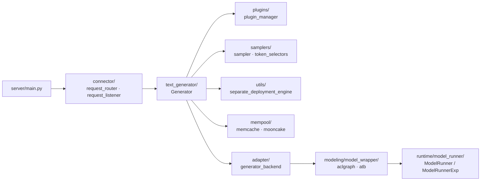

# `text_generator` — Text generation module

## Summary
synthesis: `text_generator` 是 MindIE-LLM 的**生成层主入口**，等价于 vLLM 的 `v1/engine`。它把"一次生成"的全部工序串起来：`Generator` 拿到 `Request`/`InputMetadata` → 通过 `plugin_manager` 走 splitfuse / prefix_cache / mtp / la / memory_decoding / structured_output 等可选预处理 → 调 `generator_backend.model_wrapper.forward` 跑模型 → `samplers/` 取 token。**PD 分离**和 **layerwise disaggregated** 这两个 MindIE 自有特性也在本模块（`utils/separate_deployment_engine.py`、`Generator.PDInterface` 基类）。

## Sources
- 模块目录：[d:\design\MindIE-LLM\mindie_llm\text_generator\](d:\design\MindIE-LLM\mindie_llm\text_generator)（73 .py）
- 主类：[generator.py](d:\design\MindIE-LLM\mindie_llm\text_generator\generator.py)（约 1438 行）
- PD 分离：[utils/separate_deployment_engine.py](d:\design\MindIE-LLM\mindie_llm\text_generator\utils\separate_deployment_engine.py)
- 后端 adapter：[adapter/](d:\design\MindIE-LLM\mindie_llm\text_generator\adapter)（含 `torch_utils/kvcache_pool.py`, `recovery_utils.py`）
- mempool：[mempool/](d:\design\MindIE-LLM\mindie_llm\text_generator\mempool)（`memcache_mempool.py` + `mooncake_mempool.py` + `factory.py`）

## 子目录

| 子目录 | 角色 | 关键文件 |
|---|---|---|
| `generator.py` | 主入口 | `WarmupParams`, `PDModelConfig`, `PDInterface`, `Generator` |
| `samplers/` | 采样器 | [sampler.py](d:\design\MindIE-LLM\mindie_llm\text_generator\samplers\sampler.py), [token_selectors/{cpu,pta}_selectors.py](d:\design\MindIE-LLM\mindie_llm\text_generator\samplers\token_selectors), [logits_handlers/pta_handlers.py](d:\design\MindIE-LLM\mindie_llm\text_generator\samplers\logits_handlers) |
| `plugins/` | 解码策略插件（可叠加） | `splitfuse/`, `prefix_cache/`, `mtp/`, `la/` (Lookahead), `memory_decoding/`, `structured_output/`；统一由 [plugins/plugin_manager.py](d:\design\MindIE-LLM\mindie_llm\text_generator\plugins\plugin_manager.py) 与 [plugin_manager_lwd.py](d:\design\MindIE-LLM\mindie_llm\text_generator\plugins\plugin_manager_lwd.py) 管理 |
| `mempool/` | KV 内存池 | [memcache_mempool.py](d:\design\MindIE-LLM\mindie_llm\text_generator\mempool\memcache_mempool.py), [mooncake_mempool.py](d:\design\MindIE-LLM\mindie_llm\text_generator\mempool\mooncake_mempool.py), [factory.py](d:\design\MindIE-LLM\mindie_llm\text_generator\mempool\factory.py), [base.py](d:\design\MindIE-LLM\mindie_llm\text_generator\mempool\base.py) |
| `utils/` | 数据结构与工具 | `request.py`, `batch_context.py`, `input_metadata.py`, `model_input.py`, `model_output.py`, `generation_metadata.py`, `generation_output.py`, `kvcache_settings.py`, `block_copy.py`, `sampling_metadata.py`, `output_filter.py`, `npu_mem_tool.py`, `tg_infer_context_store.py`, **`separate_deployment_engine.py`**, **`tg_decode_util.py`**, `stopping_criteria.py`, `request_sampling_cache.py`, `sampling_output.py`, `config.py` |
| `adapter/` | 框架后端适配 | [adapter/__init__.py](d:\design\MindIE-LLM\mindie_llm\text_generator\adapter)（`get_generator_backend`），[torch_utils/kvcache_pool.py](d:\design\MindIE-LLM\mindie_llm\text_generator\adapter\torch_utils\kvcache_pool.py), [recovery_utils.py](d:\design\MindIE-LLM\mindie_llm\text_generator\adapter\recovery_utils.py) |

## 关键 API（`Generator` 暴露）

详见 [entities/Generator.md](../entities/Generator.md)。摘要：

| 方法 | 角色 | 锚点 |
|---|---|---|
| `__init__(model_config)` | 装配 backend / sampler / plugin_manager / cache_config | [generator.py:212-540](d:\design\MindIE-LLM\mindie_llm\text_generator\generator.py) |
| `generate_token(input_metadata, warmup)` | **核心一步：preprocess → forward → sample → stop check** | [generator.py:580-716](d:\design\MindIE-LLM\mindie_llm\text_generator\generator.py) |
| `generate(requests, is_prefill)` | 把 `List[Request]` 转 `InputMetadata` 再调 generate_token | [generator.py:718-740](d:\design\MindIE-LLM\mindie_llm\text_generator\generator.py) |
| `prefill(requests)` / `decode(requests)` | 语义糖 | [generator.py:742-748](d:\design\MindIE-LLM\mindie_llm\text_generator\generator.py) |
| `generate_mix(requests, is_prefill_batch)` | 混合 batch（splitfuse 场景） | [generator.py:750-756](d:\design\MindIE-LLM\mindie_llm\text_generator\generator.py) |
| `warm_up(warmup_params)` | warmup 入口 | [generator.py:757-818](d:\design\MindIE-LLM\mindie_llm\text_generator\generator.py) |
| `swap(block_operation)` | KV block swap | [generator.py:819-829](d:\design\MindIE-LLM\mindie_llm\text_generator\generator.py) |
| `load_lora` / `unload_lora` | LoRA 管理 | [generator.py:830-867](d:\design\MindIE-LLM\mindie_llm\text_generator\generator.py) |
| `clear_cache(sequence_ids)` | 清 KV | [generator.py:550-555](d:\design\MindIE-LLM\mindie_llm\text_generator\generator.py) |
| `copy_blocks(src_dst_map)` | KV block 拷贝 | [generator.py:556-564](d:\design\MindIE-LLM\mindie_llm\text_generator\generator.py) |
| `execute_recover_command(command)` | 容错 / 故障恢复 | [generator.py:868-956](d:\design\MindIE-LLM\mindie_llm\text_generator\generator.py) |

## PD 分离接口（`PDInterface` 基类）

`Generator(PDInterface)` 通过继承提供：

| API | 锚点 | 说明 |
|---|---|---|
| `link(**kwargs)` | [generator.py:126-137](d:\design\MindIE-LLM\mindie_llm\text_generator\generator.py) | 与远端 cluster 建链 |
| `unlink(remote_cluster_id)` | [generator.py:138-141](d:\design\MindIE-LLM\mindie_llm\text_generator\generator.py) | 断链 |
| `unlink_batch(remote_cluster_ids)` | [generator.py:142-145](d:\design\MindIE-LLM\mindie_llm\text_generator\generator.py) | 批量断链 |
| `query_link_status()` | [generator.py:146-149](d:\design\MindIE-LLM\mindie_llm\text_generator\generator.py) | 查询链路状态 |
| `switch_role(role)` | [generator.py:150-152](d:\design\MindIE-LLM\mindie_llm\text_generator\generator.py) | 切 prefill/decoder/flex 角色 |
| `pull_kv(...)` | [generator.py:153-176](d:\design\MindIE-LLM\mindie_llm\text_generator\generator.py) | 从 prefill 节点拉 KV blocks |
| `_init_sepd_engine()` | [generator.py:177-200](d:\design\MindIE-LLM\mindie_llm\text_generator\generator.py) | 初始化底层 `SeparateDeploymentWorker` |

底层实现：
- `SeparateDeploymentEngine`（薄封装 `LLMDataDist` SDK）：[separate_deployment_engine.py:268-393](d:\design\MindIE-LLM\mindie_llm\text_generator\utils\separate_deployment_engine.py)
- `SeparateDeploymentWorker`（队列 + 工作线程的异步建链/拉 KV）：[separate_deployment_engine.py:396-852](d:\design\MindIE-LLM\mindie_llm\text_generator\utils\separate_deployment_engine.py)

详见 [topics/request-lifecycle.md](../topics/request-lifecycle.md) 与待 ingest 的 `topics/pd-disaggregation.md`。

## Plugin 体系

每个 plugin 是一个"可在 `generate_token` 周期插入额外步骤"的装配件。在 `Generator.__init__` 中：

- `plugin_params` 从 model_config 解析（[generator.py:285-301](d:\design\MindIE-LLM\mindie_llm\text_generator\generator.py)）
- `is_mix_model` 表示是否启 splitfuse（混合 prefill+decode）
- `inference_mode = InferenceMode(plugin_list, plugin_config, is_mix_model)`（[generator.py:300](d:\design\MindIE-LLM\mindie_llm\text_generator\generator.py)）传给 backend
- `_init_plugin_manager(...)` 在 [generator.py:977-1025](d:\design\MindIE-LLM\mindie_llm\text_generator\generator.py) 真正创建 `plugin_manager`
- `generate_token` 里二选一：`async_inference` → `plugin_manager.generate_token_async`；否则 `plugin_manager.generate_token` ([generator.py:636-650](d:\design\MindIE-LLM\mindie_llm\text_generator\generator.py))

| Plugin | 路径 | 作用 |
|---|---|---|
| splitfuse | [plugins/splitfuse/](d:\design\MindIE-LLM\mindie_llm\text_generator\plugins\splitfuse) | chunked prefill |
| prefix_cache | [plugins/prefix_cache/](d:\design\MindIE-LLM\mindie_llm\text_generator\plugins\prefix_cache) | 前缀缓存 |
| mtp | [plugins/mtp/](d:\design\MindIE-LLM\mindie_llm\text_generator\plugins\mtp) | Multi-Token Prediction |
| la | [plugins/la/](d:\design\MindIE-LLM\mindie_llm\text_generator\plugins\la) | Lookahead Decoding |
| memory_decoding | [plugins/memory_decoding/](d:\design\MindIE-LLM\mindie_llm\text_generator\plugins\memory_decoding) | tokens KB cache 增强 |
| structured_output | [plugins/structured_output/](d:\design\MindIE-LLM\mindie_llm\text_generator\plugins\structured_output) | grammar / bitmask 约束 |

## 与其它模块的关系

## Notes / Caveats
> [!todo] VERIFY: `adapter/__init__.py` 中 `get_generator_backend(model_config)` 如何根据 `backend_type` 选 atb / aclgraph / torch 后端（[generator.py:303-305, 351-352](d:\design\MindIE-LLM\mindie_llm\text_generator\generator.py)）。
> [!todo] VERIFY: `plugin_manager` 与 `plugin_manager_lwd`（layerwise disaggregated）的分工与 selection 规则。
> [!todo] VERIFY: `BatchScheduler` 在哪个层（看起来不在本模块；`generate_token` 注释说被 `BatchScheduler` 调用，但 BatchScheduler 应在上游 connector 或 server 层）。

## See also
- [entities/Generator.md](../entities/Generator.md)
- [modules/runtime_model_runner.md](runtime_model_runner.md)
- [topics/request-lifecycle.md](../topics/request-lifecycle.md)
- [topics/aclgraph-pp.md](../topics/aclgraph-pp.md)
- `comparison/topics/engine-architecture.md`（待建）
