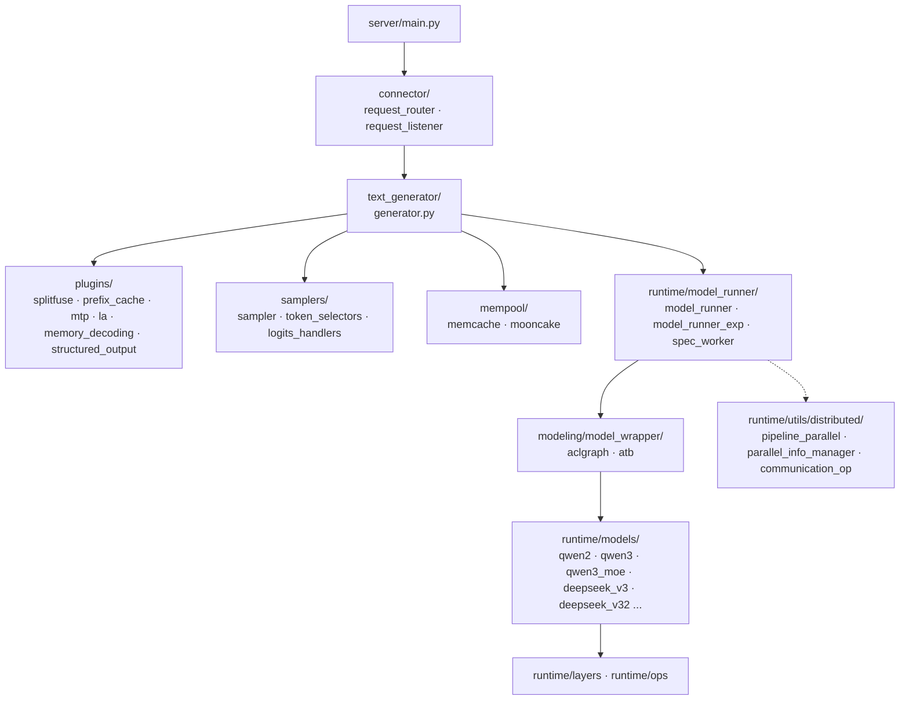

# MindIE-LLM Overview

## Summary
synthesis: MindIE-LLM 是华为面向 Ascend NPU 的 LLM 推理引擎。代码组织围绕 **server → connector → text_generator → runtime → modeling/wrapper** 的纵向分层，runtime 层下面再分模型实现 (`runtime/models`)、模型运行时 (`runtime/model_runner`)、算子 (`runtime/ops`)、分布式 (`runtime/utils/distributed`) 等。本页只给鸟瞰，每个具体子系统等待 ingest 时建独立页。

## Sources
- 主代码根：[d:\design\MindIE-LLM\mindie_llm\](d:\design\MindIE-LLM\mindie_llm)
- 服务入口：[d:\design\MindIE-LLM\mindie_llm\server\main.py](d:\design\MindIE-LLM\mindie_llm\server\main.py)
- 文本生成入口：[d:\design\MindIE-LLM\mindie_llm\text_generator\generator.py](d:\design\MindIE-LLM\mindie_llm\text_generator\generator.py)
- 模型运行时：[d:\design\MindIE-LLM\mindie_llm\runtime\model_runner\model_runner.py](d:\design\MindIE-LLM\mindie_llm\runtime\model_runner\model_runner.py), [d:\design\MindIE-LLM\mindie_llm\runtime\model_runner\model_runner_exp.py](d:\design\MindIE-LLM\mindie_llm\runtime\model_runner\model_runner_exp.py)
- 模型基类：[d:\design\MindIE-LLM\mindie_llm\runtime\models\base\model.py](d:\design\MindIE-LLM\mindie_llm\runtime\models\base\model.py)
- 流水并行：[d:\design\MindIE-LLM\mindie_llm\runtime\utils\distributed\pipeline_parallel.py](d:\design\MindIE-LLM\mindie_llm\runtime\utils\distributed\pipeline_parallel.py)
- 并行信息管理：[d:\design\MindIE-LLM\mindie_llm\runtime\utils\distributed\parallel_info_manager.py](d:\design\MindIE-LLM\mindie_llm\runtime\utils\distributed\parallel_info_manager.py)
- aclgraph wrapper：[d:\design\MindIE-LLM\mindie_llm\modeling\model_wrapper\aclgraph\aclgraph_model_wrapper.py](d:\design\MindIE-LLM\mindie_llm\modeling\model_wrapper\aclgraph\aclgraph_model_wrapper.py), [d:\design\MindIE-LLM\mindie_llm\modeling\model_wrapper\aclgraph\aclgraph_model_wrapper_exp.py](d:\design\MindIE-LLM\mindie_llm\modeling\model_wrapper\aclgraph\aclgraph_model_wrapper_exp.py)
- 设计文档：[d:\design\MindIE-LLM\docs\mindie_generator_aclgraph_pp_design.md](d:\design\MindIE-LLM\docs\mindie_generator_aclgraph_pp_design.md)

## Top-level layout

观察自 [d:\design\MindIE-LLM\mindie_llm\](d:\design\MindIE-LLM\mindie_llm) 子目录：

| 子包 | 路径 | 角色（synthesis） |
|---|---|---|
| `connector` | [mindie_llm\connector\](d:\design\MindIE-LLM\mindie_llm\connector) | 请求路由 / 监听层（`request_router`, `request_listener`），用于多实例 / PD 分离场景的连接管理 |
| `server` | [mindie_llm\server\main.py](d:\design\MindIE-LLM\mindie_llm\server\main.py) | 进程入口（仅一个 `main.py`） |
| `text_generator` | [mindie_llm\text_generator\](d:\design\MindIE-LLM\mindie_llm\text_generator) | 文本生成主循环：`generator.py` + `samplers/` + `plugins/` + `mempool/` + `utils/` |
| `runtime` | [mindie_llm\runtime\](d:\design\MindIE-LLM\mindie_llm\runtime) | 模型运行时：`model_runner/`, `models/`, `layers/`, `ops/`, `compilation/`, `utils/distributed/` |
| `modeling` | [mindie_llm\modeling\](d:\design\MindIE-LLM\mindie_llm\modeling) | 模型外层包装：`model_wrapper/{atb,aclgraph}` 两类 wrapper |
| `model_wrapper` | [mindie_llm\model_wrapper\](d:\design\MindIE-LLM\mindie_llm\model_wrapper) | 早期 wrapper 入口（与 `modeling/model_wrapper/` 关系待 ingest 时澄清） |
| `distributed` | [mindie_llm\distributed\](d:\design\MindIE-LLM\mindie_llm\distributed) | 顶层分布式（与 `runtime/utils/distributed` 关系待澄清） |
| `tokenizer` | [mindie_llm\tokenizer\](d:\design\MindIE-LLM\mindie_llm\tokenizer) | tokenizer 封装 |
| `examples` | [mindie_llm\examples\](d:\design\MindIE-LLM\mindie_llm\examples) | 示例 |
| `utils` | [mindie_llm\utils\](d:\design\MindIE-LLM\mindie_llm\utils) | 通用工具 |

> [!todo] VERIFY: `mindie_llm\distributed\` 与 `mindie_llm\runtime\utils\distributed\` 的职责边界（看起来有重复，ingest distributed 主题时澄清）。
> [!todo] VERIFY: `mindie_llm\modeling\model_wrapper\` 与顶层 `mindie_llm\model_wrapper\` 是否新旧两套，还是按角色分。

## Architecture (synthesis, 待 ingest 校正)

## runtime 子系统

`runtime/` 是计算密集层，下面拆开：

| 子目录 | 关键文件 | 角色 |
|---|---|---|
| `runtime/model_runner` | [model_runner.py](d:\design\MindIE-LLM\mindie_llm\runtime\model_runner\model_runner.py), [model_runner_exp.py](d:\design\MindIE-LLM\mindie_llm\runtime\model_runner\model_runner_exp.py), [spec_worker.py](d:\design\MindIE-LLM\mindie_llm\runtime\model_runner\spec_worker.py) | 模型一次 forward 的封装（含 `forward_metadata/` 子目录） |
| `runtime/models` | qwen2/qwen3/qwen3_moe/deepseek_v3/deepseek_v32/base | 模型实现，每个模型一组 `<model>.py` + `router_<model>.py` + `input_builder_<model>.py` + `config_<model>.py` |
| `runtime/layers` | [layers/attention/](d:\design\MindIE-LLM\mindie_llm\runtime\layers\attention), [layers/embedding/](d:\design\MindIE-LLM\mindie_llm\runtime\layers\embedding) | 通用层 |
| `runtime/ops` | [ops/triton/](d:\design\MindIE-LLM\mindie_llm\runtime\ops\triton), [ops/fla/](d:\design\MindIE-LLM\mindie_llm\runtime\ops\fla), [ops/mie_ops/](d:\design\MindIE-LLM\mindie_llm\runtime\ops\mie_ops) | 算子（Triton / FLA / MIE 三类后端） |
| `runtime/compilation` | [compilation/](d:\design\MindIE-LLM\mindie_llm\runtime\compilation) | 编译相关（aclgraph 等图捕获） |
| `runtime/utils/distributed` | [pipeline_parallel.py](d:\design\MindIE-LLM\mindie_llm\runtime\utils\distributed\pipeline_parallel.py), [parallel_info_manager.py](d:\design\MindIE-LLM\mindie_llm\runtime\utils\distributed\parallel_info_manager.py), [communication_op.py](d:\design\MindIE-LLM\mindie_llm\runtime\utils\distributed\communication_op.py) | TP/PP/EP 切分与通信原语 |
| `runtime/lora` | [lora/](d:\design\MindIE-LLM\mindie_llm\runtime\lora) | LoRA |
| `runtime/conf`, `runtime/config` | | 配置 |

## text_generator 子系统

| 子目录 | 角色 | 关键文件 |
|---|---|---|
| `generator.py` | 主入口 | [generator.py](d:\design\MindIE-LLM\mindie_llm\text_generator\generator.py) |
| `plugins/` | 解码策略插件 | `splitfuse`, `prefix_cache`, `mtp` (Multi-Token Prediction), `la` (Lookahead), `memory_decoding`, `structured_output` |
| `samplers/` | 采样器 | `sampler.py`, `token_selectors/{cpu,pta}_selectors.py`, `logits_handlers/pta_handlers.py` |
| `mempool/` | KV 内存池 | `memcache_mempool.py`, `mooncake_mempool.py`（Mooncake 集成）, `factory.py` |
| `utils/` | 数据结构与工具 | `request.py`, `batch_context.py`, `kvcache_settings.py`, `separate_deployment_engine.py`（PD 分离相关） |
| `adapter/` | 框架适配 | `torch_utils/kvcache_pool.py`, `recovery_utils.py` |

> [!todo] VERIFY: `text_generator/utils/separate_deployment_engine.py` 是 PD 分离的 engine 端实现还是 worker 端？等 ingest pd-disaggregation 主题时确认。

## modeling 子系统

| 子目录 | 角色 |
|---|---|
| `model_wrapper/aclgraph/` | aclgraph 模式包装：[aclgraph_model_wrapper.py](d:\design\MindIE-LLM\mindie_llm\modeling\model_wrapper\aclgraph\aclgraph_model_wrapper.py), [aclgraph_model_wrapper_exp.py](d:\design\MindIE-LLM\mindie_llm\modeling\model_wrapper\aclgraph\aclgraph_model_wrapper_exp.py) |
| `model_wrapper/atb/` | ATB（Ascend Tensor Boost）模式包装 |

## 已知 / 重点关注（基于用户最近浏览）

- **PD 分离 + aclgraph + PP**：设计文档在 [d:\design\MindIE-LLM\docs\mindie_generator_aclgraph_pp_design.md](d:\design\MindIE-LLM\docs\mindie_generator_aclgraph_pp_design.md)（1733 行）。代码线索：`text_generator/utils/separate_deployment_engine.py`, `runtime/utils/distributed/pipeline_parallel.py`, `modeling/model_wrapper/aclgraph/aclgraph_model_wrapper_exp.py`。
- **Qwen3 MoE**：[d:\design\MindIE-LLM\mindie_llm\runtime\models\qwen3_moe\qwen3_moe.py](d:\design\MindIE-LLM\mindie_llm\runtime\models\qwen3_moe\qwen3_moe.py)（390 行）。
- **Mempool / KV 传输**：`text_generator/mempool/{memcache,mooncake}_mempool.py` 暗示对接 Mooncake 协议。

## Notes / Caveats
> [!todo] VERIFY: server 入口仅一个 [main.py](d:\design\MindIE-LLM\mindie_llm\server\main.py)，需确认服务化协议（HTTP / gRPC / 自定义 RPC）。
> [!todo] VERIFY: `runtime/dllm/` 是否存在（vLLM/SGLang 都有 dllm 相关，但 MindIE 顶层未列）。
> [!todo] VERIFY: tokenizer 在 `mindie_llm/tokenizer/` 和 `runtime/tokenizer/` 都存在，关系待澄清。

## See also
- [mindie/index.md](index.md) — 项目内目录
- [comparison/index.md](../comparison/index.md) — 跨项目对比
- [vllm/overview.md](../vllm/overview.md), [sglang/overview.md](../sglang/overview.md)
