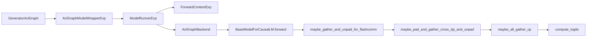

# AclGraph + Pipeline Parallel (generator_aclgraph 路线下的 PP 设计)

## Summary
synthesis: 这是 MindIE-LLM 当前最重要的设计议题之一。**结论先行**（[设计文档 §2.1](d:\design\MindIE-LLM\docs\mindie_generator_aclgraph_pp_design.md)）：MindIE 当前的 `generator_aclgraph` 主线**所有非 PP 并行轴齐备**，但 PP 这条轴只有零散痕迹（占位的 `pp_layers()`、孤立的 `pipeline_parallel.py` 草稿），**未真正接入主链路**。本页基于 1733 行设计文档总结：(1) 当前主线长什么样、(2) PP 当前为什么不能用、(3) 推荐改造的 7 层架构与可复用资产。

## Sources（最权威：设计文档本身）
- 设计文档：[d:\design\MindIE-LLM\docs\mindie_generator_aclgraph_pp_design.md](d:\design\MindIE-LLM\docs\mindie_generator_aclgraph_pp_design.md)（1733 行）
- 文档目录：见 §1（[mindie_generator_aclgraph_pp_design.md:1-15](d:\design\MindIE-LLM\docs\mindie_generator_aclgraph_pp_design.md)）
- 现有主链路：[§6.1 主执行链路](d:\design\MindIE-LLM\docs\mindie_generator_aclgraph_pp_design.md)（[mindie_generator_aclgraph_pp_design.md:666-702](d:\design\MindIE-LLM\docs\mindie_generator_aclgraph_pp_design.md)）
- PP 缺失项：[§6.3](d:\design\MindIE-LLM\docs\mindie_generator_aclgraph_pp_design.md)（[mindie_generator_aclgraph_pp_design.md:722-836](d:\design\MindIE-LLM\docs\mindie_generator_aclgraph_pp_design.md)）
- 推荐方案 7 层：[§7.1-§7.11](d:\design\MindIE-LLM\docs\mindie_generator_aclgraph_pp_design.md)（[mindie_generator_aclgraph_pp_design.md:854-1481](d:\design\MindIE-LLM\docs\mindie_generator_aclgraph_pp_design.md)）
- 落地路线：[§8](d:\design\MindIE-LLM\docs\mindie_generator_aclgraph_pp_design.md)（[mindie_generator_aclgraph_pp_design.md:1482-1571](d:\design\MindIE-LLM\docs\mindie_generator_aclgraph_pp_design.md)）

代码侧锚点：
- PP 草稿：[runtime/utils/distributed/pipeline_parallel.py](d:\design\MindIE-LLM\mindie_llm\runtime\utils\distributed\pipeline_parallel.py)
- aclgraph backend：[runtime/compilation/aclgraph_backend.py](d:\design\MindIE-LLM\mindie_llm\runtime\compilation\aclgraph_backend.py)（待 ingest）
- model_runner_exp：[runtime/model_runner/model_runner_exp.py](d:\design\MindIE-LLM\mindie_llm\runtime\model_runner\model_runner_exp.py)
- aclgraph wrapper exp：[modeling/model_wrapper/aclgraph/aclgraph_model_wrapper_exp.py](d:\design\MindIE-LLM\mindie_llm\modeling\model_wrapper\aclgraph\aclgraph_model_wrapper_exp.py)

## 1. 当前主线（来自 §6.1）



文件 → 职责（[mindie_generator_aclgraph_pp_design.md:683-692](d:\design\MindIE-LLM\docs\mindie_generator_aclgraph_pp_design.md)）：

| 文件 | 职责 |
|---|---|
| `text_generator/adapter/generator_aclgraph.py` | 输入准备、DP/CP/TP 切分补齐、KV cache 管理 |
| `modeling/model_wrapper/aclgraph/aclgraph_model_wrapper_exp.py` | H2D、`ForwardContext` 构造 |
| `runtime/model_runner/model_runner_exp.py` | KV cache 绑定、padding、构图与前向 |
| `runtime/compilation/aclgraph_backend.py` | eager/NPUGraph replay 选择 |
| `runtime/models/base/model.py` | `BaseModelForCausalLM`：forward + compute_logits 接口 |
| `runtime/models/<model>/` | 具体模型实现 |

核心特点（[mindie_generator_aclgraph_pp_design.md:694-702](d:\design\MindIE-LLM\docs\mindie_generator_aclgraph_pp_design.md)）：

- `GeneratorAclGraph` 负责输入准备、DP/CP/TP 相关切分和补齐
- `ModelRunnerExp` 负责绑定 KV cache、padding、构图与前向
- `AclGraphBackend` 决定本次走 eager 还是 NPUGraph replay
- 模型 forward 返回 `hidden_states`
- Runner **统一做 TP/DP/CP 侧 gather/unpad**
- **最后统一 `compute_logits`**

## 2. 已有并行能力（[§6.2](d:\design\MindIE-LLM\docs\mindie_generator_aclgraph_pp_design.md) [707-720](d:\design\MindIE-LLM\docs\mindie_generator_aclgraph_pp_design.md)）

| 并行类型 | `ParallelType` 枚举 | 状态 |
|---|---|---|
| Attention TP | `ATTN_TP` | ✅ 已实现 |
| Attention DP | `ATTN_DP` | ✅ 已实现 |
| Attention CP | `ATTN_CP` | ✅ 已实现 |
| Attention Inner SP | `ATTN_INNER_SP` | ✅ 已实现 |
| MLP TP | `MLP_TP` | ✅ 已实现 |
| LM Head TP | `LM_HEAD_TP` | ✅ 已实现 |
| MoE TP | `MOE_TP` | ✅ 已实现 |
| MoE EP | `MOE_EP` | ✅ 已实现 |
| MoE EP MC2 | `MOE_EP_MC2` | ✅ 已实现 |
| **Pipeline Parallel** | — | ❌ **未实现** |

> synthesis: 这意味着 MindIE 的分布式基础并不薄弱，缺的是"PP 这条轴没有真正接入主链路"。一个完整的 PP 方案不需要重写 ParallelInfoManager，只需要：(a) 把 PP 接入 ParallelType 枚举；(b) 让模型支持 stage-local 构建；(c) 让 runtime 处理 stage 间通信。

## 3. PP 当前为什么不能用（[§6.3](d:\design\MindIE-LLM\docs\mindie_generator_aclgraph_pp_design.md) [722-836](d:\design\MindIE-LLM\docs\mindie_generator_aclgraph_pp_design.md)）

5 个并列原因：

### 3.1 配置位存在但运行时未实现 ([§6.3.1](d:\design\MindIE-LLM\docs\mindie_generator_aclgraph_pp_design.md))

`model_wrapper/utils/config.py` 里 `pp` 已被解析；但 `parallel_info_manager.py` 中：

```python
@staticmethod
def pp_layers(num_layers: int) -> list[int]:
    """Pipeline parallelism is not currently implemented."""
    return list(range(num_layers))  # 占位

@staticmethod
def has_pp() -> bool:
    return False
```

锚点 [parallel_info_manager.py](d:\design\MindIE-LLM\mindie_llm\runtime\utils\distributed\parallel_info_manager.py)。

### 3.2 `pipeline_parallel.py` 草稿接不上主线 ([§6.3.2](d:\design\MindIE-LLM\docs\mindie_generator_aclgraph_pp_design.md))

[pipeline_parallel.py](d:\design\MindIE-LLM\mindie_llm\runtime\utils\distributed\pipeline_parallel.py) 三个函数都依赖：

- `ParallelType.PP` — **不存在**于主线 `ParallelInfoManager`
- `prev_pp_rank()` / `next_pp_rank()` — **不存在**

> [!warning] CONTRADICTION: 设计文档 [§6.3.2 末尾](d:\design\MindIE-LLM\docs\mindie_generator_aclgraph_pp_design.md) 明示"在 `mindie_llm` 包内**没有任何其它文件 import `pipeline_parallel`**"——是一份"未完成草稿"。

### 3.3 模型仍是整模构建 ([§6.3.3](d:\design\MindIE-LLM\docs\mindie_generator_aclgraph_pp_design.md))

例：[runtime/models/qwen3_moe/qwen3_moe.py](d:\design\MindIE-LLM\mindie_llm\runtime\models\qwen3_moe\qwen3_moe.py) 的 `Qwen3MoeModel.__init__` 用 `range(config.num_hidden_layers)` 构建所有层，**没有 stage-local 裁剪**。后果：

- 每个 PP rank 都加载全部层 + 全部权重
- 即使加 send/recv，也只是"多 rank 串行重复跑整模"

### 3.4 logits 路径默认每 rank 都可达 ([§6.3.4](d:\design\MindIE-LLM\docs\mindie_generator_aclgraph_pp_design.md))

`runtime/model_runner/model_runner_exp.py` 的 forward 默认每个 rank 都跑到 `compute_logits`。PP 下需要：

- 非末 stage：返回中间激活，不进 `compute_logits`
- 末 stage：继续 logits + sampling

### 3.5 ACL 图与 P2P 关系尚未定义 ([§6.3.5](d:\design\MindIE-LLM\docs\mindie_generator_aclgraph_pp_design.md))

`AclGraphBackend` 只负责 stage 内 forward 的 capture / replay，没处理：

- stage 间通信是否进图
- 发送前后 buffer 是否稳定
- recv 后输入地址是否可复用

> [!warning] CONTRADICTION: 设计文档明示"如果直接在现有 `AclGraphBackend` 外层硬插 PP 通信，很容易破坏图捕获与 replay 的稳定性"——这是后续改造时要重点防范的陷阱。

## 4. 可复用资产（[§6.4](d:\design\MindIE-LLM\docs\mindie_generator_aclgraph_pp_design.md) [837-852](d:\design\MindIE-LLM\docs\mindie_generator_aclgraph_pp_design.md)）

| 资产 | 位置 | 复用方式 |
|---|---|---|
| `ParallelInfoManager` 架构 | [parallel_info_manager.py](d:\design\MindIE-LLM\mindie_llm\runtime\utils\distributed\parallel_info_manager.py) | 扩展，新增 `ParallelType.PP` |
| `ParallelInfo` 数据结构 | 同上 | 直接复用，PP 组也是一个 `ParallelInfo` |
| `_get_or_create_process_group` | 同上 | 直接复用，PP 组创建 |
| `pipeline_parallel.py` 草稿 | [pipeline_parallel.py](d:\design\MindIE-LLM\mindie_llm\runtime\utils\distributed\pipeline_parallel.py) | 增强后复用 |
| HCCL 通信栈 | 全局 | 直接复用，PP 走 HCCL P2P |
| `BaseModelForCausalLM` 基类 | [base/model.py](d:\design\MindIE-LLM\mindie_llm\runtime\models\base\model.py) | 扩展 forward 签名 |
| `AclGraphBackend` | [aclgraph_backend.py](d:\design\MindIE-LLM\mindie_llm\runtime\compilation\aclgraph_backend.py) | 保持现有，PP 通信放图外 |
| `KVCachePool` | [adapter/torch_utils/kvcache_pool.py](d:\design\MindIE-LLM\mindie_llm\text_generator\adapter\torch_utils\kvcache_pool.py) | 修改分配逻辑，按 stage 层数分配 |

## 5. 推荐 7 层架构（[§7](d:\design\MindIE-LLM\docs\mindie_generator_aclgraph_pp_design.md) [854-1481](d:\design\MindIE-LLM\docs\mindie_generator_aclgraph_pp_design.md)）

设计文档把改造按 7 层拆开：

| 层 | 章节 | 文件锚点（待新建 / 改造） |
|---|---|---|
| 1. 分布式拓扑层 | [§7.3](d:\design\MindIE-LLM\docs\mindie_generator_aclgraph_pp_design.md) [909-1007](d:\design\MindIE-LLM\docs\mindie_generator_aclgraph_pp_design.md) | `parallel_info_manager.py` 扩展 + rank 布局 `rank = pp_rank * tp_size + tp_rank` |
| 2. 模型装配层 | [§7.4](d:\design\MindIE-LLM\docs\mindie_generator_aclgraph_pp_design.md) [1008-1096](d:\design\MindIE-LLM\docs\mindie_generator_aclgraph_pp_design.md) | 各 `runtime/models/<model>/<model>.py` 加 stage-local 构建 + `PPMissingLayer` 占位 |
| 3. stage 间数据协议层 | [§7.5](d:\design\MindIE-LLM\docs\mindie_generator_aclgraph_pp_design.md) [1097-1143](d:\design\MindIE-LLM\docs\mindie_generator_aclgraph_pp_design.md) | 引入 `IntermediateTensors`（参考 vllm） / `PPProxyTensors`（参考 sglang） |
| 4. stage 间通信层 | [§7.6](d:\design\MindIE-LLM\docs\mindie_generator_aclgraph_pp_design.md) [1144-1200](d:\design\MindIE-LLM\docs\mindie_generator_aclgraph_pp_design.md) | 增强 `pipeline_parallel.py` recv/send/broadcast |
| 5. 运行时执行层 | [§7.7](d:\design\MindIE-LLM\docs\mindie_generator_aclgraph_pp_design.md) [1201-1302](d:\design\MindIE-LLM\docs\mindie_generator_aclgraph_pp_design.md) | `model_runner_exp.py` forward 改成 `recv → forward → send` 闭环 |
| 6. `generator_aclgraph` 适配层 | [§7.8](d:\design\MindIE-LLM\docs\mindie_generator_aclgraph_pp_design.md) [1303-1360](d:\design\MindIE-LLM\docs\mindie_generator_aclgraph_pp_design.md) | `text_generator/adapter/generator_aclgraph.py` 新增微批调度 |
| 7. ACL 图策略层 | [§7.9](d:\design\MindIE-LLM\docs\mindie_generator_aclgraph_pp_design.md) [1361-1419](d:\design\MindIE-LLM\docs\mindie_generator_aclgraph_pp_design.md) | 决定 stage 内进图、stage 间出图，buffer 地址稳定性 |
| KV Cache 层 | [§7.10](d:\design\MindIE-LLM\docs\mindie_generator_aclgraph_pp_design.md) [1420-1446](d:\design\MindIE-LLM\docs\mindie_generator_aclgraph_pp_design.md) | `KVCachePool` 按 stage 层数分配 |
| 调度与吞吐优化层 | [§7.11](d:\design\MindIE-LLM\docs\mindie_generator_aclgraph_pp_design.md) [1447-1481](d:\design\MindIE-LLM\docs\mindie_generator_aclgraph_pp_design.md) | PP 气泡填充、微批调度（参考 vllm 的 batch_queue） |

### 设计原则（[§7.1](d:\design\MindIE-LLM\docs\mindie_generator_aclgraph_pp_design.md) [856-867](d:\design\MindIE-LLM\docs\mindie_generator_aclgraph_pp_design.md)）

1. **PP 先成为正式拓扑轴，再谈模型通信**
2. **模型先 stage-local，再谈显存收益**
3. **stage 间通信图外编排，stage 内计算图内执行**
4. **非末 stage 不做 logits**
5. **一期范围要刻意收敛**
6. **不兼容组合显式报错**

## 6. 落地路线（[§8](d:\design\MindIE-LLM\docs\mindie_generator_aclgraph_pp_design.md) [1482-1571](d:\design\MindIE-LLM\docs\mindie_generator_aclgraph_pp_design.md)）

| 阶段 | 范围 | 章节 |
|---|---|---|
| 阶段一：主线 PP 基础闭环 | rank 布局 + 通信原语 + 一个简单模型走通 | [§8 阶段一](d:\design\MindIE-LLM\docs\mindie_generator_aclgraph_pp_design.md) [1484-1509](d:\design\MindIE-LLM\docs\mindie_generator_aclgraph_pp_design.md) |
| 阶段二：主力模型适配 | qwen3 / qwen3_moe / deepseek_v3 stage-local 化 | [§8 阶段二](d:\design\MindIE-LLM\docs\mindie_generator_aclgraph_pp_design.md) [1510-1532](d:\design\MindIE-LLM\docs\mindie_generator_aclgraph_pp_design.md) |
| 阶段三：吞吐优化 | 微批 / 气泡填充 / async 通信 | [§8 阶段三](d:\design\MindIE-LLM\docs\mindie_generator_aclgraph_pp_design.md) [1533-1554](d:\design\MindIE-LLM\docs\mindie_generator_aclgraph_pp_design.md) |
| 阶段四：高级组合支持 | PP × MoE EP / PP × LoRA / PP × spec decode | [§8 阶段四](d:\design\MindIE-LLM\docs\mindie_generator_aclgraph_pp_design.md) [1555-1571](d:\design\MindIE-LLM\docs\mindie_generator_aclgraph_pp_design.md) |

## 7. 风险与边界（[§9](d:\design\MindIE-LLM\docs\mindie_generator_aclgraph_pp_design.md) [1572-1629](d:\design\MindIE-LLM\docs\mindie_generator_aclgraph_pp_design.md)）

| 风险 | 章节 |
|---|---|
| 需要显式限制的组合（PP × splitfuse、PP × DP attention 等） | [§9.1](d:\design\MindIE-LLM\docs\mindie_generator_aclgraph_pp_design.md) [1574-1587](d:\design\MindIE-LLM\docs\mindie_generator_aclgraph_pp_design.md) |
| tie embedding 与首末 stage（共享 embedding 时的边界处理） | [§9.2](d:\design\MindIE-LLM\docs\mindie_generator_aclgraph_pp_design.md) [1588-1601](d:\design\MindIE-LLM\docs\mindie_generator_aclgraph_pp_design.md) |
| residual 不是所有模型都相同 | [§9.3](d:\design\MindIE-LLM\docs\mindie_generator_aclgraph_pp_design.md) [1602-1606](d:\design\MindIE-LLM\docs\mindie_generator_aclgraph_pp_design.md) |
| graph buffer 地址稳定性（PP 通信会扰动 buffer） | [§9.4](d:\design\MindIE-LLM\docs\mindie_generator_aclgraph_pp_design.md) [1607-1618](d:\design\MindIE-LLM\docs\mindie_generator_aclgraph_pp_design.md) |
| world_size 与 rank 布局（不同布局对 HCCL ring 的影响） | [§9.5](d:\design\MindIE-LLM\docs\mindie_generator_aclgraph_pp_design.md) [1619-1629](d:\design\MindIE-LLM\docs\mindie_generator_aclgraph_pp_design.md) |

## 8. 与 vLLM / SGLang 的关系（[§3, §4, §5](d:\design\MindIE-LLM\docs\mindie_generator_aclgraph_pp_design.md)）

设计文档专门对 vllm（[§3](d:\design\MindIE-LLM\docs\mindie_generator_aclgraph_pp_design.md) [56-343](d:\design\MindIE-LLM\docs\mindie_generator_aclgraph_pp_design.md)）和 sglang（[§4](d:\design\MindIE-LLM\docs\mindie_generator_aclgraph_pp_design.md) [344-623](d:\design\MindIE-LLM\docs\mindie_generator_aclgraph_pp_design.md)）的 PP 实现做了详细 reverse engineering，并对比（[§5](d:\design\MindIE-LLM\docs\mindie_generator_aclgraph_pp_design.md) [624-663](d:\design\MindIE-LLM\docs\mindie_generator_aclgraph_pp_design.md)）：

| 设计点 | vLLM | SGLang | MindIE 推荐 |
|---|---|---|---|
| stage 间数据协议 | `IntermediateTensors`（张量字典） | `PPProxyTensors`（轻量 proxy） | 倾向 vLLM 风格（与现有 `ForwardContext` 兼容更好）|
| 微批调度 | `BatchQueue`（[v1/engine/core.py:187-193](d:\design\vllm\vllm\v1\engine\core.py)） | 事件循环 + 多深度微批 | 阶段三再做 |
| 模型切层 | stage-local 构建 + `PPMissingLayer` | stage-local 构建 | 学 vllm 的 `PPMissingLayer` 模式 |

> 设计文档 §5.3 明示"两个框架的核心差异是 IntermediateTensors vs PPProxyTensors，本质都是 stage 间张量打包的协议层"，MindIE 一期建议**倾向 vllm 风格**。

## 与你当前 PD 优化的关系（synthesis）

> 注意：本节是综合性建议，不是设计文档原文。

PP 与 PD 分离是两个**正交**特性，但在性能优化上互相影响：

1. **PP × PD**：如果你的 prefill 是单卡 / TP-only，PP 对 prefill 时间无直接收益。但 PP 如果做起来，prefill 阶段的 batch_queue 微批可以填气泡，从而**进一步压缩 TTFT**。
2. **graph buffer 地址稳定性 vs PD link**：[§9.4](d:\design\MindIE-LLM\docs\mindie_generator_aclgraph_pp_design.md) 警示的"graph buffer 地址稳定性"在 PD 场景同样成立——`bind_kv_cache` 后地址变化会触发重新捕图（[model_runner.py:290-293](d:\design\MindIE-LLM\mindie_llm\runtime\model_runner\model_runner.py)），TTFT 长尾。
3. **layerwise disaggregated**：[generator.py:330-349](d:\design\MindIE-LLM\mindie_llm\text_generator\generator.py) 已经有 `layerwiseDisaggregated` 配置，是另一条 PD 路线，与本页讨论的 PP 完全不同；如果你用 layerwise，参考 [plugin_manager_lwd.py](d:\design\MindIE-LLM\mindie_llm\text_generator\plugins\plugin_manager_lwd.py)。

## Notes / Caveats
> [!todo] VERIFY: 设计文档的"附录 A：关键文件路径索引"（§11，[mindie_generator_aclgraph_pp_design.md:1688-1733](d:\design\MindIE-LLM\docs\mindie_generator_aclgraph_pp_design.md)）尚未完整移到 wiki，下轮 ingest 该主题时可补全。
> [!todo] VERIFY: 一期 / 二期具体的工作量估算（设计文档 §8 给出范围但未估时）。

## See also
- [entities/ModelRunner.md](../entities/ModelRunner.md)（runtime 层细节）
- [topics/request-lifecycle.md](request-lifecycle.md)（PD 链路与本主题正交）
- [vllm/topics/request-lifecycle.md](../../vllm/topics/request-lifecycle.md)（参考 vllm 的 PP 实现）
- [comparison/topics/distributed.md](../../comparison/topics/distributed.md)（三方对比，已建；§3 PP 章节直接对照本页 MindIE 现状）
- [mindie/entities/AclGraphModelWrapper.md](../entities/AclGraphModelWrapper.md)（基础版 + Exp 版对照表 + capture/replay 机制）
- [mindie/entities/ParallelInfoManager.md](../entities/ParallelInfoManager.md)（PP 状态 §中 `pipeline_parallel.py` 草稿与主类不兼容的 CONTRADICTION）
