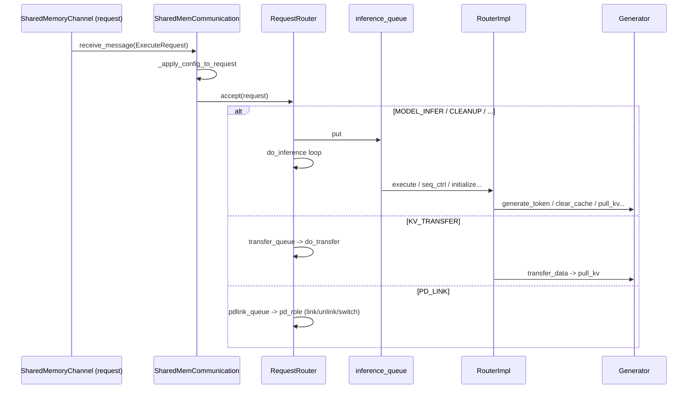

# Connector 子系统（请求路由 + PD 传输 + 监听层）

## Summary

MindIE-LLM 的 **`mindie_llm/connector`** 是 **C++ Executor ↔ Python `Generator`** 之间的 IPC 适配层：监听进程通过 **共享内存 + 信号量** 收发 protobuf `ExecuteRequest`/`ExecuteResponse`（[shared_mem_communication.py:48-52](d:\design\MindIE-LLM\mindie_llm\connector\request_listener\shared_mem_communication.py)）；[`RequestRouter`](d:\design\MindIE-LLM\mindie_llm\connector\request_router\request_router.py) 按 `ExecuteType` 分队列派发到工作线程；[`RouterImpl`](d:\design\MindIE-LLM\mindie_llm\connector\request_router\router_impl.py) 将推理 / PD 建链 / **KV 拉取** 转为对 **单进程内 `Generator`** 的调用。

> synthesis: PD 分离下 **KV 拉取** 路径为 `KV_TRANSFER` → [`RouterImpl.transfer_data`](d:\design\MindIE-LLM\mindie_llm\connector\request_router\router_impl.py) → [`Generator.pull_kv`](d:\design\MindIE-LLM\mindie_llm\text_generator\generator.py) → [`SeparateDeploymentWorker.pull_blocks`](d:\design\MindIE-LLM\mindie_llm\text_generator\utils\separate_deployment_engine.py)。**Layerwise PD（边云）** 时由 [`RequestRouterEdge`](d:\design\MindIE-LLM\mindie_llm\connector\request_router\layerwise\request_router_edge.py) / [`RequestRouterCloud`](d:\design\MindIE-LLM\mindie_llm\connector\request_router\layerwise\request_router_cloud.py) 继承扩展调度逻辑，与 C++ `LwdSelfAttnBlockManager` 无直接 Python 符号依赖，属 **runtime 两侧并行设计**（见 §Layerwise）。

## Sources

| 组件 | 路径 |
|------|------|
| 进程入口 | [main.py](d:\design\MindIE-LLM\mindie_llm\connector\main.py) |
| 请求路由 | [request_router.py](d:\design\MindIE-LLM\mindie_llm\connector\request_router\request_router.py)，[router_impl.py](d:\design\MindIE-LLM\mindie_llm\connector\request_router\router_impl.py) |
| 监听 / IPC | [request_listener.py](d:\design\MindIE-LLM\mindie_llm\connector\request_listener\request_listener.py)，[shared_mem_communication.py](d:\design\MindIE-LLM\mindie_llm\connector\request_listener\shared_mem_communication.py) |
| Layerwise | [request_router_lwd.py](d:\design\MindIE-LLM\mindie_llm\connector\request_router\layerwise\request_router_lwd.py)，[request_router_edge.py](d:\design\MindIE-LLM\mindie_llm\connector\request_router\layerwise\request_router_edge.py)，[request_router_cloud.py](d:\design\MindIE-LLM\mindie_llm\connector\request_router\layerwise\request_router_cloud.py) |
| PD 拉 KV 下游 | [generator.py:153-175](d:\design\MindIE-LLM\mindie_llm\text_generator\generator.py)，[separate_deployment_engine.py](d:\design\MindIE-LLM\mindie_llm\text_generator\utils\separate_deployment_engine.py) |
| 消息类型 | [model_execute_data.proto:6-24](d:\design\MindIE-LLM\proto\model_execute_data.proto) |
| C++ 侧 PD 编排（接续） | [llm_engine.cpp](d:\design\MindIE-LLM\src\engine\llm_engine.cpp)，[scheduler.cpp](d:\design\MindIE-LLM\src\scheduler\scheduler.cpp) |

## 目录结构 + 子组件

**Glob `mindie_llm/connector/**`（共 22 个文件）**：

| 路径 | 作用 |
|------|------|
| [`main.py`](d:\design\MindIE-LLM\mindie_llm\connector\main.py) | 独立进程入口：解析 rank/world_size/共享内存前缀/通信类型/layerwise 等 CLI，启动 `RequestListener` |
| [`request_router/request_router.py`](d:\design\MindIE-LLM\mindie_llm\connector\request_router\request_router.py) | 多队列 + 多线程：将 `ExecuteRequest` 按类型分派到 `RouterImpl` 各方法 |
| [`request_router/router_impl.py`](d:\design\MindIE-LLM\mindie_llm\connector\request_router\router_impl.py) | 核心：`initialize`/`execute`/`transfer_data`/`seq_ctrl`/`pd_role` 等与 `Generator` 对接 |
| [`request_router/layerwise/request_router_lwd.py`](d:\design\MindIE-LLM\mindie_llm\connector\request_router\layerwise\request_router_lwd.py) | 继承 `RequestRouter`，重写 `initialize`，接入边云通信与 chunk 元数据 |
| [`request_router/layerwise/request_router_edge.py`](d:\design\MindIE-LLM\mindie_llm\connector\request_router\layerwise\request_router_edge.py) | 边侧（`master`）prefill/decode 分段执行与清理 |
| [`request_router/layerwise/request_router_cloud.py`](d:\design\MindIE-LLM\mindie_llm\connector\request_router\layerwise\request_router_cloud.py) | 云侧（`slave`）prefill/decode 调度与层切策略 |
| [`request_listener/request_listener.py`](d:\design\MindIE-LLM\mindie_llm\connector\request_listener\request_listener.py) | 单例壳：委托 `SharedMemCommunication` 启停 |
| [`request_listener/shared_mem_communication.py`](d:\design\MindIE-LLM\mindie_llm\connector\request_listener\shared_mem_communication.py) | 共享内存通道、收包线程、`RequestRouter.accept` |
| [`common/__init__.py`](d:\design\MindIE-LLM\mindie_llm\connector\common\__init__.py) | 封装向 `SharedMemCommunication` 回写各类响应 |
| [`common/input_metadata_composite.py`](d:\design\MindIE-LLM\mindie_llm\connector\common\input_metadata_composite.py) | `InputMetadata` 与 `pull_kv_items` 等批处理附属结构 |
| [`common/input_metadata_builder.py`](d:\design\MindIE-LLM\mindie_llm\connector\common\input_metadata_builder.py) | `ExecuteRequest` → `InputMetadataComposite` 转换（含 pull_kv） |
| [`common/response_builder.py`](d:\design\MindIE-LLM\mindie_llm\connector\common\response_builder.py) | 构造 `ExecuteResponse`（含 C++/Python 路径） |
| [`common/object_pool.py`](d:\design\MindIE-LLM\mindie_llm\connector\common\object_pool.py) | 对象池 |
| [`common/adaptive_garbage_collector.py`](d:\design\MindIE-LLM\mindie_llm\connector\common\adaptive_garbage_collector.py) | 自适应 GC，与请求计数联动（[shared_mem_communication.py:364-369](d:\design\MindIE-LLM\mindie_llm\connector\request_listener\shared_mem_communication.py)） |
| [`common/global_variables.py`](d:\design\MindIE-LLM\mindie_llm\connector\common\global_variables.py) | CLI 参数名常量（如 `ProcessStartArgName`） |
| [`common/gc_monitor.py`](d:\design\MindIE-LLM\mindie_llm\connector\common\gc_monitor.py) | GC 监控 |
| [`cpp/parallel_convert.cpp`](d:\design\MindIE-LLM\mindie_llm\connector\cpp\parallel_convert.cpp) | pybind：大块 `GenerationOutput` → protobuf 分块组装的 C++ 加速路径 |
| [`cpp/CMakeLists.txt`](d:\design\MindIE-LLM\mindie_llm\connector\cpp\CMakeLists.txt) | 构建 `parallel_convert` 扩展 |

## 请求路由主流程

### `dp_rank_id` 与 `initialize`

[`RouterImpl.initialize`](d:\design\MindIE-LLM\mindie_llm\connector\request_router\router_impl.py) 在设置 `tp_size`、`dp_size` 后计算：

```python
self.dp_rank_id = (self.rank // (self.cp_size * self.tp_size)) % self.dp_size
```

锚点：[router_impl.py:215-217](d:\design\MindIE-LLM\mindie_llm\connector\request_router\router_impl.py)。

> [!todo] VERIFY: `self.cp_size` 在 [`RouterImpl.__init__`](d:\design\MindIE-LLM\mindie_llm\connector\request_router\router_impl.py) 默认为 `1`（[router_impl.py:129-130](d:\design\MindIE-LLM\mindie_llm\connector\request_router\router_impl.py)），**`initialize` 未从 `model_config` 写入 `self.cp_size`**；若真实并行度 `cp>1` 且依赖该公式，需对照 `DmiConfig`/`Generator` 侧 `cp_size` 是否应对齐。Layerwise 路径下 [`RequestRouterLwd`](d:\design\MindIE-LLM\mindie_llm\connector\request_router\layerwise\request_router_lwd.py) 单独维护 `self.cp_size`（[request_router_lwd.py:178](d:\design\MindIE-LLM\mindie_llm\connector\request_router\layerwise\request_router_lwd.py)），**与 `RouterImpl.cp_size` 是否为同一语义需对照运行配置**。

### `RequestRouter`：类签名与主方法

- **类** [`RequestRouter`](d:\design\MindIE-LLM\mindie_llm\connector\request_router\request_router.py)：`inference_queue` / `transfer_queue` / `pdlink_queue` / `command_queue` / `query_queue` 与对应 `CoreThread`（[request_router.py:34-66](d:\design\MindIE-LLM\mindie_llm\connector\request_router\request_router.py)）。
- **入口** [`accept`](d:\design\MindIE-LLM\mindie_llm\connector\request_router\request_router.py)：按 `ExecuteType` 入队（[request_router.py:204-228](d:\design\MindIE-LLM\mindie_llm\connector\request_router\request_router.py)）。
- **工作线程**：[`do_inference`](d:\design\MindIE-LLM\mindie_llm\connector\request_router\request_router.py)（[111-141](d:\design\MindIE-LLM\mindie_llm\connector\request_router\request_router.py)）、[`do_transfer`](d:\design\MindIE-LLM\mindie_llm\connector\request_router\request_router.py)（[156-168](d:\design\MindIE-LLM\mindie_llm\connector\request_router\request_router.py)）、[`do_pdlink`](d:\design\MindIE-LLM\mindie_llm\connector\request_router\request_router.py)、[`do_command`](d:\design\MindIE-LLM\mindie_llm\connector\request_router\request_router.py)、[`do_query`](d:\design\MindIE-LLM\mindie_llm\connector\request_router\request_router.py)。



## PD 分离传输路径

1. **Proto 类型**：`ExecuteType.KV_TRANSFER = 5`（[model_execute_data.proto:12-13](d:\design\MindIE-LLM\proto\model_execute_data.proto)）；请求体含 `pull_kv_request`（见同文件 `PullKVRequest` 定义区段）。
2. **Connector 入口**：[`RequestRouter.do_transfer`](d:\design\MindIE-LLM\mindie_llm\connector\request_router\request_router.py) 对 `KV_TRANSFER` 调用 [`RouterImpl.transfer_data`](d:\design\MindIE-LLM\mindie_llm\connector\request_router\router_impl.py)（[request_router.py:156-161](d:\design\MindIE-LLM\mindie_llm\connector\request_router\request_router.py)）。
3. **`transfer_data`**（[router_impl.py:316-354](d:\design\MindIE-LLM\mindie_llm\connector\request_router\router_impl.py)）：`convert_pull_kv_request_to_input_metadata_composite` → [`_get_pull_kv_items`](d:\design\MindIE-LLM\mindie_llm\connector\request_router\router_impl.py) 聚合成 `List[Tuple[remote_cluster_id, src_blocks, dst_blocks]]` → [`Generator.pull_kv`](d:\design\MindIE-LLM\mindie_llm\text_generator\generator.py) → [`send_transfer_response`](d:\design\MindIE-LLM\mindie_llm\connector\common\__init__.py)。
4. **`Generator.pull_kv`**（[generator.py:153-175](d:\design\MindIE-LLM\mindie_llm\text_generator\generator.py)）：循环调用 **`SeparateDeploymentWorker.pull_blocks`**，失败返回 `(status, failed_cluster_id)`；成功则 **`input_metadata_queue.put(input_metadata)`**。

**与 [`SeparateDeploymentEngine.md`](../entities/SeparateDeploymentEngine.md) 的接续**：序列图与源码一致——`pull_blocks` 内部再调 `SeparateDeploymentEngine.pull_kv` → `LLMDataDist.cache_manager.pull_blocks`。

**C++ 侧调度接续（synthesis）**：KV 拉取完成后，引擎侧将请求重新纳入运行队列的逻辑在 [`LlmEngine`](d:\design\MindIE-LLM\src\engine\llm_engine.cpp) / [`Scheduler::KVPulledReqEnterRunningQueue`](d:\design\MindIE-LLM\src\scheduler\scheduler.cpp)（与 [SeparateDeploymentEngine.md §与 connector](../entities/SeparateDeploymentEngine.md) 描述一致）。

### `cluster_id` ↔ DP 实例 / 物理集群映射（`_get_pull_kv_items`）

核心逻辑（[router_impl.py:680-708](d:\design\MindIE-LLM\mindie_llm\connector\request_router\router_impl.py)）：

- `pull_kv_info.cluster_id` 经 `batch_p_ip_int` 读入（[router_impl.py:645-649](d:\design\MindIE-LLM\mindie_llm\connector\request_router\router_impl.py)）。
- **`dp_size == 1`**（单机 PD 或大 EP 注释场景）：`p_ip_ints = self.config.dp_inst_id_to_cluster_id[int(p_ip_int) // 10000]`（[router_impl.py:682-686](d:\design\MindIE-LLM\mindie_llm\connector\request_router\router_impl.py)），注释说明 **dpinstanceid = pinstance × 10000 + dprank**（[router_impl.py:683-685](d:\design\MindIE-LLM\mindie_llm\connector\request_router\router_impl.py)）。
- **`dp_size > 1`**：`p_ip_ints = self.config.dp_inst_id_to_cluster_id[int(p_ip_int)]`（[router_impl.py:687-688](d:\design\MindIE-LLM\mindie_llm\connector\request_router\router_impl.py)）。
- SP+CP 时走 [`_get_id_to_block_table_map`](d:\design\MindIE-LLM\mindie_llm\connector\request_router\router_impl.py) 分段（[router_impl.py:664-704](d:\design\MindIE-LLM\mindie_llm\connector\request_router\router_impl.py)）。

`dp_inst_id_to_cluster_id` 由 `DmiConfig` 在解析 PD 链路配置时填充。

## Layerwise PD 路径（MindIE 独有）

### `layerwise_disaggregated` 标志

[`RouterImpl.initialize`](d:\design\MindIE-LLM\mindie_llm\connector\request_router\router_impl.py) 在 `model_config.layerwise_disaggregated == "true"` 时置 `self.layerwise_disaggregated = True`（[router_impl.py:223-225](d:\design\MindIE-LLM\mindie_llm\connector\request_router\router_impl.py)）。

### `seq_ctrl` 与 plugin 序列

[`seq_ctrl`](d:\design\MindIE-LLM\mindie_llm\connector\request_router\router_impl.py) 在 layerwise 且 `ExecuteType.TEXT_GENERATOR_CLEANUP` 时额外调用 [`generator.plugin_manager.set_clean_sequence_ids`](d:\design\MindIE-LLM\mindie_llm\connector\request_router\router_impl.py)（[router_impl.py:313-314](d:\design\MindIE-LLM\mindie_llm\connector\request_router\router_impl.py)）。

### `_generate` 与 `lwd_metadata_manager`

非 layerwise 走常规 `convert_execute_model_request_to_input_metadata_composite`；layerwise 时从 [`lwd_metadata_manager.get_metadata()`](d:\design\MindIE-LLM\mindie_llm\connector\request_router\router_impl.py) 取阶段，并可能复用 `pd_exec_matadata_instance` 缓存的 composite（[router_impl.py:541-574](d:\design\MindIE-LLM\mindie_llm\connector\request_router\router_impl.py)）。

### `SharedMemCommunication` 选择 Router 实现

[`layerwise_disaggregated == "true"` 且 `role_type == "master"|"slave"`](d:\design\MindIE-LLM\mindie_llm\connector\request_listener\shared_mem_communication.py) 分别构造 [`RequestRouterEdge`](d:\design\MindIE-LLM\mindie_llm\connector\request_router\layerwise\request_router_edge.py) / [`RequestRouterCloud`](d:\design\MindIE-LLM\mindie_llm\connector\request_router\layerwise\request_router_cloud.py)（[shared_mem_communication.py:204-213](d:\design\MindIE-LLM\mindie_llm\connector\request_listener\shared_mem_communication.py)）。

### 与 `LwdSelfAttnBlockManager` 的关系（synthesis）

> synthesis: **无直接 Python import**。C++ 侧 [`LwdSelfAttnBlockManager`](d:\design\MindIE-LLM\src\block_manager\lwd_self_attn_block_manager.h) 在 [BlockSpaceManager.md §Layerwise](../entities/BlockSpaceManager.md) 所述；Python connector 仅通过 **layerwise 元数据 + 常规 block_copy**（[router_impl.py:576-577](d:\design\MindIE-LLM\mindie_llm\connector\request_router\router_impl.py)）与 **边云通信模块**（`request_router_lwd.py` 引用 `LwdCommunicationManager`）协作，**与 C++ block 管理器为跨语言、同主题并行**。

## 请求监听层

- **协议**：**非 HTTP 主路径**——[`RequestListener.start`](d:\design\MindIE-LLM\mindie_llm\connector\request_listener\request_listener.py) 仅加载 [`SharedMemCommunication`](d:\design\MindIE-LLM\mindie_llm\connector\request_listener\request_listener.py)（[request_listener.py:27-31](d:\design\MindIE-LLM\mindie_llm\connector\request_listener\request_listener.py)）。[`main.py`](d:\design\MindIE-LLM\mindie_llm\connector\main.py) 虽允许 `communication_type` 为 `shared_meme|http`（[main.py:35-36, 78-79](d:\design\MindIE-LLM\mindie_llm\connector\main.py)），**当前 listener 未分支实现 HTTP**。
- **传输格式**：长度前缀 + protobuf `ParseFromString`（[shared_mem_communication.py:124-141](d:\design\MindIE-LLM\mindie_llm\connector\request_listener\shared_mem_communication.py)）；与 C++ 侧共享内存大小常量对齐（[shared_mem_communication.py:48-52](d:\design\MindIE-LLM\mindie_llm\connector\request_listener\shared_mem_communication.py)）。
- **与 `RouterImpl` 对接**：[`_process_incoming_requests`](d:\design\MindIE-LLM\mindie_llm\connector\request_listener\shared_mem_communication.py) 收包后 `request_router.accept(request)`（[shared_mem_communication.py:357-362](d:\design\MindIE-LLM\mindie_llm\connector\request_listener\shared_mem_communication.py)）。

## 配置依赖

| 字段 / 来源 | 作用 |
|-------------|------|
| `rank` / `local_rank` / `tp_size` / `dp_size` | [`RouterImpl.initialize`](d:\design\MindIE-LLM\mindie_llm\connector\request_router\router_impl.py)，`dp_rank_id` 公式（[router_impl.py:215](d:\design\MindIE-LLM\mindie_llm\connector\request_router\router_impl.py)） |
| `layerwise_disaggregated` | CLI + `model_config`（[main.py:39-42](d:\design\MindIE-LLM\mindie_llm\connector\main.py)，[router_impl.py:223-225](d:\design\MindIE-LLM\mindie_llm\connector\request_router\router_impl.py)） |
| `layerwise_disaggregated_role_type` | `master`/`slave` 选择 Edge/Cloud Router（[shared_mem_communication.py:205-211](d:\design\MindIE-LLM\mindie_llm\connector\request_listener\shared_mem_communication.py)） |
| `infer_mode == "dmi"` | `DmiConfig`（[request_router.py:86-88](d:\design\MindIE-LLM\mindie_llm\connector\request_router\request_router.py)），PD 链路字段由 [`RouterImpl.pd_role`](d:\design\MindIE-LLM\mindie_llm\connector\request_router\router_impl.py) 消费 |
| `dp_inst_id_to_cluster_id` / `p_inst_enable_sp_cp` / `remote_sp_size` / `remote_cp_size` | [`_get_pull_kv_items`](d:\design\MindIE-LLM\mindie_llm\connector\request_router\router_impl.py)（[router_impl.py:664-688](d:\design\MindIE-LLM\mindie_llm\connector\request_router\router_impl.py)） |
| `shm_name_prefix` / `npu_num_per_dp` / `local_rank` | 共享内存通道名与 slot 偏移（[shared_mem_communication.py:216-221, 352-355](d:\design\MindIE-LLM\mindie_llm\connector\request_listener\shared_mem_communication.py)） |

## 跨子系统引用（[AGENTS.md §5 step 3](../../AGENTS.md) — 5 类 grep 结果）

### 1. 跨语言绑定（C++ `src/` ↔ Python `connector` 名）

| 关键字 | 在 `d:\design\MindIE-LLM\src\` 全 C++ 树 grep 命中数 |
|--------|------------------------------------------------------|
| `RouterImpl` | **0 命中** |
| `RequestRouter` | **0 命中** |
| `connector` | **1 命中**（注释："connector/TG开始执行"，[llm_engine.cpp:651](d:\design\MindIE-LLM\src\engine\llm_engine.cpp)） |

| 关键字 | 在 `d:\design\MindIE-LLM\tests\` 全树 grep 命中数 |
|--------|--------------------------------------------------|
| `connector` | **219 命中**（分布于 `tests\run_all_tests.sh`、`tests\pythontest\cpu\connector\**`、`tests\pythontest\npu\**`、`tests\dlt\st\utils\connector_mock.py` 等） |

### 2. 协作伙伴跨子系统引用（全仓库逐名 grep）

| 符号 | 在 `d:\design\MindIE-LLM\` 全仓库 grep 命中数 |
|------|-----------------------------------------------|
| `Mooncake` | **29 命中**（`mooncake_mempool.py`、`docs/zh/.../mempool.md`、`tests/.../test_mooncake_mempool.py` 等） |
| `LLMDataDist` | **17 命中**（`separate_deployment_engine.py`、对应测试） |
| `SeparateDeploymentEngine` | **19 命中** |
| `SwitchRole` | **7 命中**（`scheduler.*`、`llm_engine.cpp`、UT） |
| `KVPulledReqEnterRunningQueue` | **6 命中**（`scheduler.*`、`llm_engine.cpp`、UT） |

> synthesis: `Mooncake` 与 connector **无直接符号耦合**；属 **MemPool / 文档** 路径，与 PD `LLMDataDist` 并行后端选项相关（对比 [pd-disaggregation.md](../../comparison/topics/pd-disaggregation.md)）。

### 3. 配置 / IPC 共享数据结构

| 关键字 | 在 `d:\design\MindIE-LLM\` 全仓库 grep 命中数 |
|--------|-----------------------------------------------|
| `pull_kv_items` | **13 命中** |
| `KVTransferRequest` | **0 命中**（MindIE 使用 proto 名 **`PullKVRequest`** / `KV_TRANSFER`，见 [`model_execute_data.proto`](d:\design\MindIE-LLM\proto\model_execute_data.proto)） |
| `cluster_id` | **226 命中** |
| `dp_rank_id` | **411 命中**（含 `dp_rank_ids` 子串匹配行） |

### 4. 测试覆盖反查

| 关键字 | 在 `d:\design\MindIE-LLM\tests\` grep 命中数 |
|--------|---------------------------------------------|
| `RouterImpl` | **33 命中**（`test_router_impl.py`、`test_request_router.py`、layerwise 测试） |
| `RequestRouter` | **55 命中**（全仓库 connector 测试 + 实现） |

主要测试文件：[`tests/pythontest/cpu/connector/request_router/test_router_impl.py`](d:\design\MindIE-LLM\tests\pythontest\cpu\connector\request_router\test_router_impl.py)、[`test_request_router.py`](d:\design\MindIE-LLM\tests\pythontest\cpu\connector\request_router\test_request_router.py)、[`request_listener/test_shared_mem_communication.py`](d:\design\MindIE-LLM\tests\pythontest\cpu\connector\request_listener\test_shared_mem_communication.py)。

### 5. doc / yaml / json

| 范围 | `connector` grep 命中数 |
|------|---------------------------|
| `d:\design\MindIE-LLM\docs\` | **4 命中**（`architecture_overview.md`、`prefill_decode_mixed_deployment.md` 中 `mindie_llm_backend_connector` 二进制名、`mindie_generator_aclgraph_pp_design.md` 中 KV connector 术语） |
| `d:\design\MindIE-LLM\**\*.yaml` | **0 命中** |
| `d:\design\MindIE-LLM\**\*.json` | **0 命中** |

## 跨项目对照（synthesis）

| 维度 | MindIE | vLLM | SGLang |
|------|--------|------|--------|
| PD 与调度边界 | **Executor（C++）+ connector（Python）+ `Generator`**；KV 拉取在 Python `pull_kv`，调度回队见 `LlmEngine`/`Scheduler` | **`entrypoints/serve/disagg/`** 路由 + **`KVConnector` v1 家族**（多后端 `mooncake`/`nixl`/…）挂到 worker 执行路径 | **`managers/disagg_service.py`** 编排 + **`disaggregation/{base,nixl,...}/`** 传输实现 |
| 概念对应 | `KV_TRANSFER` + `PullKVRequest` + `LLMDataDist` | `KVConnectorBase_V1` / `KVConnectorRole` 等抽象 | `DisaggregationMode` + 独立 conn 模块 |
| 与现有对比页关系 | 详见 [comparison/topics/pd-disaggregation.md](../../comparison/topics/pd-disaggregation.md) §TL;DR 表与 MindIE 列 |

## Notes / Caveats

> [!todo] VERIFY: `cp_size>1` 时 `RouterImpl.dp_rank_id` 是否与 `Generator`/并行映射一致（详 §`dp_rank_id` 与 `initialize`）。
> [!warning] CONTRADICTION: `communication_type: http` 仅在 `main.py:78-79` 校验中出现，**监听实现未覆盖 HTTP 分支**（见 §请求监听层）。

## See also

- [mindie/modules/connector.md](../modules/connector.md)（**模块结构 / 文件清单 / 类索引** — 与本主题页互补）
- [mindie/entities/SeparateDeploymentEngine.md](../entities/SeparateDeploymentEngine.md)（含与 connector、`KVPulledReqEnterRunningQueue` 协作）
- [mindie/entities/Generator.md](../entities/Generator.md)
- [mindie/entities/BlockSpaceManager.md](../entities/BlockSpaceManager.md)（`LwdSelfAttnBlockManager` / Layerwise）
- [mindie/entities/LlmEngine.md](../entities/LlmEngine.md)（C++ 侧 `ScheduleExecTransfer`）
- [comparison/topics/pd-disaggregation.md](../../comparison/topics/pd-disaggregation.md)
- [mindie/topics/request-lifecycle.md](request-lifecycle.md)
