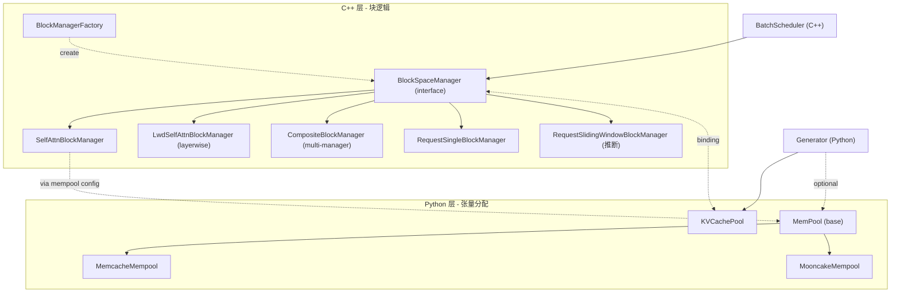
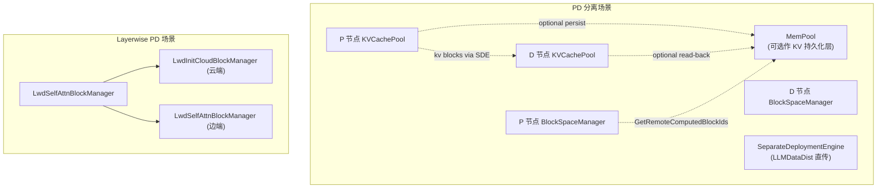

# MindIE KV Cache 体系（C++ BlockSpaceManager + Python KVCachePool + MemPool 多后端）

## Summary
synthesis: MindIE 的 KV cache 体系跨 **C++ 与 Python 两层**：(1) 真正的"块管理"在 C++ — `BlockSpaceManager` 抽象 + 5 种实现（self_attn / lwd_self_attn / composite / request_single / request_sliding_window），由 `BatchScheduler.blockManager_` 持有；(2) Python 侧的 `KVCachePool` ([kvcache_pool.py](d:\design\MindIE-LLM\mindie_llm\text_generator\adapter\torch_utils\kvcache_pool.py)) 是**实际 NPU/CPU 张量分配器**，与 C++ 块管理协作；(3) `MemPool` 抽象 + Memcache / Mooncake 两种后端，是 **PD 分离 / Layerwise PD 场景下跨节点 KV 共享的 KV store**。

## Sources
- C++ 接口：[d:\design\MindIE-LLM\src\include\block_manager\block_manager_interface.h](d:\design\MindIE-LLM\src\include\block_manager\block_manager_interface.h)
- C++ 实现目录：[d:\design\MindIE-LLM\src\block_manager\](d:\design\MindIE-LLM\src\block_manager)（含 4 个 .cpp + 4 个 .h）
- Python 张量池：[d:\design\MindIE-LLM\mindie_llm\text_generator\adapter\torch_utils\kvcache_pool.py](d:\design\MindIE-LLM\mindie_llm\text_generator\adapter\torch_utils\kvcache_pool.py)
- KV store base：[d:\design\MindIE-LLM\mindie_llm\text_generator\mempool\base.py](d:\design\MindIE-LLM\mindie_llm\text_generator\mempool\base.py)
- Memcache 后端：[d:\design\MindIE-LLM\mindie_llm\text_generator\mempool\memcache_mempool.py](d:\design\MindIE-LLM\mindie_llm\text_generator\mempool\memcache_mempool.py)
- Mooncake 后端：[d:\design\MindIE-LLM\mindie_llm\text_generator\mempool\mooncake_mempool.py](d:\design\MindIE-LLM\mindie_llm\text_generator\mempool\mooncake_mempool.py)
- 工厂：[d:\design\MindIE-LLM\mindie_llm\text_generator\mempool\factory.py](d:\design\MindIE-LLM\mindie_llm\text_generator\mempool\factory.py)
- KV cache settings：[d:\design\MindIE-LLM\mindie_llm\text_generator\utils\kvcache_settings.py](d:\design\MindIE-LLM\mindie_llm\text_generator\utils\kvcache_settings.py)
- BatchScheduler 端引用：[mindie/entities/BatchScheduler.md](../entities/BatchScheduler.md)（`blockManager_: BlockSpaceManagerSPtr`）

## 三层架构



## 1. C++ `BlockSpaceManager` 接口 （[block_manager_interface.h:91-186](d:\design\MindIE-LLM\src\include\block_manager\block_manager_interface.h)）

### 5 种 Block Manager 类型 （[block_manager_interface.h:26-32](d:\design\MindIE-LLM\src\include\block_manager\block_manager_interface.h)）

```cpp
enum class BlockManagerType : int32_t {
    SELFATTNBLOCKMANAGER,
    LWDSELFATTNBLOCKMANAGER,
    COMPOSITEBLOCKMANAGER,
    REQUESTSINGLEBLOCKMANAGER,
    REQUESTSLIDINGWINDOWBLOCKMANAGER
};
```

| 类型 | 文件 | 用途 |
|---|---|---|
| `SELFATTNBLOCKMANAGER` | [self_attn_block_manager.h/cpp](d:\design\MindIE-LLM\src\block_manager) | 标准 self-attention KV 块管理 |
| `LWDSELFATTNBLOCKMANAGER` | [lwd_self_attn_block_manager.h/cpp](d:\design\MindIE-LLM\src\block_manager) | **Layerwise Disaggregated** 场景的 self-attention 块管理 |
| `COMPOSITEBLOCKMANAGER` | （组合多个 sub-manager） | 多 cache 类型混合（[block_manager_interface.h:82-84](d:\design\MindIE-LLM\src\include\block_manager\block_manager_interface.h)） |
| `REQUESTSINGLEBLOCKMANAGER` | [request_single_block_manager.h/cpp](d:\design\MindIE-LLM\src\block_manager) | 请求级单块管理（用于 sliding window 等） |
| `REQUESTSLIDINGWINDOWBLOCKMANAGER` | （推断在 enum，未见独立文件） | 请求级 sliding window |

> [!todo] VERIFY: `REQUESTSLIDINGWINDOWBLOCKMANAGER` 实际实现位置（enum 列了但 Glob 没找到独立文件，可能复用 `RequestSingleBlockManager` + `requestBlockWindowSize` 配置）。

### `BlockManagerConfig` 配置 （[block_manager_interface.h:55-89](d:\design\MindIE-LLM\src\include\block_manager\block_manager_interface.h)）

```cpp
struct BlockManagerConfig {
    size_t cacheBlockSize;
    size_t cpuBlockNum;
    size_t npuBlockNum;
    size_t reservedBlockNum;       // 预留 (固定 0)
    size_t speculativeSlots;       // spec decoding 预分配 slot
    bool enableCaching;            // 是否启 prefix cache
    size_t rankSize = 1;
    size_t hostSize = 1;           // CP 场景 hostSize = cpSize
    bool enableKvPool = false;     // 是否启 MemPool (PD 分离用)
    std::string cachePoolBackend = "";   // memcache / mooncake
    std::string cachePoolConfigPath = "";
    RankBlockAllocationMode allocationMode = SMALL_RANK_FIRST;  // PD 分离 P 节点用
    KvCacheType cacheType = TOKEN; // TOKEN / SEQUENCE / SLIDING_WINDOW
    std::vector<BlockManagerConfig> subManagers{};
    size_t requestBlockWindowSize = 2;
};
```

`KvCacheType` 枚举 ([block_manager_interface.h:49-53](d:\design\MindIE-LLM\src\include\block_manager\block_manager_interface.h))：

| 值 | 含义 |
|---|---|
| `TOKEN` (0) | 按 token 分块（标准） |
| `SEQUENCE` (1) | 按整序列分块 |
| `SLIDING_WINDOW` (2) | sliding window 模式 |

`RankBlockAllocationMode` ([block_manager_interface.h:43-47](d:\design\MindIE-LLM\src\include\block_manager\block_manager_interface.h))：

| 值 | 含义 |
|---|---|
| `BALANCED` | 平均分配（已 deprecated） |
| `SMALL_RANK_FIRST` | **PD 分离场景，P 节点优先小 rank** |

### `BlockSpaceManager` 接口 关键 API （[block_manager_interface.h:91-186](d:\design\MindIE-LLM\src\include\block_manager\block_manager_interface.h)）

| 方法 | 行号 | 角色 |
|---|---|---|
| `CanAllocate(seqGroup)` | [97](d:\design\MindIE-LLM\src\include\block_manager\block_manager_interface.h) | 判断能否分配 |
| `Allocate(seqGroup)` | [99](d:\design\MindIE-LLM\src\include\block_manager\block_manager_interface.h) | 分配（首次） |
| `CanAppendSlot(seqGroup)` / `AppendSlot(seq)` | [101-103](d:\design\MindIE-LLM\src\include\block_manager\block_manager_interface.h) | append 一个 slot（decode 步） |
| `CanAppendSlotNew / AppendSlotNew` | [106-108](d:\design\MindIE-LLM\src\include\block_manager\block_manager_interface.h) | **SP 专用接口**（避免影响现有流程） |
| `AppendTokenToLatestRank(seqId, tokens)` | [110](d:\design\MindIE-LLM\src\include\block_manager\block_manager_interface.h) | 追加 token 到最新 rank |
| `Fork(parentSeq, childSeq)` | [112](d:\design\MindIE-LLM\src\include\block_manager\block_manager_interface.h) | 并行采样 fork |
| `CanSwapOut / SwapOut` | [114-116](d:\design\MindIE-LLM\src\include\block_manager\block_manager_interface.h) | NPU → CPU swap |
| `CanSwapIn / SwapIn` | [118-120](d:\design\MindIE-LLM\src\include\block_manager\block_manager_interface.h) | CPU → NPU swap |
| `Free(seqId)` | [122](d:\design\MindIE-LLM\src\include\block_manager\block_manager_interface.h) | 释放 |
| `GetBlockIds(seqId)` / `GetRankedBlockIds` | [124-129](d:\design\MindIE-LLM\src\include\block_manager\block_manager_interface.h) | 取 block id（含按 rank 分组） |
| `GetRankedHashValues / GetSeqHashValues` | [131-133](d:\design\MindIE-LLM\src\include\block_manager\block_manager_interface.h) | **prefix cache 哈希** |
| `GetTokenCountPerRank / GetLatestAppendedRankId / GetAppendedBlockRankId` | [135-139](d:\design\MindIE-LLM\src\include\block_manager\block_manager_interface.h) | rank 级 token 统计 |
| `GetNumFreeNpuBlocks / GetNumFreeCpuBlocks / GetTotalNpuBlocks` | [143-147](d:\design\MindIE-LLM\src\include\block_manager\block_manager_interface.h) | 自由块数 |
| `AccessAllblocksInSeq(seq, accessTime)` | [149](d:\design\MindIE-LLM\src\include\block_manager\block_manager_interface.h) | LRU 访问标记 |
| `GetCommonComputedBlockIds(seqs)` | [151](d:\design\MindIE-LLM\src\include\block_manager\block_manager_interface.h) | 多 seq 公共已算块 |
| `GetAllrankComputedBlockNum` | [153](d:\design\MindIE-LLM\src\include\block_manager\block_manager_interface.h) | 各 rank 已算块数 |
| `GetRemoteComputedBlockIds(seqs, computedLens, tpSize, modelName)` | [155-156](d:\design\MindIE-LLM\src\include\block_manager\block_manager_interface.h) | **PD 分离：远端已算块** |
| `GetAllRankRemoteComputedBlockIds` | [158-159](d:\design\MindIE-LLM\src\include\block_manager\block_manager_interface.h) | 各 rank 远端已算块 |
| `MarkBlocksAsComputed()` | [161](d:\design\MindIE-LLM\src\include\block_manager\block_manager_interface.h) | 标记已算 |
| `GetPrefixCacheHitRate()` | [163](d:\design\MindIE-LLM\src\include\block_manager\block_manager_interface.h) | 命中率 |
| `ResetPrefixCache()` | [165](d:\design\MindIE-LLM\src\include\block_manager\block_manager_interface.h) | 清 prefix cache |
| `GetNumCachedTokens(seq) / GetSeqNumCachedTokens(seq)` | [167-169](d:\design\MindIE-LLM\src\include\block_manager\block_manager_interface.h) | 已缓存 token 数 |
| `ReplaceTrailingPlaceHolder(seq, trailingPlaceHolderNum, replacedPlaceHolderNum)` | [171-172](d:\design\MindIE-LLM\src\include\block_manager\block_manager_interface.h) | 替换尾部 placeholder |
| `LwdInitCloudBlockManager / LwdGetCloud*` | [176-185](d:\design\MindIE-LLM\src\include\block_manager\block_manager_interface.h) | **Layerwise Disaggregated 云端块管理** |

### `BlockManagerFactory` （[block_manager_interface.h:191-195](d:\design\MindIE-LLM\src\include\block_manager\block_manager_interface.h)）

```cpp
class BlockManagerFactory {
public:
    static BlockSpaceManagerSPtr CreateBlockSpaceManager(
        BlockManagerType type, const BlockManagerConfig &config, size_t localDPRank = 0);
};
```

### 关键 enum：`AllocStatus`

> [!todo] VERIFY: `AllocStatus` 在 `basic_types.h` 或 `sequence_group.h` 中定义（[block_manager_interface.h:97-118](d:\design\MindIE-LLM\src\include\block_manager\block_manager_interface.h) 引用），可能枚举 `OK / LATER / NEVER` 三种返回。

## 2. Python `KVCachePool` （[kvcache_pool.py:21-...](d:\design\MindIE-LLM\mindie_llm\text_generator\adapter\torch_utils\kvcache_pool.py)）

`KVCachePool` 是 **NPU/CPU 张量的实际持有者**，由 `Generator.generator_backend` 创建并通过 `model_wrapper.set_npu_cache(...)` 绑定到模型。

| 方法 | 行号 | 角色 |
|---|---|---|
| `__init__(kvcache_settings, device, enable_kv_pool=False)` | [44-84](d:\design\MindIE-LLM\mindie_llm\text_generator\adapter\torch_utils\kvcache_pool.py) | 解析 KVCacheSettings 并设备绑定 |
| `get_npu_blocks_addrs()` | [85-87](d:\design\MindIE-LLM\mindie_llm\text_generator\adapter\torch_utils\kvcache_pool.py) | 取 NPU 块地址列表（**KVMover 注册用**，PD 分离场景） |
| `allocate_npu_kvcache()` | [88-113](d:\design\MindIE-LLM\mindie_llm\text_generator\adapter\torch_utils\kvcache_pool.py) | NPU 端分配 |
| `allocate_cpu_kvcache()` | [114-164](d:\design\MindIE-LLM\mindie_llm\text_generator\adapter\torch_utils\kvcache_pool.py) | CPU 端分配（swap 用） |
| `sync_swap_mb(swap_decision)` | [165-203](d:\design\MindIE-LLM\mindie_llm\text_generator\adapter\torch_utils\kvcache_pool.py) | mb (mempool) 模式同步 swap |
| `sync_swap_base(swap_decision)` | [204-244](d:\design\MindIE-LLM\mindie_llm\text_generator\adapter\torch_utils\kvcache_pool.py) | 标准模式同步 swap |
| `_create_aligned_tensor(target_shape, dtype)` | [245-280](d:\design\MindIE-LLM\mindie_llm\text_generator\adapter\torch_utils\kvcache_pool.py) | 内存对齐张量分配（NPU 性能关键） |
| `_allocate_npu_kvcache_mb()` | [281-323](d:\design\MindIE-LLM\mindie_llm\text_generator\adapter\torch_utils\kvcache_pool.py) | mempool 集成路径 |
| `_allocate_npu_kvcache_base()` | [324-...](d:\design\MindIE-LLM\mindie_llm\text_generator\adapter\torch_utils\kvcache_pool.py) | 标准路径 |

> synthesis: `KVCachePool` 与 C++ `BlockSpaceManager` 是**正交**关系：前者负责"实际分配的 tensor 在哪"，后者负责"哪些块属于哪个序列"。两者通过 `npu_addrs` (块物理地址列表) 桥接，PD 分离场景下还要把这些地址注册给 KVMover / SeparateDeploymentEngine（详见 [mindie/topics/request-lifecycle.md](request-lifecycle.md) §PD 分离链路）。

## 3. `MemPool` 跨节点 KV store （[mempool/](d:\design\MindIE-LLM\mindie_llm\text_generator\mempool)）

### 抽象基类 （[mempool/base.py:19-50](d:\design\MindIE-LLM\mindie_llm\text_generator\mempool\base.py)）

```python
class MemPool:
    @classmethod
    def create_pool(cls, backend: str, config_path: str, role: str = "scheduler", **kwargs):
        ...
    def exists(self, key: str, **kwargs) -> bool: ...
    def put(self, keys, tensors, **kwargs): ...
    def get(self, keys, tensors, **kwargs): ...
    def close(self) -> None: ...
```

工厂 [factory.py:13](d:\design\MindIE-LLM\mindie_llm\text_generator\mempool\factory.py)：`CreatePool(backend, config_path, role, **kwargs)` 按 `backend` 字符串选 memcache / mooncake。

### Memcache 后端 （[memcache_mempool.py:28-148](d:\design\MindIE-LLM\mindie_llm\text_generator\mempool\memcache_mempool.py)）

- `MmcDirect` enum ([memcache_mempool.py:21](d:\design\MindIE-LLM\mindie_llm\text_generator\mempool\memcache_mempool.py))
- `MemcacheMempool(MemPool)` ([memcache_mempool.py:28](d:\design\MindIE-LLM\mindie_llm\text_generator\mempool\memcache_mempool.py))：基于 memcache 协议的 KV 远程存储

API：

| 方法 | 行号 | 用途 |
|---|---|---|
| `__init__(config_path, role, **kwargs)` | [29-54](d:\design\MindIE-LLM\mindie_llm\text_generator\mempool\memcache_mempool.py) | 连接初始化 |
| `exists(key)` | [55-60](d:\design\MindIE-LLM\mindie_llm\text_generator\mempool\memcache_mempool.py) | 单 key 存在性 |
| `batch_exist(keys)` | [61-68](d:\design\MindIE-LLM\mindie_llm\text_generator\mempool\memcache_mempool.py) | 批量存在性 |
| `put(keys, tensors)` | [69-97](d:\design\MindIE-LLM\mindie_llm\text_generator\mempool\memcache_mempool.py) | 写 |
| `get(keys, tensors)` | [98-126](d:\design\MindIE-LLM\mindie_llm\text_generator\mempool\memcache_mempool.py) | 读 |
| `_get_addr_size(tensors)` | [133-...](d:\design\MindIE-LLM\mindie_llm\text_generator\mempool\memcache_mempool.py) | 取张量地址 + 大小（zero-copy 读写） |

### Mooncake 后端 （[mooncake_mempool.py:97-...](d:\design\MindIE-LLM\mindie_llm\text_generator\mempool\mooncake_mempool.py)）

- `MooncakeStoreConfig` ([mooncake_mempool.py:55](d:\design\MindIE-LLM\mindie_llm\text_generator\mempool\mooncake_mempool.py)) — 解析 config.json
- `MooncakeMempool(MemPool)` ([mooncake_mempool.py:97](d:\design\MindIE-LLM\mindie_llm\text_generator\mempool\mooncake_mempool.py))

API：

| 方法 | 行号 | 用途 |
|---|---|---|
| `__init__(config_path, role)` | [98-156](d:\design\MindIE-LLM\mindie_llm\text_generator\mempool\mooncake_mempool.py) | 初始化 mooncake transport |
| `exists / batch_exist` | [157-170](d:\design\MindIE-LLM\mindie_llm\text_generator\mempool\mooncake_mempool.py) | 存在性 |
| `put(keys, tensors)` | [171-189](d:\design\MindIE-LLM\mindie_llm\text_generator\mempool\mooncake_mempool.py) | 写 |
| `get(keys, tensors)` | [190-208](d:\design\MindIE-LLM\mindie_llm\text_generator\mempool\mooncake_mempool.py) | 读 |
| `_register(kv_caches)` | [225-235](d:\design\MindIE-LLM\mindie_llm\text_generator\mempool\mooncake_mempool.py) | **注册 KV cache 内存到 mooncake transport** |
| `_put / _get` | [236-292](d:\design\MindIE-LLM\mindie_llm\text_generator\mempool\mooncake_mempool.py) | 标准路径 |
| `_ascend_transport_put / _ascend_transport_get` | [252-...](d:\design\MindIE-LLM\mindie_llm\text_generator\mempool\mooncake_mempool.py) | **Ascend 专用 transport 路径** |

`get_global_te(hostname, device_name)` ([mooncake_mempool.py:32-54](d:\design\MindIE-LLM\mindie_llm\text_generator\mempool\mooncake_mempool.py)) 全局 transport endpoint 单例。

## MemPool 的两种用途 (synthesis)



要点：

- **MemPool 不是必需**——可由 `BlockManagerConfig.enableKvPool=false` 禁用
- 启用时通过 `cachePoolBackend` 选 memcache / mooncake，与 `cachePoolConfigPath` 配合
- 与 SeparateDeploymentEngine 的 LLMDataDist 直传**正交**：SDE 是 P→D 直接 KV 传输，MemPool 是持久化层

## 与你 PD 优化的关联（synthesis）

> 注意：本节是综合性建议。

如果你正在做 PD 分离性能优化，KV cache 这一层的关注点：

1. **`SMALL_RANK_FIRST` 分配模式**（[block_manager_interface.h:43-47](d:\design\MindIE-LLM\src\include\block_manager\block_manager_interface.h)）—— P 节点已经默认这个模式，把热块集中在小 rank 上有利于减小跨 rank 数据搬运
2. **`KVCachePool._create_aligned_tensor`**（[kvcache_pool.py:245-280](d:\design\MindIE-LLM\mindie_llm\text_generator\adapter\torch_utils\kvcache_pool.py)）—— 对齐分配是 NPU 性能关键。如果你看到首次 forward 时图 capture 异常慢，可能是地址对齐导致 buffer 重新捕图（参见 [model_runner.py:290-293](d:\design\MindIE-LLM\mindie_llm\runtime\model_runner\model_runner.py)）
3. **`MemPool` 启停**：异步写到远程 store 与 SDE 直传不冲突。如果你想在不影响 P 推理的前提下做 KV 持久化（用于 D 节点冷启动 / 故障恢复），考虑启 `enableKvPool=true` + Mooncake 后端
4. **`GetRemoteComputedBlockIds`**（[block_manager_interface.h:155-156](d:\design\MindIE-LLM\src\include\block_manager\block_manager_interface.h)）：D 节点查 P 节点上已算 prefix。如果 prefix cache 命中率低，看这个 API 的实现是否在跨节点查询时退化（同步 RPC 时会拖 TTFT）
5. **`enableCaching` 与 PD 分离的兼容**：[block_manager_interface.h:66](d:\design\MindIE-LLM\src\include\block_manager\block_manager_interface.h) 是 prefix cache 全局开关，需确认在 PD 分离场景下两端都开

## Notes / Caveats
> [!todo] VERIFY: C++ `BlockSpaceManager` 各实现的具体行为差异（`Allocate` 内部 hash 计算、`SwapOut/In` 的 PCIe 路径），需要读 .cpp 实现。
> [!todo] VERIFY: `RequestSlidingWindowBlockManager` 是否真有独立实现还是 `RequestSingleBlockManager + requestBlockWindowSize` 的特例。
> [!todo] VERIFY: `KVCachePool` 与 `BlockSpaceManager` 之间的 binding 接口（pybind11？还是 C++ 通过函数指针回调 Python？）。
> [x] RESOLVED (2026-04-18 verify pass): `_ascend_transport_put` / `_ascend_transport_get` **不走 LLMDataDist**——它们直接调 `mooncake.store.batch_put_from_ascend` / `batch_get_into_ascend`（[mooncake_mempool.py:264, 307](d:\design\MindIE-LLM\mindie_llm\text_generator\mempool\mooncake_mempool.py)），通过 mooncake 自己的 `TransferEngine` 单例（`get_global_te`，[mooncake_mempool.py:32-51](d:\design\MindIE-LLM\mindie_llm\text_generator\mempool\mooncake_mempool.py)，init 用 `transfer_engine.initialize(hostname, "P2PHANDSHAKE", "ascend", device_name)`）。**SDE 与 MemPool/Mooncake 是两套独立传输栈**，可以同时启用做不同事（SDE 直传 + MemPool 持久化）。详见 [comparison/topics/pd-disaggregation.md §3](../../comparison/topics/pd-disaggregation.md)。
> [!warning] CONTRADICTION: vLLM 与 SGLang 都把 prefix cache 命中放在 KVCacheManager 入口（`get_computed_blocks` / `match_prefix`），MindIE 的 `GetRemoteComputedBlockIds` 暗示**远端命中查询**是显式分开的。这种设计在跨节点 prefix cache 场景更清晰。

## See also
- [entities/BatchScheduler.md](../entities/BatchScheduler.md)
- [entities/Generator.md](../entities/Generator.md)
- [topics/request-lifecycle.md](request-lifecycle.md)
- [topics/aclgraph-pp.md](aclgraph-pp.md)
- [comparison/topics/kv-cache.md](../../comparison/topics/kv-cache.md)
