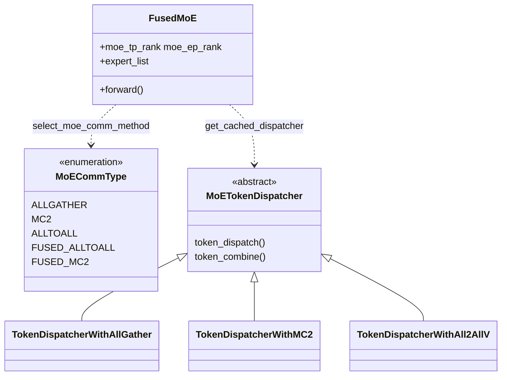

# MindIE-LLM MoE 实现栈（Qwen3-MoE / DeepSeek-V3 + fused_moe + token_dispatcher + EP / MC2）

## Summary

> synthesis: **MindIE-LLM 的 MoE 推理主路径**由三层构成：(1) 模型侧 `FusedMoE` + `select_experts`（路由/共享专家组合）；(2) `moe_comm_strategy.select_moe_comm_method` 按 **设备类型、EP 是否启用、MoE TP、prefill/decode、每卡 token 数、每 EP rank 专家数** 在若干策略中 **顺序选第一个可用** 策略（[moe_comm_strategy.py:209-214](d:\design\MindIE-LLM\mindie_llm\runtime\layers\fused_moe\moe_comm_strategy.py)）；(3) `token_dispatcher` 对 `ALLGATHER` / `MC2` / `ALLTOALL` 走 NPU 算子或 `dist`，`FUSED_MC2` 则直接调用 `torch.ops.mie_ops.npu_dispatch_ffn_combine`（[fused_moe.py:154-172](d:\design\MindIE-LLM\mindie_llm\runtime\layers\fused_moe\fused_moe.py)）。

**EP 与 MoE TP 的拓扑**由 `ParallelInfoManager` 约束 `moe_tp.group_size * moe_ep.group_size == world_size`（[parallel_info_manager.py:208-214](d:\design\MindIE-LLM\mindie_llm\runtime\utils\distributed\parallel_info_manager.py)）；**MC2 专用通信组** `MOE_EP_MC2` 与 `MOE_EP` 同 `moe_ep` 规模但 **不复用 PG 缓存**（`is_reusable=False`，[parallel_info_manager.py:215-217](d:\design\MindIE-LLM\mindie_llm\runtime\utils\distributed\parallel_info_manager.py)）。

**与 [comparison/topics/distributed.md §5](../../comparison/topics/distributed.md) 的对照**：vLLM / SGLang 在仓库内有完整 **EPLB / Elastic-EP** 子树；MindIE **运行时 fused MoE 目录无 EPLB**，全仓库 `eplb` 命中主要来自 **ATB 示例与 ATB wrapper**，需与"无运行时 EPLB"区分（见 §EPLB 缺失）。

## Sources

| 层级 | 路径 |
|------|------|
| Fused MoE 层 | [fused_moe/](d:\design\MindIE-LLM\mindie_llm\runtime\layers\fused_moe) |
| 并行元数据 | [parallel_info_manager.py](d:\design\MindIE-LLM\mindie_llm\runtime\utils\distributed\parallel_info_manager.py) |
| 模型 | [qwen3_moe/](d:\design\MindIE-LLM\mindie_llm\runtime\models\qwen3_moe)、[deepseek_v3/](d:\design\MindIE-LLM\mindie_llm\runtime\models\deepseek_v3)、[deepseek_v32/](d:\design\MindIE-LLM\mindie_llm\runtime\models\deepseek_v32) |
| C++ / ACLNN | [dispatch_ffn_combine/](d:\design\MindIE-LLM\src\kernels\mie_ops\csrc\mc2\dispatch_ffn_combine)、[npu_dispatch_ffn_combine.cpp](d:\design\MindIE-LLM\src\kernels\mie_ops\torch_ops_extension\npu_dispatch_ffn_combine.cpp) |
| 架构表（FUSED_MC2 等） | [docs/zh/developer_guide/architecture_design/MoE.md](d:\design\MindIE-LLM\docs\zh\developer_guide\architecture_design\MoE.md) |

## 目录结构 + 子组件

### `qwen3_moe/`（4 文件，无 `__init__.py`）

| 文件 | 一句话 |
|------|--------|
| [`qwen3_moe.py`](d:\design\MindIE-LLM\mindie_llm\runtime\models\qwen3_moe\qwen3_moe.py) | `Qwen3MoeSparseMoeBlock` / `Qwen3MoeLayer` / `Qwen3MoeModel` / `Qwen3MoeForCausalLM`，MoE 块内挂 `FusedMoE` |
| [`router_qwen3_moe.py`](d:\design\MindIE-LLM\mindie_llm\runtime\models\qwen3_moe\router_qwen3_moe.py) | Qwen3-MoE 路由注册与模型 id |
| [`input_builder_qwen3_moe.py`](d:\design\MindIE-LLM\mindie_llm\runtime\models\qwen3_moe\input_builder_qwen3_moe.py) | 构建该模型的输入张量/metadata |
| [`config_qwen3_moe.py`](d:\design\MindIE-LLM\mindie_llm\runtime\models\qwen3_moe\config_qwen3_moe.py) | HF/MindIE 配置适配 |

### `deepseek_v3/`（5 文件 + MTP）

| 文件 | 一句话 |
|------|--------|
| [`deepseek_v3.py`](d:\design\MindIE-LLM\mindie_llm\runtime\models\deepseek_v3\deepseek_v3.py) | `DeepseekV3Moe`（共享专家 + `FusedMoE` + `select_experts`）、`DeepseekV3ForCausalLM` 等主模型 |
| [`router_deepseek_v3.py`](d:\design\MindIE-LLM\mindie_llm\runtime\models\deepseek_v3\router_deepseek_v3.py) | DeepSeek-V3 路由 |
| [`input_builder_deepseek_v3.py`](d:\design\MindIE-LLM\mindie_llm\runtime\models\deepseek_v3\input_builder_deepseek_v3.py) | 输入构建 |
| [`config_deepseek_v3.py`](d:\design\MindIE-LLM\mindie_llm\runtime\models\deepseek_v3\config_deepseek_v3.py) | 配置 |
| [`deepseek_v3_mtp.py`](d:\design\MindIE-LLM\mindie_llm\runtime\models\deepseek_v3\deepseek_v3_mtp.py) | MTP draft：`DeepseekV3MTP` / `DeepseekV3MtpModel`，第 61 层 MTP 扩展（详 [`speculative.md`](speculative.md)） |

### `deepseek_v32/`（4 文件，结构差异：**无主干推理模块**）

| 文件 | 一句话 |
|------|--------|
| [`encoding_deepseek_v32.py`](d:\design\MindIE-LLM\mindie_llm\runtime\models\deepseek_v32\encoding_deepseek_v32.py) | DSML/工具调用模板与消息编码（自 HF DeepSeek-V3.2 拷贝），**非 MoE 计算图** |
| [`router_deepseek_v32.py`](d:\design\MindIE-LLM\mindie_llm\runtime\models\deepseek_v32\router_deepseek_v32.py) | 继承 `DeepseekV3Router`，模型 id `deepseek_v32` |
| [`input_builder_deepseekv32.py`](d:\design\MindIE-LLM\mindie_llm\runtime\models\deepseek_v32\input_builder_deepseekv32.py) | 输入构建，依赖 encoding |
| [`tool_calls_processor_deepseekv32.py`](d:\design\MindIE-LLM\mindie_llm\runtime\models\deepseek_v32\tool_calls_processor_deepseekv32.py) | 工具调用解析注册 |

> ~~[!warning] CONTRADICTION: `deepseek_v32/` **无** `<model>.py` 形态的主干推理模块；MoE 计算仍落在 **deepseek_v3** 族（若走 MindIE runtime）。需对照产品文档确认 V32 部署模式。~~ **RESOLVED 2026-04-18**：这不是缺失而是**有意设计的复用**——`DeepseekV32Router` 显式覆盖 `_get_model_cls` 返回 `DeepseekV3ForCausalLM`、`_get_draft_cls` 返回 `DeepseekV3MTP`、`_get_config_cls` 返回 `DeepseekV3Config`（[router_deepseek_v32.py:13-54](d:\design\MindIE-LLM\mindie_llm\runtime\models\deepseek_v32\router_deepseek_v32.py)）。V3.2 目录只承载 V3.2-specific 部分（`encoding` / `input_builder` / `tool_calls_processor`）。官方迁移指南 ([aclgraph_migration_and_adaptation_guide.md:439, 451](d:\design\MindIE-LLM\docs\zh\developer_guide\migration_and_adaptation_guide\aclgraph_migration_and_adaptation_guide.md)) 也将 `models/deepseek_v32/` 列为 DeepSeek V3.2 实现参考；安装文档 ([preparing_software_and_dependencies.md:16](d:\design\MindIE-LLM\docs\zh\user_guide\install\source\preparing_software_and_dependencies.md)) 仅约束 torch/torch_npu 版本，未要求独立主干模块。结论：**V3.2 部署模式 = V3 主干 + V3.2 路由/编码/工具调用层**。

### `fused_moe/`（6 文件）

| 文件 | 一句话 |
|------|--------|
| [`fused_moe.py`](d:\design\MindIE-LLM\mindie_llm\runtime\layers\fused_moe\fused_moe.py) | `FusedMoE`：EP 切分、`assign_experts`、前向里选通信类型并 dispatch/combine 或 fused op |
| [`token_dispatcher.py`](d:\design\MindIE-LLM\mindie_llm\runtime\layers\fused_moe\token_dispatcher.py) | `TokenDispatcherWithAllGather` / `TokenDispatcherWithMC2` / `TokenDispatcherWithAll2AllV` 及参数 dataclass |
| [`moe_comm_strategy.py`](d:\design\MindIE-LLM\mindie_llm\runtime\layers\fused_moe\moe_comm_strategy.py) | `MoECommType` 枚举与各 `*Strategy.is_applicable` |
| [`moe_comm_method.py`](d:\design\MindIE-LLM\mindie_llm\runtime\layers\fused_moe\moe_comm_method.py) | `select_moe_comm_method`、`get_cached_dispatcher`、dispatcher 映射表 |
| [`fused_moe_method_base.py`](d:\design\MindIE-LLM\mindie_llm\runtime\layers\fused_moe\fused_moe_method_base.py) | `FusedMoEMethodBase`：量化/非量化 fused MoE 方法抽象 |
| [`experts_selector.py`](d:\design\MindIE-LLM\mindie_llm\runtime\layers\fused_moe\experts_selector.py) | `select_experts` → `torch_npu.npu_moe_gating_top_k` |

### `dispatch_ffn_combine/`（C++，共 49 个文件）

根路径：[d:\design\MindIE-LLM\src\kernels\mie_ops\csrc\mc2\dispatch_ffn_combine](d:\design\MindIE-LLM\src\kernels\mie_ops\csrc\mc2\dispatch_ffn_combine)。

- **op_host/op_api**：`aclnn_dispatch_ffn_combine.cpp` / `.h` —— ACLNN 宿主封装、`group` 字符串传入、`HCCL_GROUP_NAME_MAX` 等（[aclnn_dispatch_ffn_combine.cpp:35-72](d:\design\MindIE-LLM\src\kernels\mie_ops\csrc\mc2\dispatch_ffn_combine\op_host\op_api\aclnn_dispatch_ffn_combine.cpp)）；头文件 `#include "hccl/hccl.h"`（[aclnn_dispatch_ffn_combine.h:17](d:\design\MindIE-LLM\src\kernels\mie_ops\csrc\mc2\dispatch_ffn_combine\op_host\op_api\aclnn_dispatch_ffn_combine.h)）。
- **op_host**：`dispatch_ffn_combine_tiling.cpp` —— tiling 与 `HCCL_BUFFSIZE` 环境变量。
- **op_kernel**：`dispatch_ffn_combine.cpp` / `dispatch_ffn_combine_kernel.hpp` / `moe_init_routing_quant_v2/*` —— AICore 核与路由量化 v2 全套。
- **op_kernel/utils**：`hccl_shmem.hpp`、`moe_distribute_base.h` 等 —— HCCL 相关窗口与上下文。

## MoE 层抽象

### `moe_ep_rank` / `moe_ep_size` / `assign_experts`

- 构造函数从 `ParallelInfoManager` 读取 `MOE_TP` / `MOE_EP`，计算 `intermediate_size_per_partition`、`expert_list`（[fused_moe.py:63-96](d:\design\MindIE-LLM\mindie_llm\runtime\layers\fused_moe\fused_moe.py)）。
- `assign_experts(expert_count, world_size)`：整除时均匀切块；**不整除**时前 `world_size-1` 个 rank 各 `ceil` 个，最后一个 rank 收余数（[fused_moe.py:276-288](d:\design\MindIE-LLM\mindie_llm\runtime\layers\fused_moe\fused_moe.py)）。

### `MoECommType.ALLGATHER` 后对 world `all_reduce`

- [fused_moe.py:194-201](d:\design\MindIE-LLM\mindie_llm\runtime\layers\fused_moe\fused_moe.py)：注释说明 allgather 路径 expert 输出已 gather，但 hidden 仍按 **其它 TP** 切分，故对 **`parallel_info.world.process_group`** 做 `all_reduce` 合并。

### `MoECommType` 完整清单

定义于 [moe_comm_strategy.py:43-50](d:\design\MindIE-LLM\mindie_llm\runtime\layers\fused_moe\moe_comm_strategy.py)：

- `ALLGATHER`、`MC2`、`ALLTOALL`、`FUSED_ALLTOALL`、`FUSED_MC2`。

> [!warning] CONTRADICTION: **`FUSED_ALLTOALL`** 仅在枚举中出现，**本文件内无任何 Strategy 返回该类型**（全文件 grep 仅 [moe_comm_strategy.py:49](d:\design\MindIE-LLM\mindie_llm\runtime\layers\fused_moe\moe_comm_strategy.py)）。**`FusedMC2Strategy`** 类存在（[moe_comm_strategy.py:67-105](d:\design\MindIE-LLM\mindie_llm\runtime\layers\fused_moe\moe_comm_strategy.py)），但 **生产 `MOE_COMM_STRATEGIES` 列表未包含该类**（[moe_comm_strategy.py:210-214](d:\design\MindIE-LLM\mindie_llm\runtime\layers\fused_moe\moe_comm_strategy.py)），与单元测试 [test_moe_comm_strategy.py:334-341](d:\design\MindIE-LLM\tests\pythontest\cpu\runtime\layers\fused_moe\test_moe_comm_strategy.py) 期望的"FusedMC2 优先"**不一致**——`select_moe_comm_method` 因此 **不会** 返回 `FUSED_MC2`，而 `fused_moe.py` 仍保留 `MoECommType.FUSED_MC2` 分支（[fused_moe.py:154-172](d:\design\MindIE-LLM\mindie_llm\runtime\layers\fused_moe\fused_moe.py)），属 **策略表与实现/测试漂移** 风险点。
>
> **RECONFIRMED 2026-04-18**（verify pass）：三方 anchor 重新核对确认矛盾**未消解**。
> - 实测 [moe_comm_strategy.py:210-214](d:\design\MindIE-LLM\mindie_llm\runtime\layers\fused_moe\moe_comm_strategy.py) 仍是 `[MC2Strategy, All2AllStrategy, AllGatherStrategy]`（**不含 `FusedMC2Strategy`**）。
> - 测试 [test_moe_comm_strategy.py:334-341](d:\design\MindIE-LLM\tests\pythontest\cpu\runtime\layers\fused_moe\test_moe_comm_strategy.py) `test_strategy_priority_order` 仍 assert `expected_order = [FusedMC2Strategy, MC2Strategy, All2AllStrategy, AllGatherStrategy]`——按当前生产代码该测试**会失败**。
> - 文档 [MoE.md:69-84](d:\design\MindIE-LLM\docs\zh\developer_guide\architecture_design\MoE.md) 表格 row 8/10 明确 910_93 + ep≤32 + tokens≤cap 应选 `FUSED_MC2`，但生产路径走不到。
> - 综合：`FUSED_MC2` 与 `FUSED_ALLTOALL` 是 **dead branch**，三处事实（生产策略表 / 单测期望 / 架构文档表）三方互不一致，需**上游决议**（要么补回 `FusedMC2Strategy` 到列表，要么从枚举/测试/文档移除）。本页保留 CONTRADICTION 不降级。

### `token_dispatcher` 与 `MOE_EP`

- **`TokenDispatcherWithAllGather`**：用 `ParallelType.MOE_EP` 的 `group_size` 推本地 expert 范围；`npu_moe_init_routing_v2` / `npu_moe_token_unpermute`（[token_dispatcher.py:125-183](d:\design\MindIE-LLM\mindie_llm\runtime\layers\fused_moe\token_dispatcher.py)）。
- **`TokenDispatcherWithMC2`**：`MOE_EP_MC2` 取 HCCL comm 名，`npu_moe_distribute_*` combine 路径中带 `group_ep`（[token_dispatcher.py:186-350](d:\design\MindIE-LLM\mindie_llm\runtime\layers\fused_moe\token_dispatcher.py)）。
- **`TokenDispatcherWithAll2AllV`**：`moe_ep.process_group` 上 all2all（[token_dispatcher.py:437-449](d:\design\MindIE-LLM\mindie_llm\runtime\layers\fused_moe\token_dispatcher.py)）。

### `moe_comm_strategy` 中的 EP 约束（摘要）

- **通用**：多数策略要求 `MOE_EP` 启用；**`MOE_TP` 与 `MOE_EP` 同时启用** 时 `MC2` / `All2All` / `FusedMC2`（若启用）均判为不适用（例：[moe_comm_strategy.py:122-124](d:\design\MindIE-LLM\mindie_llm\runtime\layers\fused_moe\moe_comm_strategy.py)）。
- **MC2**：910B 额外要求 `world_size ∈ {16,32,64}` 等（[moe_comm_strategy.py:126-133](d:\design\MindIE-LLM\mindie_llm\runtime\layers\fused_moe\moe_comm_strategy.py)）；910C token / `num_experts_per_ep_rank` 上限（[moe_comm_strategy.py:135-141](d:\design\MindIE-LLM\mindie_llm\runtime\layers\fused_moe\moe_comm_strategy.py)）。
- **All2All**：**decode + graph** 场景不适用（`not forward_ctx.is_prefill` 时返回 False）（[moe_comm_strategy.py:172-175](d:\design\MindIE-LLM\mindie_llm\runtime\layers\fused_moe\moe_comm_strategy.py)）。
- **AllGather**：仅 **910B** 且 **非 ATTN_DP**（[moe_comm_strategy.py:195-200](d:\design\MindIE-LLM\mindie_llm\runtime\layers\fused_moe\moe_comm_strategy.py)）。

## EP rank 划分（MOE_TP vs MOE_EP vs MOE_EP_MC2）

- **乘积约束**：`moe_tp.group_size * moe_ep.group_size == world_size`，否则 `ValueError`（[parallel_info_manager.py:208-214](d:\design\MindIE-LLM\mindie_llm\runtime\utils\distributed\parallel_info_manager.py)）。与文档 [optimization_and_tuning.md](d:\design\MindIE-LLM\docs\zh\user_guide\optimization_and_tuning.md) 中 `moe_ep * moe_tp` 描述一致。
- **`MOE_EP`**：DP 式 stride 分组（详 [ParallelInfoManager.md §初始化](../entities/ParallelInfoManager.md)），缓冲 256M 注释（[parallel_info_manager.py:206-207](d:\design\MindIE-LLM\mindie_llm\runtime\utils\distributed\parallel_info_manager.py)）。
- **`MOE_EP_MC2`**：同样 `server_config.get("moe_ep", -1)` 定组规模，**`is_reusable=False`**，`buffer_size=int(os.getenv("HCCL_BUFFSIZE"))`（[parallel_info_manager.py:215-217](d:\design\MindIE-LLM\mindie_llm\runtime\utils\distributed\parallel_info_manager.py)）——与 [ParallelInfoManager.md](../entities/ParallelInfoManager.md) 所述 **不复用 PG 缓存** 对齐。
- **`FusedMoE._create_moe_ep_group`**：显式取 `ParallelType.MOE_EP_MC2` 的 `process_group` → `get_hccl_comm_name`（[fused_moe.py:266-273](d:\design\MindIE-LLM\mindie_llm\runtime\layers\fused_moe\fused_moe.py)），供 `npu_dispatch_ffn_combine` 的 `group` 参数。

## C++ MC2 算子

- **Python 绑定**：`torch.ops.mie_ops.npu_dispatch_ffn_combine` → `EXEC_NPU_CMD_V1(aclnnDispatchFFNCombine, ...)`（[npu_dispatch_ffn_combine.cpp:18-42](d:\design\MindIE-LLM\src\kernels\mie_ops\torch_ops_extension\npu_dispatch_ffn_combine.cpp)）。
- **与 `MOE_EP_MC2` 对接**：Python 侧传入的 `group` 为 HCCL 组名字符串（同 [fused_moe.py:260-273](d:\design\MindIE-LLM\mindie_llm\runtime\layers\fused_moe\fused_moe.py)），C++ ACLNN API 签名含 `const char* group`（[aclnn_dispatch_ffn_combine.cpp:58-62](d:\design\MindIE-LLM\src\kernels\mie_ops\csrc\mc2\dispatch_ffn_combine\op_host\op_api\aclnn_dispatch_ffn_combine.cpp)）。
- **HCCL**：头文件层直接 `#include "hccl/hccl.h"`（[aclnn_dispatch_ffn_combine.h:17](d:\design\MindIE-LLM\src\kernels\mie_ops\csrc\mc2\dispatch_ffn_combine\op_host\op_api\aclnn_dispatch_ffn_combine.h)）；核侧通过 `AscendC::GetHcclContext` / `hccl_shmem` 等协作。

## 模型实现（DeepSeek-V3 / V32 / Qwen3-MoE）

### 主类签名

- **`Qwen3MoeForCausalLM`**：`__init__(self, mindie_llm_config)`（[qwen3_moe.py:287-308](d:\design\MindIE-LLM\mindie_llm\runtime\models\qwen3_moe\qwen3_moe.py)）。
- **`DeepseekV3ForCausalLM`**：`__init__(self, mindie_llm_config) -> None`（[deepseek_v3.py:553-566](d:\design\MindIE-LLM\mindie_llm\runtime\models\deepseek_v3\deepseek_v3.py)）。
- **DeepSeek V32**：目录内 **无** `*ForCausalLM` 主干文件；详 §目录结构 V32 部分。

### 共享 expert vs 路由 expert（DeepSeek-V3）

- **`DeepseekV3Moe`**：`shared_experts` 为 `DeepseekV3MLP`；`router` + `select_experts` 产生 `topk_weights`/`topk_ids`；`FusedMoE` 处理路由专家（[deepseek_v3.py:34-70](d:\design\MindIE-LLM\mindie_llm\runtime\models\deepseek_v3\deepseek_v3.py)，forward [99-120](d:\design\MindIE-LLM\mindie_llm\runtime\models\deepseek_v3\deepseek_v3.py)）。
- **Qwen3-MoE**：`Qwen3MoeSparseMoeBlock` 仅 `gate` + `FusedMoE`（[qwen3_moe.py:29-80](d:\design\MindIE-LLM\mindie_llm\runtime\models\qwen3_moe\qwen3_moe.py)），无单独 shared MLP 分支（与 DeepSeek 结构不同）。

### MTP 与 speculative decode

详 [`speculative.md`](speculative.md)。MTP 在 MoE 主线下属于 **draft 模型** 路径，不影响 expert 路由。

## EPLB 缺失（重要 caveat）

- **[distributed.md §5](../../comparison/topics/distributed.md)** 的 synthesis：**MindIE 运行时 MoE 栈无 vLLM/SGLang 式 EPLB 子系统**；大 MoE 上 expert 热点仍是产品级风险。
- **细化（相对全仓库 grep）**：
  - **`mindie_llm/runtime/`** 下递归 grep 子串 `eplb`：**0 命中**（N/A：在 `d:\design\MindIE-LLM\mindie_llm\runtime\` 全树 grep `eplb` **0 命中**）。
  - **`mindie_llm/runtime/layers/fused_moe/`**：grep `eplb` **0 命中**（N/A：在 `d:\design\MindIE-LLM\mindie_llm\runtime\layers\fused_moe\` grep `eplb` **0 命中**）。
  - **全仓库** 存在 **`eplb`**：ATB 栈（`examples/atb_models/`）、[atb_model_wrapper.py](d:\design\MindIE-LLM\mindie_llm\modeling\model_wrapper\atb\atb_model_wrapper.py) 引用 `atb_llm` 的 EPLB、`docs/zh/user_guide/feature/expert_parallelism_load_balancer.md` 等——属 **另一条产品线/示例**，**不等价**于 `fused_moe` + `ParallelInfoManager` 主线上的 EPLB。
- **expert_distribution / expert_balance**：在 `d:\design\MindIE-LLM\` 全仓库 grep **0 命中**（N/A）。

## 配置依赖

- **server_config 键名**：`moe_tp`、`moe_ep`（[parallel_info_manager.py:205-207](d:\design\MindIE-LLM\mindie_llm\runtime\utils\distributed\parallel_info_manager.py)）；CLI/文档见 [offline_inference.md:148-149](d:\design\MindIE-LLM\docs\zh\user_guide\user_manual\offline_inference.md)、[optimization_and_tuning.md:172-183](d:\design\MindIE-LLM\docs\zh\user_guide\optimization_and_tuning.md)。
- **`MoECommType` 切换时机**：**前向内动态**——`select_moe_comm_method` 每次 `FusedMoE.forward` 调用（[fused_moe.py:151-153](d:\design\MindIE-LLM\mindie_llm\runtime\layers\fused_moe\fused_moe.py)），依赖 `get_forward_context()`（如 prefill/decode、token 数）（[moe_comm_strategy.py:25-40](d:\design\MindIE-LLM\mindie_llm\runtime\layers\fused_moe\moe_comm_strategy.py)）。**非**单独 YAML 键切换通信枚举（检索 `*.yaml` 中 `moe_tp`/`moe_ep` 无独立命中，配置以 JSON/server 侧为主）。

## 跨子系统引用（[AGENTS.md §5 step 3](../../AGENTS.md) — 5 类 grep 结果）

### 1. 跨语言绑定（C++ `src/`）

| 模式 | 结果 |
|------|------|
| `MoECommType` | **0 命中**（N/A：在 `d:\design\MindIE-LLM\src\` 全树 grep `MoECommType` **0 命中**） |
| `MoeRunner` | **0 命中** |
| `fused_moe` | **0 命中** |
| `MOE_EP_MC2` | **0 命中** |

> synthesis: MoE 与 C++ 的衔接在 **`mie_ops` 扩展名**（如 `npu_dispatch_ffn_combine`），而非 Python 符号直连 C++。

### 2. 协作伙伴（全仓库 `*.py`）

| 模式 | 说明（抽样） |
|------|----------------|
| `MOE_EP` | 命中含 `parallel_info_manager`、`fused_moe`、`token_dispatcher`、`moe_comm_strategy` 及 `examples/atb_models` 等 |
| `MOE_EP_MC2` | 主要限于 `parallel_info_manager`、`fused_moe`、`token_dispatcher`、`moe_comm_strategy`、测试 |
| `token_dispatcher` | `moe_comm_method`、`fused_moe`、测试 |
| `MoECommType` | `moe_comm_strategy`、`moe_comm_method`、`fused_moe`、测试 |
| `assign_experts` | **`fused_moe.py`、`deepseek_v3.py`** 仅两处生产定义/调用链核心 |

### 3. 配置 / IPC

| 模式 | 结果摘要 |
|------|-----------|
| `moe_ep` / `moe_tp` | 分布于 `parallel_info_manager`、generator、docs、atb_models、tests 等（**非零**） |
| `expert_parallel` | **少量**命中（如 `generator_torch.py`、`menu_user_manual.md`），非 MoE 核心枚举名 |

### 4. 测试覆盖

- `tests/pythontest/cpu/runtime/layers/fused_moe/`：`test_token_dispatcher.py`、`test_moe_comm_strategy.py`、`test_moe_comm_method.py`
- `tests/pythontest/cpu/runtime/models/qwen3_moe/`：`test_qwen3_moe.py`、router、input_builder、config
- DeepSeek-V3：`test_deepseek_v3.py`、`test_deepseek_v3_mtp.py`

### 5. doc / yaml / json

- `docs/` 下 `moe` / `expert`：多篇 user_guide + [MoE.md](d:\design\MindIE-LLM\docs\zh\developer_guide\architecture_design\MoE.md)（含 FUSED_MC2 决策表）
- `mindie_llm/**/*.yaml`：`moe_tp`/`moe_ep` **未检出**
- `examples/atb_models/atb_llm/conf/config.json` 含 `hccl_moe_ep_buffer` 等

## 跨项目对照（synthesis）

- **vLLM**：`model_executor/layers/fused_moe/` 内 MoE + [`distributed/eplb/`](d:\design\vllm\vllm\distributed\eplb) + [`v1/worker/gpu/eplb_utils.py`](d:\design\vllm\vllm\v1\worker\gpu\eplb_utils.py) —— 与 [distributed.md §5](../../comparison/topics/distributed.md) 表一致。
- **SGLang**：[`srt/layers/moe/`](d:\design\sglang\python\sglang\srt\layers\moe)（token_dispatcher、moe_runner、triton fused 等）+ [`srt/eplb/`](d:\design\sglang\python\sglang\srt\eplb) + [`srt/elastic_ep/`](d:\design\sglang\python\sglang\srt\elastic_ep)。
- **MindIE**：EP 元数据集中在 **`ParallelInfoManager` + `fused_moe` + `token_dispatcher`**；**无**与 vLLM/SGLang 对等的 **runtime `eplb/` 包**；与 distributed 维度表 [comparison/dimensions.md](../../comparison/dimensions.md) 联读时，应把 **"无 EPLB"限定为 generator_aclgraph / fused_moe 主线**，避免与 ATB 文档/示例混淆。

### Anchor-driven cross-check（2026-04-18 verify pass）

按 [AGENTS.md §8 rule 6](../../AGENTS.md) 用 MindIE 已确认锚点反扫 vLLM/SGLang 等价物：

| MindIE 锚点 | vLLM 等价物 | SGLang 等价物 |
|---|---|---|
| **`MoETokenDispatcher` 抽象 + `TokenDispatcherWith{AllGather,MC2,All2AllV}`** ([token_dispatcher.py](d:\design\MindIE-LLM\mindie_llm\runtime\layers\fused_moe\token_dispatcher.py)) | **`prepare_finalize/` 包**：`FusedMoEPrepareAndFinalizeModular` 基类 + [`deepep_ht.py`](d:\design\vllm\vllm\model_executor\layers\fused_moe\prepare_finalize\deepep_ht.py)（HT = High Throughput）/ `deepep_ll.py`（LL = Low Latency）/ `naive_dp_ep.py` / [`nixl_ep_prepare_finalize.py`](d:\design\vllm\vllm\model_executor\layers\fused_moe\nixl_ep_prepare_finalize.py)；`fused_moe_modular_method.py` 把 prepare/run/finalize 串成 modular pipeline | **`token_dispatcher/` 包**：`BaseDispatcher` + `DispatchOutput`/`CombineInput` ([base.py](d:\design\sglang\python\sglang\srt\layers\moe\token_dispatcher\base.py))，子类 [`standard.py`](d:\design\sglang\python\sglang\srt\layers\moe\token_dispatcher\standard.py)（≈ AllGather）/ [`deepep.py`](d:\design\sglang\python\sglang\srt\layers\moe\token_dispatcher\deepep.py) / [`mooncake.py`](d:\design\sglang\python\sglang\srt\layers\moe\token_dispatcher\mooncake.py) / [`nixl.py`](d:\design\sglang\python\sglang\srt\layers\moe\token_dispatcher\nixl.py) / [`flashinfer.py`](d:\design\sglang\python\sglang\srt\layers\moe\token_dispatcher\flashinfer.py) / `moriep.py` |
| **`FUSED_MC2` / `npu_dispatch_ffn_combine`**（融合 dispatch+FFN+combine 单算子，[fused_moe.py:154-172](d:\design\MindIE-LLM\mindie_llm\runtime\layers\fused_moe\fused_moe.py)；[npu_dispatch_ffn_combine.cpp](d:\design\MindIE-LLM\src\kernels\mie_ops\torch_ops_extension\npu_dispatch_ffn_combine.cpp)） | **`prepare_finalize/deepep_ht.py`** `DeepEPHTPrepareAndFinalize`（DeepEP HT 模式的 fused dispatch/combine 路径）；近邻 `cutlass_moe.py` / `experts/gpt_oss_triton_kernels_moe.py` 提供 fused FFN 但 dispatch+ffn+combine 不在同一融合 op | **[`token_dispatcher/fuseep.py`](d:\design\sglang\python\sglang\srt\layers\moe\token_dispatcher\fuseep.py)** `FuseEPDispatchOutput` / `FuseEPCombineInput`——概念上最贴近 MindIE FUSED_MC2（dispatch + combine 路径融合，仍依赖独立 expert kernel）；`moe_runner/{flashinfer_cutedsl.py, deep_gemm.py}` 提供 fused expert compute |
| **`MoECommType` 5 类枚举**（[moe_comm_strategy.py:43-50](d:\design\MindIE-LLM\mindie_llm\runtime\layers\fused_moe\moe_comm_strategy.py)） | **无单一枚举**，多 prepare_finalize backend 通过 `FusedMoEModularKernel` 注册组合（[fused_moe_modular_method.py](d:\design\vllm\vllm\model_executor\layers\fused_moe\fused_moe_modular_method.py)） + `all2all_utils.py` 提供 backend 枚举 | **`MoeRunnerBackend` enum** ([moe_runner/base.py](d:\design\sglang\python\sglang\srt\layers\moe\moe_runner\base.py))；token_dispatcher backend 由 server arg 选择 |
| **`select_moe_comm_method` 顺序首适用** ([moe_comm_method.py:48-57](d:\design\MindIE-LLM\mindie_llm\runtime\layers\fused_moe\moe_comm_method.py)) | **静态**：由 `parallel_config` / `enable_expert_parallel` 在模型构造期决定 prepare_finalize backend，不在 forward 内动态切 | **静态 + server-arg**：dispatcher 在 init 时按 `--moe-a2a-backend` / `--enable-deepep-moe` 选定 |
| **`MOE_EP_MC2` 独立通信组（`is_reusable=False`）**（[parallel_info_manager.py:215-217](d:\design\MindIE-LLM\mindie_llm\runtime\utils\distributed\parallel_info_manager.py)） | **`eplb_group` 独立组防死锁**（[parallel_state.py:1688-1708](d:\design\vllm\vllm\distributed\parallel_state.py)）——目的不同（vLLM 是 EPLB 重映射，MindIE 是 MC2 算子专用 buffer 配额）但都是"在 EP 之外另起一个等规模通信组"的同型 pattern | **N/A**——SGLang `moe_ep_group` 单组复用 |

> synthesis（verify pass 新发现）：
> - **三家都把 dispatcher/prepare_finalize 抽象成独立子模块**；MindIE 的 `TokenDispatcher` 与 vLLM 的 `prepare_finalize` 与 SGLang 的 `token_dispatcher` 是同型抽象，差异在于 vLLM 强调"prepare/finalize 与 expert compute 解耦的 modular kernel 组合"，SGLang 与 MindIE 更接近"按通信形态分类"。
> - **FUSED_MC2 在两家有概念对应物但实现差异大**：SGLang `fuseep` 最贴近（dispatch+combine 融合），vLLM `deepep_ht` 类似但属 DeepEP 第三方栈；MindIE 的 `dispatch_ffn_combine` 是**唯一把 FFN 也合进同一融合算子**的实现（其它两家 FFN 仍在 expert kernel 内独立调用），这是 Ascend MC2 硬件的特殊路径。
> - **没有发现"vLLM/SGLang 有但 MindIE 漏写"的等价物需要补 See also**——三家结构对齐良好。EPLB 缺失已在 §EPLB 缺失 / [comparison/topics/distributed.md §5](../../comparison/topics/distributed.md) 充分覆盖，无新增 gap。

## Notes / Caveats

> [!warning] CONTRADICTION: `FusedMC2Strategy` 未加入 `MOE_COMM_STRATEGIES` 与 [MoE.md](d:\design\MindIE-LLM\docs\zh\developer_guide\architecture_design\MoE.md) 中 FUSED_MC2 描述、以及 [test_moe_comm_strategy.py:334-341](d:\design\MindIE-LLM\tests\pythontest\cpu\runtime\layers\fused_moe\test_moe_comm_strategy.py) 的预期 **不一致**（**RECONFIRMED 2026-04-18**——三处源仍互相矛盾，详见 §`MoECommType` 完整清单 下方解析）；按当前 [moe_comm_strategy.py:210-214](d:\design\MindIE-LLM\mindie_llm\runtime\layers\fused_moe\moe_comm_strategy.py)，**`FUSED_MC2` 前向分支无法通过 `select_moe_comm_method` 到达**——`fused_moe.py:154-172` 的 `if moe_comm_type == MoECommType.FUSED_MC2` 判断当前为 dead branch。
> ~~[!todo] VERIFY: `moe_ep_mc2` 初始化依赖 `int(os.getenv("HCCL_BUFFSIZE"))`（[parallel_info_manager.py:215](d:\design\MindIE-LLM\mindie_llm\runtime\utils\distributed\parallel_info_manager.py)），环境未设置时存在 **运行时异常** 风险。~~ **RESOLVED 2026-04-18**：风险**确实存在且无代码级 guard**。[parallel_info_manager.py:215](d:\design\MindIE-LLM\mindie_llm\runtime\utils\distributed\parallel_info_manager.py) 直接 `int(os.getenv("HCCL_BUFFSIZE"))`，无 `or default` / 无 try-except / 无 fallback；`HCCL_BUFFSIZE` 未导出时 `os.getenv` 返回 `None`，立即 `TypeError: int() argument must be ... not 'NoneType'`，整个 `ParallelInfoManager.__init__` 失败。**缓解**：(a) 部署脚本 [src/server/scripts/set_env.sh:12](d:\design\MindIE-LLM\src\server\scripts\set_env.sh) `export HCCL_BUFFSIZE=120` 默认导出；(b) 文档 [environment_variable.md:43](d:\design\MindIE-LLM\docs\zh\user_guide\user_manual\environment_variable.md) 说明默认值 120MB。**结论**：契约由"用户/部署侧设环境变量"提供，**代码侧无防御**——绕过 `set_env.sh` 直接 import `ParallelInfoManager` 的脚本/单测/三方集成场景会触发该异常。建议补 `int(os.getenv("HCCL_BUFFSIZE", "120"))` 与 `DEFAULT_BUFFER_SIZE` 类似的常量化 fallback。
> ~~[!warning] CONTRADICTION: `deepseek_v32/` 缺主干推理模块，需对照产品文档确认部署模式。~~ **RESOLVED 2026-04-18**：见 §目录结构 V32 部分——V3.2 Router 显式复用 V3 主干 (`DeepseekV3ForCausalLM`/`DeepseekV3MTP`/`DeepseekV3Config`)（[router_deepseek_v32.py:44-54](d:\design\MindIE-LLM\mindie_llm\runtime\models\deepseek_v32\router_deepseek_v32.py)），目录"无主干"是有意复用，不是缺失。

## See also

- [mindie/entities/ParallelInfoManager.md](../entities/ParallelInfoManager.md)
- [mindie/entities/BatchScheduler.md](../entities/BatchScheduler.md)（spec / MTP 插件侧）
- [mindie/topics/speculative.md](speculative.md)（MTP 与 spec decode 链路）
- [comparison/topics/distributed.md §5](../../comparison/topics/distributed.md)
- 官方 MoE 架构表：[MoE.md](d:\design\MindIE-LLM\docs\zh\developer_guide\architecture_design\MoE.md)
