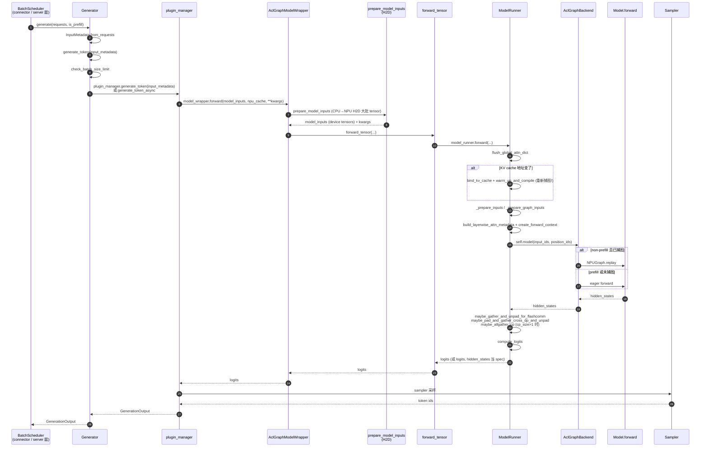
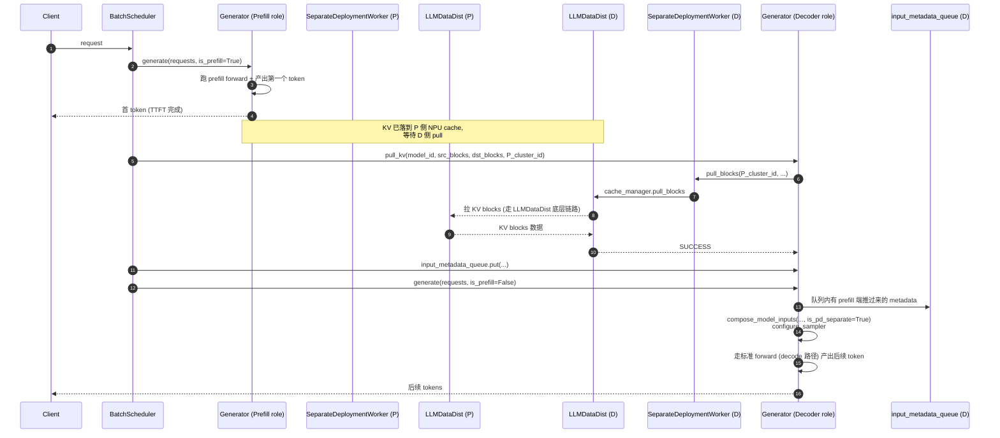

# Request Lifecycle (MindIE-LLM)

## Summary
synthesis: MindIE 的请求生命周期跟 vLLM 不同——它把 scheduler/connector 放在 `Generator` 之上，`Generator.generate_token` 是"**一个 batch 一次 iteration**"的原子调用，由 `BatchScheduler`（在 connector / server 层）驱动。本页梳理：(1) 一个 batch 进入 Generator 后跨过的层、(2) PD 分离场景下 prefill 端→decode 端 的 KV 流转。

## Sources
- 顶层入口：[Generator.generate_token](d:\design\MindIE-LLM\mindie_llm\text_generator\generator.py)（[generator.py:580-716](d:\design\MindIE-LLM\mindie_llm\text_generator\generator.py)）
- 上层 wrapper：[AclGraphModelWrapper.forward](d:\design\MindIE-LLM\mindie_llm\modeling\model_wrapper\aclgraph\aclgraph_model_wrapper.py)（[aclgraph_model_wrapper.py:99-269](d:\design\MindIE-LLM\mindie_llm\modeling\model_wrapper\aclgraph\aclgraph_model_wrapper.py)）
- 模型层：[ModelRunner.forward](d:\design\MindIE-LLM\mindie_llm\runtime\model_runner\model_runner.py)（[model_runner.py:284-321](d:\design\MindIE-LLM\mindie_llm\runtime\model_runner\model_runner.py)）
- PD 分离 worker：[SeparateDeploymentWorker](d:\design\MindIE-LLM\mindie_llm\text_generator\utils\separate_deployment_engine.py)（[separate_deployment_engine.py:396-852](d:\design\MindIE-LLM\mindie_llm\text_generator\utils\separate_deployment_engine.py)）
- 设计文档主链路图：[mindie_generator_aclgraph_pp_design.md:670-681](d:\design\MindIE-LLM\docs\mindie_generator_aclgraph_pp_design.md)（generator_aclgraph 路线版本）

## 标准（非 PD 分离）链路



## 关键链路要点

### 1. Generator 是被动调用，不是主循环
- 与 vLLM 的 `EngineCore.run_busy_loop` 不同，`Generator` 没有自己的事件循环。`generate_token` 是被 `BatchScheduler` 一次次调用的（[generator.py:583-585](d:\design\MindIE-LLM\mindie_llm\text_generator\generator.py) 文档字符串明示）。
- 调度策略（continuous batching、splitfuse、prefix cache 等）在更上层，Generator 只关心"给我一个 InputMetadata，我跑一步"。
- > [!todo] VERIFY: `BatchScheduler` 的具体位置（疑在 connector 层或 server 层，需 ingest 时确认）。

### 2. Plugin manager 决定一步内做什么
- `plugin_manager.generate_token` vs `plugin_manager.generate_token_async`：由 `Generator.async_inference` 决定（[generator.py:637-648](d:\design\MindIE-LLM\mindie_llm\text_generator\generator.py)）。
- **Layerwise disaggregated 与 PD 角色互斥**：若 `layerwise_disaggregated=True` 且 `model_role != STANDARD_TAG` → 直接 `RuntimeError`（[generator.py:638-644](d:\design\MindIE-LLM\mindie_llm\text_generator\generator.py)）。
- 不同 plugin 在 `generate_token` 内部按顺序执行（splitfuse 预处理 → prefix_cache → mtp/la/memory_decoding 解码策略 → structured_output 约束）。

### 3. AclGraphModelWrapper 集中做 H2D
[aclgraph_model_wrapper.py:123-209](d:\design\MindIE-LLM\mindie_llm\modeling\model_wrapper\aclgraph\aclgraph_model_wrapper.py) 的 `prepare_model_inputs` 把约 20+ 个 numpy / list / python 对象统一转成 NPU tensor。这是 **CPU→NPU 的瓶颈点之一**，PD 分离场景下尤其敏感。

### 4. KV cache 地址变化触发重新捕图
[model_runner.py:290-293](d:\design\MindIE-LLM\mindie_llm\runtime\model_runner\model_runner.py)：

```python
if id(next(iter(self.attn_layers.values())).key_cache) != id(kv_cache[0][0]):
    bind_kv_cache(kv_cache, self.attn_layers)
    self.warm_up_and_compile(**kwargs)
```

> synthesis: 这意味着每次 KV pool 切换 / PD link 后第一次 forward 都会触发 capture（重新捕所有 batch size 的图），耗时可能数秒到数十秒。**这是一个常见的 TTFT 长尾来源**。

### 5. AclGraph capture / replay 切换
- prefill：通常 eager（动态 seq_len）
- decode：若 `enable_acl_graph` 且已 capture，走 `NPUGraph.replay`（input 必须填到 capture batch size，由 `_prepare_graph_inputs` 完成 padding）
- 实际选择由 `AclGraphBackend.__call__` 决定（[model_runner.py:309](d:\design\MindIE-LLM\mindie_llm\runtime\model_runner\model_runner.py) 调用，backend 实现待 ingest）

### 6. 多并行轴的 hidden_states 重组
[model_runner.py:309-318](d:\design\MindIE-LLM\mindie_llm\runtime\model_runner\model_runner.py) 之后连串的 `maybe_*` 函数：

| 函数 | 触发条件 | 行号 |
|---|---|---|
| `maybe_gather_and_unpad_for_flashcomm` | flashcomm 通信优化开启 | [model_runner.py:637-649](d:\design\MindIE-LLM\mindie_llm\runtime\model_runner\model_runner.py) |
| `maybe_pad_and_gather_cross_dp_and_unpad` | `not self.distributed_enable`（注释 [model_runner.py:311](d:\design\MindIE-LLM\mindie_llm\runtime\model_runner\model_runner.py) "will be removed after PDmix support dp in and out"） | [model_runner.py:703-718](d:\design\MindIE-LLM\mindie_llm\runtime\model_runner\model_runner.py) |
| `maybe_allgather_cp` | `cp_size > 1` 且非 draft model | [model_runner.py:650-661](d:\design\MindIE-LLM\mindie_llm\runtime\model_runner\model_runner.py) |

## PD 分离链路（synthesis）



锚点：

- 角色判定：[generator.py:470-473](d:\design\MindIE-LLM\mindie_llm\text_generator\generator.py)
- decoder 端的 metadata 排空：[generator.py:619-635](d:\design\MindIE-LLM\mindie_llm\text_generator\generator.py)
- pull_kv 顶层：[generator.py:153-176](d:\design\MindIE-LLM\mindie_llm\text_generator\generator.py)
- pull_blocks 底层：[separate_deployment_engine.py:490-510](d:\design\MindIE-LLM\mindie_llm\text_generator\utils\separate_deployment_engine.py)
- KV 传输引擎构造：[separate_deployment_engine.py:268-309](d:\design\MindIE-LLM\mindie_llm\text_generator\utils\separate_deployment_engine.py)（`LLMDataDistConfig` 设 `kv_trans_timeout`、`link_total_time`、`RdmaServiceLevel`、`RdmaTrafficClass`）
- 异步建链工作线程：`SeparateDeploymentWorker._fill_window_worker` / `_process_window_worker`（[separate_deployment_engine.py:743-819](d:\design\MindIE-LLM\mindie_llm\text_generator\utils\separate_deployment_engine.py)），用 `window` deque + `link_queue` deque + 三把锁

## SeparateDeploymentWorker 内部状态机

| 数据结构 | 用途 | 锚点 |
|---|---|---|
| `link_queue: deque` | 新建链请求 → 待处理队列 | [separate_deployment_engine.py:426](d:\design\MindIE-LLM\mindie_llm\text_generator\utils\separate_deployment_engine.py) |
| `window: deque` | 正在尝试建链 / 等 mem ready 的窗口（默认 `window_size=16`） | [separate_deployment_engine.py:424-425](d:\design\MindIE-LLM\mindie_llm\text_generator\utils\separate_deployment_engine.py) |
| `link_result: LinkResult` | 跟踪每个 link 的状态：waiting / running / success / failed | [separate_deployment_engine.py:432, 36-92](d:\design\MindIE-LLM\mindie_llm\text_generator\utils\separate_deployment_engine.py) |
| `cluster_comm_map` | remote_cluster_id → comm_id 的映射（确认建链成功后填） | [separate_deployment_engine.py:415](d:\design\MindIE-LLM\mindie_llm\text_generator\utils\separate_deployment_engine.py) |
| `cache_desc_map` / `max_block_nums_map` | 各 model_id 的 cache 描述与 block 数 | [separate_deployment_engine.py:433-434](d:\design\MindIE-LLM\mindie_llm\text_generator\utils\separate_deployment_engine.py) |

线程：

- `fill_window_thread`：[separate_deployment_engine.py:448-449, 743-786](d:\design\MindIE-LLM\mindie_llm\text_generator\utils\separate_deployment_engine.py) — 从 link_queue 取 → 调 `_try_create_link` → 推入 window
- `process_window_thread`：[separate_deployment_engine.py:450-453, 787-819](d:\design\MindIE-LLM\mindie_llm\text_generator\utils\separate_deployment_engine.py) — 轮询 window 里每个 link 的 mem 注册状态 → 完成 / 失败后弹出

## Notes / Caveats
> [!todo] VERIFY: `BatchScheduler` 实际位置（不在 mindie_llm 包内 import path 里直接出现，疑在 server / 上层调用方）。
> [!todo] VERIFY: `pull_kv` 与 `generate_token` 的时序关系——是 scheduler 在 decode generate 前显式 pull，还是 generate_token 内部按需 pull？当前代码看 [generator.py:619-635](d:\design\MindIE-LLM\mindie_llm\text_generator\generator.py) 推断是**外部先 push input_metadata 到 queue + pull_kv**，然后调 `generate_token`，需 ingest 时确认。
> [!todo] VERIFY: `is_pd_separate=True` 下 `compose_model_inputs` 的具体差异（在 `tg_infer_context_store.py`，待 ingest）。

## See also
- [entities/Generator.md](../entities/Generator.md)
- [entities/ModelRunner.md](../entities/ModelRunner.md)
- [topics/aclgraph-pp.md](aclgraph-pp.md)
- [comparison/topics/pd-disaggregation.md](../../comparison/topics/pd-disaggregation.md)
