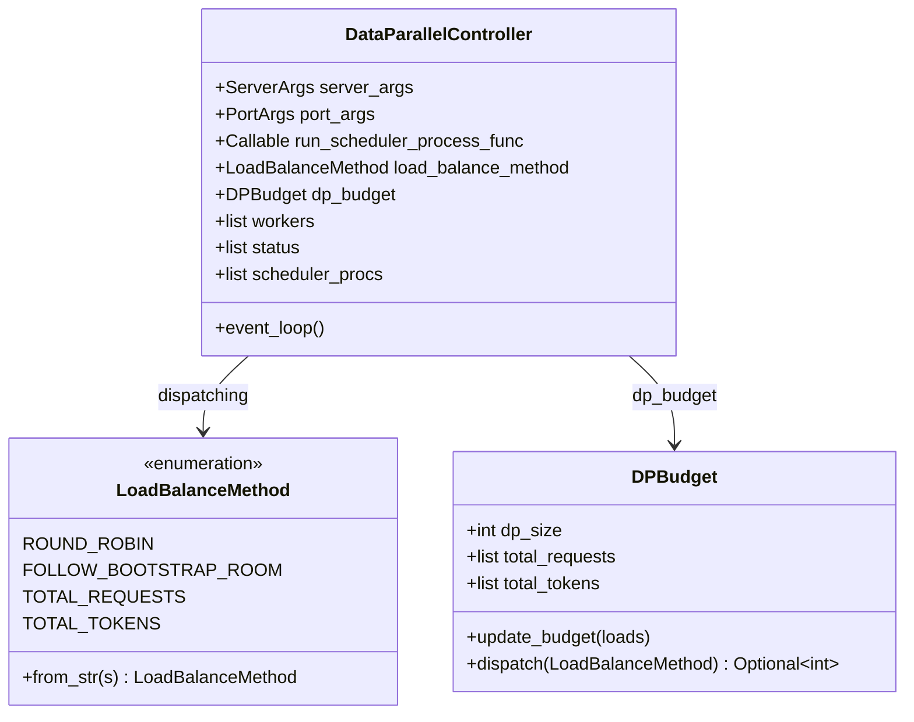

# `DataParallelController`（及 `run_data_parallel_controller_process`）

## Summary

当 `ServerArgs.dp_size > 1`（或 `ep_join_mode == "scale"`）时，`Engine._launch_scheduler_processes` 不再直接为每个 TP rank 起 `run_scheduler_process`，而是 fork 独立子进程运行 `run_data_parallel_controller_process`（[data_parallel_controller.py:812-866](d:\design\sglang\python\sglang\srt\managers\data_parallel_controller.py)），由其拉起多份 scheduler 进程并在 **node_rank == 0** 上经 ZMQ 将已 tokenize 的请求路由到某一 DP worker（`event_loop`）。该设计与 vLLM 在前端进程内用 `DPLBAsyncMPClient` 做多引擎 LB 不同（见下文对照表）。

## Sources

- 主源全文：[d:\design\sglang\python\sglang\srt\managers\data_parallel_controller.py](d:\design\sglang\python\sglang\srt\managers\data_parallel_controller.py)（`LoadBalanceMethod` L79；`DPBudget` L96；`DataParallelController` L132；`run_data_parallel_controller_process` L812；~866 行）
- Engine 启动 DP 控制器子进程：[engine.py:832-947](d:\design\sglang\python\sglang\srt\entrypoints\engine.py)（`_launch_scheduler_processes` L904–L918）
- `--load-balance-method` / `auto` 解析：[server_args.py:1040](d:\design\sglang\python\sglang\srt\server_args.py)、[3875-3891](d:\design\sglang\python\sglang\srt\server_args.py)
- TokenizerManager 侧 ZMQ PUSH 与 `routed_dp_rank` 校验：[tokenizer_manager.py:533-554](d:\design\sglang\python\sglang\srt\managers\tokenizer_manager.py)、[774-782](d:\design\sglang\python\sglang\srt\managers\tokenizer_manager.py)
- 负载快照：[`load_snapshot.py`](d:\design\sglang\python\sglang\srt\managers\load_snapshot.py)（`create_load_snapshot_reader`）
- Ray 变体（继承本类）：[d:\design\sglang\python\sglang\srt\ray\data_parallel_controller.py](d:\design\sglang\python\sglang\srt\ray\data_parallel_controller.py)
- 产品文档（Native DP / SMG）：[d:\design\sglang\docs\docs\advanced_features\dp_dpa_smg_guide.mdx](d:\design\sglang\docs\docs\advanced_features\dp_dpa_smg_guide.mdx)（Native DP §L131–L150）

## 类层次（mermaid classDiagram + 字段表）

| 字段 / 状态 | 含义 | 锚点 |
|-------------|------|------|
| `server_args` / `port_args` | 全局配置与端口族 | [data_parallel_controller.py:142-143](d:\design\sglang\python\sglang\srt\managers\data_parallel_controller.py) |
| `load_balance_method` | 由 `LoadBalanceMethod.from_str` 解析 `server_args.load_balance_method` | [data_parallel_controller.py:144-146, 79-93](d:\design\sglang\python\sglang\srt\managers\data_parallel_controller.py) |
| `dispatching` | 指向具体调度函数（RR / bootstrap room / 按请求数或 token 负载） | [data_parallel_controller.py:157-164](d:\design\sglang\python\sglang\srt\managers\data_parallel_controller.py) |
| `dp_budget` | `DPBudget`，供 `TOTAL_*` 策略 | [data_parallel_controller.py:181, 96-129](d:\design\sglang\python\sglang\srt\managers\data_parallel_controller.py) |
| `load_snapshot_reader` | 读 scheduler 发布的负载快照（替代旧 `WatchLoadUpdateReq` ZMQ 路径） | [data_parallel_controller.py:182-186, 301-316](d:\design\sglang\python\sglang\srt\managers\data_parallel_controller.py) |
| `recv_from_tokenizer` | **仅 `node_rank == 0`**：`zmq.PULL`，连 `port_args.scheduler_input_ipc_name` | [data_parallel_controller.py:151-154](d:\design\sglang\python\sglang\srt\managers\data_parallel_controller.py) |
| `workers` | 每 DP slot 一个 `zmq.PUSH`（可扩至 `max_dp_size`） | [data_parallel_controller.py:194, 393-399](d:\design\sglang\python\sglang\srt\managers\data_parallel_controller.py) |
| `status` / `dp_active` | rank 可用掩码（弹性 EP 可扩） | [data_parallel_controller.py:177-179, 195-197](d:\design\sglang\python\sglang\srt\managers\data_parallel_controller.py) |
| `scheduler_procs` | 所有 fork 出的 `run_scheduler_process_func` 子进程 | [data_parallel_controller.py:193](d:\design\sglang\python\sglang\srt\managers\data_parallel_controller.py) |
| `control_message_step` | DP-attn 下取决于 local control broadcast；否则为 `1` | [data_parallel_controller.py:199-210](d:\design\sglang\python\sglang\srt\managers\data_parallel_controller.py) |

入口函数 `run_data_parallel_controller_process`（[L812-L866](d:\design\sglang\python\sglang\srt\managers\data_parallel_controller.py)）：设置进程标题、trace、构造 `DataParallelController`、向父进程 pipe 回传 `max_total_num_tokens` / `max_req_input_len` / `SCHEDULER_PIDS_ARG`，随后在 **node 0**（且非 ep scale joiner）上进入 `event_loop`（[L855-L857](d:\design\sglang\python\sglang\srt\managers\data_parallel_controller.py)）。

## __init__ 序列

1. 解析负载均衡枚举并保存 `run_scheduler_process_func`（[L141-L147](d:\design\sglang\python\sglang\srt\managers\data_parallel_controller.py)）
2. 创建 `zmq.Context`（[L150](d:\design\sglang\python\sglang\srt\managers\data_parallel_controller.py)）；**仅 leader 节点**创建 `PULL` `scheduler_input_ipc_name`（[L151-L154](d:\design\sglang\python\sglang\srt\managers\data_parallel_controller.py)）
3. 装配 `dispatch_lookup` → `self.dispatching`（[L157-L164](d:\design\sglang\python\sglang\srt\managers\data_parallel_controller.py)）；初始化 `DPBudget` + `load_snapshot_reader`（[L181-L186](d:\design\sglang\python\sglang\srt\managers\data_parallel_controller.py)）
4. 分支：`enable_dp_attention` → `launch_dp_attention_schedulers`；否则 `launch_dp_schedulers`（[L199-L210](d:\design\sglang\python\sglang\srt\managers\data_parallel_controller.py)）。二者最终都进入 `launch_tensor_parallel_group` 以 `mp.Process` 启动 scheduler（[L594-...](d:\design\sglang\python\sglang\srt\managers\data_parallel_controller.py)）
5. `init_dispatcher` 注册 `TypeBasedDispatcher`（[L212, 344-362](d:\design\sglang\python\sglang\srt\managers\data_parallel_controller.py)）
6. `Watchdog.create`（[L214-L219](d:\design\sglang\python\sglang\srt\managers\data_parallel_controller.py)）；可选 CPU 监控（[L221-L222](d:\design\sglang\python\sglang\srt\managers\data_parallel_controller.py)）

## 派发策略 / 路由算法

| 策略 | 行为概要 | 锚点 |
|------|----------|------|
| **外部固定 rank** | 若 `Req.routed_dp_rank` 非空，直接 `sock_send` 到对应 `workers[rank]`，**绕过**其余 LB | [L739-L752](d:\design\sglang\python\sglang\srt\managers\data_parallel_controller.py) |
| `ROUND_ROBIN` | 在 `_active_workers` 且 `status[i]` 为真的 rank 上递增轮询 | [L754-L773](d:\design\sglang\python\sglang\srt\managers\data_parallel_controller.py) |
| `FOLLOW_BOOTSTRAP_ROOM` | `bootstrap_room % len(workers)`；断言 room 非空 | [L775-L784](d:\design\sglang\python\sglang\srt\managers\data_parallel_controller.py) |
| `TOTAL_REQUESTS` | `DPBudget.dispatch` 选当前记录请求数最小的 rank，并本地 `+1` 启发式 | [L114-L129, 786-790](d:\design\sglang\python\sglang\srt\managers\data_parallel_controller.py) |
| `TOTAL_TOKENS` | 按 `(total_tokens, total_requests)` 字典序最小选 rank，并累加 `estimated_tokens` | [L117-L129, 792-799](d:\design\sglang\python\sglang\srt\managers\data_parallel_controller.py) |

`TOTAL_*` 依赖 `refresh_load_budget` → `load_snapshot_reader.read_all()` → `DPBudget.update_budget`（[L301-L316](d:\design\sglang\python\sglang\srt\managers\data_parallel_controller.py)）；`dispatching_with_trace` 在派发前按 20ms 节流刷新（[L318-L320](d:\design\sglang\python\sglang\srt\managers\data_parallel_controller.py)）。

> synthesis: 旧路径经 TM 回推 `WatchLoadUpdateReq` 的闭环已被 **scheduler 写 / DPC 读的 load snapshot** 取代（见 [load_snapshot.py](d:\design\sglang\python\sglang\srt\managers\load_snapshot.py)、scheduler `publish_load_snapshot`）。

**`--load-balance-method auto`（ServerArgs）**：非 PD 场景解析为 `round_robin`；PD prefill 为 `follow_bootstrap_room`；PD decode 为 `round_robin`（[server_args.py:3881-3890](d:\design\sglang\python\sglang\srt\server_args.py)）。

## 主循环 event_loop

`event_loop`（[L801-L809](d:\design\sglang\python\sglang\srt\managers\data_parallel_controller.py)）：内层循环以 `zmq.NOBLOCK` 从 `recv_from_tokenizer` `sock_recv`，交给 `_request_dispatcher`；外层 `while True` 与 soft watchdog `feed`。**仅**在 `run_data_parallel_controller_process` 中当 `server_args.node_rank == 0 and not is_ep_scale_joiner` 时调用（[L855-L857](d:\design\sglang\python\sglang\srt\managers\data_parallel_controller.py)）。

### abort / shutdown（本文件内可见行为）

- **异常退出**：`run_data_parallel_controller_process` 捕获异常后向父进程发 `SIGQUIT`（[L863-L866](d:\design\sglang\python\sglang\srt\managers\data_parallel_controller.py)）。
- **控制类广播**：`BlockReqInput` / `ProfileReq` → `send_to_all_workers`（[L351-L352](d:\design\sglang\python\sglang\srt\managers\data_parallel_controller.py)）；未匹配类型走 fallback `send_control_message`（[L229-L233, 362](d:\design\sglang\python\sglang\srt\managers\data_parallel_controller.py)）。
- **弹性 rank**：`ActiveRanksOutput` → `update_active_ranks`；`ElasticScaleUpdateReq` → `add_elastic_workers`（[L353-L359](d:\design\sglang\python\sglang\srt\managers\data_parallel_controller.py)）。

`synthesis:` 本文件**未**实现与 vLLM `abort_requests` 对称的"按 req id 撤销"专用路径；abort 语义需结合 scheduler 与 IO 类型在更大调用链中核对。

## 与 TokenizerManager / Scheduler 的接口

- **TokenizerManager → DPC（非 Ray、单 tokenizer worker）**：`init_ipc_channels` 创建 `zmq.PUSH` 连接 `port_args.scheduler_input_ipc_name`（[tokenizer_manager.py:538-541](d:\design\sglang\python\sglang\srt\managers\tokenizer_manager.py)），与 `recv_from_tokenizer` 的 `PULL` 配对（[L151-L154](d:\design\sglang\python\sglang\srt\managers\data_parallel_controller.py)）。
- **TM 不直连各 rank**：TM 只 PUSH 到**单一** `scheduler_input` 端点；由 DPC 再分发到各 DP worker。
- **`routed_dp_rank`**：TM 在 `generate_request` 内校验范围（[tokenizer_manager.py:774-782](d:\design\sglang\python\sglang\srt\managers\tokenizer_manager.py)）；最终在 DPC 侧由 `maybe_external_dp_rank_routing` 消费（[L739-L752](d:\design\sglang\python\sglang\srt\managers\data_parallel_controller.py)）。
- **Scheduler**：由 `launch_tensor_parallel_group` 以 `mp.Process(target=run_scheduler_process_func, ...)` 启动（[L594-...](d:\design\sglang\python\sglang\srt\managers\data_parallel_controller.py)）。

## hidden state（§9）

| 类别 | 内容 | 锚点 |
|------|------|------|
| ZMQ | `zmq.Context`、`recv_from_tokenizer`（PULL）、`workers`（PUSH 列表） | [L150-L154, 194, 393-399](d:\design\sglang\python\sglang\srt\managers\data_parallel_controller.py) |
| 多线程 | `launch_dp_schedulers` 每 DP rank 一线程调 `launch_tensor_parallel_group`，随后 sleep 死循环防退出（[L364-L420](d:\design\sglang\python\sglang\srt\managers\data_parallel_controller.py)） |
| 进程 | `scheduler_procs` 列表；DP-attention 多节点时 `_broadcast_worker_ports` ZMQ REP/REQ（[L427-...](d:\design\sglang\python\sglang\srt\managers\data_parallel_controller.py)） |
| 并发控制 | `env_lock` + `maybe_reindex_device_id` 包装子进程 CUDA 可见设备（[L189-L190](d:\design\sglang\python\sglang\srt\managers\data_parallel_controller.py)） |
| 观测 | `DPControllerReqTimeStats` 在 `dispatching_with_trace` 注入（[L322-L330](d:\design\sglang\python\sglang\srt\managers\data_parallel_controller.py)）；`load_snapshot_reader`；可选 `start_cpu_monitor_thread`（[L221-L222](d:\design\sglang\python\sglang\srt\managers\data_parallel_controller.py)） |
| Watchdog | `Watchdog.create` soft 模式（[L214-L219](d:\design\sglang\python\sglang\srt\managers\data_parallel_controller.py)） |

## 与 vLLM `DPLBAsyncMPClient` / MindIE `is_dp_and_server_centralized` 的对照

| 维度 | SGLang `DataParallelController` | vLLM `DPLBAsyncMPClient` | MindIE `is_dp_and_server_centralized` |
|------|-----------------------------------|---------------------------|----------------------------------------|
| 进程位置 | **独立子进程** `run_data_parallel_controller_process`，由 `Engine._launch_scheduler_processes` `mp.Process` 启动（[engine.py:904-918](d:\design\sglang\python\sglang\srt\entrypoints\engine.py)） | **前端进程内** async client 子类（见 [EngineCoreClient.md](../../vllm/entities/EngineCoreClient.md)） | **Generator / spec worker 实例内** 布尔标志 |
| 路由策略 | RR、`follow_bootstrap_room`、按 load snapshot 的 `total_requests` / `total_tokens`、以及 `routed_dp_rank` 钉死 | 加权 `waiting/running` + 可选 `data_parallel_rank` | `synthesis:` 非通用请求路由器 |

## DP attention 与 batch DP 的区分（synthesis）

- **DP-attention（`enable_dp_attention`）**：注意力沿 sequence 的并行切分，配合 [`layers/dp_attention.py`](d:\design\sglang\python\sglang\srt\layers\dp_attention.py)；`launch_dp_attention_schedulers` 广播 worker ports 后进入 `launch_tensor_parallel_group`（[L546-L592](d:\design\sglang\python\sglang\srt\managers\data_parallel_controller.py)）。
- **本类主导的 batch DP**：多份**独立 scheduler 副本** + 入口请求负载均衡；与 [distributed.md §4 DP-batch](../../comparison/topics/distributed.md) 中"`dp_size` + `data_parallel_controller.py` 路由"叙述一致。

## §5 step 3 hidden cross-reference grep 结果

| # | 类别 | 强论断 |
|---|------|--------|
| 1 | 跨语言绑定 | `DataParallelController`：在 [d:\design\sglang\sgl-kernel](d:\design\sglang\sgl-kernel) 全树 grep **0 命中**。 |
| 2 | 协作伙伴跨子系统 | `DataParallelController` / `run_data_parallel_controller_process`：在 `python/sglang` 命中 `data_parallel_controller.py`、`entrypoints/engine.py`、`server_args.py`、`ray/engine.py`、`ray/data_parallel_controller.py` 等。 |
| 3 | 配置 / IPC 共享 | `dp_size` / `dp_rank`：在 `srt` 内广泛用于并行度。ZMQ 端口名：**`scheduler_input_ipc_name`**（TM→DPC 与 per-rank worker 输入）。负载经 `load_snapshot` 共享内存/文件 IPC。 |
| 4 | 测试覆盖 | `test/registered/distributed/test_data_parallelism.py` 等；**无**文件名 `test_data_parallel_controller*.py`。 |
| 5 | doc / config | `DataParallelController`：在 docs `dp_dpa_smg_guide.mdx` Native DP 节命中（约 L133）。`benchmark/`：grep `DataParallelController` **0 命中**。 |

## Notes / Caveats

- **多节点 node_rank != 0**：`recv_from_tokenizer` 与 `workers[i]` 仅在 `node_rank == 0` 创建（[L151-L154, 393-399](d:\design\sglang\python\sglang\srt\managers\data_parallel_controller.py)）；`event_loop` 亦仅在 node 0（非 scale joiner）运行（[L855-L857](d:\design\sglang\python\sglang\srt\managers\data_parallel_controller.py)）。
- **产品文档立场**：官方 `dp_dpa_smg_guide.mdx` 将 Native DP（本控制器）标为局限多、**生产推荐 SMG**（约 L150），与代码存在性不矛盾。

> [!todo] VERIFY: ~~`TOTAL_TOKENS` 在运行时是否始终有有效的负载闭环（与文档"仅 DP attention 场景"表述）。~~
> **RESOLVED 2026-04-19**（机制更新 **2026-08-10**）：负载闭环改为 **load snapshot**——Scheduler `publish_load_snapshot` 写快照；DPC `refresh_load_budget` 经 `load_snapshot_reader.read_all()` 更新 `DPBudget`（[data_parallel_controller.py:301-316](d:\design\sglang\python\sglang\srt\managers\data_parallel_controller.py)）。`TOTAL_*` 在任何启用该方法的 DP 模式下均可拿到运行时负载；文档"仅 DP attention"应理解为**官方推荐**而非硬性约束。旧 `WatchLoadUpdateReq` TM→DPC 回推路径已移除。

## See also

- [comparison/topics/distributed.md](../../comparison/topics/distributed.md)（§4 DP-batch / DP-attention；本页为 SGLang DP-batch 控制器的细化锚点）
- [vllm/entities/EngineCoreClient.md](../../vllm/entities/EngineCoreClient.md)（`DPLBAsyncMPClient`）
- [Scheduler.md](Scheduler.md)
- [TokenizerManager.md](TokenizerManager.md)
- [comparison/topics/engine-architecture.md](../../comparison/topics/engine-architecture.md)
