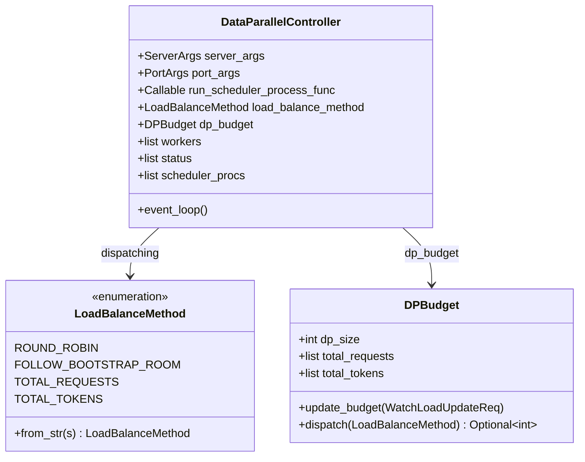
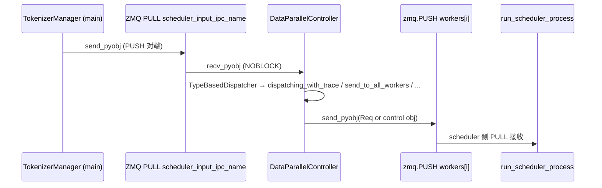

# `DataParallelController`（及 `run_data_parallel_controller_process`）

## Summary

当 `ServerArgs.dp_size > 1` 时，`Engine._launch_scheduler_processes` 不再直接为每个 TP rank 起 `run_scheduler_process`，而是 fork 独立子进程运行 `run_data_parallel_controller_process`（[data_parallel_controller.py:593-635](d:\design\sglang\python\sglang\srt\managers\data_parallel_controller.py)），由其拉起多份 scheduler 进程并在 **node_rank == 0** 上经 ZMQ 将已 tokenize 的请求路由到某一 DP worker（`event_loop`）。该设计与 vLLM 在前端进程内用 `DPLBAsyncMPClient` 做多引擎 LB 不同（见下文对照表）。

## Sources

- 主源全文：[d:\design\sglang\python\sglang\srt\managers\data_parallel_controller.py](d:\design\sglang\python\sglang\srt\managers\data_parallel_controller.py)（约 L1–L636）
- Engine 启动 DP 控制器子进程：[engine.py:521-625](d:\design\sglang\python\sglang\srt\entrypoints\engine.py)（`_launch_scheduler_processes` L588–L602）
- `PortArgs` 中 TM→DPC 的 `scheduler_input` 端口语义：[server_args.py:7019-7048](d:\design\sglang\python\sglang\srt\server_args.py)
- `--load-balance-method` / `auto` 解析：[server_args.py:447, 889-904](d:\design\sglang\python\sglang\srt\server_args.py)
- TokenizerManager 侧 ZMQ PUSH 与 `routed_dp_rank` 校验：[tokenizer_manager.py:344-352, 527-534](d:\design\sglang\python\sglang\srt\managers\tokenizer_manager.py)
- Ray 变体（继承本类）：[d:\design\sglang\python\sglang\srt\ray\data_parallel_controller.py](d:\design\sglang\python\sglang\srt\ray\data_parallel_controller.py)
- 产品文档（Native DP / SMG）：[d:\design\sglang\docs\advanced_features\dp_dpa_smg_guide.md](d:\design\sglang\docs\advanced_features\dp_dpa_smg_guide.md)（约 L122–L142）

## 类层次（mermaid classDiagram + 字段表）

| 字段 / 状态 | 含义 | 锚点 |
|-------------|------|------|
| `server_args` / `port_args` | 全局配置与端口族 | [data_parallel_controller.py:126-127](d:\design\sglang\python\sglang\srt\managers\data_parallel_controller.py) |
| `load_balance_method` | 由 `LoadBalanceMethod.from_str` 解析 `server_args.load_balance_method` | [data_parallel_controller.py:128-130, 70-84](d:\design\sglang\python\sglang\srt\managers\data_parallel_controller.py) |
| `dispatching` | 指向具体调度函数（RR / bootstrap room / 按请求数或 token 负载） | [data_parallel_controller.py:145-151](d:\design\sglang\python\sglang\srt\managers\data_parallel_controller.py) |
| `dp_budget` | `DPBudget`，供 `TOTAL_*` 策略 | [data_parallel_controller.py:154, 87-113](d:\design\sglang\python\sglang\srt\managers\data_parallel_controller.py) |
| `recv_from_tokenizer` | **仅 `node_rank == 0`**：`zmq.PULL`，绑定 `port_args.scheduler_input_ipc_name` | [data_parallel_controller.py:138-141](d:\design\sglang\python\sglang\srt\managers\data_parallel_controller.py) |
| `workers` | 每 DP rank 一个 `zmq.PUSH`，连到对应 scheduler 的输入 IPC | [data_parallel_controller.py:161-163, 257-263](d:\design\sglang\python\sglang\srt\managers\data_parallel_controller.py) |
| `status` | 与 `ActiveRanksOutput` 同步的 rank 可用掩码 | [data_parallel_controller.py:162, 196-197](d:\design\sglang\python\sglang\srt\managers\data_parallel_controller.py) |
| `scheduler_procs` | 所有 fork 出的 `run_scheduler_process_func` 子进程 | [data_parallel_controller.py:160, 495-515](d:\design\sglang\python\sglang\srt\managers\data_parallel_controller.py) |
| `control_message_step` | `enable_dp_attention` 时为 `tp_size`，否则为 `1`（控制消息发往每个 TP 组首个 worker） | [data_parallel_controller.py:164-169, 188-191](d:\design\sglang\python\sglang\srt\managers\data_parallel_controller.py) |

入口函数 `run_data_parallel_controller_process`（[L593-L635](d:\design\sglang\python\sglang\srt\managers\data_parallel_controller.py)）：设置进程标题、trace、构造 `DataParallelController`、向父进程 pipe 回传 `max_total_num_tokens` / `max_req_input_len`，随后在 **node 0** 上进入 `event_loop`（[L614-L626](d:\design\sglang\python\sglang\srt\managers\data_parallel_controller.py)）。

## __init__ 序列

1. 解析负载均衡枚举并保存 `run_scheduler_process_func`（默认即 `run_scheduler_process`）（[L125-L131](d:\design\sglang\python\sglang\srt\managers\data_parallel_controller.py)）
2. 创建 `zmq.Context`（[L137](d:\design\sglang\python\sglang\srt\managers\data_parallel_controller.py)）；**仅 leader 节点**绑定 `PULL` `scheduler_input_ipc_name`（[L138-L141](d:\design\sglang\python\sglang\srt\managers\data_parallel_controller.py)）
3. 装配 `dispatch_lookup` → `self.dispatching`（[L143-L151](d:\design\sglang\python\sglang\srt\managers\data_parallel_controller.py)）；初始化 `DPBudget`（[L153-L154](d:\design\sglang\python\sglang\srt\managers\data_parallel_controller.py)）
4. 分支：`enable_dp_attention` → `launch_dp_attention_schedulers`；否则 `launch_dp_schedulers`（[L164-L169](d:\design\sglang\python\sglang\srt\managers\data_parallel_controller.py)）。二者最终都进入 `launch_tensor_parallel_group` 以 `mp.Process` 启动 scheduler（[L410-L524](d:\design\sglang\python\sglang\srt\managers\data_parallel_controller.py)）
5. `init_dispatcher` 注册 `TypeBasedDispatcher`（[L214-L227](d:\design\sglang\python\sglang\srt\managers\data_parallel_controller.py)）
6. `Watchdog.create`（[L173-L178](d:\design\sglang\python\sglang\srt\managers\data_parallel_controller.py)）；可选 CPU 监控（[L180-L181](d:\design\sglang\python\sglang\srt\managers\data_parallel_controller.py)）

## 派发策略 / 路由算法

| 策略 | 行为概要 | 锚点 |
|------|----------|------|
| **外部固定 rank** | 若 `Req.routed_dp_rank` 非空，直接 `send_pyobj` 到对应 `workers[rank]`，**绕过**其余 LB | [L526-L531](d:\design\sglang\python\sglang\srt\managers\data_parallel_controller.py) |
| `ROUND_ROBIN` | 在 `status[i]` 为真的 rank 上递增轮询 | [L533-L547](d:\design\sglang\python\sglang\srt\managers\data_parallel_controller.py) |
| `FOLLOW_BOOTSTRAP_ROOM` | `bootstrap_room % len(workers)`；FAKE 后端且 `bootstrap_room is None` 时用 RR 先填 room（[L553-L561](d:\design\sglang\python\sglang\srt\managers\data_parallel_controller.py)）；否则断言 room 非空（[L563-L566](d:\design\sglang\python\sglang\srt\managers\data_parallel_controller.py)） |
| `TOTAL_REQUESTS` | `DPBudget.dispatch` 选当前记录请求数最小的 rank，并本地 `+1` 启发式 | [L99-L113, 570-574](d:\design\sglang\python\sglang\srt\managers\data_parallel_controller.py) |
| `TOTAL_TOKENS` | 按 `(total_tokens, total_requests)` 字典序最小选 rank，并 `+1` 请求计数 | [L102-L113, 576-580](d:\design\sglang\python\sglang\srt\managers\data_parallel_controller.py) |

`TOTAL_*` 依赖 `WatchLoadUpdateReq` 更新 `DPBudget`（`handle_load_update_req` [L193-L194](d:\design\sglang\python\sglang\srt\managers\data_parallel_controller.py)）。

**`--load-balance-method auto`（ServerArgs）**：非 PD 场景解析为 `round_robin`；PD prefill 为 `follow_bootstrap_room`；PD decode 为 `round_robin`（[server_args.py:895-904](d:\design\sglang\python\sglang\srt\server_args.py)）。

## 主循环 event_loop

`event_loop`（[L582-L590](d:\design\sglang\python\sglang\srt\managers\data_parallel_controller.py)）：内层循环以 `zmq.NOBLOCK` 从 `recv_from_tokenizer` `recv_pyobj`，交给 `_request_dispatcher`；外层 `while True` 与 soft watchdog `feed`（[L583-L586](d:\design\sglang\python\sglang\srt\managers\data_parallel_controller.py)）。**仅**在 `run_data_parallel_controller_process` 中当 `server_args.node_rank == 0` 时调用（[L625-L626](d:\design\sglang\python\sglang\srt\managers\data_parallel_controller.py)）。

### abort / shutdown（本文件内可见行为）

- **异常退出**：`run_data_parallel_controller_process` 捕获异常后向父进程发 `SIGQUIT`（[L632-L635](d:\design\sglang\python\sglang\srt\managers\data_parallel_controller.py)）。
- **控制类广播**：`BlockReqInput` / `ProfileReq` → `send_to_all_workers`（[L221-L222](d:\design\sglang\python\sglang\srt\managers\data_parallel_controller.py)）；未匹配类型走 fallback `send_control_message`（[L188-L191, 227](d:\design\sglang\python\sglang\srt\managers\data_parallel_controller.py)）。
- **弹性 rank**：`ActiveRanksOutput` 更新 `status`（[L224-L225](d:\design\sglang\python\sglang\srt\managers\data_parallel_controller.py)）。

`synthesis:` 本文件**未**实现与 vLLM `abort_requests` 对称的"按 req id 撤销"专用路径；abort 语义需结合 scheduler 与 IO 类型在更大调用链中核对。

## 与 TokenizerManager / Scheduler 的接口

- **TokenizerManager → DPC（非 Ray、单 tokenizer worker）**：`init_ipc_channels` 创建 `zmq.PUSH` 连接 `port_args.scheduler_input_ipc_name`（[tokenizer_manager.py:344-352](d:\design\sglang\python\sglang\srt\managers\tokenizer_manager.py)）。在 DP-attention TCP 端口布局下，**无 `dp_rank` 的** PortArgs 将 `scheduler_input_port` 标为「TokenizerManager → DataParallelController」（[server_args.py:7019-7021](d:\design\sglang\python\sglang\srt\server_args.py)），与 `recv_from_tokenizer` 的 `PULL` 配对（[L138-L141](d:\design\sglang\python\sglang\srt\managers\data_parallel_controller.py)）。
- **TM 不直连各 rank**：TM 只 PUSH 到**单一** `scheduler_input` 端点；由 DPC 再分发到各 DP worker。
- **`routed_dp_rank`**：TM 在 `dp_size > 1` 时校验 `obj.routed_dp_rank` 范围（[tokenizer_manager.py:527-534](d:\design\sglang\python\sglang\srt\managers\tokenizer_manager.py)）；最终在 DPC 侧由 `maybe_external_dp_rank_routing` 消费（[L526-L531](d:\design\sglang\python\sglang\srt\managers\data_parallel_controller.py)）。
- **Scheduler**：由 `launch_tensor_parallel_group` 以 `mp.Process(target=run_scheduler_process_func, ...)` 启动（[L496-L514](d:\design\sglang\python\sglang\srt\managers\data_parallel_controller.py)），pipe 同步返回 `max_total_num_tokens` 等（[L518-L524](d:\design\sglang\python\sglang\srt\managers\data_parallel_controller.py)）。

## hidden state（§9）

| 类别 | 内容 | 锚点 |
|------|------|------|
| ZMQ | `zmq.Context`、`recv_from_tokenizer`（PULL）、`workers`（PUSH 列表） | [L137-L141, 161-163, 257-263](d:\design\sglang\python\sglang\srt\managers\data_parallel_controller.py) |
| 多线程 | `launch_dp_schedulers` 每 DP rank 一线程调 `launch_tensor_parallel_group`，随后 **sleep 死循环**防止线程退出（[L247-L289](d:\design\sglang\python\sglang\srt\managers\data_parallel_controller.py)） |
| 进程 | `scheduler_procs` 列表；DP-attention 多节点时 `_broadcast_worker_ports` ZMQ REP/REQ（[L291-L377](d:\design\sglang\python\sglang\srt\managers\data_parallel_controller.py)） |
| 并发控制 | `env_lock` + `maybe_reindex_device_id` 包装子进程 CUDA 可见设备（[L156-L157, 495-514](d:\design\sglang\python\sglang\srt\managers\data_parallel_controller.py)） |
| 观测 | `DPControllerReqTimeStats` 在 `dispatching_with_trace` 注入（[L199-L204](d:\design\sglang\python\sglang\srt\managers\data_parallel_controller.py)）；可选 `start_cpu_monitor_thread`（[L180-L181](d:\design\sglang\python\sglang\srt\managers\data_parallel_controller.py)） |
| Watchdog | `Watchdog.create` soft 模式（[L173-L178](d:\design\sglang\python\sglang\srt\managers\data_parallel_controller.py)） |

## 与 vLLM `DPLBAsyncMPClient` / MindIE `is_dp_and_server_centralized` 的对照

| 维度 | SGLang `DataParallelController` | vLLM `DPLBAsyncMPClient` | MindIE `is_dp_and_server_centralized` |
|------|-----------------------------------|---------------------------|----------------------------------------|
| 进程位置 | **独立子进程** `run_data_parallel_controller_process`，由 `Engine._launch_scheduler_processes` `mp.Process` 启动（[engine.py:592-601](d:\design\sglang\python\sglang\srt\entrypoints\engine.py)） | **前端进程内** async client 子类，与 `EngineCore` 多进程通信（见 [EngineCoreClient.md](../../vllm/entities/EngineCoreClient.md) Summary / `DPLBAsyncMPClient` 节） | **Generator / spec worker 实例内** 布尔标志：`has_dp() and not distributed_enable`（[spec_worker.py:50-52](d:\design\MindIE-LLM\mindie_llm\runtime\model_runner\spec_worker.py)） |
| 路由策略 | RR、`follow_bootstrap_room`、按 `WatchLoadUpdateReq` 的 `total_requests` / `total_tokens`、以及 `routed_dp_rank` 钉死 | 加权 `waiting/running` + 可选 `data_parallel_rank` / late interaction（见 [EngineCoreClient.md](../../vllm/entities/EngineCoreClient.md) `DPLBAsyncMPClient` 负载均衡节） | `synthesis:` 非通用请求路由器；用于 MTP logits/hidden 是否集中重算等 |

## DP attention 与 batch DP 的区分（synthesis）

- **DP-attention（`enable_dp_attention`）**：注意力沿 sequence 的并行切分，配合 [`layers/dp_attention.py`](d:\design\sglang\python\sglang\srt\layers\dp_attention.py) 中 `compute_dp_attention_world_info` 等；`launch_tensor_parallel_group` 在启用时为每进程计算 `dp_rank` 与端口（[L447-L462](d:\design\sglang\python\sglang\srt\managers\data_parallel_controller.py)），且 `attn_dp_size` 参与层次注释（[L471-L480](d:\design\sglang\python\sglang\srt\managers\data_parallel_controller.py)）。
- **本类主导的 batch DP**：多份**独立 scheduler 副本** + 入口请求负载均衡；与 [distributed.md §4 DP-batch](../../comparison/topics/distributed.md) 中"`dp_size` + `data_parallel_controller.py` 路由"叙述一致。

## §5 step 3 hidden cross-reference grep 结果

| # | 类别 | 强论断 |
|---|------|--------|
| 1 | 跨语言绑定 | `DataParallelController`：在 [d:\design\sglang\sgl-kernel](d:\design\sglang\sgl-kernel) 全 C++/CUDA/Python 绑定树 grep **0 命中**。 |
| 2 | 协作伙伴跨子系统 | `DataParallelController` / `run_data_parallel_controller_process`：在 [d:\design\sglang\python\sglang](d:\design\sglang\python\sglang) 全树 **18 行命中 / 5 文件**（`data_parallel_controller.py`、`entrypoints/engine.py`、`server_args.py`、`ray/engine.py`、`ray/data_parallel_controller.py`）。`sgl-router/`：在 [d:\design](d:\design) 工作区 **无该目录**，未执行 grep（与 `dp_dpa_smg_guide.md` 所述生产路由为独立 Rust **SMG** 相对—— L144-L154）。 |
| 3 | 配置 / IPC 共享 | `dp_size` / `dp_rank`：在 `srt` 内广泛用于并行度与张量形状。`attn_dp`：在 `srt` 内多文件命中。ZMQ 端口名：**`scheduler_input_ipc_name`**（TM→DPC 与 per-rank worker 输入）。 |
| 4 | 测试覆盖 | `test/registered/distributed/test_data_parallelism.py`（`--dp 2` 集成）；`test_dp_attention.py`、`test_dp_attention_large.py`；`test_dp_utils.py`。**无**文件名 `test_data_parallel_controller*.py` 的命中（Glob 0）。 |
| 5 | doc / config | `DataParallelController`：在 [d:\design\sglang\docs](d:\design\sglang\docs) 全树 **1 命中**（`dp_dpa_smg_guide.md` L124）。`benchmark/`：grep `DataParallelController` **0 命中**；`--dp-size` 示例见 `reasoning_benchmark/README.md` 等。 |

## Notes / Caveats

- **多节点 node_rank != 0**：`recv_from_tokenizer` 与 `workers[i]` 仅在 `node_rank == 0` 创建（[L138-L141, 257-263](d:\design\sglang\python\sglang\srt\managers\data_parallel_controller.py)）；`event_loop` 亦仅在 node 0 运行（[L625-L626](d:\design\sglang\python\sglang\srt\managers\data_parallel_controller.py)）。follower 节点上的进程主要承担本地 scheduler 拉起与 join。
- **产品文档立场**：官方 `dp_dpa_smg_guide.md` 将 Native DP（本控制器）标为局限多、**生产推荐 SMG**（L134-L142），与代码存在性不矛盾。

> [!todo] VERIFY: ~~`TOTAL_TOKENS` 在运行时是否始终有有效的 `WatchLoadUpdateReq` 闭环（与文档"仅 DP attention 场景"表述的严格对齐）。~~
> **RESOLVED 2026-04-19**: `WatchLoadUpdateReq` 闭环在 `dp_size > 1` 时**无条件存在**，**不**限于 DP attention：(1) Scheduler 每次 `stream_output_*` 都执行 `load = self.get_load()`（[scheduler_output_processor_mixin.py:967](d:\design\sglang\python\sglang\srt\managers\scheduler_output_processor_mixin.py)）并 `load=load` 装入 `BatchStrOutput` / `BatchTokenIDOutput`（[scheduler_output_processor_mixin.py:1212](d:\design\sglang\python\sglang\srt\managers\scheduler_output_processor_mixin.py)）；`get_load` 始终返回 `GetLoadReqOutput(dp_rank, num_reqs, num_tokens, ...)`（[observability/scheduler_metrics_mixin.py:791-815](d:\design\sglang\python\sglang\srt\observability\scheduler_metrics_mixin.py)）。(2) TM 在 `dp_size > 1` 且 `recv_obj.load is not None` 时即 `WatchLoadUpdateReq(loads=[recv_obj.load])` PUSH 回 `scheduler_input_ipc_name`（[tokenizer_manager.py:1838-1844](d:\design\sglang\python\sglang\srt\managers\tokenizer_manager.py)）。(3) DPC 端 `init_dispatcher` 注册 `WatchLoadUpdateReq → handle_load_update_req → dp_budget.update_budget`（[data_parallel_controller.py:223, 193-194, 93-97](d:\design\sglang\python\sglang\srt\managers\data_parallel_controller.py)）。结论：`TOTAL_TOKENS` / `TOTAL_REQUESTS` 在任何 DP 模式（含非 DP attention 的 batch DP）下均拿得到运行时负载更新；`dp_dpa_smg_guide.md` "仅 DP attention" 表述应理解为**官方推荐**而非硬性约束。

## See also

- [comparison/topics/distributed.md](../../comparison/topics/distributed.md)（§4 DP-batch / DP-attention；本页为 SGLang DP-batch 控制器的细化锚点）
- [vllm/entities/EngineCoreClient.md](../../vllm/entities/EngineCoreClient.md)（`DPLBAsyncMPClient`）
- [Scheduler.md](Scheduler.md)
- [TokenizerManager.md](TokenizerManager.md)
- [comparison/topics/engine-architecture.md](../../comparison/topics/engine-architecture.md)
