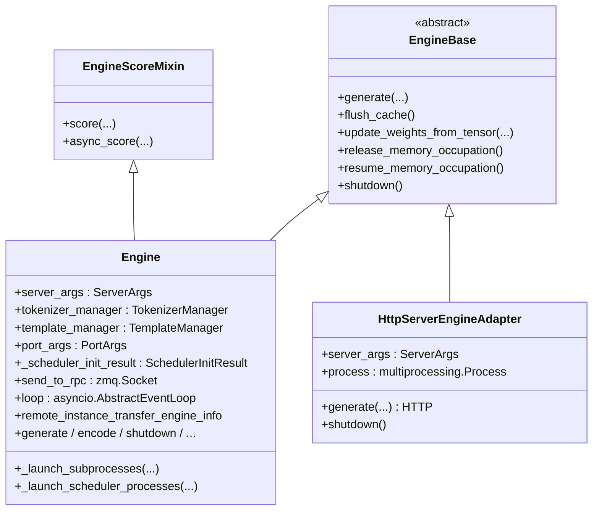
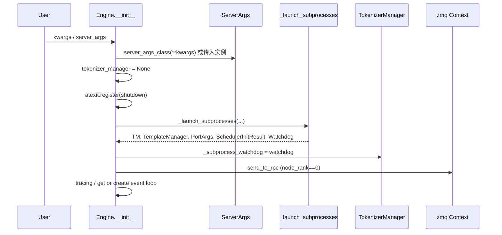

# `Engine` (and `HttpServerEngineAdapter`)

## Summary

[`Engine`](d:\design\sglang\python\sglang\srt\entrypoints\engine.py) 是 SRT 的 **Python 离线入口**：`__init__` 内通过 `_launch_subprocesses` 拉起 **scheduler 子进程（及 DP 时的 [`DataParallelController`](d:\design\sglang\python\sglang\srt\managers\data_parallel_controller.py)）**、**detokenizer 子进程**，并在主进程构造 [`TokenizerManager`](d:\design\sglang\python\sglang\srt\managers\tokenizer_manager.py) / `TemplateManager`；运行时推理路径经 ZMQ 在 TM ↔ Scheduler ↔ Detokenizer 三进程间流转（细节见 [`TokenizerManager.md`](TokenizerManager.md) / [`manager-pipeline.md`](../topics/manager-pipeline.md)）。
[`HttpServerEngineAdapter`](d:\design\sglang\python\sglang\srt\entrypoints\http_server_engine.py) **不是** `Engine` 的子类：它继承 [`EngineBase`](d:\design\sglang\python\sglang\srt\entrypoints\EngineBase.py)，在**独立子进程**里 `launch_server`，主进程通过 HTTP 调 `generate` 等端点（见下文）。

## Sources

- [`engine.py`](d:\design\sglang\python\sglang\srt\entrypoints\engine.py)（`Engine`、`SchedulerInitResult`、`init_tokenizer_manager`、启动辅助函数）
- [`http_server_engine.py`](d:\design\sglang\python\sglang\srt\entrypoints\http_server_engine.py)
- [`EngineBase.py`](d:\design\sglang\python\sglang\srt\entrypoints\EngineBase.py)
- [`engine_score_mixin.py`](d:\design\sglang\python\sglang\srt\entrypoints\engine_score_mixin.py)

## 类层次（mermaid classDiagram）

### 可覆盖类属性（fork 定制）

`server_args_class`、`init_tokenizer_manager_func`、`run_scheduler_process_func`、`run_detokenizer_process_func` 允许子类替换 `ServerArgs` 与各进程入口（例如 `RayEngine` 覆盖 scheduler 启动）— [engine.py:157-162](d:\design\sglang\python\sglang\srt\entrypoints\engine.py)。

### 字段表

| 字段 | 说明 | 锚点 |
|------|------|------|
| `server_args` | 解析自 kwargs 或外部传入 | [170-180](d:\design\sglang\python\sglang\srt\entrypoints\engine.py) |
| `tokenizer_manager` | 主进程 TM；多 tokenizer 时为 `MultiTokenizerRouter` | [185-207](d:\design\sglang\python\sglang\srt\entrypoints\engine.py) |
| `template_manager` | 多 worker 时可为 `None` | [204-205](d:\design\sglang\python\sglang\srt\entrypoints\engine.py) |
| `port_args` | IPC 端口等 | [208](d:\design\sglang\python\sglang\srt\entrypoints\engine.py) |
| `_scheduler_init_result` | `SchedulerInitResult`：scheduler 信息、ready/wait 回调 | [205](d:\design\sglang\python\sglang\srt\entrypoints\engine.py) |
| `tokenizer_manager._subprocess_watchdog` | 由 launcher 注入 | [206-207](d:\design\sglang\python\sglang\srt\entrypoints\engine.py) |
| `remote_instance_transfer_engine_info` | bootstrap server 启用时从结果取 | [209-213](d:\design\sglang\python\sglang\srt\entrypoints\engine.py) |
| `send_to_rpc` | `node_rank==0` 时 DEALER 连 RPC | [215-222](d:\design\sglang\python\sglang\srt\entrypoints\engine.py) |
| `loop` | 运行 async 的 event loop | [234-238](d:\design\sglang\python\sglang\srt\entrypoints\engine.py) |

## Engine.__init__ 装配序列

步骤与锚点：

1. 解析 `server_args`（kwargs 或显式 `server_args`），默认 `log_level="error"` — [170-180](d:\design\sglang\python\sglang\srt\entrypoints\engine.py)
2. `self.tokenizer_manager = None` 防止 atexit 路径异常 — [183-185](d:\design\sglang\python\sglang\srt\entrypoints\engine.py)
3. `atexit.register(self.shutdown)` — [187-188](d:\design\sglang\python\sglang\srt\entrypoints\engine.py)
4. `_launch_subprocesses` — [191-202](d:\design\sglang\python\sglang\srt\entrypoints\engine.py)
5. 赋值并可选注入 `remote_instance_transfer_engine_info` — [203-213](d:\design\sglang\python\sglang\srt\entrypoints\engine.py)
6. ZMQ RPC socket（`node_rank == 0`）— [215-222](d:\design\sglang\python\sglang\srt\entrypoints\engine.py)
7. `enable_trace` 时 `process_tracing_init` — [224-232](d:\design\sglang\python\sglang\srt\entrypoints\engine.py)
8. `asyncio` 事件循环 — [234-238](d:\design\sglang\python\sglang\srt\entrypoints\engine.py)

## _launch_subprocesses 完整流程

入口：`_launch_subprocesses` [627-762](d:\design\sglang\python\sglang\srt\entrypoints\engine.py)。

| 阶段 | 行为 | 锚点 |
|------|------|------|
| 全局环境 | `configure_logger`、`_set_envs_and_config`、`check_server_args`、`_set_gc` | [647-651](d:\design\sglang\python\sglang\srt\entrypoints\engine.py) |
| 端口 | `PortArgs.init_new(server_args)`（若未传入 `port_args`） | [653-656](d:\design\sglang\python\sglang\srt\entrypoints\engine.py) |
| Bootstrap | 条件满足时 `EngineInfoBootstrapServer`，端口占用检查 | [658-673](d:\design\sglang\python\sglang\srt\entrypoints\engine.py) |
| Scheduler | `_launch_scheduler_processes`，结果写入 `scheduler_init_result.engine_info_bootstrap_server` | [675-681](d:\design\sglang\python\sglang\srt\entrypoints\engine.py) |
| Elastic EP backup | `run_expert_backup_manager` 条件调用 | [683-687](d:\design\sglang\python\sglang\srt\entrypoints\engine.py) |
| 多节点 `node_rank >= 1` | 仅 scheduler：`wait_for_ready`，可选阻塞或 dummy health；可提前 `return (None, None, port_args, ...)` | [689-715](d:\design\sglang\python\sglang\srt\entrypoints\engine.py) |
| Detokenizer | `mp.Process(run_detokenizer_process_func, ...)` | [717-725](d:\design\sglang\python\sglang\srt\entrypoints\engine.py) |
| Tokenizer | `init_tokenizer_manager_func` 或 `MultiTokenizerRouter` | [727-735](d:\design\sglang\python\sglang\srt\entrypoints\engine.py) |
| Ready | `scheduler_init_result.wait_for_ready()` | [737-738](d:\design\sglang\python\sglang\srt\entrypoints\engine.py) |
| 回传 max_len | `tokenizer_manager.max_req_input_len` 来自 scheduler info | [740-743](d:\design\sglang\python\sglang\srt\entrypoints\engine.py) |
| Watchdog | `SubprocessWatchdog` 监控 scheduler + detokenizer | [745-754](d:\design\sglang\python\sglang\srt\entrypoints\engine.py) |

`SchedulerInitResult` 数据结构 — [112-119](d:\design\sglang\python\sglang\srt\entrypoints\engine.py)。

## _launch_scheduler_processes

入口：`_launch_scheduler_processes` [521-625](d:\design\sglang\python\sglang\srt\entrypoints\engine.py)。

- **DP 关闭**（`dp_size == 1`）：对当前节点 `_calculate_rank_ranges` 得到的每个 `(pp_rank, tp_rank)` 起一个 `mp.Process(target=run_scheduler_process_func, ...)`，`mp.Pipe(duplex=False)` 的 reader 侧收集 ready — [537-587](d:\design\sglang\python\sglang\srt\entrypoints\engine.py)。子进程包装：`TorchMemorySaverAdapter.configure_subprocess`、`numa_utils.configure_subprocess` — [581-584](d:\design\sglang\python\sglang\srt\entrypoints\engine.py)。
- **DP 开启**：单进程 `run_data_parallel_controller_process`，kwargs 含 `run_scheduler_process_func` — [588-602](d:\design\sglang\python\sglang\srt\entrypoints\engine.py)。详见 [`DataParallelController.md`](DataParallelController.md)。
- **Ready 等待**：`wait_for_ready` 调用 `_wait_for_scheduler_ready` — [606-608](d:\design\sglang\python\sglang\srt\entrypoints\engine.py)；`_wait_for_scheduler_ready` 实现见 [1201-1230](d:\design\sglang\python\sglang\srt\entrypoints\engine.py)。

## 用户面 API（generate / encode / …）

> `pause_generation` / `resume_generation`：**本文件未定义**；若在 HTTP/Tokenizer 层存在，不在此表重复。

| API | 行号 | async？ | 作用 |
|-----|------|---------|------|
| `generate` | [271-359](d:\design\sglang\python\sglang\srt\entrypoints\engine.py) | 同步包装（内部 `run_until_complete` / 流式 generator） | 构造 `GenerateReqInput` → `tokenizer_manager.generate_request` |
| `async_generate` | [361-439](d:\design\sglang\python\sglang\srt\entrypoints\engine.py) | 是 | 同上，async 原生 |
| `encode` | [441-472](d:\design\sglang\python\sglang\srt\entrypoints\engine.py) | 否 | `EmbeddingReqInput` |
| `async_encode` | [474-506](d:\design\sglang\python\sglang\srt\entrypoints\engine.py) | 是 | 同上 |
| `rerank` | [508-519](d:\design\sglang\python\sglang\srt\entrypoints\engine.py) | 否 | cross-encoder 请求 |
| `shutdown` | [764-771](d:\design\sglang\python\sglang\srt\entrypoints\engine.py) | 否 | 停 watchdog + `kill_process_tree` |
| `flush_cache` | [780-781](d:\design\sglang\python\sglang\srt\entrypoints\engine.py) | 经 loop 同步 | 委托 TM |
| `open_session` / `close_session` | [783-820](d:\design\sglang\python\sglang\srt\entrypoints\engine.py) | `close_session` 同步 await | 会话 API |
| `start_profile` / `stop_profile` | [822-826](d:\design\sglang\python\sglang\srt\entrypoints\engine.py) | 否 | Profiling |
| `start_expert_distribution_record` / `stop_*` / `dump_*` | [828-841](d:\design\sglang\python\sglang\srt\entrypoints\engine.py) | 否 | Expert 统计 |
| `get_server_info` | [843-852](d:\design\sglang\python\sglang\srt\entrypoints\engine.py) | 否 | 合并 server_args、scheduler info、internal state |
| `init_weights_update_group` / `destroy_weights_update_group` | [854-886](d:\design\sglang\python\sglang\srt\entrypoints\engine.py) | 否 | 分布式更新组 |
| `update_weights_from_distributed` | [888-908](d:\design\sglang\python\sglang\srt\entrypoints\engine.py) | 否 | |
| `update_weights_from_tensor` | [910-932](d:\design\sglang\python\sglang\srt\entrypoints\engine.py) | 否 | 含 `flattened_bucket` 分支 |
| `update_weights_from_disk` | [934-952](d:\design\sglang\python\sglang\srt\entrypoints\engine.py) | 否 | |
| `update_weights_from_ipc` | [954-966](d:\design\sglang\python\sglang\srt\entrypoints\engine.py) | 否 | checkpoint-engine 集成 |
| `get_weights_by_name` | [968-973](d:\design\sglang\python\sglang\srt\entrypoints\engine.py) | 否 | |
| `load_lora_adapter_from_tensors` / `load_lora_adapter` / `unload_lora_adapter` | [975-1018](d:\design\sglang\python\sglang\srt\entrypoints\engine.py) | 同步 | LoRA |
| `async_load_lora_adapter` / `async_unload_lora_adapter` | [1020-1046](d:\design\sglang\python\sglang\srt\entrypoints\engine.py) | 是 | LoRA |
| `release_memory_occupation` / `resume_memory_occupation` | [1048-1058](d:\design\sglang\python\sglang\srt\entrypoints\engine.py) | 否 | GPU 内存占用的释放/恢复（非"resume generation"语义） |
| `freeze_gc` | [1060-1073](d:\design\sglang\python\sglang\srt\entrypoints\engine.py) | 否 | 降低 GC 停顿 |
| `collective_rpc` / `save_remote_model` / `save_sharded_model` | [1079-1090](d:\design\sglang\python\sglang\srt\entrypoints\engine.py) | `collective_rpc` 同步阻塞 recv | 经 `send_to_rpc` ZMQ |
| `score` / `async_score`（mixin） | [29-111](d:\design\sglang\python\sglang\srt\entrypoints\engine_score_mixin.py) | `async_score` 是 | 委托 `tokenizer_manager.score_request` |
| `__enter__` / `__exit__` | [773-778](d:\design\sglang\python\sglang\srt\entrypoints\engine.py) | 否 | 上下文管理器 → `shutdown` |

## hidden state（§9）

| 类别 | 内容 | 锚点 |
|------|------|------|
| 主进程对象 | `tokenizer_manager`、`template_manager`、`port_args`、`_scheduler_init_result`、`send_to_rpc`、`loop` | [203-222](d:\design\sglang\python\sglang\srt\entrypoints\engine.py)、[234-238](d:\design\sglang\python\sglang\srt\entrypoints\engine.py) |
| 子进程 | `scheduler_procs`（list of `mp.Process`）、`detoken_proc`；DP 时 controller 一个进程 | [535-602](d:\design\sglang\python\sglang\srt\entrypoints\engine.py)、[717-725](d:\design\sglang\python\sglang\srt\entrypoints\engine.py) |
| IPC 同步 | `mp.Pipe` + `_wait_for_scheduler_ready`（poll + 子进程存活检测） | [555-556](d:\design\sglang\python\sglang\srt\entrypoints\engine.py)、[1201-1230](d:\design\sglang\python\sglang\srt\entrypoints\engine.py) |
| 监控 | `SubprocessWatchdog` 赋给 `tokenizer_manager._subprocess_watchdog` | [745-754, 207](d:\design\sglang\python\sglang\srt\entrypoints\engine.py) |
| 退出 | `atexit.register(self.shutdown)`；`shutdown` 内停 watchdog + `kill_process_tree` | [187-188, 764-771](d:\design\sglang\python\sglang\srt\entrypoints\engine.py) |
| 信号 | `_set_envs_and_config` 主线程注册 `SIGQUIT` → `kill_process_tree` | [1151-1177](d:\design\sglang\python\sglang\srt\entrypoints\engine.py) |
| 多进程启动方式 | `mp.set_start_method("spawn", force=True)` | [1179-1180](d:\design\sglang\python\sglang\srt\entrypoints\engine.py) |

## HttpServerEngineAdapter

- **继承**：`class HttpServerEngineAdapter(EngineBase)` — [49-61](d:\design\sglang\python\sglang\srt\entrypoints\http_server_engine.py)；文档说明适用于从 VerlEngine 等场景需要 HTTP 时 — [49-54](d:\design\sglang\python\sglang\srt\entrypoints\http_server_engine.py)。
- **启动**：`ServerArgs(**kwargs)` + `launch_server_process` → `multiprocessing.Process(target=launch_server, ...)` — [56-61, 14-17](d:\design\sglang\python\sglang\srt\entrypoints\http_server_engine.py)。
- **请求**：`_make_request` POST JSON — [63-76](d:\design\sglang\python\sglang\srt\entrypoints\http_server_engine.py)。
- **API 子集**：`generate`、`update_weights_from_tensor`、`release_memory_occupation`、`resume_memory_occupation`、`flush_cache`、`shutdown` — [78-144](d:\design\sglang\python\sglang\srt\entrypoints\http_server_engine.py)。
- **与 `Engine` 关系**：**独立实现**，非 wrapper；共享 `EngineBase` 抽象接口；HTTP 服务进程内仍用 `Engine._launch_subprocesses`（见 `http_server.py` 对 `Engine` 的引用 line 2326）。

## 与 Scheduler / TokenizerManager 的边界

- **本类（launcher）**：分配 `PortArgs`、fork scheduler/detokenizer、等待 ready、装配 TM 与 watchdog — [627-762](d:\design\sglang\python\sglang\srt\entrypoints\engine.py)。
- **TokenizerManager**：主进程内 tokenize / 发 ZMQ / 收 detokenizer 回包（详见 [`TokenizerManager.md`](TokenizerManager.md)）；`Engine.generate` 仅构造高层 `GenerateReqInput` 并调 `generate_request` — [318-344](d:\design\sglang\python\sglang\srt\entrypoints\engine.py)。
- **Scheduler**：子进程 `run_scheduler_process`（[`Scheduler.md`](Scheduler.md) / [`TpModelWorker.md`](TpModelWorker.md)）；本页不展开调度循环。
- **类注释**：说明三组件及"IPC 各进程不同端口"— [147-155](d:\design\sglang\python\sglang\srt\entrypoints\engine.py)（其中"HTTP server … 主进程"指 **典型在线部署** 形态；离线 `Engine` 无独立 HTTP 进程）。

## §5 step 3 hidden cross-reference grep 结果

| # | 类别 | 强论断 |
|---|------|--------|
| 1 | 跨语言绑定 | `_launch_subprocesses`：在 [d:\design\sglang\sgl-kernel\](d:\design\sglang\sgl-kernel) 全树 grep **0 命中**。子串 `Engine`：C++/CUDA 树中命中为 **CUTLASS/cute 模板名**（如 `ArrayEngine`、模板参数 `EngineIn`），**非** SGLang Python `Engine` 类绑定。 |
| 2 | 协作伙伴跨子系统 | 精确模式 `from sglang.srt.entrypoints.engine import Engine`：在 [d:\design\sglang\python\sglang\](d:\design\sglang\python\sglang) 全树 **4 命中**（`runners.py`、`weight_sync/utils.py`、`lang/api.py`、`bench_offline_throughput.py`）。更广 `from sglang.srt.entrypoints.engine import`（含多符号）：**9 行 / 8 文件**（另含 `http_server.py`、`ray/engine.py` 等）。`http_server.py` 亦直接 import `Engine` 并调用 `Engine._launch_subprocesses`。**`sgl-router/`**：仓库内路径 grep `Engine` 针对本入口 **0 命中**。 |
| 3 | 配置 / IPC 共享结构 | `ServerArgs` / `PortArgs` 贯穿 launcher 与各进程入口；`SchedulerInitResult` 在 `ray/engine.py` 扩展。`TokenizedGenerateReqInput` **未在** `engine.py` 出现；由 TM/Scheduler/DP 在 tokenize 之后使用。 |
| 4 | 测试反查 | 代表性：`test/registered/core/test_srt_engine.py`、`test/manual/test_srt_engine_with_quant_args.py`；另有大量 `sgl.Engine(...)` 集成测试。**文件名** `test*engine*.py` 在仓库内 **8 个文件**（含 `test_ray_engine.py`、`test_score_engine.py` 等）。 |
| 5 | doc / benchmark | `docs/` 下多处 `sgl.Engine` / Offline Engine 文档与 notebook（如 `developer_guide/benchmark_and_profiling.md`、`basic_usage/offline_engine_api.ipynb`）。`benchmark/` 下对 `sgl.Engine` / `entrypoints.engine` **grep 0 命中**；离线吞吐脚本在 `python/sglang/bench_offline_throughput.py`（非 `benchmark/` 目录）。 |

## Notes / Caveats

> [!todo] VERIFY: ~~多节点非 0 rank：`_launch_subprocesses` 可能 **不创建** TM/detokenizer 并长时间阻塞或提前返回 — [689-715](d:\design\sglang\python\sglang\srt\entrypoints\engine.py)。需 verify 该路径下的 watchdog 行为。~~
> **RESOLVED 2026-04-19**: 非 0 rank 路径 (`node_rank >= 1`) **完全不创建** detokenizer / TM / `SubprocessWatchdog`：先 `wait_for_ready()` ([engine.py:692](d:\design\sglang\python\sglang\srt\entrypoints\engine.py))，若 `SGLANG_BLOCK_NONZERO_RANK_CHILDREN==0` 直接 `return (None, None, port_args, scheduler_init_result, None)` ([engine.py:694-702](d:\design\sglang\python\sglang\srt\entrypoints\engine.py))；否则起 dummy health server + `wait_for_completion()` 阻塞 join，然后同样返回 `(None, None, port_args, ..., None)` ([engine.py:704-715](d:\design\sglang\python\sglang\srt\entrypoints\engine.py))。`subprocess_watchdog` 始终为 `None`，依赖 `wait_for_completion` 的 `proc.join()` 与 `kill_itself_when_parent_died` 兜底。

> [!todo] VERIFY: ~~`RayEngine` 覆盖 `_launch_scheduler_processes` 时 `scheduler_procs` 可为 `None`，watchdog 注释说明 — [745-747](d:\design\sglang\python\sglang\srt\entrypoints\engine.py)。~~
> **RESOLVED 2026-04-19**: 已确认。`RayEngine._launch_scheduler_processes` 返回 `Tuple[SchedulerInitResult, None]`（[ray/engine.py:88-94](d:\design\sglang\python\sglang\srt\ray\engine.py)，签名 `-> tuple[SchedulerInitResult, None]`），返回值的 docstring 明示 "scheduler_procs is None since Ray uses actors instead of mp.Process" ([ray/engine.py:99](d:\design\sglang\python\sglang\srt\ray\engine.py))；`_launch_subprocesses` 用 `processes = list(scheduler_procs or [])` 兜底 None ([engine.py:746-747](d:\design\sglang\python\sglang\srt\entrypoints\engine.py))，watchdog 此时仅监控 `detoken_proc`。

> [!warning] CONTRADICTION: ~~`HttpServerEngineAdapter` 的 API 面窄于 `Engine`（无 `encode`/`async_generate` 等大量方法）；wiki 中 dimensions.md §dim-engine 写 "Engine, HttpServerEngine" 暗示并列入口，实际 HttpServerEngineAdapter 仅为受限 HTTP 包装。~~
> **RESOLVED 2026-04-19**: 已确认确为非对等关系。`HttpServerEngineAdapter` 公共方法仅 6 个：`generate` / `update_weights_from_tensor` / `release_memory_occupation` / `resume_memory_occupation` / `flush_cache` / `shutdown`（[http_server_engine.py:78-144](d:\design\sglang\python\sglang\srt\entrypoints\http_server_engine.py)），缺 `encode` / `async_*` / `score` / LoRA / weights_from_disk|distributed|ipc / collective_rpc / open_session 等 ~25 个 `Engine` API。设计意图见 [http_server_engine.py:50-54](d:\design\sglang\python\sglang\srt\entrypoints\http_server_engine.py) docstring："use this class only you need to use http server. Otherwise, you can use Engine directly."；属**用例受限的 HTTP 适配器**，非 `Engine` 的全功能镜像。dimensions.md / engine-architecture.md 表述应在该单元格补"API 子集"标注，但 entity 自身现状无矛盾。

## See also

- [TokenizerManager.md](TokenizerManager.md)
- [Scheduler.md](Scheduler.md)
- [TpModelWorker.md](TpModelWorker.md)
- [DataParallelController.md](DataParallelController.md)
- [entrypoints.md](../modules/entrypoints.md)
- [manager-pipeline.md](../topics/manager-pipeline.md)
- [comparison/topics/engine-architecture.md](../../comparison/topics/engine-architecture.md)
