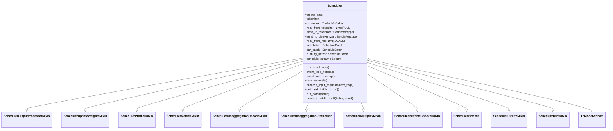
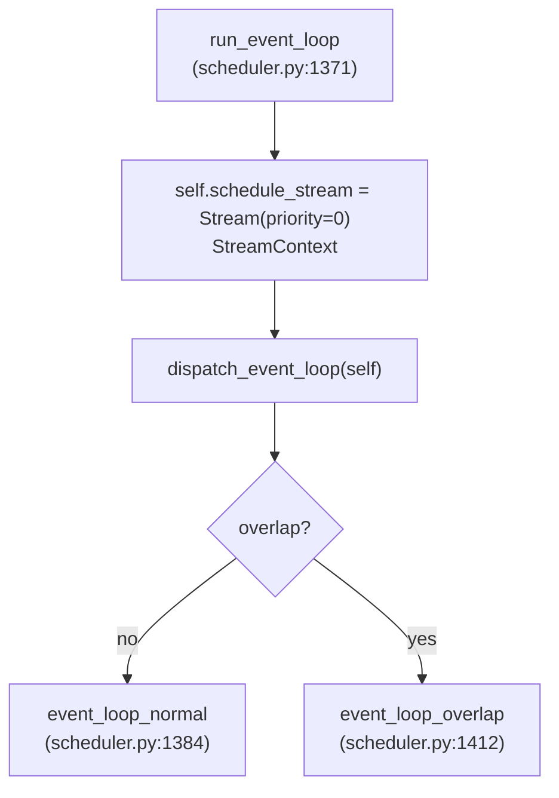

# `Scheduler` (and `TpModelWorker`, `BaseTpWorker`, `IdleSleeper`)

## Summary
`Scheduler` 是 SGLang 的**核心调度器**，跑在子进程里，每个 PP×TP 组合一个实例。它直接持有 `TpModelWorker`（也即 `ModelRunner`），不经过 vLLM 那种独立的 `Executor` 抽象。Scheduler 由 11 个 mixin 拼装而成，提供两套主循环：`event_loop_normal` 与 `event_loop_overlap`（CPU/GPU overlap）。本页梳理类结构、初始化序列、IPC 端点、两种事件循环。

## Sources
- [scheduler.py](d:\design\sglang\python\sglang\srt\managers\scheduler.py)（约 3700 行）
- [tp_worker.py](d:\design\sglang\python\sglang\srt\managers\tp_worker.py)（含 `BaseTpWorker` + `TpModelWorker`）
- [schedule_batch.py](d:\design\sglang\python\sglang\srt\managers\schedule_batch.py)
- [schedule_policy.py](d:\design\sglang\python\sglang\srt\managers\schedule_policy.py)

## 类层次



精确 class 定义见 [scheduler.py:317-329](d:\design\sglang\python\sglang\srt\managers\scheduler.py)。

## 入口函数

子进程 `mp.Process(target=run_scheduler_process, ...)` 由 `Engine._launch_scheduler_processes` 启动（[entrypoints/engine.py:553-587](d:\design\sglang\python\sglang\srt\entrypoints\engine.py)），最终调用 [scheduler.py:3714 run_scheduler_process](d:\design\sglang\python\sglang\srt\managers\scheduler.py)，再实例化 `Scheduler` 调 `run_event_loop`。

## `Scheduler.__init__` 关键序列

构造签名（[scheduler.py:332-343](d:\design\sglang\python\sglang\srt\managers\scheduler.py)）：

```python
def __init__(
    self,
    server_args: ServerArgs,
    port_args: PortArgs,
    gpu_id: int,
    tp_rank: int,
    moe_ep_rank: int,
    pp_rank: int,
    attn_cp_rank: int,
    moe_dp_rank: int,
    dp_rank: Optional[int],
):
```

约 17 个 init 子方法（[scheduler.py:344-1356](d:\design\sglang\python\sglang\srt\managers\scheduler.py)）：

| init 子方法 | 行号 | 角色 |
|---|---|---|
| `init_soft_watchdog(server_args)` | [1021](d:\design\sglang\python\sglang\srt\managers\scheduler.py) | 软看门狗 |
| `init_model_config()` | [477](d:\design\sglang\python\sglang\srt\managers\scheduler.py) | 模型配置 |
| `init_ipc_channels(port_args)` | [498](d:\design\sglang\python\sglang\srt\managers\scheduler.py) | **ZMQ socket 创建（重点）** |
| `init_tokenizer()` | [545](d:\design\sglang\python\sglang\srt\managers\scheduler.py) | tokenizer（scheduler 也持有，为了某些 detokenize 场景） |
| `init_mamba_backend()` | [596](d:\design\sglang\python\sglang\srt\managers\scheduler.py) | Mamba 状态后端 |
| `init_moe_gemm_config()` | [599](d:\design\sglang\python\sglang\srt\managers\scheduler.py) | MoE gemm 配置 |
| `init_tp_model_worker()` | [615](d:\design\sglang\python\sglang\srt\managers\scheduler.py) | **创建 `TpModelWorker`** |
| `maybe_init_draft_worker()` | [639](d:\design\sglang\python\sglang\srt\managers\scheduler.py) | spec decode 的 draft worker |
| `init_model_worker()` | [681](d:\design\sglang\python\sglang\srt\managers\scheduler.py) | 真正绑定 model_runner |
| `init_cache_with_memory_pool()` | [754](d:\design\sglang\python\sglang\srt\managers\scheduler.py) | KV cache + memory pool |
| `init_running_status()` | [917](d:\design\sglang\python\sglang\srt\managers\scheduler.py) | 运行时状态 |
| `init_chunked_prefill()` | [934](d:\design\sglang\python\sglang\srt\managers\scheduler.py) | chunked prefill |
| `init_schedule_policy()` | [972](d:\design\sglang\python\sglang\srt\managers\scheduler.py) | schedule policy（FCFS / priority / 等） |
| `init_watch_dog_memory_saver_input_blocker()` | [1027](d:\design\sglang\python\sglang\srt\managers\scheduler.py) | 内存看门狗 |
| `init_disaggregation()` | [1051](d:\design\sglang\python\sglang\srt\managers\scheduler.py) | **PD 分离 init** |
| `init_overlap()` | [1183](d:\design\sglang\python\sglang\srt\managers\scheduler.py) | overlap 模式参数 |
| `maybe_init_ngram_embedding()` | [1208](d:\design\sglang\python\sglang\srt\managers\scheduler.py) | n-gram embedding |
| `init_deterministic_inference_config()` | [1259](d:\design\sglang\python\sglang\srt\managers\scheduler.py) | 确定性推理 |
| `init_request_dispatcher()` | [1276](d:\design\sglang\python\sglang\srt\managers\scheduler.py) | RPC 请求派发器 |

## `init_ipc_channels` （[scheduler.py:498-543](d:\design\sglang\python\sglang\srt\managers\scheduler.py)）— ZMQ 端点

只有 PP rank 0 + attn TP rank 0 + attn CP rank 0 才创建 socket（其余 rank 是 `None`）：

```python
if self.pp_rank == 0 and self.attn_tp_rank == 0 and self.attn_cp_rank == 0:
    self.recv_from_tokenizer = get_zmq_socket(context, zmq.PULL, port_args.scheduler_input_ipc_name, False)
    self.recv_from_rpc = get_zmq_socket(context, zmq.DEALER, port_args.rpc_ipc_name, False)
    send_to_tokenizer = get_zmq_socket(context, zmq.PUSH, port_args.tokenizer_ipc_name, False)
    if server_args.skip_tokenizer_init:
        send_to_detokenizer = get_zmq_socket(context, zmq.PUSH, port_args.tokenizer_ipc_name, False)
    else:
        send_to_detokenizer = get_zmq_socket(context, zmq.PUSH, port_args.detokenizer_ipc_name, False)
    self.send_to_tokenizer = SenderWrapper(send_to_tokenizer)
    self.send_to_detokenizer = SenderWrapper(send_to_detokenizer)
    if server_args.sleep_on_idle:
        self.idle_sleeper = IdleSleeper([self.recv_from_tokenizer, self.recv_from_rpc])
```

要点：

- 4 个 socket：tokenizer→sched、rpc→sched、sched→tokenizer、sched→detokenizer
- `skip_tokenizer_init` 时短路 detokenizer，scheduler 直接发回 tokenizer manager
- `sleep_on_idle` 启 `IdleSleeper`（[scheduler.py:3558-3586](d:\design\sglang\python\sglang\srt\managers\scheduler.py)）— 当 socket 都没消息时短暂 sleep，省 CPU
- 非 leader rank（其它 PP/TP rank）的 socket 都是 `None` 或空 `SenderWrapper`（[scheduler.py:534-538](d:\design\sglang\python\sglang\srt\managers\scheduler.py)），它们靠 `tp_worker` / `pp_worker` 内部 broadcast 同步

## `run_event_loop` 与两种循环



`dispatch_event_loop` 在 [scheduler.py:3628-3656](d:\design\sglang\python\sglang\srt\managers\scheduler.py) 选择具体循环。

### `event_loop_normal` （[scheduler.py:1384-1410](d:\design\sglang\python\sglang\srt\managers\scheduler.py)）

```python
@DynamicGradMode()
def event_loop_normal(self):
    while True:
        recv_reqs = self.recv_requests()
        self.process_input_requests(recv_reqs)
        if self._engine_paused:
            self.cancel_bubble_timer()
            continue

        batch = self.get_next_batch_to_run()
        self.cur_batch = batch

        if batch:
            result = self.run_batch(batch)
            self.process_batch_result(batch, result)
        else:
            self.on_idle()

        self.last_batch = batch
        if envs.SGLANG_ENABLE_STRICT_MEM_CHECK_DURING_BUSY.get():
            self.self_check_during_busy()
```

### `event_loop_overlap` （[scheduler.py:1412-1465](d:\design\sglang\python\sglang\srt\managers\scheduler.py)）

引入 `result_queue` deque，让上一 batch 的 `process_batch_result` 与本 batch 的 `run_batch` 在 CPU/GPU 上 overlap：

```python
def event_loop_overlap(self):
    self.result_queue = deque()

    def pop_and_process():
        tmp_batch, tmp_result = self.result_queue.popleft()
        self.process_batch_result(tmp_batch, tmp_result)

    while True:
        recv_reqs = self.recv_requests()
        self.process_input_requests(recv_reqs)
        if self._engine_paused: continue

        batch = self.get_next_batch_to_run()
        disable_overlap_for_batch = self.is_disable_overlap_for_batch(batch)

        if disable_overlap_for_batch:
            pop_and_process()  # 立即处理上一 batch

        if batch:
            batch_result = self.run_batch(batch)
            self.result_queue.append((batch.copy(), batch_result))
        else:
            batch_result = None
            self.cancel_bubble_timer()

        if self.last_batch:
            if not disable_overlap_for_batch:
                pop_and_process()  # 处理上一 batch
        elif batch is None:
            self.on_idle()

        if self.is_generation:
            self.launch_batch_sample_if_needed(batch_result)

        self.last_batch = batch
```

> synthesis: 这是 SGLang 的关键性能优化——把 GPU forward（`run_batch`）和 CPU 后处理（`process_batch_result`）流水起来。代价是必须显式列出 "不能 overlap" 的情况（[scheduler.py:1466-1497 is_disable_overlap_for_batch](d:\design\sglang\python\sglang\srt\managers\scheduler.py)）。

### overlap 禁用条件（[scheduler.py:1466-1497](d:\design\sglang\python\sglang\srt\managers\scheduler.py)）

| 条件 | 原因 |
|---|---|
| `SGLANG_DISABLE_CONSECUTIVE_PREFILL_OVERLAP` env + 连续两个 prefill | 改善首 batch TTFT，可能略损吞吐 |
| spec v2 + grammar + decode + 队列非空 | "我们还不支持 overlap + spec + grammar"（注释 [scheduler.py:1487-1488](d:\design\sglang\python\sglang\srt\managers\scheduler.py) 显式 TODO） |

## 关键 step 函数

| 函数 | 行号 | 作用 |
|---|---|---|
| `recv_requests()` | [1504-1640](d:\design\sglang\python\sglang\srt\managers\scheduler.py) | 从 ZMQ socket 取请求（含 PD broadcast） |
| `process_input_requests(recv_reqs)` | [1670-1694](d:\design\sglang\python\sglang\srt\managers\scheduler.py) | 派发到 `handle_*` |
| `handle_generate_request(...)` | [1807-2001](d:\design\sglang\python\sglang\srt\managers\scheduler.py) | 主请求处理 |
| `handle_batch_generate_request(...)` | [2002-2012](d:\design\sglang\python\sglang\srt\managers\scheduler.py) | batch 请求 |
| `_add_request_to_queue(req)` | [2035-2058](d:\design\sglang\python\sglang\srt\managers\scheduler.py) | 入队（priority 决定位置） |
| `get_next_batch_to_run()` | [2278-2386](d:\design\sglang\python\sglang\srt\managers\scheduler.py) | **核心调度决策** |
| `get_new_batch_prefill()` | [2393-2410](d:\design\sglang\python\sglang\srt\managers\scheduler.py) | 取新 prefill batch |
| `update_running_batch(batch)` | [2643-2720](d:\design\sglang\python\sglang\srt\managers\scheduler.py) | 更新 running batch |
| `run_batch(batch)` | [2730-2887](d:\design\sglang\python\sglang\srt\managers\scheduler.py) | 跑一个 batch（forward） |
| `launch_batch_sample_if_needed(...)` | [2888-2912](d:\design\sglang\python\sglang\srt\managers\scheduler.py) | overlap 模式的 sampling |
| `process_batch_result(batch, result)` | [2913-2935](d:\design\sglang\python\sglang\srt\managers\scheduler.py) | 处理结果，发给 detokenizer |
| `abort_request(recv_req)` | [3294-3395](d:\design\sglang\python\sglang\srt\managers\scheduler.py) | abort |

## `TpModelWorker` （[tp_worker.py:217-558](d:\design\sglang\python\sglang\srt\managers\tp_worker.py)）

继承 `BaseTpWorker(ABC)`（[tp_worker.py:62-216](d:\design\sglang\python\sglang\srt\managers\tp_worker.py)）。

| 方法 | 行号 | 说明 |
|---|---|---|
| `__init__(...)` | [220-321](d:\design\sglang\python\sglang\srt\managers\tp_worker.py) | 初始化 |
| `_init_model_config()` | [322-339](d:\design\sglang\python\sglang\srt\managers\tp_worker.py) | 模型配置 |
| `_init_model_runner()` | [340-362](d:\design\sglang\python\sglang\srt\managers\tp_worker.py) | **创建 `ModelRunner`**（来自 model_executor） |
| `_init_multi_layer_eagle_model_runners()` | [363-389](d:\design\sglang\python\sglang\srt\managers\tp_worker.py) | Eagle spec decode 多层 runner |
| `_init_dllm_algorithm()` | [390-398](d:\design\sglang\python\sglang\srt\managers\tp_worker.py) | Diffusion LLM |
| `forward_batch_generation(batch, ...)` | [443-533](d:\design\sglang\python\sglang\srt\managers\tp_worker.py) | **主 forward 入口** |
| `forward_batch_split_prefill(batch)` | [535-558](d:\design\sglang\python\sglang\srt\managers\tp_worker.py) | chunked prefill |
| `is_dllm()` | [428-430](d:\design\sglang\python\sglang\srt\managers\tp_worker.py) | DLL 模式 |

`BaseTpWorker` 提供大量"权重更新 / LoRA / 远端实例 send 权重"等通用 API（[tp_worker.py:62-216](d:\design\sglang\python\sglang\srt\managers\tp_worker.py)），子类只需实现 `forward_batch_generation` + `model_runner` property + `__init__`。

## `IdleSleeper` （[scheduler.py:3558-3586](d:\design\sglang\python\sglang\srt\managers\scheduler.py)）

省 CPU 的辅助类，当 sockets 都空时短暂 `time.sleep`：

```python
class IdleSleeper:
    def __init__(self, sockets):
        self.sockets = sockets
    def maybe_sleep(self):
        # ... poll sockets, sleep if all empty
```

## `SenderWrapper` （[scheduler.py:3605-3626](d:\design\sglang\python\sglang\srt\managers\scheduler.py)）

封装 `send_output`，处理 `socket is None` 的情况（非 leader rank 上 socket 是空的）。

## Notes / Caveats
> [!todo] VERIFY: ~~`run_scheduler_process` ([scheduler.py:3714](d:\design\sglang\python\sglang\srt\managers\scheduler.py)) 的完整子进程入口逻辑（设置 affinity / signal handler / 异常 dump）。~~
> **RESOLVED 2026-04-19**: `run_scheduler_process` ([scheduler.py:3714-3771](d:\design\sglang\python\sglang\srt\managers\scheduler.py)) 委托 `configure_scheduler_process` ([scheduler.py:3657-3711](d:\design\sglang\python\sglang\srt\managers\scheduler.py)) 完成 `kill_itself_when_parent_died` + `setproctitle` + `faulthandler.enable()` + `configure_logger` + `set_gpu_proc_affinity`(env `SGLANG_SET_CPU_AFFINITY`) + `numa_bind_to_node`(非 `SGLANG_NUMA_BIND_V2`)；之后实例化 `Scheduler`、`pipe_writer.send(scheduler.get_init_info())`、`scheduler.run_event_loop()`，捕获异常时 `parent_process.send_signal(signal.SIGQUIT)`（[scheduler.py:3768-3771](d:\design\sglang\python\sglang\srt\managers\scheduler.py)）。
> [!todo] VERIFY: ~~`init_disaggregation` ([scheduler.py:1051-1182](d:\design\sglang\python\sglang\srt\managers\scheduler.py)) 的 7 backend 选择逻辑（NIXL / Mooncake / MORI / Ascend / fake / common / base）。~~
> **RESOLVED 2026-04-19**: `init_disaggregation` 本身只做 `TransferBackend(server_args.disaggregation_transfer_backend)` 的解析与 PREFILL/DECODE 队列搭建（[scheduler.py:1051-1181](d:\design\sglang\python\sglang\srt\managers\scheduler.py)）；真正的 backend 派发位于 `get_kv_class` ([disaggregation/utils.py:342-428](d:\design\sglang\python\sglang\srt\disaggregation\utils.py))，`TransferBackend` 枚举 ([disaggregation/utils.py:304-309](d:\design\sglang\python\sglang\srt\disaggregation\utils.py)) **实际只 5 个**：MOONCAKE / MORI / NIXL / ASCEND / FAKE（`common` 与 `base` 是抽象基类目录、非可选 backend）。
> [!todo] VERIFY: ~~`get_next_batch_to_run` 的具体调度决策（chunked prefill 与 running batch 的优先级、回收策略）。~~
> **RESOLVED 2026-04-19**: `get_next_batch_to_run` ([scheduler.py:2278-2385](d:\design\sglang\python\sglang\srt\managers\scheduler.py)) 顺序：(1) `_abort_on_waiting_timeout` + `_abort_on_running_timeout`；(2) 把 `chunked_req` 与 dllm staging 暂存出去（`stash_chunked_request`）；(3) 若 `last_batch.forward_mode.is_extend()` 则 `filter_batch(chunked_req_to_exclude=...)` 后 merge 进 `running_batch`；(4) 调 `get_new_batch_prefill` 取新 prefill batch；(5) **优先级 prefill > decode**——若有新 prefill 直接返回；否则 `update_running_batch(self.running_batch)` 走 decode（[scheduler.py:2362-2374](d:\design\sglang\python\sglang\srt\managers\scheduler.py)）；(6) 末尾 `maybe_prepare_mlp_sync_batch` + `_maybe_prepare_ngram_embedding`。

## See also
- [modules/managers.md](../modules/managers.md)
- [entities/TokenizerManager.md](TokenizerManager.md)
- [topics/manager-pipeline.md](../topics/manager-pipeline.md)
- [topics/request-lifecycle.md](../topics/request-lifecycle.md)
- [topics/scheduler-mixins.md](../topics/scheduler-mixins.md) — 11 mixin 详细拆解（关键方法 / 触发条件 / 跨 mixin 协作链）
