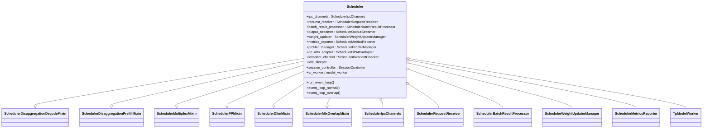
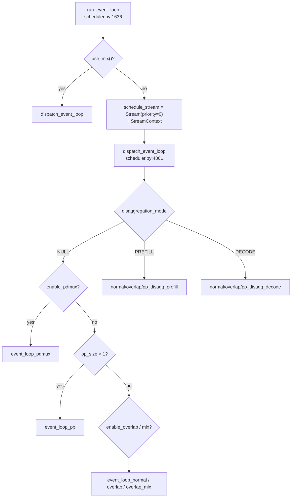

# `Scheduler`

## Summary

`Scheduler` 是 SGLang 的核心调度器，跑在子进程（或 Ray actor）里，每 PP×TP 组合一个实例；直接持有 `TpModelWorker` / draft worker，无独立 Executor 层。HEAD `06f32bab` 上类定义在 [scheduler.py:375-382](d:\design\sglang\python\sglang\srt\managers\scheduler.py)，**MRO 剩 6 个职责 mixin + 条件性 `SchedulerMlxOverlapMixin`**；原先 OutputProcessor / UpdateWeights / Profiler / Metrics / RuntimeChecker / DPAttn 等已迁到 [scheduler_components/](d:\design\sglang\python\sglang\srt\managers\scheduler_components) **组合对象**。主循环经 `run_event_loop` → `dispatch_event_loop` 分发到 normal / overlap / PP / PD-disagg / PDMux / MLX 变体。

## Sources

- [d:\design\sglang\python\sglang\srt\managers\scheduler.py:375-5046](d:\design\sglang\python\sglang\srt\managers\scheduler.py)（整文件 ~5046 行；`class Scheduler` L375；`dispatch_event_loop` L4861；`configure_scheduler_process` L4892；`run_scheduler_process` L4957）
- [d:\design\sglang\python\sglang\srt\managers\scheduler_components\](d:\design\sglang\python\sglang\srt\managers\scheduler_components)（19 个组件模块 + `__init__.py`）
- [d:\design\sglang\python\sglang\srt\managers\scheduler_pp_mixin.py](d:\design\sglang\python\sglang\srt\managers\scheduler_pp_mixin.py)（`SchedulerPPMixin`）
- [d:\design\sglang\python\sglang\srt\disaggregation\decode.py:2112](d:\design\sglang\python\sglang\srt\disaggregation\decode.py)（`SchedulerDisaggregationDecodeMixin`）
- [d:\design\sglang\python\sglang\srt\disaggregation\prefill.py:485](d:\design\sglang\python\sglang\srt\disaggregation\prefill.py)（`SchedulerDisaggregationPrefillMixin`）
- [d:\design\sglang\python\sglang\srt\multiplex\multiplexing_mixin.py:33](d:\design\sglang\python\sglang\srt\multiplex\multiplexing_mixin.py)（`SchedulerMultiplexMixin`）
- [d:\design\sglang\python\sglang\srt\dllm\mixin\scheduler.py:22](d:\design\sglang\python\sglang\srt\dllm\mixin\scheduler.py)（`SchedulerDllmMixin`）
- [d:\design\sglang\python\sglang\srt\hardware_backend\mlx\scheduler_mixin.py](d:\design\sglang\python\sglang\srt\hardware_backend\mlx\scheduler_mixin.py)（`SchedulerMlxOverlapMixin`；非 MPS 时 scheduler.py 内 stub）
- [d:\design\sglang\python\sglang\srt\session\session_controller.py:353](d:\design\sglang\python\sglang\srt\session\session_controller.py)（`SessionController`）
- [d:\design\sglang\python\sglang\srt\entrypoints\engine.py:832-918](d:\design\sglang\python\sglang\srt\entrypoints\engine.py)（`_launch_scheduler_processes` → `mp.Process(target=run_scheduler_process_func)`）
- [d:\design\sglang\python\sglang\srt\managers\tp_worker.py](d:\design\sglang\python\sglang\srt\managers\tp_worker.py)（`TpModelWorker`；独立实体页）
- [d:\design\sglang\python\sglang\srt\managers\schedule_batch.py:3376](d:\design\sglang\python\sglang\srt\managers\schedule_batch.py)（`NextBatchPlan`）
- [d:\design\sglang\python\sglang\srt\managers\schedule_policy.py](d:\design\sglang\python\sglang\srt\managers\schedule_policy.py)（`SchedulePolicy`）

## Architecture / Data flow

### 类层次：mixin（少）+ composition（多）



精确 MRO 声明见 [scheduler.py:375-382](d:\design\sglang\python\sglang\srt\managers\scheduler.py)：

```python
class Scheduler(
    SchedulerDisaggregationDecodeMixin,
    SchedulerDisaggregationPrefillMixin,
    SchedulerMultiplexMixin,
    SchedulerPPMixin,
    SchedulerDllmMixin,
    SchedulerMlxOverlapMixin,
):
```

`SchedulerMlxOverlapMixin`：`is_mps()` 时从 [hardware_backend/mlx/scheduler_mixin.py](d:\design\sglang\python\sglang\srt\hardware_backend\mlx\scheduler_mixin.py) 导入；否则在 [scheduler.py:330-331](d:\design\sglang\python\sglang\srt\managers\scheduler.py) 定义为空 stub。

### 前 mixin → 现 composition 映射

| 旧 mixin（已删除源文件） | 现组件 / 归属 | 初始化锚点 |
|---|---|---|
| `SchedulerOutputProcessorMixin` | `SchedulerBatchResultProcessor` + `SchedulerOutputStreamer` + `SchedulerLogprobResultProcessor` | [scheduler.py:2112-2147](d:\design\sglang\python\sglang\srt\managers\scheduler.py) |
| `SchedulerUpdateWeightsMixin` | `SchedulerWeightUpdaterManager` | [scheduler.py:1913-1923](d:\design\sglang\python\sglang\srt\managers\scheduler.py) |
| `SchedulerProfilerMixin` | `SchedulerProfilerManager` | [scheduler.py:1906-1911](d:\design\sglang\python\sglang\srt\managers\scheduler.py) |
| `SchedulerMetricsMixin` | `SchedulerMetricsReporter` + `SchedulerMetricsCollector` + `SchedulerKvEventsPublisher` + `SchedulerLoadInquirer` | [scheduler.py:715-728](d:\design\sglang\python\sglang\srt\managers\scheduler.py)、[L1179-1190](d:\design\sglang\python\sglang\srt\managers\scheduler.py)、[L2066-2110](d:\design\sglang\python\sglang\srt\managers\scheduler.py) |
| `SchedulerRuntimeCheckerMixin` | `SchedulerInvariantChecker` + `SchedulerPoolStatsObserver` + `create_scheduler_watchdog` | [scheduler.py:2031-2064](d:\design\sglang\python\sglang\srt\managers\scheduler.py)、[L1237-1247](d:\design\sglang\python\sglang\srt\managers\scheduler.py) |
| `SchedulerDPAttnMixin` | `SchedulerDPAttnAdapter` | [scheduler.py:2008-2029](d:\design\sglang\python\sglang\srt\managers\scheduler.py) |
| （同文件辅助类）`IdleSleeper` | [idle_sleeper.py:15](d:\design\sglang\python\sglang\srt\managers\scheduler_components\idle_sleeper.py) | [scheduler.py:770-784](d:\design\sglang\python\sglang\srt\managers\scheduler.py) |
| （同文件辅助类）`SenderWrapper` | [output_sender.py:8](d:\design\sglang\python\sglang\srt\managers\scheduler_components\output_sender.py)；经 `SchedulerIpcChannels` | [ipc_channels.py:67-68](d:\design\sglang\python\sglang\srt\managers\scheduler_components\ipc_channels.py) |

> synthesis: HEAD 把“正交横切职责”从多重继承拆成可测试的组合对象；仍保留的 5+1 mixin 主要是 **事件循环变体 / PD / PP / DLLM / MLX** 这类需要改写主循环或大量覆盖方法的路径。

### `scheduler_components/` 关键类清单

| 文件 | 关键类 | 角色 |
|---|---|---|
| [ipc_channels.py](d:\design\sglang\python\sglang\srt\managers\scheduler_components\ipc_channels.py) | `SchedulerIpcChannels` | ZMQ PULL/DEALER/PUSH + `SenderWrapper` 封装 |
| [output_sender.py](d:\design\sglang\python\sglang\srt\managers\scheduler_components\output_sender.py) | `SenderWrapper` | `send_output`；`socket is None` 时 no-op |
| [idle_sleeper.py](d:\design\sglang\python\sglang\srt\managers\scheduler_components\idle_sleeper.py) | `IdleSleeper`, `RustServerIdleSleeper` | idle 时 poll/sleep；Rust 环用 `wait_ingress` |
| [request_receiver.py](d:\design\sglang\python\sglang\srt\managers\scheduler_components\request_receiver.py) | `SchedulerRequestReceiver` | `recv_requests` + TP/CP broadcast |
| [batch_result_processor.py](d:\design\sglang\python\sglang\srt\managers\scheduler_components\batch_result_processor.py) | `SchedulerBatchResultProcessor` | prefill/decode/idle/prebuilt 结果处理 |
| [output_streamer.py](d:\design\sglang\python\sglang\srt\managers\scheduler_components\output_streamer.py) | `SchedulerOutputStreamer` | 向 detokenizer / Rust egress 推流 |
| [logprob_result_processor.py](d:\design\sglang\python\sglang\srt\managers\scheduler_components\logprob_result_processor.py) | `SchedulerLogprobResultProcessor` | logprob 后处理 |
| [weight_updater.py](d:\design\sglang\python\sglang\srt\managers\scheduler_components\weight_updater.py) | `SchedulerWeightUpdaterManager` | 在线权重 / IPC / memory occupation |
| [profiler_manager.py](d:\design\sglang\python\sglang\srt\managers\scheduler_components\profiler_manager.py) | `SchedulerProfilerManager` | torch/CUDA profiler RPC |
| [metrics_reporter.py](d:\design\sglang\python\sglang\srt\managers\scheduler_components\metrics_reporter.py) | `SchedulerMetricsReporter` | 步级 metrics + FPM |
| [dp_attn.py](d:\design\sglang\python\sglang\srt\managers\scheduler_components\dp_attn.py) | `SchedulerDPAttnAdapter` | DP-attn MLP sync batch |
| [invariant_checker.py](d:\design\sglang\python\sglang\srt\managers\scheduler_components\invariant_checker.py) | `SchedulerInvariantChecker`, `create_scheduler_watchdog` | pool/tree 不变量 + watchdog 工厂 |
| [pool_stats_observer.py](d:\design\sglang\python\sglang\srt\managers\scheduler_components\pool_stats_observer.py) | `SchedulerPoolStatsObserver` | KV/req pool 用量观察 |
| [load_inquirer.py](d:\design\sglang\python\sglang\srt\managers\scheduler_components\load_inquirer.py) | `SchedulerLoadInquirer` | `/v1/loads` 等负载查询 |
| [kv_events_publisher.py](d:\design\sglang\python\sglang\srt\managers\scheduler_components\kv_events_publisher.py) | `SchedulerKvEventsPublisher` | KV events 外发 |
| [flush_wrapper.py](d:\design\sglang\python\sglang\srt\managers\scheduler_components\flush_wrapper.py) | `SchedulerFlushWrapper` | `FlushCacheReqInput` 包装 |
| [recv_skipper.py](d:\design\sglang\python\sglang\srt\managers\scheduler_components\recv_skipper.py) | `SchedulerRecvSkipper` | 慢消费跳过 recv |
| [new_token_ratio_tracker.py](d:\design\sglang\python\sglang\srt\managers\scheduler_components\new_token_ratio_tracker.py) | `NewTokenRatioTracker` | 新 token 比例估计 |
| [memory_usage.py](d:\design\sglang\python\sglang\srt\managers\scheduler_components\memory_usage.py) | `build_memory_usage` 等 | 内存用量汇总 helper |

### 入口：`run_scheduler_process`

子进程由 `Engine._launch_scheduler_processes` 以 `mp.Process(target=run_scheduler_process_func, ...)` 拉起（[engine.py:881-895](d:\design\sglang\python\sglang\srt\entrypoints\engine.py)）；DP>1 时改走 `run_data_parallel_controller_process`（[engine.py:904-918](d:\design\sglang\python\sglang\srt\entrypoints\engine.py)）。

[run_scheduler_process](d:\design\sglang\python\sglang\srt\managers\scheduler.py)（[L4957-5046](d:\design\sglang\python\sglang\srt\managers\scheduler.py)）：

1. `load_plugins()`（[L4973](d:\design\sglang\python\sglang\srt\managers\scheduler.py)）
2. `configure_scheduler_process`（[L4892-4954](d:\design\sglang\python\sglang\srt\managers\scheduler.py)）：`kill_itself_when_parent_died`、`setproctitle`、`faulthandler.enable`、`configure_logger`、可选 CPU affinity / NUMA bind
3. `publish(server_args, role="scheduler")`（[L4989](d:\design\sglang\python\sglang\srt\managers\scheduler.py)）
4. 构造 `Scheduler(...)` → `pipe_writer.send(scheduler.get_init_info())` → `scheduler.run_event_loop()`（[L5009-5025](d:\design\sglang\python\sglang\srt\managers\scheduler.py)）
5. 异常：`parent_process.send_signal(SIGQUIT)`；可选 `SGLANG_KILLPG_ON_SCHEDULER_EXCEPTION`（[L5027-5037](d:\design\sglang\python\sglang\srt\managers\scheduler.py)）
6. `finally`：`metrics_reporter._shutdown_fpm()`；graceful 时 `release_host_resources()`（[L5038-5046](d:\design\sglang\python\sglang\srt\managers\scheduler.py)）

Ray 路径不走 `run_scheduler_process`，由 [ray/scheduler_actor.py](d:\design\sglang\python\sglang\srt\ray\scheduler_actor.py) 直接构造 `Scheduler`（注释 [L102-107](d:\design\sglang\python\sglang\srt\ray\scheduler_actor.py)）。

### `Scheduler.__init__` 编排

构造签名 [scheduler.py:385-396](d:\design\sglang\python\sglang\srt\managers\scheduler.py)。`__init__` 明确约定为 orchestrator：只顺序调 `init_*` / `maybe_init_*`（[L397-400](d:\design\sglang\python\sglang\srt\managers\scheduler.py)）。主序列（[L401-651](d:\design\sglang\python\sglang\srt\managers\scheduler.py)）：

| 步骤 | 锚点 | 角色 |
|---|---|---|
| `init_soft_watchdog` | [L406](d:\design\sglang\python\sglang\srt\managers\scheduler.py) / [L1237](d:\design\sglang\python\sglang\srt\managers\scheduler.py) | 可选 soft daemon watchdog |
| `init_model_config` | [L480](d:\design\sglang\python\sglang\srt\managers\scheduler.py) / [L702](d:\design\sglang\python\sglang\srt\managers\scheduler.py) | `ModelConfig` |
| `init_metrics_collector` | [L483](d:\design\sglang\python\sglang\srt\managers\scheduler.py) | Prometheus collector 上下文 |
| `init_ipc_channels` + `init_idle_sleeper` | [L486-487](d:\design\sglang\python\sglang\srt\managers\scheduler.py) | ZMQ + IdleSleeper |
| `init_tokenizer` / MoE / mamba | [L497-503](d:\design\sglang\python\sglang\srt\managers\scheduler.py) | tokenizer + gemm/mamba |
| `init_model_worker` | [L510](d:\design\sglang\python\sglang\srt\managers\scheduler.py) / [L979](d:\design\sglang\python\sglang\srt\managers\scheduler.py) | `TpModelWorker` + draft + pools + graphs |
| `kv_cache_builder.build_kv_cache` | [L516-551](d:\design\sglang\python\sglang\srt\managers\scheduler.py) | tree_cache / token pools |
| `init_running_status` | [L578](d:\design\sglang\python\sglang\srt\managers\scheduler.py) / [L1119](d:\design\sglang\python\sglang\srt\managers\scheduler.py) | queues + `SessionController` + `FlushWrapper` |
| `init_chunked_prefill` / `init_diffusion_llm` / `init_schedule_policy` | [L581-589](d:\design\sglang\python\sglang\srt\managers\scheduler.py) | 调度策略 |
| `init_watch_dog_memory_saver_input_blocker` | [L592](d:\design\sglang\python\sglang\srt\managers\scheduler.py) | hard watchdog + recv skipper + input blocker |
| `init_profiler` / `maybe_init_rust_server` / `init_disaggregation` | [L595-607](d:\design\sglang\python\sglang\srt\managers\scheduler.py) | profiler / Rust FE / PD queues |
| `init_overlap` | [L610](d:\design\sglang\python\sglang\srt\managers\scheduler.py) / [L1416](d:\design\sglang\python\sglang\srt\managers\scheduler.py) | `future_map` + CUDA streams |
| `init_weight_updater` / `init_request_dispatcher` | [L618-621](d:\design\sglang\python\sglang\srt\managers\scheduler.py) | RPC `TypeBasedDispatcher` |
| `init_request_receiver` … `init_batch_result_processor` | [L634-648](d:\design\sglang\python\sglang\srt\managers\scheduler.py) | 组合对象收尾 |

`ParallelState` 在 [L457-477](d:\design\sglang\python\sglang\srt\managers\scheduler.py) 固化 tp/pp/dp/attn_cp/moe 等 rank。`enable_overlap` = `not disable_overlap_schedule and not use_mlx()`（[L425](d:\design\sglang\python\sglang\srt\managers\scheduler.py)）。

### IPC：`SchedulerIpcChannels`

[init_ipc_channels](d:\design\sglang\python\sglang\srt\managers\scheduler.py)（[L730-768](d:\design\sglang\python\sglang\srt\managers\scheduler.py)）委托 [SchedulerIpcChannels.create](d:\design\sglang\python\sglang\srt\managers\scheduler_components\ipc_channels.py)（[L25-88](d:\design\sglang\python\sglang\srt\managers\scheduler_components\ipc_channels.py)）：

- leader（`pp_rank==0 and attn_tp_rank==0 and attn_cp_rank==0`）：`recv_from_tokenizer` = ZMQ PULL（`scheduler_input_ipc_name`）；`recv_from_rpc` = DEALER；`send_to_tokenizer` / `send_to_detokenizer` = PUSH（`skip_tokenizer_init` 时 detokenizer 也指向 tokenizer IPC）
- 非 leader：recv 为 `None`，send 为 `SenderWrapper(None)`（[ipc_channels.py:69-73](d:\design\sglang\python\sglang\srt\managers\scheduler_components\ipc_channels.py)）
- metrics 开启时额外 `send_metrics_from_scheduler` PUSH（[L75-80](d:\design\sglang\python\sglang\srt\managers\scheduler_components\ipc_channels.py)）

`IdleSleeper` 在 leader + `sleep_on_idle` 时注册 tokenizer/rpc 两 socket（[scheduler.py:770-784](d:\design\sglang\python\sglang\srt\managers\scheduler.py)）；Rust server 模式用 `RustServerIdleSleeper` 覆盖（[L1982-1983](d:\design\sglang\python\sglang\srt\managers\scheduler.py)）。

### 事件循环



`dispatch_event_loop` 完整分支：[scheduler.py:4861-4889](d:\design\sglang\python\sglang\srt\managers\scheduler.py)。

#### `event_loop_normal`（[L1692-1724](d:\design\sglang\python\sglang\srt\managers\scheduler.py)）

每轮：`request_receiver.recv_requests()` → `process_input_requests` → `get_next_batch_to_run`（返回 `NextBatchPlan`）→ 有 batch 则 `run_batch` + `process_batch_result`，否则 `on_idle`。

#### `event_loop_overlap`（[L1727-1799](d:\design\sglang\python\sglang\srt\managers\scheduler.py)）

`result_queue: Deque` 让上一 batch 的 `process_batch_result` 与本 batch `run_batch` overlap；`run_batch` 后 `_apply_war_barrier()`（[L1775-1776](d:\design\sglang\python\sglang\srt\managers\scheduler.py)）；generation 路径再 `launch_batch_sample_if_needed`（[L1792-1793](d:\design\sglang\python\sglang\srt\managers\scheduler.py)）。

`is_disable_overlap_for_batch`（[L1801-1837](d:\design\sglang\python\sglang\srt\managers\scheduler.py)）：

| 条件 | 说明 |
|---|---|
| `SGLANG_DISABLE_CONSECUTIVE_PREFILL_OVERLAP` + 连续 extend | 改善首 batch TTFT |
| spec + `grammar_needs_sync()` + decode + `result_queue` 非空 | grammar FSM 需在下一 bitmask 前同步（host-draft 路径） |

> synthesis: overlap 的真并发来自 **CUDA `forward_stream` / `copy_stream` / `schedule_stream` + `result_queue` 延迟 CPU 后处理**，不是额外 Python worker 线程跑 forward。

### 关键 step 函数

| 函数 | 锚点 | 作用 |
|---|---|---|
| `SchedulerRequestReceiver.recv_requests` | [request_receiver.py:76-102](d:\design\sglang\python\sglang\srt\managers\scheduler_components\request_receiver.py) | ZMQ/Rust 取请求并 broadcast |
| `process_input_requests` | [scheduler.py:1850-1882](d:\design\sglang\python\sglang\srt\managers\scheduler.py) | `session_controller.maybe_reap` + `_request_dispatcher` |
| `handle_generate_request` | [scheduler.py:2341](d:\design\sglang\python\sglang\srt\managers\scheduler.py) | 主 generate 入队 |
| `get_next_batch_to_run` | [scheduler.py:2988-3123](d:\design\sglang\python\sglang\srt\managers\scheduler.py) | 返回 `NextBatchPlan(batch_to_run, running_batch)` |
| `get_new_batch_prefill` | [scheduler.py:3130](d:\design\sglang\python\sglang\srt\managers\scheduler.py) | 新 prefill |
| `update_running_batch` | [scheduler.py:3454](d:\design\sglang\python\sglang\srt\managers\scheduler.py) | decode 侧更新 |
| `run_batch` | [scheduler.py:3599](d:\design\sglang\python\sglang\srt\managers\scheduler.py) | `model_worker.forward_batch_generation` |
| `launch_batch_sample_if_needed` | [scheduler.py:3857](d:\design\sglang\python\sglang\srt\managers\scheduler.py) | overlap 延迟 sample |
| `process_batch_result` | [scheduler.py:3887-3918](d:\design\sglang\python\sglang\srt\managers\scheduler.py) | 委托 `batch_result_processor` / disagg / dllm |
| `on_idle` | [scheduler.py:4003](d:\design\sglang\python\sglang\srt\managers\scheduler.py) | leak check / metrics / kv events / `maybe_sleep_on_idle` |
| `abort_request` | [scheduler.py:4404](d:\design\sglang\python\sglang\srt\managers\scheduler.py) | abort |
| `open_session` / `close_session` | [scheduler.py:4795-4810](d:\design\sglang\python\sglang\srt\managers\scheduler.py) | 经 `SessionController` |

`get_next_batch_to_run` 决策要点（[L2988-3123](d:\design\sglang\python\sglang\srt\managers\scheduler.py)）：timeout abort → stash chunked/dllm →（非 hisparse）merge 上一 extend batch 进 `running_batch` → `get_new_batch_prefill`（或 dllm）→ **有新 prefill 优先**，否则 `update_running_batch` 走 decode → `dp_attn_adapter.maybe_prepare_mlp_sync_batch` → ngram prepare → `NextBatchPlan`。

`run_batch` overlap 路径在 `forward_stream_ctx` 内 `forward_stream.wait_stream(schedule_stream)`，再 `model_worker.forward_batch_generation`；结果 D2H 可走 `copy_stream`（[L3638-3713](d:\design\sglang\python\sglang\srt\managers\scheduler.py)）。`forward_stream` 来自 `tp_worker.get_worker_info()`（[L1011-1024](d:\design\sglang\python\sglang\srt\managers\scheduler.py)）。

### `IdleSleeper` / `SenderWrapper` / `SessionController`

- **IdleSleeper**（[idle_sleeper.py:15-42](d:\design\sglang\python\sglang\srt\managers\scheduler_components\idle_sleeper.py)）：`zmq.Poller.poll(1000)`；可选 `SGLANG_EMPTY_CACHE_INTERVAL` 触发 `empty_cache`。由 `on_idle` → `maybe_sleep_on_idle` 调用（[scheduler.py:4812-4814](d:\design\sglang\python\sglang\srt\managers\scheduler.py)）。
- **SenderWrapper**（[output_sender.py:8-28](d:\design\sglang\python\sglang\srt\managers\scheduler_components\output_sender.py)）：封装 `sock_send`；复制 `http_worker_ipc` 以支持 multi-http worker。
- **SessionController**（[session_controller.py:353](d:\design\sglang\python\sglang\srt\session\session_controller.py)）：在 `init_running_status` 创建（[scheduler.py:1137](d:\design\sglang\python\sglang\srt\managers\scheduler.py)）；`process_input_requests` 调 `maybe_reap`；open/close session RPC 委托之。

## Key APIs / Entities

| 名称 | 位置 | 作用 |
|---|---|---|
| `Scheduler` | [scheduler.py:375](d:\design\sglang\python\sglang\srt\managers\scheduler.py) | 调度器主体 |
| `run_scheduler_process` | [scheduler.py:4957](d:\design\sglang\python\sglang\srt\managers\scheduler.py) | 子进程入口 |
| `dispatch_event_loop` | [scheduler.py:4861](d:\design\sglang\python\sglang\srt\managers\scheduler.py) | 选主循环 |
| `configure_scheduler_process` | [scheduler.py:4892](d:\design\sglang\python\sglang\srt\managers\scheduler.py) | 进程标题 / logger / affinity |
| `SchedulerIpcChannels` | [ipc_channels.py:17](d:\design\sglang\python\sglang\srt\managers\scheduler_components\ipc_channels.py) | ZMQ 通道 dataclass |
| `SenderWrapper` | [output_sender.py:8](d:\design\sglang\python\sglang\srt\managers\scheduler_components\output_sender.py) | 输出发送包装 |
| `IdleSleeper` | [idle_sleeper.py:15](d:\design\sglang\python\sglang\srt\managers\scheduler_components\idle_sleeper.py) | idle CPU 节能 |
| `SchedulerRequestReceiver` | [request_receiver.py:49](d:\design\sglang\python\sglang\srt\managers\scheduler_components\request_receiver.py) | 收包 + broadcast |
| `SchedulerBatchResultProcessor` | [batch_result_processor.py:77](d:\design\sglang\python\sglang\srt\managers\scheduler_components\batch_result_processor.py) | 结果处理 |
| `SessionController` | [session_controller.py:353](d:\design\sglang\python\sglang\srt\session\session_controller.py) | session 生命周期 |
| `NextBatchPlan` | [schedule_batch.py:3376](d:\design\sglang\python\sglang\srt\managers\schedule_batch.py) | `(batch_to_run, running_batch)` |
| `TpModelWorker` | [tp_worker.py](d:\design\sglang\python\sglang\srt\managers\tp_worker.py) | 见 [TpModelWorker.md](TpModelWorker.md) |
| `TypeBasedDispatcher` | [scheduler.py:1501-1595](d:\design\sglang\python\sglang\srt\managers\scheduler.py) | RPC/请求类型派发表 |

## Hidden state（threads / queues / streams / IPC）

| 类别 | 位置 | 说明 |
|---|---|---|
| 进程 | [engine.py:881](d:\design\sglang\python\sglang\srt\entrypoints\engine.py) `mp.Process`；DP 控制器 [data_parallel_controller.py:703](d:\design\sglang\python\sglang\srt\managers\data_parallel_controller.py) | 每个 scheduler 一个 OS 进程（Ray 则 actor） |
| Watchdog 线程 | `WatchdogRaw` [watchdog.py:121-122](d:\design\sglang\python\sglang\srt\utils\watchdog.py) via `create_scheduler_watchdog` | soft（[scheduler.py:1237](d:\design\sglang\python\sglang\srt\managers\scheduler.py)）+ hard（[L1245](d:\design\sglang\python\sglang\srt\managers\scheduler.py)）daemon `threading.Thread` |
| FPM 发布线程 | `_FpmPublisherThread` [forward_pass_metrics.py:135-169](d:\design\sglang\python\sglang\srt\observability\forward_pass_metrics.py)；由 metrics_reporter 创建 | `queue.Queue` + ZMQ PUB 后台线程；`run_scheduler_process` finally 调 `_shutdown_fpm`（[scheduler.py:5040-5042](d:\design\sglang\python\sglang\srt\managers\scheduler.py)） |
| overlap `result_queue` | [scheduler.py:1729-1731](d:\design\sglang\python\sglang\srt\managers\scheduler.py) `deque` | CPU 后处理与 GPU forward 解耦 |
| CUDA/设备流 | `schedule_stream`（[L1653](d:\design\sglang\python\sglang\srt\managers\scheduler.py)）；`forward_stream`（worker info [L1020](d:\design\sglang\python\sglang\srt\managers\scheduler.py)）；`copy_stream`（[L1462](d:\design\sglang\python\sglang\srt\managers\scheduler.py)） | overlap / WAR barrier（[L1674-1689](d:\design\sglang\python\sglang\srt\managers\scheduler.py)） |
| ZMQ IPC | [ipc_channels.py:36-80](d:\design\sglang\python\sglang\srt\managers\scheduler_components\ipc_channels.py) | PULL/DEALER/PUSH；非 leader 为空 |
| 运行队列 | `waiting_queue` / `running_batch` / `last_batch`（[L1122-1129](d:\design\sglang\python\sglang\srt\managers\scheduler.py)） | 连续 batching 状态 |
| PD 队列 | `disagg_*_queue`（[init_disaggregation L1266-1414](d:\design\sglang\python\sglang\srt\managers\scheduler.py)） | bootstrap / transfer / prealloc / inflight |

## 使用方调用清单 / 跨子系统引用

### 1) 跨语言绑定

- `Scheduler` / `IdleSleeper` / `SessionController` pybind|ctypes|cffi|Cython|capsule：在 [d:\design\sglang\python\sglang\srt\managers\scheduler.py](d:\design\sglang\python\sglang\srt\managers\scheduler.py) 全文件 grep 0 命中（纯 Python 调度进程；Rust 侧经 `RustServer` 嵌入，不是 pybind 暴露 Scheduler 类）。
- C++ `src/` 树：本 upstream 检出无独立 C++ `src/` Scheduler 绑定树可扫；`Scheduler` 类名跨语言绑定在当前 tree 视为 N/A（verified 2026-08-10）。

### 2) 协作伙伴跨子系统引用（全 `srt/` grep）

| 伙伴 | 命中范围（除定义/本页自引用外） |
|---|---|
| `Scheduler` / `run_scheduler_process` | [entrypoints/engine.py](d:\design\sglang\python\sglang\srt\entrypoints\engine.py)、[entrypoints/http_server.py](d:\design\sglang\python\sglang\srt\entrypoints\http_server.py)、[managers/data_parallel_controller.py](d:\design\sglang\python\sglang\srt\managers\data_parallel_controller.py)、[ray/engine.py](d:\design\sglang\python\sglang\srt\ray\engine.py) / [ray/scheduler_actor.py](d:\design\sglang\python\sglang\srt\ray\scheduler_actor.py) / [ray/http_server.py](d:\design\sglang\python\sglang\srt\ray\http_server.py)、[disaggregation/decode.py](d:\design\sglang\python\sglang\srt\disaggregation\decode.py)、[disaggregation/prefill.py](d:\design\sglang\python\sglang\srt\disaggregation\prefill.py)、[disaggregation/encode_receiver.py](d:\design\sglang\python\sglang\srt\disaggregation\encode_receiver.py)、[multiplex/multiplexing_mixin.py](d:\design\sglang\python\sglang\srt\multiplex\multiplexing_mixin.py)、[dllm/mixin/scheduler.py](d:\design\sglang\python\sglang\srt\dllm\mixin\scheduler.py)、[constrained/grammar_manager.py](d:\design\sglang\python\sglang\srt\constrained\grammar_manager.py)、[plugins/hook_registry.py](d:\design\sglang\python\sglang\srt\plugins\hook_registry.py)（可 hook 子类化）、[managers/rust_server.py](d:\design\sglang\python\sglang\srt\managers\rust_server.py) |
| `IdleSleeper` | 定义 [idle_sleeper.py](d:\design\sglang\python\sglang\srt\managers\scheduler_components\idle_sleeper.py)；使用仅 [scheduler.py](d:\design\sglang\python\sglang\srt\managers\scheduler.py)。在 `srt/` 其余子树 grep：无额外生产调用方 |
| `SessionController` | 定义 [session_controller.py](d:\design\sglang\python\sglang\srt\session\session_controller.py)；使用仅 [scheduler.py](d:\design\sglang\python\sglang\srt\managers\scheduler.py)（`init_running_status` / open/close / `maybe_reap` / MM offset）。在 `srt/` 其余子树 grep：无额外生产调用方 |
| `TpModelWorker` / `SchedulePolicy` / `PrefillBootstrapQueue` / `DecodePreallocQueue` | 见各模块页；scheduler 在 `init_model_worker` / `init_schedule_policy` / `init_disaggregation` 组装 |

### 3) 配置 / IPC 共享结构

- `PortArgs.scheduler_input_ipc_name` / `tokenizer_ipc_name` / `detokenizer_ipc_name` / `rpc_ipc_name` / `metrics_ipc_name`：由 [SchedulerIpcChannels.create](d:\design\sglang\python\sglang\srt\managers\scheduler_components\ipc_channels.py) 与 Engine/Tokenizer/Detokenizer 共享（见 [manager-pipeline.md](../topics/manager-pipeline.md)）。
- `ServerArgs` 字段（`disable_overlap_schedule`、`enable_pdmux`、`disaggregation_mode`、`sleep_on_idle` via device bag、`schedule_policy` 等）：在 `__init__` 与 `dispatch_event_loop` 读取（[scheduler.py:409-445](d:\design\sglang\python\sglang\srt\managers\scheduler.py)、[L4861-4889](d:\design\sglang\python\sglang\srt\managers\scheduler.py)）。
- env：`SGLANG_SCHEDULER_MAX_RECV_PER_POLL`、`SGLANG_DISABLE_CONSECUTIVE_PREFILL_OVERLAP`、`SGLANG_RUST_SERVER`、`SGLANG_SET_CPU_AFFINITY`、`SGLANG_ENABLE_WAR_BARRIER`、`SGLANG_KILLPG_ON_SCHEDULER_EXCEPTION` 等（分散于 init / event loop / process entry）。

### 4) 测试覆盖反查

- `IdleSleeper` / `SessionController`：在本 upstream 检出树（`/tmp/upstream/sglang`，无顶层 `test/` / `tests/` 套件目录）全树按文件名 `*test*.py` grep 0 命中。
- `Scheduler(` / `run_scheduler_process`：生产调用见上；专用 unit test 文件在本检出中 N/A（verified 2026-08-10，grep 范围：检出树内 `*test*.py`，并排除损坏的 `mem_cache/cpp_radix_tree` 路径）。

### 5) doc / config / yaml 反查

- `IdleSleeper` / `SessionController`：在 [d:\design\sglang\docs\](d:\design\sglang\docs) 下 `*.md`/`*.rst`/`*.yml`/`*.yaml` grep 0 命中（verified 2026-08-10）。
- 顶层 README 仅有产品级 “Batch Scheduler” 表述，无类级 API 文档锚点。

## Notes / Caveats

> ~~[!warning] CONTRADICTION: 旧 wiki 多页仍写 “Scheduler = **11 mixin**”。HEAD `06f32bab` MRO 为 **6 mixin + `SchedulerMlxOverlapMixin`**；冲突页含 [topics/scheduler-mixins.md](../topics/scheduler-mixins.md)、[modules/managers.md](../modules/managers.md) 等。~~
> **RESOLVED 2026-08-10**: [topics/scheduler-mixins.md](../topics/scheduler-mixins.md) 与 [modules/managers.md](../modules/managers.md) 已与本页对齐（6 mixin + `scheduler_components/`）。[overview.md](../overview.md) / [topics/pd-disaggregation.md](../topics/pd-disaggregation.md) / [modules/disaggregation.md](../modules/disaggregation.md) / [modules/observability.md](../modules/observability.md) / comparison 页仍可能残留旧 11-mixin 表述，需各自 verify。

> ~~[!warning] CONTRADICTION: [modules/managers.md](../modules/managers.md) 仍把 `SchedulerRecvSkipper` 指向已删除的 `scheduler_recv_skipper.py`。~~
> **RESOLVED 2026-08-10**: [modules/managers.md](../modules/managers.md) 已指向 [scheduler_components/recv_skipper.py](d:\design\sglang\python\sglang\srt\managers\scheduler_components\recv_skipper.py)。

> ~~[!todo] VERIFY: `topics/scheduler-mixins.md` 应按 “5 残留 mixin + composition 目录” 重写。~~
> **RESOLVED 2026-08-10**: [topics/scheduler-mixins.md](../topics/scheduler-mixins.md) 已 re-ingest（6 mixin + composition 全表）。

> [!todo] VERIFY: PD disagg event loop 方法体（`event_loop_*_disagg_*`）细节以 mixin 文件为准，未在本页逐行展开；见 [topics/pd-disaggregation.md](../topics/pd-disaggregation.md)（其中行号可能 stale）。

## See also

- [modules/managers.md](../modules/managers.md)
- [entities/TokenizerManager.md](TokenizerManager.md)
- [entities/TpModelWorker.md](TpModelWorker.md)
- [entities/Engine.md](Engine.md)
- [entities/DataParallelController.md](DataParallelController.md)
- [topics/manager-pipeline.md](../topics/manager-pipeline.md)
- [topics/request-lifecycle.md](../topics/request-lifecycle.md)
- [topics/scheduler-mixins.md](../topics/scheduler-mixins.md) — **DONE**（re-ingest 2026-08-10：6 mixin + `scheduler_components/`）
- [topics/pd-disaggregation.md](../topics/pd-disaggregation.md)
- [comparison/topics/scheduler-architecture.md](../../comparison/topics/scheduler-architecture.md)
