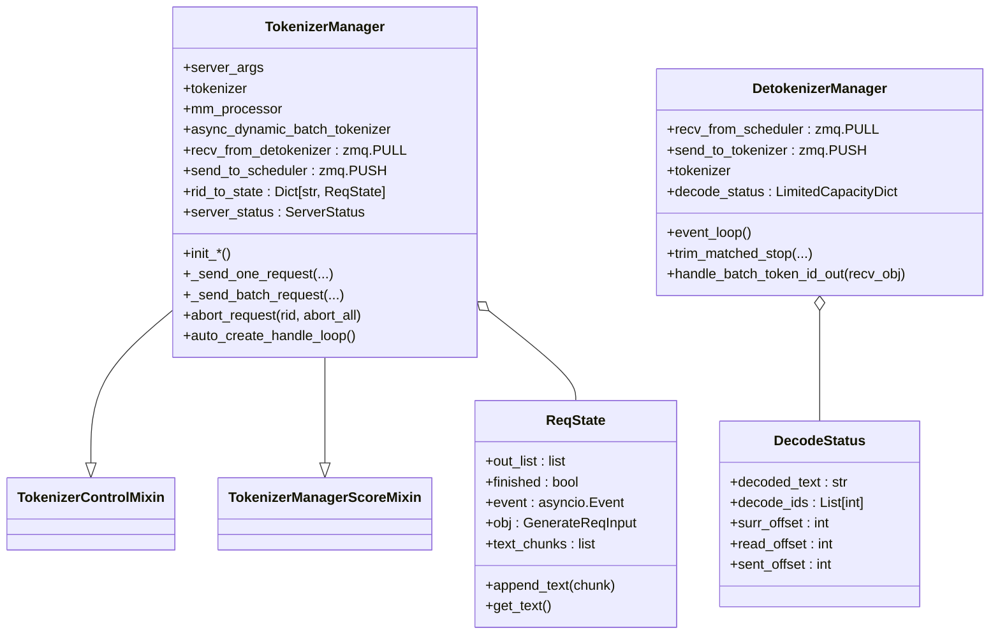

# `TokenizerManager` (and `DetokenizerManager`, `ReqState`, `DecodeStatus`)

## Summary
`TokenizerManager` 是 SGLang 的**前端进程主体**——跑在主进程，承担 tokenize / 请求路由 / abort / 流式聚合 / metrics。`DetokenizerManager` 是反向的镜像，跑在独立子进程，把 token id 流式 detokenize 后回送。两者通过 ZMQ socket 与 `Scheduler` 子进程通信。HEAD `f7101b0a`（自 `06f32bab` 起）控制面 mixin 已从 `TokenizerCommunicatorMixin` 重命名为 [`TokenizerControlMixin`](d:\design\sglang\python\sglang\srt\managers\tokenizer_control_mixin.py)（`tokenizer_communicator_mixin.py` **已删除**）。

## Sources
- [tokenizer_manager.py](d:\design\sglang\python\sglang\srt\managers\tokenizer_manager.py)（~3665 行；`ReqState` L215；`TokenizerManager` L386；`SignalHandler` L3620）
- [detokenizer_manager.py](d:\design\sglang\python\sglang\srt\managers\detokenizer_manager.py)（`DecodeStatus` L65；`DetokenizerManager` L92）
- mixin：[tokenizer_control_mixin.py](d:\design\sglang\python\sglang\srt\managers\tokenizer_control_mixin.py)（`TokenizerControlMixin` L148）、[tokenizer_manager_score_mixin.py](d:\design\sglang\python\sglang\srt\managers\tokenizer_manager_score_mixin.py)、[multi_tokenizer_mixin.py](d:\design\sglang\python\sglang\srt\managers\multi_tokenizer_mixin.py)

## 类层次



精确 MRO：[tokenizer_manager.py:386](d:\design\sglang\python\sglang\srt\managers\tokenizer_manager.py)

```python
class TokenizerManager(TokenizerControlMixin, TokenizerManagerScoreMixin):
```

`TokenizerControlMixin` docstring 标明职责为 control-plane（weights / cache / lora / profile / internal state），经 `FanOutCommunicator` 与 scheduler 通信，区别于按 `rid` 复用的 data-plane 推理路径 — [tokenizer_control_mixin.py:148-152](d:\design\sglang\python\sglang\srt\managers\tokenizer_control_mixin.py)。

## `ReqState` （[tokenizer_manager.py:215-295](d:\design\sglang\python\sglang\srt\managers\tokenizer_manager.py)）

每个活跃请求一个，状态机：

| 字段 | 用途 |
|---|---|
| `out_list` | 流式输出 chunk 队列 |
| `finished` | 完成标志 |
| `event: asyncio.Event` | 唤醒等待协程 |
| `obj: GenerateReqInput \| EmbeddingReqInput` | 原始请求对象 |
| `text` / `text_chunks` | 累积文本（懒拼接） |

| 方法 | 行号 | 说明 |
|---|---|---|
| `append_text(chunk)` | [236-238](d:\design\sglang\python\sglang\srt\managers\tokenizer_manager.py) | 追加文本 chunk |
| `get_text()` | [240-244](d:\design\sglang\python\sglang\srt\managers\tokenizer_manager.py) | flush `text_chunks` 后返回累积文本 |
| `get_crash_dump_output()` | [246-252](d:\design\sglang\python\sglang\srt\managers\tokenizer_manager.py) | 崩溃 dump |

> synthesis: 旧页曾写 `rid` 字段在 `ReqState` 上；当前 dataclass **无** `rid` 字段——`rid` 是 `rid_to_state` 字典的 key（[tokenizer_manager.py:581](d:\design\sglang\python\sglang\srt\managers\tokenizer_manager.py)）。

## `TokenizerManager.__init__` （[tokenizer_manager.py:399-460](d:\design\sglang\python\sglang\srt\managers\tokenizer_manager.py)）

初始化序列（每步是独立 init 方法；开头先 `set_global_server_args_for_tokenizer(server_args)`，[L408-410](d:\design\sglang\python\sglang\srt\managers\tokenizer_manager.py)，见 §Increment 2026-08-18）：

```python
self.init_model_config()                    # 462
self._validate_cuda_vmm_feature_transport_support()  # 534
self.init_tokenizer_and_processor()         # 479
self.init_ipc_channels(port_args)           # 547
self.init_running_status()                  # 579
self.init_request_logging_and_dumping()     # 596
self.init_weight_update()                   # 623
self.init_lora()                            # 640
self.init_disaggregation(...)               # 659
self.init_metric_collector_watchdog()       # 695
self.init_request_dispatcher()              # 742（内部调 init_communicators）
# 最后构造 CudaVmmFeatureTransport          # 458-460
```

### 关键初始化

#### `init_tokenizer_and_processor` （[tokenizer_manager.py:479-532](d:\design\sglang\python\sglang\srt\managers\tokenizer_manager.py)）
- 多模态（且非 `language_model_only`）：`get_mm_processor(...)` + `get_tokenizer_from_processor(self.processor)` + `os.environ["TOKENIZERS_PARALLELISM"] = "false"`（[483-506](d:\design\sglang\python\sglang\srt\managers\tokenizer_manager.py)）
- 非多模态：`get_tokenizer(get_serving().tokenizer_path, ...)`（[507-519](d:\design\sglang\python\sglang\srt\managers\tokenizer_manager.py)）
- 动态 batch tokenize：条件启用 `AsyncDynamicbatchTokenizer(...)`（[521-532](d:\design\sglang\python\sglang\srt\managers\tokenizer_manager.py)）

#### `init_ipc_channels` （[tokenizer_manager.py:547-567](d:\design\sglang\python\sglang\srt\managers\tokenizer_manager.py)）
- `recv_from_detokenizer = get_zmq_socket(context, zmq.PULL, port_args.tokenizer_ipc_name, True)` ([549-551](d:\design\sglang\python\sglang\srt\managers\tokenizer_manager.py))
- 单 tokenizer worker：`send_to_scheduler = get_zmq_socket(..., zmq.PUSH, port_args.scheduler_input_ipc_name, True)` ([552-556](d:\design\sglang\python\sglang\srt\managers\tokenizer_manager.py))
- 多 tokenizer worker：PUSH 到 `port_args.tokenizer_worker_ipc_name`，并保存 `self.tokenizer_ipc_name = port_args.tokenizer_ipc_name` 供 `_dispatch_to_scheduler` 调用 `stamp_http_worker_ipc`（[557-562](d:\design\sglang\python\sglang\srt\managers\tokenizer_manager.py)、[569-572](d:\design\sglang\python\sglang\srt\managers\tokenizer_manager.py)、[3656-3665](d:\design\sglang\python\sglang\srt\managers\tokenizer_manager.py)）
- 末尾创建 `load_snapshot_reader = create_load_snapshot_reader(port_args, caller="TokenizerManager")`（[564-567](d:\design\sglang\python\sglang\srt\managers\tokenizer_manager.py)；本期去掉了 `server_args` 首参）

> synthesis: 旧页写的 `SenderWrapper` 包装路径已移除；多 worker 路由改为 `stamp_http_worker_ipc` + `MultiTokenizerRouter`（[multi_tokenizer_mixin.py:429](d:\design\sglang\python\sglang\srt\managers\multi_tokenizer_mixin.py)）。

#### `init_running_status` （[tokenizer_manager.py:579-594](d:\design\sglang\python\sglang\srt\managers\tokenizer_manager.py)）
- `rid_to_state: Dict[str, ReqState] = {}`（[581](d:\design\sglang\python\sglang\srt\managers\tokenizer_manager.py)）— **响应路由表**
- `server_status: ServerStatus = ServerStatus.Starting`（[586](d:\design\sglang\python\sglang\srt\managers\tokenizer_manager.py)）
- `gracefully_exit = False`（[587](d:\design\sglang\python\sglang\srt\managers\tokenizer_manager.py)）
- `last_receive_tstamp = real_time()`（[588](d:\design\sglang\python\sglang\srt\managers\tokenizer_manager.py)）
- session：`session_futures = {}`（[591](d:\design\sglang\python\sglang\srt\managers\tokenizer_manager.py)）
- `_subprocess_watchdog = None`（外部填，[592-594](d:\design\sglang\python\sglang\srt\managers\tokenizer_manager.py)）

#### `init_request_dispatcher` + control communicators（[tokenizer_manager.py:742-763](d:\design\sglang\python\sglang\srt\managers\tokenizer_manager.py)）
- 注册 abort / session / weight / health / elastic 等结果类型后调用 `self.init_communicators(self.server_args)`（[761](d:\design\sglang\python\sglang\srt\managers\tokenizer_manager.py)）→ [`TokenizerControlMixin.init_communicators`](d:\design\sglang\python\sglang\srt\managers\tokenizer_control_mixin.py)（[154-167](d:\design\sglang\python\sglang\srt\managers\tokenizer_control_mixin.py)；`FanOutCommunicator` fan-out 现读 `get_parallel().dp_size`）

## 关键 API

| 方法 | 行号 | 说明 |
|---|---|---|
| `_dispatch_to_scheduler(obj)` | [569-572](d:\design\sglang\python\sglang\srt\managers\tokenizer_manager.py) | 统一发往 scheduler（多 worker 时 stamp IPC；async 变体 `_async_dispatch_to_scheduler` 在 [574-577](d:\design\sglang\python\sglang\srt\managers\tokenizer_manager.py)） |
| `_send_one_request(...)` | [1597-1617](d:\design\sglang\python\sglang\srt\managers\tokenizer_manager.py) | 单个请求 → scheduler（含 cuda_vmm prepare） |
| `_send_batch_request(...)` | [1619-1650](d:\design\sglang\python\sglang\srt\managers\tokenizer_manager.py) | batch 请求 → scheduler |
| `_coalesce_streaming_chunks(...)` | [1652-1687](d:\design\sglang\python\sglang\srt\managers\tokenizer_manager.py) | 流式 chunk 合并 |
| `abort_request(rid, abort_all)` | [1991-2008](d:\design\sglang\python\sglang\srt\managers\tokenizer_manager.py) | abort（`AbortReq` → `_dispatch_to_scheduler`） |
| `_validate_one_request(...)` | [1196-...](d:\design\sglang\python\sglang\srt\managers\tokenizer_manager.py) | 输入校验 |
| `_validate_mm_limits(...)` | [1289-...](d:\design\sglang\python\sglang\srt\managers\tokenizer_manager.py) | 多模态限制校验 |
| `_validate_input_ids_in_vocab(...)` | [1352-...](d:\design\sglang\python\sglang\srt\managers\tokenizer_manager.py) | vocab 校验 |
| `_create_tokenized_object(...)` | [1370-...](d:\design\sglang\python\sglang\srt\managers\tokenizer_manager.py) | 构造 TokenizedGenerateReqInput |
| `_should_use_batch_tokenization(...)` | [1581-1595](d:\design\sglang\python\sglang\srt\managers\tokenizer_manager.py) | batch tokenize 决策 |
| `_handle_batch_output(...)` | [2214-...](d:\design\sglang\python\sglang\srt\managers\tokenizer_manager.py) | 处理来自 detokenizer 的 batch 输出 |
| `add_logprob_to_meta_info(...)` | [2507-...](d:\design\sglang\python\sglang\srt\managers\tokenizer_manager.py) | logprobs 添加 |
| `convert_logprob_style(...)` | [2648-...](d:\design\sglang\python\sglang\srt\managers\tokenizer_manager.py) | logprobs 格式 |
| `detokenize_logprob_tokens(...)` | [2725-...](d:\design\sglang\python\sglang\srt\managers\tokenizer_manager.py) | logprobs detokenize |
| `auto_create_handle_loop()` | [2174-2197](d:\design\sglang\python\sglang\srt\managers\tokenizer_manager.py) | 启动 asyncio 接收循环（`handle_loop` 在 [2199-2212](d:\design\sglang\python\sglang\srt\managers\tokenizer_manager.py)） |
| `dump_requests` / `dump_requests_before_crash` | [2920](d:\design\sglang\python\sglang\srt\managers\tokenizer_manager.py) / [3002](d:\design\sglang\python\sglang\srt\managers\tokenizer_manager.py) | crash dump |

## `DetokenizerManager` （[detokenizer_manager.py](d:\design\sglang\python\sglang\srt\managers\detokenizer_manager.py)）

### 构造（[detokenizer_manager.py:92-110](d:\design\sglang\python\sglang\srt\managers\detokenizer_manager.py)）

4 步：

```python
self.init_ipc_channels(port_args, server_args)  # 112
self.init_tokenizer(server_args)                # 125
self.init_running_status(server_args)           # 142
self.init_request_dispatcher()                  # 157
```

继承 `MultiHttpWorkerDetokenizerMixin`（[multi_tokenizer_mixin.py:392](d:\design\sglang\python\sglang\srt\managers\multi_tokenizer_mixin.py)）。

### IPC（[detokenizer_manager.py:112-123](d:\design\sglang\python\sglang\srt\managers\detokenizer_manager.py)）

```python
context = zmq.Context(2)
self.recv_from_scheduler = get_zmq_socket(context, zmq.PULL, port_args.detokenizer_ipc_name, True)
# tokenizer_worker_num == 1 时才建 send_to_tokenizer
self.send_to_tokenizer = get_zmq_socket(context, zmq.PUSH, port_args.tokenizer_ipc_name, False)
```

> synthesis: 注意 `send_to_tokenizer` 用的是 **`port_args.tokenizer_ipc_name`**——和 `TokenizerManager.recv_from_detokenizer` 同一个端点（[tokenizer_manager.py:549-551](d:\design\sglang\python\sglang\srt\managers\tokenizer_manager.py)），形成闭环。多 tokenizer worker 时单 socket 不用，改走 `SocketMapping`（注释 [117-120](d:\design\sglang\python\sglang\srt\managers\detokenizer_manager.py)）。

### `event_loop` （[detokenizer_manager.py:167-175](d:\design\sglang\python\sglang\srt\managers\detokenizer_manager.py)）

```python
def event_loop(self):
    while True:
        with self.soft_watchdog.disable():
            recv_obj = sock_recv(self.recv_from_scheduler)
        output = self._request_dispatcher(recv_obj)
        if output is not None:
            sock_send(self.send_to_tokenizer, output)
        self.soft_watchdog.feed()
```

走 `sock_recv` / `sock_send`（pickle 路径），不像 vllm 用 msgspec。

### Dispatcher（[detokenizer_manager.py:157-165](d:\design\sglang\python\sglang\srt\managers\detokenizer_manager.py)）

```python
TypeBasedDispatcher([
    (BatchEmbeddingOutput, self.handle_batch_embedding_out),
    (BatchTokenIDOutput, self.handle_batch_token_id_out),
    (FreezeGCReq, self.handle_freeze_gc_req),
    (ConfigureLoggingReq, self.handle_configure_logging_req),
])
```

### `DecodeStatus` （[detokenizer_manager.py:65-89](d:\design\sglang\python\sglang\srt\managers\detokenizer_manager.py)）

每个 rid 对应一个 `DecodeStatus`，存放：`decoded_text`, `decode_ids`, `surr_offset`, `read_offset`, `sent_offset`，另有 `decoded_text_chunks` 懒拼接 — **增量 detokenize 必需的状态**。

### `handle_batch_token_id_out` 与 `_decode_batch_token_id_output`

| 方法 | 行号 | 用途 |
|---|---|---|
| `handle_batch_token_id_out(recv_obj)` | [431-...](d:\design\sglang\python\sglang\srt\managers\detokenizer_manager.py) | 主入口 |
| `_decode_batch_token_id_output(recv_obj)` | [291-...](d:\design\sglang\python\sglang\srt\managers\detokenizer_manager.py) | 真正解码 |
| `_grouped_batch_decode(...)` | [227-...](d:\design\sglang\python\sglang\srt\managers\detokenizer_manager.py) | 按 rid 分组 batch decode |
| `trim_matched_stop(...)` | [177-...](d:\design\sglang\python\sglang\srt\managers\detokenizer_manager.py) | 命中 stop 后裁剪 |

## Increment 2026-08-18 (06f32bab → f7101b0a)

本期 tokenizer_manager.py +115/-94、detokenizer_manager.py +8/-4。类结构 / MRO / IPC 拓扑不变。实质变化：

- **Config bags 重构（#35022/#35023/#35026/#35028）**：`__init__` 开头即 `set_global_server_args_for_tokenizer(server_args)`（[tokenizer_manager.py:408-410](d:\design\sglang\python\sglang\srt\managers\tokenizer_manager.py)，注释明言 tokenizer-worker 进程的 first publish）；配置读取改走 bags：`get_parallel().dp_size`（[L412](d:\design\sglang\python\sglang\srt\managers\tokenizer_manager.py)）、`get_lora().enable_lora` / `lora_paths`（[L418](d:\design\sglang\python\sglang\srt\managers\tokenizer_manager.py)、[L646](d:\design\sglang\python\sglang\srt\managers\tokenizer_manager.py)）、`get_serving().tokenizer_path`（[L514](d:\design\sglang\python\sglang\srt\managers\tokenizer_manager.py)）、`get_mm().mm_feature_transport`（[L535](d:\design\sglang\python\sglang\srt\managers\tokenizer_manager.py)）、`get_disagg().disaggregation_mode`（[L661](d:\design\sglang\python\sglang\srt\managers\tokenizer_manager.py)）等。
- **per-instance `_config_updates` 列表已删除（#35022/#35028）**：control-plane 配置变更（weight update / parser / HiCache attach）不再存在 TM 实例上，`record_config_updates` 改写全进程共享的 config bags：`get_context().override(source, **fields)`（[L2065-2072](d:\design\sglang\python\sglang\srt\managers\tokenizer_manager.py)）；`config_value` 改读 `get_context().config_leaf(name)`（[L2074-2078](d:\design\sglang\python\sglang\srt\managers\tokenizer_manager.py)）；crash dump 里的 `config_updates` 改取 `get_context().overrides_log()`（[L2975](d:\design\sglang\python\sglang\srt\managers\tokenizer_manager.py)）。
- **VLM content-addressed 预处理缓存（#34398）**：新增 `_normalize_mm_content_hashes` 静态方法（[L1165-1193](d:\design\sglang\python\sglang\srt\managers\tokenizer_manager.py)），在 `generate_request` 入口对 `GenerateReqInput` 归一化 Native/OpenAI 两路 content hash（[L1059-1062](d:\design\sglang\python\sglang\srt\managers\tokenizer_manager.py)）；`flush_cache` 成功时同时 `mm_processor.clear_preprocess_cache()`（[L2056-2058](d:\design\sglang\python\sglang\srt\managers\tokenizer_manager.py)）。
- **cache_salt 透传（#30827）**：`_create_tokenized_object` 向 `TokenizedGenerateReqInput` 新增 `cache_salt=obj.cache_salt`（[L1445](d:\design\sglang\python\sglang\srt\managers\tokenizer_manager.py)）。
- **`language_model_only` 门控**：多模态 processor 仅在非 `language_model_only` 时初始化（[L483](d:\design\sglang\python\sglang\srt\managers\tokenizer_manager.py)）；带 mm 输入的请求在该 flag 下直接报错（[L1037-1041](d:\design\sglang\python\sglang\srt\managers\tokenizer_manager.py)）。
- **DetokenizerManager**：`run_detokenizer_process` 入口新增 `publish(server_args, role="detokenizer")`（[detokenizer_manager.py:524](d:\design\sglang\python\sglang\srt\managers\detokenizer_manager.py)）；`tokenizer_path` / `tool_call_parser` / `soft_watchdog_timeout` 改读 `get_serving()` / `get_device()` bag（[L129](d:\design\sglang\python\sglang\srt\managers\detokenizer_manager.py)、[L143-152](d:\design\sglang\python\sglang\srt\managers\detokenizer_manager.py)）。

> [!todo] VERIFY: 上游 #30023（tracing v2 异步导出）本期未直接改 tokenizer_manager.py / detokenizer_manager.py（`git log 06f32bab..HEAD` 两文件的 commit 列表中无该 PR）；其 scheduler 侧落点见 [Scheduler.md](Scheduler.md) §Increment 的 `flush_trace_batch`。TM 侧是否有间接行为变化（`req_time_stats` / `observability` 模块）未逐行核对。

## Notes / Caveats
> [!todo] VERIFY: ~~`SignalHandler` 与 `gracefully_exit` 状态机的精确流程。~~
> **RESOLVED 2026-04-19**（锚点 **2026-08-18** 复核）：`SignalHandler` 位于 [tokenizer_manager.py:3620-3639](d:\design\sglang\python\sglang\srt\managers\tokenizer_manager.py)；`auto_create_handle_loop` ([2174-2197](d:\design\sglang\python\sglang\srt\managers\tokenizer_manager.py)) 仅在主线程通过 `loop.add_signal_handler` 注册：`SIGTERM → sigterm_handler` 把 `gracefully_exit = True`（[3624-3628](d:\design\sglang\python\sglang\srt\managers\tokenizer_manager.py)）；`SIGQUIT → running_phase_sigquit_handler` 停 watchdog + `dump_requests_before_crash` + `kill_process_tree`（[3630-3639](d:\design\sglang\python\sglang\srt\managers\tokenizer_manager.py)）。
> [!todo] VERIFY: ~~`_send_one_request` 与 `_send_batch_request` 的实际 payload 类型。~~
> **RESOLVED 2026-04-19**（锚点 **2026-08-18** 复核）：`_send_one_request` ([1597-1617](d:\design\sglang\python\sglang\srt\managers\tokenizer_manager.py)) 经 `_dispatch_to_scheduler(tokenized_obj)`，类型为 `Union[TokenizedGenerateReqInput, TokenizedEmbeddingReqInput]`；`_send_batch_request` ([1619-1650](d:\design\sglang\python\sglang\srt\managers\tokenizer_manager.py)) 按首元素类型包成 `BatchTokenizedGenerateReqInput` / `BatchTokenizedEmbeddingReqInput`。
> [!todo] VERIFY: ~~多 tokenizer worker 模式下响应如何路由回正确 worker。~~
> **RESOLVED 2026-04-19**（机制更新 **2026-08-10**，锚点 **2026-08-18** 复核）：不再经 `SenderWrapper`；`_dispatch_to_scheduler` 调 `stamp_http_worker_ipc(obj, self.tokenizer_ipc_name)`（[569-572](d:\design\sglang\python\sglang\srt\managers\tokenizer_manager.py)、[3656-3665](d:\design\sglang\python\sglang\srt\managers\tokenizer_manager.py)）写入 `http_worker_ipc`；`MultiTokenizerRouter` ([multi_tokenizer_mixin.py:429](d:\design\sglang\python\sglang\srt\managers\multi_tokenizer_mixin.py)) 按该字段回投。
> [!warning] CONTRADICTION: `recv_pyobj`/`send_pyobj`（现为 `sock_recv`/`sock_send`）走 pickle，而 vllm 走 msgspec/cloudpickle。SGLang 这套吞吐 ceiling 受 pickle 性能影响（synthesis）。

## See also
- [modules/managers.md](../modules/managers.md)
- [entities/Scheduler.md](Scheduler.md)
- [topics/manager-pipeline.md](../topics/manager-pipeline.md)
- [topics/request-lifecycle.md](../topics/request-lifecycle.md)
