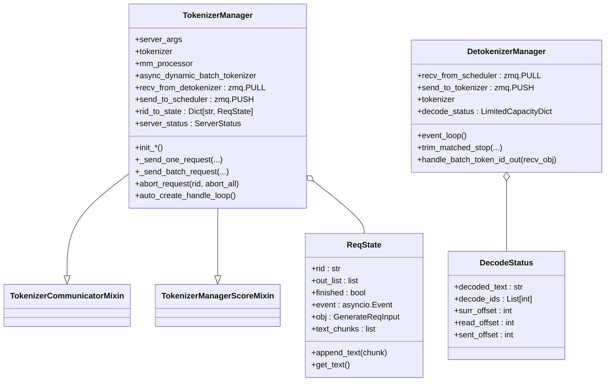

# `TokenizerManager` (and `DetokenizerManager`, `ReqState`, `DecodeStatus`)

## Summary
`TokenizerManager` 是 SGLang 的**前端进程主体**——跑在主进程，承担 tokenize / 请求路由 / abort / 流式聚合 / metrics。`DetokenizerManager` 是反向的镜像，跑在独立子进程，把 token id 流式 detokenize 后回送。两者通过 ZMQ socket 与 `Scheduler` 子进程通信。

## Sources
- [tokenizer_manager.py](d:\design\sglang\python\sglang\srt\managers\tokenizer_manager.py)（2700+ 行）
- [detokenizer_manager.py](d:\design\sglang\python\sglang\srt\managers\detokenizer_manager.py)
- mixin：[tokenizer_manager_score_mixin.py](d:\design\sglang\python\sglang\srt\managers\tokenizer_manager_score_mixin.py), [tokenizer_communicator_mixin.py](d:\design\sglang\python\sglang\srt\managers\tokenizer_communicator_mixin.py), [multi_tokenizer_mixin.py](d:\design\sglang\python\sglang\srt\managers\multi_tokenizer_mixin.py)

## 类层次



## `ReqState` （[tokenizer_manager.py:134-197](d:\design\sglang\python\sglang\srt\managers\tokenizer_manager.py)）

每个活跃请求一个，状态机：

| 字段 | 用途 |
|---|---|
| `rid` | request id |
| `out_list` | 流式输出 chunk 队列 |
| `finished` | 完成标志 |
| `event: asyncio.Event` | 唤醒等待协程 |
| `obj: GenerateReqInput` | 原始请求对象 |
| `text_chunks` | 累积文本 |

| 方法 | 行号 | 说明 |
|---|---|---|
| `append_text(chunk)` | [155-158](d:\design\sglang\python\sglang\srt\managers\tokenizer_manager.py) | 追加文本 |
| `get_text()` | [159-164](d:\design\sglang\python\sglang\srt\managers\tokenizer_manager.py) | 取累积文本 |
| `get_crash_dump_output()` | [165-...](d:\design\sglang\python\sglang\srt\managers\tokenizer_manager.py) | 崩溃时的 dump |

## `TokenizerManager.__init__` （[tokenizer_manager.py:218-258](d:\design\sglang\python\sglang\srt\managers\tokenizer_manager.py)）

8 步初始化（每步是一个独立 init 方法）：

```python
self.init_model_config()                    # 260
self.init_tokenizer_and_processor()         # 288
self.init_ipc_channels(port_args)           # 344
self.init_running_status()                  # 364
self.init_request_logging_and_dumping()     # 381
self.init_weight_update()                   # 405
self.init_lora()                            # 420
self.init_disaggregation()                  # 439
self.init_metric_collector_watchdog()       # 453
self.init_request_dispatcher()              # 487
```

### 关键初始化

#### `init_tokenizer_and_processor` （[tokenizer_manager.py:288-342](d:\design\sglang\python\sglang\srt\managers\tokenizer_manager.py)）
- 多模态：`get_mm_processor(...)` + `get_tokenizer_from_processor(self.processor)` + `os.environ["TOKENIZERS_PARALLELISM"] = "false"`（[tokenizer_manager.py:292-316](d:\design\sglang\python\sglang\srt\managers\tokenizer_manager.py)）
- 非多模态：`get_tokenizer(server_args.tokenizer_path, ...)`（[tokenizer_manager.py:317-329](d:\design\sglang\python\sglang\srt\managers\tokenizer_manager.py)）
- 动态 batch tokenize：`AsyncDynamicbatchTokenizer(...)`（[tokenizer_manager.py:331-342](d:\design\sglang\python\sglang\srt\managers\tokenizer_manager.py)）

#### `init_ipc_channels` （[tokenizer_manager.py:344-362](d:\design\sglang\python\sglang\srt\managers\tokenizer_manager.py)）
- `recv_from_detokenizer = get_zmq_socket(context, zmq.PULL, port_args.tokenizer_ipc_name, True)` ([346-348](d:\design\sglang\python\sglang\srt\managers\tokenizer_manager.py))
- 单 tokenizer worker：`send_to_scheduler = get_zmq_socket(context, zmq.PUSH, port_args.scheduler_input_ipc_name, True)` ([349-352](d:\design\sglang\python\sglang\srt\managers\tokenizer_manager.py))
- 多 tokenizer worker：`SenderWrapper(port_args, send_to_scheduler)` 包装，让每个请求自带 `tokenizer_ipc_name` 用于响应路由（[353-362](d:\design\sglang\python\sglang\srt\managers\tokenizer_manager.py)）

#### `init_running_status` （[tokenizer_manager.py:364-379](d:\design\sglang\python\sglang\srt\managers\tokenizer_manager.py)）
- `rid_to_state: Dict[str, ReqState] = {}`（[tokenizer_manager.py:366](d:\design\sglang\python\sglang\srt\managers\tokenizer_manager.py)）— **响应路由表**
- `server_status: ServerStatus = ServerStatus.Starting`（[tokenizer_manager.py:371](d:\design\sglang\python\sglang\srt\managers\tokenizer_manager.py)）
- `gracefully_exit = False`（[tokenizer_manager.py:372](d:\design\sglang\python\sglang\srt\managers\tokenizer_manager.py)）
- `last_receive_tstamp = real_time()`（[tokenizer_manager.py:373](d:\design\sglang\python\sglang\srt\managers\tokenizer_manager.py)）
- session：`session_futures = {}`（[tokenizer_manager.py:376](d:\design\sglang\python\sglang\srt\managers\tokenizer_manager.py)）
- `_subprocess_watchdog = None`（外部填，[tokenizer_manager.py:378-379](d:\design\sglang\python\sglang\srt\managers\tokenizer_manager.py)）

## 关键 API

| 方法 | 行号 | 说明 |
|---|---|---|
| `_send_one_request(...)` | [1153-1161](d:\design\sglang\python\sglang\srt\managers\tokenizer_manager.py) | 单个请求 → scheduler |
| `_send_batch_request(...)` | [1162-1177](d:\design\sglang\python\sglang\srt\managers\tokenizer_manager.py) | batch 请求 → scheduler |
| `_coalesce_streaming_chunks(...)` | [1178-...](d:\design\sglang\python\sglang\srt\managers\tokenizer_manager.py) | 流式 chunk 合并 |
| `abort_request(rid, abort_all)` | [1459-1468](d:\design\sglang\python\sglang\srt\managers\tokenizer_manager.py) | abort（向 scheduler 发 AbortReq） |
| `_validate_one_request(...)` | [809-890](d:\design\sglang\python\sglang\srt\managers\tokenizer_manager.py) | 输入校验 |
| `_validate_mm_limits(...)` | [891-905](d:\design\sglang\python\sglang\srt\managers\tokenizer_manager.py) | 多模态限制校验 |
| `_validate_input_ids_in_vocab(...)` | [934-951](d:\design\sglang\python\sglang\srt\managers\tokenizer_manager.py) | vocab 校验 |
| `_create_tokenized_object(...)` | [952-1043](d:\design\sglang\python\sglang\srt\managers\tokenizer_manager.py) | 构造 TokenizedGenerateReqInput |
| `_should_use_batch_tokenization(...)` | [1137-1152](d:\design\sglang\python\sglang\srt\managers\tokenizer_manager.py) | batch tokenize 决策 |
| `_handle_batch_output(...)` | [1620-1845](d:\design\sglang\python\sglang\srt\managers\tokenizer_manager.py) | 处理来自 detokenizer 的 batch 输出 |
| `add_logprob_to_meta_info(...)` | [1846-1932](d:\design\sglang\python\sglang\srt\managers\tokenizer_manager.py) | logprobs 添加 |
| `convert_logprob_style(...)` | [1933-2000](d:\design\sglang\python\sglang\srt\managers\tokenizer_manager.py) | logprobs 格式 |
| `detokenize_logprob_tokens(...)` | [2001-2020](d:\design\sglang\python\sglang\srt\managers\tokenizer_manager.py) | logprobs detokenize |
| `auto_create_handle_loop()` | [1586-1609](d:\design\sglang\python\sglang\srt\managers\tokenizer_manager.py) | 启动 asyncio 接收循环（`handle_loop` 在 [1611-1618](d:\design\sglang\python\sglang\srt\managers\tokenizer_manager.py)） |
| `dump_requests / dump_requests_before_crash` | [2154-2272](d:\design\sglang\python\sglang\srt\managers\tokenizer_manager.py) | crash dump |

## `DetokenizerManager` （[detokenizer_manager.py](d:\design\sglang\python\sglang\srt\managers\detokenizer_manager.py)）

### 构造（[detokenizer_manager.py:73-91](d:\design\sglang\python\sglang\srt\managers\detokenizer_manager.py)）

4 步：

```python
self.init_ipc_channels(port_args)          # 93
self.init_tokenizer(server_args)           # 102
self.init_running_status(server_args)      # 113
self.init_request_dispatcher()             # 128
```

### IPC（[detokenizer_manager.py:93-100](d:\design\sglang\python\sglang\srt\managers\detokenizer_manager.py)）

```python
context = zmq.Context(2)
self.recv_from_scheduler = get_zmq_socket(context, zmq.PULL, port_args.detokenizer_ipc_name, True)
self.send_to_tokenizer = get_zmq_socket(context, zmq.PUSH, port_args.tokenizer_ipc_name, False)
```

> synthesis: 注意 `send_to_tokenizer` 用的是 **`port_args.tokenizer_ipc_name`**——和 `TokenizerManager.recv_from_detokenizer` 同一个端点（[tokenizer_manager.py:346-348](d:\design\sglang\python\sglang\srt\managers\tokenizer_manager.py)），形成闭环。

### `event_loop` （[detokenizer_manager.py:137-145](d:\design\sglang\python\sglang\srt\managers\detokenizer_manager.py)）

```python
def event_loop(self):
    while True:
        with self.soft_watchdog.disable():
            recv_obj = self.recv_from_scheduler.recv_pyobj()
        output = self._request_dispatcher(recv_obj)
        if output is not None:
            self.send_to_tokenizer.send_pyobj(output)
        self.soft_watchdog.feed()
```

只用 `recv_pyobj` / `send_pyobj`（pickle），不像 vllm 用 msgspec — **更简单但更慢**。

### Dispatcher（[detokenizer_manager.py:128-135](d:\design\sglang\python\sglang\srt\managers\detokenizer_manager.py)）

```python
TypeBasedDispatcher([
    (BatchEmbeddingOutput, self.handle_batch_embedding_out),
    (BatchTokenIDOutput, self.handle_batch_token_id_out),
    (FreezeGCReq, self.handle_freeze_gc_req),
])
```

### `DecodeStatus` （[detokenizer_manager.py:62-71](d:\design\sglang\python\sglang\srt\managers\detokenizer_manager.py)）

每个 rid 对应一个 `DecodeStatus`，存放：`decoded_text`, `decode_ids`, `surr_offset`, `read_offset`, `sent_offset` — **增量 detokenize 必需的状态**（前 N 个 token 的字符 offset，避免每次重新 detokenize 整个序列）。

### `handle_batch_token_id_out` 与 `_decode_batch_token_id_output`

| 方法 | 行号 | 用途 |
|---|---|---|
| `handle_batch_token_id_out(recv_obj)` | [322-367](d:\design\sglang\python\sglang\srt\managers\detokenizer_manager.py) | 主入口 |
| `_decode_batch_token_id_output(recv_obj)` | [217-321](d:\design\sglang\python\sglang\srt\managers\detokenizer_manager.py) | 真正解码 |
| `_grouped_batch_decode(...)` | [178-216](d:\design\sglang\python\sglang\srt\managers\detokenizer_manager.py) | 按 rid 分组 batch decode |
| `trim_matched_stop(...)` | [147-173](d:\design\sglang\python\sglang\srt\managers\detokenizer_manager.py) | 命中 stop 后裁剪 |

## Notes / Caveats
> [!todo] VERIFY: ~~`SignalHandler` ([tokenizer_manager.py:2695-2705](d:\design\sglang\python\sglang\srt\managers\tokenizer_manager.py)) 与 `gracefully_exit` 状态机的精确流程。~~
> **RESOLVED 2026-04-19**: `SignalHandler` 类位于 [tokenizer_manager.py:2695-2714](d:\design\sglang\python\sglang\srt\managers\tokenizer_manager.py)；`auto_create_handle_loop` ([tokenizer_manager.py:1599-1605](d:\design\sglang\python\sglang\srt\managers\tokenizer_manager.py)) 仅在主线程通过 `loop.add_signal_handler` 注册：`SIGTERM → sigterm_handler` 把 `tokenizer_manager.gracefully_exit = True`（[2699-2703](d:\design\sglang\python\sglang\srt\managers\tokenizer_manager.py)）等 `sigterm_watchdog` 协程感知后 drain；`SIGQUIT → running_phase_sigquit_handler` 立即 stop subprocess watchdog + `dump_requests_before_crash` + `kill_process_tree(os.getpid())`（[2705-2714](d:\design\sglang\python\sglang\srt\managers\tokenizer_manager.py)）。
> [!todo] VERIFY: ~~`_send_one_request` 与 `_send_batch_request` 的实际 payload 类型（应是 `TokenizedGenerateReqInput`，待 confirmed）。~~
> **RESOLVED 2026-04-19**: 已确认。`_send_one_request` ([tokenizer_manager.py:1153-1161](d:\design\sglang\python\sglang\srt\managers\tokenizer_manager.py)) 直接 `send_pyobj(tokenized_obj)`，类型为 `Union[TokenizedGenerateReqInput, TokenizedEmbeddingReqInput]`；`_send_batch_request` ([tokenizer_manager.py:1162-1177](d:\design\sglang\python\sglang\srt\managers\tokenizer_manager.py)) 则按首元素类型包成 `BatchTokenizedGenerateReqInput` 或 `BatchTokenizedEmbeddingReqInput` 后再 `send_pyobj`。
> [!todo] VERIFY: ~~多 tokenizer worker 模式下 `SenderWrapper` 怎么把响应路由回正确的 worker（[tokenizer_manager.py:354-362](d:\design\sglang\python\sglang\srt\managers\tokenizer_manager.py)）— 在 [multi_tokenizer_mixin.py](d:\design\sglang\python\sglang\srt\managers\multi_tokenizer_mixin.py)。~~
> **RESOLVED 2026-04-19**: `multi_tokenizer_mixin.SenderWrapper` ([multi_tokenizer_mixin.py:509-517](d:\design\sglang\python\sglang\srt\managers\multi_tokenizer_mixin.py)) 在 `send_pyobj(obj)` 时若 `isinstance(obj, BaseReq)` 即设 `obj.http_worker_ipc = self.port_args.tokenizer_ipc_name`，把当前 worker 的 PULL 端口名嵌入请求；scheduler 侧响应（detokenizer 同理）按这个字段把输出投回对应 worker，由 `MultiTokenizerRouter` ([multi_tokenizer_mixin.py:317](d:\design\sglang\python\sglang\srt\managers\multi_tokenizer_mixin.py)) 统一管理多 worker 的 IPC 路由。
> [!warning] CONTRADICTION: `recv_pyobj`/`send_pyobj` 走 pickle，而 vllm 走 msgspec/cloudpickle。SGLang 这套吞吐 ceiling 受 pickle 性能影响（synthesis）。

## See also
- [modules/managers.md](../modules/managers.md)
- [entities/Scheduler.md](Scheduler.md)
- [topics/manager-pipeline.md](../topics/manager-pipeline.md)
- [topics/request-lifecycle.md](../topics/request-lifecycle.md)
