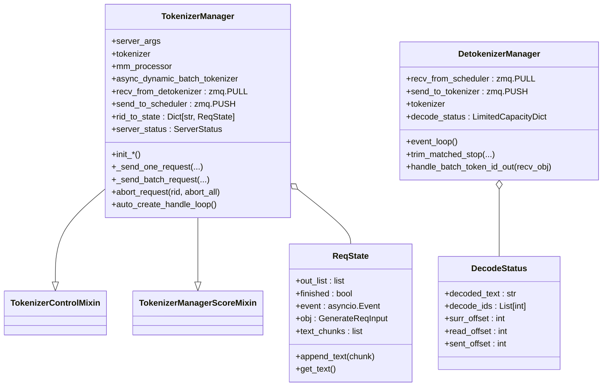

# `TokenizerManager` (and `DetokenizerManager`, `ReqState`, `DecodeStatus`)

## Summary
`TokenizerManager` 是 SGLang 的**前端进程主体**——跑在主进程，承担 tokenize / 请求路由 / abort / 流式聚合 / metrics。`DetokenizerManager` 是反向的镜像，跑在独立子进程，把 token id 流式 detokenize 后回送。两者通过 ZMQ socket 与 `Scheduler` 子进程通信。HEAD `06f32bab` 上控制面 mixin 已从 `TokenizerCommunicatorMixin` 重命名为 [`TokenizerControlMixin`](d:\design\sglang\python\sglang\srt\managers\tokenizer_control_mixin.py)（`tokenizer_communicator_mixin.py` **已删除**）。

## Sources
- [tokenizer_manager.py](d:\design\sglang\python\sglang\srt\managers\tokenizer_manager.py)（~3644 行；`ReqState` L200；`TokenizerManager` L373；`SignalHandler` L3599）
- [detokenizer_manager.py](d:\design\sglang\python\sglang\srt\managers\detokenizer_manager.py)（`DecodeStatus` L64；`DetokenizerManager` L91）
- mixin：[tokenizer_control_mixin.py](d:\design\sglang\python\sglang\srt\managers\tokenizer_control_mixin.py)（`TokenizerControlMixin` L147）、[tokenizer_manager_score_mixin.py](d:\design\sglang\python\sglang\srt\managers\tokenizer_manager_score_mixin.py)、[multi_tokenizer_mixin.py](d:\design\sglang\python\sglang\srt\managers\multi_tokenizer_mixin.py)

## 类层次



精确 MRO：[tokenizer_manager.py:373](d:\design\sglang\python\sglang\srt\managers\tokenizer_manager.py)

```python
class TokenizerManager(TokenizerControlMixin, TokenizerManagerScoreMixin):
```

`TokenizerControlMixin` docstring 标明职责为 control-plane（weights / cache / lora / profile / internal state），经 `FanOutCommunicator` 与 scheduler 通信，区别于按 `rid` 复用的 data-plane 推理路径 — [tokenizer_control_mixin.py:147-151](d:\design\sglang\python\sglang\srt\managers\tokenizer_control_mixin.py)。

## `ReqState` （[tokenizer_manager.py:200-280](d:\design\sglang\python\sglang\srt\managers\tokenizer_manager.py)）

每个活跃请求一个，状态机：

| 字段 | 用途 |
|---|---|
| `out_list` | 流式输出 chunk 队列 |
| `finished` | 完成标志 |
| `event: asyncio.Event` | 唤醒等待协程 |
| `obj: GenerateReqInput \| EmbeddingReqInput` | 原始请求对象 |
| `text` / `text_chunks` | 累积文本（懒拼接） |

| 方法 | 行号 | 说明 |
|---|---|---|
| `append_text(chunk)` | [221-223](d:\design\sglang\python\sglang\srt\managers\tokenizer_manager.py) | 追加文本 chunk |
| `get_text()` | [225-229](d:\design\sglang\python\sglang\srt\managers\tokenizer_manager.py) | flush `text_chunks` 后返回累积文本 |
| `get_crash_dump_output()` | [231-237](d:\design\sglang\python\sglang\srt\managers\tokenizer_manager.py) | 崩溃 dump |

> synthesis: 旧页曾写 `rid` 字段在 `ReqState` 上；当前 dataclass **无** `rid` 字段——`rid` 是 `rid_to_state` 字典的 key（[tokenizer_manager.py:568](d:\design\sglang\python\sglang\srt\managers\tokenizer_manager.py)）。

## `TokenizerManager.__init__` （[tokenizer_manager.py:386-446](d:\design\sglang\python\sglang\srt\managers\tokenizer_manager.py)）

初始化序列（每步是独立 init 方法）：

```python
self.init_model_config()                    # 448
self._validate_cuda_vmm_feature_transport_support()  # 520
self.init_tokenizer_and_processor()         # 465
self.init_ipc_channels(port_args)           # 533
self.init_running_status()                  # 566
self.init_request_logging_and_dumping()     # 583
self.init_weight_update()                   # 610
self.init_lora()                            # 627
self.init_disaggregation(...)               # 646
self.init_metric_collector_watchdog()       # 684
self.init_request_dispatcher()              # 731（内部调 init_communicators）
# 最后构造 CudaVmmFeatureTransport          # 444-446
```

### 关键初始化

#### `init_tokenizer_and_processor` （[tokenizer_manager.py:465-518](d:\design\sglang\python\sglang\srt\managers\tokenizer_manager.py)）
- 多模态：`get_mm_processor(...)` + `get_tokenizer_from_processor(self.processor)` + `os.environ["TOKENIZERS_PARALLELISM"] = "false"`（[469-492](d:\design\sglang\python\sglang\srt\managers\tokenizer_manager.py)）
- 非多模态：`get_tokenizer(server_args.tokenizer_path, ...)`（[493-505](d:\design\sglang\python\sglang\srt\managers\tokenizer_manager.py)）
- 动态 batch tokenize：条件启用 `AsyncDynamicbatchTokenizer(...)`（[507-518](d:\design\sglang\python\sglang\srt\managers\tokenizer_manager.py)）

#### `init_ipc_channels` （[tokenizer_manager.py:533-554](d:\design\sglang\python\sglang\srt\managers\tokenizer_manager.py)）
- `recv_from_detokenizer = get_zmq_socket(context, zmq.PULL, port_args.tokenizer_ipc_name, True)` ([535-537](d:\design\sglang\python\sglang\srt\managers\tokenizer_manager.py))
- 单 tokenizer worker：`send_to_scheduler = get_zmq_socket(..., zmq.PUSH, port_args.scheduler_input_ipc_name, True)` ([538-542](d:\design\sglang\python\sglang\srt\managers\tokenizer_manager.py))
- 多 tokenizer worker：PUSH 到 `port_args.tokenizer_worker_ipc_name`，并保存 `self.tokenizer_ipc_name = port_args.tokenizer_ipc_name` 供 `_dispatch_to_scheduler` 调用 `stamp_http_worker_ipc`（[543-548](d:\design\sglang\python\sglang\srt\managers\tokenizer_manager.py)、[556-559](d:\design\sglang\python\sglang\srt\managers\tokenizer_manager.py)、[3635-3644](d:\design\sglang\python\sglang\srt\managers\tokenizer_manager.py)）

> synthesis: 旧页写的 `SenderWrapper` 包装路径已移除；多 worker 路由改为 `stamp_http_worker_ipc` + `MultiTokenizerRouter`（[multi_tokenizer_mixin.py:429](d:\design\sglang\python\sglang\srt\managers\multi_tokenizer_mixin.py)）。

#### `init_running_status` （[tokenizer_manager.py:566-581](d:\design\sglang\python\sglang\srt\managers\tokenizer_manager.py)）
- `rid_to_state: Dict[str, ReqState] = {}`（[568](d:\design\sglang\python\sglang\srt\managers\tokenizer_manager.py)）— **响应路由表**
- `server_status: ServerStatus = ServerStatus.Starting`（[573](d:\design\sglang\python\sglang\srt\managers\tokenizer_manager.py)）
- `gracefully_exit = False`（[574](d:\design\sglang\python\sglang\srt\managers\tokenizer_manager.py)）
- `last_receive_tstamp = real_time()`（[575](d:\design\sglang\python\sglang\srt\managers\tokenizer_manager.py)）
- session：`session_futures = {}`（[578](d:\design\sglang\python\sglang\srt\managers\tokenizer_manager.py)）
- `_subprocess_watchdog = None`（外部填，[580-581](d:\design\sglang\python\sglang\srt\managers\tokenizer_manager.py)）

#### `init_request_dispatcher` + control communicators（[tokenizer_manager.py:731-752](d:\design\sglang\python\sglang\srt\managers\tokenizer_manager.py)）
- 注册 abort / session / weight / health / elastic 等结果类型后调用 `self.init_communicators(self.server_args)`（[749](d:\design\sglang\python\sglang\srt\managers\tokenizer_manager.py)）→ [`TokenizerControlMixin.init_communicators`](d:\design\sglang\python\sglang\srt\managers\tokenizer_control_mixin.py)（[153-165](d:\design\sglang\python\sglang\srt\managers\tokenizer_control_mixin.py)）

## 关键 API

| 方法 | 行号 | 说明 |
|---|---|---|
| `_dispatch_to_scheduler(obj)` | [556-559](d:\design\sglang\python\sglang\srt\managers\tokenizer_manager.py) | 统一发往 scheduler（多 worker 时 stamp IPC） |
| `_send_one_request(...)` | [1547-1568](d:\design\sglang\python\sglang\srt\managers\tokenizer_manager.py) | 单个请求 → scheduler（含 cuda_vmm prepare） |
| `_send_batch_request(...)` | [1569-1600](d:\design\sglang\python\sglang\srt\managers\tokenizer_manager.py) | batch 请求 → scheduler |
| `_coalesce_streaming_chunks(...)` | [1602-1637](d:\design\sglang\python\sglang\srt\managers\tokenizer_manager.py) | 流式 chunk 合并 |
| `abort_request(rid, abort_all)` | [1941-1958](d:\design\sglang\python\sglang\srt\managers\tokenizer_manager.py) | abort（`AbortReq` → `_dispatch_to_scheduler`） |
| `_validate_one_request(...)` | [1147-...](d:\design\sglang\python\sglang\srt\managers\tokenizer_manager.py) | 输入校验 |
| `_validate_mm_limits(...)` | [1240-...](d:\design\sglang\python\sglang\srt\managers\tokenizer_manager.py) | 多模态限制校验 |
| `_validate_input_ids_in_vocab(...)` | [1303-...](d:\design\sglang\python\sglang\srt\managers\tokenizer_manager.py) | vocab 校验 |
| `_create_tokenized_object(...)` | [1321-...](d:\design\sglang\python\sglang\srt\managers\tokenizer_manager.py) | 构造 TokenizedGenerateReqInput |
| `_should_use_batch_tokenization(...)` | [1531-1545](d:\design\sglang\python\sglang\srt\managers\tokenizer_manager.py) | batch tokenize 决策 |
| `_handle_batch_output(...)` | [2174-...](d:\design\sglang\python\sglang\srt\managers\tokenizer_manager.py) | 处理来自 detokenizer 的 batch 输出 |
| `add_logprob_to_meta_info(...)` | [2467-...](d:\design\sglang\python\sglang\srt\managers\tokenizer_manager.py) | logprobs 添加 |
| `convert_logprob_style(...)` | [2608-...](d:\design\sglang\python\sglang\srt\managers\tokenizer_manager.py) | logprobs 格式 |
| `detokenize_logprob_tokens(...)` | [2685-...](d:\design\sglang\python\sglang\srt\managers\tokenizer_manager.py) | logprobs detokenize |
| `auto_create_handle_loop()` | [2134-2157](d:\design\sglang\python\sglang\srt\managers\tokenizer_manager.py) | 启动 asyncio 接收循环（`handle_loop` 在 [2159-2172](d:\design\sglang\python\sglang\srt\managers\tokenizer_manager.py)） |
| `dump_requests` / `dump_requests_before_crash` | [2880](d:\design\sglang\python\sglang\srt\managers\tokenizer_manager.py) / [2962](d:\design\sglang\python\sglang\srt\managers\tokenizer_manager.py) | crash dump |

## `DetokenizerManager` （[detokenizer_manager.py](d:\design\sglang\python\sglang\srt\managers\detokenizer_manager.py)）

### 构造（[detokenizer_manager.py:91-109](d:\design\sglang\python\sglang\srt\managers\detokenizer_manager.py)）

4 步：

```python
self.init_ipc_channels(port_args, server_args)  # 111
self.init_tokenizer(server_args)                # 124
self.init_running_status(server_args)           # 141
self.init_request_dispatcher()                  # 156
```

继承 `MultiHttpWorkerDetokenizerMixin`（[multi_tokenizer_mixin.py:392](d:\design\sglang\python\sglang\srt\managers\multi_tokenizer_mixin.py)）。

### IPC（[detokenizer_manager.py:111-122](d:\design\sglang\python\sglang\srt\managers\detokenizer_manager.py)）

```python
context = zmq.Context(2)
self.recv_from_scheduler = get_zmq_socket(context, zmq.PULL, port_args.detokenizer_ipc_name, True)
# tokenizer_worker_num == 1 时才建 send_to_tokenizer
self.send_to_tokenizer = get_zmq_socket(context, zmq.PUSH, port_args.tokenizer_ipc_name, False)
```

> synthesis: 注意 `send_to_tokenizer` 用的是 **`port_args.tokenizer_ipc_name`**——和 `TokenizerManager.recv_from_detokenizer` 同一个端点（[tokenizer_manager.py:535-537](d:\design\sglang\python\sglang\srt\managers\tokenizer_manager.py)），形成闭环。多 tokenizer worker 时单 socket 不用，改走 `SocketMapping`（注释 [116-118](d:\design\sglang\python\sglang\srt\managers\detokenizer_manager.py)）。

### `event_loop` （[detokenizer_manager.py:166-174](d:\design\sglang\python\sglang\srt\managers\detokenizer_manager.py)）

```python
def event_loop(self):
    while True:
        with self.soft_watchdog.disable():
            recv_obj = sock_recv(self.recv_from_scheduler)
        output = self._request_dispatcher(recv_obj)
        if output is not None:
            sock_send(self.send_to_tokenizer, output)
        self.soft_watchdog.feed()
```

走 `sock_recv` / `sock_send`（pickle 路径），不像 vllm 用 msgspec。

### Dispatcher（[detokenizer_manager.py:156-164](d:\design\sglang\python\sglang\srt\managers\detokenizer_manager.py)）

```python
TypeBasedDispatcher([
    (BatchEmbeddingOutput, self.handle_batch_embedding_out),
    (BatchTokenIDOutput, self.handle_batch_token_id_out),
    (FreezeGCReq, self.handle_freeze_gc_req),
    (ConfigureLoggingReq, self.handle_configure_logging_req),
])
```

### `DecodeStatus` （[detokenizer_manager.py:64-88](d:\design\sglang\python\sglang\srt\managers\detokenizer_manager.py)）

每个 rid 对应一个 `DecodeStatus`，存放：`decoded_text`, `decode_ids`, `surr_offset`, `read_offset`, `sent_offset`，另有 `decoded_text_chunks` 懒拼接 — **增量 detokenize 必需的状态**。

### `handle_batch_token_id_out` 与 `_decode_batch_token_id_output`

| 方法 | 行号 | 用途 |
|---|---|---|
| `handle_batch_token_id_out(recv_obj)` | [430-...](d:\design\sglang\python\sglang\srt\managers\detokenizer_manager.py) | 主入口 |
| `_decode_batch_token_id_output(recv_obj)` | [290-...](d:\design\sglang\python\sglang\srt\managers\detokenizer_manager.py) | 真正解码 |
| `_grouped_batch_decode(...)` | [226-...](d:\design\sglang\python\sglang\srt\managers\detokenizer_manager.py) | 按 rid 分组 batch decode |
| `trim_matched_stop(...)` | [176-...](d:\design\sglang\python\sglang\srt\managers\detokenizer_manager.py) | 命中 stop 后裁剪 |

## Notes / Caveats
> [!todo] VERIFY: ~~`SignalHandler` 与 `gracefully_exit` 状态机的精确流程。~~
> **RESOLVED 2026-04-19**（锚点 **2026-08-10** 复核）：`SignalHandler` 位于 [tokenizer_manager.py:3599-3618](d:\design\sglang\python\sglang\srt\managers\tokenizer_manager.py)；`auto_create_handle_loop` ([2134-2153](d:\design\sglang\python\sglang\srt\managers\tokenizer_manager.py)) 仅在主线程通过 `loop.add_signal_handler` 注册：`SIGTERM → sigterm_handler` 把 `gracefully_exit = True`（[3603-3607](d:\design\sglang\python\sglang\srt\managers\tokenizer_manager.py)）；`SIGQUIT → running_phase_sigquit_handler` 停 watchdog + `dump_requests_before_crash` + `kill_process_tree`（[3609-3618](d:\design\sglang\python\sglang\srt\managers\tokenizer_manager.py)）。
> [!todo] VERIFY: ~~`_send_one_request` 与 `_send_batch_request` 的实际 payload 类型。~~
> **RESOLVED 2026-04-19**（锚点 **2026-08-10** 复核）：`_send_one_request` ([1547-1568](d:\design\sglang\python\sglang\srt\managers\tokenizer_manager.py)) 经 `_dispatch_to_scheduler(tokenized_obj)`，类型为 `Union[TokenizedGenerateReqInput, TokenizedEmbeddingReqInput]`；`_send_batch_request` ([1569-1600](d:\design\sglang\python\sglang\srt\managers\tokenizer_manager.py)) 按首元素类型包成 `BatchTokenizedGenerateReqInput` / `BatchTokenizedEmbeddingReqInput`。
> [!todo] VERIFY: ~~多 tokenizer worker 模式下响应如何路由回正确 worker。~~
> **RESOLVED 2026-04-19**（机制更新 **2026-08-10**）：不再经 `SenderWrapper`；`_dispatch_to_scheduler` 调 `stamp_http_worker_ipc(obj, self.tokenizer_ipc_name)`（[556-559](d:\design\sglang\python\sglang\srt\managers\tokenizer_manager.py)、[3635-3644](d:\design\sglang\python\sglang\srt\managers\tokenizer_manager.py)）写入 `http_worker_ipc`；`MultiTokenizerRouter` ([multi_tokenizer_mixin.py:429](d:\design\sglang\python\sglang\srt\managers\multi_tokenizer_mixin.py)) 按该字段回投。
> [!warning] CONTRADICTION: `recv_pyobj`/`send_pyobj`（现为 `sock_recv`/`sock_send`）走 pickle，而 vllm 走 msgspec/cloudpickle。SGLang 这套吞吐 ceiling 受 pickle 性能影响（synthesis）。

## See also
- [modules/managers.md](../modules/managers.md)
- [entities/Scheduler.md](Scheduler.md)
- [topics/manager-pipeline.md](../topics/manager-pipeline.md)
- [topics/request-lifecycle.md](../topics/request-lifecycle.md)
