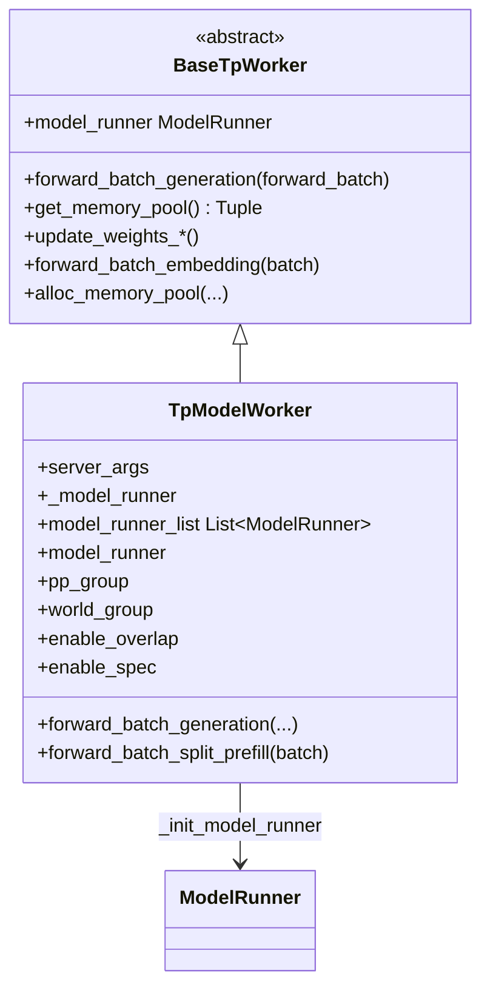
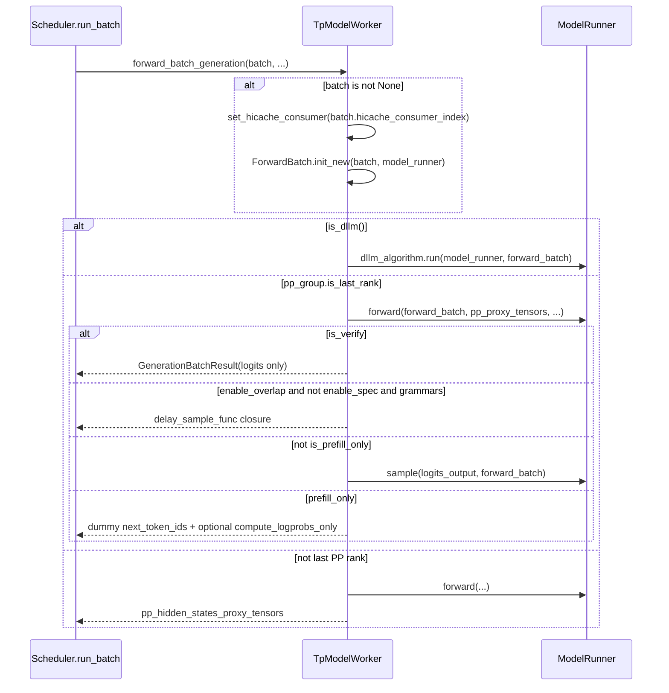

# `TpModelWorker` (and `BaseTpWorker`)

## Summary

`BaseTpWorker` 定义调度器侧共用的 **tensor parallel worker 契约**（抽象 `forward_batch_generation`、抽象 `model_runner`、以及权重更新 / LoRA / `get_memory_pool` 等）；[`TpModelWorker`](d:\design\sglang\python\sglang\srt\managers\tp_worker.py) 是其主实现：在 `__init__` 中构造 [`ModelRunner`](d:\design\sglang\python\sglang\srt\model_executor\model_runner.py)，并在 `forward_batch_generation` 内串联 `ModelRunner.forward` 与 `ModelRunner.sample`（及 PP / DLLM / prefill-only / overlap+grammar 等分支）。**与 [Scheduler.md](Scheduler.md) 的分工**：[Scheduler.md](Scheduler.md) 保留"每个 scheduler 子进程如何被 Engine 拉起、ZMQ 事件循环、`run_batch` 如何把 batch 交给 worker"的**调度器视角**；本页只写 **`TpModelWorker` / `BaseTpWorker` 自身状态与 forward 语义**，不重复 scheduler 主循环；两页通过 §See also 互链。

HEAD `06f32bab`：`model_runner.py` 已缩至 ~2056 行，部分职责拆到 [`model_runner_components/`](d:\design\sglang\python\sglang\srt\model_executor\model_runner_components)（attention backend / cuda graph / KV pool / weight updater 等）。

## Sources

- [`tp_worker.py` 全文](d:\design\sglang\python\sglang\srt\managers\tp_worker.py)（`BaseTpWorker` L73；`TpModelWorker` L298；~688 行）
- [`ModelRunner` 类与 `__init__`](d:\design\sglang\python\sglang\srt\model_executor\model_runner.py)（[L285-302](d:\design\sglang\python\sglang\srt\model_executor\model_runner.py)；整文件 ~2056 行）
- `ModelRunner.forward` / `sample` / `compute_logprobs_only`（[L1454](d:\design\sglang\python\sglang\srt\model_executor\model_runner.py) / [L1715](d:\design\sglang\python\sglang\srt\model_executor\model_runner.py) / [L1751](d:\design\sglang\python\sglang\srt\model_executor\model_runner.py)）
- [`model_runner_components/`](d:\design\sglang\python\sglang\srt\model_executor\model_runner_components)（拆出的 setup / weight / KV 等组件）
- `EagleDraftWorker` 构造 draft `TpModelWorker`（[eagle_worker_v2.py:167-176](d:\design\sglang\python\sglang\srt\speculative\eagle_worker_v2.py)）
- Scheduler：`init_tp_model_worker` / `init_memory_pools` / `init_model_worker` / `run_batch` / `launch_batch_sample_if_needed`（[scheduler.py:894-910](d:\design\sglang\python\sglang\srt\managers\scheduler.py)、[955-964](d:\design\sglang\python\sglang\srt\managers\scheduler.py)、[979-1008](d:\design\sglang\python\sglang\srt\managers\scheduler.py)、[3599](d:\design\sglang\python\sglang\srt\managers\scheduler.py)、[3857](d:\design\sglang\python\sglang\srt\managers\scheduler.py)）

## 类层次（mermaid classDiagram + 字段表）

| 字段 / 属性 | 含义（简述） | 锚点 |
|-------------|--------------|------|
| `server_args` / `ps` / `gpu_id` / `nccl_port` | 并行与设备身份（经 `ParallelState`） | [tp_worker.py:316-320](d:\design\sglang\python\sglang\srt\managers\tp_worker.py) |
| `is_draft_worker` / `req_to_token_pool` / `token_to_kv_pool_allocator` / `memory_pool_config` | draft 与 target 间可注入共享 pool | [tp_worker.py:320-325](d:\design\sglang\python\sglang\srt\managers\tp_worker.py) |
| `model_runner_list` | MTP / multi-layer EAGLE 多 `ModelRunner` | [tp_worker.py:333](d:\design\sglang\python\sglang\srt\managers\tp_worker.py)、[468-488](d:\design\sglang\python\sglang\srt\managers\tp_worker.py) |
| `_model_runner` / `model_runner` property | 主 `ModelRunner` | [tp_worker.py:450-466, 498-500](d:\design\sglang\python\sglang\srt\managers\tp_worker.py) |
| `tokenizer` / `processor` | 文本或多模态 tokenizer | [tp_worker.py:343-365](d:\design\sglang\python\sglang\srt\managers\tp_worker.py) |
| `device` | 来自 `model_runner.device` | [tp_worker.py:366](d:\design\sglang\python\sglang\srt\managers\tp_worker.py) |
| `pp_group` / `world_group` | NCCL / 分布式组句柄 | [tp_worker.py:368-370](d:\design\sglang\python\sglang\srt\managers\tp_worker.py) |
| `random_seed` | `broadcast_pyobj` 后 `set_random_seed` | [tp_worker.py:372-383](d:\design\sglang\python\sglang\srt\managers\tp_worker.py) |
| `enable_overlap` / `enable_spec` | overlap 调度与 speculative 标志 | [tp_worker.py:385-386](d:\design\sglang\python\sglang\srt\managers\tp_worker.py) |
| `hicache_layer_transfer_counter` | HiCache 层传输 consumer 协调 | [tp_worker.py:387, 502-507](d:\design\sglang\python\sglang\srt\managers\tp_worker.py) |
| `dllm_algorithm` | Diffusion LLM 算法对象（可选） | [tp_worker.py:490-496](d:\design\sglang\python\sglang\srt\managers\tp_worker.py) |

`synthesis:` MLX 后端可走 `MlxTpModelWorker` 分支，见 [scheduler.py:903-910](d:\design\sglang\python\sglang\srt\managers\scheduler.py)，与本页 `TpModelWorker` 为并列 worker 实现。

## `__init__` 序列

1. **解析参数**：`server_args`、`ps`、`gpu_id`、`nccl_port`、draft 与 pool 注入字段等，[tp_worker.py:315-330](d:\design\sglang\python\sglang\srt\managers\tp_worker.py)。
2. **`model_runner_list: List[ModelRunner] = []`**（MTP / 后续 multi-layer EAGLE 用），[tp_worker.py:332-333](d:\design\sglang\python\sglang\srt\managers\tp_worker.py)。
3. **`_init_model_config()` + `_init_model_runner()`**，[tp_worker.py:335-336, 431-466](d:\design\sglang\python\sglang\srt\managers\tp_worker.py)。
4. **可选**：`is_multi_layer_eagle` 时 `_init_multi_layer_eagle_model_runners()`；随后 `_init_dllm_algorithm()`，[tp_worker.py:338-341, 468-496](d:\design\sglang\python\sglang\srt\managers\tp_worker.py)。
5. **Tokenizer**：`skip_tokenizer_init` 或 draft 则置 `None`，否则 multimodal 用 `processor`+`tokenizer`，[tp_worker.py:343-365](d:\design\sglang\python\sglang\srt\managers\tp_worker.py)。
6. **`device = model_runner.device`**，[tp_worker.py:366](d:\design\sglang\python\sglang\srt\managers\tp_worker.py)；**`pp_group` / `world_group`**，[tp_worker.py:368-370](d:\design\sglang\python\sglang\srt\managers\tp_worker.py)。
7. **`broadcast_pyobj` + `set_random_seed`**（elastic joiner 跳过 broadcast），[tp_worker.py:372-383](d:\design\sglang\python\sglang\srt\managers\tp_worker.py)。
8. **`enable_overlap` / `enable_spec` 与 `hicache_layer_transfer_counter`**，[tp_worker.py:385-387](d:\design\sglang\python\sglang\srt\managers\tp_worker.py)。

> synthesis: 内存预算（`max_total_num_tokens` 等）不再在 `__init__` 末尾断言；改为后续 `alloc_memory_pool`（[389-415](d:\design\sglang\python\sglang\srt\managers\tp_worker.py)）+ `get_worker_info`（[512-531](d:\design\sglang\python\sglang\srt\managers\tp_worker.py)），由 Scheduler `init_memory_pools` / `init_model_worker` 驱动。

## `forward_batch_generation` 主流程

入口：[tp_worker.py:561-661](d:\design\sglang\python\sglang\srt\managers\tp_worker.py)。

- **DLLM**：若 `is_dllm()`，走 `_forward_batch_generation_dllm`，[tp_worker.py:592-593, 536-559](d:\design\sglang\python\sglang\srt\managers\tp_worker.py)。
- **PP 末段 vs 非末段**：`pp_group.is_last_rank` 为真时完成 logits 与采样相关逻辑；否则返回 `pp_hidden_states_proxy_tensors`，[tp_worker.py:595-661](d:\design\sglang\python\sglang\srt\managers\tp_worker.py)。
- **overlap + grammar（非 spec）**：当 `enable_overlap and not enable_spec and grammars is not None` 时，不立即 `sample`，而是设置 `delay_sample_func` 闭包，[tp_worker.py:613-626](d:\design\sglang\python\sglang\srt\managers\tp_worker.py)；scheduler 在 `launch_batch_sample_if_needed` 中延后调用，[scheduler.py:3857](d:\design\sglang\python\sglang\srt\managers\scheduler.py)。
- **prefill-only**：`is_prefill_only` 为真时填充 dummy `next_token_ids`；若 `return_logprob` 且存在 `next_token_logits`，调用 `compute_logprobs_only`，[tp_worker.py:628-648](d:\design\sglang\python\sglang\srt\managers\tp_worker.py)。
- **`is_verify`**：为真则跳过采样，直接返回 logits 侧结果，[tp_worker.py:609-611](d:\design\sglang\python\sglang\srt\managers\tp_worker.py)。

## `get_memory_pool` 与 spec decode KV pool 共享

- **二元组语义**：`BaseTpWorker.get_memory_pool` 返回 `(req_to_token_pool, token_to_kv_pool_allocator)`，来自 **主** `model_runner` 内字段，[tp_worker.py:124-128](d:\design\sglang\python\sglang\srt\managers\tp_worker.py)。
- **Scheduler 侧延迟分配**：`init_memory_pools` 先 `init_target_memory_pool`（必要时 `tp_worker.alloc_memory_pool()`），再从 `tp_worker.get_memory_pool()` 取二元组注入 draft：`draft_worker.alloc_memory_pool(memory_pool_config=..., req_to_token_pool=..., token_to_kv_pool_allocator=...)`，[scheduler.py:945-964](d:\design\sglang\python\sglang\srt\managers\scheduler.py)。
- **Draft worker 构造**：如 `EagleDraftWorker` 构造 `TpModelWorker(..., is_draft_worker=True, context_length=target...context_len)`，**不再**在构造参数里直接注入 pool（[eagle_worker_v2.py:167-176](d:\design\sglang\python\sglang\srt\speculative\eagle_worker_v2.py)）；共享发生在后续 `alloc_memory_pool`。
- **与 vLLM 对照**：vLLM 在 worker 上典型是**单个** [`GPUModelRunner`](../../vllm/entities/GPUModelRunner.md) 字段（见 [executor-worker §2](../../comparison/topics/executor-worker.md)）；SGLang 通过 **显式注入同一对 pool** 让 target / draft 共享 KV 相关分配器。

## hidden state（§9）

| 符号 | 角色 | 锚点 |
|------|------|------|
| `model_runner` / `_model_runner` | 主推理与 KV 逻辑载体 | [tp_worker.py:450-500](d:\design\sglang\python\sglang\srt\managers\tp_worker.py) |
| `model_runner_list` | multi-layer EAGLE 多个 `ModelRunner` | [tp_worker.py:468-488](d:\design\sglang\python\sglang\srt\managers\tp_worker.py) |
| `tokenizer` / `processor` | 编码侧 | [tp_worker.py:343-365](d:\design\sglang\python\sglang\srt\managers\tp_worker.py) |
| `pp_group` / `world_group` | 分布式组 | [tp_worker.py:368-370](d:\design\sglang\python\sglang\srt\managers\tp_worker.py) |
| `req_to_token_pool` / `token_to_kv_pool_allocator`（构造参数 / `alloc_memory_pool`） | draft 与 target 共用 pool 的注入点 | [tp_worker.py:322-323, 389-406](d:\design\sglang\python\sglang\srt\managers\tp_worker.py) |
| `hicache_layer_transfer_counter` | HiCache consumer 索引 | [tp_worker.py:387, 502-507](d:\design\sglang\python\sglang\srt\managers\tp_worker.py) |
| `enable_overlap` / `enable_spec` | 与 scheduler overlap / spec 路径耦合 | [tp_worker.py:385-386](d:\design\sglang\python\sglang\srt\managers\tp_worker.py) |
| `device` / `gpu_id` / `nccl_port` | 设备与通信端口 | [tp_worker.py:318-319, 366](d:\design\sglang\python\sglang\srt\managers\tp_worker.py)、`ModelRunner.__init__` 内 `dist_port`（[model_runner.py:313](d:\design\sglang\python\sglang\srt\model_executor\model_runner.py)） |

## 与 Scheduler 的协作

- **构造**：`Scheduler.init_tp_model_worker` 设置 `self.tp_worker = TpModelWorker(...)`（非 MLX 时），[scheduler.py:894-910](d:\design\sglang\python\sglang\srt\managers\scheduler.py)。
- **`model_worker` 选择**：`init_model_worker` 在 spec 开启时用 `draft_worker` 作为 `model_worker`，否则为 `tp_worker`，[scheduler.py:1004-1008](d:\design\sglang\python\sglang\srt\managers\scheduler.py)。
- **Forward 调用链**：`run_batch` 在 generation 路径调用 `self.model_worker.forward_batch_generation(...)`，[scheduler.py:3599](d:\design\sglang\python\sglang\srt\managers\scheduler.py)。
- **与 vLLM 字符串 RPC 对比**：vLLM worker 侧通过方法名字符串 RPC；SGLang scheduler 与 `TpModelWorker` **同进程**，调用为普通 Python 属性调用。

## 与 vLLM `Worker` / MindIE `ModelRunner` 的对照

| 维度 | `TpModelWorker` | vLLM `Worker` | MindIE `ModelRunner` |
|------|-----------------|---------------|----------------------|
| 文档入口 | 本页 | [GPUWorker.md](../../vllm/entities/GPUWorker.md) | N/A（mindie wiki removed） |
| 多 `ModelRunner` | `model_runner_list: List[ModelRunner]`（MTP / multi-layer EAGLE），[tp_worker.py:333](d:\design\sglang\python\sglang\srt\managers\tp_worker.py) | 对比页：spec 多在 `GPUModelRunner.drafter` 一层 | 典型单 runner |
| forward + sample | 同方法内；可选 `delay_sample_func`，[tp_worker.py:613-626](d:\design\sglang\python\sglang\srt\managers\tp_worker.py) | 常拆为 `execute_model` / `sample_tokens` | `PluginManager` 路径下同 method 串行 |
| KV / pool 共享给 draft | `get_memory_pool()` + 后续 `alloc_memory_pool` 注入 | 嵌套 `drafter` 模式为主 | 见对比页 |

**跨页 anchor（供 [executor-worker.md](../../comparison/topics/executor-worker.md) 深化）**
- **`model_runner_list`**：SGLang 在 worker 层用 **列表** 持多个 `ModelRunner`，[tp_worker.py:332-488](d:\design\sglang\python\sglang\srt\managers\tp_worker.py)。
- **`delay_sample_func`**：可选延后采样闭包，[tp_worker.py:619-626](d:\design\sglang\python\sglang\srt\managers\tp_worker.py)。
- **`get_memory_pool`** 二元组，[tp_worker.py:124-128](d:\design\sglang\python\sglang\srt\managers\tp_worker.py)。

## §5 step 3 hidden cross-reference grep 结果

1. **跨语言绑定**：`TpModelWorker` / `BaseTpWorker` 在 `d:\design\sglang\sgl-kernel\` **全树** grep **0 命中**。
2. **协作伙伴跨子系统**：`TpModelWorker` 分布于 `srt/managers/`、`srt/speculative/*_worker*.py`、`srt/ray/scheduler_actor.py`、`srt/hardware_backend/mlx/tp_worker.py` 等。
3. **配置 / IPC 共享数据结构**：`ModelWorkerBatch` / `ForwardBatch` / `GenerationBatchResult` / `MemoryPoolConfig` 在 `python/sglang/` 内广泛命中。
4. **测试覆盖**：`test_tp_worker*.py`：**0 个文件**；未以该符号做单元测试命名。
5. **doc / config**：`d:\design\sglang\docs\` 全树 grep `TpModelWorker` / `tp_worker`：**0 命中**；`benchmark/` 全树 grep：**0 命中**。

## Notes / Caveats

> [!todo] VERIFY: ~~`BaseTpWorker` 抽象 `forward_batch_generation(self, forward_batch)` 与 `TpModelWorker` 首参形状不一致。~~
> **RESOLVED 2026-04-19**（签名 **2026-08-10** 复核）：`BaseTpWorker.forward_batch_generation(self, forward_batch: ForwardBatch)` 是 `@abstractmethod` 占位 ([tp_worker.py:74-76](d:\design\sglang\python\sglang\srt\managers\tp_worker.py))；`TpModelWorker.forward_batch_generation(self, batch: Optional[ScheduleBatch], forward_batch: Optional[ForwardBatch] = None, ...)` ([561-570](d:\design\sglang\python\sglang\srt\managers\tp_worker.py)) 主路径吃 `ScheduleBatch`，内部 `ForwardBatch.init_new(batch, model_runner)` ([576-581](d:\design\sglang\python\sglang\srt\managers\tp_worker.py))。Python 动态类型不强制 LSP。

> [!todo] VERIFY: ~~`model_runner_list` 在非 `is_multi_layer_eagle` 路径是否仍由其他模块填充。~~
> **RESOLVED 2026-04-19**（**2026-08-10** 复核）：仅 `_init_multi_layer_eagle_model_runners` 写入 `model_runner_list` ([468-488](d:\design\sglang\python\sglang\srt\managers\tp_worker.py))；非该路径下始终为空 `[]`。

## See also

- [Scheduler.md](Scheduler.md)（调度器持有 worker、`run_batch` 主路径）
- [Engine.md](Engine.md)
- [DataParallelController.md](DataParallelController.md)
- [executor-worker.md](../../comparison/topics/executor-worker.md)（三家 executor/worker 对比）
- [GPUWorker.md](../../vllm/entities/GPUWorker.md)
