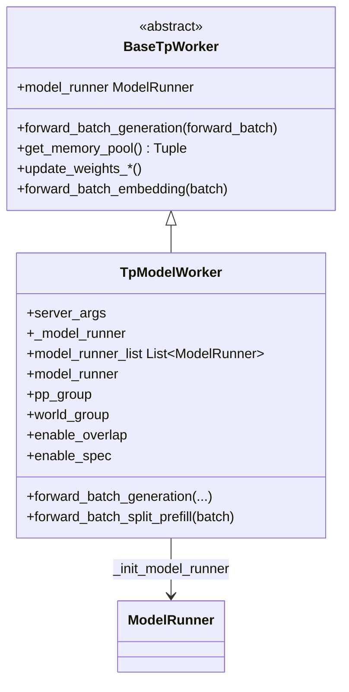
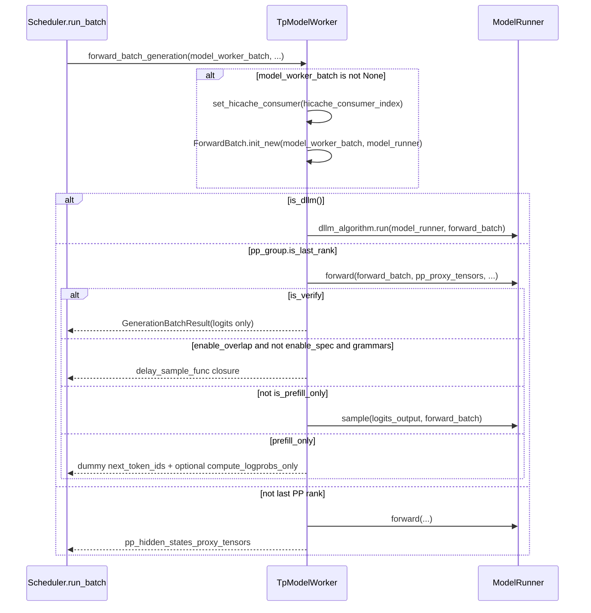

# `TpModelWorker` (and `BaseTpWorker`)

## Summary

`BaseTpWorker` 定义调度器侧共用的 **tensor parallel worker 契约**（抽象 `forward_batch_generation`、抽象 `model_runner`、以及权重更新 / LoRA / `get_memory_pool` 等）；[`TpModelWorker`](d:\design\sglang\python\sglang\srt\managers\tp_worker.py) 是其主实现：在 `__init__` 中构造 [`ModelRunner`](d:\design\sglang\python\sglang\srt\model_executor\model_runner.py)，并在 `forward_batch_generation` 内串联 `ModelRunner.forward` 与 `ModelRunner.sample`（及 PP / DLLM / prefill-only / overlap+grammar 等分支）。**与 [Scheduler.md](Scheduler.md) 的分工**：[Scheduler.md](Scheduler.md) 保留"每个 scheduler 子进程如何被 Engine 拉起、ZMQ 事件循环、`run_batch` 如何把 batch 交给 worker"的**调度器视角**；本页只写 **`TpModelWorker` / `BaseTpWorker` 自身状态与 forward 语义**，不重复 scheduler 主循环；两页通过 §See also 互链。

## Sources

- [`tp_worker.py` 全文](d:\design\sglang\python\sglang\srt\managers\tp_worker.py)（`BaseTpWorker` + `TpModelWorker`）
- [`ModelRunner` 类与 `__init__` 签名](d:\design\sglang\python\sglang\srt\model_executor\model_runner.py)（约 [290-314](d:\design\sglang\python\sglang\srt\model_executor\model_runner.py)）
- `ModelRunner.forward` / `sample` / `compute_logprobs_only` 入口行（约 [model_runner.py:2865, 3030, 3069](d:\design\sglang\python\sglang\srt\model_executor\model_runner.py)）
- `EagleDraftWorker` 与 target `TpModelWorker`、共享 KV pool（约 [eagle_worker_v2.py:85-152](d:\design\sglang\python\sglang\srt\speculative\eagle_worker_v2.py)）
- `Scheduler.init_tp_model_worker` / `init_model_worker` / `init_cache_with_memory_pool` / `run_batch`（约 [scheduler.py:615-637, 681-689, 754-781, 2730-2820](d:\design\sglang\python\sglang\srt\managers\scheduler.py)）

## 类层次（mermaid classDiagram + 字段表）

| 字段 / 属性 | 含义（简述） | 锚点 |
|-------------|--------------|------|
| `server_args` / `tp_size` / `pp_size` / `ep_size` / 各 rank | 并行与设备身份 | [tp_worker.py:238-254](d:\design\sglang\python\sglang\srt\managers\tp_worker.py) |
| `is_draft_worker` / `req_to_token_pool` / `token_to_kv_pool_allocator` / `memory_pool_config` | draft 与 target 间可注入共享 pool | [tp_worker.py:248-252](d:\design\sglang\python\sglang\srt\managers\tp_worker.py) |
| `model_runner_list` | MTP / multi-layer EAGLE 多 `ModelRunner` | [tp_worker.py:256-257](d:\design\sglang\python\sglang\srt\managers\tp_worker.py)、[363-388](d:\design\sglang\python\sglang\srt\managers\tp_worker.py) |
| `_model_runner` / `model_runner` property | 主 `ModelRunner` | [tp_worker.py:343-361, 398-400](d:\design\sglang\python\sglang\srt\managers\tp_worker.py) |
| `tokenizer` / `processor` | 文本或多模态 tokenizer | [tp_worker.py:267-284](d:\design\sglang\python\sglang\srt\managers\tp_worker.py) |
| `device` | 来自 `model_runner.device` | [tp_worker.py:285](d:\design\sglang\python\sglang\srt\managers\tp_worker.py) |
| `pp_group` / `world_group` | NCCL / 分布式组句柄 | [tp_worker.py:287-289](d:\design\sglang\python\sglang\srt\managers\tp_worker.py) |
| `max_total_num_tokens` / `max_prefill_tokens` / `max_running_requests` 等 | 内存与调度预算 | [tp_worker.py:291-307](d:\design\sglang\python\sglang\srt\managers\tp_worker.py) |
| `random_seed` | `broadcast_pyobj` 后 `set_random_seed` | [tp_worker.py:309-316](d:\design\sglang\python\sglang\srt\managers\tp_worker.py) |
| `enable_overlap` / `enable_spec` | overlap 调度与 speculative 标志 | [tp_worker.py:318-319](d:\design\sglang\python\sglang\srt\managers\tp_worker.py) |
| `hicache_layer_transfer_counter` | HiCache 层传输 consumer 协调 | [tp_worker.py:320, 402-407](d:\design\sglang\python\sglang\srt\managers\tp_worker.py) |
| `dllm_algorithm` | Diffusion LLM 算法对象（可选） | [tp_worker.py:390-396](d:\design\sglang\python\sglang\srt\managers\tp_worker.py) |

`synthesis:` MLX 后端可走 `MlxTpModelWorker` 分支，见 [scheduler.py:629-637](d:\design\sglang\python\sglang\srt\managers\scheduler.py)，与本页 `TpModelWorker` 为并列 worker 实现。

## `__init__` 9 步序列

1. **解析参数**：`server_args`、各并行 rank、`gpu_id`、`nccl_port`、draft 与 pool 注入字段等，[tp_worker.py:237-254](d:\design\sglang\python\sglang\srt\managers\tp_worker.py)。
2. **`model_runner_list: List[ModelRunner] = []`**（MTP / 后续 multi-layer EAGLE 用），[tp_worker.py:256-257](d:\design\sglang\python\sglang\srt\managers\tp_worker.py)。
3. **`_init_model_config()` + `_init_model_runner()`**，[tp_worker.py:259-261, 322-361](d:\design\sglang\python\sglang\srt\managers\tp_worker.py)。
4. **可选**：`is_multi_layer_eagle` 时 `_init_multi_layer_eagle_model_runners()`；随后 `_init_dllm_algorithm()`，[tp_worker.py:262-265, 363-396](d:\design\sglang\python\sglang\srt\managers\tp_worker.py)。
5. **Tokenizer**：`skip_tokenizer_init` 则置 `None`，否则 multimodal 用 `processor`+`tokenizer`，[tp_worker.py:267-284](d:\design\sglang\python\sglang\srt\managers\tp_worker.py)。
6. **`device = model_runner.device`**，[tp_worker.py:285](d:\design\sglang\python\sglang\srt\managers\tp_worker.py)；**`pp_group` / `world_group`**，[tp_worker.py:287-289](d:\design\sglang\python\sglang\srt\managers\tp_worker.py)。
7. **内存与请求长度预算**（`max_total_num_tokens`、`max_req_len` 等断言），[tp_worker.py:291-307](d:\design\sglang\python\sglang\srt\managers\tp_worker.py)。
8. **`broadcast_pyobj` + `set_random_seed`** 跨 rank 同步随机种子，[tp_worker.py:309-316](d:\design\sglang\python\sglang\srt\managers\tp_worker.py)。
9. **`enable_overlap` / `enable_spec` 与 `hicache_layer_transfer_counter`**，[tp_worker.py:318-320](d:\design\sglang\python\sglang\srt\managers\tp_worker.py)。

## `forward_batch_generation` 主流程

- **DLLM**：若 `is_dllm()`，走 `_forward_batch_generation_dllm`，[tp_worker.py:464-465, 431-441](d:\design\sglang\python\sglang\srt\managers\tp_worker.py)。
- **PP 末段 vs 非末段**：`pp_group.is_last_rank` 为真时完成 logits 与采样相关逻辑；否则返回 `pp_hidden_states_proxy_tensors`，[tp_worker.py:467-533](d:\design\sglang\python\sglang\srt\managers\tp_worker.py)。
- **overlap + grammar（非 spec）**：当 `enable_overlap and not enable_spec and grammars is not None` 时，不立即 `sample`，而是设置 `delay_sample_func` 闭包，[tp_worker.py:484-497](d:\design\sglang\python\sglang\srt\managers\tp_worker.py)；scheduler 在 `launch_batch_sample_if_needed` 中延后调用，[scheduler.py:2888-2911](d:\design\sglang\python\sglang\srt\managers\scheduler.py)。
- **prefill-only**：`is_prefill_only` 为真时填充 dummy `next_token_ids`；若 `return_logprob` 且存在 `next_token_logits`，调用 `compute_logprobs_only`，[tp_worker.py:499-519](d:\design\sglang\python\sglang\srt\managers\tp_worker.py)。
- **`is_verify`**：为真则跳过采样，直接返回 logits 侧结果，[tp_worker.py:480-482](d:\design\sglang\python\sglang\srt\managers\tp_worker.py)。

## `get_memory_pool` 与 spec decode KV pool 共享

- **二元组语义**：`BaseTpWorker.get_memory_pool` 返回 `(req_to_token_pool, token_to_kv_pool_allocator)`，来自 **主** `model_runner` 内字段，[tp_worker.py:89-93](d:\design\sglang\python\sglang\srt\managers\tp_worker.py)。
- **Scheduler 侧**：`init_cache_with_memory_pool` 从 `tp_worker.get_memory_pool()` 取二者并传入 radix/KV 初始化，[scheduler.py:779-781](d:\design\sglang\python\sglang\srt\managers\scheduler.py)。
- **Draft worker**：如 `EagleDraftWorker.__init__` 调用 `target_worker.get_memory_pool()`，再构造 **`TpModelWorker(..., is_draft_worker=True, req_to_token_pool=..., token_to_kv_pool_allocator=..., memory_pool_config=target_worker.model_runner.memory_pool_config)`**，[eagle_worker_v2.py:123-152](d:\design\sglang\python\sglang\srt\speculative\eagle_worker_v2.py)。
- **与 vLLM 对照**：vLLM 在 worker 上典型是**单个** [`GPUModelRunner`](../../vllm/entities/GPUModelRunner.md) 字段（见 [executor-worker §2](../../comparison/topics/executor-worker.md)）；SGLang 通过 **显式注入同一对 pool** 让 target / draft 两个 `TpModelWorker` 共享 KV 相关分配器，锚点见上。

## hidden state（§9）

| 符号 | 角色 | 锚点 |
|------|------|------|
| `model_runner` / `_model_runner` | 主推理与 KV 逻辑载体 | [tp_worker.py:343-400](d:\design\sglang\python\sglang\srt\managers\tp_worker.py) |
| `model_runner_list` | multi-layer EAGLE 多个 `ModelRunner` | [tp_worker.py:363-388](d:\design\sglang\python\sglang\srt\managers\tp_worker.py) |
| `tokenizer` / `processor` | 编码侧 | [tp_worker.py:267-284](d:\design\sglang\python\sglang\srt\managers\tp_worker.py) |
| `pp_group` / `world_group` | 分布式组 | [tp_worker.py:287-289](d:\design\sglang\python\sglang\srt\managers\tp_worker.py) |
| `req_to_token_pool` / `token_to_kv_pool_allocator`（构造参数，可与 target 共享） | draft 与 target 共用 pool 的注入点 | [tp_worker.py:250-251, 357-359](d:\design\sglang\python\sglang\srt\managers\tp_worker.py) |
| `hicache_layer_transfer_counter` | HiCache consumer 索引 | [tp_worker.py:320, 402-407](d:\design\sglang\python\sglang\srt\managers\tp_worker.py) |
| `enable_overlap` / `enable_spec` | 与 scheduler overlap / spec 路径耦合 | [tp_worker.py:318-319](d:\design\sglang\python\sglang\srt\managers\tp_worker.py) |
| `device` / `gpu_id` / `nccl_port` | 设备与通信端口 | [tp_worker.py:246-247, 285](d:\design\sglang\python\sglang\srt\managers\tp_worker.py)、`ModelRunner.__init__` 内 `dist_port`（[model_runner.py:331](d:\design\sglang\python\sglang\srt\model_executor\model_runner.py)） |

## 与 Scheduler 的协作

- **构造**：`Scheduler.init_tp_model_worker` 设置 `self.tp_worker = TpModelWorker(...)`（非 MLX 时），[scheduler.py:615-637](d:\design\sglang\python\sglang\srt\managers\scheduler.py)。
- **`model_worker` 选择**：`init_model_worker` 在 spec 开启时用 `draft_worker` 作为 `model_worker`，否则为 `tp_worker`，[scheduler.py:681-689](d:\design\sglang\python\sglang\srt\managers\scheduler.py)。
- **Forward 调用链**：`run_batch` 在 generation 路径调用 `self.model_worker.forward_batch_generation(...)`，[scheduler.py:2778-2780, 2818-2820](d:\design\sglang\python\sglang\srt\managers\scheduler.py)。
- **与 vLLM 字符串 RPC 对比**：vLLM worker 侧通过 `getattr(self.worker, method)` 解析方法名（见 [executor-worker §4](../../comparison/topics/executor-worker.md)）；SGLang scheduler 与 `TpModelWorker` **同进程**，调用为普通 Python 属性调用，无该方法名字符串 RPC。

## 与 vLLM `Worker` / MindIE `ModelRunner` 的对照

| 维度 | `TpModelWorker` | vLLM `Worker` | MindIE `ModelRunner` |
|------|-----------------|---------------|----------------------|
| 文档入口 | 本页 | [GPUWorker.md](../../vllm/entities/GPUWorker.md) | [ModelRunner.md](../../mindie/entities/ModelRunner.md) |
| 多 `ModelRunner` | `model_runner_list: List[ModelRunner]`（MTP / multi-layer EAGLE），[tp_worker.py:257](d:\design\sglang\python\sglang\srt\managers\tp_worker.py) | 对比页：spec 多在 `GPUModelRunner.drafter` 一层，[executor-worker.md §10 Anchor 3](../../comparison/topics/executor-worker.md) | 典型单 runner；spec 有独立 `MtpWorker` 等 |
| forward + sample | 同方法内；可选 `delay_sample_func`，[tp_worker.py:484-497](d:\design\sglang\python\sglang\srt\managers\tp_worker.py) | 常拆为 `execute_model` / `sample_tokens`，[executor-worker.md §5](../../comparison/topics/executor-worker.md) | `PluginManager` 路径下同 method 串行 |
| KV / pool 共享给 draft | `get_memory_pool()` 二元组 + 构造参数注入 | 嵌套 `drafter` 模式为主（见对比页） | `MtpWorker` 双 runner 等（见对比页） |

**跨页 anchor（供 [executor-worker.md](../../comparison/topics/executor-worker.md) 深化）**
- **`model_runner_list`**：SGLang 在 worker 层用 **列表** 持多个 `ModelRunner`，与 vLLM `drafter` 字段、MindIE `draft_model_runner` 形成三种组织方式，[tp_worker.py:256-388](d:\design\sglang\python\sglang\srt\managers\tp_worker.py)。
- **`delay_sample_func`**：可选延后采样闭包，[tp_worker.py:490-497](d:\design\sglang\python\sglang\srt\managers\tp_worker.py)。
- **`get_memory_pool`** 二元组，[tp_worker.py:89-93](d:\design\sglang\python\sglang\srt\managers\tp_worker.py)。

## §5 step 3 hidden cross-reference grep 结果

1. **跨语言绑定**：`TpModelWorker` / `BaseTpWorker` 在 `d:\design\sglang\sgl-kernel\` **全树** grep **0 命中**（含 C++/CUDA/Python 子树）。
2. **协作伙伴跨子系统**：`TpModelWorker` 在 `d:\design\sglang\python\sglang\` 全树：分布于 `srt/managers/`、`srt/speculative/*_worker*.py`、`srt/ray/scheduler_actor.py`、`srt/hardware_backend/mlx/tp_worker.py` 等 **17 个文件**有符号命中；`sgl-router`：本工作区无该目录，N/A；`d:\design\sglang\sgl-model-gateway\` 全树 grep `TpModelWorker`：**0 命中**。
3. **配置 / IPC 共享数据结构**：`ModelWorkerBatch` 在 `python/sglang/` 内 **52 文件**有匹配行（含大量 `srt/models/*`）；`ForwardBatch` **数百文件**（模型与 attention 栈为主）；`GenerationBatchResult` **20 文件**；`MemoryPoolConfig` **4 文件**（`pool_configurator.py`、`model_runner_kv_cache_mixin.py`、`model_runner.py`、`tp_worker.py`）。
4. **测试覆盖**：`test_tp_worker*.py` / `test/test_tp_worker*.py`：**0 个文件**；`d:\design\sglang\python\sglang\test\` 下 grep `tp_worker`：**0 命中**（未以该符号做单元测试命名）。
5. **doc / config**：`d:\design\sglang\docs\` 全树 grep `TpModelWorker` / `tp_worker`：**0 命中**；`d:\design\sglang\benchmark\` 全树 grep：**0 命中**。

## Notes / Caveats

> [!todo] VERIFY: ~~`BaseTpWorker` 的抽象 `forward_batch_generation(self, forward_batch)` 与 `TpModelWorker.forward_batch_generation` 的首参 **`ModelWorkerBatch`** 形状不一致，静态类型上的 Liskov 关系需以项目惯例为准。~~
> **RESOLVED 2026-04-19**: 签名差异确认存在且为有意设计。`BaseTpWorker.forward_batch_generation(self, forward_batch: ForwardBatch)` 是 `@abstractmethod`，仅作占位 ([tp_worker.py:62-65](d:\design\sglang\python\sglang\srt\managers\tp_worker.py))；`TpModelWorker.forward_batch_generation(self, model_worker_batch: ModelWorkerBatch, forward_batch: Optional[ForwardBatch] = None, pp_proxy_tensors=..., is_verify=False, skip_attn_backend_init=False)` ([tp_worker.py:443-450](d:\design\sglang\python\sglang\srt\managers\tp_worker.py)) 接受 `ModelWorkerBatch` 主路径并在内部 `ForwardBatch.init_new(model_worker_batch, model_runner)` ([tp_worker.py:459](d:\design\sglang\python\sglang\srt\managers\tp_worker.py))；`forward_batch` 为 `None` 时落到 `assert forward_batch is not None` ([tp_worker.py:461-462](d:\design\sglang\python\sglang\srt\managers\tp_worker.py))。Python 动态类型不强制 LSP，scheduler 调用始终走 `model_worker.forward_batch_generation(model_worker_batch, ...)` ([scheduler.py:2778, 2818](d:\design\sglang\python\sglang\srt\managers\scheduler.py))，与并列实现 `MlxTpModelWorker` / `EagleDraftWorker` 接口一致。

> [!todo] VERIFY: ~~`model_runner_list` 在 **非** `is_multi_layer_eagle` 的 MTP 路径是否仍由其他模块填充（当前 `__init__` 仅在 multi-layer EAGLE 分支 append，[tp_worker.py:262-388](d:\design\sglang\python\sglang\srt\managers\tp_worker.py)）。~~
> **RESOLVED 2026-04-19**: 全仓 grep 仅 `tp_worker.py:366` 与 `tp_worker.py:368` 写入 `self.model_runner_list.append(...)`，均在 `_init_multi_layer_eagle_model_runners` 内 ([tp_worker.py:363-388](d:\design\sglang\python\sglang\srt\managers\tp_worker.py))；其余命中均为 **读取**（`speculative/multi_layer_eagle_worker_v2.py:136` 的 `self.draft_runner_list = self.draft_worker.model_runner_list`、`speculative/multi_layer_eagle_worker.py:237` 的 `self.model_runner_list[layer_id]`）。结论：非 `is_multi_layer_eagle` 路径下 `model_runner_list` 始终为空 `[]`（[tp_worker.py:257](d:\design\sglang\python\sglang\srt\managers\tp_worker.py)），不由其它模块回填；标准 MTP / 单层 EAGLE 仍走单一 `_model_runner` 路径。

## See also

- [Scheduler.md](Scheduler.md)（调度器持有 worker、`run_batch` 主路径）
- [Engine.md](Engine.md)
- [DataParallelController.md](DataParallelController.md)
- [executor-worker.md](../../comparison/topics/executor-worker.md)（三家 executor/worker 对比）
- [GPUWorker.md](../../vllm/entities/GPUWorker.md)
- [ModelRunner.md](../../mindie/entities/ModelRunner.md)
