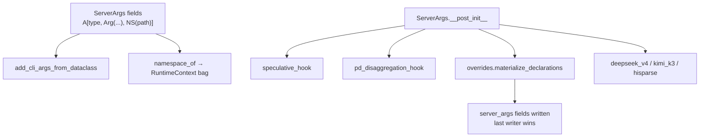

# `srt/arg_groups` — ServerArgs CLI 元数据与模型 override 钩子

## Summary

[`python/sglang/srt/arg_groups/`](d:\design\sglang\python\sglang\srt\arg_groups) **9** 个 `.py`（空 `__init__.py`），把巨型 [`ServerArgs`](d:\design\sglang\python\sglang\srt\server_args.py) 的 **CLI 派生**、**命名空间标记**、**声明式模型 override**、以及若干 **领域校验 hook** 从 `server_args.py` 拆出。核心类型：`A`/`Arg`/`NS`（[arg_utils.py](d:\design\sglang\python\sglang\srt\arg_groups\arg_utils.py)）；最大文件 [`overrides.py`](d:\design\sglang\python\sglang\srt\arg_groups\overrides.py)（~113 KB）承载 `MODEL_OVERRIDES` + `@register_model_override`。

> synthesis: 不是独立“配置模块”（那是 [`configs/`](configs.md) 的 `ModelConfig`），而是 **ServerArgs 的注解/解析/后处理插件层**——`server_args.py` 在 `__post_init__` 中 lazy-import 各 hook。

## Sources

| 文件 | 说明 |
|---|---|
| [`arg_utils.py`](d:\design\sglang\python\sglang\srt\arg_groups\arg_utils.py) | `A=Annotated`、`Arg`、`NS`、`add_cli_args_from_dataclass`、`namespace_of` |
| [`argparse_actions.py`](d:\design\sglang\python\sglang\srt\arg_groups\argparse_actions.py) | 自定义 argparse actions |
| [`overrides.py`](d:\design\sglang\python\sglang\srt\arg_groups\overrides.py) | 声明式 per-arch override 注册表 + 物化 |
| [`speculative_hook.py`](d:\design\sglang\python\sglang\srt\arg_groups\speculative_hook.py) | speculative 算法别名 / CPU 禁用 overlap 等 |
| [`pd_disaggregation_hook.py`](d:\design\sglang\python\sglang\srt\arg_groups\pd_disaggregation_hook.py) | PD 分离 backend/DCP 校验 |
| [`deepseek_v4_hook.py`](d:\design\sglang\python\sglang\srt\arg_groups\deepseek_v4_hook.py) | DeepSeek V4 专用 |
| [`hisparse_hook.py`](d:\design\sglang\python\sglang\srt\arg_groups\hisparse_hook.py) | HiSparse DSA / kv dtype 校验 |
| [`kimi_k3_hook.py`](d:\design\sglang\python\sglang\srt\arg_groups\kimi_k3_hook.py) | Kimi K3 symm mem 等 |

## Architecture / Data flow

- **`Arg`**（[arg_utils.py:61-82](d:\design\sglang\python\sglang\srt\arg_groups\arg_utils.py)）：`help/choices/aliases/cli_name/type_parser/nargs/...`；`no_cli=True` 跳过 CLI；`resolvable=True` 允许配置解析写回。
- **`NS(path)`**（[L85-L98](d:\design\sglang\python\sglang\srt\arg_groups\arg_utils.py)）：与 `Arg` 分离的命名空间标记，供 `namespace_of` 建 RuntimeContext 树（[L101-L119](d:\design\sglang\python\sglang\srt\arg_groups\arg_utils.py)）。
- **`overrides.py`**：`MODEL_OVERRIDES` 常量表（如 MistralLarge3 → `dtype=bfloat16`）（[L69-L74](d:\design\sglang\python\sglang\srt\arg_groups\overrides.py)）；`@register_model_override(arch)` 注册派生函数，**禁止**就地 mutate `server_args`（[L85-L97](d:\design\sglang\python\sglang\srt\arg_groups\overrides.py)）。
- **Hooks 示例**：
  - `handle_speculative_decoding`：EAGLE/NEXTN→FROZEN_KV_MTP（Gemma4 draft）等（[speculative_hook.py:24-59](d:\design\sglang\python\sglang\srt\arg_groups\speculative_hook.py)）
  - `handle_pd_disaggregation`：`mooncake_tcp`→`mooncake`+`MC_FORCE_TCP`；decode DCP 限制（[pd_disaggregation_hook.py:16-48](d:\design\sglang\python\sglang\srt\arg_groups\pd_disaggregation_hook.py)）

## Key APIs / Entities

| 名称 | 位置 | 作用 |
|---|---|---|
| `A` / `Arg` / `NS` | [arg_utils.py:58-98](d:\design\sglang\python\sglang\srt\arg_groups\arg_utils.py) | ServerArgs 字段注解三件套 |
| `add_cli_args_from_dataclass` | [arg_utils.py](d:\design\sglang\python\sglang\srt\arg_groups\arg_utils.py) | 从 dataclass 生成 argparse |
| `namespace_of` | [arg_utils.py:101-119](d:\design\sglang\python\sglang\srt\arg_groups\arg_utils.py) | field → dotted NS path |
| `MODEL_OVERRIDES` / `register_model_override` | [overrides.py:69-99](d:\design\sglang\python\sglang\srt\arg_groups\overrides.py) | 声明式 arch override |
| `materialize_declarations` / `resolved_view` | [overrides.py](d:\design\sglang\python\sglang\srt\arg_groups\overrides.py)（被 server_args 调用） | 物化到 ServerArgs |
| `handle_speculative_decoding` | [speculative_hook.py](d:\design\sglang\python\sglang\srt\arg_groups\speculative_hook.py) | speculative CLI 归一化 |
| `handle_pd_disaggregation` | [pd_disaggregation_hook.py:16+](d:\design\sglang\python\sglang\srt\arg_groups\pd_disaggregation_hook.py) | PD 参数校验 |
| `validate_hisparse_*` | [hisparse_hook.py](d:\design\sglang\python\sglang\srt\arg_groups\hisparse_hook.py) | HiSparse 后端/dtype |
| `disable_kimi_k3_symm_mem` 等 | [kimi_k3_hook.py](d:\design\sglang\python\sglang\srt\arg_groups\kimi_k3_hook.py) | Kimi K3 |

## 使用方调用清单 / 跨子系统引用

1. **跨语言绑定**：`arg_groups`：在 `d:\design\sglang\python\sglang\srt\` 全树 grep 无 C++/pybind 命中（纯 Python）。
2. **协作伙伴**：
   - [`server_args.py`](d:\design\sglang\python\sglang\srt\server_args.py) 顶层 import `A/Arg/NS/add_cli_args_from_dataclass` 与 argparse_actions / overrides（[L35-L43](d:\design\sglang\python\sglang\srt\server_args.py)）；`__post_init__` 内大量 lazy import hooks（如 L3616 speculative、L3837 pd、L5051 hisparse、L5142 deepseek_v4）
   - [`runtime_context.py`](d:\design\sglang\python\sglang\srt\runtime_context.py) 用 `namespace_of` / `attention_backends_of` / `_apply_fields`
   - [`spec_info.py`](d:\design\sglang\python\sglang\srt\speculative\spec_info.py)、[`adaptive_spec_params.py`](d:\design\sglang\python\sglang\srt\speculative\adaptive_spec_params.py)、[`template_detection.py`](d:\design\sglang\python\sglang\srt\parser\template_detection.py)
3. **配置字段**：几乎所有 `ServerArgs` 字段经 `A[..., NS("...")]` 标注；本包不拥有独立配置文件格式。
4. **测试**：`arg_groups`：在本 checkout 全树无独立 `test_arg_groups*`；覆盖主要靠 ServerArgs 集成路径。
5. **doc**：`arg_groups`：在 `d:\design\sglang\docs\` 全树 grep 0 命中。

## Increment 2026-08-18 (06f32bab → f7101b0a)

本期 `arg_groups/` 5 文件 / 219 行 churn，**无结构性变化**；核心锚点已复核仍有效（`Arg` [arg_utils.py:L62](d:\design\sglang\python\sglang\srt\arg_groups\arg_utils.py)、`NS` [L86](d:\design\sglang\python\sglang\srt\arg_groups\arg_utils.py)、`namespace_of` [L102](d:\design\sglang\python\sglang\srt\arg_groups\arg_utils.py)、`MODEL_OVERRIDES` [overrides.py:L70](d:\design\sglang\python\sglang\srt\arg_groups\overrides.py)、`register_model_override` [L86](d:\design\sglang\python\sglang\srt\arg_groups\overrides.py)、`materialize_declarations` [L257](d:\design\sglang\python\sglang\srt\arg_groups\overrides.py)、`resolved_view` [L269](d:\design\sglang\python\sglang\srt\arg_groups\overrides.py)）。内容级增量：

- **`_handle_dspark` 支持 NPU 设备 + MegaMoE**（上游 b83d507cd7 #33676 / 6eb941a34c #34844）：设备校验从仅 CUDA 放宽为 CUDA/NPU；dp attention 下 `moe_a2a_backend` 允许 `"megamoe"`，且非 `none` 时要求 `SGLANG_RAGGED_VERIFY_MODE=static`（[speculative_hook.py:L278-L315](d:\design\sglang\python\sglang\srt\arg_groups\speculative_hook.py)）。
- **overrides 注册表随新模型扩表**（Muse Glimmer fde9ad2531、Kimi-K3 NPU 197832bcf5、GLM-4.7-Flash 确定性 FA4 2d76d537e5 等），`overrides.py` +102/-66；注册机制本身未变（`register_model_override_predicate` [overrides.py:L103](d:\design\sglang\python\sglang\srt\arg_groups\overrides.py) 在 pin 时已存在）。
- `deepseek_v4_hook.py` / `hisparse_hook.py` 随 DSV4 环境变量清理（bc312d185d #34926）与 SM120 FP8 KV 放宽（2c07ca5e8d #33075）小幅调整。

> 关联的跨子系统变化：本期 `server_args.py` +468/-149、[runtime_context.py](d:\design\sglang\python\sglang\srt\runtime_context.py) 引入 **config namespace bags**（`_ConfigBag` [runtime_context.py:L593](d:\design\sglang\python\sglang\srt\runtime_context.py)、`_build_config_bags` [L677](d:\design\sglang\python\sglang\srt\runtime_context.py)）：`server_args` 在 publish 时快照为只读命名空间 bag 树，下游进程改经 `get_exec().<ns>.<leaf>` 读取（上游 "config: ... read the bags" 系列 #35022-#35028）。本页描述的 `NS(path)` → RuntimeContext 树机制即该 bag 树的注解来源，语义未变。

## Notes / Caveats

- `overrides.py` 体量极大——ingest 时勿逐行抄表，以注册机制 + 代表 arch 为准。
- Hook 多数在 `__post_init__` **lazy import**，避免循环依赖与启动成本。
- `resolvable` 字段白名单控制谁可被 override 物化写回（[arg_utils.py:78-82](d:\design\sglang\python\sglang\srt\arg_groups\arg_utils.py)）。

## See also

- [sglang/modules/configs.md](configs.md)
- [sglang/modules/speculative.md](speculative.md)
- [sglang/modules/disaggregation.md](disaggregation.md)
- [sglang/overview.md](../overview.md)
