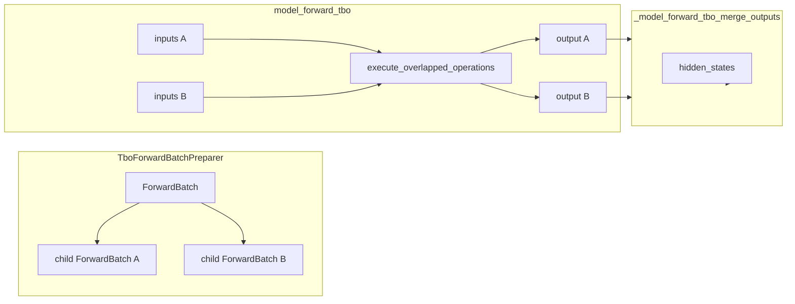

# `srt/batch_overlap` — Two-batch overlap (TBO) / Single-batch overlap (SBO) MoE 前向交错

## Summary

本目录含四类代码：

1. [`operations.py`](d:\design\sglang\python\sglang\srt\batch_overlap\operations.py) 实现按 **stage** 切分的 `execute_operations` 与 **双路交错** 的 [`execute_overlapped_operations`](d:\design\sglang\python\sglang\srt\batch_overlap\operations.py)（两个 `_StageExecutor` 按 `delta_stages` 步进交错）；
2. [`operations_strategy.py`](d:\design\sglang\python\sglang\srt\batch_overlap\operations_strategy.py) 为 DeepSeek / Qwen3-MoE / MiMoV2 等 **按层构造** `YieldOperation` 分隔的 op 序列与 `tbo_delta_stages`；
3. [`two_batch_overlap.py`](d:\design\sglang\python\sglang\srt\batch_overlap\two_batch_overlap.py) 实现 **TBO**：batch 切分（`TboForwardBatchPreparer`）、[`model_forward_maybe_tbo`](d:\design\sglang\python\sglang\srt\batch_overlap\two_batch_overlap.py) → [`execute_overlapped_operations`](d:\design\sglang\python\sglang\srt\batch_overlap\operations.py)、以及 [`MaybeTboDeepEPDispatcher`](d:\design\sglang\python\sglang\srt\batch_overlap\two_batch_overlap.py)（MoE A2A 双 dispatcher）；
4. [`single_batch_overlap.py`](d:\design\sglang\python\sglang\srt\batch_overlap\single_batch_overlap.py) 为 **SBO**：MoE combine 与 down-gemm 的 **`torch.cuda.Stream` / `Event`** 与 `CombineOverlapArgs` / `DownGemmOverlapArgs`。

> [!warning] CONTRADICTION（与调度器 "overlap schedule" 的关系）：`disable_overlap_schedule` 控制 **Scheduler 与 GPU worker 的流式重叠**（见 [server_arguments.md](d:\design\sglang\docs\advanced_features\server_arguments.md) 对 `--disable-overlap-schedule` 的描述）；[`TpModelWorker.enable_overlap`](d:\design\sglang\python\sglang\srt\managers\tp_worker.py) 来自 `not server_args.disable_overlap_schedule`。**`batch_overlap/` 包不实现该调度器逻辑**，但 **`enable_two_batch_overlap`** 经 [`initialize_moe_config`](d:\design\sglang\python\sglang\srt\layers\moe\utils.py) 写入 `IS_TBO_ENABLED`，驱动本模块的 TBO 路径。

## Sources

- [d:\design\sglang\python\sglang\srt\batch_overlap\operations.py](d:\design\sglang\python\sglang\srt\batch_overlap\operations.py)
- [d:\design\sglang\python\sglang\srt\batch_overlap\operations_strategy.py](d:\design\sglang\python\sglang\srt\batch_overlap\operations_strategy.py)
- [d:\design\sglang\python\sglang\srt\batch_overlap\two_batch_overlap.py](d:\design\sglang\python\sglang\srt\batch_overlap\two_batch_overlap.py)
- [d:\design\sglang\python\sglang\srt\batch_overlap\single_batch_overlap.py](d:\design\sglang\python\sglang\srt\batch_overlap\single_batch_overlap.py)
- MoE 全局开关：[d:\design\sglang\python\sglang\srt\layers\moe\utils.py:160-189](d:\design\sglang\python\sglang\srt\layers\moe\utils.py)

## Architecture（scheduler / forward overlap）

- **切分**：[TboForwardBatchPreparer.prepare](d:\design\sglang\python\sglang\srt\batch_overlap\two_batch_overlap.py) 填充 `batch.tbo_children`（两个 [`ForwardBatch`](d:\design\sglang\python\sglang\srt\model_executor\forward_batch_info.py)）。
- **执行**：[model_forward_maybe_tbo](d:\design\sglang\python\sglang\srt\batch_overlap\two_batch_overlap.py) 在 `enable_tbo` 时调用 [`_model_forward_tbo`](d:\design\sglang\python\sglang\srt\batch_overlap\two_batch_overlap.py) → [`execute_overlapped_operations`](d:\design\sglang\python\sglang\srt\batch_overlap\operations.py)（[`delta_stages`](d:\design\sglang\python\sglang\srt\batch_overlap\two_batch_overlap.py) 来自 `OperationsStrategy.tbo_delta_stages`）。
- **DeepGEMM SMS**：非 HIP 时在 [`_model_forward_tbo`](d:\design\sglang\python\sglang\srt\batch_overlap\two_batch_overlap.py) 内用 [`deep_gemm_wrapper.configure_deep_gemm_num_sms`](d:\design\sglang\python\sglang\srt\batch_overlap\two_batch_overlap.py) 包一层上下文。

## File inventory

| 文件 | 职责 |
|------|------|
| [`operations.py`](d:\design\sglang\python\sglang\srt\batch_overlap\operations.py) | `YieldOperation`、`ExecutionOperation`、`_StageExecutor`、`execute_operations` / `execute_overlapped_operations` |
| [`operations_strategy.py`](d:\design\sglang\python\sglang\srt\batch_overlap\operations_strategy.py) | `OperationsStrategy.init_new_tbo`、各 MoE 层 op 序列与 `tbo_delta_stages` |
| [`two_batch_overlap.py`](d:\design\sglang\python\sglang\srt\batch_overlap\two_batch_overlap.py) | TBO 切分/合并、`model_forward_maybe_tbo`、`MaybeTboDeepEPDispatcher`、`TboCudaGraphRunnerPlugin`、`TboDPAttentionPreparer` |
| [`single_batch_overlap.py`](d:\design\sglang\python\sglang\srt\batch_overlap\single_batch_overlap.py) | `SboFlags`、`CombineOverlapArgs`、`compute_overlap_args`（CUDA stream/event） |

## Class / API breakdown

| 名称 | 位置 | 作用 |
|------|------|------|
| `OperationsStrategy` | [operations_strategy.py:15-67](d:\design\sglang\python\sglang\srt\batch_overlap\operations_strategy.py) | 聚合每层 `operations`、`deep_gemm_num_sms`、`tbo_delta_stages` |
| `execute_overlapped_operations` | [operations.py:30-58](d:\design\sglang\python\sglang\srt\batch_overlap\operations.py) | 双 executor 按 `delta_stage` 交错 `next()` |
| `TboForwardBatchPreparer` | [two_batch_overlap.py:472-803](d:\design\sglang\python\sglang\srt\batch_overlap\two_batch_overlap.py) | 构造 `tbo_children`、token/seq 切分 |
| `MaybeTboDeepEPDispatcher` | [two_batch_overlap.py:1025-1089](d:\design\sglang\python\sglang\srt\batch_overlap\two_batch_overlap.py) | TBO 时 **两个** EP dispatcher 实例 |
| `TboAttnBackend` | [layers/attention/tbo_backend.py](d:\design\sglang\python\sglang\srt\layers\attention\tbo_backend.py) | 包装 primary + 两个 child attention backend |
| `SboFlags` / `compute_overlap_args` | [single_batch_overlap.py:28-144](d:\design\sglang\python\sglang\srt\batch_overlap\single_batch_overlap.py) | 单 batch 内 MoE combine 与 down-gemm overlap 参数 |

## Stream / event primitives

- **SBO（单 batch MoE）**：`CombineOverlapArgs` 含 `stream: torch.cuda.Stream`、`wait_event: torch.cuda.Event`；[`compute_overlap_args`](d:\design\sglang\python\sglang\srt\batch_overlap\single_batch_overlap.py) 中创建 `torch.cuda.Event()` 与可选 `combine_signal` tensor。
- **TBO（双 batch）**：`execute_overlapped_operations` 本身 **不显式** 创建 CUDA Event；依赖各 `op_*` 内核与 DeepEP 侧同步（与 `MaybeTboDeepEPDispatcher`、layer op 配合）。

## CLI / 配置

| 项 | 含义（据源码/文档） | 锚点 |
|----|---------------------|------|
| `--enable-two-batch-overlap` | `ServerArgs.enable_two_batch_overlap` → `IS_TBO_ENABLED` | [utils.py:187](d:\design\sglang\python\sglang\srt\layers\moe\utils.py)、[server_args.py:643](d:\design\sglang\python\sglang\srt\server_args.py) |
| `--disable-overlap-schedule` | 关闭 **scheduler/GPU overlap**；与 `TpModelWorker.enable_overlap` 相反 | [tp_worker.py:318](d:\design\sglang\python\sglang\srt\managers\tp_worker.py)、[server_arguments.md:429](d:\design\sglang\docs\advanced_features\server_arguments.md) |
| `enable_two_batch_overlap` 且 `moe_a2a_backend == "none"` | 校验报错 | [server_args.py:6629-6633](d:\design\sglang\python\sglang\srt\server_args.py) |
| `--tbo-token-distribution-threshold` | `get_tbo_token_distribution_threshold()` 等 | [two_batch_overlap.py:104-108](d:\design\sglang\python\sglang\srt\batch_overlap\two_batch_overlap.py)、[server_arguments.md](d:\design\sglang\docs\advanced_features\server_arguments.md) |

## Cross-link：`delay_sample_func` 与 `TpModelWorker.md`

- **闭包设置**：当 [`self.enable_overlap and not self.enable_spec and grammars is not None`](d:\design\sglang\python\sglang\srt\managers\tp_worker.py) 时，[`batch_result.delay_sample_func = sample_batch_func`](d:\design\sglang\python\sglang\srt\managers\tp_worker.py)（[`tp_worker.py:484-497`](d:\design\sglang\python\sglang\srt\managers\tp_worker.py)）。
- **Scheduler 延后执行**：[launch_batch_sample_if_needed](d:\design\sglang\python\sglang\srt\managers\scheduler.py) 调用 `delay_sample_func()`，[`scheduler.py:2888-2911`](d:\design\sglang\python\sglang\srt\managers\scheduler.py)。
- **synthesis:** 该路径与 **`batch_overlap/` 包无直接 import 关系**；同属广义的 "overlap" 产品能力，但分层为 **调度/语法约束延后采样** vs **MoE 双 micro-batch 前向交错**。

## §跨子系统 5 grep（batch_overlap / TBO / SBO）

1. **sgl-kernel C++**：`d:\design\sglang\sgl-kernel\` grep `batch_overlap` / `BatchOverlap` → **0 命中**。
2. **Collaborator imports（`srt/`）**：`models/deepseek_v2.py`、`glm4_moe.py`、`qwen2_moe.py`、`mimo_v2_flash.py`、`minimax_m2.py`（`model_forward_maybe_tbo` / `SboFlags`）；`layers/moe/fused_moe_triton/layer.py`、`layers/moe/token_dispatcher/*.py`、`piecewise_cuda_graph_runner.py`、`cuda_graph_runner.py`、`forward_batch_info.py`、`managers/scheduler_dp_attn_mixin.py` 等。
3. **CLI**：`disable_overlap_schedule`、`enable_two_batch_overlap` 在 [server_args.py](d:\design\sglang\python\sglang\srt\server_args.py) 多处（默认值、兼容性强制关闭、校验）。
4. **Tests**：[d:\design\sglang\test\manual\test_two_batch_overlap.py](d:\design\sglang\test\manual\test_two_batch_overlap.py)（集成 + `compute_split_*` 单元测试）。
5. **Docs**：[server_arguments.md](d:\design\sglang\docs\advanced_features\server_arguments.md)（`--enable-two-batch-overlap`、`--disable-overlap-schedule`）、[expert_parallelism.md](d:\design\sglang\docs\advanced_features\expert_parallelism.md)、平台文档中的 `--disable-overlap-schedule` 示例等。

## Notes

> [!todo] VERIFY: ~~`OperationsStrategy.init_new_tbo` 仅支持 `DeepseekV2DecoderLayer` / `Qwen3MoeDecoderLayer` / `MiMoV2DecoderLayer`（[operations_strategy.py:38-67](d:\design\sglang\python\sglang\srt\batch_overlap\operations_strategy.py)），其它架构需另证。~~
>
> > **RESOLVED 2026-04-19**: [`init_new_tbo`](d:\design\sglang\python\sglang\srt\batch_overlap\operations_strategy.py:34) 内 `if/elif` 分支精确为 [`DeepseekV2DecoderLayer`](d:\design\sglang\python\sglang\srt\batch_overlap\operations_strategy.py:39) / [`Qwen3MoeDecoderLayer`](d:\design\sglang\python\sglang\srt\batch_overlap\operations_strategy.py:48) / [`MiMoV2DecoderLayer`](d:\design\sglang\python\sglang\srt\batch_overlap\operations_strategy.py:57) 三类，其它架构落入 fallback 异常分支。

## See also

- [TpModelWorker.md](../entities/TpModelWorker.md)（`delay_sample_func`、`enable_overlap`）
- [batch_invariant_ops.md](batch_invariant_ops.md)（确定性算子，不同子系统）
- [eplb.md](eplb.md) / [elastic_ep.md](elastic_ep.md)（MoE A2A / dispatcher 协作）
- [tbo_backend.py](d:\design\sglang\python\sglang\srt\layers\attention\tbo_backend.py)（TBO attention 包装）
