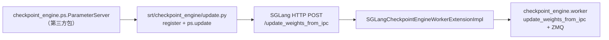

# `srt/checkpoint_engine` — Moonshot checkpoint-engine 适配（ParameterServer + IPC）

## Summary

[`python/sglang/srt/checkpoint_engine/`](d:\design\sglang\python\sglang\srt\checkpoint_engine)（**3** 个 `.py`）把 **第三方** Python 包 **`checkpoint_engine`**（ParameterServer、`update_weights_from_ipc`）接到 SGLang：服务端在 [`ModelRunner.update_weights_from_ipc`](d:\design\sglang\python\sglang\srt\model_executor\model_runner.py) 中构造 [`SGLangCheckpointEngineWorkerExtensionImpl`](d:\design\sglang\python\sglang\srt\checkpoint_engine\checkpoint_engine_worker.py)；客户端示例 [`update.py`](d:\design\sglang\python\sglang\srt\checkpoint_engine\update.py) 通过 HTTP [`POST /update_weights_from_ipc`](d:\design\sglang\python\sglang\srt\entrypoints\http_server.py) 传入 `zmq_handles`（GPU UUID → socket 路径）。依赖版本在 [`python/pyproject.toml`](d:\design\sglang\python\pyproject.toml) 中 pin 为 **`checkpoint-engine==0.1.2`**（optional extra）。

> synthesis: 与 [`weight_sync`](weight_sync.md) 的「训练进程 tensor / NCCL / flattened_bucket」路径正交——本模块强调 **checkpoint-engine 生态的 IPC 张量拉取** 与 **可选的"初值未就绪不对外服务"**（`--checkpoint-engine-wait-weights-before-ready`）。

## Sources

| 文件 | 说明 |
|---|---|
| [__init__.py](d:\design\sglang\python\sglang\srt\checkpoint_engine\__init__.py) | 导出 `main` → `update.main` |
| [update.py](d:\design\sglang\python\sglang\srt\checkpoint_engine\update.py) | `torchrun` 包装、`ParameterServer` 注册 checkpoint、HTTP 回调 `req_inference` |
| [checkpoint_engine_worker.py](d:\design\sglang\python\sglang\srt\checkpoint_engine\checkpoint_engine_worker.py) | `SGLangCheckpointEngineWorkerExtension*` + `checkpoint_engine.worker.update_weights_from_ipc` |
| 服务端接入 | [model_runner.py](d:\design\sglang\python\sglang\srt\model_executor\model_runner.py) `update_weights_from_ipc`（约 L3132-L3147） |
| 启动门控 | [server_args.py](d:\design\sglang\python\sglang\srt\server_args.py) `checkpoint_engine_wait_weights_before_ready`；[http_server.py](d:\design\sglang\python\sglang\srt\entrypoints\http_server.py) `_wait_and_warmup`；[tokenizer_manager.py](d:\design\sglang\python\sglang\srt\managers\tokenizer_manager.py) `init_weight_update` |
| 上游文档 | [docs/advanced_features/checkpoint_engine.md](d:\design\sglang\docs\advanced_features\checkpoint_engine.md) |

## Architecture / Data flow

- **第三方 import（非 `sglang.srt`）**：`from checkpoint_engine.ps import ParameterServer`（[update.py L30-L32](d:\design\sglang\python\sglang\srt\checkpoint_engine\update.py)）；`from checkpoint_engine.worker import update_weights_from_ipc`（[checkpoint_engine_worker.py L25-L31](d:\design\sglang\python\sglang\srt\checkpoint_engine\checkpoint_engine_worker.py)）。缺失时：`update.py` 将 `ParameterServer = None`（[L33-L38](d:\design\sglang\python\sglang\srt\checkpoint_engine\update.py)）；worker 文件则 **raise ImportError** 提示 `pip install sglang[checkpoint-engine]`（[L27-L31](d:\design\sglang\python\sglang\srt\checkpoint_engine\checkpoint_engine_worker.py)）。
- **服务端**：[`SGLangCheckpointEngineWorkerExtensionImpl.update_weights_from_ipc`](d:\design\sglang\python\sglang\srt\checkpoint_engine\checkpoint_engine_worker.py) 用 GPU UUID 选 socket，调用 `update_weights_from_ipc(ctx, path, device_id=..., run=model.load_weights, post_hook=...)`（[L69-L89](d:\design\sglang\python\sglang\srt\checkpoint_engine\checkpoint_engine_worker.py)）；`get_device_uuid` 使用 `torch.cuda.get_device_properties(...).uuid`（[L102-L109](d:\design\sglang\python\sglang\srt\checkpoint_engine\checkpoint_engine_worker.py)）。
- **客户端 `req_inference`**：向 `{endpoint}/update_weights_from_ipc` POST JSON，含 `zmq_handles`、`flush_cache`、`weight_version`（[update.py L118-L131](d:\design\sglang\python\sglang\srt\checkpoint_engine\update.py)）。

## File inventory（3 文件）

| 文件 | 职责 |
|---|---|
| [__init__.py](d:\design\sglang\python\sglang\srt\checkpoint_engine\__init__.py) | `__all__ = ["main"]`，`from sglang.srt.checkpoint_engine.update import main`（L7） |
| [update.py](d:\design\sglang\python\sglang\srt\checkpoint_engine\update.py) | CLI：`main` / `run_with_torchrun` / `update_weights` / `join` / safetensors 分片读 |
| [checkpoint_engine_worker.py](d:\design\sglang\python\sglang\srt\checkpoint_engine\checkpoint_engine_worker.py) | 与 `ModelRunner` 绑定的 worker 扩展与 IPC 加载 |

## Key APIs

| 符号 | 位置 | 作用 |
|---|---|---|
| `main` | [update.py:240-317](d:\design\sglang\python\sglang\srt\checkpoint_engine\update.py) | 无 `RANK` 时自动 `torchrun`；否则解析参数并驱动 `ParameterServer` |
| `update_weights`（模块内） | [update.py:137-173](d:\design\sglang\python\sglang\srt\checkpoint_engine\update.py) | `register_checkpoint` → `gather_metas` → `ps.update`（broadcast / p2p / all） |
| `req_inference` | [update.py:108-134](d:\design\sglang\python\sglang\srt\checkpoint_engine\update.py) | 返回闭包，通过 HTTP 触发推理端 IPC 更新 |
| `SGLangCheckpointEngineWorkerExtension` | [checkpoint_engine_worker.py:36-89](d:\design\sglang\python\sglang\srt\checkpoint_engine\checkpoint_engine_worker.py) | 抽象扩展点（UUID / loader / hook） |
| `SGLangCheckpointEngineWorkerExtensionImpl` | [checkpoint_engine_worker.py:92-143](d:\design\sglang\python\sglang\srt\checkpoint_engine\checkpoint_engine_worker.py) | 绑定 `model_runner.model.load_weights` 与量化后处理 |

## 依赖 pin

[`python/pyproject.toml`](d:\design\sglang\python\pyproject.toml)：`checkpoint-engine = ["checkpoint-engine==0.1.2"]`（约 L101）；[`pyproject_npu.toml`](d:\design\sglang\python\pyproject_npu.toml) 同版本（约 L70）。文档示例：`pip install 'checkpoint-engine[p2p]'` 见 [checkpoint_engine.md docs](d:\design\sglang\docs\advanced_features\checkpoint_engine.md)。

## `srt/` 内调用方

| 位置 | 锚点 |
|---|---|
| `ModelRunner.update_weights_from_ipc` | [L3132-L3147](d:\design\sglang\python\sglang\srt\model_executor\model_runner.py) `from sglang.srt.checkpoint_engine.checkpoint_engine_worker import SGLangCheckpointEngineWorkerExtensionImpl` |
| `TpWorker.update_weights_from_ipc` | [tp_worker.py L168-L171](d:\design\sglang\python\sglang\srt\managers\tp_worker.py) 委托 `model_runner` |
| `SchedulerUpdateWeightsMixin.update_weights_from_ipc` | [scheduler_update_weights_mixin.py L106-L118](d:\design\sglang\python\sglang\srt\managers\scheduler_update_weights_mixin.py) |

## CLI / server flags

| 标志 | 位置 | 作用 |
|---|---|---|
| `--checkpoint-engine-wait-weights-before-ready` | [server_args.py L4098-L4100](d:\design\sglang\python\sglang\srt\server_args.py) | 服务在初值权重就绪前可阻塞对外就绪 |
| 字段 `checkpoint_engine_wait_weights_before_ready` | [server_args.py L320](d:\design\sglang\python\sglang\srt\server_args.py) | 默认值 `False` |
| `_wait_and_warmup` 分支 | [http_server.py L2003-L2004](d:\design\sglang\python\sglang\srt\entrypoints\http_server.py) | 为真则先 `_wait_weights_ready()` |
| `TokenizerManager.init_weight_update` | [tokenizer_manager.py L405-L409](d:\design\sglang\python\sglang\srt\managers\tokenizer_manager.py) | 为真则 `initial_weights_loaded = False` 直至后续流程置位 |

`update.py` 自有参数：`--checkpoint-path`、`--endpoint`（默认 `http://localhost:19730`）、`--inference-parallel-size`、`--update-method`、`--uds`、`--weight-version` 等（[L248-L258](d:\design\sglang\python\sglang\srt\checkpoint_engine\update.py)）。

## §跨子系统引用（§5 step 3）

1. **sgl-kernel C++**：在 [`d:\design\sglang\sgl-kernel\`](d:\design\sglang\sgl-kernel) 全树对 `checkpoint_engine` / `SGLangCheckpointEngineWorker` **grep 0 命中**。
2. **协作伙伴**：HTTP 路由 `/update_weights_from_ipc`（约 [L1192+](d:\design\sglang\python\sglang\srt\entrypoints\http_server.py)）；`Scheduler` 分发见 [`scheduler.py`](d:\design\sglang\python\sglang\srt\managers\scheduler.py)（`UpdateWeightsFromIPCReqInput`，约 L1306）。
3. **配置**：见上节；**无**独立于 `server_args` 的 `checkpoint_engine` YAML 块。
4. **测试**：`d:\design\sglang\test\` 对 `checkpoint_engine` 包名 **grep 无** 专用集成测试文件；[`test_type_based_dispatcher.py`](d:\design\sglang\test\registered\utils\test_type_based_dispatcher.py) 仅含 `update_weights_from_ipc` 调度字符串。
5. **文档**：[`docs/advanced_features/checkpoint_engine.md`](d:\design\sglang\docs\advanced_features\checkpoint_engine.md)（安装、多场景命令、`[Checkpoint Engine Repository](https://github.com/MoonshotAI/checkpoint-engine)`）；[`docs/advanced_features/server_arguments.md`](d:\design\sglang\docs\advanced_features\server_arguments.md) 含 `--checkpoint-engine-wait-weights-before-ready`；[`docs/index.rst`](d:\design\sglang\docs\index.rst) 引用。

## 与 `weight_sync/`、`connector/` 的关系（synthesis）

- **`weight_sync/`**：[张量分桶 + `utils.update_weights`](weight_sync.md) — 面向 **PyTorch 分布式 / Engine 张量** 路径，**不**依赖 `checkpoint_engine` Python 包。
- **本模块**：**ParameterServer + ZMQ IPC**，HTTP 触发 `/update_weights_from_ipc`。
- **`connector/`**：[加载期](connector.md) Redis/S3/`instance://` — **非**运行期 RL 同步主路径。

三条通道对照表见 [weight_sync.md §三种正交的「权重通道」](weight_sync.md)。

## Notes / Caveats

> [!todo] VERIFY: ~~文档中 `--wait-for-initial-weights` 与代码 flag `--checkpoint-engine-wait-weights-before-ready` 的命名是否一一对应——请以 [server_args argparse](d:\design\sglang\python\sglang\srt\server_args.py) 为准。~~
> **RESOLVED 2026-04-19**: **不一一对应**。代码中 argparse 仅注册 `--checkpoint-engine-wait-weights-before-ready`（[server_args.py L4097-L4102](d:\design\sglang\python\sglang\srt\server_args.py)），全树 grep `wait-for-initial-weights` 仅命中 [docs/advanced_features/checkpoint_engine.md](d:\design\sglang\docs\advanced_features\checkpoint_engine.md)（多处，如 L25/L43/L75/L110/L147/L185/L220）与 [update.py L3 docstring](d:\design\sglang\python\sglang\srt\checkpoint_engine\update.py)；**无 argparse alias**。文档 `--wait-for-initial-weights` 是过期或未对齐的命名，**以 server_args 为准**。建议向上游报告 docs 修订。

> [!warning] CONTRADICTION（可选依赖）: ~~未安装 `checkpoint-engine` 时，`update.py` 可导入但 `main` 在运行时 `sys.exit(1)`（[L272-L274](d:\design\sglang\python\sglang\srt\checkpoint_engine\update.py)）；`checkpoint_engine_worker` 在 import 时即要求包存在（[L25-L31](d:\design\sglang\python\sglang\srt\checkpoint_engine\checkpoint_engine_worker.py)），与 lazy 行为不一致——部署需注意 **首次 touch 路径**。~~
> **RESOLVED 2026-04-19**: 双锚点仍然成立——`update.py` L30-L38 是 `try/except ImportError` 退化为 `ParameterServer = None` + L272-L274 运行时 `sys.exit(1)`（[update.py L272-L274](d:\design\sglang\python\sglang\srt\checkpoint_engine\update.py)）；`checkpoint_engine_worker.py` L25-L31 是 import-time `raise ImportError`（[checkpoint_engine_worker.py L25-L31](d:\design\sglang\python\sglang\srt\checkpoint_engine\checkpoint_engine_worker.py)）。**设计上的不一致仍存在**——客户端 CLI（`update.py`）允许 lazy 失败（便于在没有 checkpoint-engine 的环境里 `python -m sglang.srt.checkpoint_engine.update --help`）；服务端 worker 扩展 (`SGLangCheckpointEngineWorkerExtensionImpl`) 一旦被 `ModelRunner.update_weights_from_ipc` 触发就强 import 失败。结论保留 — 部署时需明确"首次 touch 路径"。

## See also

- [sglang/modules/weight_sync.md](weight_sync.md)
- [sglang/modules/connector.md](connector.md)
- [MoonshotAI/checkpoint-engine](https://github.com/MoonshotAI/checkpoint-engine)（上游仓库）
- [docs/advanced_features/checkpoint_engine.md](d:\design\sglang\docs\advanced_features\checkpoint_engine.md)
