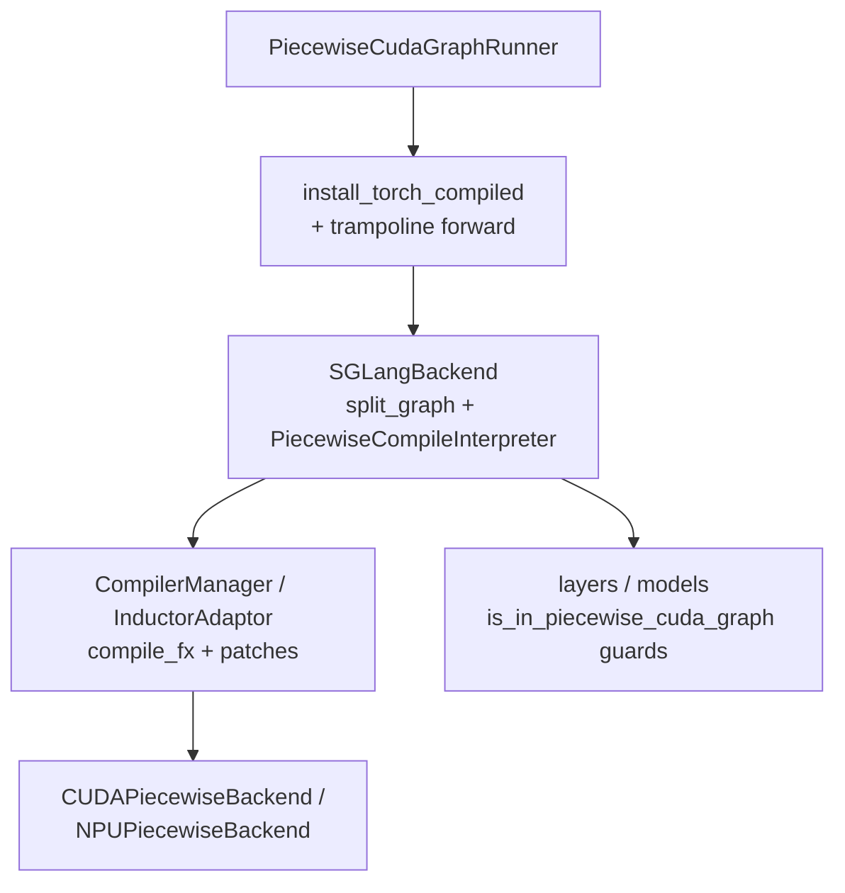

# `srt/compilation` — torch.compile / Inductor / Piecewise 图基础设施

## Summary

`srt/compilation/`（**13** `.py` 文件 / ~77 KB；**无子目录、无 `__init__.py`**）实现 SGLang 的 **PyTorch 2.x `torch.compile` 自定义后端**、**TorchInductor 适配与缓存补丁**、**FX 图按算子拆分（piecewise）**，并在 **Piecewise CUDA Graph (PCG)** 路径下与 `torch.cuda.CUDAGraph` / `torch.npu.NPUGraph` 捕获协作。入口由 [`PiecewiseCudaGraphRunner`](d:\design\sglang\python\sglang\srt\model_executor\piecewise_cuda_graph_runner.py) 调用 [`install_torch_compiled`](d:\design\sglang\python\sglang\srt\compilation\compile.py:111-201) 把 `forward` 换成 trampoline，在 [`is_in_piecewise_cuda_graph()`](d:\design\sglang\python\sglang\srt\compilation\piecewise_context_manager.py:21-22) 为真时走编译路径。

> synthesis: 与 [`model_executor/cuda_graph_runner.py`](model_executor.md)（**整段 decode CUDA 图**）不同，本模块侧重 **Dynamo / Inductor 图级编译 + PCG 子图上的设备图捕获**；二者在 **PCG** 场景通过 [`piecewise_cuda_graph_runner.py`](d:\design\sglang\python\sglang\srt\model_executor\piecewise_cuda_graph_runner.py) **串联**，但 `CudaGraphRunner` 主路径仍属另一套 runner。

> synthesis（跨项目）：[comparison/dimensions.md §dim-compile](../../comparison/dimensions.md) 把 SGLang 标为 `srt/compilation/`；vLLM 是 [`vllm/compilation/`](d:\design\vllm\vllm\compilation)（**33** `.py`，含大量 `passes/fusion/*`）+ `cudagraph_utils`；MindIE 是 `runtime/compilation/` + `aclgraph/`。SGLang 数量上较 vLLM 精简，**多个文件头明示 `Adapted from vllm v0.10.0`**，但 SGLang 引入了 **PCG 这一独有 piecewise 编排机制**。

## Sources

| 区域 | 锚点 |
|---|---|
| 模块根（13 `.py`） | [d:\design\sglang\python\sglang\srt\compilation](d:\design\sglang\python\sglang\srt\compilation) |
| `torch.compile` 安装 | [compile.py:111-201](d:\design\sglang\python\sglang\srt\compilation\compile.py)（`install_torch_compiled`）+ [L17-58](d:\design\sglang\python\sglang\srt\compilation\compile.py)（`IntermediateTensors` 流水线多段 hidden） |
| 自定义后端 / 拆分 / 解释器 | [backend.py](d:\design\sglang\python\sglang\srt\compilation\backend.py)（`SGLangBackend` L358-467 / `CompilerManager` L65-203 / `split_graph` L214-257 / `PiecewiseCompileInterpreter` L266-337 / `make_backend` L39-62 / `global_graph_pool` L260-261） |
| Inductor 适配 | [compiler_interface.py](d:\design\sglang\python\sglang\srt\compilation\compiler_interface.py)（`CompilerInterface` L20-107 / `AlwaysHitShapeEnv` L126-161 / `InductorAdaptor` L164-471 / `EagerAdapter` L481-504 / `set_inductor_config` L473-478） |
| 配置 | [compilation_config.py](d:\design\sglang\python\sglang\srt\compilation\compilation_config.py)（`CompilationConfig` L18-59 / `register_split_op` L8-14 / `configure_inductor` L48-59） |
| Post-grad pass | [pass_manager.py:18-66](d:\design\sglang\python\sglang\srt\compilation\pass_manager.py)（`PostGradPassManager`） |
| Pass 抽象 | [inductor_pass.py:48-92, 114-131](d:\design\sglang\python\sglang\srt\compilation\inductor_pass.py)（`InductorPass` / `SGLangInductorPass`） |
| Functionalization 修复 | [fix_functionalization.py:17-48](d:\design\sglang\python\sglang\srt\compilation\fix_functionalization.py)（`FixFunctionalizationPass`） |
| FX 工具 | [fx_utils.py](d:\design\sglang\python\sglang\srt\compilation\fx_utils.py) |
| CUDA 分段后端 | [cuda_piecewise_backend.py:40-206](d:\design\sglang\python\sglang\srt\compilation\cuda_piecewise_backend.py)（`CUDAPiecewiseBackend`、`ConcreteSizeEntry` L23-37） |
| NPU 分段后端 | [npu_piecewise_backend.py:16-109](d:\design\sglang\python\sglang\srt\compilation\npu_piecewise_backend.py)（`NPUPiecewiseBackend`） |
| 上下文 | [piecewise_context_manager.py:21-118](d:\design\sglang\python\sglang\srt\compilation\piecewise_context_manager.py)（`is_in_piecewise_cuda_graph` / `is_in_pcg_torch_compile` / `set_forward_context` / `ForwardContext`） |
| 弱引用张量 | [weak_ref_tensor.py:15-28](d:\design\sglang\python\sglang\srt\compilation\weak_ref_tensor.py)（→ `sgl_kernel` / `torch_npu`） |
| 计数器 | [compilation_counter.py:9-30](d:\design\sglang\python\sglang\srt\compilation\compilation_counter.py)（`CompilationCounter`） |
| PCG 集成 | [piecewise_cuda_graph_runner.py:29-320](d:\design\sglang\python\sglang\srt\model_executor\piecewise_cuda_graph_runner.py) |
| CLI / env | [server_args.py:646-653, 5854-5902, 3689-3690](d:\design\sglang\python\sglang\srt\server_args.py) |

## Architecture / Data flow

[`install_torch_compiled`](d:\design\sglang\python\sglang\srt\compilation\compile.py:111-201) 将默认后端设为 [`SGLangBackend(compile_config, graph_pool)`](d:\design\sglang\python\sglang\srt\compilation\compile.py:127-132)；[`SGLangBackend.__call__`](d:\design\sglang\python\sglang\srt\compilation\backend.py:396-467) 对 FX 图 [`split_graph`](d:\design\sglang\python\sglang\srt\compilation\backend.py:214-257)，再用 [`PiecewiseCompileInterpreter.run`](d:\design\sglang\python\sglang\srt\compilation\backend.py:288-337) 为各子模块调用 `CompilerManager.compile` 并 [`make_backend`](d:\design\sglang\python\sglang\srt\compilation\backend.py:39-62) 安装 `CUDAPiecewiseBackend` / `NPUPiecewiseBackend`。

[`CUDAPiecewiseBackend.__call__`](d:\design\sglang\python\sglang\srt\compilation\cuda_piecewise_backend.py:107-206) 在非 compile-only 路径上对 `entry.runnable` 做 `torch.cuda.graph` 捕获（[L156-187](d:\design\sglang\python\sglang\srt\compilation\cuda_piecewise_backend.py)），输出经 [`weak_ref_tensors`](d:\design\sglang\python\sglang\srt\compilation\weak_ref_tensor.py:15-28) 减压。

## File inventory（13 文件）

| 分组 | 文件 | 角色 |
|---|---|---|
| **入口 API** | [compile.py](d:\design\sglang\python\sglang\srt\compilation\compile.py) | `install_torch_compiled`、`IntermediateTensors`、动态维标记 |
| **后端与拆分** | [backend.py](d:\design\sglang\python\sglang\srt\compilation\backend.py) | `SGLangBackend`、`split_graph`、`PiecewiseCompileInterpreter`、`CompilerManager`、`global_graph_pool` |
| **Inductor 适配** | [compiler_interface.py](d:\design\sglang\python\sglang\srt\compilation\compiler_interface.py) | `CompilerInterface`、`InductorAdaptor`（多 patch：`compile_fx`、`FxGraphCache`、`compiled_fx_graph_hash`）、`AlwaysHitShapeEnv`、`EagerAdapter` |
| **配置** | [compilation_config.py](d:\design\sglang\python\sglang\srt\compilation\compilation_config.py) | `CompilationConfig`、`register_split_op`、`configure_inductor`（`combo_kernels` 等） |
| **Pass 基础设施** | [pass_manager.py](d:\design\sglang\python\sglang\srt\compilation\pass_manager.py) | `PostGradPassManager` |
| | [inductor_pass.py](d:\design\sglang\python\sglang\srt\compilation\inductor_pass.py) | `InductorPass`、`pass_context`、`SGLangInductorPass` |
| | [fix_functionalization.py](d:\design\sglang\python\sglang\srt\compilation\fix_functionalization.py) | `FixFunctionalizationPass` |
| | [fx_utils.py](d:\design\sglang\python\sglang\srt\compilation\fx_utils.py) | FX 节点查找、`auto_functionalized` 辅助 |
| **设备分段后端** | [cuda_piecewise_backend.py](d:\design\sglang\python\sglang\srt\compilation\cuda_piecewise_backend.py) | `CUDAPiecewiseBackend`、`ConcreteSizeEntry` |
| | [npu_piecewise_backend.py](d:\design\sglang\python\sglang\srt\compilation\npu_piecewise_backend.py) | `NPUPiecewiseBackend`（`torch.npu.NPUGraph`） |
| **运行时上下文** | [piecewise_context_manager.py](d:\design\sglang\python\sglang\srt\compilation\piecewise_context_manager.py) | `is_in_piecewise_cuda_graph`、`is_in_pcg_torch_compile`、`set_forward_context` / `ForwardContext` |
| **互操作** | [weak_ref_tensor.py](d:\design\sglang\python\sglang\srt\compilation\weak_ref_tensor.py) | `weak_ref_tensors` → `sgl_kernel` / `torch_npu` |
| **观测** | [compilation_counter.py](d:\design\sglang\python\sglang\srt\compilation\compilation_counter.py) | `CompilationCounter` 全局计数 |

## Key classes / passes

| 名称 | 锚点 | 作用 |
|---|---|---|
| `CompilationConfig` | [compilation_config.py:18-59](d:\design\sglang\python\sglang\srt\compilation\compilation_config.py) | 持有 `capture_sizes`（PCG token 列表）、`compiler`（`eager`/`inductor`）、`split_ops`、`traced_files`；`inductor` 时开 `combo_kernels`（若存在） |
| `install_torch_compiled` | [compile.py:111-201](d:\design\sglang\python\sglang\srt\compilation\compile.py) | 注册 bytecode hook、`torch.compile(..., backend=SGLangBackend)`，trampoline 按 `is_in_piecewise_cuda_graph()` 选编译或原始 forward |
| `SGLangBackend` | [backend.py:358-467](d:\design\sglang\python\sglang\srt\compilation\backend.py) | 配置 `PostGradPassManager` ([L382-394](d:\design\sglang\python\sglang\srt\compilation\backend.py))、`split_graph`、缓存目录 [`envs.SGLANG_CACHE_DIR`](d:\design\sglang\python\sglang\srt\compilation\backend.py:397-404) 下 `torch_compile_cache` |
| `PostGradPassManager` | [pass_manager.py:18-66](d:\design\sglang\python\sglang\srt\compilation\pass_manager.py) | Inductor `post_grad_custom_post_pass`：先跑注册的 `passes`，再 `fix_functionalization` ([L42-43](d:\design\sglang\python\sglang\srt\compilation\pass_manager.py)) |
| `InductorAdaptor` | [compiler_interface.py:164-471](d:\design\sglang\python\sglang\srt\compilation\compiler_interface.py) | `compile_fx` + 多处 `unittest.mock.patch` 支持 Inductor 缓存 / 形状环境 在 SGLang 用法下的行为 |
| `CUDAPiecewiseBackend` | [cuda_piecewise_backend.py:40-206](d:\design\sglang\python\sglang\srt\compilation\cuda_piecewise_backend.py) | 子图 runnable 上 CUDA Graph 捕获/回放；与 `is_in_pcg_torch_compile()` 分支协作（[L143-144](d:\design\sglang\python\sglang\srt\compilation\cuda_piecewise_backend.py)） |

## torch.compile integration

- **自定义 backend**：[`install_torch_compiled`](d:\design\sglang\python\sglang\srt\compilation\compile.py:178-180) 用 `torch.compile(bound, fullgraph=True, backend=backend_factory)`，默认 `backend_factory` 构造 [`SGLangBackend`](d:\design\sglang\python\sglang\srt\compilation\compile.py:127-132)。
- **Inductor 配置注入**：[`SGLangBackend.configure_post_pass`](d:\design\sglang\python\sglang\srt\compilation\backend.py:392-394) 将 `PostGradPassManager` 挂到 `inductor_config["post_grad_custom_post_pass"]`。
- **缓存与 Triton**：[`InductorAdaptor.initialize_cache`](d:\design\sglang\python\sglang\srt\compilation\compiler_interface.py:178-195) 设置 `TORCHINDUCTOR_CACHE_DIR` 与 `TRITON_CACHE_DIR`；[`set_inductor_config`](d:\design\sglang\python\sglang\srt\compilation\compiler_interface.py:473-478) 在 `runtime_shape` 为 `int` 时开启 `max_autotune` / `coordinate_descent_tuning`。
- **Dynamo 侧**：[`set_torch_compile_config`](d:\design\sglang\python\sglang\srt\model_executor\piecewise_cuda_graph_runner.py:136-141) 提高 `accumulated_cache_size_limit` / `cache_size_limit`，缓解 `FailOnRecompileLimitHit`。

## Relationship to `model_executor/cuda_graph_runner.py`

| 维度 | `srt/compilation/` | `model_executor/cuda_graph_runner.py` ([CudaGraphRunner](d:\design\sglang\python\sglang\srt\model_executor\cuda_graph_runner.py)) |
|---|---|---|
| **关注点** | Dynamo FX → Inductor/eager 子图 +（PCG 下）**分段** `CUDAGraph` | **Decode 等**场景下**整段** CUDA 图捕获 / 回放、batch size bucket、输入 buffer |
| **装配入口** | [`PiecewiseCudaGraphRunner`](d:\design\sglang\python\sglang\srt\model_executor\piecewise_cuda_graph_runner.py) 直接 import `compilation`（[L30-36](d:\design\sglang\python\sglang\srt\model_executor\piecewise_cuda_graph_runner.py)） | [`ModelRunner`](d:\design\sglang\python\sglang\srt\model_executor\model_runner.py) 按路径选择 `graph_runner`（详 [model_executor.md](model_executor.md)） |
| **「Piecewise」语义重叠** | **FX 拆分 + 子图 Inductor + 子图 CUDAGraph** 三层叠加 | [`piecewise_cuda_graph_runner.py`](d:\design\sglang\python\sglang\srt\model_executor\piecewise_cuda_graph_runner.py) 是**编排器**；**核心编译逻辑**在 `compilation/` |

> synthesis: 产品文档 [piecewise_cuda_graph.md](d:\design\sglang\docs\advanced_features\piecewise_cuda_graph.md) 把 `install_torch_compiled` / `SGLangBackend` / `CUDAPiecewiseBackend` 与 `piecewise_cuda_graph_runner.py` 并列表述（[L182-186](d:\design\sglang\docs\advanced_features\piecewise_cuda_graph.md)），与源码 import 关系一致。

## CLI / config 字段

| 字段 / flag | 锚点 | 与 `compilation/` 的关系 |
|---|---|---|
| `enable_torch_compile` / `--enable-torch-compile` | [server_args.py:646, 5854-5857](d:\design\sglang\python\sglang\srt\server_args.py) | 驱动 `SGLANG_ENABLE_TORCH_COMPILE`（[L3689-3690](d:\design\sglang\python\sglang\srt\server_args.py)）；**全局 torch.compile 实验开关**（与 PCG 并行，本模块页不展开 logits 等具体分支） |
| `enable_torch_compile_debug_mode` / `--enable-torch-compile-debug-mode` | [server_args.py:649, 5859-5862](d:\design\sglang\python\sglang\srt\server_args.py) | 传入 `CompilationConfig` 构造函数第三参（[piecewise_cuda_graph_runner.py:178-182](d:\design\sglang\python\sglang\srt\model_executor\piecewise_cuda_graph_runner.py)） |
| `piecewise_cuda_graph_compiler` / `--piecewise-cuda-graph-compiler` | [server_args.py:653, 5885-5890](d:\design\sglang\python\sglang\srt\server_args.py) | `eager` / `inductor` → `CompilationConfig.compiler`（[L22-27](d:\design\sglang\python\sglang\srt\compilation\compilation_config.py)） |
| `piecewise_cuda_graph_tokens` / `--piecewise-cuda-graph-tokens` | [server_args.py:652, 5879-5883](d:\design\sglang\python\sglang\srt\server_args.py) | → `CompilationConfig.capture_sizes`（[piecewise_cuda_graph_runner.py:178-179](d:\design\sglang\python\sglang\srt\model_executor\piecewise_cuda_graph_runner.py)） |
| `disable_piecewise_cuda_graph` / `enforce_piecewise_cuda_graph` | [server_args.py:647-648, 5864-5877](d:\design\sglang\python\sglang\srt\server_args.py) | PCG 总开关语义 |
| `torch_compile_max_bs` / `--torch-compile-max-bs` | [server_args.py:650, 5892-5896](d:\design\sglang\python\sglang\srt\server_args.py) | **CPU 图等**与 max batch 相关；**非** `CompilationConfig` 本类字段 |

## §跨子系统引用（§5 step 3）

按 [AGENTS.md §5 step 3](../../AGENTS.md#5-ingest-工作流) 5 类全仓库 grep。

### 1. 跨语言绑定（C++ / sgl-kernel）

- [`weak_ref_tensor.py`](d:\design\sglang\python\sglang\srt\compilation\weak_ref_tensor.py)：CUDA / HIP / MUSA 路径 `from sgl_kernel import weak_ref_tensor`（[L7-12](d:\design\sglang\python\sglang\srt\compilation\weak_ref_tensor.py)）；[`sgl_kernel/memory.py`](d:\design\sglang\sgl-kernel\python\sgl_kernel\memory.py) 暴露 `torch.ops.sgl_kernel.weak_ref_tensor`。
- **`SGLangBackend` / `install_torch_compiled` / `PostGradPassManager`**：在 [`d:\design\sglang\sgl-kernel\`](d:\design\sglang\sgl-kernel) 全树 grep **0 命中**（与 Python 包 `sglang.srt.compilation` 无直接符号绑定）

> synthesis: **`weak_ref_tensor` 是 SGLang `compilation/` 唯一的 sgl-kernel C++ 算子绑定** —— 与 [`distributed/` 的 `shm_allreduce`](distributed.md) 和 [`speculative/` 的 `verify_tree_greedy`](speculative.md) 形成"小数量但精准"的跨语言模式。

### 2. 协作伙伴跨子系统引用

直接 import `compilation` 子模块（非穷举）：
- [piecewise_cuda_graph_runner.py](d:\design\sglang\python\sglang\srt\model_executor\piecewise_cuda_graph_runner.py)
- [layers/attention/*_backend.py](d:\design\sglang\python\sglang\srt\layers\attention)
- [layers/moe/](d:\design\sglang\python\sglang\srt\layers\moe)
- [distributed/parallel_state.py](d:\design\sglang\python\sglang\srt\distributed\parallel_state.py)
- [models/](d:\design\sglang\python\sglang\srt\models) 等对 `is_in_piecewise_cuda_graph` / `register_split_op` / `get_forward_context` 的引用

### 3. 配置 / 环境变量

- [`envs.SGLANG_CACHE_DIR`](d:\design\sglang\python\sglang\srt\compilation\backend.py:397) → `torch_compile_cache` 子路径
- [`SGLANG_ENABLE_TORCH_COMPILE`](d:\design\sglang\python\sglang\srt\server_args.py:3689-3690) 由 `enable_torch_compile` 设置
- piecewise 专用字段以 `ServerArgs.piecewise_cuda_graph_*` 为主（见上表）

### 4. 测试覆盖反查

- `sglang.srt.compilation` **显式 import**：在 [`d:\design\sglang\test\`](d:\design\sglang\test) 全树 grep **0 命中**
- 集成级覆盖：[test/registered/piecewise_cuda_graph/](d:\design\sglang\test\registered\piecewise_cuda_graph)、[test/manual/piecewise_cudagraph/](d:\design\sglang\test\manual\piecewise_cudagraph) 等（**间接** exercise `compilation/`）

### 5. doc / config 反查

- [docs/advanced_features/piecewise_cuda_graph.md](d:\design\sglang\docs\advanced_features\piecewise_cuda_graph.md) 系统化描述 PCG + `SGLangBackend` 流程（[L102-116](d:\design\sglang\docs\advanced_features\piecewise_cuda_graph.md)）
- [docs/references/torch_compile_cache.md](d:\design\sglang\docs\references\torch_compile_cache.md) 描述部署侧 Inductor 缓存

## 跨项目对照（synthesis）

| 维度 | MindIE | vLLM | SGLang（本模块） |
|---|---|---|---|
| **目录规模** | `runtime/compilation/` + `aclgraph/`（dimensions §dim-compile） | [`vllm/compilation/`](d:\design\vllm\vllm\compilation) **33** `.py`，含 `passes/fusion/*` 大量融合 pass | **13** `.py`，**无**独立 `passes/` 子树；融合类逻辑主要在 Inductor 配置 + 少量 pass |
| **与 torch.compile 关系** | aclgraph 路径独立；torch.compile 对 NPU 适配未本轮 ingest | 同源风格的 `compiler_interface` / piecewise 等（SGLang 文件头 **`Adapted from vllm v0.10.0`** 注释印证血缘） | `InductorAdaptor` + `SGLangBackend` + **PCG 集成** |
| **设备图** | aclgraph（NPU 路径） | `vllm/compilation/cuda_graph.py` 等 + worker 侧 `cudagraph_utils` | **PCG** 在 `cuda_piecewise_backend.py` 内嵌**子图** CUDAGraph；**decode 整段图**在 [`cuda_graph_runner.py`](d:\design\sglang\python\sglang\srt\model_executor\cuda_graph_runner.py)（独立模块） |
| **跨语言绑定** | （未本轮 ingest） | 通常无独立 C++ kernel | 仅 1 个：`weak_ref_tensor` |

## Notes / Caveats

> [!todo] VERIFY: ~~[`CUDAPiecewiseBackend`](d:\design\sglang\python\sglang\srt\compilation\cuda_piecewise_backend.py) 文档写 `compilation_config.compile_sizes`（[L60](d:\design\sglang\python\sglang\srt\compilation\cuda_piecewise_backend.py)），但 [`CompilationConfig`](d:\design\sglang\python\sglang\srt\compilation\compilation_config.py) **无** `compile_sizes` 字段，且 [`self.compile_sizes = set([])`](d:\design\sglang\python\sglang\srt\compilation\cuda_piecewise_backend.py:77) 恒为空——按形状二次 Inductor 编译分支是否可达需再核对。~~
> **RESOLVED 2026-04-19**: **当前不可达**——[`cuda_piecewise_backend.py:77`](d:\design\sglang\python\sglang\srt\compilation\cuda_piecewise_backend.py) `self.compile_sizes: set[int] = set([])` 写死为空集，L93-97 中 `to_be_compiled_sizes = self.compile_sizes.copy()` 与 `for shape in self.compile_sizes.union(self.cudagraph_capture_sizes)` 仅会处理 `cudagraph_capture_sizes`；`need_to_compile=shape in self.compile_sizes` 永远为 False。文档字符串提到 `compilation_config.compile_sizes` 是 vLLM 上游残留（参考 backend.py 头注 "Adapted from vllm v0.10.0"），SGLang `CompilationConfig` 未实现该字段，按形状二次 Inductor 编译分支为 **死代码**。

> [!todo] VERIFY: ~~[`FixFunctionalizationPass.__call__`](d:\design\sglang\python\sglang\srt\compilation\fix_functionalization.py:26-48) 未调用 `defunctionalize`，与类文档"向 if-elif 链添加"一致；**当前是否仅为占位**待与 vLLM 同源实现对照（vLLM [`fix_functionalization.py`](d:\design\vllm\vllm\compilation\passes\utility\fix_functionalization.py)）。~~
> **RESOLVED 2026-04-19**: 当前为**占位**——[`fix_functionalization.py:32-35`](d:\design\sglang\python\sglang\srt\compilation\fix_functionalization.py) `__call__` 仅遍历 `auto_functionalized` 节点并 `count += 1`（无任何 if-elif 真正分派到 `defunctionalize`），`nodes_to_remove` 始终为空；helper 方法 `defunctionalize` / `_remove` / `replace_users_with_mutated_args` / `insert_defunctionalized` 均已实现（L50-134），但**未在 `__call__` 中被调用**。文件头明示 "Adapted from https://github.com/vllm-project/vllm/blob/v0.10.0/vllm/compilation/fix_functionalization.py" — 待按需向 if-elif 链添加业务节点。

> [!warning] CONTRADICTION（注释陈旧）：~~[`CompilerInterface`](d:\design\sglang\python\sglang\srt\compilation\compiler_interface.py:20-23) 文档仍写 *"used by vLLM"*，与 SGLang 仓库身份不符——属**注释陈旧**，非运行时逻辑错误。~~
> **RESOLVED 2026-04-19**: 已源码确认为注释陈旧——多个 `compilation/` 文件头部明示 "Adapted from https://github.com/vllm-project/vllm/blob/v0.10.0/..."（`backend.py:1`、`fix_functionalization.py:1` 等），`CompilerInterface` 类 docstring 中残留 "used by vLLM" 字样为复制时未替换，无运行时影响（不需要源码修改即可使用，作为已知遗留物保留）。

## See also

- [sglang/modules/model_executor.md](model_executor.md) — `CudaGraphRunner` / `PiecewiseCudaGraphRunner` 总览
- [sglang/modules/distributed.md](distributed.md) — `graph_capture` / 并行 rank 与 PCG 协作（runner import [`graph_capture`](d:\design\sglang\python\sglang\srt\model_executor\piecewise_cuda_graph_runner.py:42)）
- [sglang/modules/speculative.md](speculative.md) — sgl-kernel 跨语言绑定模式参照（含 `verify_tree_greedy` / `tree_speculative_sampling_target_only`）
- [comparison/dimensions.md §dim-compile](../../comparison/dimensions.md) — 三项目索引行
- [docs/advanced_features/piecewise_cuda_graph.md](d:\design\sglang\docs\advanced_features\piecewise_cuda_graph.md) — 产品级流程说明
