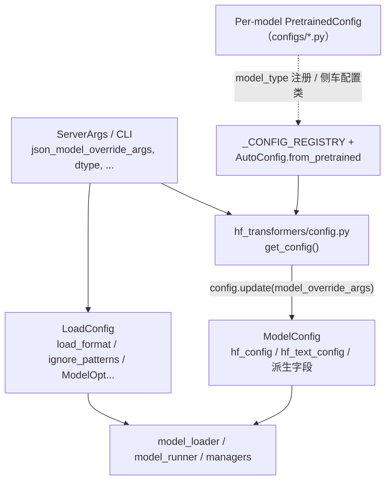

# `srt/configs` — ModelConfig、LoadConfig 与按模型 HF 配置

## Summary

[`python/sglang/srt/configs/`](d:\design\sglang\python\sglang\srt\configs)（**44** 个 `.py`）是 SGLang 运行时的 **模型与加载配置层**：[`ModelConfig`](d:\design\sglang\python\sglang\srt\configs\model_config.py) 从 HF `config.json`（经 [`get_config`](d:\design\sglang\python\sglang\srt\utils\hf_transformers\config.py)）拉取并派生 `dtype`、上下文长度、多模态/量化等运行时标志；[`LoadConfig`](d:\design\sglang\python\sglang\srt\configs\load_config.py) 描述 **权重文件格式与加载侧选项**（与 `ModelConfig` 正交）。其余文件多为 **按模型族复制的 `PretrainedConfig` 子类**（部分标注 *Adapted from transformers / vLLM*），并在 [`__init__.py`](d:\design\sglang\python\sglang\srt\configs\__init__.py) 中汇总导出。

> synthesis: `tokenizer_path` 等 **Tokenizer 路径** 不在 `ModelConfig` 上作为字段出现；远程场景下通过 [`_maybe_pull_model_tokenizer_from_remote`](d:\design\sglang\python\sglang\srt\configs\model_config.py) 把 `model_path` 换成本地目录后再走 HF 加载链，详见 [model_config.py:1189-1210](d:\design\sglang\python\sglang\srt\configs\model_config.py)。

## Sources

| 角色 | 锚点 |
|---|---|
| 主运行时配置 | [`model_config.py`](d:\design\sglang\python\sglang\srt\configs\model_config.py)（`ModelConfig`、`ModelImpl`、`AttentionArch`、EOS/量化等） |
| 权重加载配置 | [`load_config.py`](d:\design\sglang\python\sglang\srt\configs\load_config.py)（`LoadFormat`、`LoadConfig`） |
| TP 填充 / 中间层尺寸 | [`update_config.py`](d:\design\sglang\python\sglang\srt\configs\update_config.py)（`adjust_config_with_unaligned_cpu_tp` 等） |
| HF 配置加载与 CLI JSON 合并 | [`hf_transformers/config.py`](d:\design\sglang\python\sglang\srt\utils\hf_transformers\config.py)（`get_config`，`model_override_args` → `config.update`） |
| 包导出 | [`configs/__init__.py`](d:\design\sglang\python\sglang\srt\configs\__init__.py) |
| Processor 注册 helper | [`configs/utils.py`](d:\design\sglang\python\sglang\srt\configs\utils.py) |
| 设备抽象 | [`device_config.py`](d:\design\sglang\python\sglang\srt\configs\device_config.py) |

## Architecture / Data flow

- **CLI → HF 配置合并**：[`ModelConfig.__init__`](d:\design\sglang\python\sglang\srt\configs\model_config.py) 将 `model_override_args` 解析为 dict 后传入 [`get_config`](d:\design\sglang\python\sglang\srt\utils\hf_transformers\config.py)；最终在 [`get_config` 尾部](d:\design\sglang\python\sglang\srt\utils\hf_transformers\config.py) 对 `PretrainedConfig` 调用 `config.update(model_override_args)`。
- **LoadConfig 分离**：[`LoadConfig`](d:\design\sglang\python\sglang\srt\configs\load_config.py) 为 `@dataclass`，管 `load_format`、`download_dir`、`ignore_patterns`、远端实例/ModelOpt 等；**不包含** `hf_config`。
- **update_config.py 语义**：[`adjust_config_with_unaligned_cpu_tp`](d:\design\sglang\python\sglang\srt\configs\update_config.py) 在 TP 与 head 数不整除时改写 `hf_config` / `hf_text_config` 上的 head 与 intermediate 尺寸，**不是** JSON 覆盖合并逻辑。

## File inventory

### 核心与基础设施（4 + 5）

| 分组 | 文件 | 说明 |
|---|---|---|
| **核心三件套** | `model_config.py` · `load_config.py` · `update_config.py` | 运行时 `ModelConfig`、权重 `LoadConfig`、TP 对齐辅助 |
| **包聚合** | [`__init__.py`](d:\design\sglang\python\sglang\srt\configs\__init__.py) | 导出各 `*Config` 符号 |
| **辅助** | [`utils.py`](d:\design\sglang\python\sglang\srt\configs\utils.py) | `register_image_processor` / `register_processor` (L12-27) |
| | [`device_config.py`](d:\design\sglang\python\sglang\srt\configs\device_config.py) | `DeviceConfig`（`SUPPORTED_DEVICES`） |
| | `modelopt_config.py` | 与 `LoadConfig.modelopt_config` 联动 |
| | `linear_attn_model_registry.py` | 线性注意力相关注册 |
| | `mamba_utils.py` | Mamba 配置辅助 |

### 按模型族（1 行一族）

| 族 | 代表文件 |
|---|---|
| **Qwen3 系** | `qwen3_vl.py`, `qwen3_omni.py`, `qwen3_asr.py`, `qwen3_next.py`, `qwen3_5.py` |
| **Kimi** | `kimi_vl.py`, `kimi_vl_moonvit.py`, `kimi_k25.py`, `kimi_linear.py` |
| **DeepSeek / VL** | `deepseekvl2.py`, `deepseek_ocr.py` |
| **Step / 长猫 / 点阵** | `step3_vl.py`, `step3p5.py`, `longcat_flash.py`, `dots_vlm.py`, `dots_ocr.py` |
| **Nemotron / Jet** | `nemotron_h.py`, `nano_nemotron_vl.py`, `jet_nemotron.py`, `jet_vlm.py` |
| **LFM2** | `lfm2.py`, `lfm2_moe.py`, `lfm2_vl.py` |
| **其他 HF 侧车** | `internvl.py`, `janus_pro.py`, `chatglm.py`, `dbrx.py`, `exaone.py`, `falcon_h1.py`, `granitemoehybrid.py`, `afmoe.py`, `bailing_hybrid.py`, `olmo3.py`, `points_v15_chat.py`, `radio.py` |

## ModelConfig — 字段表（Top 20）

| # | 属性 / 参数 | 类型（观察） | 默认 / 来源 | 锚点 |
|---|-------------|-------------|-------------|------|
| 1 | `model_path` | `str` | 构造参数 | [L119-120](d:\design\sglang\python\sglang\srt\configs\model_config.py) |
| 2 | `trust_remote_code` | `bool` | 默认 `True` | [L100](d:\design\sglang\python\sglang\srt\configs\model_config.py) |
| 3 | `revision` | `Optional[str]` | `None` | [L101-102](d:\design\sglang\python\sglang\srt\configs\model_config.py) |
| 4 | `hf_config` | `PretrainedConfig` | `get_config(...)` | [L139-145](d:\design\sglang\python\sglang\srt\configs\model_config.py) |
| 5 | `hf_text_config` | `PretrainedConfig` | `get_hf_text_config` | [L146](d:\design\sglang\python\sglang\srt\configs\model_config.py) |
| 6 | `hf_generation_config` | 来自 `get_generation_config` | 同上 | [L147-152](d:\design\sglang\python\sglang\srt\configs\model_config.py) |
| 7 | `quantization` | `Optional[str]` | `None` | [L107](d:\design\sglang\python\sglang\srt\configs\model_config.py) |
| 8 | `dtype`（计算后 `torch.dtype`） | 参数 `str` 默认 `"auto"` | `_get_and_verify_dtype` | [L106](d:\design\sglang\python\sglang\srt\configs\model_config.py)、[L224](d:\design\sglang\python\sglang\srt\configs\model_config.py) |
| 9 | `attention_chunk_size` | 来自 `hf_text_config` | `getattr(..., None)` | [L176-178](d:\design\sglang\python\sglang\srt\configs\model_config.py) |
| 10 | `sliding_window_size` | `Optional[int]` | `_get_sliding_window_size()` | [L179](d:\design\sglang\python\sglang\srt\configs\model_config.py) |
| 11 | `is_multimodal` / `is_audio_model` 等 | `bool` | 架构 + `enable_multimodal` | [L183-214](d:\design\sglang\python\sglang\srt\configs\model_config.py) |
| 12 | `context_len` | `int` | `_derive_context_length` | [L391-423](d:\design\sglang\python\sglang\srt\configs\model_config.py) |
| 13 | `hf_eos_token_id` | `Optional[Set[int]]` | `_get_hf_eos_token_id` | [L242](d:\design\sglang\python\sglang\srt\configs\model_config.py)、[L1130-1148](d:\design\sglang\python\sglang\srt\configs\model_config.py) |
| 14 | `think_end_id` | `Optional[int]` | 默认 `None`（调度器设置） | [L243-244](d:\design\sglang\python\sglang\srt\configs\model_config.py) |
| 15 | `image_token_id` | `Optional[int]` | `image_token_id` / `image_token_index` | [L246-249](d:\design\sglang\python\sglang\srt\configs\model_config.py) |
| 16 | `model_impl` | `ModelImpl` | `ModelImpl.AUTO` | [L110-111](d:\design\sglang\python\sglang\srt\configs\model_config.py) |
| 17 | `num_attention_heads` / `hidden_size` 等 | `int` | `_derive_model_shapes` | [L425+](d:\design\sglang\python\sglang\srt\configs\model_config.py) |
| 18 | `attention_arch` | `AttentionArch` | MLA/MHA 分支 | [L448-572](d:\design\sglang\python\sglang\srt\configs\model_config.py) |
| 19 | `model_override_args` | `dict` | `json.loads(model_override_args)` | [L135-136](d:\design\sglang\python\sglang\srt\configs\model_config.py) |
| 20 | `model_weights` | 可选（RunAI/远程） | RunAI / 远程 URL 路径 | [L1182-1187](d:\design\sglang\python\sglang\srt\configs\model_config.py)、[L1209-1210](d:\design\sglang\python\sglang\srt\configs\model_config.py) |

## LoadConfig — 交叉引用

- **定义**：[load_config.py:37-105](d:\design\sglang\python\sglang\srt\configs\load_config.py)
- **与 ModelConfig 关系**：`ModelConfig` 不继承 `LoadConfig`；权重路径/格式由 `LoadConfig` + `model_loader` 消费（详见 [model_loader.md](model_loader.md)）。
- **`LoadFormat` 枚举**（**19** 成员）：[load_config.py:15-34](d:\design\sglang\python\sglang\srt\configs\load_config.py)

## Lineage（Adapted from transformers / vLLM）

- **明确标注 vLLM**：[load_config.py:1](d:\design\sglang\python\sglang\srt\configs\load_config.py)、[kimi_linear.py:1](d:\design\sglang\python\sglang\srt\configs\kimi_linear.py)、[nemotron_h.py:14](d:\design\sglang\python\sglang\srt\configs\nemotron_h.py)。
- **明确标注 HF hub / transformers**：[nano_nemotron_vl.py:14](d:\design\sglang\python\sglang\srt\configs\nano_nemotron_vl.py)、[kimi_vl.py:2](d:\design\sglang\python\sglang\srt\configs\kimi_vl.py)。
- **`model_config.py`** 内多处方法注明 *adapted from vllm*（如 [L710](d:\design\sglang\python\sglang\srt\configs\model_config.py) `_parse_quant_hf_config`、[L937](d:\design\sglang\python\sglang\srt\configs\model_config.py) `_verify_quantization`）。
- **`internvl.py`** 标明 Copied from InternVL 上游（[internvl.py:20](d:\design\sglang\python\sglang\srt\configs\internvl.py)）。

## CLI 交叉引用

- **字段级入口**：优先 [`ModelConfig.from_server_args`](d:\design\sglang\python\sglang\srt\configs\model_config.py)（将 `ServerArgs` 映射到 `ModelConfig` 构造参数）。
- **JSON 覆盖**：`json_model_override_args` → `get_config` → `config.update`（[hf_transformers/config.py:204-205](d:\design\sglang\python\sglang\srt\utils\hf_transformers\config.py)）。
- **未逐项枚举** `--model-path`、`--dtype`、`--quantization`、`--load-format` 等；完整 CLI 见 [`server_args.py`](d:\design\sglang\python\sglang\srt\server_args.py) 与 [model_loader.md](model_loader.md)。

## §跨子系统（5 类 grep）

| # | 子系统 | 结论 |
|---|--------|------|
| 1 | sgl-kernel | `configs/` **未** import sgl-kernel；内核调用在别处（如 test 中 `torch.ops.sgl_kernel`） |
| 2 | Collaborator imports | `from sglang.srt.configs` 在 `python/sglang/srt/` 下 **约 95** 个 `.py` 文件出现（含 `configs` 自引用、`model_executor`、`managers`、`model_loader`、`lora`、`layers/attention`、`disaggregation` 等） |
| 3 | CLI | 见上节；锚点在 `ModelConfig.from_server_args` 与 `get_config` |
| 4 | Tests | 例：[`test/registered/unit/configs/test_linear_attn_model_registry.py`](d:\design\sglang\test\registered\unit\configs\test_linear_attn_model_registry.py)；其余分散在 `test/registered/quant/`、`model_loader/` 等 |
| 5 | Docs | 上游 per-model README 非本仓库事实来源；本页以源码为准 |

## Increment 2026-08-18 (06f32bab → f7101b0a)

- **新模型族 Muse Glimmer 配置**（commit `fde9ad2531` #34262）：新增 [`configs/muse_glimmer.py`](d:\design\sglang\python\sglang\srt\configs\muse_glimmer.py) 与 [`configs/muse_glimmer_processing.py`](d:\design\sglang\python\sglang\srt\configs\muse_glimmer_processing.py)。
- **文件数重核**：`git ls-tree` @06f32bab = **61** 个 `.py` → HEAD = **63**（+2）。正文「44 个 `.py`」为 2026-04-19 旧口径，pin 时即已漂移。
- **进程内配置读取改为 "config bag" 机制**（commit 系列 `2b278b4ac4`…`b3c8f0d923`，#35022-#35028，2026-08-15~17）：**机制落点不在 `configs/` 也不在 `server_args.py`，而在顶层 [`srt/runtime_context.py`](d:\design\sglang\python\sglang\srt\runtime_context.py)**（在 `configs/` 全树 grep `bag` 0 命中）。核心是 [`_ConfigBag`](d:\design\sglang\python\sglang\srt\runtime_context.py) 类（[runtime_context.py:L593-612](d:\design\sglang\python\sglang\srt\runtime_context.py)）：**publish 时从 `server_args` snapshot 出只读命名空间袋**，此后 bag 是其字段的单一事实来源，`server_args` 退化为 "pristine, READ-ONLY record that the config bags were projected from"（[server_args.py:L9023-9024](d:\design\sglang\python\sglang\srt\server_args.py) 注释原文）；读取用普通属性访问（叶子存 `__dict__` 以便 torch.compile/dynamo 可 trace，[runtime_context.py:L603-612](d:\design\sglang\python\sglang\srt\runtime_context.py)），写入仅经 `get_context().override(...)`。顶层访问器为 `get_device()` / `get_model()` / `get_exec()` / `get_schedule()` / `get_memory()` / `get_spec()` / `get_lora()` / `get_mm()` / `get_disagg()`（[runtime_context.py:L1107-1140](d:\design\sglang\python\sglang\srt\runtime_context.py)；`parallel` 由 `get_parallel()` live wrapper 单独承担）。synthesis: 该系列把散布各进程的 `self.server_args.xxx` 读取批量改写为 bag 读取（如 #35026 一个 commit 即触及 tokenizer_manager / scheduler / model_executor 等 19+ 文件），本页 `ModelConfig`/`LoadConfig` 结构未变，但「配置消费方式」叙述需注意此新分层。

> [!todo] VERIFY: `runtime_context.py` 的 publish 时机（#35023 "publish before a process reads configuration"）与 `_ConfigBag` 和 `ModelConfig` 的字段划分边界未深读；bag 命名空间（device/model/exec/…）与 `configs/` 各 dataclass 的对应关系待单独 ingest。

## Notes / Caveats

> [!todo] VERIFY: 将 `verified_against` 与上游 commit `34fef07a` 做一次完整 diff 后再把 `status` 升为更高确认级别。本工作区无 git 访问，2026-04-19 verify pass 仅核对了文件计数（44 .py，[Glob 实测](d:\design\sglang\python\sglang\srt\configs)）、`LoadFormat` 枚举（19 成员，[load_config.py:15-34](d:\design\sglang\python\sglang\srt\configs\load_config.py)）与 `update_config.py` 语义（[adjust_config_with_unaligned_cpu_tp:112](d:\design\sglang\python\sglang\srt\configs\update_config.py)）。

- **`update_config.py` 命名易误解**：它是 **分布式/TP 形状** 补丁，不是 CLI merge。
- **无 `reasoning_config.py`**：推理相关 token 如 `think_end_id` 在 `ModelConfig` 上占位（[L243-244](d:\design\sglang\python\sglang\srt\configs\model_config.py)）。

## See also

- [model_loader.md](model_loader.md) — `LoadConfig` / `load_format`
- [multimodal.md](multimodal.md) — `register_customized_processor`、VLM 配置
- [hf_transformers/config.py](d:\design\sglang\python\sglang\srt\utils\hf_transformers\config.py) — `get_config` 全链路
