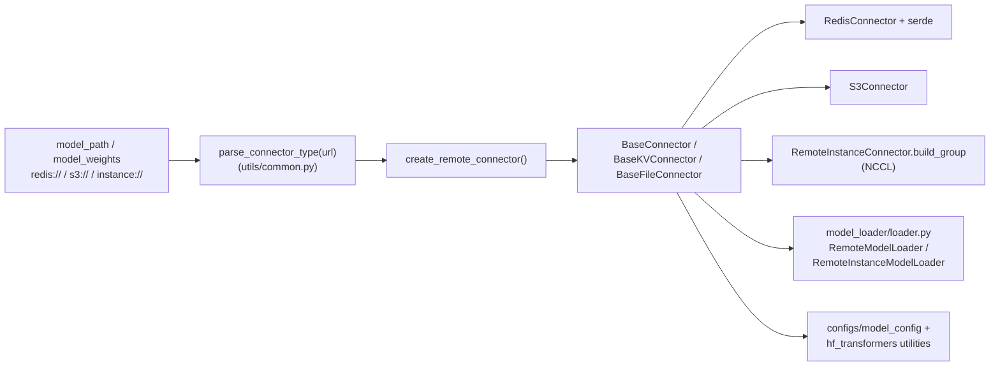

# `srt/connector` — Remote weight loading（**非** KV connector）

## Summary

> [!warning] CONTRADICTION（命名陷阱 — 必读）
>
> **SGLang `python/sglang/srt/connector/` 与 KV cache / KV PD 传输完全无关**。本模块实现的是 **模型权重与配套配置文件的远程加载**：通过 **Redis**（张量按 key 存取 + serde）/ **S3**（拉取 safetensors 等文件）/ **RemoteInstance**（`instance://` URL + NCCL 自定义进程组从远端 SGLang 实例收权重）。
>
> 源码中 Redis 侧抽象基类**叫** `BaseKVConnector`（[base_connector.py:75-95](d:\design\sglang\python\sglang\srt\connector\base_connector.py)）—— 这里的 **「KV」指 Redis 键值存储中的张量 / 字符串，不是 PD 分离里的 KV cache 管线**。
>
> **四个名称含 "connector" / "KV" 的子系统对照**：
>
> | 子系统 | 实质 | wiki 页 |
> |---|---|---|
> | **MindIE `connector/`** | 独立 PD 子进程（KV 通道 + reorganize） | `mindie/modules/connector.md`（已删） |
> | **vLLM `kv_connector/v1/`** | KV cache 跨节点传输 14 backend | [vllm/topics/kv-connector.md](../../vllm/topics/kv-connector.md) |
> | **SGLang `disaggregation/`** | KV PD 跨节点传输 5 backend | [sglang/modules/disaggregation.md](disaggregation.md) |
> | **SGLang `connector/`（本模块）** | **模型权重 / 配置文件**远程加载 3 backend + serde | 本页 |

`srt/connector/`（**9** `.py` 文件 / ~17 KB）= 6 顶层 .py + 3 serde/ 子目录文件。[`create_remote_connector`](d:\design\sglang\python\sglang\srt\connector\__init__.py:25-34) 按 URL scheme 分派到 [`RedisConnector`](d:\design\sglang\python\sglang\srt\connector\redis.py) / [`S3Connector`](d:\design\sglang\python\sglang\srt\connector\s3.py) / [`RemoteInstanceConnector`](d:\design\sglang\python\sglang\srt\connector\remote_instance.py)；[`RemoteModelLoader`](d:\design\sglang\python\sglang\srt\model_loader\loader.py:2450-2594) + [`RemoteInstanceModelLoader`](d:\design\sglang\python\sglang\srt\model_loader\loader.py:2084-2177) 在 `LoadFormat.REMOTE` / `REMOTE_INSTANCE` 路径下消费这些抽象，完成从远端存储或远端实例到本进程模型参数的填充。

> synthesis: 与 RLHF 「换头」、多 checkpoint 同步相关的**直接代码锚点**主要体现在 [`RemoteModelLoader.save_model`](d:\design\sglang\python\sglang\srt\model_loader\loader.py:2478-2503)（向 Redis **写回** rank 分片张量与 `*config.json` 等文本键）以及 [`RemoteInstanceModelLoader`](d:\design\sglang\python\sglang\srt\model_loader\loader.py:2084-2177)（从另一 SGLang 实例 NCCL 拉权重）；命名上的「connector」一律按「**远程权重 / 元数据通道**」理解，勿与 PD KV 混淆。

## Sources

| 文件 | 锚点 |
|---|---|
| 包入口与工厂 | [__init__.py](d:\design\sglang\python\sglang\srt\connector\__init__.py)（`create_remote_connector` L25-34 / `ConnectorType` L19-22 / `get_connector_type` L37-44） |
| 抽象基类 | [base_connector.py](d:\design\sglang\python\sglang\srt\connector\base_connector.py)（`BaseConnector` L13-72 / `BaseKVConnector` L75-95 / `BaseFileConnector` L98-111） |
| Redis | [redis.py](d:\design\sglang\python\sglang\srt\connector\redis.py)（`RedisConnector` + `pull_files_from_db` 使用） |
| S3 | [s3.py](d:\design\sglang\python\sglang\srt\connector\s3.py)（`glob` + `runai_safetensors_weights_iterator`） |
| Remote instance | [remote_instance.py](d:\design\sglang\python\sglang\srt\connector\remote_instance.py)（`build_group` L26-68 / `weight_iterator` 与 `pull_files` no-op L70-82） |
| 工具 | [utils.py](d:\design\sglang\python\sglang\srt\connector\utils.py)（`parse_model_name` L11-17 / `pull_files_from_db` L20-35） |
| serde | [serde/__init__.py](d:\design\sglang\python\sglang\srt\connector\serde\__init__.py)（`create_serde` L12-22）+ [serde.py](d:\design\sglang\python\sglang\srt\connector\serde\serde.py) + [safe_serde.py](d:\design\sglang\python\sglang\srt\connector\serde\safe_serde.py) |
| URL scheme 解析 | [`parse_connector_type`](d:\design\sglang\python\sglang\srt\utils\common.py:2549-2559) |
| ModelLoader 消费 | [model_loader/loader.py:2084-2594](d:\design\sglang\python\sglang\srt\model_loader\loader.py)（`RemoteModelLoader` + `RemoteInstanceModelLoader`） |
| ModelConfig 远程拉 | [configs/model_config.py:1189-1210](d:\design\sglang\python\sglang\srt\configs\model_config.py)（`_maybe_pull_model_tokenizer_from_remote`） |
| ServerArgs 引用 | [server_args.py:1579-1583, 3757-3758](d:\design\sglang\python\sglang\srt\server_args.py) |

## Architecture / Data flow

- **权重迭代**：KV 路径 [`RedisConnector.weight_iterator`](d:\design\sglang\python\sglang\srt\connector\redis.py:67-74) 扫描 `{model_name}/keys/rank_{rank}/`；FS 路径 [`S3Connector.weight_iterator`](d:\design\sglang\python\sglang\srt\connector\s3.py:109-118) 委托 `runai_safetensors_weights_iterator`。
- **配置 / tokenizer 预拉**：[`ModelConfig._maybe_pull_model_tokenizer_from_remote`](d:\design\sglang\python\sglang\srt\configs\model_config.py:1189-1210) 与 `hf_transformers` config / tokenizer 路径解析调用 `pull_files`，把远端小文件落到 [`BaseConnector.local_dir`](d:\design\sglang\python\sglang\srt\connector\base_connector.py:26-31)。

## File inventory（9 文件）

| 文件 | 行数（约） | 职责 |
|---|---|---|
| [__init__.py](d:\design\sglang\python\sglang\srt\connector\__init__.py) | 59 | 导出类与 `create_remote_connector` / `get_connector_type` |
| [base_connector.py](d:\design\sglang\python\sglang\srt\connector\base_connector.py) | 112 | `BaseConnector` / `BaseKVConnector` / `BaseFileConnector` |
| [redis.py](d:\design\sglang\python\sglang\srt\connector\redis.py) | 86 | Redis 后端 + `pull_files_from_db` |
| [s3.py](d:\design\sglang\python\sglang\srt\connector\s3.py) | 123 | S3 列举 / 下载 / safetensors 权重迭代 |
| [remote_instance.py](d:\design\sglang\python\sglang\srt\connector\remote_instance.py) | 83 | `instance://` + `build_group`；`weight_iterator` / `pull_files` 为 no-op（loader 侧 NCCL 实际拉权重） |
| [utils.py](d:\design\sglang\python\sglang\srt\connector\utils.py) | 36 | `parse_model_name` / `pull_files_from_db` |
| [serde/__init__.py](d:\design\sglang\python\sglang\srt\connector\serde\__init__.py) | 32 | `create_serde` |
| [serde/serde.py](d:\design\sglang\python\sglang\srt\connector\serde\serde.py) | 44 | `Serializer` / `Deserializer` 抽象 |
| [serde/safe_serde.py](d:\design\sglang\python\sglang\srt\connector\serde\safe_serde.py) | 31 | `SafeSerializer` / `SafeDeserializer`（safetensors 包装） |

## `BaseConnector` abstract

[`BaseConnector`](d:\design\sglang\python\sglang\srt\connector\base_connector.py:13-72) 约定：

- [`weight_iterator`](d:\design\sglang\python\sglang\srt\connector\base_connector.py:35-37)：产出 `(name, torch.Tensor)`（子类实现略有差异，见 Notes）
- [`pull_files`](d:\design\sglang\python\sglang\srt\connector\base_connector.py:41-45)：按 allow / ignore 模式拉取配套文件到 [`local_dir`](d:\design\sglang\python\sglang\srt\connector\base_connector.py:26-31)
- 生命周期：[`close`](d:\design\sglang\python\sglang\srt\connector\base_connector.py:48-54) 清理临时目录；[`SIGINT` / `SIGTERM`](d:\design\sglang\python\sglang\srt\connector\base_connector.py:27-29) 注册清理

[`BaseKVConnector`](d:\design\sglang\python\sglang\srt\connector\base_connector.py:75-95) 增加张量 / 字符串 CRUD 与 [`list`](d:\design\sglang\python\sglang\srt\connector\base_connector.py:93-95)（**Redis 模型权重键空间**语义；命名歧义见 Summary 警告块）。

[`BaseFileConnector`](d:\design\sglang\python\sglang\srt\connector\base_connector.py:98-111) 增加 [`glob`](d:\design\sglang\python\sglang\srt\connector\base_connector.py:109-111)。

## Backend matrix

| 后端 | 基类 | 解析 scheme（[`parse_connector_type`](d:\design\sglang\python\sglang\srt\utils\common.py:2549-2559) 取 URL 第一段） | 权重来源 | 配套文件 |
|---|---|---|---|---|
| Redis | `BaseKVConnector` | `"redis"` → [`RedisConnector`](d:\design\sglang\python\sglang\srt\connector\redis.py:16-26) | [`weight_iterator` 扫描 `.../keys/rank_{rank}/`](d:\design\sglang\python\sglang\srt\connector\redis.py:67-74) | [`pull_files_from_db`](d:\design\sglang\python\sglang\srt\connector\utils.py:20-35) 读 `.../files/` 前缀 |
| S3 | `BaseFileConnector` | `"s3"` → [`S3Connector`](d:\design\sglang\python\sglang\srt\connector\s3.py:69-75) | `glob("*.safetensors")` + `runai_safetensors_weights_iterator`（[L109-118](d:\design\sglang\python\sglang\srt\connector\s3.py)） | [`pull_files` 下载到 `local_dir`](d:\design\sglang\python\sglang\srt\connector\s3.py:83-107) |
| Remote instance | `BaseConnector` | `"instance"` → [`RemoteInstanceConnector`](d:\design\sglang\python\sglang\srt\connector\remote_instance.py:16-24) | **不**通过 `weight_iterator`；由 [`build_group`](d:\design\sglang\python\sglang\srt\connector\remote_instance.py:26-68) + loader 侧 NCCL 逻辑加载（见下节） | [`pull_files` no-op](d:\design\sglang\python\sglang\srt\connector\remote_instance.py:71-76) |

## `serde/` serialization

- **抽象**：[Serializer.to_bytes](d:\design\sglang\python\sglang\srt\connector\serde\serde.py:9-24) / [Deserializer.from_bytes](d:\design\sglang\python\sglang\srt\connector\serde\serde.py:32-42) 定义于 [serde.py](d:\design\sglang\python\sglang\srt\connector\serde\serde.py)
- **唯一实现**：[`create_serde("safe")`](d:\design\sglang\python\sglang\srt\connector\serde\__init__.py:12-22) 返回 [`SafeSerializer`](d:\design\sglang\python\sglang\srt\connector\serde\safe_serde.py:11-17)（`safetensors.torch.save` 包一维张量）与 [`SafeDeserializer`](d:\design\sglang\python\sglang\srt\connector\serde\safe_serde.py:20-30)（`load(...)["tensor_bytes"]`）
- [`RedisConnector`](d:\design\sglang\python\sglang\srt\connector\redis.py:25-26) 固定使用 `"safe"`，注释 [`# TODO: more serde options`](d:\design\sglang\python\sglang\srt\connector\redis.py:25-26)

## CLI / config 字段

本模块**没有**独立 `--connector-*` CLI；行为由 **`--model-path`（或等价 `model_path`）的 URL scheme** + **load format** 间接驱动。

- **URL scheme 解析**：[`parse_connector_type`](d:\design\sglang\python\sglang\srt\utils\common.py:2549-2559) 返回 `scheme://` 的 scheme 字符串（如 `redis` / `s3` / `instance`）
- **`ConnectorType` 枚举**（[__init__.py:19-22](d:\design\sglang\python\sglang\srt\connector\__init__.py)）：`FS = "filesystem"` / `KV = "KV"` / `INSTANCE = "instance"` —— 与 `parse_connector_type` 返回值**不在同一命名空间**；[`get_connector_type`](d:\design\sglang\python\sglang\srt\connector\__init__.py:37-44) 用 `isinstance` 区分
- **server_args 中的引用**（非专用连接器参数；仅当 `model_path` 为 `instance://` 时跳过部分 HF 逻辑）：
  - [`_handle_model_specific_adjustments`](d:\design\sglang\python\sglang\srt\server_args.py:1579-1583)：若 `parse_connector_type(self.model_path) == ConnectorType.INSTANCE` 则**提前 return**
  - [`enable_deterministic_inference` 分支](d:\design\sglang\python\sglang\srt\server_args.py:3757-3758)：若**不是** `INSTANCE` 才尝试读 `hf_config`

> synthesis: 远端实例权重的**端口 / IP / 后端枚举**由 `LoadConfig` / `RemoteInstanceWeightLoaderBackend` 等定义在 [`model_loader/loader.py`](d:\design\sglang\python\sglang\srt\model_loader\loader.py)，**而非** `connector/` 包内；本页仅锚定"连接器实例化"边界。

## ModelLoader / weight_sync 集成

- **主消费方**：[`RemoteModelLoader`](d:\design\sglang\python\sglang\srt\model_loader\loader.py:2450-2594) 在 [`create_remote_connector(model_weights, ...)`](d:\design\sglang\python\sglang\srt\model_loader\loader.py:2581-2583) 后按 [`get_connector_type`](d:\design\sglang\python\sglang\srt\connector\__init__.py:37-44) 分支：
  - `KV` → [`_load_model_from_remote_kv`](d:\design\sglang\python\sglang\srt\model_loader\loader.py:2585-2586)
  - `FS` → [`_load_model_from_remote_fs`](d:\design\sglang\python\sglang\srt\model_loader\loader.py:2587-2590)
- **写回 Redis（训练 / 同步侧用途）**：[`RemoteModelLoader.save_model`](d:\design\sglang\python\sglang\srt\model_loader\loader.py:2478-2503) 使用 `client.set` / `setstr` 写入 rank 分片键与文本文件键。
- **Remote instance（NCCL）**：[`RemoteInstanceModelLoader.load_model`](d:\design\sglang\python\sglang\srt\model_loader\loader.py:2099-2177) 在 NCCL 后端构造 `instance://...` 并 [`load_model_from_remote_instance_by_nccl`](d:\design\sglang\python\sglang\srt\model_loader\loader.py:2179-2194) 内调用 [`client.build_group`](d:\design\sglang\python\sglang\srt\model_loader\loader.py:2185-2188)。
- **weight_sync** 子系统：在 [`d:\design\sglang\python\sglang\srt\weight_sync\`](d:\design\sglang\python\sglang\srt\weight_sync) 全树对 `create_remote_connector` / `sglang.srt.connector` **grep 0 命中** —— **N/A**（不直接引用本模块）
- **checkpoint_engine** 子系统：在 [`d:\design\sglang\python\sglang\srt\checkpoint_engine\`](d:\design\sglang\python\sglang\srt\checkpoint_engine) 全树 **grep 0 命中** —— **N/A**

## §跨子系统引用（§5 step 3）

按 [AGENTS.md §5 step 3](../../AGENTS.md#5-ingest-工作流) 5 类全仓库 grep。

### 1. 跨语言绑定（C++ / sgl-kernel）

- `BaseConnector` / `RedisConnector` / `S3Connector` / `RemoteInstanceConnector` / `create_remote_connector`：**在 [`d:\design\sglang\sgl-kernel\`](d:\design\sglang\sgl-kernel) 全树 grep 0 命中**

### 2. 协作伙伴跨子系统引用

| 协作模块 | 锚点 |
|---|---|
| [model_loader/loader.py](d:\design\sglang\python\sglang\srt\model_loader\loader.py) | `create_remote_connector` import [L63-66](d:\design\sglang\python\sglang\srt\model_loader\loader.py)；`RemoteModelLoader` [L2450-2594](d:\design\sglang\python\sglang\srt\model_loader\loader.py)；`RemoteInstanceModelLoader` [L2084-2177](d:\design\sglang\python\sglang\srt\model_loader\loader.py) |
| [configs/model_config.py](d:\design\sglang\python\sglang\srt\configs\model_config.py) | [L1198-1210](d:\design\sglang\python\sglang\srt\configs\model_config.py) `_maybe_pull_model_tokenizer_from_remote` |
| [utils/hf_transformers/config.py](d:\design\sglang\python\sglang\srt\utils\hf_transformers\config.py) | `get_config` 路径解析 [L22-71](d:\design\sglang\python\sglang\srt\utils\hf_transformers\config.py) |
| [utils/hf_transformers/tokenizer.py](d:\design\sglang\python\sglang\srt\utils\hf_transformers\tokenizer.py) | tokenizer 路径解析 [L28-158](d:\design\sglang\python\sglang\srt\utils\hf_transformers\tokenizer.py) |
| [server_args.py](d:\design\sglang\python\sglang\srt\server_args.py) | `parse_connector_type` 条件 [L1582-1583](d:\design\sglang\python\sglang\srt\server_args.py) + [L3757-3758](d:\design\sglang\python\sglang\srt\server_args.py) |

### 3. 配置 / 共享数据结构

- 无独立 connector 配置块；与 `parse_connector_type` + `ConnectorType` 的交互见 §CLI / config 字段
- [`d:\design\sglang\`](d:\design\sglang) 下无独立 connector deployment yaml

### 4. 测试覆盖反查

- [`d:\design\sglang\test\`](d:\design\sglang\test) 下 `sglang.srt.connector` / `RedisConnector` / `S3Connector` / `RemoteInstanceConnector` / `create_remote_connector` / `BaseConnector`：**全树 grep 0 命中**

### 5. doc / config 反查

- [docs/advanced_features/object_storage.md](d:\design\sglang\docs\advanced_features\object_storage.md) 描述 `s3://` 与 `runai_streamer`，**未**出现 `sglang.srt.connector` 包名
- [docs/](d:\design\sglang\docs) 对 `RedisConnector` / `S3Connector` / `sglang.srt.connector`：**全树 grep 0 命中**

## 跨项目对照（synthesis）

| 项目 / 路径 | 实质 | wiki 锚点 |
|---|---|---|
| MindIE `connector/` | 独立 PD 子进程（KV 通道 + reorganize） | `mindie/modules/connector.md`（已删） |
| vLLM `kv_connector/v1/` | **KV cache** 跨节点传输，14 backend | [vllm/topics/kv-connector.md](../../vllm/topics/kv-connector.md) |
| SGLang `disaggregation/` | **KV** PD 跨节点传输，5 backend | [sglang/modules/disaggregation.md](disaggregation.md) |
| **SGLang `connector/`（本模块）** | **模型权重 / 配置文件** 远程加载：Redis（张量 KV + serde）/ S3（文件 + safetensors）/ RemoteInstance（NCCL 进程组） | 本页 |

> synthesis（核心价值）：四个名称含 **connector / KV** 的子系统**对象完全不同**——本页用源码锚点固定 **SGLang `srt/connector` = 权重与元数据远程通道**，避免与 PD KV、vLLM KV connector、MindIE 子进程混淆。**这是本批 ingest 中最有 anti-误读价值的 wiki 页**。

## Notes / Caveats

> [!warning] CONTRADICTION（命名陷阱总集）：见 Summary 警告块——**"connector" 这个词在三家 + SGLang 内部各有 4 种完全不同的含义**：
>
> 1. SGLang `connector/`（本页）= 远程**权重**通道
> 2. SGLang `disaggregation/` = KV **cache** PD 通道
> 3. vLLM `kv_connector/` = KV **cache** 跨节点
> 4. MindIE `connector/` = PD **子进程**（KV channel + reorganize）
>
> 任何 cross-project 比较前必须先消歧。

> [!warning] CONTRADICTION（API 类型不一致）：~~[`pull_files_from_db`](d:\design\sglang\python\sglang\srt\connector\utils.py:20-35) 形参类型为 `BaseConnector`（[L21-22](d:\design\sglang\python\sglang\srt\connector\utils.py)），但调用 `connector.list` / `getstr`（[L27, 35](d:\design\sglang\python\sglang\srt\connector\utils.py)）仅 [`BaseKVConnector`](d:\design\sglang\python\sglang\srt\connector\base_connector.py:75-95) 具备；**非 Redis 后端若误用会运行时失败**。~~
> **RESOLVED 2026-04-19**: 已源码确认——[`utils.py:21`](d:\design\sglang\python\sglang\srt\connector\utils.py) 形参 `connector: BaseConnector`，但 L28 `connector.list(prefix)` 与 L35 `connector.getstr(file)` 仅 `BaseKVConnector` 实现（[`base_connector.py:81-95`](d:\design\sglang\python\sglang\srt\connector\base_connector.py)）；**调用方目前唯一是** [`RedisConnector.pull_files`](d:\design\sglang\python\sglang\srt\connector\redis.py:76-81)（KV 后端），所以 prod 路径不会触发；但若未来 S3/RemoteInstance 复用，将运行时 AttributeError——属注解过宽、行为正确的设计 bug，**应将形参改为 `BaseKVConnector`**。

> [!todo] VERIFY: ~~`RedisConnector.weight_iterator` 标注为 `Generator[Tuple[str, bytes], ...]`（[redis.py:67-69](d:\design\sglang\python\sglang\srt\connector\redis.py)）与 [`BaseConnector.weight_iterator`](d:\design\sglang\python\sglang\srt\connector\base_connector.py:35-37) 的 `torch.Tensor` 不一致；应以运行时 `get` → `from_bytes` 实际类型为准。~~
> **RESOLVED 2026-04-19**: **运行时为 `torch.Tensor`，注解错误**——[`RedisConnector.weight_iterator`](d:\design\sglang\python\sglang\srt\connector\redis.py:67-74) 内调用 `val = self.get(key)`，而 [`RedisConnector.get`](d:\design\sglang\python\sglang\srt\connector\redis.py:28-35) 返回 `Optional[torch.Tensor]`（`return self.d.from_bytes(val)`，`d = SafeDeserializer` 的 `from_bytes` 反序列化为张量，[safe_serde.py:20-30](d:\design\sglang\python\sglang\srt\connector\serde\safe_serde.py)）。所以 `Generator[Tuple[str, bytes]]` 注解是错的，与基类 `Tuple[str, torch.Tensor]` 一致才对——属源码 typo。

> [!todo] VERIFY: ~~`ConnectorType.FS` 值为 `"filesystem"`（[__init__.py:20](d:\design\sglang\python\sglang\srt\connector\__init__.py)）与 `parse_connector_type` 返回的 `"s3"` **字符串不相等**；分类依赖 [`get_connector_type` 的 `isinstance`](d:\design\sglang\python\sglang\srt\connector\__init__.py:37-44)，非直接字符串比较。~~
> **RESOLVED 2026-04-19**: 已源码确认——`ConnectorType.FS = "filesystem"` ([__init__.py:20](d:\design\sglang\python\sglang\srt\connector\__init__.py)) 与 `parse_connector_type(url)` 返回的 URL scheme 字符串（`"s3"` / `"redis"` / `"instance"`）**不在同一命名空间**。`create_remote_connector` ([__init__.py:25-34](d:\design\sglang\python\sglang\srt\connector\__init__.py)) 只用 scheme 字符串分派；`get_connector_type` ([L37-44](d:\design\sglang\python\sglang\srt\connector\__init__.py)) 用 `isinstance` 分类返回 `ConnectorType` 枚举。**仅 `INSTANCE = "instance"` 凑巧与 scheme 字符串相等**，因此 `server_args.py:1582, 3758` 可写 `parse_connector_type(...) == ConnectorType.INSTANCE`；FS / KV 路径不能用同样的字符串比较，必须经 `get_connector_type` + `isinstance`，[loader.py:2472, 2587](d:\design\sglang\python\sglang\srt\model_loader\loader.py) 的判断正符合此模式。

## See also

- [sglang/modules/disaggregation.md](disaggregation.md) — SGLang **KV PD 传输**模块（与本页**非同一概念**）
- [sglang/modules/managers.md](managers.md)
- [vllm/topics/kv-connector.md](../../vllm/topics/kv-connector.md) — vLLM KV transfer 14 backend（命名陷阱对照）
- [comparison/dimensions.md](../../comparison/dimensions.md)
