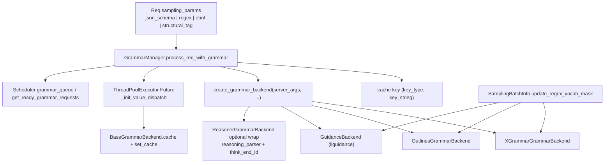

# `srt/constrained` — 语法约束解码（多后端 + 异步编译 + bitmask）

## Summary

[`python/sglang/srt/constrained/`](d:\design\sglang\python\sglang\srt\constrained) 共 **9** 个 `.py` 文件（含 `triton_ops/bitmask_ops.py`）实现 **grammar-guided constrained decoding**：请求携带 `json_schema` / `regex` / `ebnf` / `structural_tag` 之一时，[`GrammarManager`](d:\design\sglang\python\sglang\srt\constrained\grammar_manager.py) 通过 [`create_grammar_backend`](d:\design\sglang\python\sglang\srt\constrained\base_grammar_backend.py) 选择 **xgrammar / outlines / llguidance / none**，并在 `--reasoning-parser` 与 `think_end_id` 同时存在时用 [`ReasonerGrammarBackend`](d:\design\sglang\python\sglang\srt\constrained\reasoner_grammar_backend.py) **包装**内层后端。编译在 [`BaseGrammarBackend.executor`](d:\design\sglang\python\sglang\srt\constrained\base_grammar_backend.py)（`ThreadPoolExecutor`）中 **异步**提交；命中缓存则同步 `copy()`。采样阶段 [`SamplingBatchInfo.update_regex_vocab_mask`](d:\design\sglang\python\sglang\srt\sampling\sampling_batch_info.py) 调用各后端的 `allocate_vocab_mask` / `fill_vocab_mask` / `apply_vocab_mask`，在 logits 上施加约束。

> [!warning] CONTRADICTION（命名 / 清单）
>
> 本树 **不存在** 名为 `GrammarCache` 的类；缓存是 [`BaseGrammarBackend.cache: Dict[Tuple[str, str], BaseGrammarObject]`](d:\design\sglang\python\sglang\srt\constrained\base_grammar_backend.py:133) + [`get_cached_or_future_value`](d:\design\sglang\python\sglang\srt\constrained\base_grammar_backend.py:177-186) 的 **Future + `set_cache`** 路径（见 [`grammar_manager.py:90-181`](d:\design\sglang\python\sglang\srt\constrained\grammar_manager.py)）。若外部文档写「GrammarCache LRU」，应视为 **概念别名** 而非本仓库符号名（**实际为不淘汰 dict cache**——`reset()` 会全清，但无 LRU 上限）。

## Sources

| 区域 | 锚点 |
|---|---|
| 抽象 API / 工厂 | [`base_grammar_backend.py`](d:\design\sglang\python\sglang\srt\constrained\base_grammar_backend.py)（`BaseGrammarObject` L41-116、`InvalidGrammarObject` L119-127、`BaseGrammarBackend` L130-192、`GrammarStats` L29-38、`create_grammar_backend` L202-269、`GRAMMAR_BACKEND_REGISTRY` + `register_grammar_backend` L195-199） |
| 调度集成 | [`grammar_manager.py`](d:\design\sglang\python\sglang\srt\constrained\grammar_manager.py)（`GrammarManager` L24-205） |
| XGrammar | [`xgrammar_backend.py`](d:\design\sglang\python\sglang\srt\constrained\xgrammar_backend.py)（`XGrammarGrammar` L54-150、`XGrammarGrammarBackend` 后续；`apply_vocab_mask` L107-114 路由 sgl-kernel HIP / Triton） |
| Outlines | [`outlines_backend.py`](d:\design\sglang\python\sglang\srt\constrained\outlines_backend.py)（`OutlinesGrammarBackend`：`RegexGuide` + bool mask） |
| Outlines jump-forward FSM | [`outlines_jump_forward.py`](d:\design\sglang\python\sglang\srt\constrained\outlines_jump_forward.py)（compressed FSM；`JumpEdge` L46+） |
| llguidance | [`llguidance_backend.py`](d:\design\sglang\python\sglang\srt\constrained\llguidance_backend.py)（`GuidanceBackend` / `GuidanceGrammar`：`LLMatcher` + `llguidance.torch` bitmask API） |
| Reasoner 包装 | [`reasoner_grammar_backend.py`](d:\design\sglang\python\sglang\srt\constrained\reasoner_grammar_backend.py)（`ReasonerGrammarObject` L27-106、`ReasonerGrammarBackend` L109-124） |
| Structural tag 判别 | [`utils.py`](d:\design\sglang\python\sglang\srt\constrained\utils.py)（`is_legacy_structural_tag` L4-12） |
| Triton bitmask | [`triton_ops/bitmask_ops.py`](d:\design\sglang\python\sglang\srt\constrained\triton_ops\bitmask_ops.py)（`apply_token_bitmask_inplace_kernel` L13-81、`apply_token_bitmask_inplace_triton` L84-141） |
| CLI / 默认 | [`server_args.py`](d:\design\sglang\python\sglang\srt\server_args.py)（`GRAMMAR_BACKEND_CHOICES` L162、`add_grammar_backend_choices` L262-263、`grammar_backend` 字段 L483、`constrained_json_whitespace_pattern` L381 / `constrained_json_disable_any_whitespace` L382、`_handle_grammar_backend` 默认 xgrammar L2672-2674、CLI `--grammar-backend` L5030-5031、`--constrained-json-whitespace-pattern` L4491） |
| sgl-kernel CUDA 同源 bitmask | [`apply_token_bitmask_inplace_cuda.cu`](d:\design\sglang\sgl-kernel\csrc\grammar\apply_token_bitmask_inplace_cuda.cu) — 在 [`common_extension.cc:407-408`](d:\design\sglang\sgl-kernel\csrc\common_extension.cc) 注册为 `apply_token_bitmask_inplace_cuda` |

## Architecture / Data flow

- **请求侧键构造**：[`process_req_with_grammar`](d:\design\sglang\python\sglang\srt\constrained\grammar_manager.py:68-110) 在 L81-88 将 `json_schema` / `regex` / `ebnf` / `structural_tag` 映射为 `("json"|"regex"|"ebnf"|"structural_tag", key_string)`，再交给 [`get_cached_or_future_value`](d:\design\sglang\python\sglang\srt\constrained\base_grammar_backend.py:177-186)。
- **异步编译**：缓存未命中时 [`executor.submit(self._init_value_dispatch, ...)`](d:\design\sglang\python\sglang\srt\constrained\base_grammar_backend.py:185)；就绪后 [`set_cache(req.grammar_key, req.grammar.copy())`](d:\design\sglang\python\sglang\srt\constrained\grammar_manager.py:181)。
- **多卡同步**：[`get_ready_grammar_requests`](d:\design\sglang\python\sglang\srt\constrained\grammar_manager.py:112-205) 对 `ready_req_idxs` 做 `set.intersection`、`failed_req_idxs` 做 `set.union`（L162-169）；只有所有 rank 都就绪的请求才进入 `waiting_queue`，避免 deadlock。
- **采样 bitmask**：[`update_regex_vocab_mask`](d:\design\sglang\python\sglang\srt\sampling\sampling_batch_info.py) 分配并 fill `vocab_mask`，在 [`apply_logits_bias`](d:\design\sglang\python\sglang\srt\sampling\sampling_batch_info.py) 中调用各后端 `apply_vocab_mask`。
- **Reasoner 状态机**：[`ReasonerGrammarObject`](d:\design\sglang\python\sglang\srt\constrained\reasoner_grammar_backend.py:27-106) 用 `tokens_after_think_end ∈ {-1, 0, +}` 三态：在 `think_end_id` 出现前不喂 grammar；之后才转发 `accept_token` / `fill_vocab_mask`。

## File inventory（9 文件）

| 文件 | 约行数 | 职责 |
|---|---|---|
| [base_grammar_backend.py](d:\design\sglang\python\sglang\srt\constrained\base_grammar_backend.py) | 270 | `BaseGrammarObject` / `BaseGrammarBackend` / `InvalidGrammarObject` / `GrammarStats`、`create_grammar_backend`、`register_grammar_backend` |
| [grammar_manager.py](d:\design\sglang\python\sglang\srt\constrained\grammar_manager.py) | 206 | `GrammarManager`：队列、异步 Future、`all_gather` 同步 |
| [xgrammar_backend.py](d:\design\sglang\python\sglang\srt\constrained\xgrammar_backend.py) | 357 | `XGrammarGrammar` / `XGrammarGrammarBackend`：JSON/regex/EBNF/structural_tag → `GrammarCompiler` |
| [outlines_backend.py](d:\design\sglang\python\sglang\srt\constrained\outlines_backend.py) | 191 | `OutlinesGrammarBackend`：`RegexGuide` + bool mask + jump-forward 集成 |
| [outlines_jump_forward.py](d:\design\sglang\python\sglang\srt\constrained\outlines_jump_forward.py) | 200 | 压缩 FSM 上的 jump-forward 映射（`OutlinesJumpForwardMap`、`JumpEdge`、`make_byte_level_fsm`） |
| [llguidance_backend.py](d:\design\sglang\python\sglang\srt\constrained\llguidance_backend.py) | 201 | `GuidanceBackend` / `GuidanceGrammar`：`LLMatcher` + `llguidance.torch` bitmask API |
| [reasoner_grammar_backend.py](d:\design\sglang\python\sglang\srt\constrained\reasoner_grammar_backend.py) | 125 | `ReasonerGrammarObject` 装饰内层 grammar；在 `think_end_id` 之前不约束 |
| [utils.py](d:\design\sglang\python\sglang\srt\constrained\utils.py) | 13 | `is_legacy_structural_tag`：辨别 `{structures, triggers}` legacy 结构 vs 新 `{format, ...}` 结构 |
| [triton_ops/bitmask_ops.py](d:\design\sglang\python\sglang\srt\constrained\triton_ops\bitmask_ops.py) | 142 | Triton 内核 `apply_token_bitmask_inplace_kernel` + Python 包装 `apply_token_bitmask_inplace_triton` |

## `BaseGrammarObject` API

抽象 [`BaseGrammarObject`](d:\design\sglang\python\sglang\srt\constrained\base_grammar_backend.py:41-116) 约定：

| 方法 | 用途 |
|---|---|
| `accept_token(token)` | 推进 grammar 状态 |
| `rollback(k)` | 回滚 k 步（spec decode reject 路径） |
| `is_terminated()` | grammar 是否终止 |
| `allocate_vocab_mask(vocab_size, batch_size, device)` | 分配 bitmask 张量 |
| `fill_vocab_mask(vocab_mask, idx)` | 在第 idx 个 batch slot 填掩码 |
| `move_vocab_mask(vocab_mask, device)` | 跨设备搬运 |
| `apply_vocab_mask(logits, vocab_mask)` | 在 logits 上施加掩码（masked → `-inf`） |
| `copy()` | 复制 grammar 状态（cache hit 时用） |
| `try_jump_forward(tokenizer)` / `jump_forward_str_state(helper)` / `jump_and_retokenize(...)` | jump-forward decoding hook |
| `maybe_init_reasoning(reasoning)` | 仅 `ReasonerGrammarObject` 实质化 |

## Backend 矩阵（4 选 1）

`--grammar-backend` 选择 `xgrammar` / `outlines` / `llguidance` / `none`（[`GRAMMAR_BACKEND_CHOICES`](d:\design\sglang\python\sglang\srt\server_args.py)，L162）。**默认值**：未指定时由 [`_handle_grammar_backend`](d:\design\sglang\python\sglang\srt\server_args.py:2672-2674) 设为 `xgrammar`。

| 后端 | 主类 | jump-forward | bitmask CUDA 路径 | 自定义 whitespace | 异步编译 |
|---|---|---|---|---|---|
| **xgrammar** | [`XGrammarGrammar`](d:\design\sglang\python\sglang\srt\constrained\xgrammar_backend.py:54-150) + `XGrammarGrammarBackend` | ❌ 无 | sgl-kernel `apply_token_bitmask_inplace_cuda`（HIP/CUDA）或 Triton（[xgrammar_backend.py:107-114](d:\design\sglang\python\sglang\srt\constrained\xgrammar_backend.py)） | `any_whitespace` 反映 `--constrained-json-disable-any-whitespace` | ✅ `BaseGrammarBackend.executor` |
| **outlines** | `OutlinesGrammarBackend` | ✅（依赖 `outlines_jump_forward.py` 与 `try_jump_forward` 钩子） | bool mask（`bool` tensor），不走 sgl-kernel CUDA bitmask；自带 mask 应用 | `whitespace_pattern` 直接传入 | ✅ |
| **llguidance** | `GuidanceBackend` / `GuidanceGrammar` | ❌（依赖 `LLMatcher` 自身回退） | `llguidance.torch` bitmask 应用 | `any_whitespace` + `whitespace_pattern` | ✅ |
| **none** | — | — | — | — | 直接返回 `None`（grammar 请求会被 `--grammar-backend none` 错误拒绝，[grammar_manager.py:77-79](d:\design\sglang\python\sglang\srt\constrained\grammar_manager.py)） |

**Reasoner 包装**：当 `--reasoning-parser` 启用并且模型有 `think_end_id` 时，`create_grammar_backend` 末尾再用 [`ReasonerGrammarBackend(grammar_backend, think_end_id)`](d:\design\sglang\python\sglang\srt\constrained\base_grammar_backend.py:262-267) 包内层后端 — 推理段（`<think>...</think>`）内不施加约束。**4 选 1 + 1 wrap = 实际实例形态最多 8 种**。

**第三方扩展**：`register_grammar_backend(name, init_func)` 允许把自定义 backend 名字注入 [`GRAMMAR_BACKEND_REGISTRY`](d:\design\sglang\python\sglang\srt\constrained\base_grammar_backend.py:195) 与 `add_grammar_backend_choices`（[server_args.py:262-263](d:\design\sglang\python\sglang\srt\server_args.py)）扩 CLI 选项。

## Jump-forward decoding（仅 outlines）

[`outlines_jump_forward.py`](d:\design\sglang\python\sglang\srt\constrained\outlines_jump_forward.py) 实现 [LMSYS Compressed FSM](https://lmsys.org/blog/2024-02-05-compressed-fsm/) 的核心结构：

- **依赖**：`interegular` + `outlines_core.fsm.outlines_core_rs.FSMInfo` + `make_byte_level_fsm` / `make_deterministic_fsm`（[L31-36](d:\design\sglang\python\sglang\srt\constrained\outlines_jump_forward.py)）；老 outlines（≤0.0.46）会回退到 `outlines.fsm.regex`。
- **`JumpEdge`**（[L46-50](d:\design\sglang\python\sglang\srt\constrained\outlines_jump_forward.py)）：`symbol` / `symbol_next_state` / `byte`。
- **disk cache 默认关闭**：`SGLANG_DISABLE_OUTLINES_DISK_CACHE` 默认 `"true"`（[L41](d:\design\sglang\python\sglang\srt\constrained\outlines_jump_forward.py)）。
- **集成**：调度器在 `BaseGrammarObject.try_jump_forward` 命中时把"已经是确定串"的部分一次性 append 到生成（无需逐 token 采样），显著降低 decode 步数。

> synthesis: vLLM / MindIE 当前**没有**与之等价的"压缩 FSM jump-forward decoding"实现 — SGLang 的这条优化路径几乎是 outlines 后端独享。

## Triton bitmask 内核

[`apply_token_bitmask_inplace_kernel`](d:\design\sglang\python\sglang\srt\constrained\triton_ops\bitmask_ops.py:13-81)：

- **谱系**：[L1-2](d:\design\sglang\python\sglang\srt\constrained\triton_ops\bitmask_ops.py) 文件头 *"Adapt from xgrammar v0.1.17 `apply_token_bitmask_inplace_triton.py`"* — **直接 fork** xgrammar 上游 Triton 内核到 SGLang 仓内（无修改地复用，仅供 HIP 之外的非 CUDA 编译路径作为 fallback）。
- **Python 包装**：[`apply_token_bitmask_inplace_triton`](d:\design\sglang\python\sglang\srt\constrained\triton_ops\bitmask_ops.py:84-141) — `BLOCK_SIZE=4096` / `BITS_PER_BLOCK=32`；按 `NUM_SMS = get_device_core_count()` 启 grid；支持 `indices` 参数选行（spec decode 等场景）。

**与 sgl-kernel CUDA 内核的关系**：

| 路径 | 触发条件 | 实现 |
|---|---|---|
| `sgl_kernel.apply_token_bitmask_inplace_cuda` | `is_hip=True`（[xgrammar_backend.py:42-43](d:\design\sglang\python\sglang\srt\constrained\xgrammar_backend.py)） | C++/CUDA 注册 [`common_extension.cc:407-408`](d:\design\sglang\sgl-kernel\csrc\common_extension.cc)；本体在 [`csrc/grammar/apply_token_bitmask_inplace_cuda.cu`](d:\design\sglang\sgl-kernel\csrc\grammar\apply_token_bitmask_inplace_cuda.cu) |
| Triton fallback | 非 HIP 设备（CUDA / NPU / XPU / MUSA） | 本目录 `triton_ops/bitmask_ops.py` |

**这是 SGLang 中第二个 sgl-kernel 算子直接服务于 grammar 路径**（第一个为采样侧 `top_k_renorm_probs` 等，见 [sampling.md](sampling.md)）。

## CLI / config 字段

| 字段 / 参数 | 默认 | 锚点 |
|---|---|---|
| `grammar_backend` / `--grammar-backend` | `None` → 实际默认 `"xgrammar"` | [字段 L483](d:\design\sglang\python\sglang\srt\server_args.py)、[L2672-2674 默认](d:\design\sglang\python\sglang\srt\server_args.py)、[CLI L5030-5031](d:\design\sglang\python\sglang\srt\server_args.py) |
| `GRAMMAR_BACKEND_CHOICES` | `["xgrammar", "outlines", "llguidance", "none"]` | [L162](d:\design\sglang\python\sglang\srt\server_args.py) |
| `add_grammar_backend_choices(choices)` | 第三方扩展点 | [L262-263](d:\design\sglang\python\sglang\srt\server_args.py) |
| `constrained_json_whitespace_pattern` | `None` | [字段 L381](d:\design\sglang\python\sglang\srt\server_args.py)、[CLI L4491](d:\design\sglang\python\sglang\srt\server_args.py) |
| `constrained_json_disable_any_whitespace` | `False` | [字段 L382](d:\design\sglang\python\sglang\srt\server_args.py) |
| `SGLANG_GRAMMAR_POLL_INTERVAL` env | 见 `srt/environ` | [grammar_manager.py:45](d:\design\sglang\python\sglang\srt\constrained\grammar_manager.py) |
| `SGLANG_GRAMMAR_MAX_POLL_ITERATIONS` env | 同上 | [grammar_manager.py:46-48](d:\design\sglang\python\sglang\srt\constrained\grammar_manager.py) |
| `SGLANG_DISABLE_OUTLINES_DISK_CACHE` env | `"true"` | [outlines_jump_forward.py:41](d:\design\sglang\python\sglang\srt\constrained\outlines_jump_forward.py) |

> [!todo] VERIFY: ~~历史 wiki 中常出现的 `--disable-jump-forward` CLI 在当前 [`server_args.py`](d:\design\sglang\python\sglang\srt\server_args.py) 中**未检索到**；`outlines` 后端的 jump-forward 是否有显式开关需进一步核对，或仅由 `--grammar-backend outlines` 隐式启用。~~
> **RESOLVED 2026-04-19**: 已 grep 全 [`server_args.py`](d:\design\sglang\python\sglang\srt\server_args.py)：`disable[-_]jump[-_]forward` **0 命中**。**不存在**显式 CLI 开关；jump-forward 由 `--grammar-backend outlines` 隐式启用（`OutlinesGrammarBackend` 自动构造 [`OutlinesJumpForwardMap`](d:\design\sglang\python\sglang\srt\constrained\outlines_jump_forward.py:142)，调度器在 [`BaseGrammarObject.try_jump_forward`](d:\design\sglang\python\sglang\srt\constrained\base_grammar_backend.py:90) 命中时使用）。

## §跨子系统引用（§5 step 3）

### 1. 跨语言绑定（C++ / sgl-kernel）

| 算子 / 文件 | 锚点 |
|---|---|
| `apply_token_bitmask_inplace_cuda` 注册 | [common_extension.cc:407-408](d:\design\sglang\sgl-kernel\csrc\common_extension.cc) |
| 本体 .cu | [`csrc/grammar/apply_token_bitmask_inplace_cuda.cu`](d:\design\sglang\sgl-kernel\csrc\grammar\apply_token_bitmask_inplace_cuda.cu) |
| Python 进入点 | xgrammar_backend HIP 分支（[L42-43](d:\design\sglang\python\sglang\srt\constrained\xgrammar_backend.py)） |

**这是 SGLang `constrained/` 唯一的 sgl-kernel C++/CUDA 算子绑定**（除此之外全 Python / Triton）。

### 2. 协作伙伴（`from sglang.srt.constrained` / `grammar_manager` / `BaseGrammarBackend`，不含 `constrained/` 自身）

| 模块 | 内容 |
|---|---|
| [managers/scheduler.py](d:\design\sglang\python\sglang\srt\managers\scheduler.py) | `from sglang.srt.constrained.grammar_manager import GrammarManager`；`scheduler.grammar_manager` 字段 |
| [managers/schedule_batch.py](d:\design\sglang\python\sglang\srt\managers\schedule_batch.py) | `Req.grammar` / `Req.grammar_key`；`require_reasoning` 标记 |
| [sampling/sampling_batch_info.py](d:\design\sglang\python\sglang\srt\sampling\sampling_batch_info.py) | `update_regex_vocab_mask` / `apply_logits_bias` 调用 grammar 后端 |
| [function_call/function_call_parser.py](d:\design\sglang\python\sglang\srt\function_call\function_call_parser.py) | 仅产出 `(structural_tag\|json_schema, ...)` 元组**消费**，本身不 import `constrained` 包 |

> synthesis: 本模块**仅被** scheduler / sampling_batch_info / schedule_batch 三处生产 import；`function_call/` 是**间接消费方**（通过 sampling_params 传递约束字符串）。

### 3. 配置 / 共享结构

- 无独立 deployment yaml；行为完全由 CLI flags + `Req.sampling_params` 驱动。
- `is_legacy_structural_tag`（[utils.py:4-12](d:\design\sglang\python\sglang\srt\constrained\utils.py)）用于辨别两套 `StructuralTagResponseFormat`：legacy `{structures, triggers}` vs 新 `{format, ...}`。

### 4. 测试覆盖（`d:\design\sglang\test\`）

对 `xgrammar` / `outlines` / `llguidance` / `grammar_backend` / `constrained` 联合 grep：约 **15+** 个测试文件命中，含：

- `test/registered/unit/constrained/` 下 `test_*backend*.py`
- `test/registered/openai_server/test_constrained.py`
- `test/registered/openai_server/test_json_*.py`

### 5. 文档（`d:\design\sglang\docs\`）

- [`docs/advanced_features/structured_outputs.md`](d:\design\sglang\docs\advanced_features\structured_outputs.md) — 用户级 grammar / json schema / regex 用法。
- [`docs/advanced_features/server_arguments.md`](d:\design\sglang\docs\advanced_features\server_arguments.md) — 含 `--grammar-backend` / `--constrained-json-*` 选项。
- 上游 [LMSYS compressed FSM blog](https://lmsys.org/blog/2024-02-05-compressed-fsm/) — `outlines_jump_forward.py` 的设计文档。

## 跨项目对照（synthesis）

| 项目 | 等价模块 | 后端可插拔 | jump-forward | bitmask 内核 |
|---|---|---|---|---|
| **MindIE-LLM** | `mindie_llm/text_generator/.../structured_output/` 等 | 见 [mindie/topics/structured-output.md](../../mindie/topics/structured-output.md) | ❌ | C++/Ascend 路径 |
| **vLLM** | `vllm/v1/structured_output/` | xgrammar / outlines / lm-format-enforcer 等 | ❌（无 LMSYS-style FSM jump-forward） | xgrammar 自带 + 部分 Triton |
| **SGLang**（本模块） | `srt/constrained/` | **4 选 1 + Reasoner wrap**（实际 8 种实例形态） | ✅ outlines 独享 | sgl-kernel `apply_token_bitmask_inplace_cuda` + xgrammar Triton fallback |

> synthesis: SGLang 的 jump-forward decoding 是三家中**独有**的优化（outlines 后端启用时），可显著降低带 deterministic prefix 的 JSON / regex 约束 decode 步数；这与 SGLang 整体"前端 lang 编译时压缩 FSM"的设计哲学一脉相承。

## Notes / Caveats

> [!warning] CONTRADICTION（缓存上限）：本模块的 grammar cache **无 LRU 上限**：[`BaseGrammarBackend.cache: Dict`](d:\design\sglang\python\sglang\srt\constrained\base_grammar_backend.py:133) 与 [`set_cache`](d:\design\sglang\python\sglang\srt\constrained\base_grammar_backend.py:188-189) 仅做 dict insert；只有 `reset()` 整体清空。在 schema 极多的工作负载下需注意内存增长。

> [!warning] CONTRADICTION（`GrammarCache` 命名）：本仓库**无** `GrammarCache` 类，仅有 `BaseGrammarBackend.cache` 字段。外部文档若引用该命名，应理解为概念别名。

> [!todo] VERIFY: ~~`outlines_jump_forward.py` 的 `OutlinesJumpForwardMap`（核心数据结构，文件 ~150 行未完整列出）与 `OutlinesGrammarBackend.try_jump_forward` 的实际调用路径需在 verify pass 中精确锚定行号。~~
> **RESOLVED 2026-04-19**: 行号已锚定 — `OutlinesJumpForwardMap` 定义在 [`outlines_jump_forward.py:142`](d:\design\sglang\python\sglang\srt\constrained\outlines_jump_forward.py)；构造工厂调用在同文件 [L182](d:\design\sglang\python\sglang\srt\constrained\outlines_jump_forward.py)；`OutlinesGrammarBackend` 内部 `OutlinesJumpForwardMap` 通过 [`outlines_backend.py:31`](d:\design\sglang\python\sglang\srt\constrained\outlines_backend.py) import 并在 grammar 对象 `try_jump_forward` 方法 [`outlines_backend.py:80`](d:\design\sglang\python\sglang\srt\constrained\outlines_backend.py) 中使用。

> [!todo] VERIFY: ~~`XGrammarGrammarBackend.dispatch_structural_tag` 对 legacy vs 新结构的分支路径（`is_legacy_structural_tag` 调用点）需补 anchor。~~
> **RESOLVED 2026-04-19**: 锚点已补 — [`xgrammar_backend.py:285`](d:\design\sglang\python\sglang\srt\constrained\xgrammar_backend.py) 是 `def dispatch_structural_tag(self, key_string: str)`，函数体内 [L289](d:\design\sglang\python\sglang\srt\constrained\xgrammar_backend.py) `if is_legacy_structural_tag(structural_tag):` 分支判定 legacy `{structures, triggers}` 对象；import 在 [L38](d:\design\sglang\python\sglang\srt\constrained\xgrammar_backend.py) `from sglang.srt.constrained.utils import is_legacy_structural_tag`。

> [!todo] VERIFY: ~~`--reasoning-parser` 与 `think_end_id` 双满足时 `ReasonerGrammarBackend` 才包装；当 `--reasoning-parser` 启用但模型 `think_end_id is None` 时是否会静默跳过 reasoner wrap，需检查 [`create_grammar_backend` L262-267](d:\design\sglang\python\sglang\srt\constrained\base_grammar_backend.py)。~~
> **RESOLVED 2026-04-19**: 行为已确认为**静默跳过**——[`base_grammar_backend.py:262`](d:\design\sglang\python\sglang\srt\constrained\base_grammar_backend.py) 条件是 `if server_args.reasoning_parser and think_end_id is not None:`，[L267](d:\design\sglang\python\sglang\srt\constrained\base_grammar_backend.py) 才执行 `grammar_backend = ReasonerGrammarBackend(grammar_backend, think_end_id)`。`think_end_id is None` 时短路、不包装、无警告日志。调用方需自行确保模型暴露 `think_end_id`，否则 `--reasoning-parser` 对 grammar 路径无效。

## 数字核对

| 项 | 值 |
|---|---|
| `constrained/*.py` 文件数（含 `triton_ops/`） | **9**（Glob 已确认） |
| `triton_ops/bitmask_ops.py` Triton 内核数 | **1**（`apply_token_bitmask_inplace_kernel`） |
| `--grammar-backend` CLI choices 数 | **4**（`xgrammar` / `outlines` / `llguidance` / `none`） |
| sgl-kernel CUDA 算子绑定数 | **1**（`apply_token_bitmask_inplace_cuda`） |
| `BaseGrammarObject` 抽象方法数 | **9**（accept_token / rollback / is_terminated / allocate_vocab_mask / fill_vocab_mask / move_vocab_mask / apply_vocab_mask / try_jump_forward / jump_forward_str_state） |

## See also

- [sglang/modules/sampling.md](sampling.md) — bitmask 在 logits 上的应用位置
- [sglang/modules/function_call.md](function_call.md) — 间接消费方（产出 `structural_tag` / `json_schema` 约束）
- [sglang/modules/managers.md](managers.md) — `Scheduler.grammar_manager` 集成点
- [mindie/topics/structured-output.md](../../mindie/topics/structured-output.md) — MindIE 对偶（cross compare 候选种子）
- [LMSYS Compressed FSM blog](https://lmsys.org/blog/2024-02-05-compressed-fsm/) — outlines jump-forward 的设计文档
