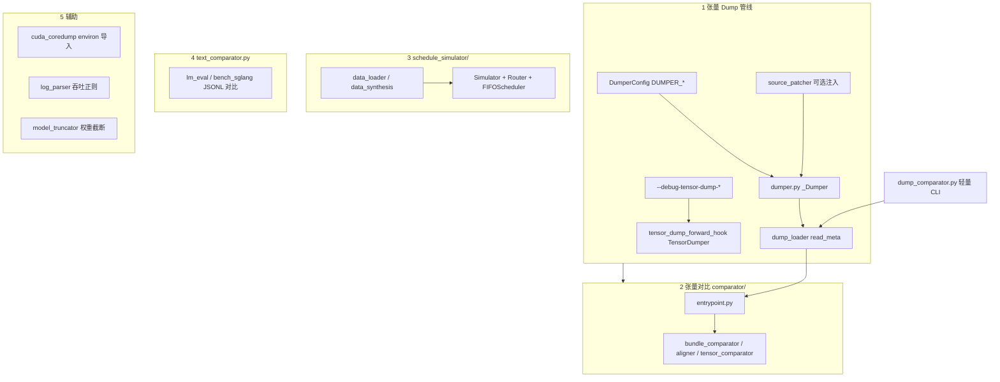

# `srt/debug_utils` — 张量 dump、对比、调度仿真与周边工具

## Summary

[`python/sglang/srt/debug_utils/`](d:\design\sglang\python\sglang\srt\debug_utils) 在本工作区 Glob 为 **82** 个 `.py` 文件（**非**既有 wiki 推断的 89 — 见 Notes），**无**顶层包 `__init__.py`，子包为 [`comparator/`](d:\design\sglang\python\sglang\srt\debug_utils\comparator)、[`schedule_simulator/`](d:\design\sglang\python\sglang\srt\debug_utils\schedule_simulator)、[`source_patcher/`](d:\design\sglang\python\sglang\srt\debug_utils\source_patcher) 三处。核心能力可归纳为：

1. **可配置张量 dump**（[`DUMPER_*`](d:\design\sglang\python\sglang\srt\debug_utils\dumper.py) + HTTP 控制 + 可选源码注入）
2. **全量张量 dump 对比管线** [`comparator/`](d:\design\sglang\python\sglang\srt\debug_utils\comparator)
3. **评测文本输出对比** [`text_comparator.py`](d:\design\sglang\python\sglang\srt\debug_utils\text_comparator.py)
4. **离线调度仿真** [`schedule_simulator/`](d:\design\sglang\python\sglang\srt\debug_utils\schedule_simulator)
5. **杂项**（CUDA coredump 注入、日志解析、模型截断脚本等）

运行时主路径消费方包括 [`model_runner.py`](d:\design\sglang\python\sglang\srt\model_executor\model_runner.py)（`dumper` + forward hook）、[`scheduler.py`](d:\design\sglang\python\sglang\srt\managers\scheduler.py)（dumper HTTP 控制）、[`fp8_utils.py`](d:\design\sglang\python\sglang\srt\layers\quantization\fp8_utils.py) 与 [`weight_checker.py`](d:\design\sglang\python\sglang\srt\utils\weight_checker.py)（`get_tensor_info`）。

> [!todo] VERIFY: ~~既有 wiki 推断 89 .py / ~356 KB；本仓库 Glob 实测 **82** 个文件。若需与上游 `34fef07a` 逐文件对齐，请在目标 commit 上重新计数。~~
>
> > **RESOLVED 2026-04-19**: 本工作区 [`debug_utils/`](d:\design\sglang\python\sglang\srt\debug_utils) Glob `**/*.py` 实测 **82** 文件（顶层 8 + comparator 52 + schedule_simulator 18 + source_patcher 4），与 wiki 当前数字一致；旧 89 推断作废。

## Sources

| 主题 | 锚点 |
|------|------|
| Dumper 配置与 `DUMPER_` 前缀说明 | [dumper.py:126-147](d:\design\sglang\python\sglang\srt\debug_utils\dumper.py) |
| `_Dumper` 文档字符串（用法、HTTP、`dump_comparator` 关联） | [dumper.py:172-199](d:\design\sglang\python\sglang\srt\debug_utils\dumper.py) |
| 简化版 dump 对比入口说明 | [dump_comparator.py:1-6](d:\design\sglang\python\sglang\srt\debug_utils\dump_comparator.py) |
| `SGLANG_DUMP_LOADER_DIR` | [dump_loader.py:61](d:\design\sglang\python\sglang\srt\debug_utils\dump_loader.py) |
| `--debug-tensor-dump-*` 与 per-rank 目录约定 | [tensor_dump_forward_hook.py:1-11](d:\design\sglang\python\sglang\srt\debug_utils\tensor_dump_forward_hook.py) |
| 文本对比 CLI 描述 | [text_comparator.py:8-13](d:\design\sglang\python\sglang\srt\debug_utils\text_comparator.py) |
| 调度仿真 CLI（`--input` / `--synthetic` / router） | [schedule_simulator/entrypoint.py:31-73](d:\design\sglang\python\sglang\srt\debug_utils\schedule_simulator\entrypoint.py) |
| CUDA coredump 与 `SGLANG_CUDA_COREDUMP` | [cuda_coredump.py:1-3](d:\design\sglang\python\sglang\srt\debug_utils\cuda_coredump.py) |
| `ServerArgs` 中 debug tensor dump 字段 | [server_args.py:697-703](d:\design\sglang\python\sglang\srt\server_args.py) |
| argparse `--debug-tensor-dump-*` | [server_args.py:6112-6134](d:\design\sglang\python\sglang\srt\server_args.py) |
| `environ` 侧载 `cuda_coredump` | [environ.py:627](d:\design\sglang\python\sglang\srt\environ.py) |
| sgl-kernel 独立 `debug_utils`（非本模块） | [sgl-kernel/debug_utils.py:7-17](d:\design\sglang\sgl-kernel\python\sgl_kernel\debug_utils.py) |

## Architecture / Data flow

> synthesis: 下图将「调试子系统」按职责拆分；**不存在**独立的 `dumper/` 子目录——核心实现是顶层 [`dumper.py`](d:\design\sglang\python\sglang\srt\debug_utils\dumper.py)（约 1.5k 行）。

- **Serving 路径**：[`model_runner`](d:\design\sglang\python\sglang\srt\model_executor\model_runner.py) 同时引入 `dumper` 与 `register_forward_hook_for_model`（[L59-62](d:\design\sglang\python\sglang\srt\model_executor\model_runner.py)）；调度器在 [`handle_dumper_control`](d:\design\sglang\python\sglang\srt\managers\scheduler.py) 中转发 HTTP 管理请求（[L3529-3540](d:\design\sglang\python\sglang\srt\managers\scheduler.py)）。
- **离线工具**：`python -m sglang.srt.debug_utils.comparator` / `dump_comparator` / `schedule_simulator`。

## File inventory（按子目录分组）

> 计数：[`comparator/`](d:\design\sglang\python\sglang\srt\debug_utils\comparator) **52** `.py`；[`schedule_simulator/`](d:\design\sglang\python\sglang\srt\debug_utils\schedule_simulator) **18** `.py`；[`source_patcher/`](d:\design\sglang\python\sglang\srt\debug_utils\source_patcher) **4** `.py`；顶层 **8** `.py` → 合计 **82**。

| 分组 | 文件数 | 内容摘要（代表锚点） |
|------|--------|---------------------|
| **顶层** | 8 | [`dumper.py`](d:\design\sglang\python\sglang\srt\debug_utils\dumper.py)（核心 dump + `DumperConfig`）；[`dump_loader.py`](d:\design\sglang\python\sglang\srt\debug_utils\dump_loader.py)；[`dump_comparator.py`](d:\design\sglang\python\sglang\srt\debug_utils\dump_comparator.py)；[`tensor_dump_forward_hook.py`](d:\design\sglang\python\sglang\srt\debug_utils\tensor_dump_forward_hook.py)；[`text_comparator.py`](d:\design\sglang\python\sglang\srt\debug_utils\text_comparator.py)；[`log_parser.py`](d:\design\sglang\python\sglang\srt\debug_utils\log_parser.py)（Decode batch 日志解析）；[`model_truncator.py`](d:\design\sglang\python\sglang\srt\debug_utils\model_truncator.py)；[`cuda_coredump.py`](d:\design\sglang\python\sglang\srt\debug_utils\cuda_coredump.py) |
| **`comparator/`** | 52 | `entrypoint.py`、`bundle_*`、`tensor_comparator/`、`dims_spec/`、`aligner/`（unsharder、token_aligner、reorderer）、`visualizer/`、`preset.py`、`display.py` 等 |
| **`schedule_simulator/`** | 18 | `simulator.py`、`gpu_state.py`、`metrics.py`、`routers/`（random / round_robin / sticky）、`schedulers/fifo_scheduler.py`、`data_source/`（`data_loader` 读 request_logger、`data_synthesis` 合成负载）、[`__main__.py`](d:\design\sglang\python\sglang\srt\debug_utils\schedule_simulator\__main__.py) |
| **`source_patcher/`** | 4 | [`code_patcher.py`](d:\design\sglang\python\sglang\srt\debug_utils\source_patcher\code_patcher.py)、[`source_editor.py`](d:\design\sglang\python\sglang\srt\debug_utils\source_patcher\source_editor.py)、[`types.py`](d:\design\sglang\python\sglang\srt\debug_utils\source_patcher\types.py)、[`__init__.py`](d:\design\sglang\python\sglang\srt\debug_utils\source_patcher\__init__.py) — 供 `dumper` 在 `source_patcher_config` 路径下做源码级注入 |

> [!warning] CONTRADICTION（与常见假设）：~~本目录**没有** `dumper/`、`mock/`、`gemm_collector/` 子目录；`dumper` 为单文件 [`dumper.py`](d:\design\sglang\python\sglang\srt\debug_utils\dumper.py)。**Mock Worker/Scheduler** 在本树内 **未** 以文件名/关键字出现（已对 `debug_utils` 内 `mock|Mock|stub` grep，0 命中）。~~
>
> > **RESOLVED 2026-04-19**: 实测 [`debug_utils/`](d:\design\sglang\python\sglang\srt\debug_utils) 仅含 3 个 Python 子包（`comparator/`、`schedule_simulator/`、`source_patcher/`），无 `dumper/`、`mock/`、`gemm_collector/` 目录；[`dumper.py`](d:\design\sglang\python\sglang\srt\debug_utils\dumper.py) 确为顶层单文件。

## 子系统 1 — 张量 Dump（`dumper` + hooks + loader + 轻量 comparator）

- **配置**：[`DumperConfig`](d:\design\sglang\python\sglang\srt\debug_utils\dumper.py) 使用前缀 **`DUMPER_`**（刻意避免 `SGLANG_DUMPER_`，注释见 [L146-147](d:\design\sglang\python\sglang\srt\debug_utils\dumper.py)）。
- **Serving 侧全图 dump**：[`TensorDumper`](d:\design\sglang\python\sglang\srt\debug_utils\tensor_dump_forward_hook.py) 与 CLI `--debug-tensor-dump-output-folder` 说明见文件头 [L1-11](d:\design\sglang\python\sglang\srt\debug_utils\tensor_dump_forward_hook.py)。
- **对比**：轻量 [`dump_comparator.py`](d:\design\sglang\python\sglang\srt\debug_utils\dump_comparator.py) 指向完整包 `python -m sglang.srt.debug_utils.comparator`（[L4-6](d:\design\sglang\python\sglang\srt\debug_utils\dump_comparator.py)）。

## 子系统 2 — 张量对比 `comparator/`

以 [`bundle_comparator`](d:\design\sglang\python\sglang\srt\debug_utils\comparator\bundle_comparator.py)、[`dims_spec`](d:\design\sglang\python\sglang\srt\debug_utils\comparator\dims_spec)、[`aligner`](d:\design\sglang\python\sglang\srt\debug_utils\comparator\aligner) 为主干；入口 [`entrypoint.py`](d:\design\sglang\python\sglang\srt\debug_utils\comparator\entrypoint.py) 组合 `dump_loader.read_meta`。

## 子系统 3 — 文本输出对比 `text_comparator.py`

面向 **benchmark 输出**（`lm_eval --log_samples`、`gsm8k/bench_sglang.py` 等），非张量 dump；描述见 [L8-13](d:\design\sglang\python\sglang\srt\debug_utils\text_comparator.py)。

## 子系统 4 — `schedule_simulator/`

- CLI 从 request_logger JSON、合成随机负载或 GSP 负载读入（[L36-47](d:\design\sglang\python\sglang\srt\debug_utils\schedule_simulator\entrypoint.py)），路由器 `random` / `round_robin` / `sticky`，调度器当前 `fifo`（[L68-74](d:\design\sglang\python\sglang\srt\debug_utils\schedule_simulator\entrypoint.py)）。
- **与 EPLB 离线读器的类比**：同属「离线仿真/读 trace」思路时可对照 [`eplb/eplb_simulator/reader.py`](d:\design\sglang\python\sglang\srt\eplb\eplb_simulator\reader.py)；wiki 交叉页：[eplb.md](eplb.md)。

## 子系统 5 — 辅助与运维

- **CUDA coredump**：[`cuda_coredump.py`](d:\design\sglang\python\sglang\srt\debug_utils\cuda_coredump.py) 与 `environ` 中 `SGLANG_CUDA_COREDUMP` / `SGLANG_CUDA_COREDUMP_DIR`（[environ.py:180-181](d:\design\sglang\python\sglang\srt\environ.py)）；模块在 [environ.py:627](d:\design\sglang\python\sglang\srt\environ.py) 被导入以执行注入逻辑。
- **`log_parser.py`**：Decode 吞吐日志正则解析。
- **`model_truncator.py`**：HF 权重截断/导出类工具脚本。

## Environment variables

| 变量 | 锚点 | 说明 |
|------|------|------|
| `DUMPER_*` | [dumper.py:144-147](d:\design\sglang\python\sglang\srt\debug_utils\dumper.py) | `DumperConfig._env_prefix` → `"DUMPER_"`；具体字段见 dataclass [L127-142](d:\design\sglang\python\sglang\srt\debug_utils\dumper.py) |
| `SGLANG_DUMP_LOADER_DIR` | [dump_loader.py:61](d:\design\sglang\python\sglang\srt\debug_utils\dump_loader.py) | dump_loader 默认目录覆盖 |
| `SGLANG_CUDA_COREDUMP` / `SGLANG_CUDA_COREDUMP_DIR` | [cuda_coredump.py:3](d:\design\sglang\python\sglang\srt\debug_utils\cuda_coredump.py)、[environ.py:180-181](d:\design\sglang\python\sglang\srt\environ.py) | CUDA coredump 注入 |
| `SGLANG_KERNEL_API_LOGLEVEL` 等 | [sgl-kernel debug_utils.py:9](d:\design\sglang\sgl-kernel\python\sgl_kernel\debug_utils.py) | **不属于** `srt/debug_utils`；属 sgl-kernel 包装 |

> synthesis: 用户常搜的 `SGLANG_DUMP_*` 在本模块中**主要**体现为 `SGLANG_DUMP_LOADER_DIR`；**通用 dumper 开关是 `DUMPER_*`**，而非 `SGLANG_DUMP_*` 前缀。

## CLI（server + 模块 `python -m`）

| 类别 | 锚点 |
|------|------|
| **Server**：`--debug-tensor-dump-output-folder`、`--debug-tensor-dump-layers`、`--debug-tensor-dump-input-file`、`--debug-tensor-dump-inject` | [server_args.py:6112-6134](d:\design\sglang\python\sglang\srt\server_args.py) |
| **`--crash-dump-folder`** | [server_args.py:4608-4611](d:\design\sglang\python\sglang\srt\server_args.py) | **请求崩溃转储**，与张量 debug dump 不同字段（[L404](d:\design\sglang\python\sglang\srt\server_args.py) `crash_dump_folder`） |

模块入口（`__main__` 惯例）：`python -m sglang.srt.debug_utils.comparator` / `dump_comparator` / `schedule_simulator`。

> [!todo] VERIFY: ~~既有 wiki 推断的 `--enable-dumper` / `--dump-path` / `--enable-mock-*` 在 [`server_args.py`](d:\design\sglang\python\sglang\srt\server_args.py) 的 grep 中**未**与 `debug_utils` 对齐；实际 flag 为 **`--debug-tensor-dump-*`**。~~
>
> > **RESOLVED 2026-04-19**: 在 [`server_args.py`](d:\design\sglang\python\sglang\srt\server_args.py) grep `enable-dumper` / `--dump-path` / `enable-mock` **0 命中**；实际开关确为 [`--debug-tensor-dump-*`](d:\design\sglang\python\sglang\srt\server_args.py:6112-6134) 系列与 [`--crash-dump-folder`](d:\design\sglang\python\sglang\srt\server_args.py:4608-4611)。

## §跨子系统「5 类」检索

1. **sgl-kernel**：[`sgl_kernel.debug_utils.maybe_wrap_debug_kernel`](d:\design\sglang\sgl-kernel\python\sgl_kernel\debug_utils.py) — **独立包**，与 `sglang.srt.debug_utils` **无** import 关系；受 `SGLANG_KERNEL_API_LOGLEVEL` 控制。
2. **`srt/` 协作 import（`from sglang.srt.debug_utils...`，不含包内自引用）**
   - [`utils/weight_checker.py:61,122`](d:\design\sglang\python\sglang\srt\utils\weight_checker.py) — `get_tensor_info`
   - [`model_executor/model_runner.py:59-60`](d:\design\sglang\python\sglang\srt\model_executor\model_runner.py) — `dumper`、`register_forward_hook_for_model`
   - [`managers/scheduler.py:3530`](d:\design\sglang\python\sglang\srt\managers\scheduler.py) — `dumper`（lazy import）
   - [`layers/quantization/fp8_utils.py:1345`](d:\design\sglang\python\sglang\srt\layers\quantization\fp8_utils.py) — `get_tensor_info`
   - [`environ.py:627`](d:\design\sglang\python\sglang\srt\environ.py) — `cuda_coredump` 副作用导入
3. **CLI**：见上节；主文档 [`docs/advanced_features/server_arguments.md`](d:\design\sglang\docs\advanced_features\server_arguments.md) § Debug tensor dumps。
4. **Tests**：[`d:\design\sglang\test\registered\debug_utils\`](d:\design\sglang\test\registered\debug_utils) 下大量覆盖（`test_dumper.py`、`comparator/`、`schedule_simulator`、`source_patcher`、`tensor_dump_forward_hook` 等）。
5. **Docs**：[`docs/advanced_features/server_arguments.md`](d:\design\sglang\docs\advanced_features\server_arguments.md)；[`docs/references/environment_variables.md`](d:\design\sglang\docs\references\environment_variables.md)。**无**单独命名 `debug_utils.md` 的「总指南」——以 server args + env 文档为准。

## Notes / Caveats

- **子目录数量**：`debug_utils` 下 **3** 个 Python 子包（`comparator`、`schedule_simulator`、`source_patcher`）。
- **五类子系统计数（概念）**：(A) 张量 dump 链 / (B) `comparator/` / (C) `text_comparator` / (D) `schedule_simulator` / (E) 辅助 = **5**。
- **`stats collector` / GEMM shape**：本目录 **未** 发现 `gemm_collector`；GEMM 相关 CLI/env 在全局 [`server_args.py`](d:\design\sglang\python\sglang\srt\server_args.py) / [`environ.py`](d:\design\sglang\python\sglang\srt\environ.py)（如 `SGLANG_JIT_DEEPGEMM_*`），**不**归属 `debug_utils/`。

## 数字核对

| 项 | 值 |
|---|---|
| `**/*.py` 数量 | **82**（非 89） |
| Python 子目录（包） | **3** |
| 概念子系统数 | **5**；mock & gemm collector | **0** |

## See also

- [eplb.md](eplb.md)（离线 `eplb_simulator` 与 `reader.py`）
- [server_arguments.md（上游 docs）](d:\design\sglang\docs\advanced_features\server_arguments.md)
- [environment_variables.md](d:\design\sglang\docs\references\environment_variables.md)
