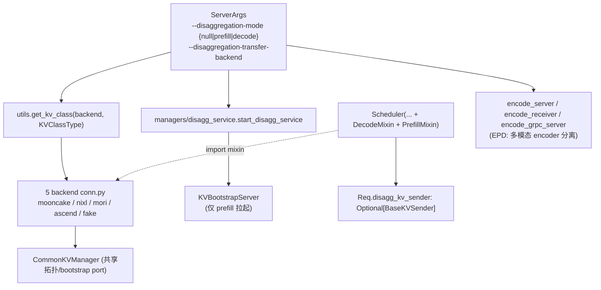

# `srt/disaggregation` — Prefill / Decode disaggregation module

## Summary

`srt/disaggregation/`（**29** `.py` 文件；~~28~~ pin 前新增 `decode_hicache_mixin.py`，#26227）实现 SGLang 的 **PD (Prefill/Decode) 分离** 子系统：[`base/conn.py`](d:\design\sglang\python\sglang\srt\disaggregation\base\conn.py) 定义抽象基类（`BaseKVManager` / `BaseKVSender` / `BaseKVReceiver` / `BaseKVBootstrapServer` + `KVArgs` dataclass + `KVPoll` 状态机），[`utils.py`](d:\design\sglang\python\sglang\srt\disaggregation\utils.py) 中 `TransferBackend` 5 项枚举 + `get_kv_class` 工厂装配 5 套后端实现（**Mooncake / NIXL / Mori / Ascend / Fake**）。顶层 [`prefill.py`](d:\design\sglang\python\sglang\srt\disaggregation\prefill.py) / [`decode.py`](d:\design\sglang\python\sglang\srt\disaggregation\decode.py) 提供两个 mixin（`SchedulerDisaggregationPrefillMixin` / `SchedulerDisaggregationDecodeMixin`）混入 `Scheduler`，[`managers/disagg_service.py`](d:\design\sglang\python\sglang\srt\managers\disagg_service.py) 仅在 prefill 节点拉起 bootstrap HTTP 服务。

> synthesis: 与 **MindIE** 独立 `connector` 子进程（`mindie/topics/connector.md`（已删））+ **vLLM** `kv_transfer/kv_connector/v1/` 14 backend 抽象（[`vllm/topics/kv-connector.md`](../../vllm/topics/kv-connector.md)）形成对比：SGLang 把 PD 传输与调度 **合并在同一 Python 运行时**，通过 `TransferBackend` 切换 5 套后端 + 共享 `CommonKVManager` 基类，并另设 `encode_*.py` 支持 **EPD（Encoder-Prefill-Decode 编码器分离）** —— 这是 vLLM/MindIE 当前都没有的设计点。深度对比详见 [`comparison/topics/pd-disaggregation.md`](../../comparison/topics/pd-disaggregation.md)（14 子维度）。

## Sources

| 区域 | 锚点 |
|---|---|
| 模块根（29 `.py`） | [d:\design\sglang\python\sglang\srt\disaggregation](d:\design\sglang\python\sglang\srt\disaggregation) |
| 抽象基类 | [base/conn.py](d:\design\sglang\python\sglang\srt\disaggregation\base\conn.py)（`BaseKVManager` L97 / `BaseKVSender` L115 / `BaseKVReceiver` L184 / `BaseKVBootstrapServer` L243 / `KVArgs` L38 / `KVPoll` L89-94；新增 `StateType` L17 / `KVTransferMetric` L30） |
| 共享实现 | [common/conn.py](d:\design\sglang\python\sglang\srt\disaggregation\common\conn.py)（`CommonKVManager` L142 / `CommonKVSender` L1068 / `CommonKVReceiver` L1250 / `CommonKVBootstrapServer` L1535） |
| 工厂 | [utils.py](d:\design\sglang\python\sglang\srt\disaggregation\utils.py)（`TransferBackend` L592-597 / `KVClassType` L600-605 / `get_kv_class` L609-721） |
| Scheduler mixin | [prefill.py:485](d:\design\sglang\python\sglang\srt\disaggregation\prefill.py)、[decode.py:2137](d:\design\sglang\python\sglang\srt\disaggregation\decode.py) |
| Bootstrap 启动 | [managers/disagg_service.py](d:\design\sglang\python\sglang\srt\managers\disagg_service.py)（`start_disagg_service` L14-35 + `maybe_create_ascend_config_store` L37） |
| Scheduler 多重继承 | [managers/scheduler.py:383-390](d:\design\sglang\python\sglang\srt\managers\scheduler.py) |
| Req 类型字段 | [managers/schedule_batch.py:141, 1157](d:\design\sglang\python\sglang\srt\managers\schedule_batch.py) |
| CLI 字段 | [server_args.py:3101-3196](d:\design\sglang\python\sglang\srt\server_args.py)（注解式字段，argparse 自动生成）、`DISAGG_TRANSFER_BACKEND_CHOICES` [server_args.py:236-243](d:\design\sglang\python\sglang\srt\server_args.py)（6 项，含 CLI 别名 `mooncake_tcp`）、PD 校验 hook [arg_groups/pd_disaggregation_hook.py](d:\design\sglang\python\sglang\srt\arg_groups\pd_disaggregation_hook.py) |

## Architecture / Data flow

**初始化链**：[`Scheduler.init_disaggregation` L1286](d:\design\sglang\python\sglang\srt\managers\scheduler.py) 按 `disaggregation_mode` 分支创建 manager / sender / receiver / bootstrap（配置改经 config-bag `get_disagg()` 读取）。**类组合**：[`Scheduler` 多重继承](d:\design\sglang\python\sglang\srt\managers\scheduler.py) [L383-390] 含 `SchedulerDisaggregationDecodeMixin` + `SchedulerDisaggregationPrefillMixin`，import 见 [scheduler.py:80, 88](d:\design\sglang\python\sglang\srt\managers\scheduler.py)。**请求级**：[`Req.disagg_kv_sender: Optional[BaseKVSender]`](d:\design\sglang\python\sglang\srt\managers\schedule_batch.py:1157) 是「调度层 ↔ PD 包」的显式类型接口（TYPE_CHECKING import 在 [schedule_batch.py:141](d:\design\sglang\python\sglang\srt\managers\schedule_batch.py)）。

## File inventory（29 文件）

| 分组 | 文件 |
|---|---|
| **base/** | [`__init__.py`](d:\design\sglang\python\sglang\srt\disaggregation\base\__init__.py)、[`conn.py`](d:\design\sglang\python\sglang\srt\disaggregation\base\conn.py) |
| **common/** | [`__init__.py`](d:\design\sglang\python\sglang\srt\disaggregation\common\__init__.py)、[`conn.py`](d:\design\sglang\python\sglang\srt\disaggregation\common\conn.py)、[`staging_buffer.py`](d:\design\sglang\python\sglang\srt\disaggregation\common\staging_buffer.py)、[`staging_handler.py`](d:\design\sglang\python\sglang\srt\disaggregation\common\staging_handler.py)、[`utils.py`](d:\design\sglang\python\sglang\srt\disaggregation\common\utils.py) |
| **mooncake/** | [`__init__.py`](d:\design\sglang\python\sglang\srt\disaggregation\mooncake\__init__.py)、[`conn.py`](d:\design\sglang\python\sglang\srt\disaggregation\mooncake\conn.py)、[`utils.py`](d:\design\sglang\python\sglang\srt\disaggregation\mooncake\utils.py) |
| **nixl/** | [`__init__.py`](d:\design\sglang\python\sglang\srt\disaggregation\nixl\__init__.py)、[`conn.py`](d:\design\sglang\python\sglang\srt\disaggregation\nixl\conn.py) |
| **mori/** | [`__init__.py`](d:\design\sglang\python\sglang\srt\disaggregation\mori\__init__.py)、[`conn.py`](d:\design\sglang\python\sglang\srt\disaggregation\mori\conn.py) |
| **ascend/** | [`__init__.py`](d:\design\sglang\python\sglang\srt\disaggregation\ascend\__init__.py)、[`conn.py`](d:\design\sglang\python\sglang\srt\disaggregation\ascend\conn.py)、[`transfer_engine.py`](d:\design\sglang\python\sglang\srt\disaggregation\ascend\transfer_engine.py) |
| **fake/** | [`__init__.py`](d:\design\sglang\python\sglang\srt\disaggregation\fake\__init__.py)、[`conn.py`](d:\design\sglang\python\sglang\srt\disaggregation\fake\conn.py) |
| **顶层 PD 编排** | [`decode.py`](d:\design\sglang\python\sglang\srt\disaggregation\decode.py)、[`prefill.py`](d:\design\sglang\python\sglang\srt\disaggregation\prefill.py)、[`decode_kvcache_offload_manager.py`](d:\design\sglang\python\sglang\srt\disaggregation\decode_kvcache_offload_manager.py)、[`decode_hicache_mixin.py`](d:\design\sglang\python\sglang\srt\disaggregation\decode_hicache_mixin.py)（**pin 前新增**，#26227：`DecodeHiCachePreallocMixin` L58 / `DecodeHiCacheTransferMixin` L170，被 `DecodePreallocQueue`/`DecodeTransferQueue` 继承）、[`decode_schedule_batch_mixin.py`](d:\design\sglang\python\sglang\srt\disaggregation\decode_schedule_batch_mixin.py)、[`kv_events.py`](d:\design\sglang\python\sglang\srt\disaggregation\kv_events.py)、[`utils.py`](d:\design\sglang\python\sglang\srt\disaggregation\utils.py) |
| **顶层 EPD（多模态）** | [`encode_server.py`](d:\design\sglang\python\sglang\srt\disaggregation\encode_server.py)、[`encode_receiver.py`](d:\design\sglang\python\sglang\srt\disaggregation\encode_receiver.py)、[`encode_grpc_server.py`](d:\design\sglang\python\sglang\srt\disaggregation\encode_grpc_server.py) |

## Key classes / interfaces

| 符号 | 角色 | 锚点 |
|---|---|---|
| `KVArgs` | 传输侧 buffer 指针 + 形状元数据（dataclass 风格字段） | [base/conn.py:38](d:\design\sglang\python\sglang\srt\disaggregation\base\conn.py) |
| `KVPoll` | 轮询状态常量（Bootstrapping / Transferring / Success / Failed 等，5 状态） | [base/conn.py:89-94](d:\design\sglang\python\sglang\srt\disaggregation\base\conn.py) |
| `BaseKVManager(ABC)` | 抽象方法：`__init__`、`register_to_bootstrap` | [base/conn.py:97](d:\design\sglang\python\sglang\srt\disaggregation\base\conn.py) |
| `BaseKVSender(ABC)` | 抽象方法：`__init__` / `init` / `send` / `poll` / `failure_exception` | [base/conn.py:115](d:\design\sglang\python\sglang\srt\disaggregation\base\conn.py) |
| `BaseKVReceiver(ABC)` | 抽象方法：`__init__` / `init` / `send_metadata` / `poll` / `failure_exception`；可选 `clear` / `abort` | [base/conn.py:184](d:\design\sglang\python\sglang\srt\disaggregation\base\conn.py) |
| `BaseKVBootstrapServer(ABC)` | 抽象方法：仅 `__init__(host, port)`；**所有 HTTP 路由实际由 `CommonKVBootstrapServer` 提供** | [base/conn.py:243](d:\design\sglang\python\sglang\srt\disaggregation\base\conn.py) |
| `CommonKVManager` | 共享拓扑、bootstrap 端口、ZMQ 信道 | [common/conn.py:142](d:\design\sglang\python\sglang\srt\disaggregation\common\conn.py) |
| `CommonKVBootstrapServer` | 实际承载 HTTP 路由 / handshake 的基类 | [common/conn.py:1535](d:\design\sglang\python\sglang\srt\disaggregation\common\conn.py) |
| `TransferBackend` 枚举 | `MOONCAKE` / `NIXL` / `MORI` / `ASCEND` / `FAKE` 共 **5 项**（HEAD 复核仍成立） | [utils.py:592-597](d:\design\sglang\python\sglang\srt\disaggregation\utils.py) |
| `KVClassType` 枚举 | `KVARGS` / `MANAGER` / `SENDER` / `RECEIVER` / `BOOTSTRAP_SERVER` | [utils.py:600-605](d:\design\sglang\python\sglang\srt\disaggregation\utils.py) |
| `get_kv_class(backend, kv_class_type)` | 工厂：返回具体后端的对应类（现带 5 组 `@overload` 类型签名） | [utils.py:609-721](d:\design\sglang\python\sglang\srt\disaggregation\utils.py) |

## Backend matrix

| Backend | 主要 .py | 关键类 | 协议 / 引擎特征 | 锚点 |
|---|---|---|---|---|
| **mooncake** | [mooncake/conn.py](d:\design\sglang\python\sglang\srt\disaggregation\mooncake\conn.py) | `MooncakeKVManager` (extends `CommonKVManager`) / `MooncakeKVSender` / `MooncakeKVReceiver` / `MooncakeKVBootstrapServer` (extends `CommonKVBootstrapServer`) | `get_mooncake_transfer_engine()` + `batch_transfer_sync` + ZMQ 多部分消息 | [mooncake/conn.py:195, 2240, 2357, 2544](d:\design\sglang\python\sglang\srt\disaggregation\mooncake\conn.py) |
| **nixl** | [nixl/conn.py](d:\design\sglang\python\sglang\srt\disaggregation\nixl\conn.py) | `NixlKVManager` / `NixlKVSender` / `NixlKVReceiver` / `NixlKVBootstrapServer` | `nixl_agent` + 插件 backend；VRAM/DRAM 注册 + `initialize_xfer` / `transfer` | [nixl/conn.py:393, 2730, 2847, 3066](d:\design\sglang\python\sglang\srt\disaggregation\nixl\conn.py) |
| **mori** | [mori/conn.py](d:\design\sglang\python\sglang\srt\disaggregation\mori\conn.py) | `MoriKVManager` / `MoriKVSender` / `MoriKVReceiver` / `MoriKVBootstrapServer` | 与 Common 层类似的 PD 传输管线（含 `TransferInfo` 等） | [mori/conn.py:302, 1389, 1642, 1810](d:\design\sglang\python\sglang\srt\disaggregation\mori\conn.py) |
| **ascend** | [ascend/conn.py](d:\design\sglang\python\sglang\srt\disaggregation\ascend\conn.py) + [transfer_engine.py](d:\design\sglang\python\sglang\srt\disaggregation\ascend\transfer_engine.py) | `AscendKVManager` **子类化** `MooncakeKVManager`；Sender/Receiver/Bootstrap 同理子类化 Mooncake | NPU 路径；MemFabric-Hybrid | [ascend/conn.py:32, 250, 254, 258](d:\design\sglang\python\sglang\srt\disaggregation\ascend\conn.py) |
| **fake** | [fake/conn.py](d:\design\sglang\python\sglang\srt\disaggregation\fake\conn.py) | `FakeKVManager` / `FakeKVSender` / `FakeKVReceiver`（直接继承 `Base*`） | 测试 / 占位；**`get_kv_class` 中 fake 未注册 `BOOTSTRAP_SERVER`**（HEAD 复核仍成立） | [fake/conn.py:22, 38, 95](d:\design\sglang\python\sglang\srt\disaggregation\fake\conn.py)、[utils.py:705-719](d:\design\sglang\python\sglang\srt\disaggregation\utils.py) |

> synthesis: **Ascend 是 Mooncake 的子类**——这是 SGLang 5 backend 中唯一的"backend 复用 backend"案例（其它 4 个直接继承 `Common*` 或 `Base*`）。意味着 NPU 路径走 Mooncake 协议但加了 NPU 特定 transfer_engine 适配，与 `mindie/topics/connector.md`（已删） Mooncake mempool 后端有对偶语义。

## Top-level orchestration

| 文件 | 摘要 | 锚点 |
|---|---|---|
| [`prefill.py`](d:\design\sglang\python\sglang\srt\disaggregation\prefill.py) | Prefill 侧 Bootstrap / Waiting / Inflight 状态机 + `SchedulerDisaggregationPrefillMixin`（**18 方法**，pin 前由 9 扩到 17，本期 +1） | [prefill.py:1-18, 485](d:\design\sglang\python\sglang\srt\disaggregation\prefill.py) |
| [`decode.py`](d:\design\sglang\python\sglang\srt\disaggregation\decode.py) | Decode 侧 4 队列状态机 (Prealloc → Transfer → Waiting → Running) + `SchedulerDisaggregationDecodeMixin`（6 方法，计数不变） | [decode.py:1-18, 2137](d:\design\sglang\python\sglang\srt\disaggregation\decode.py) |
| [`decode_kvcache_offload_manager.py`](d:\design\sglang\python\sglang\srt\disaggregation\decode_kvcache_offload_manager.py) | `DecodeKVCacheOffloadManager`：decode 侧 HiCache offload 与 PD 结合 | [L34](d:\design\sglang\python\sglang\srt\disaggregation\decode_kvcache_offload_manager.py)；callsite [scheduler.py:571](d:\design\sglang\python\sglang\srt\managers\scheduler.py) |
| [`decode_hicache_mixin.py`](d:\design\sglang\python\sglang\srt\disaggregation\decode_hicache_mixin.py) | **pin 前新增**：`DecodeHiCachePreallocMixin` / `DecodeHiCacheTransferMixin`，decode 队列的 HiCache prefetch / 增量传输 | [L58, L170](d:\design\sglang\python\sglang\srt\disaggregation\decode_hicache_mixin.py)；被 [decode.py:295, 1787](d:\design\sglang\python\sglang\srt\disaggregation\decode.py) 继承 |
| [`decode_schedule_batch_mixin.py`](d:\design\sglang\python\sglang\srt\disaggregation\decode_schedule_batch_mixin.py) | `ScheduleBatchDisaggregationDecodeMixin`：`prepare_for_prebuilt` 等；本期接入 spec `build_disagg_draft_input`（[L145](d:\design\sglang\python\sglang\srt\disaggregation\decode_schedule_batch_mixin.py)） | [L21-23](d:\design\sglang\python\sglang\srt\disaggregation\decode_schedule_batch_mixin.py) |
| [`kv_events.py`](d:\design\sglang\python\sglang\srt\disaggregation\kv_events.py) | KV 缓存事件 + `OffloadedState` + ZMQ 批处理（与 HiCache 联动）；本期 +`cache_salt` 字段 | [kv_events.py:61-95](d:\design\sglang\python\sglang\srt\disaggregation\kv_events.py) |
| [`utils.py`](d:\design\sglang\python\sglang\srt\disaggregation\utils.py) | `TransferBackend` 枚举 + `KVClassType` + `get_kv_class` 工厂 + `DisaggregationMode` enum（L100） | [L592-721](d:\design\sglang\python\sglang\srt\disaggregation\utils.py) |
| **EPD** [`encode_server.py`](d:\design\sglang\python\sglang\srt\disaggregation\encode_server.py) / [`encode_receiver.py`](d:\design\sglang\python\sglang\srt\disaggregation\encode_receiver.py) / [`encode_grpc_server.py`](d:\design\sglang\python\sglang\srt\disaggregation\encode_grpc_server.py) | 多模态 encoder 分离（`MMEncoder` / `create_mm_receiver`），与纯文本 PD 流程正交 | [encode_server.py:304](d:\design\sglang\python\sglang\srt\disaggregation\encode_server.py)、[encode_receiver.py:2628](d:\design\sglang\python\sglang\srt\disaggregation\encode_receiver.py) |

## Scheduler integration

| 集成点 | 锚点 |
|---|---|
| `Scheduler` 多重继承 `SchedulerDisaggregationDecodeMixin` + `SchedulerDisaggregationPrefillMixin` | [managers/scheduler.py:383-390](d:\design\sglang\python\sglang\srt\managers\scheduler.py) + import [80, 88](d:\design\sglang\python\sglang\srt\managers\scheduler.py) |
| `Scheduler.init_disaggregation` 按 `disaggregation_mode` 分支 | [scheduler.py:1286-1440](d:\design\sglang\python\sglang\srt\managers\scheduler.py)（DECODE: L1337-1385 / PREFILL: L1386-1431 / EPD mm_receiver: L1432-1440） |
| `Req.disagg_kv_sender: Optional[BaseKVSender]`（请求级类型接口） | [managers/schedule_batch.py:141, 1157](d:\design\sglang\python\sglang\srt\managers\schedule_batch.py) |
| `start_disagg_service`（仅 prefill 拉起 bootstrap） | [managers/disagg_service.py:14-35](d:\design\sglang\python\sglang\srt\managers\disagg_service.py)；callsite [tokenizer_manager.py:664](d:\design\sglang\python\sglang\srt\managers\tokenizer_manager.py)、[multi_tokenizer_mixin.py:476](d:\design\sglang\python\sglang\srt\managers\multi_tokenizer_mixin.py) |

详细 PD 状态机与队列对照见 [`comparison/topics/pd-disaggregation.md`](../../comparison/topics/pd-disaggregation.md) §2/§5/§7。

## CLI / config 字段族

| 字段 | 默认 / 说明 | 锚点 |
|---|---|---|
| `disaggregation_mode` | `"null"` \| `"prefill"` \| `"decode"` | [server_args.py:3101](d:\design\sglang\python\sglang\srt\server_args.py) |
| `disaggregation_transfer_backend` | 默认 `"mooncake"`；CLI choices 见 `DISAGG_TRANSFER_BACKEND_CHOICES`（6 项，含别名 `mooncake_tcp`） | [server_args.py:3106, 236-243](d:\design\sglang\python\sglang\srt\server_args.py) |
| `disaggregation_bootstrap_port` | `8998` | [server_args.py:3114](d:\design\sglang\python\sglang\srt\server_args.py) |
| `disaggregation_ib_device` | `None`（Mooncake 下可自动探测） | [server_args.py:3119](d:\design\sglang\python\sglang\srt\server_args.py) |
| `disaggregation_decode_enable_radix_cache` | `False`（**pin 前新增**：decode 侧 radix cache） | [server_args.py:3124](d:\design\sglang\python\sglang\srt\server_args.py) |
| `disaggregation_decode_enable_offload_kvcache` | `False` | [server_args.py:3129](d:\design\sglang\python\sglang\srt\server_args.py) |
| `disaggregation_decode_retraction_backup` | `None`（**新增**：retraction 时 KV 备份策略，配套 #34801） | [server_args.py:3134](d:\design\sglang\python\sglang\srt\server_args.py) |
| `disaggregation_decode_extra_slots` | `None`（**新增**：in-transfer 请求额外 req_to_token slots） | [server_args.py:3152](d:\design\sglang\python\sglang\srt\server_args.py) |
| `disaggregation_decode_polling_interval` | `1` | [server_args.py:3157](d:\design\sglang\python\sglang\srt\server_args.py) |
| 相关：`num_reserved_decode_tokens` | 与 decode offload 关联（**非** `disaggregation_*` 前缀） | [server_args.py:3147](d:\design\sglang\python\sglang\srt\server_args.py) |
| CLI argparse 定义 | ~~L6138-6183 手写 argparse 段~~ 已重构：argparse 由 `A[..., Arg(...)]` 注解自动生成；PD 规范化/校验在 [arg_groups/pd_disaggregation_hook.py](d:\design\sglang\python\sglang\srt\arg_groups\pd_disaggregation_hook.py) | [server_args.py:3101-3196](d:\design\sglang\python\sglang\srt\server_args.py) |

## §跨子系统引用（§5 step 3）

按 [AGENTS.md §5 step 3](../../AGENTS.md#5-ingest-工作流) 5 类全仓库 grep。

### 1. 跨语言绑定（C++ / sgl-kernel）

- `disaggregation` / `BaseKVManager` / `BaseKVSender` / `BaseKVReceiver` / `BaseKVBootstrapServer`：**在 [`d:\design\sglang\sgl-kernel\`](d:\design\sglang\sgl-kernel) 全 C++ 树 grep 0 命中**
- 传输实现依赖 **外部 Python 库**（mooncake-transfer-engine / nixl-bind / aiohttp / ZMQ），**不通过** sgl-kernel 自研 C++ 算子

### 2. 协作伙伴跨子系统引用

| 协作类 | grep 范围 | 命中 |
|---|---|---|
| `BaseKVSender` 全仓库（除 `disaggregation/` 自身） | `d:\design\sglang\python\` | [`schedule_batch.py:141, 1157`](d:\design\sglang\python\sglang\srt\managers\schedule_batch.py)（`Req.disagg_kv_sender` 类型注解 + 字段） |
| `start_disagg_service` 全仓库 | 同上 | [`tokenizer_manager.py:664`](d:\design\sglang\python\sglang\srt\managers\tokenizer_manager.py)、[`multi_tokenizer_mixin.py:476`](d:\design\sglang\python\sglang\srt\managers\multi_tokenizer_mixin.py) |
| `DecodeKVCacheOffloadManager` 全仓库 | 同上 | [`scheduler.py:571`](d:\design\sglang\python\sglang\srt\managers\scheduler.py)、test [`test_specv2_kvcache_offloading.py`](d:\design\sglang\test\registered\disaggregation\test_specv2_kvcache_offloading.py) |
| `BaseKVBootstrapServer` 全仓库 | 同上 | **仅在 `disaggregation/` 包内**（定义 [base/conn.py:243](d:\design\sglang\python\sglang\srt\disaggregation\base\conn.py)，实现 [common/conn.py:1535](d:\design\sglang\python\sglang\srt\disaggregation\common\conn.py)） |
| `SchedulerDisaggregationPrefillMixin` / `SchedulerDisaggregationDecodeMixin` | 同上 | 仅 [scheduler.py:80, 88, 383-390](d:\design\sglang\python\sglang\srt\managers\scheduler.py)（多重继承 + import） |

### 3. 配置 / IPC 共享数据结构

- `disaggregation_mode` / `disaggregation_transfer_backend` / `disaggregation_bootstrap_port` / `disaggregation_ib_device` 等在 [`server_args.py`](d:\design\sglang\python\sglang\srt\server_args.py) 与校验逻辑大量引用（字段 [L3101-3196](d:\design\sglang\python\sglang\srt\server_args.py)；PD 专属校验已迁至 [arg_groups/pd_disaggregation_hook.py](d:\design\sglang\python\sglang\srt\arg_groups\pd_disaggregation_hook.py)）
- `*.json` deployment configs：**在 `d:\design\sglang\` 根下 `*.json` 对 `disaggregation` grep 0 命中**（无 JSON 部署样例，仅 yaml）

### 4. 测试覆盖反查

| 路径 | 范围 |
|---|---|
| [`d:\design\sglang\test\registered\distributed\`](d:\design\sglang\test\registered\distributed) | `test_disaggregation_basic.py` 等多个文件 |
| [`d:\design\sglang\test\registered\disaggregation\`](d:\design\sglang\test\registered\disaggregation) | `test_specv2_kvcache_offloading.py` 等 |
| [`d:\design\sglang\test\registered\observability\test_tracing_disaggregation.py`](d:\design\sglang\test\registered\observability\test_tracing_disaggregation.py) | 含 `disaggregation_fixture` |
| AMD / manual / 多模态 | 跨多目录命中 |

### 5. doc / config / yaml 反查

- [`docs/`](d:\design\sglang\docs) **大量命中**：`advanced_features/server_arguments.md`、`platforms/ascend/*.md`、`references/multi_node_deployment/...`
- yaml 部署样例：[`docs/references/multi_node_deployment/lws_pd/lws-examples/d.yaml`](d:\design\sglang\docs\references\multi_node_deployment\lws_pd\lws-examples\d.yaml) 等含 `--disaggregation-mode` / `--disaggregation-ib-device`

## 跨项目对照（synthesis）

| 维度 | MindIE | vLLM | SGLang（本模块） |
|---|---|---|---|
| **PD 实现位置** | 独立 `connector` **子进程**（`mindie/topics/connector.md`（已删）） | `kv_transfer/kv_connector/v1/` **14 backend**（[vllm/topics/kv-connector.md](../../vllm/topics/kv-connector.md)） | **5 backend in-process**（mooncake/nixl/mori/ascend/fake）via `TransferBackend` enum + `get_kv_class` 工厂 |
| **传输与调度耦合** | C++ scheduler ↔ connector 子进程 ZMQ + protobuf | scheduler ↔ KVConnector hooks + 14 backend | scheduler 直接持 `BaseKVSender` 引用（[`Req.disagg_kv_sender`](d:\design\sglang\python\sglang\srt\managers\schedule_batch.py:855)） |
| **Bootstrap server** | N/A | 各 backend 自管 | 显式 `KVBootstrapServer` 抽象 + Common HTTP 实现，**仅 prefill 拉起** |
| **EPD（编码器分离）** | ❌ | ❌ | ✅ **唯一**：`encode_*.py` 多模态 encoder 独立服务（grpc/HTTP） |
| **协议复用** | LLMDataDist / Mooncake | NIXL / Mooncake / LMCache×3 / HF3FS / P2pNccl 等 14 路 | **Ascend 子类化 Mooncake**（特殊：backend 之间复用） |

> synthesis: **SGLang 的 5 backend 比 vLLM 14 少**——但保留了一个 vLLM/MindIE 都没有的设计点：**EPD（多模态 encoder-prefill-decode 三段分离）**。`encode_*.py` 与纯文本 PD 路径正交：grpc 服务 + 独立 receiver 队列。这点在跨项目对比中尚未深化（[comparison/topics/pd-disaggregation.md](../../comparison/topics/pd-disaggregation.md) 14 子维度未含 EPD），是后续 cross compare 可补的种子。

详细三方对比见 [`comparison/topics/pd-disaggregation.md`](../../comparison/topics/pd-disaggregation.md)（14 子维度），维度索引见 [`comparison/dimensions.md §dim-pd / §dim-kv-transfer`](../../comparison/dimensions.md)。

## Increment 2026-08-18 (06f32bab → f7101b0a)

本期 `disaggregation/` 14 文件 / ~1085 行 churn；模块骨架论断复核结论：**5 backend + EPD encode_*.py 三件套 + 2 Scheduler mixin 均成立**；文件数 ~~28~~ → **29**（pin 前新增 `decode_hicache_mixin.py`）；prefill mixin 方法数 ~~9~~ → **18**（pin 前漂移 + 本期 #35070 新增 `clear_pending_chunk_send` [prefill.py:984](d:\design\sglang\python\sglang\srt\disaggregation\prefill.py)）；decode mixin 6 方法不变。事件级 churn 明细与逐条锚点见 [topics/pd-disaggregation.md §Increment 2026-08-18](../topics/pd-disaggregation.md)，本页只记模块骨架相关增量：

- **decode.py +57/-32**（#34801 HiCache retraction 保留：[`retracted_queue` L346](d:\design\sglang\python\sglang\srt\disaggregation\decode.py) / [`is_rebootstrap` L527-541](d:\design\sglang\python\sglang\srt\disaggregation\decode.py)）；`DecodePreallocQueue` / `DecodeTransferQueue` 现分别继承 [`DecodeHiCachePreallocMixin` / `DecodeHiCacheTransferMixin`](d:\design\sglang\python\sglang\srt\disaggregation\decode_hicache_mixin.py)（[decode.py:295, 1787](d:\design\sglang\python\sglang\srt\disaggregation\decode.py)）。
- **utils.py +61/-17**：新增 [`unified_memory_disagg_move_gate` L114](d:\design\sglang\python\sglang\srt\disaggregation\utils.py)（#33362 unified memory + PD）与 [`_get_cp_rank_page_bounds` L722](d:\design\sglang\python\sglang\srt\disaggregation\utils.py)（#33676 CP 分页）。
- **mooncake/conn.py +148/-45**（#33807 PP prefill + staging buffer）、**common/staging_handler.py +23/-39**（`requester_pp_rank` [L724, 807](d:\design\sglang\python\sglang\srt\disaggregation\common\staging_handler.py)）、**ascend/conn.py +32/-8**（新增 [`AscendStateType` L23](d:\design\sglang\python\sglang\srt\disaggregation\ascend\conn.py)）、**nixl/conn.py +22/-11**（#34692 bootstrap timeout）、**kv_events.py +20**（#30827 [`cache_salt` L92](d:\design\sglang\python\sglang\srt\disaggregation\kv_events.py)）。
- **encode_server.py +243/-105、encode_receiver.py +68/-43**（#34206 owner-only 预处理 / #30392 multimodal cache 与 Mooncake 解耦）；`MMEncoder` L172→**L304**、`create_mm_receiver` L1388→**L2628** 等 EPD 类行号大幅下移。
- **新 CLI 字段**（本期或 pin 前）：`disaggregation_decode_retraction_backup` [L3134](d:\design\sglang\python\sglang\srt\server_args.py)、`disaggregation_decode_extra_slots` [L3152](d:\design\sglang\python\sglang\srt\server_args.py)、`disaggregation_decode_enable_radix_cache` [L3124](d:\design\sglang\python\sglang\srt\server_args.py)、`encoder_bootstrap_port` [L3196](d:\design\sglang\python\sglang\srt\server_args.py)。
- **spec 交叉点**：[`decode_schedule_batch_mixin.py:145`](d:\design\sglang\python\sglang\srt\disaggregation\decode_schedule_batch_mixin.py) 经 `spec_algorithm.build_disagg_draft_input` 为 prebuilt batch 构造 draft input（EAGLE / DSPARK 已接线；DFlash 家族 helper [`speculative/dflash_disaggregation.py`](d:\design\sglang\python\sglang\srt\speculative\dflash_disaggregation.py) 本期新增但树内暂无调用方，见 topics 页 VERIFY）。
- synthesis: 本期无新 backend、无目录结构变化——churn 集中在**既有 backend 的可靠性/平台适配**与 **decode 侧 HiCache 协同**，模块页骨架不需重写。

## Notes / Caveats

> [!todo] VERIFY: ~~[comparison/topics/pd-disaggregation.md](../../comparison/topics/pd-disaggregation.md) §1 SGLang 行写"7 个后端（base/common/nixl/mooncake/mori/ascend/fake）"——本页确认 [`TransferBackend`](d:\design\sglang\python\sglang\srt\disaggregation\utils.py:304-309) 枚举 **5 项**（不含 base/common，后两者是公共抽象/共享实现而非可选 backend）。统计口径不同；建议 cross page 用"5 backend + 2 共享层"措辞。~~
> **RESOLVED 2026-04-19**: 上游 `comparison/topics/pd-disaggregation.md` 已更新为「**5 个 backend**」（[L202, L287](d:\design\wiki\comparison\topics\pd-disaggregation.md)），不再使用「7 个后端」措辞；与本页 [`TransferBackend`](d:\design\sglang\python\sglang\srt\disaggregation\utils.py:304-309) 5 项枚举一致。L95 残留「6 个 backend」属代码量描述（含 fake/ 目录），与枚举值差异属次要文档口径。

> [!todo] VERIFY: ~~[`get_kv_class`](d:\design\sglang\python\sglang\srt\disaggregation\utils.py:415-428) 对 `TransferBackend.FAKE` **未** 注册 `BOOTSTRAP_SERVER`——若用户在 fake 模式 + prefill 配置下启动，`start_disagg_service` 会拿到什么？是否有 fallback 或 error？测试覆盖路径需查证。~~
> **RESOLVED 2026-04-19**: 无 fallback；[`start_disagg_service`](d:\design\sglang\python\sglang\srt\managers\disagg_service.py:14-44) 在 PREFILL 模式下直接 `kv_bootstrap_server_class = get_kv_class(transfer_backend, KVClassType.BOOTSTRAP_SERVER)` 然后立即 `kv_bootstrap_server_class(host=..., port=...)`（[disagg_service.py:23-29](d:\design\sglang\python\sglang\srt\managers\disagg_service.py)）。FAKE 走该路径会得到 `None` 并触发 `TypeError: 'NoneType' object is not callable` —— 即 **fake 模式与 PREFILL 互斥但无显式校验**，靠 NoneType 异常在启动时崩溃。

> [!todo] VERIFY: ~~[`Scheduler.init_disaggregation`](d:\design\sglang\python\sglang\srt\managers\scheduler.py)（约 L1051）的精确分支结构——本页 §Scheduler integration 给的是"约 L1051 起"，未读完整流程，建议未来 verify pass 校准。~~
> **RESOLVED 2026-04-19**: 精确锚定 [`init_disaggregation` L1051](d:\design\sglang\python\sglang\srt\managers\scheduler.py)（"约"已落实为精确行号）。结构：L1052-1057 解析 `disaggregation_mode` + `transfer_backend`；L1059-1071 处理 draft kv pool；L1073-1125 `DECODE` 分支构造 `MetadataBuffers` + `DecodeTransferQueue` + `DecodePreallocQueue`；L1127-1167 `PREFILL` 分支构造 `MetadataBuffers` + `PrefillBootstrapQueue` + `disagg_prefill_inflight_queue: List[Req] = []`；L1169 起再走 EPD `mm_receiver` 初始化。（**2026-08-18 更新**：HEAD `f7101b0a` 下该结构不变但行号漂移——`init_disaggregation` L1286 / DECODE L1337 / PREFILL L1386 / EPD L1432。）

> [!warning] CONTRADICTION（命名陷阱）：**SGLang `disaggregation/` ≠ vLLM `kv_connector/`**——前者把"PD 角色判定 + KV 传输 + bootstrap 服务 + scheduler mixin"全打包；后者仅"KV 传输 backend"，PD 角色靠 `entrypoints/serve/disagg/` 前端 + scheduler.py `_update_waiting_for_remote_kv` 分摊。MindIE `connector/` 又是另一种切分（独立 backend 进程仅做 KV transfer）。三家"PD 子模块"内容范围都不同，对比时不可只按目录名套等价。

## See also

- [sglang/entities/Scheduler.md](../entities/Scheduler.md) — Scheduler（HEAD：6 mixin + composition；本模块仍贡献 Decode/Prefill 2 mixin）
  - > [!warning] CONTRADICTION: 旧表述 “11 mixin 含本模块 2 个” 过时；见 Scheduler.md 2026-08-10 re-ingest。
- [sglang/entities/TokenizerManager.md](../entities/TokenizerManager.md) — `start_disagg_service` 调用方
- [sglang/modules/managers.md](managers.md) — managers/disagg_service.py 所属模块
- [comparison/topics/pd-disaggregation.md](../../comparison/topics/pd-disaggregation.md) — 三家 PD 14 子维度深度对比（**主对照页**）
- [comparison/dimensions.md §dim-pd / §dim-kv-transfer](../../comparison/dimensions.md)
- [vllm/topics/kv-connector.md](../../vllm/topics/kv-connector.md) — vLLM 14 backend 对照
