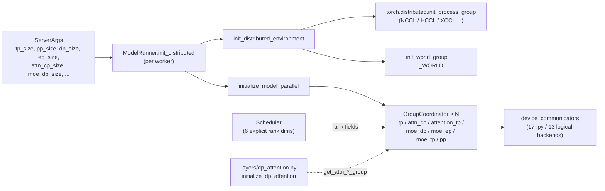

# `srt/distributed` — Distributed parallel infrastructure module

## Summary

`srt/distributed/`（**22** `.py` 文件 / ~265 KB）= **5 顶层 .py + 17 device_communicators .py**。在 PyTorch `torch.distributed` 之上提供：(a) **`GroupCoordinator` 进程组封装** + 多种子组（`tp` / `attn_cp` / `attention_tp` / `moe_dp` / `moe_ep` / `moe_tp` / `pp`）；(b) **多硬件 device communicator**（pynccl / custom allreduce / pymscclpp / torch_symm_mem / NPU/XPU/HPU / Mooncake transfer engine / SHM broadcast 共 13 个逻辑后端 / 17 个 .py）；(c) **`init_distributed_environment` → `initialize_model_parallel`** 标准初始化序列，由 [`ModelRunner.init_distributed`](d:\design\sglang\python\sglang\srt\model_executor\model_runner.py) 在每 worker 启动时调用。

> synthesis: 与 **vLLM** [`vllm/distributed/`](d:\design\vllm\vllm\distributed) 风格高度同源（都是 Megatron 衍生的 `parallel_state` + `GroupCoordinator` + 多 communicator backend），SGLang 在 NPU/XPU/HPU 等非 CUDA 硬件上铺得更细；与 **MindIE** [`runtime/utils/distributed/`](d:\design\MindIE-LLM\mindie_llm\runtime\utils\distributed) 的细粒度 `ParallelType` enum + HCCL/Gloo 双层架构不同——SGLang **不**枚举并行类型，而是按"组"组合维度。

> **边界**：`srt/eplb/` 与 `srt/elastic_ep/` 是**独立模块**（详见对应 dimensions.md cell）；本页仅覆盖 `srt/distributed/`。**DP-attention** 在 [`layers/dp_attention.py`](d:\design\sglang\python\sglang\srt\layers\dp_attention.py)，通过 `get_attn_*_group` 等 API **调用本模块**（详见该文件 import 区 [L13-25](d:\design\sglang\python\sglang\srt\layers\dp_attention.py)）。深度三方对比详见 [`comparison/topics/distributed.md`](../../comparison/topics/distributed.md)（9 子维度）。

## Sources

| 区域 | 锚点 |
|---|---|
| 模块根（22 `.py`） | [d:\design\sglang\python\sglang\srt\distributed](d:\design\sglang\python\sglang\srt\distributed) |
| 进程组核心 | [parallel_state.py](d:\design\sglang\python\sglang\srt\distributed\parallel_state.py)（`init_distributed_environment` L1636-1707 / `initialize_model_parallel` L1710-1981 / `GroupCoordinator` L193-647+） |
| 通信封装 | [communication_op.py](d:\design\sglang\python\sglang\srt\distributed\communication_op.py)（`tensor_model_parallel_*`、`get_attn_tp_group`、`get_moe_*_group` 等） |
| 工具 | [utils.py](d:\design\sglang\python\sglang\srt\distributed\utils.py)（`set_global_tcp_store` L24-54 / `get_pp_indices` / `StatelessProcessGroup`） |
| 朴素分布式 | [naive_distributed.py](d:\design\sglang\python\sglang\srt\distributed\naive_distributed.py)（基于文件 rendezvous 的 `NaiveDistributed`） |
| 包导出 | [__init__.py](d:\design\sglang\python\sglang\srt\distributed\__init__.py) |
| 集成入口（ModelRunner） | [model_executor/model_runner.py:1054-1107](d:\design\sglang\python\sglang\srt\model_executor\model_runner.py) |
| Scheduler rank 维度 | [managers/scheduler.py:337-356](d:\design\sglang\python\sglang\srt\managers\scheduler.py) |
| 配置 | [server_args.py:372-455, 527, 641](d:\design\sglang\python\sglang\srt\server_args.py) |
| 姊妹模块 handoff | [layers/dp_attention.py:13-25](d:\design\sglang\python\sglang\srt\layers\dp_attention.py) |
| C++ 算子绑定（CPU SHM allreduce） | [sgl-kernel/csrc/cpu/torch_extension_cpu.cpp:315, 582-583](d:\design\sglang\python\sglang\kernels\aot\csrc\cpu\torch_extension_cpu.cpp) |

## Architecture / Data flow

**初始化链**：[`ModelRunner.init_distributed`](d:\design\sglang\python\sglang\srt\model_executor\model_runner.py)（[L1054-1072](d:\design\sglang\python\sglang\srt\model_executor\model_runner.py)）调用 `init_distributed_environment` 后调用 `initialize_model_parallel(...)`，参数来自 `ServerArgs`（`tp_size`、`pp_size`、`dp_size`→`attention_data_parallel_size`、`ep_size`、`attn_cp_size`、`moe_dp_size`）。

**全局 TCPStore**（可选）：`moe_a2a_backend == "nixl"` 时在 [parallel_state.py:1686-1688](d:\design\sglang\python\sglang\srt\distributed\parallel_state.py) 创建，供 NIXL 等协调；[`utils.py:24-54`](d:\design\sglang\python\sglang\srt\distributed\utils.py) 提供 `set_global_tcp_store` / `get_global_tcp_store`。

## File inventory（22 文件）

### 顶层（5）

| 文件 | 角色 |
|---|---|
| [parallel_state.py](d:\design\sglang\python\sglang\srt\distributed\parallel_state.py) | `GroupCoordinator`、初始化 / 销毁、各种 rank API、graph capture 钩子 |
| [communication_op.py](d:\design\sglang\python\sglang\srt\distributed\communication_op.py) | `tensor_model_parallel_*`、`get_attn_tp_group` / `get_moe_*_group` 用户级封装 |
| [utils.py](d:\design\sglang\python\sglang\srt\distributed\utils.py) | TCPStore、`get_pp_indices`、`StatelessProcessGroup`、张量切分工具 |
| [naive_distributed.py](d:\design\sglang\python\sglang\srt\distributed\naive_distributed.py) | 基于文件 rendezvous 的 `NaiveDistributed`（无 NCCL，可能仅工具/测试） |
| [__init__.py](d:\design\sglang\python\sglang\srt\distributed\__init__.py) | re-export communication_op / parallel_state / utils |

### `device_communicators/`（17）

| 文件 | 用途 / Backend |
|---|---|
| `pynccl.py` + `pynccl_wrapper.py` + `pynccl_allocator.py` | PyNccl 路径 + 对称内存池（NCCL 主路径，3 文件） |
| `custom_all_reduce.py` + `custom_all_reduce_ops.py` + `custom_all_reduce_utils.py` + `custom_all_reduce_v2.py` | IPC / 自定义 allreduce（**4 文件**） |
| `cuda_wrapper.py` | CUDA C-API 封装 |
| `quick_all_reduce.py` | AMD/ROCm 补充路径 |
| `pymscclpp.py` | MSCCL++（graph 场景） |
| `torch_symm_mem.py` | 对称内存 allreduce |
| `npu_communicator.py` / `xpu_communicator.py` / `hpu_communicator.py` | 非 CUDA 设备通信（NPU / XPU / HPU） |
| `shm_broadcast.py` | `MessageQueue` SHM 广播 |
| `mooncake_transfer_engine.py` | Mooncake 传输引擎（与 mooncake disagg backend 协同） |
| `all_reduce_utils.py` | 路径选择 / 工具（被 custom 引用） |

> synthesis: **17 .py 文件 / 13 逻辑后端** 的差异来自 `custom_all_reduce` 拆为 4 文件 + `pynccl` 拆为 3 文件——这与 [`comparison/topics/distributed.md`](../../comparison/topics/distributed.md) §3 中"SGLang 12+ device_communicators"的统计是按"逻辑后端 / 命名 group"计；本页改用"文件数 17 / 逻辑后端 13"双维度更精确。

## Process groups & ranks

### `init_distributed_environment` 流程

- 若未初始化，[parallel_state.py:1677-1684](d:\design\sglang\python\sglang\srt\distributed\parallel_state.py) 调用 `torch.distributed.init_process_group`；NPU 上可对 MoE 相关组注入 HCCL 选项 [L72-87](d:\design\sglang\python\sglang\srt\distributed\parallel_state.py)。
- 随后构建 **world** `GroupCoordinator`：[L1700-1707](d:\design\sglang\python\sglang\srt\distributed\parallel_state.py)。
- **默认 backend 映射**：[parallel_state.py:1567-1578](d:\design\sglang\python\sglang\srt\distributed\parallel_state.py)：`cuda → nccl` / `npu → hccl` / `xpu → xccl` / `hpu → hccl` 等。

### `initialize_model_parallel` 与组名

同函数内创建（或复用 `_TP`）的组包括：**`tp`** / **`attn_cp`** / **`attention_tp`** / **`moe_dp`** / **`moe_ep`** / **`moe_tp`** / **`pp`**，逻辑见 [parallel_state.py:1777-1981](d:\design\sglang\python\sglang\srt\distributed\parallel_state.py)。`attn_tp_size` / `attn_cp_size` / `attn_dp_size` 分解公式见 [L1816-1818](d:\design\sglang\python\sglang\srt\distributed\parallel_state.py)。

### 主要 getter API

| API | 锚点 | 含义 |
|---|---|---|
| `get_world_group()` | [parallel_state.py:1372-1374](d:\design\sglang\python\sglang\srt\distributed\parallel_state.py) | 全局 world |
| `get_tp_group()` | [parallel_state.py:1447-1454](d:\design\sglang\python\sglang\srt\distributed\parallel_state.py) | TP；PD-Mux 下可切到 prefill TP |
| `get_attn_tp_group()` | [parallel_state.py:1457-1461](d:\design\sglang\python\sglang\srt\distributed\parallel_state.py) | Attention 子空间 TP |
| `get_attn_cp_group()` | [parallel_state.py:1464-1468](d:\design\sglang\python\sglang\srt\distributed\parallel_state.py) | Attention context parallel |
| `get_moe_dp_group()` / `get_moe_ep_group()` / `get_moe_tp_group()` | [parallel_state.py:1476-1488](d:\design\sglang\python\sglang\srt\distributed\parallel_state.py) | MoE 三维子组 |
| `get_pp_group()` | [parallel_state.py:1497-1499](d:\design\sglang\python\sglang\srt\distributed\parallel_state.py) | PP |

### Scheduler 6 个显式 rank 维度

[`Scheduler.__init__`](d:\design\sglang\python\sglang\srt\managers\scheduler.py) 显式接收 **`tp_rank` / `moe_ep_rank` / `pp_rank` / `attn_cp_rank` / `moe_dp_rank` / `dp_rank`**（[L337-342](d:\design\sglang\python\sglang\srt\managers\scheduler.py)），同处设置 `attn_cp_size` / `moe_dp_size`。另由 `compute_dp_attention_world_info` 派生 **`attn_tp_rank` / `attn_tp_size` / `attn_dp_rank`**（[L391-400](d:\design\sglang\python\sglang\srt\managers\scheduler.py)），与 [`comparison/topics/distributed.md`](../../comparison/topics/distributed.md)"Scheduler 显式 6 rank 维度 + DP-attention 派生"一致。

> synthesis: **Scheduler 6 个 rank 形参**与 **`parallel_state` 7+ 个组**是不同粒度：前者是"调度进程身份"（应用层），后者是"torch 进程组拓扑"（系统层）。前者由 [`DataParallelController`](../entities/DataParallelController.md) / launcher 注入；后者由 `ModelRunner` 在每 worker 启动时构造。

## Device communicators（13 logical backends / 17 .py）

`GroupCoordinator.__init__` 中按设备与 flag 懒加载各 communicator，见 [parallel_state.py:315-439](d:\design\sglang\python\sglang\srt\distributed\parallel_state.py)。

| Backend / 能力 | 文件 | 用途 | 加载锚点 |
|---|---|---|---|
| **PyNccl** | `pynccl.py` + `pynccl_wrapper.py` + `pynccl_allocator.py` | NCCL 路径 + 对称内存池 | [parallel_state.py:332-360](d:\design\sglang\python\sglang\srt\distributed\parallel_state.py) |
| **Custom allreduce** | `custom_all_reduce*.py`（4 文件）+ `custom_all_reduce_ops.py` + `cuda_wrapper.py` | IPC/自定义 allreduce | [parallel_state.py:326-378](d:\design\sglang\python\sglang\srt\distributed\parallel_state.py) |
| **Quick allreduce（ROCm）** | `quick_all_reduce.py` | AMD 补充路径 | [parallel_state.py:385-396](d:\design\sglang\python\sglang\srt\distributed\parallel_state.py) |
| **PyMscclpp** | `pymscclpp.py` | MSCCL++ / graph 场景 | [parallel_state.py:362-367](d:\design\sglang\python\sglang\srt\distributed\parallel_state.py) |
| **Torch symm mem** | `torch_symm_mem.py` | 对称内存 allreduce | [parallel_state.py:400-405](d:\design\sglang\python\sglang\srt\distributed\parallel_state.py) |
| **HPU / XPU / NPU** | `hpu_communicator.py` / `xpu_communicator.py` / `npu_communicator.py` | 非 CUDA 设备通信 | [parallel_state.py:407-428](d:\design\sglang\python\sglang\srt\distributed\parallel_state.py) |
| **SHM broadcast / MQ** | `shm_broadcast.py` | `MessageQueue` SHM 广播 | [parallel_state.py:430-438](d:\design\sglang\python\sglang\srt\distributed\parallel_state.py) |
| **Mooncake** | `mooncake_transfer_engine.py` | Mooncake 传输引擎（与 disagg mooncake 协同） | `get_mooncake_transfer_engine` [parallel_state.py:1506-1515](d:\design\sglang\python\sglang\srt\distributed\parallel_state.py) |
| **utils** | `all_reduce_utils.py` | 辅助 / 路径选择 | （被 custom 引用） |

`all_reduce` 调度顺序（含 CPU 上 `sgl_kernel.shm_allreduce`）见 [parallel_state.py:564-622](d:\design\sglang\python\sglang\srt\distributed\parallel_state.py)。

## CLI / config 字段

| 字段 | 锚点 | 与 `initialize_model_parallel` 的对应 |
|---|---|---|
| `tp_size` | [server_args.py:372](d:\design\sglang\python\sglang\srt\server_args.py) | `tensor_model_parallel_size` |
| `pp_size` | [server_args.py:373](d:\design\sglang\python\sglang\srt\server_args.py) | `pipeline_model_parallel_size` |
| `dp_size` | [server_args.py:446](d:\design\sglang\python\sglang\srt\server_args.py) | `attention_data_parallel_size` [model_runner.py:1065](d:\design\sglang\python\sglang\srt\model_executor\model_runner.py) |
| `ep_size` | [server_args.py:527](d:\design\sglang\python\sglang\srt\server_args.py) | `expert_model_parallel_size` [model_runner.py:1067](d:\design\sglang\python\sglang\srt\model_executor\model_runner.py) |
| `attn_cp_size` | [server_args.py:449](d:\design\sglang\python\sglang\srt\server_args.py) | `attention_context_model_parallel_size` [model_runner.py:1068](d:\design\sglang\python\sglang\srt\model_executor\model_runner.py) |
| `moe_dp_size` | [server_args.py:450](d:\design\sglang\python\sglang\srt\server_args.py) | `moe_data_model_parallel_size` [model_runner.py:1069](d:\design\sglang\python\sglang\srt\model_executor\model_runner.py) |
| `dist_timeout` | [server_args.py:385](d:\design\sglang\python\sglang\srt\server_args.py) | 传入 `init_distributed_environment` [model_runner.py:1060](d:\design\sglang\python\sglang\srt\model_executor\model_runner.py) |
| `dist_init_addr` / `nnodes` / `node_rank` | [server_args.py:453-455](d:\design\sglang\python\sglang\srt\server_args.py) | 与 `dist_init_method` 构造 [model_runner.py:1020-1029](d:\design\sglang\python\sglang\srt\model_executor\model_runner.py) |
| `enable_dp_attention` | [server_args.py:641](d:\design\sglang\python\sglang\srt\server_args.py) | 与 `initialize_dp_attention` 联调 [model_runner.py:1073-1076](d:\design\sglang\python\sglang\srt\model_executor\model_runner.py) |
| `disable_custom_all_reduce` / `enable_mscclpp` / `enable_torch_symm_mem` | 由 [model_runner.py:1030-1032](d:\design\sglang\python\sglang\srt\model_executor\model_runner.py) 映射到 `set_custom_all_reduce` 等 | [parallel_state.py:1552-1564](d:\design\sglang\python\sglang\srt\distributed\parallel_state.py) |

## Scheduler / ModelRunner 集成

- **ModelRunner**：完成 `init_distributed_environment` + `initialize_model_parallel` 后，缓存 `get_tp_group()` / `get_pp_group()` / `get_attention_tp_group()`（[model_runner.py:1105-1107](d:\design\sglang\python\sglang\srt\model_executor\model_runner.py)），并在多 GPU 时 warm up `get_tp_group().device_group`（[model_runner.py:1086-1090](d:\design\sglang\python\sglang\srt\model_executor\model_runner.py)）。
- **Scheduler**：构造参数承载 6 维 rank（见上）；**不直接 import** `parallel_state`，rank 由上层注入；与 `parallel_state` 衔接在 **ModelRunner 初始化进程组** + **layers（含 dp_attention）** 使用 `get_*_group()`。

## §跨子系统引用（§5 step 3）

按 [AGENTS.md §5 step 3](../../AGENTS.md#5-ingest-工作流) 5 类全仓库 grep。

### 1. 跨语言绑定（C++ / sgl-kernel）

- Python 符号 `parallel_state` / `init_distributed_environment` / `get_tp_group` / `get_pp_group` / `get_world_group`：**在 [`d:\design\sglang\sgl-kernel\`](d:\design\sglang\python\sglang\kernels\aot) 全 C++ 树 grep 0 命中**
- **算子级**绑定（**部分跨语言**）：`shm_allreduce` 在 [sgl-kernel/csrc/cpu/torch_extension_cpu.cpp:582-583](d:\design\sglang\python\sglang\kernels\aot\csrc\cpu\torch_extension_cpu.cpp) 注册；调用点 [parallel_state.py:566](d:\design\sglang\python\sglang\srt\distributed\parallel_state.py) `torch.ops.sgl_kernel.shm_allreduce`。**这是本模块唯一的 C++ 算子绑定**——绑定关系是算子名 `sgl_kernel::shm_allreduce`，不是 Python 模块名。

> synthesis: **`shm_allreduce` 是 SGLang `distributed/` 唯一的 sgl-kernel C++ 算子依赖**——其余 communicator 全靠 PyTorch 原生 / 第三方 Python 库（pynccl / mooncake / nixl / mscclpp）。

### 2. 协作伙伴跨子系统引用

| 协作类 / 函数 | grep 范围 | 命中 |
|---|---|---|
| `init_distributed_environment` / `initialize_model_parallel` | `d:\design\sglang\python\` | 主调用点 [model_executor/model_runner.py:1054-1072](d:\design\sglang\python\sglang\srt\model_executor\model_runner.py)；测试 [test/srt/ascend/test_embed_interpolate_unittest.py](d:\design\sglang\test\srt\ascend\test_embed_interpolate_unittest.py)、[python/sglang/test/test_flashinfer_dispatcher.py](d:\design\sglang\python\sglang\test\test_flashinfer_dispatcher.py) 等 |
| `get_pp_group()` / `get_tp_group()` | `d:\design\sglang\python\` | 大量模型文件（`srt/models/qwen2.py` 等）+ `layers/` |
| `get_attn_tp_group` / `get_attn_cp_group` | 同上 | [layers/dp_attention.py:13-25](d:\design\sglang\python\sglang\srt\layers\dp_attention.py) 主要消费者 |
| Scheduler 6 rank 形参 | `managers/scheduler.py` | [L337-356](d:\design\sglang\python\sglang\srt\managers\scheduler.py) |

### 3. 配置 / IPC 共享数据结构

- **ServerArgs 并行字段**：[server_args.py:372-455](d:\design\sglang\python\sglang\srt\server_args.py) / [527](d:\design\sglang\python\sglang\srt\server_args.py) / [641](d:\design\sglang\python\sglang\srt\server_args.py)
- **全局 TCPStore**：`utils.set_global_tcp_store` [utils.py:24-33](d:\design\sglang\python\sglang\srt\distributed\utils.py)；nixl 路径自动注册 [parallel_state.py:1686-1688](d:\design\sglang\python\sglang\srt\distributed\parallel_state.py)

### 4. 测试覆盖反查

- [`d:\design\sglang\test\registered\distributed\`](d:\design\sglang\test\registered\distributed) 下 **13** 个测试文件（如 `test_parallel_state.py`、`test_dp_attention.py`、`test_data_parallelism.py`）
- `test/srt/ascend/test_embed_interpolate_unittest.py`、`python/sglang/test/test_flashinfer_dispatcher.py` 等引用 `init_distributed_environment`

### 5. doc / config / yaml 反查

- 多节点：[`docs/references/multi_node_deployment/multi_node.md`](d:\design\sglang\docs\references\multi_node_deployment\multi_node.md)（`tp_size` 等）
- Ascend：[`docs/platforms/ascend/ascend_npu_support_features.md`](d:\design\sglang\docs\platforms\ascend\ascend_npu_support_features.md)（`--tensor-parallel-size` 等）
- 环境变量：[`docs/references/environment_variables.md`](d:\design\sglang\docs\references\environment_variables.md)
- benchmark：[`docs/developer_guide/benchmark_and_profiling.md`](d:\design\sglang\docs\developer_guide\benchmark_and_profiling.md)
- **无单独 `srt/distributed` 深度文档**——分布式行为分散在部署 / 平台文档中

## 跨项目对照（synthesis）

| 维度 | MindIE | vLLM | SGLang（本模块） |
|---|---|---|---|
| 进程组模型 | `ParallelInfoManager` + `ParallelType` enum（12 种） | `parallel_state.py` + `GroupCoordinator` + 子组 | `parallel_state.py` + `GroupCoordinator` + **7 类子组** + `attn_*` / `moe_*` 拆分 |
| device_communicators 规模 | HCCL + Gloo（C++ side），无 Python 多 backend 抽象 | 18 文件（[`vllm/distributed/device_communicators/`](d:\design\vllm\vllm\distributed\device_communicators)） | **17 文件 / 13 逻辑后端** |
| 调度可见 rank | `dp_rank_id` 等少数字段 | scheduler 不显式承载 rank（在 worker 层） | **Scheduler 6 形参 + DP-attention 派生**（最显式） |
| EPLB / Elastic-EP | ❌ | ✅ | ✅（**独立模块** `srt/eplb/` + `srt/elastic_ep/`，非本模块） |
| 跨语言 C++ 绑定 | C++ side 主导（process_group.h） | 0 自研 C++ kernel for distributed | **仅 1 算子** `sgl_kernel::shm_allreduce`（CPU SHM allreduce） |

详细 9 子维度对比（进程组抽象 / TP collectives / PP 完成度 / DP 双语义 / EP+EPLB+Elastic / scheduler rank 维度数 / CP-SP 链回 / 目录布局 / 与 PD 优化关联）见 [`comparison/topics/distributed.md`](../../comparison/topics/distributed.md)；维度索引见 [`comparison/dimensions.md §dim-distributed`](../../comparison/dimensions.md)。

## Increment 2026-08-18 (06f32bab → f7101b0a)

- **VMM 辅助迁出本模块**：`distributed/device_communicators/vmm_utils.py` → 顶层 [`srt/cuda_vmm_utils.py`](d:\design\sglang\python\sglang\srt\cuda_vmm_utils.py)（迁移 + 大幅扩展，`git diff -M` 记 +414 行；移动发生在 commit `df986c4d5e` "Consolidate CUDA VMM allocation helpers" #34199，import 修正在 commit `13aeb91b6e` "[Fix] Update multimodal CUDA VMM helper import" #34358）。synthesis: 迁出的动机是该 helper 的消费方已远超 distributed——全仓 grep `cuda_vmm_utils` 命中 [`multimodal/transport/memory_pool.py`](d:\design\sglang\python\sglang\srt\multimodal\transport\memory_pool.py)、[`mem_cache/kv_vmm_backing.py`](d:\design\sglang\python\sglang\srt\mem_cache\kv_vmm_backing.py)、`layers/moe/dwdp/` 4 文件、[`utils/cuda_vmm_transport_utils.py`](d:\design\sglang\python\sglang\srt\utils\cuda_vmm_transport_utils.py)，本模块内仍有 [`custom_all_reduce_utils.py`](d:\design\sglang\python\sglang\srt\distributed\device_communicators\custom_all_reduce_utils.py) / [`custom_all_reduce_v2.py`](d:\design\sglang\python\sglang\srt\distributed\device_communicators\custom_all_reduce_v2.py) 两个使用方。
- **文件数重核**：`git ls-tree` @06f32bab = **29**（与 index 记录一致）→ HEAD = **28**（-1，即 vmm_utils 迁出）。正文「22 `.py` / 17 device_communicators」为 2026-04-19 旧口径。
- 其余 churn：[`parallel_state.py`](d:\design\sglang\python\sglang\srt\distributed\parallel_state.py) +156 行、[`bootstrap.py`](d:\design\sglang\python\sglang\srt\distributed\bootstrap.py) +67 行（该文件 pin 时已存在，本期为扩展非新增；文件清单 diff 唯一变化即 vmm_utils 迁出）、custom allreduce 小改；正文 `GroupCoordinator` 主锚点未重核，保持 stale。

## Notes / Caveats

> [!todo] VERIFY: pin 从 `34fef07a` → `06f32bab`（2026-08-10 increment）后本页未深 verify；文件数量/行号可能漂移。优先对照 [entities/Scheduler.md](../entities/Scheduler.md) / 新模块页。

> [!warning] CONTRADICTION（数字精度）：~~[`comparison/topics/distributed.md §3.4 PP/DP/EP 完成度对比`](../../comparison/topics/distributed.md) 写"SGLang 12+ 个 device_communicators"——本页确认 **17 .py 文件 / 13 逻辑后端**（`custom_all_reduce` 拆 4 文件 + `pynccl` 拆 3 文件）。两种统计口径都对，**精确措辞**应写"17 .py / 13 逻辑后端"双维度（同条 marker 已在 [`comparison/topics/distributed.md`](../../comparison/topics/distributed.md) 加 sync）。~~
> **RESOLVED 2026-04-19**: 对比页 [comparison/topics/distributed.md:116](../../comparison/topics/distributed.md) 已采用同步措辞 "**17 .py / 13 逻辑后端**"，两侧描述一致；`comparison` 表 L82/255/264-268 也写为 "22 .py（含 device_communicators）"，无残留 "12+" 字样。

> [!todo] VERIFY: ~~[`naive_distributed.py`](d:\design\sglang\python\sglang\srt\distributed\naive_distributed.py) 的生产路径调用方——是否仅供测试 / 离线工具？需 grep `NaiveDistributed` / `get_naive_distributed` 全树定位（本轮未读完）。~~
> **RESOLVED 2026-04-19**: 实际为 **生产代码**，`get_naive_distributed()` 在权重 offload 与 host shared memory 路径中被调用（[utils/offloader.py:9-12, 376-543](d:\design\sglang\python\sglang\srt\utils\offloader.py)、[utils/host_shared_memory.py:10, 34-51](d:\design\sglang\python\sglang\srt\utils\host_shared_memory.py)），不是测试/工具专用。

> [!todo] VERIFY: ~~[`ensure_model_parallel_initialized`](d:\design\sglang\python\sglang\srt\distributed\parallel_state.py)（约 L2033）签名与 `initialize_model_parallel` 不完全一致（缺 attn 参数），调用方若用此函数预热可能漏配 attn_cp_size——需查证用例。~~
> **RESOLVED 2026-04-19**: 函数定义于 [parallel_state.py:2033-2063](d:\design\sglang\python\sglang\srt\distributed\parallel_state.py)，仅 `tensor/expert/pipeline + backend` 4 形参；全树 grep 仅在两处 docstring（[parallel_state.py:12](d:\design\sglang\python\sglang\srt\distributed\parallel_state.py)、[multimodal_gen/runtime/distributed/parallel_state.py:21](d:\design\sglang\python\sglang\multimodal_gen\runtime\distributed\parallel_state.py)）出现，**没有任何运行时调用**——属遗留/示例代码，调用方实际全部走 `initialize_model_parallel`，不会漏配 attn_cp_size。

> [!todo] VERIFY: ~~NPU 上 `init_process_group` 注入 HCCL 选项（[parallel_state.py:72-87](d:\design\sglang\python\sglang\srt\distributed\parallel_state.py)）的精确触发条件——MoE 相关？所有组都注入还是只 `tp` / `attention_tp` 注入？~~
> **RESOLVED 2026-04-19**: [`get_torch_distributed_pg_options`](d:\design\sglang\python\sglang\srt\distributed\parallel_state.py) 仅在 `_is_npu` 为真时生效；`group_name is None`（默认组）或 `"moe" in group_name` 才返回 `ProcessGroupHCCL.Options`（buffer 大小由 `DEEPEP_HCCL_BUFFSIZE` / `HCCL_BUFFSIZE` 决定，默认 200）；普通 `tp` / `attention_tp` 等非 MoE 命名组返回 `None`，不注入 HCCL 选项。

## See also

- [sglang/entities/Scheduler.md](../entities/Scheduler.md) — Scheduler 6 rank 形参
- [sglang/entities/TpModelWorker.md](../entities/TpModelWorker.md) — Worker 层 ModelRunner 持有
- [sglang/entities/DataParallelController.md](../entities/DataParallelController.md) — DP 路由（独立子进程）
- [sglang/modules/model_executor.md](model_executor.md) — `ModelRunner.init_distributed` 主消费方
- [sglang/modules/managers.md](managers.md) — Scheduler 所属
- [comparison/topics/distributed.md](../../comparison/topics/distributed.md) — 三家 9 子维度深度对比
- [comparison/dimensions.md §dim-distributed](../../comparison/dimensions.md)
- 姊妹模块（**非本页范围**）：[`srt/eplb/`](d:\design\sglang\python\sglang\srt\eplb)、[`srt/elastic_ep/`](d:\design\sglang\python\sglang\srt\elastic_ep)、[`layers/dp_attention.py`](d:\design\sglang\python\sglang\srt\layers\dp_attention.py)
