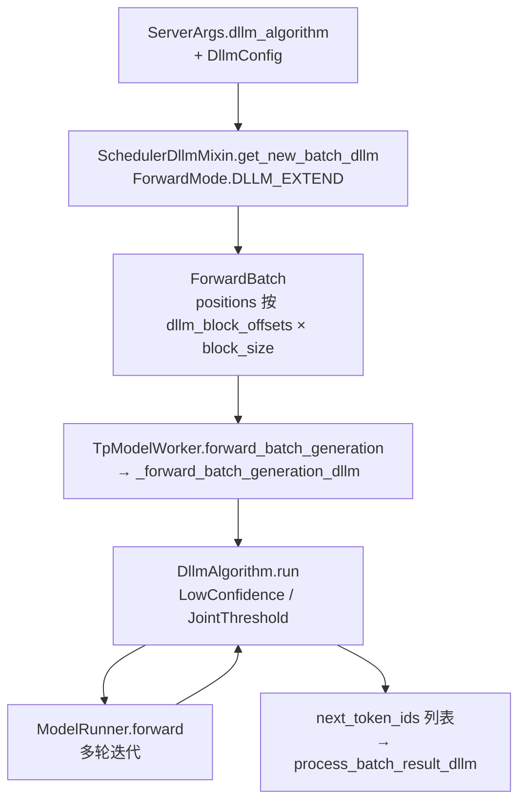

# `srt/dllm` — Diffusion LLM（扩散式语言模型）调度与解码

## Summary

[`dllm`](d:\design\sglang\python\sglang\srt\dllm) 目录含 **7** 个 `.py`（Glob 核对），**无** 包根级 `__init__.py`（仅有 [`algorithm/__init__.py`](d:\design\sglang\python\sglang\srt\dllm\algorithm\__init__.py)）。职责分为三块：

1. [`DllmConfig`](d:\design\sglang\python\sglang\srt\dllm\config.py) 从 [`ServerArgs`](d:\design\sglang\python\sglang\srt\server_args.py) 解析算法名、按 HF `architectures[0]` 绑定 `block_size` / `mask_id`；
2. [`SchedulerDllmMixin`](d:\design\sglang\python\sglang\srt\dllm\mixin\scheduler.py) + [`DllmManager`](d:\design\sglang\python\sglang\srt\dllm\mixin\scheduler.py) 在调度器侧维护 DLLM 的 waiting/staging 队列与 [`ForwardMode.DLLM_EXTEND`](d:\design\sglang\python\sglang\srt\model_executor\forward_batch_info.py)；
3. [`LowConfidence`](d:\design\sglang\python\sglang\srt\dllm\algorithm\low_confidence.py) / [`JointThreshold`](d:\design\sglang\python\sglang\srt\dllm\algorithm\joint_threshold.py) 在 [`TpModelWorker._forward_batch_generation_dllm`](d:\design\sglang\python\sglang\srt\managers\tp_worker.py) 中**多次调用** [`ModelRunner.forward`](d:\design\sglang\python\sglang\srt\model_executor\model_runner.py)，用 **argmax + 置信度阈值**（及 JointThreshold 的 T2T 编辑）迭代填 mask，**不**走自回归的 `model_runner.sample` 路径。

## Sources

| 区域 | 锚点 |
|---|---|
| HF 架构 → block/mask | [`config.py:34-46`](d:\design\sglang\python\sglang\srt\dllm\config.py) |
| 调度 / 队列 | [`mixin/scheduler.py:20-61`](d:\design\sglang\python\sglang\srt\dllm\mixin\scheduler.py)、[`mixin/scheduler.py:281-352`](d:\design\sglang\python\sglang\srt\dllm\mixin\scheduler.py) |
| Req 相位与 fill_ids | [`mixin/req.py:19-75`](d:\design\sglang\python\sglang\srt\dllm\mixin\req.py)、[`schedule_batch.py:948-1019`](d:\design\sglang\python\sglang\srt\managers\schedule_batch.py) |
| 算法注册 | [`algorithm/__init__.py:10-39`](d:\design\sglang\python\sglang\srt\dllm\algorithm\__init__.py) |
| 工厂 | [`algorithm/base.py:6-18`](d:\design\sglang\python\sglang\srt\dllm\algorithm\base.py) |
| LowConfidence 循环 | [`algorithm/low_confidence.py:23-101`](d:\design\sglang\python\sglang\srt\dllm\algorithm\low_confidence.py) |
| JointThreshold 循环 | [`algorithm/joint_threshold.py:26-136`](d:\design\sglang\python\sglang\srt\dllm\algorithm\joint_threshold.py) |
| Worker 分支 | [`tp_worker.py:431-465`](d:\design\sglang\python\sglang\srt\managers\tp_worker.py) |
| Forward 模式 / positions | [`forward_batch_info.py:106-192`](d:\design\sglang\python\sglang\srt\model_executor\forward_batch_info.py)、[`forward_batch_info.py:535-547`](d:\design\sglang\python\sglang\srt\model_executor\forward_batch_info.py) |
| FlashInfer DLLM 元数据 | [`flashinfer_backend.py:134-136`](d:\design\sglang\python\sglang\srt\layers\attention\flashinfer_backend.py)、[`flashinfer_backend.py:669-697`](d:\design\sglang\python\sglang\srt\layers\attention\flashinfer_backend.py) |
| CLI / 推理约束 | [`server_args.py:3830-3898`](d:\design\sglang\python\sglang\srt\server_args.py)、[`server_args.py:5626-5638`](d:\design\sglang\python\sglang\srt\server_args.py) |
| 用户文档与示例模型表 | [`diffusion_language_models.md:1-112`](d:\design\sglang\docs\supported_models\text_generation\diffusion_language_models.md) |

## Architecture / Data flow

> synthesis: 整体是「调度器组 DLLM batch → `ForwardBatch` 带 mask 块与 block offset → `TpModelWorker` 若 `dllm_algorithm` 已配置则进入算法 `run()`，在 Python 侧循环多次 `forward` 并写回 `input_ids` → 返回 `next_token_ids` 列表供 scheduler 写回 `req`」，与自回归「单次 forward + sample 一 token」不同。

- **位置编码**：当 `batch.dllm_config` 非空时，[`ForwardBatch.init_new`](d:\design\sglang\python\sglang\srt\model_executor\forward_batch_info.py) 用每个请求的 `dllm_block_offset` 与 `block_size` 展开为连续 `positions`（[`forward_batch_info.py:536-547`](d:\design\sglang\python\sglang\srt\model_executor\forward_batch_info.py)）。
- **注意力 / KV 视角**：FlashInfer 在 `ForwardMode.DLLM_EXTEND` 下以 **prefill + ragged** 路径更新索引，并设 `prefix_lens=seq_lens - block_size`（[`flashinfer_backend.py:669-697`](d:\design\sglang\python\sglang\srt\layers\attention\flashinfer_backend.py)），用于与「整段序列上并行解码块」的形状对齐；**不是**经典 decode 单步追加拓扑。
- **KV 与 fast path**：[`LowConfidence.run`](d:\design\sglang\python\sglang\srt\dllm\algorithm\low_confidence.py) 在 **当前无 mask token** 时单次 `forward` 并直接返回（注释写明用于 **save kv cache**，见 [`low_confidence.py:34-40`](d:\design\sglang\python\sglang\srt\dllm\algorithm\low_confidence.py)）；有 mask 时则在循环内反复 `forward`，[`JointThreshold`](d:\design\sglang\python\sglang\srt\dllm\algorithm\joint_threshold.py) 还在末步按需再 `forward` 以 **持久化 KV**（[`joint_threshold.py:53-56`](d:\design\sglang\python\sglang\srt\dllm\algorithm\joint_threshold.py)、[`joint_threshold.py:127-129`](d:\design\sglang\python\sglang\srt\dllm\algorithm\joint_threshold.py)）。

## File inventory（7 `.py`）

| 文件 | 职责摘要 |
|---|---|
| [`config.py`](d:\design\sglang\python\sglang\srt\dllm\config.py) | `DllmConfig`：`from_server_args`、HF 架构表 `DLLM_PARAMS`、可选 YAML `algorithm_config` |
| [`mixin/scheduler.py`](d:\design\sglang\python\sglang\srt\dllm\mixin\scheduler.py) | `SchedulerDllmMixin`、`DllmManager`、DLLM batch 构造与结果处理 |
| [`mixin/req.py`](d:\design\sglang\python\sglang\srt\dllm\mixin\req.py) | `DllmReqPhase`、`ReqDllmMixin`：相位、`fill_ids` 拼 mask 块 |
| [`algorithm/__init__.py`](d:\design\sglang\python\sglang\srt\dllm\algorithm\__init__.py) | `import_algorithms` 动态发现、`get_algorithm` |
| [`algorithm/base.py`](d:\design\sglang\python\sglang\srt\dllm\algorithm\base.py) | `DllmAlgorithm` 抽象壳 + `from_server_args` → `get_algorithm` |
| [`algorithm/low_confidence.py`](d:\design\sglang\python\sglang\srt\dllm\algorithm\low_confidence.py) | `LowConfidence`：每块最多 `block_size` 次迭代、阈值接受 |
| [`algorithm/joint_threshold.py`](d:\design\sglang\python\sglang\srt\dllm\algorithm\joint_threshold.py) | `JointThreshold`：M2T + T2T、`max_post_edit_steps`、`penalty_lambda` |

## Class breakdown

| 名称 | 位置 | 作用 |
|---|---|---|
| `DllmConfig` | [`config.py:7-75`](d:\design\sglang\python\sglang\srt\dllm\config.py) | 聚合 `algorithm`、`algorithm_config`、`block_size`、`mask_id`、`max_running_requests` |
| `SchedulerDllmMixin` | [`mixin/scheduler.py:20-279`](d:\design\sglang\python\sglang\srt\dllm\mixin\scheduler.py) | `get_new_batch_dllm`、`process_batch_result_dllm`、与 `PrefillAdder` 协作 |
| `DllmManager` | [`mixin/scheduler.py:281-352`](d:\design\sglang\python\sglang\srt\dllm\mixin\scheduler.py) | `waiting_queue` / `staging_queue`、prefill/decode 请求划分 |
| `DllmReqPhase` | [`mixin/req.py:12-16`](d:\design\sglang\python\sglang\srt\dllm\mixin\req.py) | staging/incoming × prefill/decode 四相 |
| `ReqDllmMixin` | [`mixin/req.py:19-75`](d:\design\sglang\python\sglang\srt\dllm\mixin\req.py) | `init_diffusion_llm`、`determine_dllm_phase`、`_init_fill_ids_for_dllm` |
| `DllmAlgorithm` | [`algorithm/base.py:6-18`](d:\design\sglang\python\sglang\srt\dllm\algorithm\base.py) | 保存 `block_size` / `mask_id`，工厂转具体算法类 |
| `LowConfidence` | [`low_confidence.py:14-101`](d:\design\sglang\python\sglang\srt\dllm\algorithm\low_confidence.py) | 默认 `threshold=0.95`（[`low_confidence.py:19-21`](d:\design\sglang\python\sglang\srt\dllm\algorithm\low_confidence.py)）；内层循环最多 `block_size` 次（[`low_confidence.py:51-91`](d:\design\sglang\python\sglang\srt\dllm\algorithm\low_confidence.py)） |
| `JointThreshold` | [`joint_threshold.py:12-136`](d:\design\sglang\python\sglang\srt\dllm\algorithm\joint_threshold.py) | `threshold`/`edit_threshold`/`max_post_edit_steps`/`penalty_lambda`；外层最多 `block_size + max_post_edit_steps` 次（[`joint_threshold.py:58-59`](d:\design\sglang\python\sglang\srt\dllm\algorithm\joint_threshold.py)） |

## Models supported（`DllmConfig` 显式架构）

[`DLLM_PARAMS`](d:\design\sglang\python\sglang\srt\dllm\config.py) 仅列出 **3** 个 HF `architectures[0]`，否则 `RuntimeError`（[`config.py:40-46`](d:\design\sglang\python\sglang\srt\dllm\config.py)）。实现类定义于 `srt/models/`：

| HF `architectures[0]` | `block_size` | `mask_id` | 模型实现文件（EntryClass） |
|---|---:|---:|---|
| `LLaDA2MoeModelLM` | 32 | 156895 | [`llada2.py` `LLaDA2MoeModelLM`](d:\design\sglang\python\sglang\srt\models\llada2.py) |
| `SDARForCausalLM` | 4 | 151669 | [`sdar.py` `SDARForCausalLM`](d:\design\sglang\python\sglang\srt\models\sdar.py) |
| `SDARMoeForCausalLM` | 4 | 151669 | [`sdar_moe.py` `SDARMoeForCausalLM`](d:\design\sglang\python\sglang\srt\models\sdar_moe.py) |

**文档中的示例权重 ID**（非 `DllmConfig` 硬编码，但与上表家族一致）见 [`diffusion_language_models.md:107-111`](d:\design\sglang\docs\supported_models\text_generation\diffusion_language_models.md)。

## Integration with `TpModelWorker.forward_batch_generation`

[`TpModelWorker`](d:\design\sglang\python\sglang\srt\managers\tp_worker.py) 在 [`forward_batch_generation`](d:\design\sglang\python\sglang\srt\managers\tp_worker.py) 开头若 [`is_dllm()`](d:\design\sglang\python\sglang\srt\managers\tp_worker.py) 为真，则 **直接** [`return self._forward_batch_generation_dllm(forward_batch)`](d:\design\sglang\python\sglang\srt\managers\tp_worker.py)，其中调用 [`self.dllm_algorithm.run(self.model_runner, forward_batch)`](d:\design\sglang\python\sglang\srt\managers\tp_worker.py) 并封装为 [`GenerationBatchResult`](d:\design\sglang\python\sglang\srt\managers\tp_worker.py)（[`tp_worker.py:431-441`](d:\design\sglang\python\sglang\srt\managers\tp_worker.py)）。**采样器**：该分支 **不** 调用同函数后半段的 `model_runner.sample`（自回归路径自 [`tp_worker.py:467`](d:\design\sglang\python\sglang\srt\managers\tp_worker.py) 起）；解码策略完全由算法类内部的 **argmax + softmax 置信度** 与（JointThreshold）**编辑规则**决定。

## CLI / config

| 项 | 源码位置 | 说明 |
|---|---|---|
| `ServerArgs.dllm_algorithm` / `dllm_algorithm_config` | [`server_args.py:593-594`](d:\design\sglang\python\sglang\srt\server_args.py) | 算法名为字符串；配置为 **YAML 文件路径** |
| CLI | [`server_args.py:5626-5638`](d:\design\sglang\python\sglang\srt\server_args.py) | `--dllm-algorithm`、`--dllm-algorithm-config` |
| 推理时约束 | [`server_args.py:3830-3898`](d:\design\sglang\python\sglang\srt\server_args.py) | AMD：禁 cuda graph、默认 triton attention；CUDA：cuda graph 时默认 `flashinfer`；关闭 overlap schedule、radix/LMCache/hicache、**强制 `pp_size=1`**、**disaggregation `null`**、LoRA off 等 |

## §跨子系统引用（5 类 grep 结果）

1. **sgl-kernel C++**（`d:\design\sglang\sgl-kernel\`）：`dllm` / `DLLM` / `diffusion` — **0 命中**（DLLM 逻辑在 Python + FlashInfer/Ascend 注意力路径，无专用 C++ 符号）。
2. **协作方 `from sglang.srt.dllm`**（`srt/` 且排除 `dllm/` 自身）：[`server_args.py`](d:\design\sglang\python\sglang\srt\server_args.py)、[`managers/tp_worker.py`](d:\design\sglang\python\sglang\srt\managers\tp_worker.py)、[`managers/scheduler.py`](d:\design\sglang\python\sglang\srt\managers\scheduler.py)、[`managers/schedule_policy.py`](d:\design\sglang\python\sglang\srt\managers\schedule_policy.py)、[`managers/schedule_batch.py`](d:\design\sglang\python\sglang\srt\managers\schedule_batch.py)、[`model_executor/cuda_graph_runner.py`](d:\design\sglang\python\sglang\srt\model_executor\cuda_graph_runner.py)、[`layers/attention/flashinfer_backend.py`](d:\design\sglang\python\sglang\srt\layers\attention\flashinfer_backend.py)、[`hardware_backend/npu/attention/ascend_backend.py`](d:\design\sglang\python\sglang\srt\hardware_backend\npu\attention\ascend_backend.py)（含 `forward_dllm`）。
3. **CLI / 配置**：[`server_args.py`](d:\design\sglang\python\sglang\srt\server_args.py) 使用字段名 `dllm_algorithm`；**无** `--enable-dllm` 字面开关（启用方式为使 `dllm_algorithm` 非空）。**无** `model_impl == "dllm"` 命中。
4. **Tests**（`d:\design\sglang\test\`）：[`test/registered/dllm/test_llada2_mini.py`](d:\design\sglang\test\registered\dllm\test_llada2_mini.py)、[`test/registered/dllm/test_llada2_mini_amd.py`](d:\design\sglang\test\registered\dllm\test_llada2_mini_amd.py)、[`test/registered/ascend/basic_function/dllm/test_npu_llada2_mini.py`](d:\design\sglang\test\registered\ascend\basic_function\dllm\test_npu_llada2_mini.py)（均含 `--dllm-algorithm LowConfidence`）。另：`test_zimage_turbo.py` 等为 **文生图 diffusion**，与 DLLM **不同题**。
5. **Docs**（`d:\design\sglang\docs\`）：[`docs/supported_models/text_generation/diffusion_language_models.md`](d:\design\sglang\docs\supported_models\text_generation\diffusion_language_models.md)、[`docs/supported_models/text_generation/index.rst`](d:\design\sglang\docs\supported_models\text_generation\index.rst) 引用。

## Numbers（核对）

| 指标 | 值 | 依据 |
|---|---:|---|
| `dllm/` 下 `.py` 文件数 | **7** | Glob：`config.py`、`mixin/*`×2、`algorithm/*`×4 |
| `DllmConfig` 支持的 HF 架构分支 | **3** | [`config.py:34-38`](d:\design\sglang\python\sglang\srt\dllm\config.py) |
| 内置解码算法实现 | **2** | `LowConfidence` + `JointThreshold`（[`algorithm/__init__.py`](d:\design\sglang\python\sglang\srt\dllm\algorithm\__init__.py) 动态注册） |

## Notes / Caveats

> [!todo] VERIFY: ~~用户提示中的 `--enable-dllm` / `is_dllm` 字段名与源码不完全一致；源码以 `ServerArgs.dllm_algorithm` 与 `Req.is_dllm()`（[`schedule_batch.py:1502-1503`](d:\design\sglang\python\sglang\srt\managers\schedule_batch.py)）为主。~~
> **RESOLVED 2026-04-19**: **`--enable-dllm` 在全 sglang 仓库 0 命中**（无此 CLI flag，启用方式为 `--dllm-algorithm <name>` 非空）。`is_dllm` 实测有 **2 处定义**：[`Req.is_dllm`](d:\design\sglang\python\sglang\srt\managers\schedule_batch.py)（L1502）+ [`TpModelWorker.is_dllm`](d:\design\sglang\python\sglang\srt\managers\tp_worker.py)（L428；语义为 `self.dllm_algorithm is not None`）。`is_dllm()` 是分发入口（[tp_worker.py L464-L465](d:\design\sglang\python\sglang\srt\managers\tp_worker.py)）；`ServerArgs.dllm_algorithm` 是配置入口。**结论**：以代码为准，无 `--enable-dllm`。

> [!warning] CONTRADICTION: ~~「Mercury / Dream」等名称未在 [`DllmConfig`](d:\design\sglang\python\sglang\srt\dllm\config.py) 的 `DLLM_PARAMS` 出现；若 wiki 总述提及，应标明为 **社区常用别名或未接入**，避免与源码表冲突。~~
> **RESOLVED 2026-04-19**: 已确认 [`DLLM_PARAMS`](d:\design\sglang\python\sglang\srt\dllm\config.py)（L34-L38）**仍只含 3 个**架构 — `LLaDA2MoeModelLM` / `SDARForCausalLM` / `SDARMoeForCausalLM`；不在表内则 [L46](d:\design\sglang\python\sglang\srt\dllm\config.py) `RuntimeError(f"Unknown diffusion LLM: {arch}")`。**Mercury / Dream 仍未接入**。本页表格已与源码一致；告警保留以提醒后续编辑者勿臆造。

## Cross-project synthesis（vLLM / MindIE）

在 `d:\design\vllm\` 与 `d:\design\MindIE-LLM\` 下对 `dllm`、`LLaDA`、`Dllm` 的 `*.py` grep — **0 命中**。

> synthesis: 在当前工作区快照中，**扩散式文本 LLM 服务路径可视为 SGLang 侧独有**（与 vLLM / MindIE 的 autoregressive 主路径对比），与 outlines jump-forward / EPD encode_server 同列为 SGLang-unique 设计点。

## See also

- [TpModelWorker.md](../entities/TpModelWorker.md) — `forward_batch_generation` 四分支之一
- [model_executor.md](model_executor.md) — Worker / `ModelRunner` 集成
- [managers.md](managers.md) — `Scheduler` mixin
- [sampling.md](sampling.md) — DLLM 不走 `model_runner.sample` 路径，与采样模块解耦
- [comparison/index.md](../../comparison/index.md)
